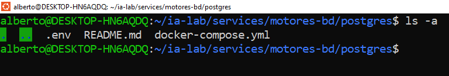
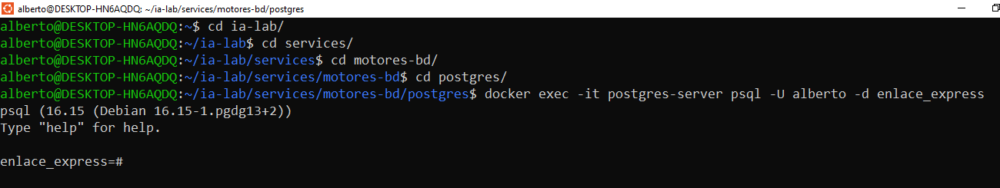
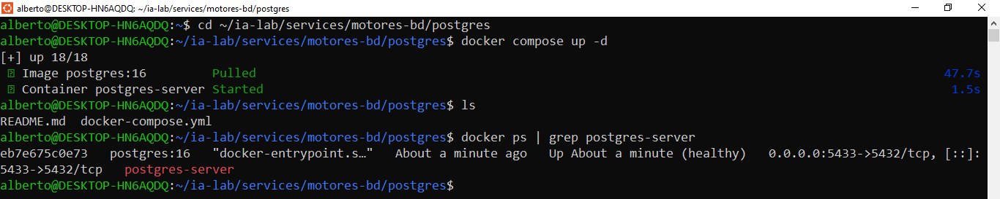

## 5. Paso 4: PostgreSQL

### 5.1 Crear docker-compose.yml

``` bash
cat > ~/ia-lab/services/motores-bd/postgres/docker-compose.yml << 'EOF'
services:
  postgres:
    image: postgres:16
    container_name: postgres-server
    restart: unless-stopped
    env_file:
      - .env
    ports:
      - "5433:5432"
    volumes:
      - ../../../data/postgres:/var/lib/postgresql/data
      - /mnt/c/academia/bd:/backups
    networks:
      - ia-lab-network
    healthcheck:
      test: ["CMD-SHELL", "pg_isready -U $$POSTGRES_USER"]
      interval: 10s
      timeout: 5s
      retries: 5
      start_period: 20s

networks:
  ia-lab-network:
    external: true
EOF
```

### 5.2 Crear .env

``` bash
cat > ~/ia-lab/services/motores-bd/postgres/.env << 'EOF'
TZ=America/Bogota
POSTGRES_DB=enlace_express
POSTGRES_USER=alberto
POSTGRES_PASSWORD=PostgreSQL5433
PGDATA=/var/lib/postgresql/data
EOF
```

### 5.3 Crear README.md

``` bash
cat > ~/ia-lab/services/motores-bd/postgres/README.md << 'EOF'
# PostgreSQL 17 - Motor de Base de Datos

> **Acceso remoto habilitado.** Puerto expuesto en `0.0.0.0:5433`.
> **Usuario por defecto:** `alberto` (acceso remoto: sin restriccion de host)
EOF
```

Verificacion:

<p align="center">
  
</p>

------------------------------------------------------------------------------

## Conectar desde WSL (local)

```bash
docker exec -it postgres-server psql -U alberto -d enlace_express
# Password: PostgreSQL5433
```

<p align="center">
  
</p>

## Conectar remotamente desde cualquier equipo

``` bash
psql -h 172.21.28.50 -p 5433 -U alberto -d enlace_express
```

O con cliente grafico (pgAdmin, DBeaver): - **Host:** `172.21.28.50` - **Port:** `5433` - **User:** `alberto` - **Password:** `PostgreSQL5433` - **Database:** `enlace_express`

## Crear un usuario PROPIO con ACCESO REMOTO

``` sql
-- Crear usuario propio (por defecto puede conectarse desde cualquier host)
CREATE USER alberto_postgres WITH PASSWORD 'PostgreSQL5433';

-- Dar permisos sobre la base de datos
GRANT ALL PRIVILEGES ON DATABASE enlace_express TO alberto_postgres;
ALTER DATABASE enlace_express OWNER TO alberto_postgres;
```

## Backup de una base de datos

``` bash
docker exec postgres-server pg_dump -U alberto -d enlace_express > /mnt/c/academia/bd/backup_postgres_enlace_express_$(date +%Y%m%d).sql
```

## Variables clave del .env

| Variable            | Descripcion                              |
|---------------------|------------------------------------------|
| `POSTGRES_USER`     | Usuario administrador (alberto)          |
| `POSTGRES_PASSWORD` | Password del administrador               |
| `POSTGRES_DB`       | Base de datos inicial creada al arrancar |
      

### 5.4 Levantar PostgreSQL

```bash
cd ~/ia-lab/services/motores-bd/postgres
docker compose up -d
```

``` bash
docker ps | grep postgres-server
docker logs postgres-server --tail 20
```

<p align="center">
  
</p>