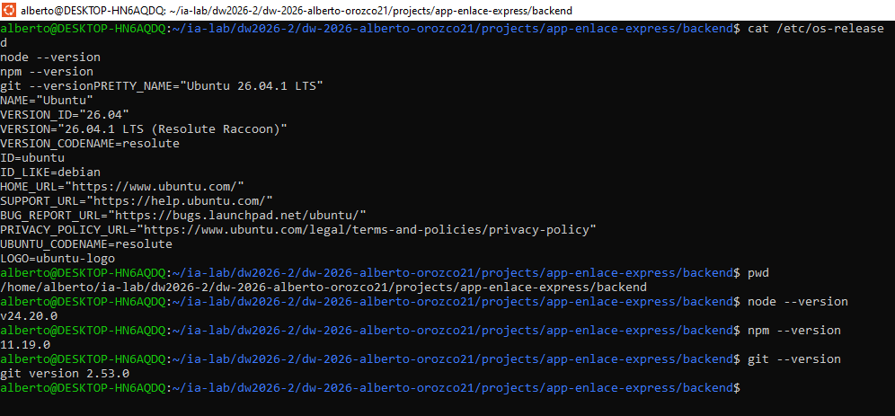
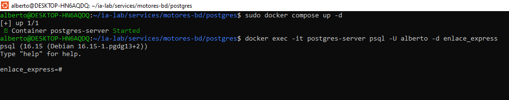

# Proceso y desiciones

## Entrada 001 — Verificación del entorno WSL

**Contexto:** **Fecha:** 06/09/2026 · **Autor:** Alberto Orozco · **Issue:** #05 · **REQ/AC:** REQ-S04-05 / AC-S04-05

```bash
$ pwd
# /home/alberto/ia-lab/dw2026-2/dw-2026-alberto-orozco21/projects/app-enlace-express

$ cat /etc/os-release
# Ubuntu 26.04.1 LTS
 
$ node --version
# v24.20.0
 
$ npm --version
# 11.19.0
 
$ git --version
# git version 2.53.0
```

**Evidencia:**



## Entrada 002 — Instalación de dependencias del backend

**Contexto:** **Fecha:** 06/09/2026 · **Autor:** Alberto Orozco · **Issue:** #05 · **REQ/AC:** REQ-S04-05 / AC-S04-05

```bash
npm install @nestjs/config @nestjs/sequelize sequelize sequelize-typescript class-validator class-transformer
npm install @nestjs/swagger swagger-ui-express helmet
npm install @nestjs/jwt passport passport-jwt @nestjs/passport bcrypt
npm install pg
npm install --save-dev @types/bcrypt @types/passport-jwt

# PostgreSQL
npm install pg
```

**Decisión:** Se instala `PostgreSQL` (pg) como driver de base de datos. Motor elegido libremente entre las opciones de la Semana 02. 

**Justificación para EnlaceExpress:** 

- **Geolocalización:** `PruebaEntrega` y `Direccion` guardan coordenadas (lat/lng); Postgres ofrece soporte nativo robusto para tipos numéricos de precisión y es extensible con `PostGIS` si más adelante se necesita calcular zonas o distancias reales entre puntos.

- **Integridad transaccional del agregado Envio:** la regla de negocio de que un envío no puede quedar con paquetes parciales si falla la cotización depende de transacciones ACID sólidas, punto fuerte histórico de Postgres.

- **Constraints declarativos:** invariantes como el `UNIQUE` de `PruebaEntrega.envio_id` o el no solapamiento de vigencia de Tarifa se apoyan mejor en el motor de constraints e índices de Postgres.

Resultado de `npm audit` (9 vulnerabilidades: 2 low, 5 moderate, 2 high):

```
# npm audit report

tmp  <=0.2.5
Severity: high
tmp allows arbitrary temporary file / directory write via symbolic link `dir` parameter - https://github.com/advisories/GHSA-52f5-9888-hmc6
tmp has Path Traversal via unsanitized prefix/postfix that enables directory escape - https://github.com/advisories/GHSA-ph9p-34f9-6g65
fix available via `npm audit fix --force`
Will install @nestjs/mau@0.0.6, which is a breaking change
node_modules/tmp
  external-editor  >=1.1.1
  Depends on vulnerable versions of tmp
  node_modules/external-editor
    inquirer  3.0.0 - 8.2.6 || 9.0.0 - 9.3.7
    Depends on vulnerable versions of external-editor
    node_modules/inquirer
      @nestjs/mau  *
      Depends on vulnerable versions of inquirer
      Depends on vulnerable versions of undici
      node_modules/@nestjs/mau

undici  <=6.27.0
Severity: high
Use of Insufficiently Random Values in undici - https://github.com/advisories/GHSA-c76h-2ccp-4975
Undici has an unbounded decompression chain in HTTP responses on Node.js Fetch API via Content-Encoding leads to resource exhaustion - https://github.com/advisories/GHSA-g9mf-h72j-4rw9
undici Denial of Service attack via bad certificate data - https://github.com/advisories/GHSA-cxrh-j4jr-qwg3
Undici: Malicious WebSocket 64-bit length overflows parser and crashes the client - https://github.com/advisories/GHSA-f269-vfmq-vjvj
Undici has an HTTP Request/Response Smuggling issue - https://github.com/advisories/GHSA-2mjp-6q6p-2qxm
Undici has Unbounded Memory Consumption in WebSocket permessage-deflate Decompression - https://github.com/advisories/GHSA-vrm6-8vpv-qv8q
Undici has Unhandled Exception in WebSocket Client Due to Invalid server_max_window_bits Validation - https://github.com/advisories/GHSA-v9p9-hfj2-hcw8
Undici has CRLF Injection in undici via `upgrade` option - https://github.com/advisories/GHSA-4992-7rv2-5pvq
undici vulnerable to HTTP header injection via Set-Cookie percent-decoding - https://github.com/advisories/GHSA-p88m-4jfj-68fv
undici WebSocket client vulnerable to denial of service via fragment count bypass - https://github.com/advisories/GHSA-vxpw-j846-p89q
undici vulnerable to Set-Cookie SameSite attribute downgrade via permissive substring matching - https://github.com/advisories/GHSA-g8m3-5g58-fq7m
undici vulnerable to downstream response desynchronization via retry interceptor - https://github.com/advisories/GHSA-8xcm-r25x-g524
undici vulnerable to CRLF Injection via blob-like body 'type' property - https://github.com/advisories/GHSA-m8rv-5g2x-5cg5
undici vulnerable to cookie attribute injection via unsanitized domain and unparsed setCookie fields - https://github.com/advisories/GHSA-v3r7-h72x-cjcm
undici vulnerable to HTTP response queue poisoning via keep-alive socket reuse - https://github.com/advisories/GHSA-35p6-xmwp-9g52
fix available via `npm audit fix --force`
Will install @nestjs/mau@0.0.6, which is a breaking change
node_modules/undici

uuid  <11.1.1
Severity: moderate
uuid: Missing buffer bounds check in v3/v5/v6 when buf is provided - https://github.com/advisories/GHSA-w5hq-g745-h8pq
No fix available
node_modules/uuid
  sequelize  0.0.0-development || >=3.30.1
  Depends on vulnerable versions of uuid
  node_modules/sequelize
    @nestjs/sequelize  *
    Depends on vulnerable versions of sequelize
    Depends on vulnerable versions of sequelize-typescript
    node_modules/@nestjs/sequelize
    sequelize-typescript  0.3.4 || >=0.6.12-beta.0
    Depends on vulnerable versions of sequelize
    node_modules/sequelize-typescript

9 vulnerabilities (2 low, 5 moderate, 2 high)

To address all issues possible (including breaking changes), run:
  npm audit fix --force

Some issues need review, and may require choosing
a different dependency.
```

## Entrada 003 — Configuración de conexión a base de datos

**Contexto:** **Fecha:** 06/09/2026 · **Autor:** Alberto Orozco · **Issue:** #05 · **REQ/AC:** REQ-S04-05 / AC-S04-05

```bash
# Ruta /home/alberto/ia-lab/services/motores-bd/postgres

sudo docker compose up -d

docker exec -it postgres-server psql -U alberto -d enlace_express
```



Se crearon `.env.example` (con placeholders, commiteado) y `.env` (con valores reales, excluido vía .gitignore) con `DB_DIALECT=postgres`, `DB_PORT=5433`, `DB_NAME=enlace_express`. JWT_SECRET generado con `openssl rand -base64 32` y almacenado solo en `.env` local.

