# Bitacora de creación del backend utilizando Express

## 1. ISS-00 — Requisitos previos

**Objetivo:** entorno listo para el laboratorio.  
**Bloqueado por:** ninguno.

### Criterios de aceptación (ISS-00)

- [X] `node -v` muestra v20+ (lab: v24.x)

- [X] `npm -v` responde

- [X] Motor de BD accesible (MySQL recomendado para el primer `sync`)

### Pasos

```bash
node -v
npm -v
```

### Verificación del ISS

```bash
node -v && npm -v
```


---

## 2. ISS-01 — Esqueleto del proyecto

**Objetivo:** proyecto npm + TypeScript + Express con estructura `features/` y servidor HTTP base.
**Bloqueado por:** ISS-00.

### Criterios de aceptación (ISS-01)

- [X] **2.1** Existe `package.json` con `"type": "commonjs"` y scripts `build` / `dev`
- [X] **2.2** Árbol `src/` con `config`, `database/seeders`, `routes`, `features/business/companies`
- [X] **2.3** Dependencias Express/TS instaladas
- [X] **2.4** Existe `tsconfig.json` (`rootDir: ./src`, `outDir: ./dist`, `strict: true`)
- [X] **2.5** Existen `src/server.ts` y `src/config/index.ts` (esqueleto App)
- [X] `npx tsc --noEmit` sin errores al cerrar el ISS

---

## 2.1 Inicializar npm y scripts

```bash
mkdir backend-express
cd backend-express
npm init -y
mkdir -p docs
```


**PARCHE** — `package.json` **ya existe** (lo creó `npm init -y`).

- **Dentro de** `"scripts"`: deja solo (o añade) `build` y `dev` como abajo.
- **Debajo de** `"license"`: asegúrate de `"type": "commonjs"`.

```json
{
  "scripts": {
    "build": "tsc",
    "dev": "nodemon --watch src --ext ts --exec ts-node -- src/server.ts"
  },
  "type": "commonjs"
}
```


```bash
node -e "const p=require('./package.json'); console.log(p.scripts)"
```


---

## 2.2 Estructura de carpetas (features)

```bash
mkdir -p \
  src/config \
  src/database/seeders \
  src/routes \
  src/features/business/companies
```


```text
src/
├── config/
├── database/
│   └── seeders/          # solo carpeta (ISS-02 §3.3); runner en ISS-04
├── routes/
├── features/
│   └── business/
│       └── companies/      # más features en ISS-06…16
└── server.ts             # §2.5
```

| Carpeta | Uso |
|---------|-----|
| `features/business/<entidad>/` | model + controller + routes (+ seeder, swagger, http, associations) |
| `database/seeders/` | counts + SeedersRunner (`npm run db:seed`) |
| `routes/index.ts` | Agregador de features |
| `config/` · `database/` | Arranque e infraestructura |

---

## 2.3 Dependencias base (Express + TypeScript)

```bash
npm install express@^5.2.1 cors@^2.8.6 dotenv@^17.4.2 morgan@^1.12.1

npm install -D typescript@~5.9.2 ts-node@^10.9.2 nodemon@^3.1.14 \
  @types/node@^22.20.3 @types/express@^5.0.6 \
  @types/cors@^2.8.19 @types/morgan@^1.9.10
```

```bash
npm ls --depth=0
```


---

## 2.4 TypeScript (`tsconfig.json`)

```bash
: > tsconfig.json
cat >> tsconfig.json << 'EOF'
{
  "compilerOptions": {
    "rootDir": "./src",
    "outDir": "./dist",
    "module": "commonjs",
    "target": "ES2020",
    "lib": ["ES2020"],
    "types": ["node"],
    "esModuleInterop": true,
    "resolveJsonModule": true,
    "sourceMap": true,
    "strict": true,
    "skipLibCheck": true,
    "moduleDetection": "force",
    "isolatedModules": true,
    "forceConsistentCasingInFileNames": true
  },
  "include": ["src/**/*"],
  "exclude": ["node_modules", "dist"]
}
EOF
```


---

## 2.5 Servidor y App (esqueleto HTTP)

### 2.5.1 `src/server.ts`

```bash
: > src/server.ts
cat >> src/server.ts << 'EOF'
import { App } from './config/index';

async function main() {
    const app = new App();
    await app.listen();
}

main();
EOF
```


### 2.5.2 `src/config/index.ts` (esqueleto)

```bash
: > src/config/index.ts
cat >> src/config/index.ts << 'EOF'
import dotenv from "dotenv";
import express, { Application } from "express";
import morgan from "morgan";
var cors = require("cors");

dotenv.config();

export class App {
  public app: Application;

  constructor(private port?: number | string) {
    this.app = express();
    this.settings();
    this.middlewares();
    this.routes();
    this.dbConnection();
  }

  private settings(): void {
    this.app.set('port', this.port || process.env.PORT || 4000);
  }

  private middlewares(): void {
    this.app.use(morgan('dev'));
    this.app.use(cors());
    this.app.use(express.json());
    this.app.use(express.urlencoded({ extended: false }));
  }

  private routes(): void {
    // ISS-03 §4.3
  }

  private async dbConnection(): Promise<void> {
    // ISS-02 / ISS-03
  }

  async listen() {
    await this.app.listen(this.app.get('port'));
    console.log(`🚀 Servidor ejecutándose en puerto ${this.app.get('port')}`);
  }
}
EOF
```


### Verificación del ISS-01

```bash
npx tsc --noEmit
find src -type f | sort
```


### Cierre del ISS

```bash
npm run dev
```


> El servidor debe arrancar sin error. Detenerlo con Ctrl+C antes de continuar.

---

## 3. ISS-02 — Infraestructura de base de datos

**Objetivo:** drivers + `.env` + módulo Sequelize + carpeta `seeders/`.
**Bloqueado por:** ISS-01.

### Criterios de aceptación (ISS-02)

- [X] **3.1** Paquetes Sequelize/drivers instalados; existe `.env` con `DB_ENGINE` y bloques de motores
- [X] **3.2** Existe `src/database/db.ts` exportando `sequelize`, `getDatabaseInfo`, `testConnection`
- [X] **3.3** Existe carpeta `src/database/seeders/` **sin** lógica implementada aún
- [X] `npx tsc --noEmit` OK

---

## 3.1 Drivers Sequelize y `.env`

```bash
npm install sequelize@^6.37.8 mysql2@^3.24.4 pg@^8.23.0 pg-hstore@^2.3.4 \
  tedious@^20.0.0 oracledb@^7.0.1
npm install -D @types/sequelize@^6.12.0
```

```bash
: > .env
cat >> .env << 'EOF'
PORT=4000

# Variable para seleccionar el motor de base de datos
DB_ENGINE=mysql

# --- MYSQL ---
DB_MYSQL_HOST=localhost
DB_MYSQL_PORT=3306
DB_MYSQL_USERNAME=root
DB_MYSQL_PASSWORD=AlbertoMySQL3306
DB_MYSQL_NAME=express

# --- POSTGRES ---
DB_POSTGRES_HOST=localhost
DB_POSTGRES_PORT=5433
DB_POSTGRES_USERNAME=alberto
DB_POSTGRES_PASSWORD=PostgreSQL5433
DB_POSTGRES_NAME=express

# --- MSSQL (SQL Server) ---
DB_MSSQL_HOST=localhost
DB_MSSQL_PORT=1433
DB_MSSQL_USERNAME=sa
DB_MSSQL_PASSWORD=sqlServer1433
DB_MSSQL_NAME=express

# --- ORACLE ---
DB_ORACLE_HOST=localhost
DB_ORACLE_PORT=1521
DB_ORACLE_USERNAME=system
DB_ORACLE_PASSWORD=OracleXe1521
DB_ORACLE_NAME=express
DB_ORACLE_CONNECT_STRING=localhost:1521/XEPDB1
EOF
```

```bash
test -f .env && grep DB_ENGINE .env
npm ls sequelize mysql2 --depth=0
```


---

## 3.2 Configuración Sequelize (`database/db.ts`)

```bash
: > src/database/db.ts
cat >> src/database/db.ts << 'EOF'
import { Sequelize } from "sequelize";
import dotenv from "dotenv";

dotenv.config();

interface DatabaseConfig {
  dialect: string;
  host: string;
  username: string;
  password: string;
  database: string;
  port: number;
}

const dbConfigurations: Record<string, DatabaseConfig> = {
  mysql: {
    dialect: "mysql",
    host: process.env.MYSQL_HOST || "localhost",
    username: process.env.MYSQL_USER || "root",
    password: process.env.MYSQL_PASSWORD || "",
    database: process.env.MYSQL_NAME || "test",
    port: parseInt(process.env.MYSQL_PORT || "3306")
  },
  postgres: {
    dialect: "postgres",
    host: process.env.POSTGRES_HOST || "localhost",
    username: process.env.POSTGRES_USER || "postgres",
    password: process.env.POSTGRES_PASSWORD || "",
    database: process.env.POSTGRES_NAME || "test",
    port: parseInt(process.env.POSTGRES_PORT || "5432")
  }
};

const selectedEngine = process.env.DB_ENGINE || "mysql";
const selectedConfig = dbConfigurations[selectedEngine];

if (!selectedConfig) {
  throw new Error(`Motor de base de datos no soportado: ${selectedEngine}`);
}

console.log(`🔌 Conectando a base de datos: ${selectedEngine.toUpperCase()}`);

export const sequelize = new Sequelize(
  selectedConfig.database,
  selectedConfig.username,
  selectedConfig.password,
  {
    host: selectedConfig.host,
    port: selectedConfig.port,
    dialect: selectedConfig.dialect as any,
    logging: process.env.NODE_ENV === 'development' ? console.log : false,
    pool: {
      max: 5,
      min: 0,
      acquire: 30000,
      idle: 10000
    }
  }
);

export const getDatabaseInfo = () => {
  return {
    engine: selectedEngine,
    config: selectedConfig,
    connectionString: `${selectedConfig.dialect}://${selectedConfig.username}@${selectedConfig.host}:${selectedConfig.port}/${selectedConfig.database}`
  };
};

export const testConnection = async (): Promise<boolean> => {
  try {
    await sequelize.authenticate();
    console.log(`✅ Conexión exitosa a ${selectedEngine.toUpperCase()}`);
    return true;
  } catch (error) {
    console.error(`❌ Error de conexión a ${selectedEngine.toUpperCase()}:`, error);
    return false;
  }
};
EOF
```


---

## 3.3 Carpeta seeders (reservada)

```bash
touch src/database/seeders/.gitkeep
```

> La lógica de seeders (runner + counts) llega en ISS-04.

### Cierre del ISS

```bash
npm run dev
```


> El servidor debe arrancar sin error (sin BD conectada aún es esperado si no hay motor disponible). Detenerlo con Ctrl+C.

## 4. ISS-03 — Feature Company

**Objetivo:** primera feature de negocio: modelo, controller/routes CRUD completo, carpeta `http/` y cableado en `routes/index.ts` + `config/index.ts`. Es la entidad base del dominio (no tiene FKs propias todavía — `contacto_principal_id` y `direccion_facturacion_id` se agregan más adelante por PARCHE en ISS-08, cuando existan `Contacto` y `Direccion`).  
**Bloqueado por:** ISS-02.

### Criterios de aceptación (ISS-03)

- [X] **4.1** Modelo `companies.model.ts` (`is_active` boolean + `timestamps: true`)
- [X] **4.2** Controller + routes: getAll, getOne, create, update PUT/PATCH, delete físico y lógico
- [X] **4.3** Carpeta `http/` con get, create, update, delete
- [X] **4.4** Cableado en `routes/index.ts` + `config/index.ts` (import modelo + `sync`)
- [X] Con BD: `npm run dev` → conexión OK + sync OK + tabla `companies`

---

```bash
mkdir -p \
  src/features/business/companies/http
```

## 4.1 Modelo companies

```bash
: > src/features/business/companies/companies.model.ts
cat >> src/features/business/companies/companies.model.ts << 'EOF'
import { DataTypes, Model } from "sequelize";
import { sequelize } from "../../../database/db";

export interface CompanyI {
  id?: number;
  nit: string;
  razon_social: string;
  is_active?: boolean;
  createdAt?: Date;
  updatedAt?: Date;
}

export class Company extends Model {
  public id!: number;
  public nit!: string;
  public razon_social!: string;
  public is_active!: boolean;
  public readonly createdAt!: Date;
  public readonly updatedAt!: Date;
}

Company.init(
  {
    nit: {
      type: DataTypes.STRING,
      allowNull: false,
      unique: true,
    },
    razon_social: {
      type: DataTypes.STRING,
      allowNull: false,
    },
    is_active: {
      type: DataTypes.BOOLEAN,
      allowNull: true,
      defaultValue: false,
    },
  },
  {
    sequelize,
    modelName: "Companies",
    tableName: "companies",
    timestamps: true,
  }
);
EOF
```

---

## 4.2 Controller + routes (CRUD completo)

### 4.2.1 Controller

```bash
: > src/features/business/companies/companies.controller.ts
cat >> src/features/business/companies/companies.controller.ts << 'EOF'
import { Request, Response } from "express";
import { Company, CompanyI } from "./companies.model";

function paramId(req: Request): number {
  const raw = req.params.id;
  const value = Array.isArray(raw) ? raw[0] : raw;
  return Number(value);
}

export class CompaniesController {
  // ================== READ ==================
  public async getAll(req: Request, res: Response) {
    try {
      const companies = await Company.findAll({
        where: { is_active: true },
      });
      res.status(200).json({ companies });
    } catch (error) {
      res.status(500).json({ error: "Error fetching Companies", detail: String(error) });
    }
  }

  public async getOne(req: Request, res: Response) {
    try {
      const id = paramId(req);
      const companies = await Company.findByPk(id);
      if (!companies) {
        res.status(404).json({ error: "Company not found" });
        return;
      }
      res.status(200).json({ companies });
    } catch (error) {
      res.status(500).json({ error: "Error fetching Company", detail: String(error) });
    }
  }

  // ================== CREATE ==================
  public async create(req: Request, res: Response) {
    try {
      const body = req.body as CompanyI;


      const companies = await Company.create({
        nit: body.nit,
        razon_social: body.razon_social,
        is_active: body.is_active ?? true,
      });
      res.status(201).json({ companies });
    } catch (error) {
      res.status(500).json({ error: "Error creating Company", detail: String(error) });
    }
  }

  // ================== UPDATE ==================
  public async updatePut(req: Request, res: Response) {
    try {
      const id = paramId(req);
      const body = req.body as CompanyI;
      const companies = await Company.findByPk(id);
      if (!companies) {
        res.status(404).json({ error: "Company not found" });
        return;
      }


      await companies.update({
        nit: body.nit,
        razon_social: body.razon_social,
        is_active: body.is_active ?? companies.is_active,
      });

      res.status(200).json({ companies });
    } catch (error) {
      res.status(500).json({ error: "Error updating Company (PUT)", detail: String(error) });
    }
  }

  public async updatePatch(req: Request, res: Response) {
    try {
      const id = paramId(req);
      const body = req.body as Partial<CompanyI>;
      const companies = await Company.findByPk(id);
      if (!companies) {
        res.status(404).json({ error: "Company not found" });
        return;
      }

      await companies.update(body);
      res.status(200).json({ companies });
    } catch (error) {
      res.status(500).json({ error: "Error updating Company (PATCH)", detail: String(error) });
    }
  }

  // ================== DELETE ==================
  /** Eliminacion fisica */
  public async deletePhysical(req: Request, res: Response) {
    try {
      const id = paramId(req);
      const companies = await Company.findByPk(id);
      if (!companies) {
        res.status(404).json({ error: "Company not found" });
        return;
      }
      await companies.destroy();
      res.status(200).json({ message: "Company permanently deleted", id });
    } catch (error) {
      res.status(500).json({ error: "Error deleting Company", detail: String(error) });
    }
  }

  /** Eliminacion logica -> is_active = false */
  public async deleteLogical(req: Request, res: Response) {
    try {
      const id = paramId(req);
      const companies = await Company.findByPk(id);
      if (!companies) {
        res.status(404).json({ error: "Company not found" });
        return;
      }
      await companies.update({ is_active: false });
      res.status(200).json({
        message: "Company deactivated (logical delete)",
        companies,
      });
    } catch (error) {
      res.status(500).json({ error: "Error deactivating Company", detail: String(error) });
    }
  }
}
EOF
```

### 4.2.1 Routes

```bash
: > src/features/business/companies/companies.routes.ts
cat >> src/features/business/companies/companies.routes.ts << 'EOF'
import { Application } from "express";
import { CompaniesController } from "./companies.controller";

export class CompaniesRoutes {
  public companiesController: CompaniesController = new CompaniesController();

  public routes(app: Application): void {
    // ================== RUTAS SIN AUTENTICACION / SIN MIDDLEWARE JWT ==================

    // getAll
    app
      .route("/api/companies")
      .get(this.companiesController.getAll.bind(this.companiesController));

    // getOne
    app
      .route("/api/companies/:id")
      .get(this.companiesController.getOne.bind(this.companiesController));

    // create
    app
      .route("/api/companies")
      .post(this.companiesController.create.bind(this.companiesController));

    // update (PUT / PATCH)
    app
      .route("/api/companies/:id")
      .put(this.companiesController.updatePut.bind(this.companiesController))
      .patch(this.companiesController.updatePatch.bind(this.companiesController));

    // delete fisico
    app
      .route("/api/companies/:id")
      .delete(this.companiesController.deletePhysical.bind(this.companiesController));

    // delete logico
    app
      .route("/api/companies/:id/deactivate")
      .patch(this.companiesController.deleteLogical.bind(this.companiesController));
  }
}
EOF
```

## 4.3 HTTP

**GET**

```bash
: > src/features/business/companies/http/companies.get.http
cat >> src/features/business/companies/http/companies.get.http << 'EOF'
### Feature Companies — GET ALL / GET ONE
### Leyenda: SIN AUTH (sin middleware JWT / sin autenticacion)
@baseUrl = http://localhost:4000
@id = 1

# @name getAllCompanies
GET {{baseUrl}}/api/companies

###

# @name getOneEmpresa
GET {{baseUrl}}/api/companies/{{id}}
EOF
```

**CREATE**

```bash
: > src/features/business/companies/http/companies.create.http
cat >> src/features/business/companies/http/companies.create.http << 'EOF'
### Feature Companies — CREATE
### Leyenda: SIN AUTH (sin middleware JWT / sin autenticacion)
@baseUrl = http://localhost:4000

# @name createCompany
POST {{baseUrl}}/api/companies
Content-Type: application/json

{
  "nit": "Ejemplo nit",
  "razon_social": "Ejemplo razon_social",
  "is_active": true
}
EOF
```

**UPDATE**

```bash
: > src/features/business/companies/http/companies.update.http
cat >> src/features/business/companies/http/companies.update.http << 'EOF'
### Feature Company — UPDATE (PUT) / UPDATE (PATCH)
### Leyenda: SIN AUTH (sin middleware JWT / sin autenticacion)
@baseUrl = http://localhost:4000
@id = 1

# @name updateCompanyPut
PUT {{baseUrl}}/api/companies/{{id}}
Content-Type: application/json

{
  "nit": "Ejemplo nit",
  "razon_social": "Ejemplo razon_social",
  "is_active": true
}

###

# @name updateCompanyPatch
PATCH {{baseUrl}}/api/companies/{{id}}
Content-Type: application/json

{
  "razon_social": "Ejemplo razon_social"
}
EOF
```

**DELETE**

```bash
: > src/features/business/companies/http/companiess.delete.http
cat >> src/features/business/companies/http/companiess.delete.http << 'EOF'
### Feature Company — DELETE fisico / DELETE logico (is_active = false)
### Leyenda: SIN AUTH (sin middleware JWT / sin autenticacion)
@baseUrl = http://localhost:4000
@id = 1

# @name deleteCompanyPhysical
DELETE {{baseUrl}}/api/companies/{{id}}

###

# @name deleteCompanyLogical
PATCH {{baseUrl}}/api/companies/{{id}}/deactivate
EOF
```

---

## 4.4 Agregador Routes + cableado en Config

```bash
: > src/routes/index.ts
cat >> src/routes/index.ts << 'EOF'
import { CompaniesRoutes } from "../features/business/companies/companies.routes";

export class Routes {
  public companiesRoutes: CompaniesRoutes = new CompaniesRoutes();
}
EOF
```
**PARCHE** — `src/config/index.ts` **ya existe** (ISS-01, esqueleto).

1. **Debajo de** `var cors = require("cors");` **añadir**:

```ts
import { sequelize, getDatabaseInfo, testConnection } from "../database/db";
import "../features/business/companies/companies.model";
import { Routes } from "../routes/index";
```

2. **Dentro de** `export class App`, **debajo de** `public app: Application;` **añadir**:

```ts
  public routePrv: Routes = new Routes();
```

3. **Dentro de** `routes()`, **reemplazar** el comentario `// ISS-03 §4.3` por:

```ts
    this.routePrv.companiesRoutes.routes(this.app);
```

4. **Dentro de** `dbConnection()`, **reemplazar** el comentario `// ISS-02 / ISS-03` por:

```ts
    try {
      const dbInfo = getDatabaseInfo();
      console.log(`🔗 Intentando conectar a: ${dbInfo.engine.toUpperCase()}`);

      const isConnected = await testConnection();
      if (!isConnected) {
        throw new Error(`No se pudo conectar a la base de datos ${dbInfo.engine.toUpperCase()}`);
      }

      // alter: true actualiza columnas faltantes (ej. createdAt/updatedAt tras timestamps: true).
      // force: false no recrea tablas; no borra datos. En producción preferir migraciones.
      await sequelize.sync({ force: false, alter: true });
      console.log(`📦 Base de datos sincronizada exitosamente`);
    } catch (error) {
      console.error("❌ Error al conectar con la base de datos:", error);
      process.exit(1);
    }
```

### Verificación

```bash
test -d src/features/business/companies/http && echo HTTP_FOLDER_OK
curl -s http://localhost:4000/api/companies
```


### Cierre del ISS
```bash
npm run dev
```


> Sync OK y tabla `companies` (con `createdAt` / `updatedAt`). Detenerlo con Ctrl+C antes de continuar.

## 5. ISS-04 — Seeders con Faker (feature + runner externo)

**Objetivo:** datos falsos por feature (Faker) y un orquestador externo que ejecuta todos los seeders enviando la cantidad por entidad.  
**Bloqueado por:** ISS-03.

### Criterios de aceptación (ISS-04)

- [ ] **5.1** `features/business/companies/companies.seeder.ts` con `@faker-js/faker`, idempotente
- [ ] **5.2** `database/seeders/index.ts` (SeedersRunner) + `database/seeders/counts.ts`
- [ ] Script `npm run db:seed` funciona; cantidad configurable por CLI/env

---

## 5.1 Seeder dentro del feature Companies

```bash
npm install -D @faker-js/faker@^10.6.0
```

```bash
: > src/features/business/companies/companies.seeder.ts
cat >> src/features/business/companies/companies.seeder.ts << 'EOF'
import { faker } from "@faker-js/faker";
import { Company } from "./companies.model";


/**
 * Seeder del feature Companies (datos falsos con @faker-js/faker).
 * Se invoca desde `src/database/seeders` (SeedersRunner), no desde la App.
 *
 * Idempotente: si ya hay filas, no vuelve a insertar.
 */
export async function seedCompanies(count: number): Promise<number> {
  if (count <= 0) {
    console.log("\u23ed\ufe0f  Companies: count=0, se omite");
    return 0;
  }

  const existing = await Company.count();
  if (existing > 0) {
    console.log(`\u23ed\ufe0f  Companies: ya hay ${existing} registro(s), se omite seeder`);
    return 0;
  }


  const rows = Array.from({ length: count }, () => ({
      nit: faker.string.numeric(10),
      razon_social: faker.company.name(),
      is_active: true,
  }));

  await Company.bulkCreate(rows);
  console.log(`\u2705 Companies: insertados ${count} registro(s) falsos`);
  return count;
}
EOF
```

---

## 5.2 SeedersRunner + conteos por entidad

```bash
: > src/database/seeders/counts.ts
cat >> src/database/seeders/counts.ts << 'EOF'
export type SeedCounts = {
  Companies: number;
};

export const DEFAULT_SEED_COUNTS: SeedCounts = {
  Companies: 15,
};

export function resolveSeedCounts(argv: string[] = process.argv.slice(2)): SeedCounts {
  const counts: SeedCounts = { ...DEFAULT_SEED_COUNTS };

  const envCompanies = process.env.SEED_COMPANIES;
  if (envCompanies !== undefined && envCompanies !== "") {
    counts.Companies = Number(envCompanies);
  }

  for (const arg of argv) {
    const m = arg.match(/^--([a-zA-Z_]+)=(\d+)$/);
    if (!m) continue;
    const key = m[1] as keyof SeedCounts;
    const value = Number(m[2]);
    if (key in counts) {
      counts[key] = value;
    }
  }

  return counts;
}
EOF
```

```bash
: > src/database/seeders/index.ts
cat >> src/database/seeders/index.ts << 'EOF'
import dotenv from "dotenv";
import { sequelize, testConnection } from "../db";
import "../../features/business/companies/companies.model";
import { seedCompanies } from "../../features/business/companies/companies.seeder";
import { resolveSeedCounts } from "./counts";

dotenv.config();

/**
 * SeedersRunner — ejecuta TODOS los seeders de features, en orden de dependencias
 * (padres antes que hijos): empresa -> contacto -> direccion -> mensajero -> tarifa
 * -> ruta -> envio -> paquete -> evento_tracking -> prueba_entrega -> factura.
 *
 * Uso:
 *   npm run db:seed
 *   npm run db:seed -- --empresas=20
 *   SEED_EMPRESAS=5 npm run db:seed
 */
export async function runAllSeeders(): Promise<void> {
  const counts = resolveSeedCounts();
  console.log("🌱 Iniciando SeedersRunner...");
  console.log("📊 Conteos:", counts);

  const ok = await testConnection();
  if (!ok) {
    throw new Error("No hay conexión a la base de datos");
  }

  await sequelize.sync({ force: false, alter: true });

  // Orden: business (padres → hijos)
  await seedCompanies(counts.Companies);

  console.log("🌱 SeedersRunner finalizado");
}

if (require.main === module) {
  runAllSeeders()
    .then(async () => {
      await sequelize.close();
      process.exit(0);
    })
    .catch(async (err) => {
      console.error("❌ Error en seeders:", err);
      await sequelize.close();
      process.exit(1);
    });
}
EOF
```

**PARCHE** — `package.json` **ya existe**.

**Dentro de** `"scripts"`, **debajo de** `"dev": "..."`, **añadir**:

```json
    "db:seed": "ts-node -- src/database/seeders/index.ts"
```

### Verificación
```bash
npm run db:seed
npm run db:seed -- --empresas=20
SEED_EMPRESAS=5 npm run db:seed
```


**Al agregar otra entidad (patrón, repetido en cada ISS siguiente):**

1. Archivo nuevo `features/.../<entidad>.seeder.ts`.
2. **PARCHE** `counts.ts`: añadir clave dentro de `SeedCounts` / `DEFAULT_SEED_COUNTS`.
3. **PARCHE** `database/seeders/index.ts`: añadir import + llamada `await seedX(counts.x);` debajo de la anterior.

### Cierre del ISS
```bash
npm run dev
```


## 6. ISS-05 — Swagger / OpenAPI (feature + registry externo)

**Objetivo:** documentar el API del feature Empresa en OpenAPI 3 y montar Swagger UI desde un registry externo (mismo patrón que seeders).  
**Bloqueado por:** ISS-03.

### Criterios de aceptación (ISS-05)

- [ ] **6.1** `features/business/companies/companies.swagger.ts` con tags, paths y schemas (leyenda **SIN AUTH**)
- [ ] **6.2** `src/swagger/index.ts` agrega módulos de features y monta UI
- [ ] `App` llama `setupSwagger` (método `docs()`)
- [ ] `GET /api/docs` muestra Swagger UI y `GET /api/docs.json` el documento OpenAPI

---

## 6.1 OpenAPI dentro del feature Companies

```bash
npm install swagger-ui-express@^5.0.1
npm install -D @types/swagger-ui-express@^4.1.8
```

```bash
: > src/features/business/companies/companies.swagger.ts
cat >> src/features/business/companies/companies.swagger.ts << 'EOF'
/**
 * Documentacion OpenAPI del feature Companies.
 * Se agrega desde `src/swagger` (registry externo), no se monta aqui.
 *
 * Leyenda: endpoints documentados como SIN AUTH (sin middleware JWT).
 */

import { Company } from "./companies.model";

export const companiesSwagger = {
  tags: [
    {
      name: "Empresas",
      description: "CRUD de empresas — **SIN AUTH** (sin middleware JWT)",
    },
  ],
  paths: {
    "/api/companies": {
      get: {
        tags: ["Empresas"],
        summary: "Listar empresas activos",
        description: "SIN AUTH — retorna registros con is_active=true",
        security: [],
        responses: {
          "200": {
            description: "Lista de empresas",
            content: {
              "application/json": {
                schema: {
                  type: "object",
                  properties: {
                    empresas: {
                      type: "array",
                      items: { $ref: "#/components/schemas/company" },
                    },
                  },
                },
              },
            },
          },
        },
      },
      post: {
        tags: ["Empresas"],
        summary: "Crear empresa",
        description: "SIN AUTH",
        security: [],
        requestBody: {
          required: true,
          content: {
            "application/json": {
              schema: { $ref: "#/components/schemas/companyCreate" },
            },
          },
        },
        responses: {
          "201": {
            description: "Empresa creada",
            content: {
              "application/json": {
                schema: {
                  type: "object",
                  properties: {
                    empresa: { $ref: "#/components/schemas/company" },
                  },
                },
              },
            },
          },
        },
      },
    },
    "/api/companies/{id}": {
      get: {
        tags: ["Empresas"],
        summary: "Obtener empresa por id",
        description: "SIN AUTH",
        security: [],
        parameters: [{ name: "id", in: "path", required: true, schema: { type: "integer" } }],
        responses: {
          "200": {
            description: "Empresa encontrada",
            content: {
              "application/json": {
                schema: {
                  type: "object",
                  properties: {
                    empresa: { $ref: "#/components/schemas/company" },
                  },
                },
              },
            },
          },
          "404": { description: "No encontrada" },
        },
      },
      put: {
        tags: ["Empresas"],
        summary: "Actualizar empresa (PUT — reemplazo)",
        description: "SIN AUTH",
        security: [],
        parameters: [{ name: "id", in: "path", required: true, schema: { type: "integer" } }],
        requestBody: {
          required: true,
          content: {
            "application/json": {
              schema: { $ref: "#/components/schemas/companyCreate" },
            },
          },
        },
        responses: {
          "200": { description: "Actualizada" },
          "404": { description: "No encontrada" },
        },
      },
      patch: {
        tags: ["Empresas"],
        summary: "Actualizar empresa (PATCH — parcial)",
        description: "SIN AUTH",
        security: [],
        parameters: [{ name: "id", in: "path", required: true, schema: { type: "integer" } }],
        requestBody: {
          required: true,
          content: {
            "application/json": {
              schema: { $ref: "#/components/schemas/companyPatch" },
            },
          },
        },
        responses: {
          "200": { description: "Actualizada" },
          "404": { description: "No encontrada" },
        },
      },
      delete: {
        tags: ["Empresas"],
        summary: "Eliminar empresa (fisico)",
        description: "SIN AUTH — borra la fila",
        security: [],
        parameters: [{ name: "id", in: "path", required: true, schema: { type: "integer" } }],
        responses: {
          "200": { description: "Eliminada" },
          "404": { description: "No encontrada" },
        },
      },
    },
    "/api/companies/{id}/deactivate": {
      patch: {
        tags: ["Empresas"],
        summary: "Eliminar empresa (logico)",
        description: "SIN AUTH — is_active = false",
        security: [],
        parameters: [{ name: "id", in: "path", required: true, schema: { type: "integer" } }],
        responses: {
          "200": { description: "Desactivada" },
          "404": { description: "No encontrada" },
        },
      },
    },
  },
  components: {
    schemas: {
      company: {
        type: "object",
        properties: {
      id: { type: "integer", example: 1 },
      nit: { type: "string", example: "nit" },
      razon_social: { type: "string", example: "razon_social" },
      is_active: { type: "boolean", example: true },
      createdAt: { type: "string", format: "date-time" },
      updatedAt: { type: "string", format: "date-time" },
        },
      },
      companyCreate: {
        type: "object",
        required: ["nit", "razon_social"],
        properties: {
      nit: { type: "string", example: "nit" },
      razon_social: { type: "string", example: "razon_social" },
      is_active: { type: "boolean", example: true },
        },
      },
      companyPatch: {
        type: "object",
        properties: {
      nit: { type: "string", example: "nit" },
      razon_social: { type: "string", example: "razon_social" },
      is_active: { type: "boolean", example: true },
        },
      },
    },
  },
};
EOF
```

---

## 6.2 Registry externo + montaje en Config

```bash
mkdir -p \
  src/swagger
```

```bash
: > src/swagger/index.ts
cat >> src/swagger/index.ts << 'EOF'
import { Application } from "express";
import swaggerUi from "swagger-ui-express";
import { companiesSwagger } from "../features/business/companies/companies.swagger";

export type FeatureSwaggerModule = {
  tags: unknown[];
  paths: Record<string, unknown>;
  components?: { schemas?: Record<string, unknown> };
};

/**
 * Registry externo: importa la documentación OpenAPI de cada feature
 * (mismo patrón que SeedersRunner).
 */
const featureSwaggerModules: FeatureSwaggerModule[] = [
  companiesSwagger,
  // contactSwagger,
  // direccionSwagger,
];

export function buildOpenApiDocument() {
  const tags: unknown[] = [];
  const paths: Record<string, unknown> = {};
  const schemas: Record<string, unknown> = {};

  for (const mod of featureSwaggerModules) {
    tags.push(...mod.tags);
    Object.assign(paths, mod.paths);
    if (mod.components?.schemas) {
      Object.assign(schemas, mod.components.schemas);
    }
  }

  return {
    openapi: "3.0.3",
    info: {
      title: "EnlaceExpress API",
      version: "1.0.0",
      description:
        "API EnlaceExpress (Express + Sequelize). Todas las rutas business son **SIN AUTH** en este lab.",
    },
    servers: [
      { url: `http://localhost:${process.env.PORT || 4000}`, description: "Local" },
    ],
    tags,
    paths,
    components: { schemas },
  };
}

/** Monta Swagger UI y el JSON OpenAPI */
export function setupSwagger(app: Application): void {
  const document = buildOpenApiDocument();
  app.use("/api/docs", swaggerUi.serve, swaggerUi.setup(document));
  app.get("/api/docs.json", (_req, res) => {
    res.json(document);
  });
  console.log("📘 Swagger UI: /api/docs  |  OpenAPI JSON: /api/docs.json");
}
EOF
```
**PARCHE** — `src/config/index.ts` **ya existe**.

1. **Debajo de** `import { Routes } from "../routes/index";`, **añadir**:

```ts
import { setupSwagger } from "../swagger/index";
```

2. **Dentro del** `constructor`, **debajo de** `this.routes();` y **encima de** `this.dbConnection();`, **añadir**:

```ts
    this.docs();
```

3. **Dentro de** la clase `App`, **debajo de** `routes()` y **encima de** `dbConnection()`, **añadir**:

```ts
  private docs(): void {
    setupSwagger(this.app);
  }
```

### Verificación
```bash
curl -s http://localhost:4000/api/docs.json | head
```


> Con el servidor del cierre: abrir `http://localhost:4000/api/docs`.

**Al agregar otra entidad (patrón, repetido en cada ISS siguiente):**

1. Archivo nuevo `features/.../<entidad>.swagger.ts`.
2. **PARCHE** `src/swagger/index.ts`: añadir import + entrada en `featureSwaggerModules`.

### Cierre del ISS
```bash
npm run dev
```


> Abrir `http://localhost:4000/api/docs`. Detenerlo con Ctrl+C antes de continuar.

---

## 7. ISS-06 — Feature Contact

**Objetivo:** CRUD completo + seeder + swagger de **Contact** (tabla `contacts`).  
**Bloqueado por:** ISS-05.  
**API:** `/api/contacts` — **SIN AUTH**.  
**Patrón:** mismo que las features anteriores (modelo → controller/routes → http → cableado → relación → seeder → swagger).

### Criterios de aceptación (ISS-06)

- [X] **7.1** Modelo `contact.model.ts` (`is_active` boolean + `timestamps: true`, columnas snake_case)
- [X] **7.2** Controller + routes: getAll, getOne, create, update PUT/PATCH, delete físico y lógico
- [X] **7.3** Carpeta `http/` con get, create, update, delete
- [X] **7.4** Cableado en `routes/index.ts` + `config/index.ts`
- [X] **7.5** Asociaciones (`contact.associations.ts`) + PARCHE `config`
- [X] **7.6** Seeder + registro en SeedersRunner / `counts.ts`
- [X] **7.7** Swagger + registro en `src/swagger`

---

```bash
mkdir -p \
  src/features/business/contact/http
```

## 7.1 Modelo Contact

```bash
: > src/features/business/contact/contact.model.ts
cat >> src/features/business/contact/contact.model.ts << 'EOF'
import { DataTypes, Model } from "sequelize";
import { sequelize } from "../../../database/db";

export interface ContactI {
  id?: number;
  empresa_id: number;
  nombre: string;
  cargo?: string | null;
  telefono?: string | null;
  email?: string | null;
  is_principal?: boolean;
  is_active?: boolean;
  createdAt?: Date;
  updatedAt?: Date;
}

export class Contact extends Model {
  public id!: number;
  public empresa_id!: number;
  public nombre!: string;
  public cargo!: string | null;
  public telefono!: string | null;
  public email!: string | null;
  public is_principal!: boolean;
  public is_active!: boolean;
  public readonly createdAt!: Date;
  public readonly updatedAt!: Date;
}

Contact.init(
  {
    empresa_id: {
      type: DataTypes.INTEGER,
      references: { model: "companies", key: "id" },
      allowNull: false,
    },
    nombre: {
      type: DataTypes.STRING,
      allowNull: false,
    },
    cargo: {
      type: DataTypes.STRING,
      allowNull: true,
    },
    telefono: {
      type: DataTypes.STRING,
      allowNull: true,
    },
    email: {
      type: DataTypes.STRING,
      allowNull: true,
    },
    is_principal: {
      type: DataTypes.BOOLEAN,
      allowNull: true,
      defaultValue: false,
    },
    is_active: {
      type: DataTypes.BOOLEAN,
      allowNull: true,
      defaultValue: false,
    },
  },
  {
    sequelize,
    modelName: "Contact",
    tableName: "contacts",
    timestamps: true,
  }
);
EOF
```

---

## 7.2 Controller + routes (CRUD completo)

**Controller**

```bash
: > src/features/business/contact/contact.controller.ts
cat >> src/features/business/contact/contact.controller.ts << 'EOF'
import { Request, Response } from "express";
import { Contact, ContactI } from "./contact.model";
import { Company } from "../company/company.model";

function paramId(req: Request): number {
  const raw = req.params.id;
  const value = Array.isArray(raw) ? raw[0] : raw;
  return Number(value);
}

export class ContactController {
  // ================== READ ==================
  public async getAll(req: Request, res: Response) {
    try {
      const contacts = await Contact.findAll({
        where: { is_active: true },
      });
      res.status(200).json({ contacts });
    } catch (error) {
      res.status(500).json({ error: "Error fetching contacts", detail: String(error) });
    }
  }

  public async getOne(req: Request, res: Response) {
    try {
      const id = paramId(req);
      const contact = await Contact.findByPk(id);
      if (!contact) {
        res.status(404).json({ error: "Contact not found" });
        return;
      }
      res.status(200).json({ contact: contact });
    } catch (error) {
      res.status(500).json({ error: "Error fetching contact", detail: String(error) });
    }
  }

  // ================== CREATE ==================
  public async create(req: Request, res: Response) {
    try {
      const body = req.body as ContactI;
      if (body.empresa_id !== undefined && body.empresa_id !== null) {
        const found_empresa_id = await Company.findByPk(body.empresa_id);
        if (!found_empresa_id) {
          res.status(404).json({ error: "Company (empresa_id) not found" });
          return;
        }
      }

      const contact = await Contact.create({
        empresa_id: body.empresa_id,
        nombre: body.nombre,
        cargo: body.cargo ?? null,
        telefono: body.telefono ?? null,
        email: body.email ?? null,
        is_principal: body.is_principal ?? null,
        is_active: body.is_active ?? true,
      });
      res.status(201).json({ contact: contact });
    } catch (error) {
      res.status(500).json({ error: "Error creating contact", detail: String(error) });
    }
  }

  // ================== UPDATE ==================
  public async updatePut(req: Request, res: Response) {
    try {
      const id = paramId(req);
      const body = req.body as ContactI;
      const contact = await Contact.findByPk(id);
      if (!contact) {
        res.status(404).json({ error: "Contact not found" });
        return;
      }
      if (body.empresa_id !== undefined && body.empresa_id !== null) {
        const found_empresa_id = await Company.findByPk(body.empresa_id);
        if (!found_empresa_id) {
          res.status(404).json({ error: "Company (empresa_id) not found" });
          return;
        }
      }

      await contact.update({
        empresa_id: body.empresa_id,
        nombre: body.nombre,
        cargo: body.cargo ?? contact.cargo,
        telefono: body.telefono ?? contact.telefono,
        email: body.email ?? contact.email,
        is_principal: body.is_principal ?? contact.is_principal,
        is_active: body.is_active ?? contact.is_active,
      });

      res.status(200).json({ contact: contact });
    } catch (error) {
      res.status(500).json({ error: "Error updating contact (PUT)", detail: String(error) });
    }
  }

  public async updatePatch(req: Request, res: Response) {
    try {
      const id = paramId(req);
      const body = req.body as Partial<ContactI>;
      const contact = await Contact.findByPk(id);
      if (!contact) {
        res.status(404).json({ error: "Contact not found" });
        return;
      }

      await contact.update(body);
      res.status(200).json({ contact: contact });
    } catch (error) {
      res.status(500).json({ error: "Error updating contact (PATCH)", detail: String(error) });
    }
  }

  // ================== DELETE ==================
  /** Eliminacion fisica */
  public async deletePhysical(req: Request, res: Response) {
    try {
      const id = paramId(req);
      const contact = await Contact.findByPk(id);
      if (!contact) {
        res.status(404).json({ error: "Contact not found" });
        return;
      }
      await contact.destroy();
      res.status(200).json({ message: "Contact permanently deleted", id });
    } catch (error) {
      res.status(500).json({ error: "Error deleting contact", detail: String(error) });
    }
  }

  /** Eliminacion logica -> is_active = false */
  public async deleteLogical(req: Request, res: Response) {
    try {
      const id = paramId(req);
      const contact = await Contact.findByPk(id);
      if (!contact) {
        res.status(404).json({ error: "Contact not found" });
        return;
      }
      await contact.update({ is_active: false });
      res.status(200).json({
        message: "Contact deactivated (logical delete)",
        contact: contact,
      });
    } catch (error) {
      res.status(500).json({ error: "Error deactivating contact", detail: String(error) });
    }
  }
}
EOF
```

**Routes**

```bash
: > src/features/business/contact/contact.routes.ts
cat >> src/features/business/contact/contact.routes.ts << 'EOF'
import { Application } from "express";
import { ContactController } from "./contact.controller";

export class ContactRoutes {
  public contactController: ContactController = new ContactController();

  public routes(app: Application): void {
    // ================== RUTAS SIN AUTENTICACION / SIN MIDDLEWARE JWT ==================

    // getAll
    app
      .route("/api/contacts")
      .get(this.contactController.getAll.bind(this.contactController));

    // getOne
    app
      .route("/api/contacts/:id")
      .get(this.contactController.getOne.bind(this.contactController));

    // create
    app
      .route("/api/contacts")
      .post(this.contactController.create.bind(this.contactController));

    // update (PUT / PATCH)
    app
      .route("/api/contacts/:id")
      .put(this.contactController.updatePut.bind(this.contactController))
      .patch(this.contactController.updatePatch.bind(this.contactController));

    // delete fisico
    app
      .route("/api/contacts/:id")
      .delete(this.contactController.deletePhysical.bind(this.contactController));

    // delete logico
    app
      .route("/api/contacts/:id/deactivate")
      .patch(this.contactController.deleteLogical.bind(this.contactController));
  }
}
EOF
```

---

## 7.3 HTTP

**GET**

```bash
: > src/features/business/contact/http/contacts.get.http
cat >> src/features/business/contact/http/contacts.get.http << 'EOF'
### Feature Contact — GET ALL / GET ONE
### Leyenda: SIN AUTH (sin middleware JWT / sin autenticacion)
@baseUrl = http://localhost:4000
@id = 1

# @name getAllContact
GET {{baseUrl}}/api/contacts

###

# @name getOneContact
GET {{baseUrl}}/api/contacts/{{id}}
EOF
```

**CREATE**

```bash
: > src/features/business/contact/http/contacts.create.http
cat >> src/features/business/contact/http/contacts.create.http << 'EOF'
### Feature Contact — CREATE
### Leyenda: SIN AUTH (sin middleware JWT / sin autenticacion)
@baseUrl = http://localhost:4000

# @name createContact
POST {{baseUrl}}/api/contacts
Content-Type: application/json

{
  "empresa_id": 1,
  "nombre": "Ejemplo nombre",
  "cargo": "Ejemplo cargo",
  "telefono": "Ejemplo telefono",
  "email": "Ejemplo email",
  "is_principal": true,
  "is_active": true
}
EOF
```

**UPDATE**

```bash
: > src/features/business/contact/http/contacts.update.http
cat >> src/features/business/contact/http/contacts.update.http << 'EOF'
### Feature Contact — UPDATE (PUT) / UPDATE (PATCH)
### Leyenda: SIN AUTH (sin middleware JWT / sin autenticacion)
@baseUrl = http://localhost:4000
@id = 1

# @name updateContactPut
PUT {{baseUrl}}/api/contacts/{{id}}
Content-Type: application/json

{
  "empresa_id": 1,
  "nombre": "Ejemplo nombre",
  "cargo": "Ejemplo cargo",
  "telefono": "Ejemplo telefono",
  "email": "Ejemplo email",
  "is_principal": true,
  "is_active": true
}

###

# @name updateContactPatch
PATCH {{baseUrl}}/api/contacts/{{id}}
Content-Type: application/json

{
  "nombre": "Ejemplo nombre"
}

EOF
```

**DELETE**

```bash
: > src/features/business/contact/http/contacts.delete.http
cat >> src/features/business/contact/http/contacts.delete.http << 'EOF'
### Feature Contact — DELETE fisico / DELETE logico (is_active = false)
### Leyenda: SIN AUTH (sin middleware JWT / sin autenticacion)
@baseUrl = http://localhost:4000
@id = 1

# @name deleteContactPhysical
DELETE {{baseUrl}}/api/contacts/{{id}}

###

# @name deleteContactLogical
PATCH {{baseUrl}}/api/contacts/{{id}}/deactivate
EOF
```

---

## 7.4 Cableado Routes + Config

**PARCHE** — `src/routes/index.ts` **ya existe**.

1. **Debajo de** `import { CompanyRoutes } ...`, **añadir**:

```ts
import { ContactRoutes } from "../features/business/contact/contact.routes";
```

2. **Dentro de** `export class Routes`, **debajo de** `companyRoutes`, **añadir**:

```ts
  public contactRoutes: ContactRoutes = new ContactRoutes();
```

**PARCHE** — `src/config/index.ts` **ya existe**.

1. **Debajo de** `import "../features/business/company/company.model";`, **añadir**:

```ts
import "../features/business/contact/contact.model";
```

2. **Dentro de** `routes()`, **debajo de** `this.routePrv.companyRoutes.routes(this.app);`, **añadir**:

```ts
    this.routePrv.contactRoutes.routes(this.app);
```

---

## 7.5 Relación / asociaciones Contact

> `Contact` referencia: **Company**. Norma FK: `<tabla_singular>_id`.

```bash
: > src/features/business/contact/contact.associations.ts
cat >> src/features/business/contact/contact.associations.ts << 'EOF'
import { Contact } from "./contact.model";
import { Company } from "../company/company.model";

Contact.belongsTo(Company, { foreignKey: "empresa_id", as: "company" });
Company.hasMany(Contact, { foreignKey: "empresa_id", as: "contacts" });
EOF
```
**PARCHE** — `src/config/index.ts` **ya existe**.

**Debajo de** `import "../features/business/contact/contact.model";` (y **encima de** `import { Routes }`), **añadir**:

```ts
import "../features/business/contact/contact.associations";
```

---

## 7.6 Seeder Contact

```bash
: > src/features/business/contact/contact.seeder.ts
cat >> src/features/business/contact/contact.seeder.ts << 'EOF'
import { faker } from "@faker-js/faker";
import { Contact } from "./contact.model";
import { Company } from "../companies/companies.model";

/**
 * Seeder del feature Contact (datos falsos con @faker-js/faker).
 * Se invoca desde `src/database/seeders` (SeedersRunner), no desde la App.
 *
 * Idempotente: si ya hay filas, no vuelve a insertar.
 */
export async function seedContacts(count: number): Promise<number> {
  if (count <= 0) {
    console.log("\u23ed\ufe0f  contacts: count=0, se omite");
    return 0;
  }

  const existing = await Contact.count();
  if (existing > 0) {
    console.log(`\u23ed\ufe0f  contacts: ya hay ${existing} registro(s), se omite seeder`);
    return 0;
  }

  const companyList = await Company.findAll({ where: { is_active: true } });
  if (companyList.length === 0) {
    console.log("\u23ed\ufe0f  contacts: faltan dependencias activas (companyList), se omite seeder");
    return 0;
  }

  const rows = Array.from({ length: count }, () => ({
      empresa_id: faker.helpers.arrayElement(companyList).id,
      nombre: faker.person.fullName(),
      cargo: faker.person.jobTitle(),
      telefono: faker.phone.number({ style: "national" }),
      email: faker.internet.email().toLowerCase(),
      is_principal: faker.datatype.boolean(),
      is_active: true,
  }));

  await Contact.bulkCreate(rows);
  console.log(`\u2705 contacts: insertados ${count} registro(s) falsos`);
  return count;
}
EOF
```

**PARCHE** — `src/database/seeders/counts.ts` **ya existe**.

- **Dentro de** `SeedCounts`, **añadir** `contacts: number;`
- **Dentro de** `DEFAULT_SEED_COUNTS`, **añadir** `contacts: 15,`
- Lectura opcional por env: `SEED_CONTACTS`.

**PARCHE** — `src/database/seeders/index.ts` **ya existe**.

1. **Debajo de** el import del seeder anterior, **añadir** `import { seedContacts } from "../../features/business/contact/contact.seeder";`
2. **Debajo de** `await seedCompanies(counts.companies);`, **añadir** `await seedContacts(counts.contacts);`

---

## 7.7 Swagger Contact

```bash
: > src/features/business/contact/contact.swagger.ts
cat >> src/features/business/contact/contact.swagger.ts << 'EOF'
/**
 * Documentacion OpenAPI del feature Contact.
 * Se agrega desde `src/swagger` (registry externo), no se monta aqui.
 *
 * Leyenda: endpoints documentados como SIN AUTH (sin middleware JWT).
 */

export const contactSwagger = {
  tags: [
    {
      name: "Contacts",
      description: "CRUD de contacts — **SIN AUTH** (sin middleware JWT)",
    },
  ],
  paths: {
    "/api/contacts": {
      get: {
        tags: ["Contacts"],
        summary: "Listar contacts activos",
        description: "SIN AUTH — retorna registros con is_active=true",
        security: [],
        responses: {
          "200": {
            description: "Lista de contacts",
            content: {
              "application/json": {
                schema: {
                  type: "object",
                  properties: {
                    contacts: {
                      type: "array",
                      items: { $ref: "#/components/schemas/Contact" },
                    },
                  },
                },
              },
            },
          },
        },
      },
      post: {
        tags: ["Contacts"],
        summary: "Crear contact",
        description: "SIN AUTH",
        security: [],
        requestBody: {
          required: true,
          content: {
            "application/json": {
              schema: { $ref: "#/components/schemas/ContactCreate" },
            },
          },
        },
        responses: {
          "201": {
            description: "Contact creado",
            content: {
              "application/json": {
                schema: {
                  type: "object",
                  properties: {
                    contact: { $ref: "#/components/schemas/Contact" },
                  },
                },
              },
            },
          },
        },
      },
    },
    "/api/contacts/{id}": {
      get: {
        tags: ["Contacts"],
        summary: "Obtener contact por id",
        description: "SIN AUTH",
        security: [],
        parameters: [{ name: "id", in: "path", required: true, schema: { type: "integer" } }],
        responses: {
          "200": {
            description: "Contact encontrado",
            content: {
              "application/json": {
                schema: {
                  type: "object",
                  properties: {
                    contact: { $ref: "#/components/schemas/Contact" },
                  },
                },
              },
            },
          },
          "404": { description: "No encontrado" },
        },
      },
      put: {
        tags: ["Contacts"],
        summary: "Actualizar contact (PUT — reemplazo)",
        description: "SIN AUTH",
        security: [],
        parameters: [{ name: "id", in: "path", required: true, schema: { type: "integer" } }],
        requestBody: {
          required: true,
          content: {
            "application/json": {
              schema: { $ref: "#/components/schemas/ContactCreate" },
            },
          },
        },
        responses: {
          "200": { description: "Actualizado" },
          "404": { description: "No encontrado" },
        },
      },
      patch: {
        tags: ["Contacts"],
        summary: "Actualizar contact (PATCH — parcial)",
        description: "SIN AUTH",
        security: [],
        parameters: [{ name: "id", in: "path", required: true, schema: { type: "integer" } }],
        requestBody: {
          required: true,
          content: {
            "application/json": {
              schema: { $ref: "#/components/schemas/ContactPatch" },
            },
          },
        },
        responses: {
          "200": { description: "Actualizado" },
          "404": { description: "No encontrado" },
        },
      },
      delete: {
        tags: ["Contacts"],
        summary: "Eliminar contact (fisico)",
        description: "SIN AUTH — borra la fila",
        security: [],
        parameters: [{ name: "id", in: "path", required: true, schema: { type: "integer" } }],
        responses: {
          "200": { description: "Eliminado" },
          "404": { description: "No encontrado" },
        },
      },
    },
    "/api/contacts/{id}/deactivate": {
      patch: {
        tags: ["Contacts"],
        summary: "Eliminar contact (logico)",
        description: "SIN AUTH — is_active = false",
        security: [],
        parameters: [{ name: "id", in: "path", required: true, schema: { type: "integer" } }],
        responses: {
          "200": { description: "Desactivado" },
          "404": { description: "No encontrado" },
        },
      },
    },
  },
  components: {
    schemas: {
      Contact: {
        type: "object",
        properties: {
      id: { type: "integer", example: 1 },
      empresa_id: { type: "integer", example: 1 },
      nombre: { type: "string", example: "nombre" },
      cargo: { type: "string", example: "cargo" },
      telefono: { type: "string", example: "telefono" },
      email: { type: "string", example: "email" },
      is_principal: { type: "boolean", example: true },
      is_active: { type: "boolean", example: true },
      createdAt: { type: "string", format: "date-time" },
      updatedAt: { type: "string", format: "date-time" },
        },
      },
      ContactCreate: {
        type: "object",
        required: ["empresa_id", "nombre"],
        properties: {
      empresa_id: { type: "integer", example: 1 },
      nombre: { type: "string", example: "nombre" },
      cargo: { type: "string", example: "cargo" },
      telefono: { type: "string", example: "telefono" },
      email: { type: "string", example: "email" },
      is_principal: { type: "boolean", example: true },
      is_active: { type: "boolean", example: true },
        },
      },
      ContactPatch: {
        type: "object",
        properties: {
      empresa_id: { type: "integer", example: 1 },
      nombre: { type: "string", example: "nombre" },
      cargo: { type: "string", example: "cargo" },
      telefono: { type: "string", example: "telefono" },
      email: { type: "string", example: "email" },
      is_principal: { type: "boolean", example: true },
      is_active: { type: "boolean", example: true },
        },
      },
    },
  },
};
EOF
```

**PARCHE** — `src/swagger/index.ts` **ya existe**.

1. **Debajo de** `import { companySwagger } ...`

**añadir** 

`import { contactSwagger } from "../features/business/contact/contact.swagger";`

2. **Dentro de** `featureSwaggerModules`, **debajo de** `companySwagger,`

**añadir** `contactSwagger,`

### Verificación

```bash
npx tsc --noEmit
curl -s http://localhost:4000/api/contacts
```


### Cierre del ISS

```bash
npm run dev
```


> El servidor debe arrancar sin error. Detenerlo con Ctrl+C antes de continuar.

---

## 8. ISS-07 — Feature Address

**Objetivo:** CRUD completo + seeder + swagger de **Address** (tabla `addresses`).  
**Bloqueado por:** ISS-06.  
**API:** `/api/address` — **SIN AUTH**.  
**Patrón:** mismo que las features anteriores (modelo → controller/routes → http → cableado → relación → seeder → swagger).

### Criterios de aceptación (ISS-07)

- [ ] **8.1** Modelo `address.model.ts` (`is_active` boolean + `timestamps: true`, columnas snake_case)
- [ ] **8.2** Controller + routes: getAll, getOne, create, update PUT/PATCH, delete físico y lógico
- [ ] **8.3** Carpeta `http/` con get, create, update, delete
- [ ] **8.4** Cableado en `routes/index.ts` + `config/index.ts`
- [ ] **8.5** Asociaciones (`address.associations.ts`) + PARCHE `config`
- [ ] **8.6** Seeder + registro en SeedersRunner / `counts.ts`
- [ ] **8.7** Swagger + registro en `src/swagger`

---

```bash
mkdir -p \
  src/features/business/address/http
```

## 8.1 Modelo Address

```bash
: > src/features/business/address/address.model.ts
cat >> src/features/business/address/address.model.ts << 'EOF'
import { DataTypes, Model } from "sequelize";
import { sequelize } from "../../../database/db";

export interface AddressI {
  id?: number;
  empresa_id: number;
  alias: string;
  linea1: string;
  linea2?: string | null;
  ciudad: string;
  departamento?: string | null;
  pais?: string | null;
  codigo_postal?: string | null;
  latitud?: number | null;
  longitud?: number | null;
  tipo: "recogida" | "entrega" | "mixta";
  is_active?: boolean;
  createdAt?: Date;
  updatedAt?: Date;
}

export class Address extends Model {
  public id!: number;
  public empresa_id!: number;
  public alias!: string;
  public linea1!: string;
  public linea2!: string | null;
  public ciudad!: string;
  public departamento!: string | null;
  public pais!: string | null;
  public codigo_postal!: string | null;
  public latitud!: number | null;
  public longitud!: number | null;
  public tipo!: "recogida" | "entrega" | "mixta";
  public is_active!: boolean;
  public readonly createdAt!: Date;
  public readonly updatedAt!: Date;
}

Address.init(
  {
    empresa_id: {
      type: DataTypes.INTEGER,
      references: { model: "companies", key: "id" },
      allowNull: false,
    },
    alias: {
      type: DataTypes.STRING,
      allowNull: false,
    },
    linea1: {
      type: DataTypes.STRING,
      allowNull: false,
    },
    linea2: {
      type: DataTypes.STRING,
      allowNull: true,
    },
    ciudad: {
      type: DataTypes.STRING,
      allowNull: false,
    },
    departamento: {
      type: DataTypes.STRING,
      allowNull: true,
    },
    pais: {
      type: DataTypes.STRING,
      allowNull: true,
    },
    codigo_postal: {
      type: DataTypes.STRING,
      allowNull: true,
    },
    latitud: {
      type: DataTypes.DECIMAL(10, 7),
      allowNull: true,
    },
    longitud: {
      type: DataTypes.DECIMAL(10, 7),
      allowNull: true,
    },
    tipo: {
      type: DataTypes.ENUM("recogida", "entrega", "mixta"),
      allowNull: false,
      defaultValue: "recogida",
    },
    is_active: {
      type: DataTypes.BOOLEAN,
      allowNull: true,
      defaultValue: false,
    },
  },
  {
    sequelize,
    modelName: "Address",
    tableName: "addresses",
    timestamps: true,
  }
);
EOF
```

---

## 8.2 Controller + routes (CRUD completo)

**Controller**

```bash
: > src/features/business/address/address.controller.ts
cat >> src/features/business/address/address.controller.ts << 'EOF'
import { Request, Response } from "express";
import { Address, AddressI } from "./address.model";
import { Company } from "../company/company.model";

function paramId(req: Request): number {
  const raw = req.params.id;
  const value = Array.isArray(raw) ? raw[0] : raw;
  return Number(value);
}

export class AddressController {
  // ================== READ ==================
  public async getAll(req: Request, res: Response) {
    try {
      const addresses = await Address.findAll({
        where: { is_active: true },
      });
      res.status(200).json({ addresses });
    } catch (error) {
      res.status(500).json({ error: "Error fetching addresses", detail: String(error) });
    }
  }

  public async getOne(req: Request, res: Response) {
    try {
      const id = paramId(req);
      const address = await Address.findByPk(id);
      if (!address) {
        res.status(404).json({ error: "Address not found" });
        return;
      }
      res.status(200).json({ address: address });
    } catch (error) {
      res.status(500).json({ error: "Error fetching address", detail: String(error) });
    }
  }

  // ================== CREATE ==================
  public async create(req: Request, res: Response) {
    try {
      const body = req.body as AddressI;
      if (body.empresa_id !== undefined && body.empresa_id !== null) {
        const found_empresa_id = await Company.findByPk(body.empresa_id);
        if (!found_empresa_id) {
          res.status(404).json({ error: "Company (empresa_id) not found" });
          return;
        }
      }

      const address = await Address.create({
        empresa_id: body.empresa_id,
        alias: body.alias,
        linea1: body.linea1,
        linea2: body.linea2 ?? null,
        ciudad: body.ciudad,
        departamento: body.departamento ?? null,
        pais: body.pais ?? null,
        codigo_postal: body.codigo_postal ?? null,
        latitud: body.latitud ?? null,
        longitud: body.longitud ?? null,
        tipo: body.tipo,
        is_active: body.is_active ?? true,
      });
      res.status(201).json({ address: address });
    } catch (error) {
      res.status(500).json({ error: "Error creating address", detail: String(error) });
    }
  }

  // ================== UPDATE ==================
  public async updatePut(req: Request, res: Response) {
    try {
      const id = paramId(req);
      const body = req.body as AddressI;
      const address = await Address.findByPk(id);
      if (!address) {
        res.status(404).json({ error: "Address not found" });
        return;
      }
      if (body.empresa_id !== undefined && body.empresa_id !== null) {
        const found_empresa_id = await Company.findByPk(body.empresa_id);
        if (!found_empresa_id) {
          res.status(404).json({ error: "Company (empresa_id) not found" });
          return;
        }
      }

      await address.update({
        empresa_id: body.empresa_id,
        alias: body.alias,
        linea1: body.linea1,
        linea2: body.linea2 ?? address.linea2,
        ciudad: body.ciudad,
        departamento: body.departamento ?? address.departamento,
        pais: body.pais ?? address.pais,
        codigo_postal: body.codigo_postal ?? address.codigo_postal,
        latitud: body.latitud ?? address.latitud,
        longitud: body.longitud ?? address.longitud,
        tipo: body.tipo,
        is_active: body.is_active ?? address.is_active,
      });

      res.status(200).json({ address: address });
    } catch (error) {
      res.status(500).json({ error: "Error updating address (PUT)", detail: String(error) });
    }
  }

  public async updatePatch(req: Request, res: Response) {
    try {
      const id = paramId(req);
      const body = req.body as Partial<AddressI>;
      const address = await Address.findByPk(id);
      if (!address) {
        res.status(404).json({ error: "Address not found" });
        return;
      }

      await address.update(body);
      res.status(200).json({ address: address });
    } catch (error) {
      res.status(500).json({ error: "Error updating address (PATCH)", detail: String(error) });
    }
  }

  // ================== DELETE ==================
  /** Eliminacion fisica */
  public async deletePhysical(req: Request, res: Response) {
    try {
      const id = paramId(req);
      const address = await Address.findByPk(id);
      if (!address) {
        res.status(404).json({ error: "Address not found" });
        return;
      }
      await address.destroy();
      res.status(200).json({ message: "Address permanently deleted", id });
    } catch (error) {
      res.status(500).json({ error: "Error deleting address", detail: String(error) });
    }
  }

  /** Eliminacion logica -> is_active = false */
  public async deleteLogical(req: Request, res: Response) {
    try {
      const id = paramId(req);
      const address = await Address.findByPk(id);
      if (!address) {
        res.status(404).json({ error: "Address not found" });
        return;
      }
      await address.update({ is_active: false });
      res.status(200).json({
        message: "Address deactivated (logical delete)",
        address: address,
      });
    } catch (error) {
      res.status(500).json({ error: "Error deactivating address", detail: String(error) });
    }
  }
}
EOF
```

**Routes**

```bash
: > src/features/business/address/address.routes.ts
cat >> src/features/business/address/address.routes.ts << 'EOF'
import { Application } from "express";
import { AddressController } from "./address.controller";

export class AddressRoutes {
  public addressController: AddressController = new AddressController();

  public routes(app: Application): void {
    // ================== RUTAS SIN AUTENTICACION / SIN MIDDLEWARE JWT ==================

    // getAll
    app
      .route("/api/address")
      .get(this.addressController.getAll.bind(this.addressController));

    // getOne
    app
      .route("/api/address/:id")
      .get(this.addressController.getOne.bind(this.addressController));

    // create
    app
      .route("/api/address")
      .post(this.addressController.create.bind(this.addressController));

    // update (PUT / PATCH)
    app
      .route("/api/address/:id")
      .put(this.addressController.updatePut.bind(this.addressController))
      .patch(this.addressController.updatePatch.bind(this.addressController));

    // delete fisico
    app
      .route("/api/address/:id")
      .delete(this.addressController.deletePhysical.bind(this.addressController));

    // delete logico
    app
      .route("/api/address/:id/deactivate")
      .patch(this.addressController.deleteLogical.bind(this.addressController));
  }
}
EOF
```

---

## 8.3 HTTP

**GET**

```bash
: > src/features/business/address/http/addresses.get.http
cat >> src/features/business/address/http/addresses.get.http << 'EOF'
### Feature Address — GET ALL / GET ONE
### Leyenda: SIN AUTH (sin middleware JWT / sin autenticacion)
@baseUrl = http://localhost:4000
@id = 1

# @name getAllAddress
GET {{baseUrl}}/api/address

###

# @name getOneAddress
GET {{baseUrl}}/api/address/{{id}}
EOF
```

**CREATE**

```bash
: > src/features/business/address/http/addresses.create.http
cat >> src/features/business/address/http/addresses.create.http << 'EOF'
### Feature Address — CREATE
### Leyenda: SIN AUTH (sin middleware JWT / sin autenticacion)
@baseUrl = http://localhost:4000

# @name createAddress
POST {{baseUrl}}/api/address
Content-Type: application/json

{
  "empresa_id": 1,
  "alias": "Ejemplo alias",
  "linea1": "Ejemplo linea1",
  "linea2": "Ejemplo linea2",
  "ciudad": "Ejemplo ciudad",
  "departamento": "Ejemplo departamento",
  "pais": "Ejemplo pais",
  "codigo_postal": "Ejemplo codigo_postal",
  "latitud": 10.5,
  "longitud": 10.5,
  "tipo": "recogida",
  "is_active": true
}
EOF
```

**UPDATE**

```bash
: > src/features/business/address/http/addresses.update.http
cat >> src/features/business/address/http/addresses.update.http << 'EOF'
### Feature Address — UPDATE (PUT) / UPDATE (PATCH)
### Leyenda: SIN AUTH (sin middleware JWT / sin autenticacion)
@baseUrl = http://localhost:4000
@id = 1

# @name updateAddressPut
PUT {{baseUrl}}/api/address/{{id}}
Content-Type: application/json

{
  "empresa_id": 1,
  "alias": "Ejemplo alias",
  "linea1": "Ejemplo linea1",
  "linea2": "Ejemplo linea2",
  "ciudad": "Ejemplo ciudad",
  "departamento": "Ejemplo departamento",
  "pais": "Ejemplo pais",
  "codigo_postal": "Ejemplo codigo_postal",
  "latitud": 10.5,
  "longitud": 10.5,
  "tipo": "recogida",
  "is_active": true
}

###

# @name updateAddressPatch
PATCH {{baseUrl}}/api/address/{{id}}
Content-Type: application/json

{
  "alias": "Ejemplo alias"
}
EOF
```

**DELETE**

```bash
: > src/features/business/address/http/addresses.delete.http
cat >> src/features/business/address/http/addresses.delete.http << 'EOF'
### Feature Address — DELETE fisico / DELETE logico (is_active = false)
### Leyenda: SIN AUTH (sin middleware JWT / sin autenticacion)
@baseUrl = http://localhost:4000
@id = 1

# @name deleteAddressPhysical
DELETE {{baseUrl}}/api/address/{{id}}

###

# @name deleteAddressLogical
PATCH {{baseUrl}}/api/address/{{id}}/deactivate
EOF
```

---

## 8.4 Cableado Routes + Config

**PARCHE** — `src/routes/index.ts` **ya existe**.

1. **Debajo de** `import { ContactRoutes } ...`, **añadir**:

```ts
import { AddressRoutes } from "../features/business/address/address.routes";
```

2. **Dentro de** `export class Routes`, **debajo de** `contactRoutes`, **añadir**:

```ts
  public addressRoutes: AddressRoutes = new AddressRoutes();
```

**PARCHE** — `src/config/index.ts` **ya existe**.

1. **Debajo de** `import "../features/business/contact/contact.model";`, **añadir**:

```ts
import "../features/business/address/address.model";
```

2. **Dentro de** `routes()`, **debajo de** `this.routePrv.contactRoutes.routes(this.app);`, **añadir**:

```ts
    this.routePrv.addressRoutes.routes(this.app);
```

---

## 8.5 Relación / asociaciones Address

> `Address` referencia: **Company**. Norma FK: `<tabla_singular>_id`.

```bash
: > src/features/business/address/address.associations.ts
cat >> src/features/business/address/address.associations.ts << 'EOF'
import { Address } from "./address.model";
import { Company } from "../companies/companies.model";

Address.belongsTo(Company, { foreignKey: "empresa_id", as: "company" });
Company.hasMany(Address, { foreignKey: "empresa_id", as: "addresss" });
EOF
```
**PARCHE** — `src/config/index.ts` **ya existe**.

**Debajo de** `import "../features/business/address/address.model";` (y **encima de** `import { Routes }`), **añadir**:

```ts
import "../features/business/address/address.associations";
```

---

## 8.6 Seeder Address

```bash
: > src/features/business/address/address.seeder.ts
cat >> src/features/business/address/address.seeder.ts << 'EOF'
import { faker } from "@faker-js/faker";
import { Address } from "./address.model";
import { Company } from "../companies/companies.model";

/**
 * Seeder del feature Address (datos falsos con @faker-js/faker).
 * Se invoca desde `src/database/seeders` (SeedersRunner), no desde la App.
 *
 * Idempotente: si ya hay filas, no vuelve a insertar.
 */
export async function seedAddresses(count: number): Promise<number> {
  if (count <= 0) {
    console.log("\u23ed\ufe0f  addresses: count=0, se omite");
    return 0;
  }

  const existing = await Address.count();
  if (existing > 0) {
    console.log(`\u23ed\ufe0f  addresses: ya hay ${existing} registro(s), se omite seeder`);
    return 0;
  }

  const companyList = await Company.findAll({ where: { is_active: true } });
  if (companyList.length === 0) {
    console.log("\u23ed\ufe0f  addresses: faltan dependencias activas (companyList), se omite seeder");
    return 0;
  }

  const rows = Array.from({ length: count }, () => ({
      empresa_id: faker.helpers.arrayElement(companyList).id,
      alias: faker.commerce.department() + " " + faker.location.direction(),
      linea1: faker.location.streetAddress(),
      linea2: faker.location.secondaryAddress(),
      ciudad: faker.location.city(),
      departamento: faker.location.state(),
      pais: faker.location.country(),
      codigo_postal: faker.location.zipCode(),
      latitud: Number(faker.location.latitude()),
      longitud: Number(faker.location.longitude()),
      tipo: faker.helpers.arrayElement(["recogida", "entrega", "mixta"]),
      is_active: true,
  }));

  await Address.bulkCreate(rows);
  console.log(`\u2705 addresses: insertados ${count} registro(s) falsos`);
  return count;
}
EOF
```

**PARCHE** — `src/database/seeders/counts.ts` **ya existe**.

- **Dentro de** `SeedCounts`, **añadir** `addresses: number;`
- **Dentro de** `DEFAULT_SEED_COUNTS`, **añadir** `addresses: 15,`
- Lectura opcional por env: `SEED_ADDRESSES`.

**PARCHE** — `src/database/seeders/index.ts` **ya existe**.

1. **Debajo de** el import del seeder anterior, **añadir** `import { seedAddresses } from "../../features/business/address/address.seeder";`
2. **Debajo de** `await seedContacts(counts.contacts);`, **añadir** `await seedAddresses(counts.addresses);`

---

## 8.7 Swagger Address

```bash
: > src/features/business/address/address.swagger.ts
cat >> src/features/business/address/address.swagger.ts << 'EOF'
/**
 * Documentacion OpenAPI del feature Address.
 * Se agrega desde `src/swagger` (registry externo), no se monta aqui.
 *
 * Leyenda: endpoints documentados como SIN AUTH (sin middleware JWT).
 */

export const addressSwagger = {
  tags: [
    {
      name: "Addresses",
      description: "CRUD de addresses — **SIN AUTH** (sin middleware JWT)",
    },
  ],
  paths: {
    "/api/address": {
      get: {
        tags: ["Addresses"],
        summary: "Listar addresses activos",
        description: "SIN AUTH — retorna registros con is_active=true",
        security: [],
        responses: {
          "200": {
            description: "Lista de addresses",
            content: {
              "application/json": {
                schema: {
                  type: "object",
                  properties: {
                    addresses: {
                      type: "array",
                      items: { $ref: "#/components/schemas/Address" },
                    },
                  },
                },
              },
            },
          },
        },
      },
      post: {
        tags: ["Addresses"],
        summary: "Crear address",
        description: "SIN AUTH",
        security: [],
        requestBody: {
          required: true,
          content: {
            "application/json": {
              schema: { $ref: "#/components/schemas/AddressCreate" },
            },
          },
        },
        responses: {
          "201": {
            description: "Address creado",
            content: {
              "application/json": {
                schema: {
                  type: "object",
                  properties: {
                    address: { $ref: "#/components/schemas/Address" },
                  },
                },
              },
            },
          },
        },
      },
    },
    "/api/address/{id}": {
      get: {
        tags: ["Addresses"],
        summary: "Obtener address por id",
        description: "SIN AUTH",
        security: [],
        parameters: [{ name: "id", in: "path", required: true, schema: { type: "integer" } }],
        responses: {
          "200": {
            description: "Address encontrado",
            content: {
              "application/json": {
                schema: {
                  type: "object",
                  properties: {
                    address: { $ref: "#/components/schemas/Address" },
                  },
                },
              },
            },
          },
          "404": { description: "No encontrado" },
        },
      },
      put: {
        tags: ["Addresses"],
        summary: "Actualizar address (PUT — reemplazo)",
        description: "SIN AUTH",
        security: [],
        parameters: [{ name: "id", in: "path", required: true, schema: { type: "integer" } }],
        requestBody: {
          required: true,
          content: {
            "application/json": {
              schema: { $ref: "#/components/schemas/AddressCreate" },
            },
          },
        },
        responses: {
          "200": { description: "Actualizado" },
          "404": { description: "No encontrado" },
        },
      },
      patch: {
        tags: ["Addresses"],
        summary: "Actualizar address (PATCH — parcial)",
        description: "SIN AUTH",
        security: [],
        parameters: [{ name: "id", in: "path", required: true, schema: { type: "integer" } }],
        requestBody: {
          required: true,
          content: {
            "application/json": {
              schema: { $ref: "#/components/schemas/AddressPatch" },
            },
          },
        },
        responses: {
          "200": { description: "Actualizado" },
          "404": { description: "No encontrado" },
        },
      },
      delete: {
        tags: ["Addresses"],
        summary: "Eliminar address (fisico)",
        description: "SIN AUTH — borra la fila",
        security: [],
        parameters: [{ name: "id", in: "path", required: true, schema: { type: "integer" } }],
        responses: {
          "200": { description: "Eliminado" },
          "404": { description: "No encontrado" },
        },
      },
    },
    "/api/address/{id}/deactivate": {
      patch: {
        tags: ["Addresses"],
        summary: "Eliminar address (logico)",
        description: "SIN AUTH — is_active = false",
        security: [],
        parameters: [{ name: "id", in: "path", required: true, schema: { type: "integer" } }],
        responses: {
          "200": { description: "Desactivado" },
          "404": { description: "No encontrado" },
        },
      },
    },
  },
  components: {
    schemas: {
      Address: {
        type: "object",
        properties: {
      id: { type: "integer", example: 1 },
      empresa_id: { type: "integer", example: 1 },
      alias: { type: "string", example: "alias" },
      linea1: { type: "string", example: "linea1" },
      linea2: { type: "string", example: "linea2" },
      ciudad: { type: "string", example: "ciudad" },
      departamento: { type: "string", example: "departamento" },
      pais: { type: "string", example: "pais" },
      codigo_postal: { type: "string", example: "codigo_postal" },
      latitud: { type: "number", example: 10.5 },
      longitud: { type: "number", example: 10.5 },
      tipo: { type: "string", enum: ["recogida", "entrega", "mixta"], example: "recogida" },
      is_active: { type: "boolean", example: true },
      createdAt: { type: "string", format: "date-time" },
      updatedAt: { type: "string", format: "date-time" },
        },
      },
      AddressCreate: {
        type: "object",
        required: ["empresa_id", "alias", "linea1", "ciudad", "tipo"],
        properties: {
      empresa_id: { type: "integer", example: 1 },
      alias: { type: "string", example: "alias" },
      linea1: { type: "string", example: "linea1" },
      linea2: { type: "string", example: "linea2" },
      ciudad: { type: "string", example: "ciudad" },
      departamento: { type: "string", example: "departamento" },
      pais: { type: "string", example: "pais" },
      codigo_postal: { type: "string", example: "codigo_postal" },
      latitud: { type: "number", example: 10.5 },
      longitud: { type: "number", example: 10.5 },
      tipo: { type: "string", enum: ["recogida", "entrega", "mixta"], example: "recogida" },
      is_active: { type: "boolean", example: true },
        },
      },
      AddressPatch: {
        type: "object",
        properties: {
      empresa_id: { type: "integer", example: 1 },
      alias: { type: "string", example: "alias" },
      linea1: { type: "string", example: "linea1" },
      linea2: { type: "string", example: "linea2" },
      ciudad: { type: "string", example: "ciudad" },
      departamento: { type: "string", example: "departamento" },
      pais: { type: "string", example: "pais" },
      codigo_postal: { type: "string", example: "codigo_postal" },
      latitud: { type: "number", example: 10.5 },
      longitud: { type: "number", example: 10.5 },
      tipo: { type: "string", enum: ["recogida", "entrega", "mixta"], example: "recogida" },
      is_active: { type: "boolean", example: true },
        },
      },
    },
  },
};
EOF
```
**PARCHE** — `src/swagger/index.ts` **ya existe**.

1. **Debajo de** `import { contactSwagger } ...`, **añadir** `import { addressSwagger } from "../features/business/address/address.swagger";`
2. **Dentro de** `featureSwaggerModules`, **debajo de** `contactSwagger,`, **añadir** `addressSwagger,`

### Verificación

```bash
npx tsc --noEmit
curl -s http://localhost:4000/api/address
```

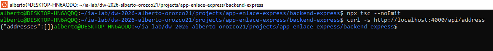

### Cierre del ISS

```bash
npm run dev
```

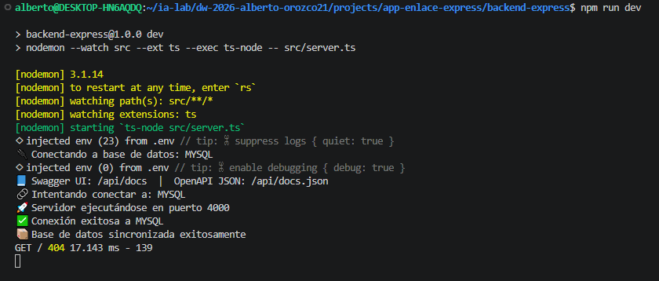


> El servidor debe arrancar sin error. Detenerlo con Ctrl+C antes de continuar.

---

## 9. ISS-08 — PARCHE — Relación Company ↔ Contact / Address

**Objetivo:** cerrar el ciclo Company↔Contact↔Address. `Company` (Empresa) referencia a `Contact` (`contacto_principal_id`) y a `Address` (`direccion_facturacion_id`), pero ambas tablas dependían de `Company` (`empresa_id`) y no existían todavía cuando se creó `company.model.ts` (ISS-03). Con `Contact` (ISS-06) y `Address` (ISS-07) ya creadas, se agregan ahora las dos columnas FK que faltaban en `companies` mediante **PARCHE**.  
**Bloqueado por:** ISS-07.

### Criterios de aceptación (ISS-08)

- [X] **9.1** `company.model.ts` con `contacto_principal_id` y `direccion_facturacion_id` (nullable, FK)
- [X] **9.2** `company.associations.ts` (`belongsTo` hacia `Contact` y `Address`)
- [X] **9.3** `config/index.ts` importa `company.associations`
- [X] `npx tsc --noEmit` OK y `npm run dev` sincroniza sin error

---

## 9.1 PARCHE — `company.model.ts`

**PARCHE** — `src/features/business/company/company.model.ts` **ya existe** (ISS-03).

**Dentro de** la interfaz `CompanyI`, **debajo de** `razon_social: string;`, **añadir**:

```ts
  contacto_principal_id?: number | null;
  direccion_facturacion_id?: number | null;
```

**Dentro de** la clase `Company`, **debajo de** `public razon_social!: string;`, **añadir**:

```ts
  public contacto_principal_id!: number | null;
  public direccion_facturacion_id!: number | null;
```

**Dentro de** `Company.init({ ... })`, **debajo de** la columna `razon_social`, **añadir**:

```ts
  contacto_principal_id: {
    type: DataTypes.INTEGER,
    references: { model: "contacts", key: "id" },
    allowNull: true,
  },
  direccion_facturacion_id: {
    type: DataTypes.INTEGER,
    references: { model: "addresses", key: "id" },
    allowNull: true,
  },
```

También **añadir** ambos campos al `create` / `updatePut` del controller (`company.controller.ts`), igual que el resto de columnas (`body.contacto_principal_id ?? null`, `body.direccion_facturacion_id ?? null`).

---

## 9.2 Asociaciones Company ↔ Contact / Address

```bash
: > src/features/business/companies/company.associations.ts
cat >> src/features/business/companies/company.associations.ts << 'EOF'
import { Company } from "./companies.model";
import { Contact } from "../contact/contact.model";
import { Address } from "../address/address.model";

Company.belongsTo(Contact, { foreignKey: "contacto_principal_id", as: "contacto_principal" });
Company.belongsTo(Address, { foreignKey: "direccion_facturacion_id", as: "direccion_facturacion" });
EOF
```
---

## 9.3 PARCHE — `config/index.ts`

**Debajo de** `import "../features/business/address/address.associations";` (o el último import de asociaciones existente), **añadir**:

```ts
import "../features/business/companies/company.associations";
```

### Verificación

```bash
npx tsc --noEmit
curl -s -X PATCH http://localhost:4000/api/companies/1 \
  -H 'Content-Type: application/json' \
  -d '{"contacto_principal_id":1,"direccion_facturacion_id":1}'
```

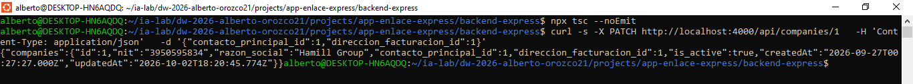

### Cierre del ISS
```bash
npm run dev
```

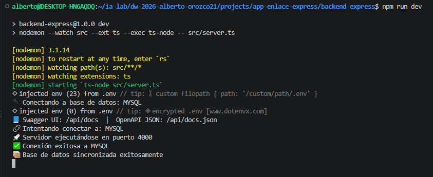

---

## 10. ISS-09 — Feature Messenger

**Objetivo:** CRUD completo + seeder + swagger de **Messenger** (tabla `messengers`).  
**Bloqueado por:** ISS-08.  
**API:** `/api/messengers` — **SIN AUTH**.  
**Patrón:** mismo que las features anteriores (modelo → controller/routes → http → cableado → seeder → swagger).

### Criterios de aceptación (ISS-09)

- [X] **10.1** Modelo `messenger.model.ts` (`is_active` boolean + `timestamps: true`, columnas snake_case)
- [X] **10.2** Controller + routes: getAll, getOne, create, update PUT/PATCH, delete físico y lógico
- [X] **10.3** Carpeta `http/` con get, create, update, delete
- [X] **10.4** Cableado en `routes/index.ts` + `config/index.ts`
- [X] **10.5** Seeder + registro en SeedersRunner / `counts.ts`
- [X] **10.6** Swagger + registro en `src/swagger`

---

```bash
mkdir -p \
  src/features/business/messenger/http
```

## 10.1 Modelo Messenger

```bash
: > src/features/business/messenger/messenger.model.ts
cat >> src/features/business/messenger/messenger.model.ts << 'EOF'
import { DataTypes, Model } from "sequelize";
import { sequelize } from "../../../database/db";

export interface MessengerI {
  id?: number;
  nombre: string;
  documento_identidad: string;
  telefono?: string | null;
  tipo_vehiculo: "moto" | "carro" | "bicicleta" | "a_pie";
  placa_vehiculo?: string | null;
  zona_asignada?: string | null;
  is_active?: boolean;
  createdAt?: Date;
  updatedAt?: Date;
}

export class Messenger extends Model {
  public id!: number;
  public nombre!: string;
  public documento_identidad!: string;
  public telefono!: string | null;
  public tipo_vehiculo!: "moto" | "carro" | "bicicleta" | "a_pie";
  public placa_vehiculo!: string | null;
  public zona_asignada!: string | null;
  public is_active!: boolean;
  public readonly createdAt!: Date;
  public readonly updatedAt!: Date;
}

Messenger.init(
  {
    nombre: {
      type: DataTypes.STRING,
      allowNull: false,
    },
    documento_identidad: {
      type: DataTypes.STRING,
      allowNull: false,
      unique: true,
    },
    telefono: {
      type: DataTypes.STRING,
      allowNull: true,
    },
    tipo_vehiculo: {
      type: DataTypes.ENUM("moto", "carro", "bicicleta", "a_pie"),
      allowNull: false,
      defaultValue: "moto",
    },
    placa_vehiculo: {
      type: DataTypes.STRING,
      allowNull: true,
    },
    zona_asignada: {
      type: DataTypes.STRING,
      allowNull: true,
    },
    is_active: {
      type: DataTypes.BOOLEAN,
      allowNull: true,
      defaultValue: false,
    },
  },
  {
    sequelize,
    modelName: "Messenger",
    tableName: "messengers",
    timestamps: true,
  }
);
EOF
```

---

## 10.2 Controller + routes (CRUD completo)

```bash
: > src/features/business/messenger/messenger.controller.ts
cat >> src/features/business/messenger/messenger.controller.ts << 'EOF'
import { Request, Response } from "express";
import { Messenger, MessengerI } from "./messenger.model";

function paramId(req: Request): number {
  const raw = req.params.id;
  const value = Array.isArray(raw) ? raw[0] : raw;
  return Number(value);
}

export class MessengerController {
  // ================== READ ==================
  public async getAll(req: Request, res: Response) {
    try {
      const messengers = await Messenger.findAll({
        where: { is_active: true },
      });
      res.status(200).json({ messengers });
    } catch (error) {
      res.status(500).json({ error: "Error fetching messengers", detail: String(error) });
    }
  }

  public async getOne(req: Request, res: Response) {
    try {
      const id = paramId(req);
      const messenger = await Messenger.findByPk(id);
      if (!messenger) {
        res.status(404).json({ error: "Messenger not found" });
        return;
      }
      res.status(200).json({ messenger: messenger });
    } catch (error) {
      res.status(500).json({ error: "Error fetching messenger", detail: String(error) });
    }
  }

  // ================== CREATE ==================
  public async create(req: Request, res: Response) {
    try {
      const body = req.body as MessengerI;


      const messenger = await Messenger.create({
        nombre: body.nombre,
        documento_identidad: body.documento_identidad,
        telefono: body.telefono ?? null,
        tipo_vehiculo: body.tipo_vehiculo,
        placa_vehiculo: body.placa_vehiculo ?? null,
        zona_asignada: body.zona_asignada ?? null,
        is_active: body.is_active ?? true,
      });
      res.status(201).json({ messenger: messenger });
    } catch (error) {
      res.status(500).json({ error: "Error creating messenger", detail: String(error) });
    }
  }

  // ================== UPDATE ==================
  public async updatePut(req: Request, res: Response) {
    try {
      const id = paramId(req);
      const body = req.body as MessengerI;
      const messenger = await Messenger.findByPk(id);
      if (!messenger) {
        res.status(404).json({ error: "Messenger not found" });
        return;
      }


      await messenger.update({
        nombre: body.nombre,
        documento_identidad: body.documento_identidad,
        telefono: body.telefono ?? messenger.telefono,
        tipo_vehiculo: body.tipo_vehiculo,
        placa_vehiculo: body.placa_vehiculo ?? messenger.placa_vehiculo,
        zona_asignada: body.zona_asignada ?? messenger.zona_asignada,
        is_active: body.is_active ?? messenger.is_active,
      });

      res.status(200).json({ messenger: messenger });
    } catch (error) {
      res.status(500).json({ error: "Error updating messenger (PUT)", detail: String(error) });
    }
  }

  public async updatePatch(req: Request, res: Response) {
    try {
      const id = paramId(req);
      const body = req.body as Partial<MessengerI>;
      const messenger = await Messenger.findByPk(id);
      if (!messenger) {
        res.status(404).json({ error: "Messenger not found" });
        return;
      }

      await messenger.update(body);
      res.status(200).json({ messenger: messenger });
    } catch (error) {
      res.status(500).json({ error: "Error updating messenger (PATCH)", detail: String(error) });
    }
  }

  // ================== DELETE ==================
  /** Eliminacion fisica */
  public async deletePhysical(req: Request, res: Response) {
    try {
      const id = paramId(req);
      const messenger = await Messenger.findByPk(id);
      if (!messenger) {
        res.status(404).json({ error: "Messenger not found" });
        return;
      }
      await messenger.destroy();
      res.status(200).json({ message: "Messenger permanently deleted", id });
    } catch (error) {
      res.status(500).json({ error: "Error deleting messenger", detail: String(error) });
    }
  }

  /** Eliminacion logica -> is_active = false */
  public async deleteLogical(req: Request, res: Response) {
    try {
      const id = paramId(req);
      const messenger = await Messenger.findByPk(id);
      if (!messenger) {
        res.status(404).json({ error: "Messenger not found" });
        return;
      }
      await messenger.update({ is_active: false });
      res.status(200).json({
        message: "Messenger deactivated (logical delete)",
        messenger: messenger,
      });
    } catch (error) {
      res.status(500).json({ error: "Error deactivating messenger", detail: String(error) });
    }
  }
}
EOF
```
```bash
: > src/features/business/messenger/messenger.routes.ts
cat >> src/features/business/messenger/messenger.routes.ts << 'EOF'
import { Application } from "express";
import { MessengerController } from "./messenger.controller";

export class MessengerRoutes {
  public messengerController: MessengerController = new MessengerController();

  public routes(app: Application): void {
    // ================== RUTAS SIN AUTENTICACION / SIN MIDDLEWARE JWT ==================

    // getAll
    app
      .route("/api/messengers")
      .get(this.messengerController.getAll.bind(this.messengerController));

    // getOne
    app
      .route("/api/messengers/:id")
      .get(this.messengerController.getOne.bind(this.messengerController));

    // create
    app
      .route("/api/messengers")
      .post(this.messengerController.create.bind(this.messengerController));

    // update (PUT / PATCH)
    app
      .route("/api/messengers/:id")
      .put(this.messengerController.updatePut.bind(this.messengerController))
      .patch(this.messengerController.updatePatch.bind(this.messengerController));

    // delete fisico
    app
      .route("/api/messengers/:id")
      .delete(this.messengerController.deletePhysical.bind(this.messengerController));

    // delete logico
    app
      .route("/api/messengers/:id/deactivate")
      .patch(this.messengerController.deleteLogical.bind(this.messengerController));
  }
}
EOF
```

---

## 10.3 HTTP

```bash
: > src/features/business/messenger/http/messengers.get.http
cat >> src/features/business/messenger/http/messengers.get.http << 'EOF'
### Feature Messenger — GET ALL / GET ONE
### Leyenda: SIN AUTH (sin middleware JWT / sin autenticacion)
@baseUrl = http://localhost:4000
@id = 1

# @name getAllMessenger
GET {{baseUrl}}/api/messengers

###

# @name getOneMessenger
GET {{baseUrl}}/api/messengers/{{id}}
EOF
```
```bash
: > src/features/business/messenger/http/messengers.create.http
cat >> src/features/business/messenger/http/messengers.create.http << 'EOF'
### Feature Messenger — CREATE
### Leyenda: SIN AUTH (sin middleware JWT / sin autenticacion)
@baseUrl = http://localhost:4000

# @name createMessenger
POST {{baseUrl}}/api/messengers
Content-Type: application/json

{
  "nombre": "Ejemplo nombre",
  "documento_identidad": "Ejemplo documento_identidad",
  "telefono": "Ejemplo telefono",
  "tipo_vehiculo": "moto",
  "placa_vehiculo": "Ejemplo placa_vehiculo",
  "zona_asignada": "Ejemplo zona_asignada",
  "is_active": true
}
EOF
```
```bash
: > src/features/business/messenger/http/messengers.update.http
cat >> src/features/business/messenger/http/messengers.update.http << 'EOF'
### Feature Messenger — UPDATE (PUT) / UPDATE (PATCH)
### Leyenda: SIN AUTH (sin middleware JWT / sin autenticacion)
@baseUrl = http://localhost:4000
@id = 1

# @name updateMessengerPut
PUT {{baseUrl}}/api/messengers/{{id}}
Content-Type: application/json

{
  "nombre": "Ejemplo nombre",
  "documento_identidad": "Ejemplo documento_identidad",
  "telefono": "Ejemplo telefono",
  "tipo_vehiculo": "moto",
  "placa_vehiculo": "Ejemplo placa_vehiculo",
  "zona_asignada": "Ejemplo zona_asignada",
  "is_active": true
}

###

# @name updateMessengerPatch
PATCH {{baseUrl}}/api/messengers/{{id}}
Content-Type: application/json

{
  "documento_identidad": "Ejemplo documento_identidad"
}
EOF
```
```bash
: > src/features/business/messenger/http/messengers.delete.http
cat >> src/features/business/messenger/http/messengers.delete.http << 'EOF'
### Feature Messenger — DELETE fisico / DELETE logico (is_active = false)
### Leyenda: SIN AUTH (sin middleware JWT / sin autenticacion)
@baseUrl = http://localhost:4000
@id = 1

# @name deleteMessengerPhysical
DELETE {{baseUrl}}/api/messengers/{{id}}

###

# @name deleteMessengerLogical
PATCH {{baseUrl}}/api/messengers/{{id}}/deactivate
EOF
```

---

## 10.4 Cableado Routes + Config

**PARCHE** — `src/routes/index.ts` **ya existe**.

1. **Debajo de** `import { AddressRoutes } ...`, **añadir**:

```ts
import { MessengerRoutes } from "../features/business/messenger/messenger.routes";
```

2. **Dentro de** `export class Routes`, **debajo de** `addressRoutes`, **añadir**:

```ts
  public messengerRoutes: MessengerRoutes = new MessengerRoutes();
```

**PARCHE** — `src/config/index.ts` **ya existe**.

1. **Debajo de** `import "../features/business/address/address.model";`, **añadir**:

```ts
import "../features/business/messenger/messenger.model";
```

2. **Dentro de** `routes()`, **debajo de** `this.routePrv.addressRoutes.routes(this.app);`, **añadir**:

```ts
    this.routePrv.messengerRoutes.routes(this.app);
```

---

## 10.5 Seeder Messenger

```bash
: > src/features/business/messenger/messenger.seeder.ts
cat >> src/features/business/messenger/messenger.seeder.ts << 'EOF'
import { faker } from "@faker-js/faker";
import { Messenger } from "./messenger.model";


/**
 * Seeder del feature Messenger (datos falsos con @faker-js/faker).
 * Se invoca desde `src/database/seeders` (SeedersRunner), no desde la App.
 *
 * Idempotente: si ya hay filas, no vuelve a insertar.
 */
export async function seedMessengers(count: number): Promise<number> {
  if (count <= 0) {
    console.log("\u23ed\ufe0f  messengers: count=0, se omite");
    return 0;
  }

  const existing = await Messenger.count();
  if (existing > 0) {
    console.log(`\u23ed\ufe0f  messengers: ya hay ${existing} registro(s), se omite seeder`);
    return 0;
  }


  const rows = Array.from({ length: count }, () => ({
      nombre: faker.person.fullName(),
      documento_identidad: faker.string.numeric(10),
      telefono: faker.phone.number({ style: "national" }),
      tipo_vehiculo: faker.helpers.arrayElement(["moto", "carro", "bicicleta", "a_pie"]),
      placa_vehiculo: faker.vehicle.vrm(),
      zona_asignada: faker.location.city(),
      is_active: true,
  }));

  await Messenger.bulkCreate(rows);
  console.log(`\u2705 messengers: insertados ${count} registro(s) falsos`);
  return count;
}
EOF
```
**PARCHE** — `src/database/seeders/counts.ts` **ya existe**.

- **Dentro de** `SeedCounts`, **añadir** `messengers: number;`
- **Dentro de** `DEFAULT_SEED_COUNTS`, **añadir** `messengers: 15,`
- Lectura opcional por env: `SEED_MESSENGERS`.

**PARCHE** — `src/database/seeders/index.ts` **ya existe**.

1. **Debajo de** el import del seeder anterior, **añadir** `import { seedMessengers } from "../../features/business/messenger/messenger.seeder";`
2. **Debajo de** `await seedAddresses(counts.addresses);`, **añadir** `await seedMessengers(counts.messengers);`

---

## 10.6 Swagger Messenger

```bash
: > src/features/business/messenger/messenger.swagger.ts
cat >> src/features/business/messenger/messenger.swagger.ts << 'EOF'
/**
 * Documentacion OpenAPI del feature Messenger.
 * Se agrega desde `src/swagger` (registry externo), no se monta aqui.
 *
 * Leyenda: endpoints documentados como SIN AUTH (sin middleware JWT).
 */

export const messengerSwagger = {
  tags: [
    {
      name: "Messengers",
      description: "CRUD de messengers — **SIN AUTH** (sin middleware JWT)",
    },
  ],
  paths: {
    "/api/messengers": {
      get: {
        tags: ["Messengers"],
        summary: "Listar messengers activos",
        description: "SIN AUTH — retorna registros con is_active=true",
        security: [],
        responses: {
          "200": {
            description: "Lista de messengers",
            content: {
              "application/json": {
                schema: {
                  type: "object",
                  properties: {
                    messengers: {
                      type: "array",
                      items: { $ref: "#/components/schemas/Messenger" },
                    },
                  },
                },
              },
            },
          },
        },
      },
      post: {
        tags: ["Messengers"],
        summary: "Crear messenger",
        description: "SIN AUTH",
        security: [],
        requestBody: {
          required: true,
          content: {
            "application/json": {
              schema: { $ref: "#/components/schemas/MessengerCreate" },
            },
          },
        },
        responses: {
          "201": {
            description: "Messenger creado",
            content: {
              "application/json": {
                schema: {
                  type: "object",
                  properties: {
                    messenger: { $ref: "#/components/schemas/Messenger" },
                  },
                },
              },
            },
          },
        },
      },
    },
    "/api/messengers/{id}": {
      get: {
        tags: ["Messengers"],
        summary: "Obtener messenger por id",
        description: "SIN AUTH",
        security: [],
        parameters: [{ name: "id", in: "path", required: true, schema: { type: "integer" } }],
        responses: {
          "200": {
            description: "Messenger encontrado",
            content: {
              "application/json": {
                schema: {
                  type: "object",
                  properties: {
                    messenger: { $ref: "#/components/schemas/Messenger" },
                  },
                },
              },
            },
          },
          "404": { description: "No encontrado" },
        },
      },
      put: {
        tags: ["Messengers"],
        summary: "Actualizar messenger (PUT — reemplazo)",
        description: "SIN AUTH",
        security: [],
        parameters: [{ name: "id", in: "path", required: true, schema: { type: "integer" } }],
        requestBody: {
          required: true,
          content: {
            "application/json": {
              schema: { $ref: "#/components/schemas/MessengerCreate" },
            },
          },
        },
        responses: {
          "200": { description: "Actualizado" },
          "404": { description: "No encontrado" },
        },
      },
      patch: {
        tags: ["Messengers"],
        summary: "Actualizar messenger (PATCH — parcial)",
        description: "SIN AUTH",
        security: [],
        parameters: [{ name: "id", in: "path", required: true, schema: { type: "integer" } }],
        requestBody: {
          required: true,
          content: {
            "application/json": {
              schema: { $ref: "#/components/schemas/MessengerPatch" },
            },
          },
        },
        responses: {
          "200": { description: "Actualizado" },
          "404": { description: "No encontrado" },
        },
      },
      delete: {
        tags: ["Messengers"],
        summary: "Eliminar messenger (fisico)",
        description: "SIN AUTH — borra la fila",
        security: [],
        parameters: [{ name: "id", in: "path", required: true, schema: { type: "integer" } }],
        responses: {
          "200": { description: "Eliminado" },
          "404": { description: "No encontrado" },
        },
      },
    },
    "/api/messengers/{id}/deactivate": {
      patch: {
        tags: ["Messengers"],
        summary: "Eliminar messenger (logico)",
        description: "SIN AUTH — is_active = false",
        security: [],
        parameters: [{ name: "id", in: "path", required: true, schema: { type: "integer" } }],
        responses: {
          "200": { description: "Desactivado" },
          "404": { description: "No encontrado" },
        },
      },
    },
  },
  components: {
    schemas: {
      Messenger: {
        type: "object",
        properties: {
      id: { type: "integer", example: 1 },
      nombre: { type: "string", example: "nombre" },
      documento_identidad: { type: "string", example: "documento_identidad" },
      telefono: { type: "string", example: "telefono" },
      tipo_vehiculo: { type: "string", enum: ["moto", "carro", "bicicleta", "a_pie"], example: "moto" },
      placa_vehiculo: { type: "string", example: "placa_vehiculo" },
      zona_asignada: { type: "string", example: "zona_asignada" },
      is_active: { type: "boolean", example: true },
      createdAt: { type: "string", format: "date-time" },
      updatedAt: { type: "string", format: "date-time" },
        },
      },
      MessengerCreate: {
        type: "object",
        required: ["nombre", "documento_identidad", "tipo_vehiculo"],
        properties: {
      nombre: { type: "string", example: "nombre" },
      documento_identidad: { type: "string", example: "documento_identidad" },
      telefono: { type: "string", example: "telefono" },
      tipo_vehiculo: { type: "string", enum: ["moto", "carro", "bicicleta", "a_pie"], example: "moto" },
      placa_vehiculo: { type: "string", example: "placa_vehiculo" },
      zona_asignada: { type: "string", example: "zona_asignada" },
      is_active: { type: "boolean", example: true },
        },
      },
      MessengerPatch: {
        type: "object",
        properties: {
      nombre: { type: "string", example: "nombre" },
      documento_identidad: { type: "string", example: "documento_identidad" },
      telefono: { type: "string", example: "telefono" },
      tipo_vehiculo: { type: "string", enum: ["moto", "carro", "bicicleta", "a_pie"], example: "moto" },
      placa_vehiculo: { type: "string", example: "placa_vehiculo" },
      zona_asignada: { type: "string", example: "zona_asignada" },
      is_active: { type: "boolean", example: true },
        },
      },
    },
  },
};
EOF
```
**PARCHE** — `src/swagger/index.ts` **ya existe**.

1. **Debajo de** `import { addressSwagger } ...`, **añadir** `import { messengerSwagger } from "../features/business/messenger/messenger.swagger";`
2. **Dentro de** `featureSwaggerModules`, **debajo de** `addressSwagger,`, **añadir** `messengerSwagger,`

### Verificación

```bash
curl -s http://localhost:4000/api/messengers
```

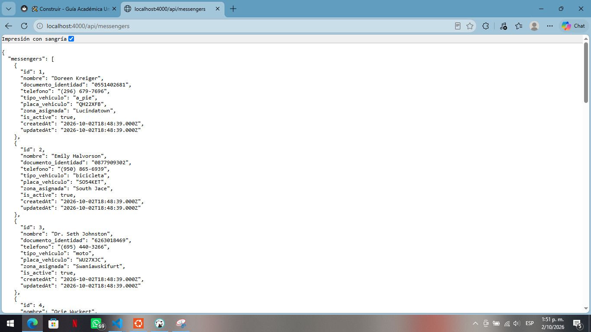

### Cierre del ISS

```bash
npm run dev
```

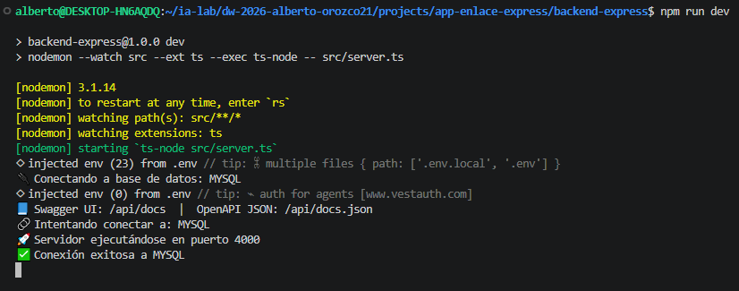

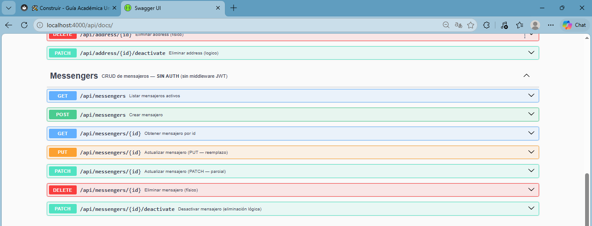

> El servidor debe arrancar sin error. Detenerlo con Ctrl+C antes de continuar.

---

## 11. ISS-10 — Feature Rate

**Objetivo:** CRUD completo + seeder + swagger de **Rate** (tabla `rates`).  
**Bloqueado por:** ISS-09.  
**API:** `/api/rates` — **SIN AUTH**.  
**Patrón:** mismo que las features anteriores (modelo → controller/routes → http → cableado → seeder → swagger).

### Criterios de aceptación (ISS-10)

- [X] **11.1** Modelo `rate.model.ts` (`is_active` boolean + `timestamps: true`, columnas snake_case)
- [X] **11.2** Controller + routes: getAll, getOne, create, update PUT/PATCH, delete físico y lógico
- [X] **11.3** Carpeta `http/` con get, create, update, delete
- [X] **11.4** Cableado en `routes/index.ts` + `config/index.ts`
- [X] **11.5** Seeder + registro en SeedersRunner / `counts.ts`
- [X] **11.6** Swagger + registro en `src/swagger`

---

```bash
mkdir -p \
  src/features/business/rate/http
```

## 11.1 Modelo Rate

```bash
: > src/features/business/rate/rate.model.ts
cat >> src/features/business/rate/rate.model.ts << 'EOF'
import { DataTypes, Model } from "sequelize";
import { sequelize } from "../../../database/db";

export interface RateI {
  id?: number;
  nombre: string;
  zona: string;
  regla_calculo: "por_peso" | "por_zona" | "plana";
  valor_base: number;
  valor_por_kg_adicional?: number | null;
  recargo_urgente_pct?: number | null;
  vigencia_desde: string;
  vigencia_hasta?: string | null;
  is_active?: boolean;
  createdAt?: Date;
  updatedAt?: Date;
}

export class Rate extends Model {
  public id!: number;
  public nombre!: string;
  public zona!: string;
  public regla_calculo!: "por_peso" | "por_zona" | "plana";
  public valor_base!: number;
  public valor_por_kg_adicional!: number | null;
  public recargo_urgente_pct!: number | null;
  public vigencia_desde!: string;
  public vigencia_hasta!: string | null;
  public is_active!: boolean;
  public readonly createdAt!: Date;
  public readonly updatedAt!: Date;
}

Rate.init(
  {
    nombre: {
      type: DataTypes.STRING,
      allowNull: false,
    },
    zona: {
      type: DataTypes.STRING,
      allowNull: false,
    },
    regla_calculo: {
      type: DataTypes.ENUM("por_peso", "por_zona", "plana"),
      allowNull: false,
      defaultValue: "por_peso",
    },
    valor_base: {
      type: DataTypes.DECIMAL(12, 2),
      allowNull: false,
    },
    valor_por_kg_adicional: {
      type: DataTypes.DECIMAL(12, 2),
      allowNull: true,
    },
    recargo_urgente_pct: {
      type: DataTypes.DECIMAL(12, 2),
      allowNull: true,
    },
    vigencia_desde: {
      type: DataTypes.DATEONLY,
      allowNull: false,
    },
    vigencia_hasta: {
      type: DataTypes.DATEONLY,
      allowNull: true,
    },
    is_active: {
      type: DataTypes.BOOLEAN,
      allowNull: true,
      defaultValue: false,
    },
  },
  {
    sequelize,
    modelName: "Rate",
    tableName: "rates",
    timestamps: true,
  }
);
EOF
```

---

## 11.2 Controller + routes (CRUD completo)

```bash
: > src/features/business/rate/rate.controller.ts
cat >> src/features/business/rate/rate.controller.ts << 'EOF'
import { Request, Response } from "express";
import { Rate, RateI } from "./rate.model";

function paramId(req: Request): number {
  const raw = req.params.id;
  const value = Array.isArray(raw) ? raw[0] : raw;
  return Number(value);
}

export class RateController {
  // ================== READ ==================
  public async getAll(req: Request, res: Response) {
    try {
      const rates = await Rate.findAll({
        where: { is_active: true },
      });
      res.status(200).json({ rates });
    } catch (error) {
      res.status(500).json({ error: "Error fetching rates", detail: String(error) });
    }
  }

  public async getOne(req: Request, res: Response) {
    try {
      const id = paramId(req);
      const rate = await Rate.findByPk(id);
      if (!rate) {
        res.status(404).json({ error: "Rate not found" });
        return;
      }
      res.status(200).json({ rate: rate });
    } catch (error) {
      res.status(500).json({ error: "Error fetching rate", detail: String(error) });
    }
  }

  // ================== CREATE ==================
  public async create(req: Request, res: Response) {
    try {
      const body = req.body as RateI;


      const rate = await Rate.create({
        nombre: body.nombre,
        zona: body.zona,
        regla_calculo: body.regla_calculo,
        valor_base: body.valor_base,
        valor_por_kg_adicional: body.valor_por_kg_adicional ?? null,
        recargo_urgente_pct: body.recargo_urgente_pct ?? null,
        vigencia_desde: body.vigencia_desde,
        vigencia_hasta: body.vigencia_hasta ?? null,
        is_active: body.is_active ?? true,
      });
      res.status(201).json({ rate: rate });
    } catch (error) {
      res.status(500).json({ error: "Error creating rate", detail: String(error) });
    }
  }

  // ================== UPDATE ==================
  public async updatePut(req: Request, res: Response) {
    try {
      const id = paramId(req);
      const body = req.body as RateI;
      const rate = await Rate.findByPk(id);
      if (!rate) {
        res.status(404).json({ error: "Rate not found" });
        return;
      }


      await rate.update({
        nombre: body.nombre,
        zona: body.zona,
        regla_calculo: body.regla_calculo,
        valor_base: body.valor_base,
        valor_por_kg_adicional: body.valor_por_kg_adicional ?? rate.valor_por_kg_adicional,
        recargo_urgente_pct: body.recargo_urgente_pct ?? rate.recargo_urgente_pct,
        vigencia_desde: body.vigencia_desde,
        vigencia_hasta: body.vigencia_hasta ?? rate.vigencia_hasta,
        is_active: body.is_active ?? rate.is_active,
      });

      res.status(200).json({ rate: rate });
    } catch (error) {
      res.status(500).json({ error: "Error updating rate (PUT)", detail: String(error) });
    }
  }

  public async updatePatch(req: Request, res: Response) {
    try {
      const id = paramId(req);
      const body = req.body as Partial<RateI>;
      const rate = await Rate.findByPk(id);
      if (!rate) {
        res.status(404).json({ error: "Rate not found" });
        return;
      }

      await rate.update(body);
      res.status(200).json({ rate: rate });
    } catch (error) {
      res.status(500).json({ error: "Error updating rate (PATCH)", detail: String(error) });
    }
  }

  // ================== DELETE ==================
  /** Eliminacion fisica */
  public async deletePhysical(req: Request, res: Response) {
    try {
      const id = paramId(req);
      const rate = await Rate.findByPk(id);
      if (!rate) {
        res.status(404).json({ error: "Rate not found" });
        return;
      }
      await rate.destroy();
      res.status(200).json({ message: "Rate permanently deleted", id });
    } catch (error) {
      res.status(500).json({ error: "Error deleting rate", detail: String(error) });
    }
  }

  /** Eliminacion logica -> is_active = false */
  public async deleteLogical(req: Request, res: Response) {
    try {
      const id = paramId(req);
      const rate = await Rate.findByPk(id);
      if (!rate) {
        res.status(404).json({ error: "Rate not found" });
        return;
      }
      await rate.update({ is_active: false });
      res.status(200).json({
        message: "Rate deactivated (logical delete)",
        rate: rate,
      });
    } catch (error) {
      res.status(500).json({ error: "Error deactivating rate", detail: String(error) });
    }
  }
}
EOF
```
```bash
: > src/features/business/rate/rate.routes.ts
cat >> src/features/business/rate/rate.routes.ts << 'EOF'
import { Application } from "express";
import { RateController } from "./rate.controller";

export class RateRoutes {
  public rateController: RateController = new RateController();

  public routes(app: Application): void {
    // ================== RUTAS SIN AUTENTICACION / SIN MIDDLEWARE JWT ==================

    // getAll
    app
      .route("/api/rates")
      .get(this.rateController.getAll.bind(this.rateController));

    // getOne
    app
      .route("/api/rates/:id")
      .get(this.rateController.getOne.bind(this.rateController));

    // create
    app
      .route("/api/rates")
      .post(this.rateController.create.bind(this.rateController));

    // update (PUT / PATCH)
    app
      .route("/api/rates/:id")
      .put(this.rateController.updatePut.bind(this.rateController))
      .patch(this.rateController.updatePatch.bind(this.rateController));

    // delete fisico
    app
      .route("/api/rates/:id")
      .delete(this.rateController.deletePhysical.bind(this.rateController));

    // delete logico
    app
      .route("/api/rates/:id/deactivate")
      .patch(this.rateController.deleteLogical.bind(this.rateController));
  }
}
EOF
```

---

## 11.3 HTTP

```bash
: > src/features/business/rate/http/rates.get.http
cat >> src/features/business/rate/http/rates.get.http << 'EOF'
### Feature Rate — GET ALL / GET ONE
### Leyenda: SIN AUTH (sin middleware JWT / sin autenticacion)
@baseUrl = http://localhost:4000
@id = 1

# @name getAllRate
GET {{baseUrl}}/api/rates

###

# @name getOneRate
GET {{baseUrl}}/api/rates/{{id}}
EOF
```
```bash
: > src/features/business/rate/http/rates.create.http
cat >> src/features/business/rate/http/rates.create.http << 'EOF'
### Feature Rate — CREATE
### Leyenda: SIN AUTH (sin middleware JWT / sin autenticacion)
@baseUrl = http://localhost:4000

# @name createRate
POST {{baseUrl}}/api/rates
Content-Type: application/json

{
  "nombre": "Ejemplo nombre",
  "zona": "Ejemplo zona",
  "regla_calculo": "por_peso",
  "valor_base": 10.5,
  "valor_por_kg_adicional": 10.5,
  "recargo_urgente_pct": 10.5,
  "vigencia_desde": "2026-01-15",
  "vigencia_hasta": "2026-01-15",
  "is_active": true
}
EOF
```
```bash
: > src/features/business/rate/http/rates.update.http
cat >> src/features/business/rate/http/rates.update.http << 'EOF'
### Feature Rate — UPDATE (PUT) / UPDATE (PATCH)
### Leyenda: SIN AUTH (sin middleware JWT / sin autenticacion)
@baseUrl = http://localhost:4000
@id = 1

# @name updateRatePut
PUT {{baseUrl}}/api/rates/{{id}}
Content-Type: application/json

{
  "nombre": "Ejemplo nombre",
  "zona": "Ejemplo zona",
  "regla_calculo": "por_peso",
  "valor_base": 10.5,
  "valor_por_kg_adicional": 10.5,
  "recargo_urgente_pct": 10.5,
  "vigencia_desde": "2026-01-15",
  "vigencia_hasta": "2026-01-15",
  "is_active": true
}

###

# @name updateRatePatch
PATCH {{baseUrl}}/api/rates/{{id}}
Content-Type: application/json

{
  "zona": "Ejemplo zona"
}
EOF
```
```bash
: > src/features/business/rate/http/rates.delete.http
cat >> src/features/business/rate/http/rates.delete.http << 'EOF'
### Feature Rate — DELETE fisico / DELETE logico (is_active = false)
### Leyenda: SIN AUTH (sin middleware JWT / sin autenticacion)
@baseUrl = http://localhost:4000
@id = 1

# @name deleteRatePhysical
DELETE {{baseUrl}}/api/rates/{{id}}

###

# @name deleteRateLogical
PATCH {{baseUrl}}/api/rates/{{id}}/deactivate
EOF
```

---

## 11.4 Cableado Routes + Config

**PARCHE** — `src/routes/index.ts` **ya existe**.

1. **Debajo de** `import { MessengerRoutes } ...`, **añadir**:

```ts
import { RateRoutes } from "../features/business/rate/rate.routes";
```

2. **Dentro de** `export class Routes`, **debajo de** `messengerRoutes`, **añadir**:

```ts
  public rateRoutes: RateRoutes = new RateRoutes();
```

**PARCHE** — `src/config/index.ts` **ya existe**.

1. **Debajo de** `import "../features/business/messenger/messenger.model";`, **añadir**:

```ts
import "../features/business/rate/rate.model";
```

2. **Dentro de** `routes()`, **debajo de** `this.routePrv.messengerRoutes.routes(this.app);`, **añadir**:

```ts
    this.routePrv.rateRoutes.routes(this.app);
```

---

## 11.5 Seeder Rate

```bash
: > src/features/business/rate/rate.seeder.ts
cat >> src/features/business/rate/rate.seeder.ts << 'EOF'
import { faker } from "@faker-js/faker";
import { Rate } from "./rate.model";


/**
 * Seeder del feature Rate (datos falsos con @faker-js/faker).
 * Se invoca desde `src/database/seeders` (SeedersRunner), no desde la App.
 *
 * Idempotente: si ya hay filas, no vuelve a insertar.
 */
export async function seedRates(count: number): Promise<number> {
  if (count <= 0) {
    console.log("\u23ed\ufe0f  rates: count=0, se omite");
    return 0;
  }

  const existing = await Rate.count();
  if (existing > 0) {
    console.log(`\u23ed\ufe0f  rates: ya hay ${existing} registro(s), se omite seeder`);
    return 0;
  }


  const rows = Array.from({ length: count }, () => ({
      nombre: faker.commerce.productAdjective() + " " + faker.word.noun(),
      zona: faker.location.city(),
      regla_calculo: faker.helpers.arrayElement(["por_peso", "por_zona", "plana"]),
      valor_base: Number(faker.commerce.price({ min: 5000, max: 20000, dec: 2 })),
      valor_por_kg_adicional: Number(faker.commerce.price({ min: 500, max: 3000, dec: 2 })),
      recargo_urgente_pct: Number(faker.commerce.price({ min: 5, max: 40, dec: 2 })),
      vigencia_desde: faker.date.past().toISOString().slice(0, 10),
      vigencia_hasta: faker.date.recent().toISOString().slice(0, 10),
      is_active: true,
  }));

  await Rate.bulkCreate(rows);
  console.log(`\u2705 rates: insertados ${count} registro(s) falsos`);
  return count;
}
EOF
```
**PARCHE** — `src/database/seeders/counts.ts` **ya existe**.

- **Dentro de** `SeedCounts`, **añadir** `rates: number;`
- **Dentro de** `DEFAULT_SEED_COUNTS`, **añadir** `rates: 15,`
- Lectura opcional por env: `SEED_RATES`.

**PARCHE** — `src/database/seeders/index.ts` **ya existe**.

1. **Debajo de** el import del seeder anterior, **añadir** `import { seedRates } from "../../features/business/rate/rate.seeder";`
2. **Debajo de** `await seedMessengers(counts.messengers);`, **añadir** `await seedRates(counts.rates);`

---

## 11.6 Swagger Rate

```bash
: > src/features/business/rate/rate.swagger.ts
cat >> src/features/business/rate/rate.swagger.ts << 'EOF'
/**
 * Documentacion OpenAPI del feature Rate.
 * Se agrega desde `src/swagger` (registry externo), no se monta aqui.
 *
 * Leyenda: endpoints documentados como SIN AUTH (sin middleware JWT).
 */

export const rateSwagger = {
  tags: [
    {
      name: "Rates",
      description: "CRUD de rates — **SIN AUTH** (sin middleware JWT)",
    },
  ],
  paths: {
    "/api/rates": {
      get: {
        tags: ["Rates"],
        summary: "Listar rates activos",
        description: "SIN AUTH — retorna registros con is_active=true",
        security: [],
        responses: {
          "200": {
            description: "Lista de rates",
            content: {
              "application/json": {
                schema: {
                  type: "object",
                  properties: {
                    rates: {
                      type: "array",
                      items: { $ref: "#/components/schemas/Rate" },
                    },
                  },
                },
              },
            },
          },
        },
      },
      post: {
        tags: ["Rates"],
        summary: "Crear rate",
        description: "SIN AUTH",
        security: [],
        requestBody: {
          required: true,
          content: {
            "application/json": {
              schema: { $ref: "#/components/schemas/RateCreate" },
            },
          },
        },
        responses: {
          "201": {
            description: "Rate creado",
            content: {
              "application/json": {
                schema: {
                  type: "object",
                  properties: {
                    rate: { $ref: "#/components/schemas/Rate" },
                  },
                },
              },
            },
          },
        },
      },
    },
    "/api/rates/{id}": {
      get: {
        tags: ["Rates"],
        summary: "Obtener rate por id",
        description: "SIN AUTH",
        security: [],
        parameters: [{ name: "id", in: "path", required: true, schema: { type: "integer" } }],
        responses: {
          "200": {
            description: "Rate encontrado",
            content: {
              "application/json": {
                schema: {
                  type: "object",
                  properties: {
                    rate: { $ref: "#/components/schemas/Rate" },
                  },
                },
              },
            },
          },
          "404": { description: "No encontrado" },
        },
      },
      put: {
        tags: ["Rates"],
        summary: "Actualizar rate (PUT — reemplazo)",
        description: "SIN AUTH",
        security: [],
        parameters: [{ name: "id", in: "path", required: true, schema: { type: "integer" } }],
        requestBody: {
          required: true,
          content: {
            "application/json": {
              schema: { $ref: "#/components/schemas/RateCreate" },
            },
          },
        },
        responses: {
          "200": { description: "Actualizado" },
          "404": { description: "No encontrado" },
        },
      },
      patch: {
        tags: ["Rates"],
        summary: "Actualizar rate (PATCH — parcial)",
        description: "SIN AUTH",
        security: [],
        parameters: [{ name: "id", in: "path", required: true, schema: { type: "integer" } }],
        requestBody: {
          required: true,
          content: {
            "application/json": {
              schema: { $ref: "#/components/schemas/RatePatch" },
            },
          },
        },
        responses: {
          "200": { description: "Actualizado" },
          "404": { description: "No encontrado" },
        },
      },
      delete: {
        tags: ["Rates"],
        summary: "Eliminar rate (fisico)",
        description: "SIN AUTH — borra la fila",
        security: [],
        parameters: [{ name: "id", in: "path", required: true, schema: { type: "integer" } }],
        responses: {
          "200": { description: "Eliminado" },
          "404": { description: "No encontrado" },
        },
      },
    },
    "/api/rates/{id}/deactivate": {
      patch: {
        tags: ["Rates"],
        summary: "Eliminar rate (logico)",
        description: "SIN AUTH — is_active = false",
        security: [],
        parameters: [{ name: "id", in: "path", required: true, schema: { type: "integer" } }],
        responses: {
          "200": { description: "Desactivado" },
          "404": { description: "No encontrado" },
        },
      },
    },
  },
  components: {
    schemas: {
      Rate: {
        type: "object",
        properties: {
      id: { type: "integer", example: 1 },
      nombre: { type: "string", example: "nombre" },
      zona: { type: "string", example: "zona" },
      regla_calculo: { type: "string", enum: ["por_peso", "por_zona", "plana"], example: "por_peso" },
      valor_base: { type: "number", example: 10.5 },
      valor_por_kg_adicional: { type: "number", example: 10.5 },
      recargo_urgente_pct: { type: "number", example: 10.5 },
      vigencia_desde: { type: "string", format: "date", example: "2026-01-15" },
      vigencia_hasta: { type: "string", format: "date", example: "2026-01-15" },
      is_active: { type: "boolean", example: true },
      createdAt: { type: "string", format: "date-time" },
      updatedAt: { type: "string", format: "date-time" },
        },
      },
      RateCreate: {
        type: "object",
        required: ["nombre", "zona", "regla_calculo", "valor_base", "vigencia_desde"],
        properties: {
      nombre: { type: "string", example: "nombre" },
      zona: { type: "string", example: "zona" },
      regla_calculo: { type: "string", enum: ["por_peso", "por_zona", "plana"], example: "por_peso" },
      valor_base: { type: "number", example: 10.5 },
      valor_por_kg_adicional: { type: "number", example: 10.5 },
      recargo_urgente_pct: { type: "number", example: 10.5 },
      vigencia_desde: { type: "string", format: "date", example: "2026-01-15" },
      vigencia_hasta: { type: "string", format: "date", example: "2026-01-15" },
      is_active: { type: "boolean", example: true },
        },
      },
      RatePatch: {
        type: "object",
        properties: {
      nombre: { type: "string", example: "nombre" },
      zona: { type: "string", example: "zona" },
      regla_calculo: { type: "string", enum: ["por_peso", "por_zona", "plana"], example: "por_peso" },
      valor_base: { type: "number", example: 10.5 },
      valor_por_kg_adicional: { type: "number", example: 10.5 },
      recargo_urgente_pct: { type: "number", example: 10.5 },
      vigencia_desde: { type: "string", format: "date", example: "2026-01-15" },
      vigencia_hasta: { type: "string", format: "date", example: "2026-01-15" },
      is_active: { type: "boolean", example: true },
        },
      },
    },
  },
};
EOF
```
**PARCHE** — `src/swagger/index.ts` **ya existe**.

1. **Debajo de** `import { messengerSwagger } ...`, **añadir** `import { rateSwagger } from "../features/business/rate/rate.swagger";`
2. **Dentro de** `featureSwaggerModules`, **debajo de** `messengerSwagger,`, **añadir** `rateSwagger,`

### Verificación

```bash
curl -s http://localhost:4000/api/rates
```

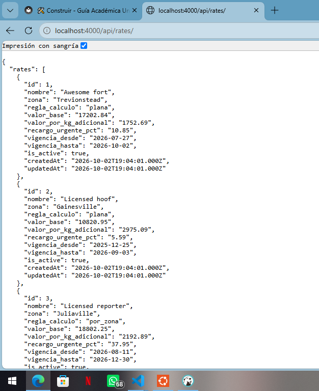

### Cierre del ISS

```bash
npm run dev
```

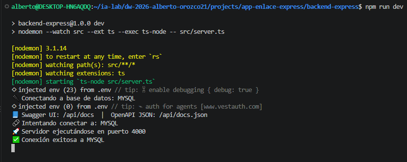

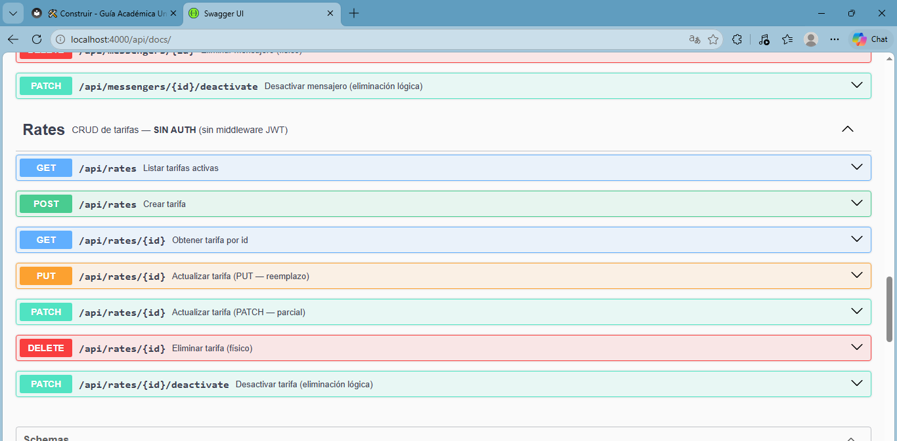

> El servidor debe arrancar sin error. Detenerlo con Ctrl+C antes de continuar.

---

## 12. ISS-11 — Feature Route

**Objetivo:** CRUD completo + seeder + swagger de **Route** (tabla `routes`).  
**Bloqueado por:** ISS-10.  
**API:** `/api/routes` — **SIN AUTH**.  
**Patrón:** mismo que las features anteriores (modelo → controller/routes → http → cableado → relación → seeder → swagger).

### Criterios de aceptación (ISS-11)

- [X] **12.1** Modelo `route.model.ts` (`is_active` boolean + `timestamps: true`, columnas snake_case)
- [X] **12.2** Controller + routes: getAll, getOne, create, update PUT/PATCH, delete físico y lógico
- [X] **12.3** Carpeta `http/` con get, create, update, delete
- [X] **12.4** Cableado en `routes/index.ts` + `config/index.ts`
- [X] **12.5** Asociaciones (`route.associations.ts`) + PARCHE `config`
- [X] **12.6** Seeder + registro en SeedersRunner / `counts.ts`
- [X] **12.7** Swagger + registro en `src/swagger`

---

```bash
mkdir -p \
  src/features/business/route/http
```

## 12.1 Modelo Route

```bash
: > src/features/business/route/route.model.ts
cat >> src/features/business/route/route.model.ts << 'EOF'
import { DataTypes, Model } from "sequelize";
import { sequelize } from "../../../database/db";

export interface RouteI {
  id?: number;
  nombre: string;
  mensajero_id: number;
  zona_cobertura?: string | null;
  fecha: string;
  hora_inicio?: Date | string | null;
  hora_fin?: Date | string | null;
  estado: "planificada" | "en_curso" | "finalizada";
  is_active?: boolean;
  createdAt?: Date;
  updatedAt?: Date;
}

export class Route extends Model {
  public id!: number;
  public nombre!: string;
  public mensajero_id!: number;
  public zona_cobertura!: string | null;
  public fecha!: string;
  public hora_inicio!: Date | string | null;
  public hora_fin!: Date | string | null;
  public estado!: "planificada" | "en_curso" | "finalizada";
  public is_active!: boolean;
  public readonly createdAt!: Date;
  public readonly updatedAt!: Date;
}

Route.init(
  {
    nombre: {
      type: DataTypes.STRING,
      allowNull: false,
    },
    mensajero_id: {
      type: DataTypes.INTEGER,
      references: { model: "messengers", key: "id" },
      allowNull: false,
    },
    zona_cobertura: {
      type: DataTypes.STRING,
      allowNull: true,
    },
    fecha: {
      type: DataTypes.DATEONLY,
      allowNull: false,
    },
    hora_inicio: {
      type: DataTypes.DATE,
      allowNull: true,
    },
    hora_fin: {
      type: DataTypes.DATE,
      allowNull: true,
    },
    estado: {
      type: DataTypes.ENUM("planificada", "en_curso", "finalizada"),
      allowNull: false,
      defaultValue: "planificada",
    },
    is_active: {
      type: DataTypes.BOOLEAN,
      allowNull: true,
      defaultValue: false,
    },
  },
  {
    sequelize,
    modelName: "Route",
    tableName: "routes",
    timestamps: true,
  }
);
EOF
```

---

## 12.2 Controller + routes (CRUD completo)

```bash
: > src/features/business/route/route.controller.ts
cat >> src/features/business/route/route.controller.ts << 'EOF'
import { Request, Response } from "express";
import { Route, RouteI } from "./route.model";
import { Messenger } from "../messenger/messenger.model";

function paramId(req: Request): number {
  const raw = req.params.id;
  const value = Array.isArray(raw) ? raw[0] : raw;
  return Number(value);
}

export class RouteController {
  // ================== READ ==================
  public async getAll(req: Request, res: Response) {
    try {
      const routes = await Route.findAll({
        where: { is_active: true },
      });
      res.status(200).json({ routes });
    } catch (error) {
      res.status(500).json({ error: "Error fetching routes", detail: String(error) });
    }
  }

  public async getOne(req: Request, res: Response) {
    try {
      const id = paramId(req);
      const route = await Route.findByPk(id);
      if (!route) {
        res.status(404).json({ error: "Route not found" });
        return;
      }
      res.status(200).json({ route: route });
    } catch (error) {
      res.status(500).json({ error: "Error fetching route", detail: String(error) });
    }
  }

  // ================== CREATE ==================
  public async create(req: Request, res: Response) {
    try {
      const body = req.body as RouteI;
      if (body.mensajero_id !== undefined && body.mensajero_id !== null) {
        const found_mensajero_id = await Messenger.findByPk(body.mensajero_id);
        if (!found_mensajero_id) {
          res.status(404).json({ error: "Messenger (mensajero_id) not found" });
          return;
        }
      }

      const route = await Route.create({
        nombre: body.nombre,
        mensajero_id: body.mensajero_id,
        zona_cobertura: body.zona_cobertura ?? null,
        fecha: body.fecha,
        hora_inicio: body.hora_inicio ?? null,
        hora_fin: body.hora_fin ?? null,
        estado: body.estado,
        is_active: body.is_active ?? true,
      });
      res.status(201).json({ route: route });
    } catch (error) {
      res.status(500).json({ error: "Error creating route", detail: String(error) });
    }
  }

  // ================== UPDATE ==================
  public async updatePut(req: Request, res: Response) {
    try {
      const id = paramId(req);
      const body = req.body as RouteI;
      const route = await Route.findByPk(id);
      if (!route) {
        res.status(404).json({ error: "Route not found" });
        return;
      }
      if (body.mensajero_id !== undefined && body.mensajero_id !== null) {
        const found_mensajero_id = await Messenger.findByPk(body.mensajero_id);
        if (!found_mensajero_id) {
          res.status(404).json({ error: "Messenger (mensajero_id) not found" });
          return;
        }
      }

      await route.update({
        nombre: body.nombre,
        mensajero_id: body.mensajero_id,
        zona_cobertura: body.zona_cobertura ?? route.zona_cobertura,
        fecha: body.fecha,
        hora_inicio: body.hora_inicio ?? route.hora_inicio,
        hora_fin: body.hora_fin ?? route.hora_fin,
        estado: body.estado,
        is_active: body.is_active ?? route.is_active,
      });

      res.status(200).json({ route: route });
    } catch (error) {
      res.status(500).json({ error: "Error updating route (PUT)", detail: String(error) });
    }
  }

  public async updatePatch(req: Request, res: Response) {
    try {
      const id = paramId(req);
      const body = req.body as Partial<RouteI>;
      const route = await Route.findByPk(id);
      if (!route) {
        res.status(404).json({ error: "Route not found" });
        return;
      }

      await route.update(body);
      res.status(200).json({ route: route });
    } catch (error) {
      res.status(500).json({ error: "Error updating route (PATCH)", detail: String(error) });
    }
  }

  // ================== DELETE ==================
  /** Eliminacion fisica */
  public async deletePhysical(req: Request, res: Response) {
    try {
      const id = paramId(req);
      const route = await Route.findByPk(id);
      if (!route) {
        res.status(404).json({ error: "Route not found" });
        return;
      }
      await route.destroy();
      res.status(200).json({ message: "Route permanently deleted", id });
    } catch (error) {
      res.status(500).json({ error: "Error deleting route", detail: String(error) });
    }
  }

  /** Eliminacion logica -> is_active = false */
  public async deleteLogical(req: Request, res: Response) {
    try {
      const id = paramId(req);
      const route = await Route.findByPk(id);
      if (!route) {
        res.status(404).json({ error: "Route not found" });
        return;
      }
      await route.update({ is_active: false });
      res.status(200).json({
        message: "Route deactivated (logical delete)",
        route: route,
      });
    } catch (error) {
      res.status(500).json({ error: "Error deactivating route", detail: String(error) });
    }
  }
}
EOF
```
```bash
: > src/features/business/route/route.routes.ts
cat >> src/features/business/route/route.routes.ts << 'EOF'
import { Application } from "express";
import { RouteController } from "./route.controller";

export class RouteRoutes {
  public routeController: RouteController = new RouteController();

  public routes(app: Application): void {
    // ================== RUTAS SIN AUTENTICACION / SIN MIDDLEWARE JWT ==================

    // getAll
    app
      .route("/api/routes")
      .get(this.routeController.getAll.bind(this.routeController));

    // getOne
    app
      .route("/api/routes/:id")
      .get(this.routeController.getOne.bind(this.routeController));

    // create
    app
      .route("/api/routes")
      .post(this.routeController.create.bind(this.routeController));

    // update (PUT / PATCH)
    app
      .route("/api/routes/:id")
      .put(this.routeController.updatePut.bind(this.routeController))
      .patch(this.routeController.updatePatch.bind(this.routeController));

    // delete fisico
    app
      .route("/api/routes/:id")
      .delete(this.routeController.deletePhysical.bind(this.routeController));

    // delete logico
    app
      .route("/api/routes/:id/deactivate")
      .patch(this.routeController.deleteLogical.bind(this.routeController));
  }
}
EOF
```

---

## 12.3 HTTP

```bash
: > src/features/business/route/http/routes.get.http
cat >> src/features/business/route/http/routes.get.http << 'EOF'
### Feature Route — GET ALL / GET ONE
### Leyenda: SIN AUTH (sin middleware JWT / sin autenticacion)
@baseUrl = http://localhost:4000
@id = 1

# @name getAllRoute
GET {{baseUrl}}/api/routes

###

# @name getOneRoute
GET {{baseUrl}}/api/routes/{{id}}
EOF
```
```bash
: > src/features/business/route/http/routes.create.http
cat >> src/features/business/route/http/routes.create.http << 'EOF'
### Feature Route — CREATE
### Leyenda: SIN AUTH (sin middleware JWT / sin autenticacion)
@baseUrl = http://localhost:4000

# @name createRoute
POST {{baseUrl}}/api/routes
Content-Type: application/json

{
  "nombre": "Ejemplo nombre",
  "mensajero_id": 1,
  "zona_cobertura": "Ejemplo zona_cobertura",
  "fecha": "2026-01-15",
  "hora_inicio": "2026-01-15T10:00:00.000Z",
  "hora_fin": "2026-01-15T10:00:00.000Z",
  "estado": "planificada",
  "is_active": true
}
EOF
```
```bash
: > src/features/business/route/http/routes.update.http
cat >> src/features/business/route/http/routes.update.http << 'EOF'
### Feature Route — UPDATE (PUT) / UPDATE (PATCH)
### Leyenda: SIN AUTH (sin middleware JWT / sin autenticacion)
@baseUrl = http://localhost:4000
@id = 1

# @name updateRoutePut
PUT {{baseUrl}}/api/routes/{{id}}
Content-Type: application/json

{
  "nombre": "Ejemplo nombre",
  "mensajero_id": 1,
  "zona_cobertura": "Ejemplo zona_cobertura",
  "fecha": "2026-01-15",
  "hora_inicio": "2026-01-15T10:00:00.000Z",
  "hora_fin": "2026-01-15T10:00:00.000Z",
  "estado": "planificada",
  "is_active": true
}

###

# @name updateRoutePatch
PATCH {{baseUrl}}/api/routes/{{id}}
Content-Type: application/json

{
  "mensajero_id": 1
}
EOF
```
```bash
: > src/features/business/route/http/routes.delete.http
cat >> src/features/business/route/http/routes.delete.http << 'EOF'
### Feature Route — DELETE fisico / DELETE logico (is_active = false)
### Leyenda: SIN AUTH (sin middleware JWT / sin autenticacion)
@baseUrl = http://localhost:4000
@id = 1

# @name deleteRoutePhysical
DELETE {{baseUrl}}/api/routes/{{id}}

###

# @name deleteRouteLogical
PATCH {{baseUrl}}/api/routes/{{id}}/deactivate
EOF
```

---

## 12.4 Cableado Routes + Config

**PARCHE** — `src/routes/index.ts` **ya existe**.

1. **Debajo de** `import { RateRoutes } ...`, **añadir**:

```ts
import { RouteRoutes } from "../features/business/route/route.routes";
```

2. **Dentro de** `export class Routes`, **debajo de** `rateRoutes`, **añadir**:

```ts
  public routeRoutes: RouteRoutes = new RouteRoutes();
```

**PARCHE** — `src/config/index.ts` **ya existe**.

1. **Debajo de** `import "../features/business/rate/rate.model";`, **añadir**:

```ts
import "../features/business/route/route.model";
```

2. **Dentro de** `routes()`, **debajo de** `this.routePrv.rateRoutes.routes(this.app);`, **añadir**:

```ts
    this.routePrv.routeRoutes.routes(this.app);
```

---

## 12.5 Relación / asociaciones Route

> `Route` referencia: **Messenger**. Norma FK: `<tabla_singular>_id`.

```bash
: > src/features/business/route/route.associations.ts
cat >> src/features/business/route/route.associations.ts << 'EOF'
import { Route } from "./route.model";
import { Messenger } from "../messenger/messenger.model";

Route.belongsTo(Messenger, { foreignKey: "mensajero_id", as: "messenger" });
Messenger.hasMany(Route, { foreignKey: "mensajero_id", as: "routes" });
EOF
```
**PARCHE** — `src/config/index.ts` **ya existe**.

**Debajo de** `import "../features/business/route/route.model";` (y **encima de** `import { Routes }`), **añadir**:

```ts
import "../features/business/route/route.associations";
```

---

## 12.6 Seeder Route

```bash
: > src/features/business/route/route.seeder.ts
cat >> src/features/business/route/route.seeder.ts << 'EOF'
import { faker } from "@faker-js/faker";
import { Route } from "./route.model";
import { Messenger } from "../messenger/messenger.model";

/**
 * Seeder del feature Route (datos falsos con @faker-js/faker).
 * Se invoca desde `src/database/seeders` (SeedersRunner), no desde la App.
 *
 * Idempotente: si ya hay filas, no vuelve a insertar.
 */
export async function seedRoutes(count: number): Promise<number> {
  if (count <= 0) {
    console.log("\u23ed\ufe0f  routes: count=0, se omite");
    return 0;
  }

  const existing = await Route.count();
  if (existing > 0) {
    console.log(`\u23ed\ufe0f  routes: ya hay ${existing} registro(s), se omite seeder`);
    return 0;
  }

  const messengerList = await Messenger.findAll({ where: { is_active: true } });
  if (messengerList.length === 0) {
    console.log("\u23ed\ufe0f  routes: faltan dependencias activas (messengerList), se omite seeder");
    return 0;
  }

  const rows = Array.from({ length: count }, () => ({
      nombre: "Ruta " + faker.location.city(),
      mensajero_id: faker.helpers.arrayElement(messengerList).id,
      zona_cobertura: faker.location.city(),
      fecha: faker.date.soon().toISOString().slice(0, 10),
      hora_inicio: faker.date.soon(),
      hora_fin: faker.date.soon(),
      estado: faker.helpers.arrayElement(["planificada", "en_curso", "finalizada"]),
      is_active: true,
  }));

  await Route.bulkCreate(rows);
  console.log(`\u2705 routes: insertados ${count} registro(s) falsos`);
  return count;
}
EOF
```
**PARCHE** — `src/database/seeders/counts.ts` **ya existe**.

- **Dentro de** `SeedCounts`, **añadir** `routes: number;`
- **Dentro de** `DEFAULT_SEED_COUNTS`, **añadir** `routes: 15,`
- Lectura opcional por env: `SEED_ROUTES`.

**PARCHE** — `src/database/seeders/index.ts` **ya existe**.

1. **Debajo de** el import del seeder anterior, **añadir** `import { seedRoutes } from "../../features/business/route/route.seeder";`
2. **Debajo de** `await seedRates(counts.rates);`, **añadir** `await seedRoutes(counts.routes);`

---

## 12.7 Swagger Route

```bash
: > src/features/business/route/route.swagger.ts
cat >> src/features/business/route/route.swagger.ts << 'EOF'
/**
 * Documentacion OpenAPI del feature Route.
 * Se agrega desde `src/swagger` (registry externo), no se monta aqui.
 *
 * Leyenda: endpoints documentados como SIN AUTH (sin middleware JWT).
 */

export const routeSwagger = {
  tags: [
    {
      name: "Routes",
      description: "CRUD de routes — **SIN AUTH** (sin middleware JWT)",
    },
  ],
  paths: {
    "/api/routes": {
      get: {
        tags: ["Routes"],
        summary: "Listar routes activos",
        description: "SIN AUTH — retorna registros con is_active=true",
        security: [],
        responses: {
          "200": {
            description: "Lista de routes",
            content: {
              "application/json": {
                schema: {
                  type: "object",
                  properties: {
                    routes: {
                      type: "array",
                      items: { $ref: "#/components/schemas/Route" },
                    },
                  },
                },
              },
            },
          },
        },
      },
      post: {
        tags: ["Routes"],
        summary: "Crear route",
        description: "SIN AUTH",
        security: [],
        requestBody: {
          required: true,
          content: {
            "application/json": {
              schema: { $ref: "#/components/schemas/RouteCreate" },
            },
          },
        },
        responses: {
          "201": {
            description: "Route creado",
            content: {
              "application/json": {
                schema: {
                  type: "object",
                  properties: {
                    route: { $ref: "#/components/schemas/Route" },
                  },
                },
              },
            },
          },
        },
      },
    },
    "/api/routes/{id}": {
      get: {
        tags: ["Routes"],
        summary: "Obtener route por id",
        description: "SIN AUTH",
        security: [],
        parameters: [{ name: "id", in: "path", required: true, schema: { type: "integer" } }],
        responses: {
          "200": {
            description: "Route encontrado",
            content: {
              "application/json": {
                schema: {
                  type: "object",
                  properties: {
                    route: { $ref: "#/components/schemas/Route" },
                  },
                },
              },
            },
          },
          "404": { description: "No encontrado" },
        },
      },
      put: {
        tags: ["Routes"],
        summary: "Actualizar route (PUT — reemplazo)",
        description: "SIN AUTH",
        security: [],
        parameters: [{ name: "id", in: "path", required: true, schema: { type: "integer" } }],
        requestBody: {
          required: true,
          content: {
            "application/json": {
              schema: { $ref: "#/components/schemas/RouteCreate" },
            },
          },
        },
        responses: {
          "200": { description: "Actualizado" },
          "404": { description: "No encontrado" },
        },
      },
      patch: {
        tags: ["Routes"],
        summary: "Actualizar route (PATCH — parcial)",
        description: "SIN AUTH",
        security: [],
        parameters: [{ name: "id", in: "path", required: true, schema: { type: "integer" } }],
        requestBody: {
          required: true,
          content: {
            "application/json": {
              schema: { $ref: "#/components/schemas/RoutePatch" },
            },
          },
        },
        responses: {
          "200": { description: "Actualizado" },
          "404": { description: "No encontrado" },
        },
      },
      delete: {
        tags: ["Routes"],
        summary: "Eliminar route (fisico)",
        description: "SIN AUTH — borra la fila",
        security: [],
        parameters: [{ name: "id", in: "path", required: true, schema: { type: "integer" } }],
        responses: {
          "200": { description: "Eliminado" },
          "404": { description: "No encontrado" },
        },
      },
    },
    "/api/routes/{id}/deactivate": {
      patch: {
        tags: ["Routes"],
        summary: "Eliminar route (logico)",
        description: "SIN AUTH — is_active = false",
        security: [],
        parameters: [{ name: "id", in: "path", required: true, schema: { type: "integer" } }],
        responses: {
          "200": { description: "Desactivado" },
          "404": { description: "No encontrado" },
        },
      },
    },
  },
  components: {
    schemas: {
      Route: {
        type: "object",
        properties: {
      id: { type: "integer", example: 1 },
      nombre: { type: "string", example: "nombre" },
      mensajero_id: { type: "integer", example: 1 },
      zona_cobertura: { type: "string", example: "zona_cobertura" },
      fecha: { type: "string", format: "date", example: "2026-01-15" },
      hora_inicio: { type: "string", format: "date-time" },
      hora_fin: { type: "string", format: "date-time" },
      estado: { type: "string", enum: ["planificada", "en_curso", "finalizada"], example: "planificada" },
      is_active: { type: "boolean", example: true },
      createdAt: { type: "string", format: "date-time" },
      updatedAt: { type: "string", format: "date-time" },
        },
      },
      RouteCreate: {
        type: "object",
        required: ["nombre", "mensajero_id", "fecha", "estado"],
        properties: {
      nombre: { type: "string", example: "nombre" },
      mensajero_id: { type: "integer", example: 1 },
      zona_cobertura: { type: "string", example: "zona_cobertura" },
      fecha: { type: "string", format: "date", example: "2026-01-15" },
      hora_inicio: { type: "string", format: "date-time" },
      hora_fin: { type: "string", format: "date-time" },
      estado: { type: "string", enum: ["planificada", "en_curso", "finalizada"], example: "planificada" },
      is_active: { type: "boolean", example: true },
        },
      },
      RoutePatch: {
        type: "object",
        properties: {
      nombre: { type: "string", example: "nombre" },
      mensajero_id: { type: "integer", example: 1 },
      zona_cobertura: { type: "string", example: "zona_cobertura" },
      fecha: { type: "string", format: "date", example: "2026-01-15" },
      hora_inicio: { type: "string", format: "date-time" },
      hora_fin: { type: "string", format: "date-time" },
      estado: { type: "string", enum: ["planificada", "en_curso", "finalizada"], example: "planificada" },
      is_active: { type: "boolean", example: true },
        },
      },
    },
  },
};
EOF
```
**PARCHE** — `src/swagger/index.ts` **ya existe**.

1. **Debajo de** `import { rateSwagger } ...`, **añadir** `import { routeSwagger } from "../features/business/route/route.swagger";`
2. **Dentro de** `featureSwaggerModules`, **debajo de** `rateSwagger,`, **añadir** `routeSwagger,`

### Verificación

```bash
curl -s http://localhost:4000/api/routes
```

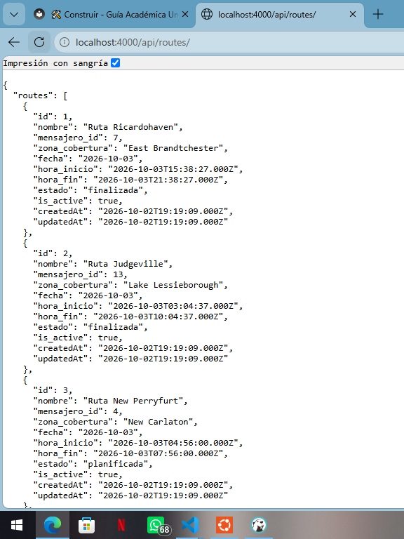

### Cierre del ISS

```bash
npm run dev
```

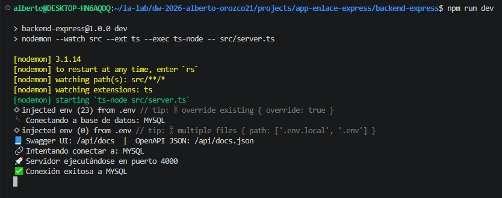

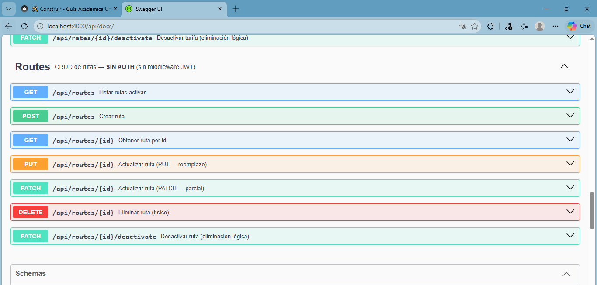

> El servidor debe arrancar sin error. Detenerlo con Ctrl+C antes de continuar.

---

## 13. ISS-12 — Feature Shipment

**Objetivo:** CRUD completo + seeder + swagger de **Shipment** (tabla `shipments`).  
**Bloqueado por:** ISS-11.  
**API:** `/api/shipments` — **SIN AUTH**.  
**Patrón:** mismo que las features anteriores (modelo → controller/routes → http → cableado → relación → seeder → swagger).

### Criterios de aceptación (ISS-12)

- [X] **13.1** Modelo `shipment.model.ts` (`is_active` boolean + `timestamps: true`, columnas snake_case)
- [X] **13.2** Controller + routes: getAll, getOne, create, update PUT/PATCH, delete físico y lógico
- [X] **13.3** Carpeta `http/` con get, create, update, delete
- [X] **13.4** Cableado en `routes/index.ts` + `config/index.ts`
- [X] **13.5** Asociaciones (`shipment.associations.ts`) + PARCHE `config`
- [X] **13.6** Seeder + registro en SeedersRunner / `counts.ts`
- [X] **13.7** Swagger + registro en `src/swagger`

> `factura_id` se agrega mas adelante por PARCHE en ISS-17 (Invoice todavia no existe).

---

```bash
mkdir -p \
  src/features/business/shipment/http
```

## 13.1 Modelo Shipment

```bash
: > src/features/business/shipment/shipment.model.ts
cat >> src/features/business/shipment/shipment.model.ts << 'EOF'
import { DataTypes, Model } from "sequelize";
import { sequelize } from "../../../database/db";

export interface ShipmentI {
  id?: number;
  numero_guia: string;
  empresa_id: number;
  contacto_origen_id: number;
  direccion_origen_id: number;
  contacto_destino_id: number;
  direccion_destino_id: number;
  mensajero_id?: number | null;
  ruta_id?: number | null;
  tarifa_id: number;
  prioridad: "normal" | "urgente" | "express";
  peso_total_kg: number;
  valor_declarado?: number | null;
  costo_calculado?: number | null;
  estado: "creado" | "cotizado" | "asignado" | "en_ruta" | "entregado" | "con_novedad" | "cancelado";
  fecha_solicitud: Date | string;
  fecha_entrega_estimada?: Date | string | null;
  fecha_entrega_real?: Date | string | null;
  is_active?: boolean;
  createdAt?: Date;
  updatedAt?: Date;
}

export class Shipment extends Model {
  public id!: number;
  public numero_guia!: string;
  public empresa_id!: number;
  public contacto_origen_id!: number;
  public direccion_origen_id!: number;
  public contacto_destino_id!: number;
  public direccion_destino_id!: number;
  public mensajero_id!: number | null;
  public ruta_id!: number | null;
  public tarifa_id!: number;
  public prioridad!: "normal" | "urgente" | "express";
  public peso_total_kg!: number;
  public valor_declarado!: number | null;
  public costo_calculado!: number | null;
  public estado!: "creado" | "cotizado" | "asignado" | "en_ruta" | "entregado" | "con_novedad" | "cancelado";
  public fecha_solicitud!: Date | string;
  public fecha_entrega_estimada!: Date | string | null;
  public fecha_entrega_real!: Date | string | null;
  public is_active!: boolean;
  public readonly createdAt!: Date;
  public readonly updatedAt!: Date;
}

Shipment.init(
  {
    numero_guia: {
      type: DataTypes.STRING,
      allowNull: false,
      unique: true,
    },
    empresa_id: {
      type: DataTypes.INTEGER,
      references: { model: "companies", key: "id" },
      allowNull: false,
    },
    contacto_origen_id: {
      type: DataTypes.INTEGER,
      references: { model: "contacts", key: "id" },
      allowNull: false,
    },
    direccion_origen_id: {
      type: DataTypes.INTEGER,
      references: { model: "addresses", key: "id" },
      allowNull: false,
    },
    contacto_destino_id: {
      type: DataTypes.INTEGER,
      references: { model: "contacts", key: "id" },
      allowNull: false,
    },
    direccion_destino_id: {
      type: DataTypes.INTEGER,
      references: { model: "addresses", key: "id" },
      allowNull: false,
    },
    mensajero_id: {
      type: DataTypes.INTEGER,
      references: { model: "messengers", key: "id" },
      allowNull: true,
    },
    ruta_id: {
      type: DataTypes.INTEGER,
      references: { model: "routes", key: "id" },
      allowNull: true,
    },
    tarifa_id: {
      type: DataTypes.INTEGER,
      references: { model: "rates", key: "id" },
      allowNull: false,
    },
    prioridad: {
      type: DataTypes.ENUM("normal", "urgente", "express"),
      allowNull: false,
      defaultValue: "normal",
    },
    peso_total_kg: {
      type: DataTypes.DECIMAL(12, 2),
      allowNull: false,
    },
    valor_declarado: {
      type: DataTypes.DECIMAL(12, 2),
      allowNull: true,
    },
    costo_calculado: {
      type: DataTypes.DECIMAL(12, 2),
      allowNull: true,
    },
    estado: {
      type: DataTypes.ENUM("creado", "cotizado", "asignado", "en_ruta", "entregado", "con_novedad", "cancelado"),
      allowNull: false,
      defaultValue: "creado",
    },
    fecha_solicitud: {
      type: DataTypes.DATE,
      allowNull: false,
    },
    fecha_entrega_estimada: {
      type: DataTypes.DATE,
      allowNull: true,
    },
    fecha_entrega_real: {
      type: DataTypes.DATE,
      allowNull: true,
    },
    is_active: {
      type: DataTypes.BOOLEAN,
      allowNull: true,
      defaultValue: false,
    },
  },
  {
    sequelize,
    modelName: "Shipment",
    tableName: "shipments",
    timestamps: true,
  }
);
EOF
```

---

## 13.2 Controller + routes (CRUD completo)

```bash
: > src/features/business/shipment/shipment.controller.ts
cat >> src/features/business/shipment/shipment.controller.ts << 'EOF'
import { Request, Response } from "express";
import { Shipment, ShipmentI } from "./shipment.model";
import { Company } from "../company/company.model";
import { Contact } from "../contact/contact.model";
import { Address } from "../address/address.model";
import { Rate } from "../rate/rate.model";

function paramId(req: Request): number {
  const raw = req.params.id;
  const value = Array.isArray(raw) ? raw[0] : raw;
  return Number(value);
}

export class ShipmentController {
  // ================== READ ==================
  public async getAll(req: Request, res: Response) {
    try {
      const shipments = await Shipment.findAll({
        where: { is_active: true },
      });
      res.status(200).json({ shipments });
    } catch (error) {
      res.status(500).json({ error: "Error fetching shipments", detail: String(error) });
    }
  }

  public async getOne(req: Request, res: Response) {
    try {
      const id = paramId(req);
      const shipment = await Shipment.findByPk(id);
      if (!shipment) {
        res.status(404).json({ error: "Shipment not found" });
        return;
      }
      res.status(200).json({ shipment: shipment });
    } catch (error) {
      res.status(500).json({ error: "Error fetching shipment", detail: String(error) });
    }
  }

  // ================== CREATE ==================
  public async create(req: Request, res: Response) {
    try {
      const body = req.body as ShipmentI;
      if (body.empresa_id !== undefined && body.empresa_id !== null) {
        const found_empresa_id = await Company.findByPk(body.empresa_id);
        if (!found_empresa_id) {
          res.status(404).json({ error: "Company (empresa_id) not found" });
          return;
        }
      }
      if (body.contacto_origen_id !== undefined && body.contacto_origen_id !== null) {
        const found_contacto_origen_id = await Contact.findByPk(body.contacto_origen_id);
        if (!found_contacto_origen_id) {
          res.status(404).json({ error: "Contact (contacto_origen_id) not found" });
          return;
        }
      }
      if (body.direccion_origen_id !== undefined && body.direccion_origen_id !== null) {
        const found_direccion_origen_id = await Address.findByPk(body.direccion_origen_id);
        if (!found_direccion_origen_id) {
          res.status(404).json({ error: "Address (direccion_origen_id) not found" });
          return;
        }
      }
      if (body.contacto_destino_id !== undefined && body.contacto_destino_id !== null) {
        const found_contacto_destino_id = await Contact.findByPk(body.contacto_destino_id);
        if (!found_contacto_destino_id) {
          res.status(404).json({ error: "Contact (contacto_destino_id) not found" });
          return;
        }
      }
      if (body.direccion_destino_id !== undefined && body.direccion_destino_id !== null) {
        const found_direccion_destino_id = await Address.findByPk(body.direccion_destino_id);
        if (!found_direccion_destino_id) {
          res.status(404).json({ error: "Address (direccion_destino_id) not found" });
          return;
        }
      }
      if (body.tarifa_id !== undefined && body.tarifa_id !== null) {
        const found_tarifa_id = await Rate.findByPk(body.tarifa_id);
        if (!found_tarifa_id) {
          res.status(404).json({ error: "Rate (tarifa_id) not found" });
          return;
        }
      }

      const shipment = await Shipment.create({
        numero_guia: body.numero_guia,
        empresa_id: body.empresa_id,
        contacto_origen_id: body.contacto_origen_id,
        direccion_origen_id: body.direccion_origen_id,
        contacto_destino_id: body.contacto_destino_id,
        direccion_destino_id: body.direccion_destino_id,
        mensajero_id: body.mensajero_id ?? null,
        ruta_id: body.ruta_id ?? null,
        tarifa_id: body.tarifa_id,
        prioridad: body.prioridad,
        peso_total_kg: body.peso_total_kg,
        valor_declarado: body.valor_declarado ?? null,
        costo_calculado: body.costo_calculado ?? null,
        estado: body.estado,
        fecha_solicitud: body.fecha_solicitud,
        fecha_entrega_estimada: body.fecha_entrega_estimada ?? null,
        fecha_entrega_real: body.fecha_entrega_real ?? null,
        is_active: body.is_active ?? true,
      });
      res.status(201).json({ shipment: shipment });
    } catch (error) {
      res.status(500).json({ error: "Error creating shipment", detail: String(error) });
    }
  }

  // ================== UPDATE ==================
  public async updatePut(req: Request, res: Response) {
    try {
      const id = paramId(req);
      const body = req.body as ShipmentI;
      const shipment = await Shipment.findByPk(id);
      if (!shipment) {
        res.status(404).json({ error: "Shipment not found" });
        return;
      }
      if (body.empresa_id !== undefined && body.empresa_id !== null) {
        const found_empresa_id = await Company.findByPk(body.empresa_id);
        if (!found_empresa_id) {
          res.status(404).json({ error: "Company (empresa_id) not found" });
          return;
        }
      }
      if (body.contacto_origen_id !== undefined && body.contacto_origen_id !== null) {
        const found_contacto_origen_id = await Contact.findByPk(body.contacto_origen_id);
        if (!found_contacto_origen_id) {
          res.status(404).json({ error: "Contact (contacto_origen_id) not found" });
          return;
        }
      }
      if (body.direccion_origen_id !== undefined && body.direccion_origen_id !== null) {
        const found_direccion_origen_id = await Address.findByPk(body.direccion_origen_id);
        if (!found_direccion_origen_id) {
          res.status(404).json({ error: "Address (direccion_origen_id) not found" });
          return;
        }
      }
      if (body.contacto_destino_id !== undefined && body.contacto_destino_id !== null) {
        const found_contacto_destino_id = await Contact.findByPk(body.contacto_destino_id);
        if (!found_contacto_destino_id) {
          res.status(404).json({ error: "Contact (contacto_destino_id) not found" });
          return;
        }
      }
      if (body.direccion_destino_id !== undefined && body.direccion_destino_id !== null) {
        const found_direccion_destino_id = await Address.findByPk(body.direccion_destino_id);
        if (!found_direccion_destino_id) {
          res.status(404).json({ error: "Address (direccion_destino_id) not found" });
          return;
        }
      }
      if (body.tarifa_id !== undefined && body.tarifa_id !== null) {
        const found_tarifa_id = await Rate.findByPk(body.tarifa_id);
        if (!found_tarifa_id) {
          res.status(404).json({ error: "Rate (tarifa_id) not found" });
          return;
        }
      }

      await shipment.update({
        numero_guia: body.numero_guia,
        empresa_id: body.empresa_id,
        contacto_origen_id: body.contacto_origen_id,
        direccion_origen_id: body.direccion_origen_id,
        contacto_destino_id: body.contacto_destino_id,
        direccion_destino_id: body.direccion_destino_id,
        mensajero_id: body.mensajero_id ?? shipment.mensajero_id,
        ruta_id: body.ruta_id ?? shipment.ruta_id,
        tarifa_id: body.tarifa_id,
        prioridad: body.prioridad,
        peso_total_kg: body.peso_total_kg,
        valor_declarado: body.valor_declarado ?? shipment.valor_declarado,
        costo_calculado: body.costo_calculado ?? shipment.costo_calculado,
        estado: body.estado,
        fecha_solicitud: body.fecha_solicitud,
        fecha_entrega_estimada: body.fecha_entrega_estimada ?? shipment.fecha_entrega_estimada,
        fecha_entrega_real: body.fecha_entrega_real ?? shipment.fecha_entrega_real,
        is_active: body.is_active ?? shipment.is_active,
      });

      res.status(200).json({ shipment: shipment });
    } catch (error) {
      res.status(500).json({ error: "Error updating shipment (PUT)", detail: String(error) });
    }
  }

  public async updatePatch(req: Request, res: Response) {
    try {
      const id = paramId(req);
      const body = req.body as Partial<ShipmentI>;
      const shipment = await Shipment.findByPk(id);
      if (!shipment) {
        res.status(404).json({ error: "Shipment not found" });
        return;
      }

      await shipment.update(body);
      res.status(200).json({ shipment: shipment });
    } catch (error) {
      res.status(500).json({ error: "Error updating shipment (PATCH)", detail: String(error) });
    }
  }

  // ================== DELETE ==================
  /** Eliminacion fisica */
  public async deletePhysical(req: Request, res: Response) {
    try {
      const id = paramId(req);
      const shipment = await Shipment.findByPk(id);
      if (!shipment) {
        res.status(404).json({ error: "Shipment not found" });
        return;
      }
      await shipment.destroy();
      res.status(200).json({ message: "Shipment permanently deleted", id });
    } catch (error) {
      res.status(500).json({ error: "Error deleting shipment", detail: String(error) });
    }
  }

  /** Eliminacion logica -> is_active = false */
  public async deleteLogical(req: Request, res: Response) {
    try {
      const id = paramId(req);
      const shipment = await Shipment.findByPk(id);
      if (!shipment) {
        res.status(404).json({ error: "Shipment not found" });
        return;
      }
      await shipment.update({ is_active: false });
      res.status(200).json({
        message: "Shipment deactivated (logical delete)",
        shipment: shipment,
      });
    } catch (error) {
      res.status(500).json({ error: "Error deactivating shipment", detail: String(error) });
    }
  }
}
EOF
```
```bash
: > src/features/business/shipment/shipment.routes.ts
cat >> src/features/business/shipment/shipment.routes.ts << 'EOF'
import { Application } from "express";
import { ShipmentController } from "./shipment.controller";

export class ShipmentRoutes {
  public shipmentController: ShipmentController = new ShipmentController();

  public routes(app: Application): void {
    // ================== RUTAS SIN AUTENTICACION / SIN MIDDLEWARE JWT ==================

    // getAll
    app
      .route("/api/shipments")
      .get(this.shipmentController.getAll.bind(this.shipmentController));

    // getOne
    app
      .route("/api/shipments/:id")
      .get(this.shipmentController.getOne.bind(this.shipmentController));

    // create
    app
      .route("/api/shipments")
      .post(this.shipmentController.create.bind(this.shipmentController));

    // update (PUT / PATCH)
    app
      .route("/api/shipments/:id")
      .put(this.shipmentController.updatePut.bind(this.shipmentController))
      .patch(this.shipmentController.updatePatch.bind(this.shipmentController));

    // delete fisico
    app
      .route("/api/shipments/:id")
      .delete(this.shipmentController.deletePhysical.bind(this.shipmentController));

    // delete logico
    app
      .route("/api/shipments/:id/deactivate")
      .patch(this.shipmentController.deleteLogical.bind(this.shipmentController));
  }
}
EOF
```

---

## 13.3 HTTP

```bash
: > src/features/business/shipment/http/shipments.get.http
cat >> src/features/business/shipment/http/shipments.get.http << 'EOF'
### Feature Shipment — GET ALL / GET ONE
### Leyenda: SIN AUTH (sin middleware JWT / sin autenticacion)
@baseUrl = http://localhost:4000
@id = 1

# @name getAllShipment
GET {{baseUrl}}/api/shipments

###

# @name getOneShipment
GET {{baseUrl}}/api/shipments/{{id}}
EOF
```
```bash
: > src/features/business/shipment/http/shipments.create.http
cat >> src/features/business/shipment/http/shipments.create.http << 'EOF'
### Feature Shipment — CREATE
### Leyenda: SIN AUTH (sin middleware JWT / sin autenticacion)
@baseUrl = http://localhost:4000

# @name createShipment
POST {{baseUrl}}/api/shipments
Content-Type: application/json

{
  "numero_guia": "Ejemplo numero_guia",
  "empresa_id": 1,
  "contacto_origen_id": 1,
  "direccion_origen_id": 1,
  "contacto_destino_id": 1,
  "direccion_destino_id": 1,
  "mensajero_id": 1,
  "ruta_id": 1,
  "tarifa_id": 1,
  "prioridad": "normal",
  "peso_total_kg": 10.5,
  "valor_declarado": 10.5,
  "costo_calculado": 10.5,
  "estado": "creado",
  "fecha_solicitud": "2026-01-15T10:00:00.000Z",
  "fecha_entrega_estimada": "2026-01-15T10:00:00.000Z",
  "fecha_entrega_real": "2026-01-15T10:00:00.000Z",
  "is_active": true
}
EOF
```
```bash
: > src/features/business/shipment/http/shipments.update.http
cat >> src/features/business/shipment/http/shipments.update.http << 'EOF'
### Feature Shipment — UPDATE (PUT) / UPDATE (PATCH)
### Leyenda: SIN AUTH (sin middleware JWT / sin autenticacion)
@baseUrl = http://localhost:4000
@id = 1

# @name updateShipmentPut
PUT {{baseUrl}}/api/shipments/{{id}}
Content-Type: application/json

{
  "numero_guia": "Ejemplo numero_guia",
  "empresa_id": 1,
  "contacto_origen_id": 1,
  "direccion_origen_id": 1,
  "contacto_destino_id": 1,
  "direccion_destino_id": 1,
  "mensajero_id": 1,
  "ruta_id": 1,
  "tarifa_id": 1,
  "prioridad": "normal",
  "peso_total_kg": 10.5,
  "valor_declarado": 10.5,
  "costo_calculado": 10.5,
  "estado": "creado",
  "fecha_solicitud": "2026-01-15T10:00:00.000Z",
  "fecha_entrega_estimada": "2026-01-15T10:00:00.000Z",
  "fecha_entrega_real": "2026-01-15T10:00:00.000Z",
  "is_active": true
}

###

# @name updateShipmentPatch
PATCH {{baseUrl}}/api/shipments/{{id}}
Content-Type: application/json

{
  "empresa_id": 1
}
EOF
```
```bash
: > src/features/business/shipment/http/shipments.delete.http
cat >> src/features/business/shipment/http/shipments.delete.http << 'EOF'
### Feature Shipment — DELETE fisico / DELETE logico (is_active = false)
### Leyenda: SIN AUTH (sin middleware JWT / sin autenticacion)
@baseUrl = http://localhost:4000
@id = 1

# @name deleteShipmentPhysical
DELETE {{baseUrl}}/api/shipments/{{id}}

###

# @name deleteShipmentLogical
PATCH {{baseUrl}}/api/shipments/{{id}}/deactivate
EOF
```

---

## 13.4 Cableado Routes + Config

**PARCHE** — `src/routes/index.ts` **ya existe**.

1. **Debajo de** `import { RouteRoutes } ...`, **añadir**:

```ts
import { ShipmentRoutes } from "../features/business/shipment/shipment.routes";
```

2. **Dentro de** `export class Routes`, **debajo de** `routeRoutes`, **añadir**:

```ts
  public shipmentRoutes: ShipmentRoutes = new ShipmentRoutes();
```

**PARCHE** — `src/config/index.ts` **ya existe**.

1. **Debajo de** `import "../features/business/route/route.model";`, **añadir**:

```ts
import "../features/business/shipment/shipment.model";
```

2. **Dentro de** `routes()`, **debajo de** `this.routePrv.routeRoutes.routes(this.app);`, **añadir**:

```ts
    this.routePrv.shipmentRoutes.routes(this.app);
```

---

## 13.5 Relación / asociaciones Shipment

> `Shipment` referencia: **Address, Company, Contact, Messenger, Rate, Route**. Norma FK: `<tabla_singular>_id`.

```bash
: > src/features/business/shipment/shipment.associations.ts
cat >> src/features/business/shipment/shipment.associations.ts << 'EOF'
import { Shipment } from "./shipment.model";
import { Company } from "../company/company.model";
import { Contact } from "../contact/contact.model";
import { Address } from "../address/address.model";
import { Messenger } from "../messenger/messenger.model";
import { Route } from "../route/route.model";
import { Rate } from "../rate/rate.model";

Shipment.belongsTo(Company, { foreignKey: "empresa_id", as: "company" });
Company.hasMany(Shipment, { foreignKey: "empresa_id", as: "shipments" });
Shipment.belongsTo(Contact, { foreignKey: "contacto_origen_id", as: "contacto_origen" });
Contact.hasMany(Shipment, { foreignKey: "contacto_origen_id", as: "shipments_contacto_origen" });
Shipment.belongsTo(Address, { foreignKey: "direccion_origen_id", as: "direccion_origen" });
Address.hasMany(Shipment, { foreignKey: "direccion_origen_id", as: "shipments_direccion_origen" });
Shipment.belongsTo(Contact, { foreignKey: "contacto_destino_id", as: "contacto_destino" });
Contact.hasMany(Shipment, { foreignKey: "contacto_destino_id", as: "shipments_contacto_destino" });
Shipment.belongsTo(Address, { foreignKey: "direccion_destino_id", as: "direccion_destino" });
Address.hasMany(Shipment, { foreignKey: "direccion_destino_id", as: "shipments_direccion_destino" });
Shipment.belongsTo(Messenger, { foreignKey: "mensajero_id", as: "messenger" });
Messenger.hasMany(Shipment, { foreignKey: "mensajero_id", as: "shipments" });
Shipment.belongsTo(Route, { foreignKey: "ruta_id", as: "route" });
Route.hasMany(Shipment, { foreignKey: "ruta_id", as: "shipments" });
Shipment.belongsTo(Rate, { foreignKey: "tarifa_id", as: "rate" });
Rate.hasMany(Shipment, { foreignKey: "tarifa_id", as: "shipments" });
EOF
```
**PARCHE** — `src/config/index.ts` **ya existe**.

**Debajo de** `import "../features/business/shipment/shipment.model";` (y **encima de** `import { Routes }`), **añadir**:

```ts
import "../features/business/shipment/shipment.associations";
```

---

## 13.6 Seeder Shipment

```bash
: > src/features/business/shipment/shipment.seeder.ts
cat >> src/features/business/shipment/shipment.seeder.ts << 'EOF'
import { faker } from "@faker-js/faker";
import { Shipment } from "./shipment.model";
import { Company } from "../company/company.model";
import { Contact } from "../contact/contact.model";
import { Address } from "../address/address.model";
import { Messenger } from "../messenger/messenger.model";
import { Route } from "../route/route.model";
import { Rate } from "../rate/rate.model";

/**
 * Seeder del feature Shipment (datos falsos con @faker-js/faker).
 * Se invoca desde `src/database/seeders` (SeedersRunner), no desde la App.
 *
 * Idempotente: si ya hay filas, no vuelve a insertar.
 */
export async function seedShipments(count: number): Promise<number> {
  if (count <= 0) {
    console.log("\u23ed\ufe0f  shipments: count=0, se omite");
    return 0;
  }

  const existing = await Shipment.count();
  if (existing > 0) {
    console.log(`\u23ed\ufe0f  shipments: ya hay ${existing} registro(s), se omite seeder`);
    return 0;
  }

  const companyList = await Company.findAll({ where: { is_active: true } });
  const contactList = await Contact.findAll({ where: { is_active: true } });
  const addressList = await Address.findAll({ where: { is_active: true } });
  const messengerList = await Messenger.findAll({ where: { is_active: true } });
  const routeList = await Route.findAll({ where: { is_active: true } });
  const rateList = await Rate.findAll({ where: { is_active: true } });
  if (companyList.length === 0) {
    console.log("\u23ed\ufe0f  shipments: faltan dependencias activas (companyList), se omite seeder");
    return 0;
  }
  if (contactList.length === 0) {
    console.log("\u23ed\ufe0f  shipments: faltan dependencias activas (contactList), se omite seeder");
    return 0;
  }
  if (addressList.length === 0) {
    console.log("\u23ed\ufe0f  shipments: faltan dependencias activas (addressList), se omite seeder");
    return 0;
  }
  if (rateList.length === 0) {
    console.log("\u23ed\ufe0f  shipments: faltan dependencias activas (rateList), se omite seeder");
    return 0;
  }

  const rows = Array.from({ length: count }, () => ({
      numero_guia: "EE-" + faker.string.alphanumeric(8).toUpperCase(),
      empresa_id: faker.helpers.arrayElement(companyList).id,
      contacto_origen_id: faker.helpers.arrayElement(contactList).id,
      direccion_origen_id: faker.helpers.arrayElement(addressList).id,
      contacto_destino_id: faker.helpers.arrayElement(contactList).id,
      direccion_destino_id: faker.helpers.arrayElement(addressList).id,
      mensajero_id: messengerList.length ? faker.helpers.arrayElement(messengerList).id : null,
      ruta_id: routeList.length ? faker.helpers.arrayElement(routeList).id : null,
      tarifa_id: faker.helpers.arrayElement(rateList).id,
      prioridad: faker.helpers.arrayElement(["normal", "urgente", "express"]),
      peso_total_kg: Number(faker.commerce.price({ min: 0.5, max: 50, dec: 2 })),
      valor_declarado: Number(faker.commerce.price({ min: 10000, max: 2000000, dec: 2 })),
      costo_calculado: Number(faker.commerce.price({ min: 5000, max: 100000, dec: 2 })),
      estado: faker.helpers.arrayElement(["creado", "cotizado", "asignado", "en_ruta", "entregado", "con_novedad", "cancelado"]),
      fecha_solicitud: faker.date.recent(),
      fecha_entrega_estimada: faker.date.soon(),
      fecha_entrega_real: faker.date.recent(),
      is_active: true,
  }));

  await Shipment.bulkCreate(rows);
  console.log(`\u2705 shipments: insertados ${count} registro(s) falsos`);
  return count;
}
EOF
```
**PARCHE** — `src/database/seeders/counts.ts` **ya existe**.

- **Dentro de** `SeedCounts`, **añadir** `shipments: number;`
- **Dentro de** `DEFAULT_SEED_COUNTS`, **añadir** `shipments: 15,`
- Lectura opcional por env: `SEED_SHIPMENTS`.

**PARCHE** — `src/database/seeders/index.ts` **ya existe**.

1. **Debajo de** el import del seeder anterior, **añadir** `import { seedShipments } from "../../features/business/shipment/shipment.seeder";`
2. **Debajo de** `await seedRoutes(counts.routes);`, **añadir** `await seedShipments(counts.shipments);`

---

## 13.7 Swagger Shipment

```bash
: > src/features/business/shipment/shipment.swagger.ts
cat >> src/features/business/shipment/shipment.swagger.ts << 'EOF'
/**
 * Documentacion OpenAPI del feature Shipment.
 * Se agrega desde `src/swagger` (registry externo), no se monta aqui.
 *
 * Leyenda: endpoints documentados como SIN AUTH (sin middleware JWT).
 */

export const shipmentSwagger = {
  tags: [
    {
      name: "Shipments",
      description: "CRUD de shipments — **SIN AUTH** (sin middleware JWT)",
    },
  ],
  paths: {
    "/api/shipments": {
      get: {
        tags: ["Shipments"],
        summary: "Listar shipments activos",
        description: "SIN AUTH — retorna registros con is_active=true",
        security: [],
        responses: {
          "200": {
            description: "Lista de shipments",
            content: {
              "application/json": {
                schema: {
                  type: "object",
                  properties: {
                    shipments: {
                      type: "array",
                      items: { $ref: "#/components/schemas/Shipment" },
                    },
                  },
                },
              },
            },
          },
        },
      },
      post: {
        tags: ["Shipments"],
        summary: "Crear shipment",
        description: "SIN AUTH",
        security: [],
        requestBody: {
          required: true,
          content: {
            "application/json": {
              schema: { $ref: "#/components/schemas/ShipmentCreate" },
            },
          },
        },
        responses: {
          "201": {
            description: "Shipment creado",
            content: {
              "application/json": {
                schema: {
                  type: "object",
                  properties: {
                    shipment: { $ref: "#/components/schemas/Shipment" },
                  },
                },
              },
            },
          },
        },
      },
    },
    "/api/shipments/{id}": {
      get: {
        tags: ["Shipments"],
        summary: "Obtener shipment por id",
        description: "SIN AUTH",
        security: [],
        parameters: [{ name: "id", in: "path", required: true, schema: { type: "integer" } }],
        responses: {
          "200": {
            description: "Shipment encontrado",
            content: {
              "application/json": {
                schema: {
                  type: "object",
                  properties: {
                    shipment: { $ref: "#/components/schemas/Shipment" },
                  },
                },
              },
            },
          },
          "404": { description: "No encontrado" },
        },
      },
      put: {
        tags: ["Shipments"],
        summary: "Actualizar shipment (PUT — reemplazo)",
        description: "SIN AUTH",
        security: [],
        parameters: [{ name: "id", in: "path", required: true, schema: { type: "integer" } }],
        requestBody: {
          required: true,
          content: {
            "application/json": {
              schema: { $ref: "#/components/schemas/ShipmentCreate" },
            },
          },
        },
        responses: {
          "200": { description: "Actualizado" },
          "404": { description: "No encontrado" },
        },
      },
      patch: {
        tags: ["Shipments"],
        summary: "Actualizar shipment (PATCH — parcial)",
        description: "SIN AUTH",
        security: [],
        parameters: [{ name: "id", in: "path", required: true, schema: { type: "integer" } }],
        requestBody: {
          required: true,
          content: {
            "application/json": {
              schema: { $ref: "#/components/schemas/ShipmentPatch" },
            },
          },
        },
        responses: {
          "200": { description: "Actualizado" },
          "404": { description: "No encontrado" },
        },
      },
      delete: {
        tags: ["Shipments"],
        summary: "Eliminar shipment (fisico)",
        description: "SIN AUTH — borra la fila",
        security: [],
        parameters: [{ name: "id", in: "path", required: true, schema: { type: "integer" } }],
        responses: {
          "200": { description: "Eliminado" },
          "404": { description: "No encontrado" },
        },
      },
    },
    "/api/shipments/{id}/deactivate": {
      patch: {
        tags: ["Shipments"],
        summary: "Eliminar shipment (logico)",
        description: "SIN AUTH — is_active = false",
        security: [],
        parameters: [{ name: "id", in: "path", required: true, schema: { type: "integer" } }],
        responses: {
          "200": { description: "Desactivado" },
          "404": { description: "No encontrado" },
        },
      },
    },
  },
  components: {
    schemas: {
      Shipment: {
        type: "object",
        properties: {
      id: { type: "integer", example: 1 },
      numero_guia: { type: "string", example: "numero_guia" },
      empresa_id: { type: "integer", example: 1 },
      contacto_origen_id: { type: "integer", example: 1 },
      direccion_origen_id: { type: "integer", example: 1 },
      contacto_destino_id: { type: "integer", example: 1 },
      direccion_destino_id: { type: "integer", example: 1 },
      mensajero_id: { type: "integer", example: 1 },
      ruta_id: { type: "integer", example: 1 },
      tarifa_id: { type: "integer", example: 1 },
      prioridad: { type: "string", enum: ["normal", "urgente", "express"], example: "normal" },
      peso_total_kg: { type: "number", example: 10.5 },
      valor_declarado: { type: "number", example: 10.5 },
      costo_calculado: { type: "number", example: 10.5 },
      estado: { type: "string", enum: ["creado", "cotizado", "asignado", "en_ruta", "entregado", "con_novedad", "cancelado"], example: "creado" },
      fecha_solicitud: { type: "string", format: "date-time" },
      fecha_entrega_estimada: { type: "string", format: "date-time" },
      fecha_entrega_real: { type: "string", format: "date-time" },
      is_active: { type: "boolean", example: true },
      createdAt: { type: "string", format: "date-time" },
      updatedAt: { type: "string", format: "date-time" },
        },
      },
      ShipmentCreate: {
        type: "object",
        required: ["numero_guia", "empresa_id", "contacto_origen_id", "direccion_origen_id", "contacto_destino_id", "direccion_destino_id", "tarifa_id", "prioridad", "peso_total_kg", "estado", "fecha_solicitud"],
        properties: {
      numero_guia: { type: "string", example: "numero_guia" },
      empresa_id: { type: "integer", example: 1 },
      contacto_origen_id: { type: "integer", example: 1 },
      direccion_origen_id: { type: "integer", example: 1 },
      contacto_destino_id: { type: "integer", example: 1 },
      direccion_destino_id: { type: "integer", example: 1 },
      mensajero_id: { type: "integer", example: 1 },
      ruta_id: { type: "integer", example: 1 },
      tarifa_id: { type: "integer", example: 1 },
      prioridad: { type: "string", enum: ["normal", "urgente", "express"], example: "normal" },
      peso_total_kg: { type: "number", example: 10.5 },
      valor_declarado: { type: "number", example: 10.5 },
      costo_calculado: { type: "number", example: 10.5 },
      estado: { type: "string", enum: ["creado", "cotizado", "asignado", "en_ruta", "entregado", "con_novedad", "cancelado"], example: "creado" },
      fecha_solicitud: { type: "string", format: "date-time" },
      fecha_entrega_estimada: { type: "string", format: "date-time" },
      fecha_entrega_real: { type: "string", format: "date-time" },
      is_active: { type: "boolean", example: true },
        },
      },
      ShipmentPatch: {
        type: "object",
        properties: {
      numero_guia: { type: "string", example: "numero_guia" },
      empresa_id: { type: "integer", example: 1 },
      contacto_origen_id: { type: "integer", example: 1 },
      direccion_origen_id: { type: "integer", example: 1 },
      contacto_destino_id: { type: "integer", example: 1 },
      direccion_destino_id: { type: "integer", example: 1 },
      mensajero_id: { type: "integer", example: 1 },
      ruta_id: { type: "integer", example: 1 },
      tarifa_id: { type: "integer", example: 1 },
      prioridad: { type: "string", enum: ["normal", "urgente", "express"], example: "normal" },
      peso_total_kg: { type: "number", example: 10.5 },
      valor_declarado: { type: "number", example: 10.5 },
      costo_calculado: { type: "number", example: 10.5 },
      estado: { type: "string", enum: ["creado", "cotizado", "asignado", "en_ruta", "entregado", "con_novedad", "cancelado"], example: "creado" },
      fecha_solicitud: { type: "string", format: "date-time" },
      fecha_entrega_estimada: { type: "string", format: "date-time" },
      fecha_entrega_real: { type: "string", format: "date-time" },
      is_active: { type: "boolean", example: true },
        },
      },
    },
  },
};
EOF
```
**PARCHE** — `src/swagger/index.ts` **ya existe**.

1. **Debajo de** `import { routeSwagger } ...`, **añadir** `import { shipmentSwagger } from "../features/business/shipment/shipment.swagger";`
2. **Dentro de** `featureSwaggerModules`, **debajo de** `routeSwagger,`, **añadir** `shipmentSwagger,`

### Verificación

```bash
curl -s http://localhost:4000/api/shipments
```

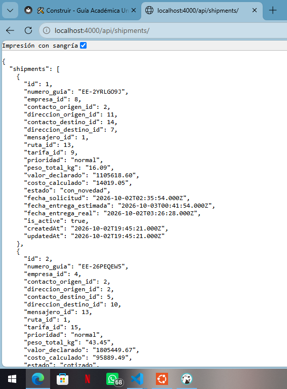

### Cierre del ISS

```bash
npm run dev
```

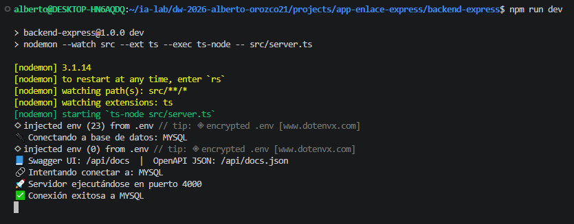

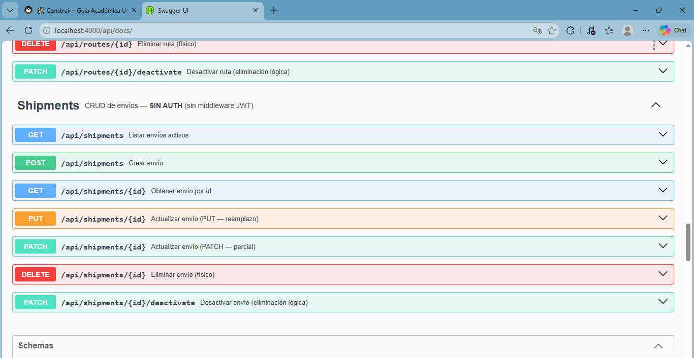

> El servidor debe arrancar sin error. Detenerlo con Ctrl+C antes de continuar.

---

## 14. ISS-13 — Feature Package

**Objetivo:** CRUD completo + seeder + swagger de **Package** (tabla `packages`).  
**Bloqueado por:** ISS-12.  
**API:** `/api/packages` — **SIN AUTH**.  
**Patrón:** mismo que las features anteriores (modelo → controller/routes → http → cableado → relación → seeder → swagger).

### Criterios de aceptación (ISS-13)

- [X] **14.1** Modelo `package.model.ts` (`is_active` boolean + `timestamps: true`, columnas snake_case)
- [X] **14.2** Controller + routes: getAll, getOne, create, update PUT/PATCH, delete físico y lógico
- [X] **14.3** Carpeta `http/` con get, create, update, delete
- [X] **14.4** Cableado en `routes/index.ts` + `config/index.ts`
- [X] **14.5** Asociaciones (`package.associations.ts`) + PARCHE `config`
- [X] **14.6** Seeder + registro en SeedersRunner / `counts.ts`
- [X] **14.7** Swagger + registro en `src/swagger`

---

```bash
mkdir -p \
  src/features/business/package/http
```

## 14.1 Modelo Package

```bash
: > src/features/business/package/package.model.ts
cat >> src/features/business/package/package.model.ts << 'EOF'
import { DataTypes, Model } from "sequelize";
import { sequelize } from "../../../database/db";

export interface PackageI {
  id?: number;
  envio_id: number;
  descripcion_contenido?: string | null;
  peso_kg: number;
  alto_cm?: number | null;
  ancho_cm?: number | null;
  largo_cm?: number | null;
  valor_declarado?: number | null;
  es_fragil?: boolean;
  is_active?: boolean;
  createdAt?: Date;
  updatedAt?: Date;
}

export class Package extends Model {
  public id!: number;
  public envio_id!: number;
  public descripcion_contenido!: string | null;
  public peso_kg!: number;
  public alto_cm!: number | null;
  public ancho_cm!: number | null;
  public largo_cm!: number | null;
  public valor_declarado!: number | null;
  public es_fragil!: boolean;
  public is_active!: boolean;
  public readonly createdAt!: Date;
  public readonly updatedAt!: Date;
}

Package.init(
  {
    envio_id: {
      type: DataTypes.INTEGER,
      references: { model: "shipments", key: "id" },
      allowNull: false,
    },
    descripcion_contenido: {
      type: DataTypes.TEXT,
      allowNull: true,
    },
    peso_kg: {
      type: DataTypes.DECIMAL(12, 2),
      allowNull: false,
    },
    alto_cm: {
      type: DataTypes.DECIMAL(12, 2),
      allowNull: true,
    },
    ancho_cm: {
      type: DataTypes.DECIMAL(12, 2),
      allowNull: true,
    },
    largo_cm: {
      type: DataTypes.DECIMAL(12, 2),
      allowNull: true,
    },
    valor_declarado: {
      type: DataTypes.DECIMAL(12, 2),
      allowNull: true,
    },
    es_fragil: {
      type: DataTypes.BOOLEAN,
      allowNull: true,
      defaultValue: false,
    },
    is_active: {
      type: DataTypes.BOOLEAN,
      allowNull: true,
      defaultValue: false,
    },
  },
  {
    sequelize,
    modelName: "Package",
    tableName: "packages",
    timestamps: true,
  }
);
EOF
```

---

## 14.2 Controller + routes (CRUD completo)

```bash
: > src/features/business/package/package.controller.ts
cat >> src/features/business/package/package.controller.ts << 'EOF'
import { Request, Response } from "express";
import { Package, PackageI } from "./package.model";
import { Shipment } from "../shipment/shipment.model";

function paramId(req: Request): number {
  const raw = req.params.id;
  const value = Array.isArray(raw) ? raw[0] : raw;
  return Number(value);
}

export class PackageController {
  // ================== READ ==================
  public async getAll(req: Request, res: Response) {
    try {
      const packages = await Package.findAll({
        where: { is_active: true },
      });
      res.status(200).json({ packages });
    } catch (error) {
      res.status(500).json({ error: "Error fetching packages", detail: String(error) });
    }
  }

  public async getOne(req: Request, res: Response) {
    try {
      const id = paramId(req);
      const pkg = await Package.findByPk(id);
      if (!pkg) {
        res.status(404).json({ error: "Package not found" });
        return;
      }
      res.status(200).json({ package: pkg });
    } catch (error) {
      res.status(500).json({ error: "Error fetching package", detail: String(error) });
    }
  }

  // ================== CREATE ==================
  public async create(req: Request, res: Response) {
    try {
      const body = req.body as PackageI;
      if (body.envio_id !== undefined && body.envio_id !== null) {
        const found_envio_id = await Shipment.findByPk(body.envio_id);
        if (!found_envio_id) {
          res.status(404).json({ error: "Shipment (envio_id) not found" });
          return;
        }
      }

      const pkg = await Package.create({
        envio_id: body.envio_id,
        descripcion_contenido: body.descripcion_contenido ?? null,
        peso_kg: body.peso_kg,
        alto_cm: body.alto_cm ?? null,
        ancho_cm: body.ancho_cm ?? null,
        largo_cm: body.largo_cm ?? null,
        valor_declarado: body.valor_declarado ?? null,
        es_fragil: body.es_fragil ?? null,
        is_active: body.is_active ?? true,
      });
      res.status(201).json({ package: pkg });
    } catch (error) {
      res.status(500).json({ error: "Error creating package", detail: String(error) });
    }
  }

  // ================== UPDATE ==================
  public async updatePut(req: Request, res: Response) {
    try {
      const id = paramId(req);
      const body = req.body as PackageI;
      const pkg = await Package.findByPk(id);
      if (!pkg) {
        res.status(404).json({ error: "Package not found" });
        return;
      }
      if (body.envio_id !== undefined && body.envio_id !== null) {
        const found_envio_id = await Shipment.findByPk(body.envio_id);
        if (!found_envio_id) {
          res.status(404).json({ error: "Shipment (envio_id) not found" });
          return;
        }
      }

      await pkg.update({
        envio_id: body.envio_id,
        descripcion_contenido: body.descripcion_contenido ?? pkg.descripcion_contenido,
        peso_kg: body.peso_kg,
        alto_cm: body.alto_cm ?? pkg.alto_cm,
        ancho_cm: body.ancho_cm ?? pkg.ancho_cm,
        largo_cm: body.largo_cm ?? pkg.largo_cm,
        valor_declarado: body.valor_declarado ?? pkg.valor_declarado,
        es_fragil: body.es_fragil ?? pkg.es_fragil,
        is_active: body.is_active ?? pkg.is_active,
      });

      res.status(200).json({ package: pkg });
    } catch (error) {
      res.status(500).json({ error: "Error updating package (PUT)", detail: String(error) });
    }
  }

  public async updatePatch(req: Request, res: Response) {
    try {
      const id = paramId(req);
      const body = req.body as Partial<PackageI>;
      const pkg = await Package.findByPk(id);
      if (!pkg) {
        res.status(404).json({ error: "Package not found" });
        return;
      }

      await pkg.update(body);
      res.status(200).json({ package: pkg });
    } catch (error) {
      res.status(500).json({ error: "Error updating package (PATCH)", detail: String(error) });
    }
  }

  // ================== DELETE ==================
  /** Eliminacion fisica */
  public async deletePhysical(req: Request, res: Response) {
    try {
      const id = paramId(req);
      const pkg = await Package.findByPk(id);
      if (!pkg) {
        res.status(404).json({ error: "Package not found" });
        return;
      }
      await pkg.destroy();
      res.status(200).json({ message: "Package permanently deleted", id });
    } catch (error) {
      res.status(500).json({ error: "Error deleting package", detail: String(error) });
    }
  }

  /** Eliminacion logica -> is_active = false */
  public async deleteLogical(req: Request, res: Response) {
    try {
      const id = paramId(req);
      const pkg = await Package.findByPk(id);
      if (!pkg) {
        res.status(404).json({ error: "Package not found" });
        return;
      }
      await pkg.update({ is_active: false });
      res.status(200).json({
        message: "Package deactivated (logical delete)",
        package: pkg,
      });
    } catch (error) {
      res.status(500).json({ error: "Error deactivating package", detail: String(error) });
    }
  }
}
EOF
```
```bash
: > src/features/business/package/package.routes.ts
cat >> src/features/business/package/package.routes.ts << 'EOF'
import { Application } from "express";
import { PackageController } from "./package.controller";

export class PackageRoutes {
  public packageController: PackageController = new PackageController();

  public routes(app: Application): void {
    // ================== RUTAS SIN AUTENTICACION / SIN MIDDLEWARE JWT ==================

    // getAll
    app
      .route("/api/packages")
      .get(this.packageController.getAll.bind(this.packageController));

    // getOne
    app
      .route("/api/packages/:id")
      .get(this.packageController.getOne.bind(this.packageController));

    // create
    app
      .route("/api/packages")
      .post(this.packageController.create.bind(this.packageController));

    // update (PUT / PATCH)
    app
      .route("/api/packages/:id")
      .put(this.packageController.updatePut.bind(this.packageController))
      .patch(this.packageController.updatePatch.bind(this.packageController));

    // delete fisico
    app
      .route("/api/packages/:id")
      .delete(this.packageController.deletePhysical.bind(this.packageController));

    // delete logico
    app
      .route("/api/packages/:id/deactivate")
      .patch(this.packageController.deleteLogical.bind(this.packageController));
  }
}
EOF
```

---

## 14.3 HTTP

```bash
: > src/features/business/package/http/packages.get.http
cat >> src/features/business/package/http/packages.get.http << 'EOF'
### Feature Package — GET ALL / GET ONE
### Leyenda: SIN AUTH (sin middleware JWT / sin autenticacion)
@baseUrl = http://localhost:4000
@id = 1

# @name getAllPackage
GET {{baseUrl}}/api/packages

###

# @name getOnePackage
GET {{baseUrl}}/api/packages/{{id}}
EOF
```
```bash
: > src/features/business/package/http/packages.create.http
cat >> src/features/business/package/http/packages.create.http << 'EOF'
### Feature Package — CREATE
### Leyenda: SIN AUTH (sin middleware JWT / sin autenticacion)
@baseUrl = http://localhost:4000

# @name createPackage
POST {{baseUrl}}/api/packages
Content-Type: application/json

{
  "envio_id": 1,
  "descripcion_contenido": "Ejemplo descripcion_contenido",
  "peso_kg": 10.5,
  "alto_cm": 10.5,
  "ancho_cm": 10.5,
  "largo_cm": 10.5,
  "valor_declarado": 10.5,
  "es_fragil": true,
  "is_active": true
}
EOF
```
```bash
: > src/features/business/package/http/packages.update.http
cat >> src/features/business/package/http/packages.update.http << 'EOF'
### Feature Package — UPDATE (PUT) / UPDATE (PATCH)
### Leyenda: SIN AUTH (sin middleware JWT / sin autenticacion)
@baseUrl = http://localhost:4000
@id = 1

# @name updatePackagePut
PUT {{baseUrl}}/api/packages/{{id}}
Content-Type: application/json

{
  "envio_id": 1,
  "descripcion_contenido": "Ejemplo descripcion_contenido",
  "peso_kg": 10.5,
  "alto_cm": 10.5,
  "ancho_cm": 10.5,
  "largo_cm": 10.5,
  "valor_declarado": 10.5,
  "es_fragil": true,
  "is_active": true
}

###

# @name updatePackagePatch
PATCH {{baseUrl}}/api/packages/{{id}}
Content-Type: application/json

{
  "descripcion_contenido": "Ejemplo descripcion_contenido"
}
EOF
```
```bash
: > src/features/business/package/http/packages.delete.http
cat >> src/features/business/package/http/packages.delete.http << 'EOF'
### Feature Package — DELETE fisico / DELETE logico (is_active = false)
### Leyenda: SIN AUTH (sin middleware JWT / sin autenticacion)
@baseUrl = http://localhost:4000
@id = 1

# @name deletePackagePhysical
DELETE {{baseUrl}}/api/packages/{{id}}

###

# @name deletePackageLogical
PATCH {{baseUrl}}/api/packages/{{id}}/deactivate
EOF
```

---

## 14.4 Cableado Routes + Config

**PARCHE** — `src/routes/index.ts` **ya existe**.

1. **Debajo de** `import { ShipmentRoutes } ...`, **añadir**:

```ts
import { PackageRoutes } from "../features/business/package/package.routes";
```

2. **Dentro de** `export class Routes`, **debajo de** `shipmentRoutes`, **añadir**:

```ts
  public packageRoutes: PackageRoutes = new PackageRoutes();
```

**PARCHE** — `src/config/index.ts` **ya existe**.

1. **Debajo de** `import "../features/business/shipment/shipment.model";`, **añadir**:

```ts
import "../features/business/package/package.model";
```

2. **Dentro de** `routes()`, **debajo de** `this.routePrv.shipmentRoutes.routes(this.app);`, **añadir**:

```ts
    this.routePrv.packageRoutes.routes(this.app);
```

---

## 14.5 Relación / asociaciones Package

> `Package` referencia: **Shipment**. Norma FK: `<tabla_singular>_id`.

```bash
: > src/features/business/package/package.associations.ts
cat >> src/features/business/package/package.associations.ts << 'EOF'
import { Package } from "./package.model";
import { Shipment } from "../shipment/shipment.model";

Package.belongsTo(Shipment, { foreignKey: "envio_id", as: "shipment" });
Shipment.hasMany(Package, { foreignKey: "envio_id", as: "packages" });
EOF
```
**PARCHE** — `src/config/index.ts` **ya existe**.

**Debajo de** `import "../features/business/package/package.model";` (y **encima de** `import { Routes }`), **añadir**:

```ts
import "../features/business/package/package.associations";
```

---

## 14.6 Seeder Package

```bash
: > src/features/business/package/package.seeder.ts
cat >> src/features/business/package/package.seeder.ts << 'EOF'
import { faker } from "@faker-js/faker";
import { Package } from "./package.model";
import { Shipment } from "../shipment/shipment.model";

/**
 * Seeder del feature Package (datos falsos con @faker-js/faker).
 * Se invoca desde `src/database/seeders` (SeedersRunner), no desde la App.
 *
 * Idempotente: si ya hay filas, no vuelve a insertar.
 */
export async function seedPackages(count: number): Promise<number> {
  if (count <= 0) {
    console.log("\u23ed\ufe0f  packages: count=0, se omite");
    return 0;
  }

  const existing = await Package.count();
  if (existing > 0) {
    console.log(`\u23ed\ufe0f  packages: ya hay ${existing} registro(s), se omite seeder`);
    return 0;
  }

  const shipmentList = await Shipment.findAll({ where: { is_active: true } });
  if (shipmentList.length === 0) {
    console.log("\u23ed\ufe0f  packages: faltan dependencias activas (shipmentList), se omite seeder");
    return 0;
  }

  const rows = Array.from({ length: count }, () => ({
      envio_id: faker.helpers.arrayElement(shipmentList).id,
      descripcion_contenido: faker.commerce.productDescription(),
      peso_kg: Number(faker.commerce.price({ min: 0.2, max: 20, dec: 2 })),
      alto_cm: Number(faker.commerce.price({ min: 5, max: 80, dec: 1 })),
      ancho_cm: Number(faker.commerce.price({ min: 5, max: 80, dec: 1 })),
      largo_cm: Number(faker.commerce.price({ min: 5, max: 80, dec: 1 })),
      valor_declarado: Number(faker.commerce.price({ min: 5000, max: 500000, dec: 2 })),
      es_fragil: faker.datatype.boolean(),
      is_active: true,
  }));

  await Package.bulkCreate(rows);
  console.log(`\u2705 packages: insertados ${count} registro(s) falsos`);
  return count;
}
EOF
```
**PARCHE** — `src/database/seeders/counts.ts` **ya existe**.

- **Dentro de** `SeedCounts`, **añadir** `packages: number;`
- **Dentro de** `DEFAULT_SEED_COUNTS`, **añadir** `packages: 15,`
- Lectura opcional por env: `SEED_PACKAGES`.

**PARCHE** — `src/database/seeders/index.ts` **ya existe**.

1. **Debajo de** el import del seeder anterior, **añadir** `import { seedPackages } from "../../features/business/package/package.seeder";`
2. **Debajo de** `await seedShipments(counts.shipments);`, **añadir** `await seedPackages(counts.packages);`

---

## 14.7 Swagger Package

```bash
: > src/features/business/package/package.swagger.ts
cat >> src/features/business/package/package.swagger.ts << 'EOF'
/**
 * Documentacion OpenAPI del feature Package.
 * Se agrega desde `src/swagger` (registry externo), no se monta aqui.
 *
 * Leyenda: endpoints documentados como SIN AUTH (sin middleware JWT).
 */

export const packageSwagger = {
  tags: [
    {
      name: "Packages",
      description: "CRUD de packages — **SIN AUTH** (sin middleware JWT)",
    },
  ],
  paths: {
    "/api/packages": {
      get: {
        tags: ["Packages"],
        summary: "Listar packages activos",
        description: "SIN AUTH — retorna registros con is_active=true",
        security: [],
        responses: {
          "200": {
            description: "Lista de packages",
            content: {
              "application/json": {
                schema: {
                  type: "object",
                  properties: {
                    packages: {
                      type: "array",
                      items: { $ref: "#/components/schemas/Package" },
                    },
                  },
                },
              },
            },
          },
        },
      },
      post: {
        tags: ["Packages"],
        summary: "Crear package",
        description: "SIN AUTH",
        security: [],
        requestBody: {
          required: true,
          content: {
            "application/json": {
              schema: { $ref: "#/components/schemas/PackageCreate" },
            },
          },
        },
        responses: {
          "201": {
            description: "Package creado",
            content: {
              "application/json": {
                schema: {
                  type: "object",
                  properties: {
                    package: { $ref: "#/components/schemas/Package" },
                  },
                },
              },
            },
          },
        },
      },
    },
    "/api/packages/{id}": {
      get: {
        tags: ["Packages"],
        summary: "Obtener package por id",
        description: "SIN AUTH",
        security: [],
        parameters: [{ name: "id", in: "path", required: true, schema: { type: "integer" } }],
        responses: {
          "200": {
            description: "Package encontrado",
            content: {
              "application/json": {
                schema: {
                  type: "object",
                  properties: {
                    package: { $ref: "#/components/schemas/Package" },
                  },
                },
              },
            },
          },
          "404": { description: "No encontrado" },
        },
      },
      put: {
        tags: ["Packages"],
        summary: "Actualizar package (PUT — reemplazo)",
        description: "SIN AUTH",
        security: [],
        parameters: [{ name: "id", in: "path", required: true, schema: { type: "integer" } }],
        requestBody: {
          required: true,
          content: {
            "application/json": {
              schema: { $ref: "#/components/schemas/PackageCreate" },
            },
          },
        },
        responses: {
          "200": { description: "Actualizado" },
          "404": { description: "No encontrado" },
        },
      },
      patch: {
        tags: ["Packages"],
        summary: "Actualizar package (PATCH — parcial)",
        description: "SIN AUTH",
        security: [],
        parameters: [{ name: "id", in: "path", required: true, schema: { type: "integer" } }],
        requestBody: {
          required: true,
          content: {
            "application/json": {
              schema: { $ref: "#/components/schemas/PackagePatch" },
            },
          },
        },
        responses: {
          "200": { description: "Actualizado" },
          "404": { description: "No encontrado" },
        },
      },
      delete: {
        tags: ["Packages"],
        summary: "Eliminar package (fisico)",
        description: "SIN AUTH — borra la fila",
        security: [],
        parameters: [{ name: "id", in: "path", required: true, schema: { type: "integer" } }],
        responses: {
          "200": { description: "Eliminado" },
          "404": { description: "No encontrado" },
        },
      },
    },
    "/api/packages/{id}/deactivate": {
      patch: {
        tags: ["Packages"],
        summary: "Eliminar package (logico)",
        description: "SIN AUTH — is_active = false",
        security: [],
        parameters: [{ name: "id", in: "path", required: true, schema: { type: "integer" } }],
        responses: {
          "200": { description: "Desactivado" },
          "404": { description: "No encontrado" },
        },
      },
    },
  },
  components: {
    schemas: {
      Package: {
        type: "object",
        properties: {
      id: { type: "integer", example: 1 },
      envio_id: { type: "integer", example: 1 },
      descripcion_contenido: { type: "string" },
      peso_kg: { type: "number", example: 10.5 },
      alto_cm: { type: "number", example: 10.5 },
      ancho_cm: { type: "number", example: 10.5 },
      largo_cm: { type: "number", example: 10.5 },
      valor_declarado: { type: "number", example: 10.5 },
      es_fragil: { type: "boolean", example: true },
      is_active: { type: "boolean", example: true },
      createdAt: { type: "string", format: "date-time" },
      updatedAt: { type: "string", format: "date-time" },
        },
      },
      PackageCreate: {
        type: "object",
        required: ["envio_id", "peso_kg"],
        properties: {
      envio_id: { type: "integer", example: 1 },
      descripcion_contenido: { type: "string" },
      peso_kg: { type: "number", example: 10.5 },
      alto_cm: { type: "number", example: 10.5 },
      ancho_cm: { type: "number", example: 10.5 },
      largo_cm: { type: "number", example: 10.5 },
      valor_declarado: { type: "number", example: 10.5 },
      es_fragil: { type: "boolean", example: true },
      is_active: { type: "boolean", example: true },
        },
      },
      PackagePatch: {
        type: "object",
        properties: {
      envio_id: { type: "integer", example: 1 },
      descripcion_contenido: { type: "string" },
      peso_kg: { type: "number", example: 10.5 },
      alto_cm: { type: "number", example: 10.5 },
      ancho_cm: { type: "number", example: 10.5 },
      largo_cm: { type: "number", example: 10.5 },
      valor_declarado: { type: "number", example: 10.5 },
      es_fragil: { type: "boolean", example: true },
      is_active: { type: "boolean", example: true },
        },
      },
    },
  },
};
EOF
```

**PARCHE** — `src/swagger/index.ts` **ya existe**.

1. **Debajo de** `import { shipmentSwagger } ...`, **añadir** `import { packageSwagger } from "../features/business/package/package.swagger";`
2. **Dentro de** `featureSwaggerModules`, **debajo de** `shipmentSwagger,`, **añadir** `packageSwagger,`

### Verificación

```bash
curl -s http://localhost:4000/api/packages
```

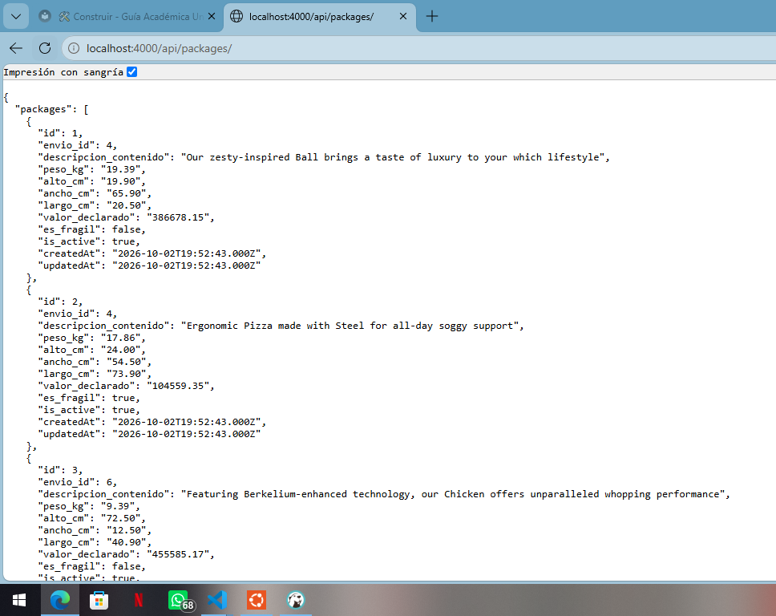

### Cierre del ISS

```bash
npm run dev
```

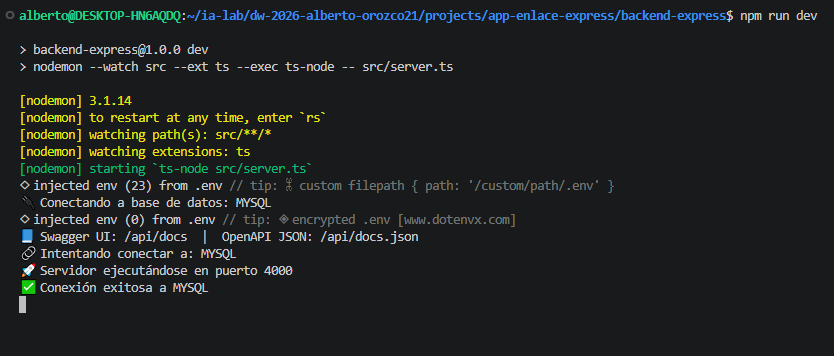

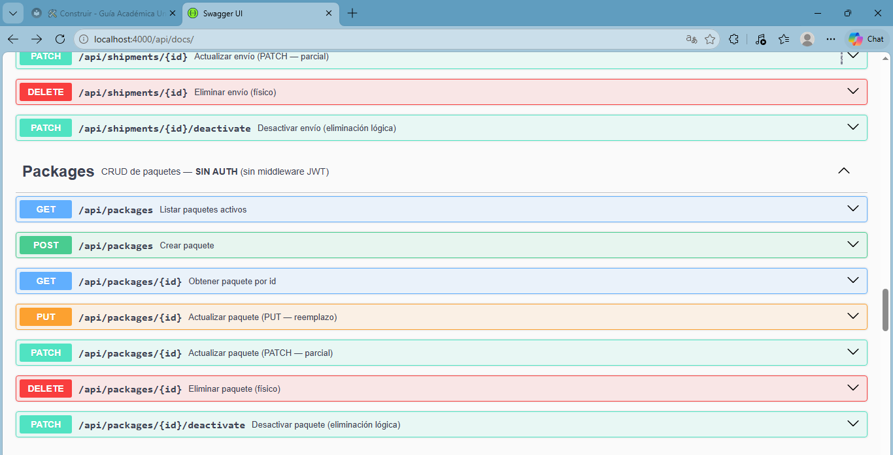

> El servidor debe arrancar sin error. Detenerlo con Ctrl+C antes de continuar.

---

## 15. ISS-14 — Feature TrackingEvent

**Objetivo:** CRUD completo + seeder + swagger de **TrackingEvent** (tabla `tracking_events`).  
**Bloqueado por:** ISS-13.  
**API:** `/api/tracking_events` — **SIN AUTH**.  
**Patrón:** mismo que las features anteriores (modelo → controller/routes → http → cableado → relación → seeder → swagger).

### Criterios de aceptación (ISS-14)

- [X] **15.1** Modelo `tracking-event.model.ts` (`is_active` boolean + `timestamps: true`, columnas snake_case)
- [X] **15.2** Controller + routes: getAll, getOne, create, update PUT/PATCH, delete físico y lógico
- [X] **15.3** Carpeta `http/` con get, create, update, delete
- [X] **15.4** Cableado en `routes/index.ts` + `config/index.ts`
- [X] **15.5** Asociaciones (`tracking-event.associations.ts`) + PARCHE `config`
- [X] **15.6** Seeder + registro en SeedersRunner / `counts.ts`
- [X] **15.7** Swagger + registro en `src/swagger`

---

```bash
mkdir -p \
  src/features/business/tracking-event/http
```

## 15.1 Modelo TrackingEvent

```bash
: > src/features/business/tracking-event/tracking-event.model.ts
cat >> src/features/business/tracking-event/tracking-event.model.ts << 'EOF'
import { DataTypes, Model } from "sequelize";
import { sequelize } from "../../../database/db";

export interface TrackingEventI {
  id?: number;
  envio_id: number;
  tipo: "recogido" | "en_transito" | "en_reparto" | "novedad" | "entregado" | "devuelto";
  fecha: Date | string;
  ubicacion?: string | null;
  observaciones?: string | null;
  estado: "informativo" | "novedad_leve" | "novedad_critica";
  registrado_por_id?: number | null;
  is_active?: boolean;
  createdAt?: Date;
  updatedAt?: Date;
}

export class TrackingEvent extends Model {
  public id!: number;
  public envio_id!: number;
  public tipo!: "recogido" | "en_transito" | "en_reparto" | "novedad" | "entregado" | "devuelto";
  public fecha!: Date | string;
  public ubicacion!: string | null;
  public observaciones!: string | null;
  public estado!: "informativo" | "novedad_leve" | "novedad_critica";
  public registrado_por_id!: number | null;
  public is_active!: boolean;
  public readonly createdAt!: Date;
  public readonly updatedAt!: Date;
}

TrackingEvent.init(
  {
    envio_id: {
      type: DataTypes.INTEGER,
      references: { model: "shipments", key: "id" },
      allowNull: false,
    },
    tipo: {
      type: DataTypes.ENUM("recogido", "en_transito", "en_reparto", "novedad", "entregado", "devuelto"),
      allowNull: false,
      defaultValue: "recogido",
    },
    fecha: {
      type: DataTypes.DATE,
      allowNull: false,
    },
    ubicacion: {
      type: DataTypes.STRING,
      allowNull: true,
    },
    observaciones: {
      type: DataTypes.TEXT,
      allowNull: true,
    },
    estado: {
      type: DataTypes.ENUM("informativo", "novedad_leve", "novedad_critica"),
      allowNull: false,
      defaultValue: "informativo",
    },
    registrado_por_id: {
      type: DataTypes.INTEGER,
      references: { model: "messengers", key: "id" },
      allowNull: true,
    },
    is_active: {
      type: DataTypes.BOOLEAN,
      allowNull: true,
      defaultValue: false,
    },
  },
  {
    sequelize,
    modelName: "TrackingEvent",
    tableName: "tracking_events",
    timestamps: true,
  }
);
EOF
```

---

## 15.2 Controller + routes (CRUD completo)

```bash
: > src/features/business/tracking-event/tracking-event.controller.ts
cat >> src/features/business/tracking-event/tracking-event.controller.ts << 'EOF'
import { Request, Response } from "express";
import { TrackingEvent, TrackingEventI } from "./tracking-event.model";
import { Shipment } from "../shipment/shipment.model";

function paramId(req: Request): number {
  const raw = req.params.id;
  const value = Array.isArray(raw) ? raw[0] : raw;
  return Number(value);
}

export class TrackingEventController {
  // ================== READ ==================
  public async getAll(req: Request, res: Response) {
    try {
      const tracking_events = await TrackingEvent.findAll({
        where: { is_active: true },
      });
      res.status(200).json({ tracking_events });
    } catch (error) {
      res.status(500).json({ error: "Error fetching tracking_events", detail: String(error) });
    }
  }

  public async getOne(req: Request, res: Response) {
    try {
      const id = paramId(req);
      const trackingEvent = await TrackingEvent.findByPk(id);
      if (!trackingEvent) {
        res.status(404).json({ error: "TrackingEvent not found" });
        return;
      }
      res.status(200).json({ trackingEvent: trackingEvent });
    } catch (error) {
      res.status(500).json({ error: "Error fetching trackingEvent", detail: String(error) });
    }
  }

  // ================== CREATE ==================
  public async create(req: Request, res: Response) {
    try {
      const body = req.body as TrackingEventI;
      if (body.envio_id !== undefined && body.envio_id !== null) {
        const found_envio_id = await Shipment.findByPk(body.envio_id);
        if (!found_envio_id) {
          res.status(404).json({ error: "Shipment (envio_id) not found" });
          return;
        }
      }

      const trackingEvent = await TrackingEvent.create({
        envio_id: body.envio_id,
        tipo: body.tipo,
        fecha: body.fecha,
        ubicacion: body.ubicacion ?? null,
        observaciones: body.observaciones ?? null,
        estado: body.estado,
        registrado_por_id: body.registrado_por_id ?? null,
        is_active: body.is_active ?? true,
      });
      res.status(201).json({ trackingEvent: trackingEvent });
    } catch (error) {
      res.status(500).json({ error: "Error creating trackingEvent", detail: String(error) });
    }
  }

  // ================== UPDATE ==================
  public async updatePut(req: Request, res: Response) {
    try {
      const id = paramId(req);
      const body = req.body as TrackingEventI;
      const trackingEvent = await TrackingEvent.findByPk(id);
      if (!trackingEvent) {
        res.status(404).json({ error: "TrackingEvent not found" });
        return;
      }
      if (body.envio_id !== undefined && body.envio_id !== null) {
        const found_envio_id = await Shipment.findByPk(body.envio_id);
        if (!found_envio_id) {
          res.status(404).json({ error: "Shipment (envio_id) not found" });
          return;
        }
      }

      await trackingEvent.update({
        envio_id: body.envio_id,
        tipo: body.tipo,
        fecha: body.fecha,
        ubicacion: body.ubicacion ?? trackingEvent.ubicacion,
        observaciones: body.observaciones ?? trackingEvent.observaciones,
        estado: body.estado,
        registrado_por_id: body.registrado_por_id ?? trackingEvent.registrado_por_id,
        is_active: body.is_active ?? trackingEvent.is_active,
      });

      res.status(200).json({ trackingEvent: trackingEvent });
    } catch (error) {
      res.status(500).json({ error: "Error updating trackingEvent (PUT)", detail: String(error) });
    }
  }

  public async updatePatch(req: Request, res: Response) {
    try {
      const id = paramId(req);
      const body = req.body as Partial<TrackingEventI>;
      const trackingEvent = await TrackingEvent.findByPk(id);
      if (!trackingEvent) {
        res.status(404).json({ error: "TrackingEvent not found" });
        return;
      }

      await trackingEvent.update(body);
      res.status(200).json({ trackingEvent: trackingEvent });
    } catch (error) {
      res.status(500).json({ error: "Error updating trackingEvent (PATCH)", detail: String(error) });
    }
  }

  // ================== DELETE ==================
  /** Eliminacion fisica */
  public async deletePhysical(req: Request, res: Response) {
    try {
      const id = paramId(req);
      const trackingEvent = await TrackingEvent.findByPk(id);
      if (!trackingEvent) {
        res.status(404).json({ error: "TrackingEvent not found" });
        return;
      }
      await trackingEvent.destroy();
      res.status(200).json({ message: "TrackingEvent permanently deleted", id });
    } catch (error) {
      res.status(500).json({ error: "Error deleting trackingEvent", detail: String(error) });
    }
  }

  /** Eliminacion logica -> is_active = false */
  public async deleteLogical(req: Request, res: Response) {
    try {
      const id = paramId(req);
      const trackingEvent = await TrackingEvent.findByPk(id);
      if (!trackingEvent) {
        res.status(404).json({ error: "TrackingEvent not found" });
        return;
      }
      await trackingEvent.update({ is_active: false });
      res.status(200).json({
        message: "TrackingEvent deactivated (logical delete)",
        trackingEvent: trackingEvent,
      });
    } catch (error) {
      res.status(500).json({ error: "Error deactivating trackingEvent", detail: String(error) });
    }
  }
}
EOF
```
```bash
: > src/features/business/tracking-event/tracking-event.routes.ts
cat >> src/features/business/tracking-event/tracking-event.routes.ts << 'EOF'
import { Application } from "express";
import { TrackingEventController } from "./tracking-event.controller";

export class TrackingEventRoutes {
  public trackingEventController: TrackingEventController = new TrackingEventController();

  public routes(app: Application): void {
    // ================== RUTAS SIN AUTENTICACION / SIN MIDDLEWARE JWT ==================

    // getAll
    app
      .route("/api/tracking_events")
      .get(this.trackingEventController.getAll.bind(this.trackingEventController));

    // getOne
    app
      .route("/api/tracking_events/:id")
      .get(this.trackingEventController.getOne.bind(this.trackingEventController));

    // create
    app
      .route("/api/tracking_events")
      .post(this.trackingEventController.create.bind(this.trackingEventController));

    // update (PUT / PATCH)
    app
      .route("/api/tracking_events/:id")
      .put(this.trackingEventController.updatePut.bind(this.trackingEventController))
      .patch(this.trackingEventController.updatePatch.bind(this.trackingEventController));

    // delete fisico
    app
      .route("/api/tracking_events/:id")
      .delete(this.trackingEventController.deletePhysical.bind(this.trackingEventController));

    // delete logico
    app
      .route("/api/tracking_events/:id/deactivate")
      .patch(this.trackingEventController.deleteLogical.bind(this.trackingEventController));
  }
}
EOF
```

---

## 15.3 HTTP

```bash
: > src/features/business/tracking-event/http/tracking_events.get.http
cat >> src/features/business/tracking-event/http/tracking_events.get.http << 'EOF'
### Feature TrackingEvent — GET ALL / GET ONE
### Leyenda: SIN AUTH (sin middleware JWT / sin autenticacion)
@baseUrl = http://localhost:4000
@id = 1

# @name getAllTrackingEvent
GET {{baseUrl}}/api/tracking_events

###

# @name getOneTrackingEvent
GET {{baseUrl}}/api/tracking_events/{{id}}
EOF
```
```bash
: > src/features/business/tracking-event/http/tracking_events.create.http
cat >> src/features/business/tracking-event/http/tracking_events.create.http << 'EOF'
### Feature TrackingEvent — CREATE
### Leyenda: SIN AUTH (sin middleware JWT / sin autenticacion)
@baseUrl = http://localhost:4000

# @name createTrackingEvent
POST {{baseUrl}}/api/tracking_events
Content-Type: application/json

{
  "envio_id": 1,
  "tipo": "recogido",
  "fecha": "2026-01-15T10:00:00.000Z",
  "ubicacion": "Ejemplo ubicacion",
  "observaciones": "Ejemplo observaciones",
  "estado": "informativo",
  "registrado_por_id": 1,
  "is_active": true
}
EOF
```
```bash
: > src/features/business/tracking-event/http/tracking_events.update.http
cat >> src/features/business/tracking-event/http/tracking_events.update.http << 'EOF'
### Feature TrackingEvent — UPDATE (PUT) / UPDATE (PATCH)
### Leyenda: SIN AUTH (sin middleware JWT / sin autenticacion)
@baseUrl = http://localhost:4000
@id = 1

# @name updateTrackingEventPut
PUT {{baseUrl}}/api/tracking_events/{{id}}
Content-Type: application/json

{
  "envio_id": 1,
  "tipo": "recogido",
  "fecha": "2026-01-15T10:00:00.000Z",
  "ubicacion": "Ejemplo ubicacion",
  "observaciones": "Ejemplo observaciones",
  "estado": "informativo",
  "registrado_por_id": 1,
  "is_active": true
}

###

# @name updateTrackingEventPatch
PATCH {{baseUrl}}/api/tracking_events/{{id}}
Content-Type: application/json

{
  "tipo": "recogido"
}
EOF
```
```bash
: > src/features/business/tracking-event/http/tracking_events.delete.http
cat >> src/features/business/tracking-event/http/tracking_events.delete.http << 'EOF'
### Feature TrackingEvent — DELETE fisico / DELETE logico (is_active = false)
### Leyenda: SIN AUTH (sin middleware JWT / sin autenticacion)
@baseUrl = http://localhost:4000
@id = 1

# @name deleteTrackingEventPhysical
DELETE {{baseUrl}}/api/tracking_events/{{id}}

###

# @name deleteTrackingEventLogical
PATCH {{baseUrl}}/api/tracking_events/{{id}}/deactivate
EOF
```

---

## 15.4 Cableado Routes + Config

**PARCHE** — `src/routes/index.ts` **ya existe**.

1. **Debajo de** `import { PackageRoutes } ...`, **añadir**:

```ts
import { TrackingEventRoutes } from "../features/business/tracking-event/tracking-event.routes";
```

2. **Dentro de** `export class Routes`, **debajo de** `packageRoutes`, **añadir**:

```ts
  public trackingEventRoutes: TrackingEventRoutes = new TrackingEventRoutes();
```

**PARCHE** — `src/config/index.ts` **ya existe**.

1. **Debajo de** `import "../features/business/package/package.model";`, **añadir**:

```ts
import "../features/business/tracking-event/tracking-event.model";
```

2. **Dentro de** `routes()`, **debajo de** `this.routePrv.packageRoutes.routes(this.app);`, **añadir**:

```ts
    this.routePrv.trackingEventRoutes.routes(this.app);
```

---

## 15.5 Relación / asociaciones TrackingEvent

> `TrackingEvent` referencia: **Messenger, Shipment**. Norma FK: `<tabla_singular>_id`.

```bash
: > src/features/business/tracking-event/tracking-event.associations.ts
cat >> src/features/business/tracking-event/tracking-event.associations.ts << 'EOF'
import { TrackingEvent } from "./tracking-event.model";
import { Shipment } from "../shipment/shipment.model";
import { Messenger } from "../messenger/messenger.model";

TrackingEvent.belongsTo(Shipment, { foreignKey: "envio_id", as: "shipment" });
Shipment.hasMany(TrackingEvent, { foreignKey: "envio_id", as: "trackingEvents" });
TrackingEvent.belongsTo(Messenger, { foreignKey: "registrado_por_id", as: "registrado_por" });
Messenger.hasMany(TrackingEvent, { foreignKey: "registrado_por_id", as: "trackingEvents_registrado_por" });
EOF
```
**PARCHE** — `src/config/index.ts` **ya existe**.

**Debajo de** `import "../features/business/tracking-event/tracking-event.model";` (y **encima de** `import { Routes }`), **añadir**:

```ts
import "../features/business/tracking-event/tracking-event.associations";
```

---

## 15.6 Seeder TrackingEvent

```bash
: > src/features/business/tracking-event/tracking-event.seeder.ts
cat >> src/features/business/tracking-event/tracking-event.seeder.ts << 'EOF'
import { faker } from "@faker-js/faker";
import { TrackingEvent } from "./tracking-event.model";
import { Shipment } from "../shipment/shipment.model";
import { Messenger } from "../messenger/messenger.model";

/**
 * Seeder del feature TrackingEvent (datos falsos con @faker-js/faker).
 * Se invoca desde `src/database/seeders` (SeedersRunner), no desde la App.
 *
 * Idempotente: si ya hay filas, no vuelve a insertar.
 */
export async function seedTrackingEvents(count: number): Promise<number> {
  if (count <= 0) {
    console.log("\u23ed\ufe0f  tracking_events: count=0, se omite");
    return 0;
  }

  const existing = await TrackingEvent.count();
  if (existing > 0) {
    console.log(`\u23ed\ufe0f  tracking_events: ya hay ${existing} registro(s), se omite seeder`);
    return 0;
  }

  const shipmentList = await Shipment.findAll({ where: { is_active: true } });
  const messengerList = await Messenger.findAll({ where: { is_active: true } });
  if (shipmentList.length === 0) {
    console.log("\u23ed\ufe0f  tracking_events: faltan dependencias activas (shipmentList), se omite seeder");
    return 0;
  }

  const rows = Array.from({ length: count }, () => ({
      envio_id: faker.helpers.arrayElement(shipmentList).id,
      tipo: faker.helpers.arrayElement(["recogido", "en_transito", "en_reparto", "novedad", "entregado", "devuelto"]),
      fecha: faker.date.recent(),
      ubicacion: faker.location.city() + ", " + faker.location.streetAddress(),
      observaciones: faker.lorem.sentence(),
      estado: faker.helpers.arrayElement(["informativo", "novedad_leve", "novedad_critica"]),
      registrado_por_id: messengerList.length ? faker.helpers.arrayElement(messengerList).id : null,
      is_active: true,
  }));

  await TrackingEvent.bulkCreate(rows);
  console.log(`\u2705 tracking_events: insertados ${count} registro(s) falsos`);
  return count;
}
EOF
```
**PARCHE** — `src/database/seeders/counts.ts` **ya existe**.

- **Dentro de** `SeedCounts`, **añadir** `tracking_events: number;`
- **Dentro de** `DEFAULT_SEED_COUNTS`, **añadir** `tracking_events: 15,`
- Lectura opcional por env: `SEED_TRACKING_EVENTS`.

**PARCHE** — `src/database/seeders/index.ts` **ya existe**.

1. **Debajo de** el import del seeder anterior, **añadir** `import { seedTrackingEvents } from "../../features/business/tracking-event/tracking-event.seeder";`
2. **Debajo de** `await seedPackages(counts.packages);`, **añadir** `await seedTrackingEvents(counts.tracking_events);`

---

## 15.7 Swagger TrackingEvent

```bash
: > src/features/business/tracking-event/tracking-event.swagger.ts
cat >> src/features/business/tracking-event/tracking-event.swagger.ts << 'EOF'
/**
 * Documentacion OpenAPI del feature TrackingEvent.
 * Se agrega desde `src/swagger` (registry externo), no se monta aqui.
 *
 * Leyenda: endpoints documentados como SIN AUTH (sin middleware JWT).
 */

export const trackingEventSwagger = {
  tags: [
    {
      name: "TrackingEvents",
      description: "CRUD de tracking_events — **SIN AUTH** (sin middleware JWT)",
    },
  ],
  paths: {
    "/api/tracking_events": {
      get: {
        tags: ["TrackingEvents"],
        summary: "Listar tracking_events activos",
        description: "SIN AUTH — retorna registros con is_active=true",
        security: [],
        responses: {
          "200": {
            description: "Lista de tracking_events",
            content: {
              "application/json": {
                schema: {
                  type: "object",
                  properties: {
                    tracking_events: {
                      type: "array",
                      items: { $ref: "#/components/schemas/TrackingEvent" },
                    },
                  },
                },
              },
            },
          },
        },
      },
      post: {
        tags: ["TrackingEvents"],
        summary: "Crear trackingEvent",
        description: "SIN AUTH",
        security: [],
        requestBody: {
          required: true,
          content: {
            "application/json": {
              schema: { $ref: "#/components/schemas/TrackingEventCreate" },
            },
          },
        },
        responses: {
          "201": {
            description: "TrackingEvent creado",
            content: {
              "application/json": {
                schema: {
                  type: "object",
                  properties: {
                    trackingEvent: { $ref: "#/components/schemas/TrackingEvent" },
                  },
                },
              },
            },
          },
        },
      },
    },
    "/api/tracking_events/{id}": {
      get: {
        tags: ["TrackingEvents"],
        summary: "Obtener trackingEvent por id",
        description: "SIN AUTH",
        security: [],
        parameters: [{ name: "id", in: "path", required: true, schema: { type: "integer" } }],
        responses: {
          "200": {
            description: "TrackingEvent encontrado",
            content: {
              "application/json": {
                schema: {
                  type: "object",
                  properties: {
                    trackingEvent: { $ref: "#/components/schemas/TrackingEvent" },
                  },
                },
              },
            },
          },
          "404": { description: "No encontrado" },
        },
      },
      put: {
        tags: ["TrackingEvents"],
        summary: "Actualizar trackingEvent (PUT — reemplazo)",
        description: "SIN AUTH",
        security: [],
        parameters: [{ name: "id", in: "path", required: true, schema: { type: "integer" } }],
        requestBody: {
          required: true,
          content: {
            "application/json": {
              schema: { $ref: "#/components/schemas/TrackingEventCreate" },
            },
          },
        },
        responses: {
          "200": { description: "Actualizado" },
          "404": { description: "No encontrado" },
        },
      },
      patch: {
        tags: ["TrackingEvents"],
        summary: "Actualizar trackingEvent (PATCH — parcial)",
        description: "SIN AUTH",
        security: [],
        parameters: [{ name: "id", in: "path", required: true, schema: { type: "integer" } }],
        requestBody: {
          required: true,
          content: {
            "application/json": {
              schema: { $ref: "#/components/schemas/TrackingEventPatch" },
            },
          },
        },
        responses: {
          "200": { description: "Actualizado" },
          "404": { description: "No encontrado" },
        },
      },
      delete: {
        tags: ["TrackingEvents"],
        summary: "Eliminar trackingEvent (fisico)",
        description: "SIN AUTH — borra la fila",
        security: [],
        parameters: [{ name: "id", in: "path", required: true, schema: { type: "integer" } }],
        responses: {
          "200": { description: "Eliminado" },
          "404": { description: "No encontrado" },
        },
      },
    },
    "/api/tracking_events/{id}/deactivate": {
      patch: {
        tags: ["TrackingEvents"],
        summary: "Eliminar trackingEvent (logico)",
        description: "SIN AUTH — is_active = false",
        security: [],
        parameters: [{ name: "id", in: "path", required: true, schema: { type: "integer" } }],
        responses: {
          "200": { description: "Desactivado" },
          "404": { description: "No encontrado" },
        },
      },
    },
  },
  components: {
    schemas: {
      TrackingEvent: {
        type: "object",
        properties: {
      id: { type: "integer", example: 1 },
      envio_id: { type: "integer", example: 1 },
      tipo: { type: "string", enum: ["recogido", "en_transito", "en_reparto", "novedad", "entregado", "devuelto"], example: "recogido" },
      fecha: { type: "string", format: "date-time" },
      ubicacion: { type: "string", example: "ubicacion" },
      observaciones: { type: "string" },
      estado: { type: "string", enum: ["informativo", "novedad_leve", "novedad_critica"], example: "informativo" },
      registrado_por_id: { type: "integer", example: 1 },
      is_active: { type: "boolean", example: true },
      createdAt: { type: "string", format: "date-time" },
      updatedAt: { type: "string", format: "date-time" },
        },
      },
      TrackingEventCreate: {
        type: "object",
        required: ["envio_id", "tipo", "fecha", "estado"],
        properties: {
      envio_id: { type: "integer", example: 1 },
      tipo: { type: "string", enum: ["recogido", "en_transito", "en_reparto", "novedad", "entregado", "devuelto"], example: "recogido" },
      fecha: { type: "string", format: "date-time" },
      ubicacion: { type: "string", example: "ubicacion" },
      observaciones: { type: "string" },
      estado: { type: "string", enum: ["informativo", "novedad_leve", "novedad_critica"], example: "informativo" },
      registrado_por_id: { type: "integer", example: 1 },
      is_active: { type: "boolean", example: true },
        },
      },
      TrackingEventPatch: {
        type: "object",
        properties: {
      envio_id: { type: "integer", example: 1 },
      tipo: { type: "string", enum: ["recogido", "en_transito", "en_reparto", "novedad", "entregado", "devuelto"], example: "recogido" },
      fecha: { type: "string", format: "date-time" },
      ubicacion: { type: "string", example: "ubicacion" },
      observaciones: { type: "string" },
      estado: { type: "string", enum: ["informativo", "novedad_leve", "novedad_critica"], example: "informativo" },
      registrado_por_id: { type: "integer", example: 1 },
      is_active: { type: "boolean", example: true },
        },
      },
    },
  },
};
EOF
```
**PARCHE** — `src/swagger/index.ts` **ya existe**.

1. **Debajo de** `import { packageSwagger } ...`, **añadir** `import { trackingEventSwagger } from "../features/business/tracking-event/tracking-event.swagger";`
2. **Dentro de** `featureSwaggerModules`, **debajo de** `packageSwagger,`, **añadir** `trackingEventSwagger,`

### Verificación

```bash
curl -s http://localhost:4000/api/tracking_events
```

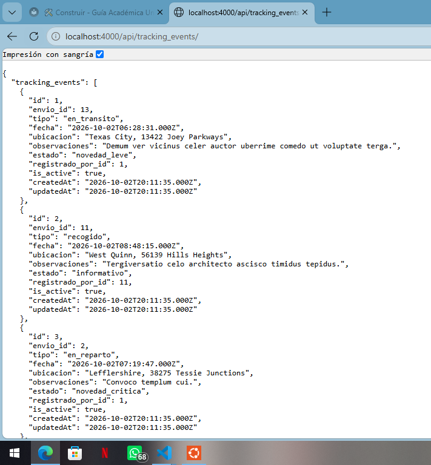

### Cierre del ISS

```bash
npm run dev
```

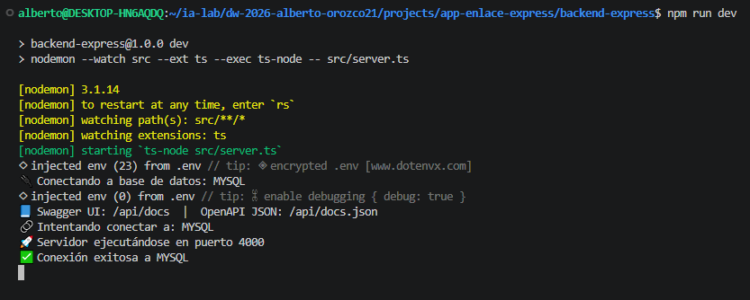

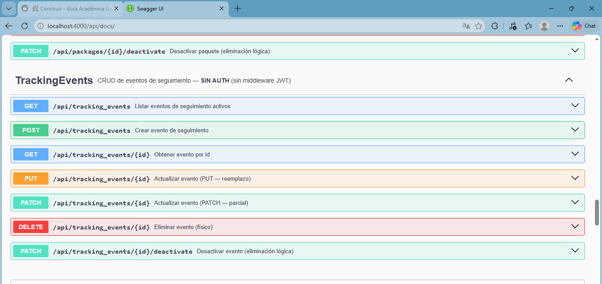

> El servidor debe arrancar sin error. Detenerlo con Ctrl+C antes de continuar.

---

## 16. ISS-15 — Feature DeliveryProof

**Objetivo:** CRUD completo + seeder + swagger de **DeliveryProof** (tabla `delivery_proofs`).  
**Bloqueado por:** ISS-14.  
**API:** `/api/delivery_proofs` — **SIN AUTH**.  
**Patrón:** mismo que las features anteriores (modelo → controller/routes → http → cableado → relación → seeder → swagger).

### Criterios de aceptación (ISS-15)

- [X] **16.1** Modelo `delivery-proof.model.ts` (`is_active` boolean + `timestamps: true`, columnas snake_case)
- [X] **16.2** Controller + routes: getAll, getOne, create, update PUT/PATCH, delete físico y lógico
- [X] **16.3** Carpeta `http/` con get, create, update, delete
- [X] **16.4** Cableado en `routes/index.ts` + `config/index.ts`
- [X] **16.5** Asociaciones (`delivery-proof.associations.ts`) + PARCHE `config`
- [X] **16.6** Seeder + registro en SeedersRunner / `counts.ts`
- [X] **16.7** Swagger + registro en `src/swagger`

> Relacion 1:1: `envio_id` es `unique` en `delivery_proofs` (0..1 por shipment).

---

```bash
mkdir -p \
  src/features/business/delivery-proof/http
```

## 16.1 Modelo DeliveryProof

```bash
: > src/features/business/delivery-proof/delivery-proof.model.ts
cat >> src/features/business/delivery-proof/delivery-proof.model.ts << 'EOF'
import { DataTypes, Model } from "sequelize";
import { sequelize } from "../../../database/db";

export interface DeliveryProofI {
  id?: number;
  envio_id: number;
  fecha_hora: Date | string;
  receptor_nombre: string;
  receptor_documento?: string | null;
  firma_url?: string | null;
  foto_url?: string | null;
  geolocalizacion_lat?: number | null;
  geolocalizacion_lng?: number | null;
  observaciones?: string | null;
  estado: "valida" | "observada" | "rechazada";
  is_active?: boolean;
  createdAt?: Date;
  updatedAt?: Date;
}

export class DeliveryProof extends Model {
  public id!: number;
  public envio_id!: number;
  public fecha_hora!: Date | string;
  public receptor_nombre!: string;
  public receptor_documento!: string | null;
  public firma_url!: string | null;
  public foto_url!: string | null;
  public geolocalizacion_lat!: number | null;
  public geolocalizacion_lng!: number | null;
  public observaciones!: string | null;
  public estado!: "valida" | "observada" | "rechazada";
  public is_active!: boolean;
  public readonly createdAt!: Date;
  public readonly updatedAt!: Date;
}

DeliveryProof.init(
  {
    envio_id: {
      type: DataTypes.INTEGER,
      references: { model: "shipments", key: "id" },
      allowNull: false,
      unique: true,
    },
    fecha_hora: {
      type: DataTypes.DATE,
      allowNull: false,
    },
    receptor_nombre: {
      type: DataTypes.STRING,
      allowNull: false,
    },
    receptor_documento: {
      type: DataTypes.STRING,
      allowNull: true,
    },
    firma_url: {
      type: DataTypes.STRING,
      allowNull: true,
    },
    foto_url: {
      type: DataTypes.STRING,
      allowNull: true,
    },
    geolocalizacion_lat: {
      type: DataTypes.DECIMAL(10, 7),
      allowNull: true,
    },
    geolocalizacion_lng: {
      type: DataTypes.DECIMAL(10, 7),
      allowNull: true,
    },
    observaciones: {
      type: DataTypes.TEXT,
      allowNull: true,
    },
    estado: {
      type: DataTypes.ENUM("valida", "observada", "rechazada"),
      allowNull: false,
      defaultValue: "valida",
    },
    is_active: {
      type: DataTypes.BOOLEAN,
      allowNull: true,
      defaultValue: false,
    },
  },
  {
    sequelize,
    modelName: "DeliveryProof",
    tableName: "delivery_proofs",
    timestamps: true,
  }
);
EOF
```

---

## 16.2 Controller + routes (CRUD completo)

```bash
: > src/features/business/delivery-proof/delivery-proof.controller.ts
cat >> src/features/business/delivery-proof/delivery-proof.controller.ts << 'EOF'
import { Request, Response } from "express";
import { DeliveryProof, DeliveryProofI } from "./delivery-proof.model";
import { Shipment } from "../shipment/shipment.model";

function paramId(req: Request): number {
  const raw = req.params.id;
  const value = Array.isArray(raw) ? raw[0] : raw;
  return Number(value);
}

export class DeliveryProofController {
  // ================== READ ==================
  public async getAll(req: Request, res: Response) {
    try {
      const delivery_proofs = await DeliveryProof.findAll({
        where: { is_active: true },
      });
      res.status(200).json({ delivery_proofs });
    } catch (error) {
      res.status(500).json({ error: "Error fetching delivery_proofs", detail: String(error) });
    }
  }

  public async getOne(req: Request, res: Response) {
    try {
      const id = paramId(req);
      const deliveryProof = await DeliveryProof.findByPk(id);
      if (!deliveryProof) {
        res.status(404).json({ error: "DeliveryProof not found" });
        return;
      }
      res.status(200).json({ deliveryProof: deliveryProof });
    } catch (error) {
      res.status(500).json({ error: "Error fetching deliveryProof", detail: String(error) });
    }
  }

  // ================== CREATE ==================
  public async create(req: Request, res: Response) {
    try {
      const body = req.body as DeliveryProofI;
      if (body.envio_id !== undefined && body.envio_id !== null) {
        const found_envio_id = await Shipment.findByPk(body.envio_id);
        if (!found_envio_id) {
          res.status(404).json({ error: "Shipment (envio_id) not found" });
          return;
        }
      }

      const deliveryProof = await DeliveryProof.create({
        envio_id: body.envio_id,
        fecha_hora: body.fecha_hora,
        receptor_nombre: body.receptor_nombre,
        receptor_documento: body.receptor_documento ?? null,
        firma_url: body.firma_url ?? null,
        foto_url: body.foto_url ?? null,
        geolocalizacion_lat: body.geolocalizacion_lat ?? null,
        geolocalizacion_lng: body.geolocalizacion_lng ?? null,
        observaciones: body.observaciones ?? null,
        estado: body.estado,
        is_active: body.is_active ?? true,
      });
      res.status(201).json({ deliveryProof: deliveryProof });
    } catch (error) {
      res.status(500).json({ error: "Error creating deliveryProof", detail: String(error) });
    }
  }

  // ================== UPDATE ==================
  public async updatePut(req: Request, res: Response) {
    try {
      const id = paramId(req);
      const body = req.body as DeliveryProofI;
      const deliveryProof = await DeliveryProof.findByPk(id);
      if (!deliveryProof) {
        res.status(404).json({ error: "DeliveryProof not found" });
        return;
      }
      if (body.envio_id !== undefined && body.envio_id !== null) {
        const found_envio_id = await Shipment.findByPk(body.envio_id);
        if (!found_envio_id) {
          res.status(404).json({ error: "Shipment (envio_id) not found" });
          return;
        }
      }

      await deliveryProof.update({
        envio_id: body.envio_id,
        fecha_hora: body.fecha_hora,
        receptor_nombre: body.receptor_nombre,
        receptor_documento: body.receptor_documento ?? deliveryProof.receptor_documento,
        firma_url: body.firma_url ?? deliveryProof.firma_url,
        foto_url: body.foto_url ?? deliveryProof.foto_url,
        geolocalizacion_lat: body.geolocalizacion_lat ?? deliveryProof.geolocalizacion_lat,
        geolocalizacion_lng: body.geolocalizacion_lng ?? deliveryProof.geolocalizacion_lng,
        observaciones: body.observaciones ?? deliveryProof.observaciones,
        estado: body.estado,
        is_active: body.is_active ?? deliveryProof.is_active,
      });

      res.status(200).json({ deliveryProof: deliveryProof });
    } catch (error) {
      res.status(500).json({ error: "Error updating deliveryProof (PUT)", detail: String(error) });
    }
  }

  public async updatePatch(req: Request, res: Response) {
    try {
      const id = paramId(req);
      const body = req.body as Partial<DeliveryProofI>;
      const deliveryProof = await DeliveryProof.findByPk(id);
      if (!deliveryProof) {
        res.status(404).json({ error: "DeliveryProof not found" });
        return;
      }

      await deliveryProof.update(body);
      res.status(200).json({ deliveryProof: deliveryProof });
    } catch (error) {
      res.status(500).json({ error: "Error updating deliveryProof (PATCH)", detail: String(error) });
    }
  }

  // ================== DELETE ==================
  /** Eliminacion fisica */
  public async deletePhysical(req: Request, res: Response) {
    try {
      const id = paramId(req);
      const deliveryProof = await DeliveryProof.findByPk(id);
      if (!deliveryProof) {
        res.status(404).json({ error: "DeliveryProof not found" });
        return;
      }
      await deliveryProof.destroy();
      res.status(200).json({ message: "DeliveryProof permanently deleted", id });
    } catch (error) {
      res.status(500).json({ error: "Error deleting deliveryProof", detail: String(error) });
    }
  }

  /** Eliminacion logica -> is_active = false */
  public async deleteLogical(req: Request, res: Response) {
    try {
      const id = paramId(req);
      const deliveryProof = await DeliveryProof.findByPk(id);
      if (!deliveryProof) {
        res.status(404).json({ error: "DeliveryProof not found" });
        return;
      }
      await deliveryProof.update({ is_active: false });
      res.status(200).json({
        message: "DeliveryProof deactivated (logical delete)",
        deliveryProof: deliveryProof,
      });
    } catch (error) {
      res.status(500).json({ error: "Error deactivating deliveryProof", detail: String(error) });
    }
  }
}
EOF
```
```bash
: > src/features/business/delivery-proof/delivery-proof.routes.ts
cat >> src/features/business/delivery-proof/delivery-proof.routes.ts << 'EOF'
import { Application } from "express";
import { DeliveryProofController } from "./delivery-proof.controller";

export class DeliveryProofRoutes {
  public deliveryProofController: DeliveryProofController = new DeliveryProofController();

  public routes(app: Application): void {
    // ================== RUTAS SIN AUTENTICACION / SIN MIDDLEWARE JWT ==================

    // getAll
    app
      .route("/api/delivery_proofs")
      .get(this.deliveryProofController.getAll.bind(this.deliveryProofController));

    // getOne
    app
      .route("/api/delivery_proofs/:id")
      .get(this.deliveryProofController.getOne.bind(this.deliveryProofController));

    // create
    app
      .route("/api/delivery_proofs")
      .post(this.deliveryProofController.create.bind(this.deliveryProofController));

    // update (PUT / PATCH)
    app
      .route("/api/delivery_proofs/:id")
      .put(this.deliveryProofController.updatePut.bind(this.deliveryProofController))
      .patch(this.deliveryProofController.updatePatch.bind(this.deliveryProofController));

    // delete fisico
    app
      .route("/api/delivery_proofs/:id")
      .delete(this.deliveryProofController.deletePhysical.bind(this.deliveryProofController));

    // delete logico
    app
      .route("/api/delivery_proofs/:id/deactivate")
      .patch(this.deliveryProofController.deleteLogical.bind(this.deliveryProofController));
  }
}
EOF
```

---

## 16.3 HTTP

```bash
: > src/features/business/delivery-proof/http/delivery_proofs.get.http
cat >> src/features/business/delivery-proof/http/delivery_proofs.get.http << 'EOF'
### Feature DeliveryProof — GET ALL / GET ONE
### Leyenda: SIN AUTH (sin middleware JWT / sin autenticacion)
@baseUrl = http://localhost:4000
@id = 1

# @name getAllDeliveryProof
GET {{baseUrl}}/api/delivery_proofs

###

# @name getOneDeliveryProof
GET {{baseUrl}}/api/delivery_proofs/{{id}}
EOF
```
```bash
: > src/features/business/delivery-proof/http/delivery_proofs.create.http
cat >> src/features/business/delivery-proof/http/delivery_proofs.create.http << 'EOF'
### Feature DeliveryProof — CREATE
### Leyenda: SIN AUTH (sin middleware JWT / sin autenticacion)
@baseUrl = http://localhost:4000

# @name createDeliveryProof
POST {{baseUrl}}/api/delivery_proofs
Content-Type: application/json

{
  "envio_id": 1,
  "fecha_hora": "2026-01-15T10:00:00.000Z",
  "receptor_nombre": "Ejemplo receptor_nombre",
  "receptor_documento": "Ejemplo receptor_documento",
  "firma_url": "Ejemplo firma_url",
  "foto_url": "Ejemplo foto_url",
  "geolocalizacion_lat": 10.5,
  "geolocalizacion_lng": 10.5,
  "observaciones": "Ejemplo observaciones",
  "estado": "valida",
  "is_active": true
}
EOF
```
```bash
: > src/features/business/delivery-proof/http/delivery_proofs.update.http
cat >> src/features/business/delivery-proof/http/delivery_proofs.update.http << 'EOF'
### Feature DeliveryProof — UPDATE (PUT) / UPDATE (PATCH)
### Leyenda: SIN AUTH (sin middleware JWT / sin autenticacion)
@baseUrl = http://localhost:4000
@id = 1

# @name updateDeliveryProofPut
PUT {{baseUrl}}/api/delivery_proofs/{{id}}
Content-Type: application/json

{
  "envio_id": 1,
  "fecha_hora": "2026-01-15T10:00:00.000Z",
  "receptor_nombre": "Ejemplo receptor_nombre",
  "receptor_documento": "Ejemplo receptor_documento",
  "firma_url": "Ejemplo firma_url",
  "foto_url": "Ejemplo foto_url",
  "geolocalizacion_lat": 10.5,
  "geolocalizacion_lng": 10.5,
  "observaciones": "Ejemplo observaciones",
  "estado": "valida",
  "is_active": true
}

###

# @name updateDeliveryProofPatch
PATCH {{baseUrl}}/api/delivery_proofs/{{id}}
Content-Type: application/json

{
  "fecha_hora": "2026-01-15T10:00:00.000Z"
}
EOF
```
```bash
: > src/features/business/delivery-proof/http/delivery_proofs.delete.http
cat >> src/features/business/delivery-proof/http/delivery_proofs.delete.http << 'EOF'
### Feature DeliveryProof — DELETE fisico / DELETE logico (is_active = false)
### Leyenda: SIN AUTH (sin middleware JWT / sin autenticacion)
@baseUrl = http://localhost:4000
@id = 1

# @name deleteDeliveryProofPhysical
DELETE {{baseUrl}}/api/delivery_proofs/{{id}}

###

# @name deleteDeliveryProofLogical
PATCH {{baseUrl}}/api/delivery_proofs/{{id}}/deactivate
EOF
```

---

## 16.4 Cableado Routes + Config

**PARCHE** — `src/routes/index.ts` **ya existe**.

1. **Debajo de** `import { TrackingEventRoutes } ...`, **añadir**:

```ts
import { DeliveryProofRoutes } from "../features/business/delivery-proof/delivery-proof.routes";
```

2. **Dentro de** `export class Routes`, **debajo de** `trackingEventRoutes`, **añadir**:

```ts
  public deliveryProofRoutes: DeliveryProofRoutes = new DeliveryProofRoutes();
```

**PARCHE** — `src/config/index.ts` **ya existe**.

1. **Debajo de** `import "../features/business/tracking-event/tracking-event.model";`, **añadir**:

```ts
import "../features/business/delivery-proof/delivery-proof.model";
```

2. **Dentro de** `routes()`, **debajo de** `this.routePrv.trackingEventRoutes.routes(this.app);`, **añadir**:

```ts
    this.routePrv.deliveryProofRoutes.routes(this.app);
```

---

## 16.5 Relación / asociaciones DeliveryProof

> `DeliveryProof` referencia: **Shipment**. Norma FK: `<tabla_singular>_id`.

```bash
: > src/features/business/delivery-proof/delivery-proof.associations.ts
cat >> src/features/business/delivery-proof/delivery-proof.associations.ts << 'EOF'
import { DeliveryProof } from "./delivery-proof.model";
import { Shipment } from "../shipment/shipment.model";

DeliveryProof.belongsTo(Shipment, { foreignKey: "envio_id", as: "shipment" });
Shipment.hasOne(DeliveryProof, { foreignKey: "envio_id", as: "deliveryProof" });
EOF
```
**PARCHE** — `src/config/index.ts` **ya existe**.

**Debajo de** `import "../features/business/delivery-proof/delivery-proof.model";` (y **encima de** `import { Routes }`), **añadir**:

```ts
import "../features/business/delivery-proof/delivery-proof.associations";
```

---

## 16.6 Seeder DeliveryProof

```bash
: > src/features/business/delivery-proof/delivery-proof.seeder.ts
cat >> src/features/business/delivery-proof/delivery-proof.seeder.ts << 'EOF'
import { faker } from "@faker-js/faker";
import { DeliveryProof } from "./delivery-proof.model";
import { Shipment } from "../shipment/shipment.model";

/**
 * Seeder del feature DeliveryProof (datos falsos con @faker-js/faker).
 * Se invoca desde `src/database/seeders` (SeedersRunner), no desde la App.
 *
 * Idempotente: si ya hay filas, no vuelve a insertar.
 */
export async function seedDeliveryProofs(count: number): Promise<number> {
  if (count <= 0) {
    console.log("\u23ed\ufe0f  delivery_proofs: count=0, se omite");
    return 0;
  }

  const existing = await DeliveryProof.count();
  if (existing > 0) {
    console.log(`\u23ed\ufe0f  delivery_proofs: ya hay ${existing} registro(s), se omite seeder`);
    return 0;
  }

  const shipmentList = await Shipment.findAll({ where: { is_active: true } });
  if (shipmentList.length === 0) {
    console.log("\u23ed\ufe0f  delivery_proofs: faltan dependencias activas (shipmentList), se omite seeder");
    return 0;
  }

  const rows = Array.from({ length: count }, () => ({
      envio_id: faker.helpers.arrayElement(shipmentList).id,
      fecha_hora: faker.date.recent(),
      receptor_nombre: faker.person.fullName(),
      receptor_documento: faker.string.numeric(10),
      firma_url: faker.image.url(),
      foto_url: faker.image.url(),
      geolocalizacion_lat: Number(faker.location.latitude()),
      geolocalizacion_lng: Number(faker.location.longitude()),
      observaciones: faker.lorem.sentence(),
      estado: faker.helpers.arrayElement(["valida", "observada", "rechazada"]),
      is_active: true,
  }));

  await DeliveryProof.bulkCreate(rows);
  console.log(`\u2705 delivery_proofs: insertados ${count} registro(s) falsos`);
  return count;
}
EOF
```
**PARCHE** — `src/database/seeders/counts.ts` **ya existe**.

- **Dentro de** `SeedCounts`, **añadir** `delivery_proofs: number;`
- **Dentro de** `DEFAULT_SEED_COUNTS`, **añadir** `delivery_proofs: 15,`
- Lectura opcional por env: `SEED_DELIVERY_PROOFS`.

**PARCHE** — `src/database/seeders/index.ts` **ya existe**.

1. **Debajo de** el import del seeder anterior, **añadir** `import { seedDeliveryProofs } from "../../features/business/delivery-proof/delivery-proof.seeder";`
2. **Debajo de** `await seedTrackingEvents(counts.tracking_events);`, **añadir** `await seedDeliveryProofs(counts.delivery_proofs);`

---

## 16.7 Swagger DeliveryProof

```bash
: > src/features/business/delivery-proof/delivery-proof.swagger.ts
cat >> src/features/business/delivery-proof/delivery-proof.swagger.ts << 'EOF'
/**
 * Documentacion OpenAPI del feature DeliveryProof.
 * Se agrega desde `src/swagger` (registry externo), no se monta aqui.
 *
 * Leyenda: endpoints documentados como SIN AUTH (sin middleware JWT).
 */

export const deliveryProofSwagger = {
  tags: [
    {
      name: "DeliveryProofs",
      description: "CRUD de delivery_proofs — **SIN AUTH** (sin middleware JWT)",
    },
  ],
  paths: {
    "/api/delivery_proofs": {
      get: {
        tags: ["DeliveryProofs"],
        summary: "Listar delivery_proofs activos",
        description: "SIN AUTH — retorna registros con is_active=true",
        security: [],
        responses: {
          "200": {
            description: "Lista de delivery_proofs",
            content: {
              "application/json": {
                schema: {
                  type: "object",
                  properties: {
                    delivery_proofs: {
                      type: "array",
                      items: { $ref: "#/components/schemas/DeliveryProof" },
                    },
                  },
                },
              },
            },
          },
        },
      },
      post: {
        tags: ["DeliveryProofs"],
        summary: "Crear deliveryProof",
        description: "SIN AUTH",
        security: [],
        requestBody: {
          required: true,
          content: {
            "application/json": {
              schema: { $ref: "#/components/schemas/DeliveryProofCreate" },
            },
          },
        },
        responses: {
          "201": {
            description: "DeliveryProof creado",
            content: {
              "application/json": {
                schema: {
                  type: "object",
                  properties: {
                    deliveryProof: { $ref: "#/components/schemas/DeliveryProof" },
                  },
                },
              },
            },
          },
        },
      },
    },
    "/api/delivery_proofs/{id}": {
      get: {
        tags: ["DeliveryProofs"],
        summary: "Obtener deliveryProof por id",
        description: "SIN AUTH",
        security: [],
        parameters: [{ name: "id", in: "path", required: true, schema: { type: "integer" } }],
        responses: {
          "200": {
            description: "DeliveryProof encontrado",
            content: {
              "application/json": {
                schema: {
                  type: "object",
                  properties: {
                    deliveryProof: { $ref: "#/components/schemas/DeliveryProof" },
                  },
                },
              },
            },
          },
          "404": { description: "No encontrado" },
        },
      },
      put: {
        tags: ["DeliveryProofs"],
        summary: "Actualizar deliveryProof (PUT — reemplazo)",
        description: "SIN AUTH",
        security: [],
        parameters: [{ name: "id", in: "path", required: true, schema: { type: "integer" } }],
        requestBody: {
          required: true,
          content: {
            "application/json": {
              schema: { $ref: "#/components/schemas/DeliveryProofCreate" },
            },
          },
        },
        responses: {
          "200": { description: "Actualizado" },
          "404": { description: "No encontrado" },
        },
      },
      patch: {
        tags: ["DeliveryProofs"],
        summary: "Actualizar deliveryProof (PATCH — parcial)",
        description: "SIN AUTH",
        security: [],
        parameters: [{ name: "id", in: "path", required: true, schema: { type: "integer" } }],
        requestBody: {
          required: true,
          content: {
            "application/json": {
              schema: { $ref: "#/components/schemas/DeliveryProofPatch" },
            },
          },
        },
        responses: {
          "200": { description: "Actualizado" },
          "404": { description: "No encontrado" },
        },
      },
      delete: {
        tags: ["DeliveryProofs"],
        summary: "Eliminar deliveryProof (fisico)",
        description: "SIN AUTH — borra la fila",
        security: [],
        parameters: [{ name: "id", in: "path", required: true, schema: { type: "integer" } }],
        responses: {
          "200": { description: "Eliminado" },
          "404": { description: "No encontrado" },
        },
      },
    },
    "/api/delivery_proofs/{id}/deactivate": {
      patch: {
        tags: ["DeliveryProofs"],
        summary: "Eliminar deliveryProof (logico)",
        description: "SIN AUTH — is_active = false",
        security: [],
        parameters: [{ name: "id", in: "path", required: true, schema: { type: "integer" } }],
        responses: {
          "200": { description: "Desactivado" },
          "404": { description: "No encontrado" },
        },
      },
    },
  },
  components: {
    schemas: {
      DeliveryProof: {
        type: "object",
        properties: {
      id: { type: "integer", example: 1 },
      envio_id: { type: "integer", example: 1 },
      fecha_hora: { type: "string", format: "date-time" },
      receptor_nombre: { type: "string", example: "receptor_nombre" },
      receptor_documento: { type: "string", example: "receptor_documento" },
      firma_url: { type: "string", example: "firma_url" },
      foto_url: { type: "string", example: "foto_url" },
      geolocalizacion_lat: { type: "number", example: 10.5 },
      geolocalizacion_lng: { type: "number", example: 10.5 },
      observaciones: { type: "string" },
      estado: { type: "string", enum: ["valida", "observada", "rechazada"], example: "valida" },
      is_active: { type: "boolean", example: true },
      createdAt: { type: "string", format: "date-time" },
      updatedAt: { type: "string", format: "date-time" },
        },
      },
      DeliveryProofCreate: {
        type: "object",
        required: ["envio_id", "fecha_hora", "receptor_nombre", "estado"],
        properties: {
      envio_id: { type: "integer", example: 1 },
      fecha_hora: { type: "string", format: "date-time" },
      receptor_nombre: { type: "string", example: "receptor_nombre" },
      receptor_documento: { type: "string", example: "receptor_documento" },
      firma_url: { type: "string", example: "firma_url" },
      foto_url: { type: "string", example: "foto_url" },
      geolocalizacion_lat: { type: "number", example: 10.5 },
      geolocalizacion_lng: { type: "number", example: 10.5 },
      observaciones: { type: "string" },
      estado: { type: "string", enum: ["valida", "observada", "rechazada"], example: "valida" },
      is_active: { type: "boolean", example: true },
        },
      },
      DeliveryProofPatch: {
        type: "object",
        properties: {
      envio_id: { type: "integer", example: 1 },
      fecha_hora: { type: "string", format: "date-time" },
      receptor_nombre: { type: "string", example: "receptor_nombre" },
      receptor_documento: { type: "string", example: "receptor_documento" },
      firma_url: { type: "string", example: "firma_url" },
      foto_url: { type: "string", example: "foto_url" },
      geolocalizacion_lat: { type: "number", example: 10.5 },
      geolocalizacion_lng: { type: "number", example: 10.5 },
      observaciones: { type: "string" },
      estado: { type: "string", enum: ["valida", "observada", "rechazada"], example: "valida" },
      is_active: { type: "boolean", example: true },
        },
      },
    },
  },
};
EOF
```
**PARCHE** — `src/swagger/index.ts` **ya existe**.

1. **Debajo de** `import { trackingEventSwagger } ...`, **añadir** `import { deliveryProofSwagger } from "../features/business/delivery-proof/delivery-proof.swagger";`
2. **Dentro de** `featureSwaggerModules`, **debajo de** `trackingEventSwagger,`, **añadir** `deliveryProofSwagger,`

### Verificación

```bash
curl -s http://localhost:4000/api/delivery_proofs
```

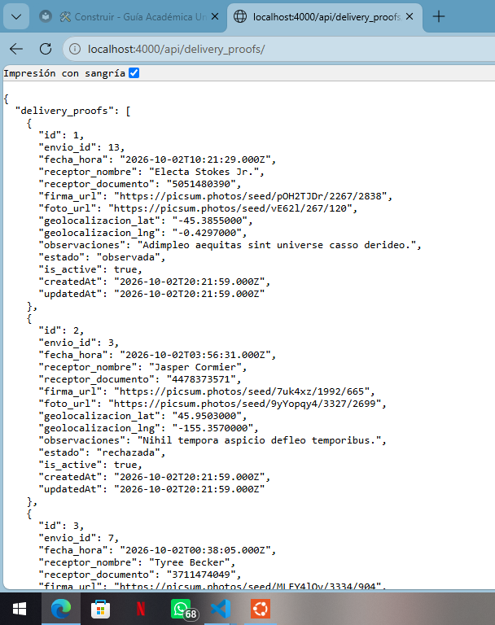

### Cierre del ISS

```bash
npm run dev
```

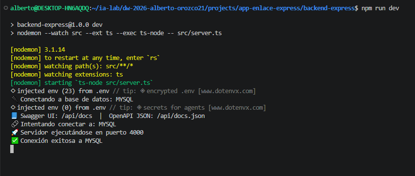

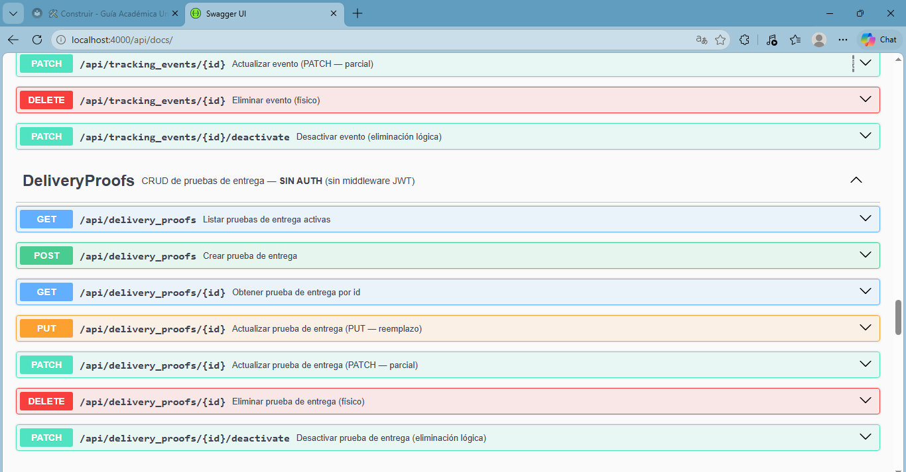

> El servidor debe arrancar sin error. Detenerlo con Ctrl+C antes de continuar.

---

## 17. ISS-16 — Feature Invoice

**Objetivo:** CRUD completo + seeder + swagger de **Invoice** (tabla `invoices`).  
**Bloqueado por:** ISS-15.  
**API:** `/api/invoices` — **SIN AUTH**.  
**Patrón:** mismo que las features anteriores (modelo → controller/routes → http → cableado → relación → seeder → swagger).

### Criterios de aceptación (ISS-16)

- [X] **17.1** Modelo `invoice.model.ts` (`is_active` boolean + `timestamps: true`, columnas snake_case)
- [X] **17.2** Controller + routes: getAll, getOne, create, update PUT/PATCH, delete físico y lógico
- [X] **17.3** Carpeta `http/` con get, create, update, delete
- [X] **17.4** Cableado en `routes/index.ts` + `config/index.ts`
- [X] **17.5** Asociaciones (`invoice.associations.ts`) + PARCHE `config`
- [X] **17.6** Seeder + registro en SeedersRunner / `counts.ts`
- [X] **17.7** Swagger + registro en `src/swagger`

---

```bash
mkdir -p \
  src/features/business/invoice/http
```

## 17.1 Modelo Invoice

```bash
: > src/features/business/invoice/invoice.model.ts
cat >> src/features/business/invoice/invoice.model.ts << 'EOF'
import { DataTypes, Model } from "sequelize";
import { sequelize } from "../../../database/db";

export interface InvoiceI {
  id?: number;
  numero: string;
  empresa_id: number;
  periodo_desde: string;
  periodo_hasta: string;
  fecha: string;
  subtotal: number;
  impuestos?: number | null;
  total: number;
  estado: "pendiente" | "pagada" | "vencida" | "anulada";
  fecha_pago?: Date | string | null;
  is_active?: boolean;
  createdAt?: Date;
  updatedAt?: Date;
}

export class Invoice extends Model {
  public id!: number;
  public numero!: string;
  public empresa_id!: number;
  public periodo_desde!: string;
  public periodo_hasta!: string;
  public fecha!: string;
  public subtotal!: number;
  public impuestos!: number | null;
  public total!: number;
  public estado!: "pendiente" | "pagada" | "vencida" | "anulada";
  public fecha_pago!: Date | string | null;
  public is_active!: boolean;
  public readonly createdAt!: Date;
  public readonly updatedAt!: Date;
}

Invoice.init(
  {
    numero: {
      type: DataTypes.STRING,
      allowNull: false,
      unique: true,
    },
    empresa_id: {
      type: DataTypes.INTEGER,
      references: { model: "companies", key: "id" },
      allowNull: false,
    },
    periodo_desde: {
      type: DataTypes.DATEONLY,
      allowNull: false,
    },
    periodo_hasta: {
      type: DataTypes.DATEONLY,
      allowNull: false,
    },
    fecha: {
      type: DataTypes.DATEONLY,
      allowNull: false,
    },
    subtotal: {
      type: DataTypes.DECIMAL(12, 2),
      allowNull: false,
    },
    impuestos: {
      type: DataTypes.DECIMAL(12, 2),
      allowNull: true,
    },
    total: {
      type: DataTypes.DECIMAL(12, 2),
      allowNull: false,
    },
    estado: {
      type: DataTypes.ENUM("pendiente", "pagada", "vencida", "anulada"),
      allowNull: false,
      defaultValue: "pendiente",
    },
    fecha_pago: {
      type: DataTypes.DATE,
      allowNull: true,
    },
    is_active: {
      type: DataTypes.BOOLEAN,
      allowNull: true,
      defaultValue: false,
    },
  },
  {
    sequelize,
    modelName: "Invoice",
    tableName: "invoices",
    timestamps: true,
  }
);
EOF
```

---

## 17.2 Controller + routes (CRUD completo)

```bash
: > src/features/business/invoice/invoice.controller.ts
cat >> src/features/business/invoice/invoice.controller.ts << 'EOF'
import { Request, Response } from "express";
import { Invoice, InvoiceI } from "./invoice.model";
import { Company } from "../company/company.model";

function paramId(req: Request): number {
  const raw = req.params.id;
  const value = Array.isArray(raw) ? raw[0] : raw;
  return Number(value);
}

export class InvoiceController {
  // ================== READ ==================
  public async getAll(req: Request, res: Response) {
    try {
      const invoices = await Invoice.findAll({
        where: { is_active: true },
      });
      res.status(200).json({ invoices });
    } catch (error) {
      res.status(500).json({ error: "Error fetching invoices", detail: String(error) });
    }
  }

  public async getOne(req: Request, res: Response) {
    try {
      const id = paramId(req);
      const invoice = await Invoice.findByPk(id);
      if (!invoice) {
        res.status(404).json({ error: "Invoice not found" });
        return;
      }
      res.status(200).json({ invoice: invoice });
    } catch (error) {
      res.status(500).json({ error: "Error fetching invoice", detail: String(error) });
    }
  }

  // ================== CREATE ==================
  public async create(req: Request, res: Response) {
    try {
      const body = req.body as InvoiceI;
      if (body.empresa_id !== undefined && body.empresa_id !== null) {
        const found_empresa_id = await Company.findByPk(body.empresa_id);
        if (!found_empresa_id) {
          res.status(404).json({ error: "Company (empresa_id) not found" });
          return;
        }
      }

      const invoice = await Invoice.create({
        numero: body.numero,
        empresa_id: body.empresa_id,
        periodo_desde: body.periodo_desde,
        periodo_hasta: body.periodo_hasta,
        fecha: body.fecha,
        subtotal: body.subtotal,
        impuestos: body.impuestos ?? null,
        total: body.total,
        estado: body.estado,
        fecha_pago: body.fecha_pago ?? null,
        is_active: body.is_active ?? true,
      });
      res.status(201).json({ invoice: invoice });
    } catch (error) {
      res.status(500).json({ error: "Error creating invoice", detail: String(error) });
    }
  }

  // ================== UPDATE ==================
  public async updatePut(req: Request, res: Response) {
    try {
      const id = paramId(req);
      const body = req.body as InvoiceI;
      const invoice = await Invoice.findByPk(id);
      if (!invoice) {
        res.status(404).json({ error: "Invoice not found" });
        return;
      }
      if (body.empresa_id !== undefined && body.empresa_id !== null) {
        const found_empresa_id = await Company.findByPk(body.empresa_id);
        if (!found_empresa_id) {
          res.status(404).json({ error: "Company (empresa_id) not found" });
          return;
        }
      }

      await invoice.update({
        numero: body.numero,
        empresa_id: body.empresa_id,
        periodo_desde: body.periodo_desde,
        periodo_hasta: body.periodo_hasta,
        fecha: body.fecha,
        subtotal: body.subtotal,
        impuestos: body.impuestos ?? invoice.impuestos,
        total: body.total,
        estado: body.estado,
        fecha_pago: body.fecha_pago ?? invoice.fecha_pago,
        is_active: body.is_active ?? invoice.is_active,
      });

      res.status(200).json({ invoice: invoice });
    } catch (error) {
      res.status(500).json({ error: "Error updating invoice (PUT)", detail: String(error) });
    }
  }

  public async updatePatch(req: Request, res: Response) {
    try {
      const id = paramId(req);
      const body = req.body as Partial<InvoiceI>;
      const invoice = await Invoice.findByPk(id);
      if (!invoice) {
        res.status(404).json({ error: "Invoice not found" });
        return;
      }

      await invoice.update(body);
      res.status(200).json({ invoice: invoice });
    } catch (error) {
      res.status(500).json({ error: "Error updating invoice (PATCH)", detail: String(error) });
    }
  }

  // ================== DELETE ==================
  /** Eliminacion fisica */
  public async deletePhysical(req: Request, res: Response) {
    try {
      const id = paramId(req);
      const invoice = await Invoice.findByPk(id);
      if (!invoice) {
        res.status(404).json({ error: "Invoice not found" });
        return;
      }
      await invoice.destroy();
      res.status(200).json({ message: "Invoice permanently deleted", id });
    } catch (error) {
      res.status(500).json({ error: "Error deleting invoice", detail: String(error) });
    }
  }

  /** Eliminacion logica -> is_active = false */
  public async deleteLogical(req: Request, res: Response) {
    try {
      const id = paramId(req);
      const invoice = await Invoice.findByPk(id);
      if (!invoice) {
        res.status(404).json({ error: "Invoice not found" });
        return;
      }
      await invoice.update({ is_active: false });
      res.status(200).json({
        message: "Invoice deactivated (logical delete)",
        invoice: invoice,
      });
    } catch (error) {
      res.status(500).json({ error: "Error deactivating invoice", detail: String(error) });
    }
  }
}
EOF
```
```bash
: > src/features/business/invoice/invoice.routes.ts
cat >> src/features/business/invoice/invoice.routes.ts << 'EOF'
import { Application } from "express";
import { InvoiceController } from "./invoice.controller";

export class InvoiceRoutes {
  public invoiceController: InvoiceController = new InvoiceController();

  public routes(app: Application): void {
    // ================== RUTAS SIN AUTENTICACION / SIN MIDDLEWARE JWT ==================

    // getAll
    app
      .route("/api/invoices")
      .get(this.invoiceController.getAll.bind(this.invoiceController));

    // getOne
    app
      .route("/api/invoices/:id")
      .get(this.invoiceController.getOne.bind(this.invoiceController));

    // create
    app
      .route("/api/invoices")
      .post(this.invoiceController.create.bind(this.invoiceController));

    // update (PUT / PATCH)
    app
      .route("/api/invoices/:id")
      .put(this.invoiceController.updatePut.bind(this.invoiceController))
      .patch(this.invoiceController.updatePatch.bind(this.invoiceController));

    // delete fisico
    app
      .route("/api/invoices/:id")
      .delete(this.invoiceController.deletePhysical.bind(this.invoiceController));

    // delete logico
    app
      .route("/api/invoices/:id/deactivate")
      .patch(this.invoiceController.deleteLogical.bind(this.invoiceController));
  }
}
EOF
```

---

## 17.3 HTTP

```bash
: > src/features/business/invoice/http/invoices.get.http
cat >> src/features/business/invoice/http/invoices.get.http << 'EOF'
### Feature Invoice — GET ALL / GET ONE
### Leyenda: SIN AUTH (sin middleware JWT / sin autenticacion)
@baseUrl = http://localhost:4000
@id = 1

# @name getAllInvoice
GET {{baseUrl}}/api/invoices

###

# @name getOneInvoice
GET {{baseUrl}}/api/invoices/{{id}}
EOF
```
```bash
: > src/features/business/invoice/http/invoices.create.http
cat >> src/features/business/invoice/http/invoices.create.http << 'EOF'
### Feature Invoice — CREATE
### Leyenda: SIN AUTH (sin middleware JWT / sin autenticacion)
@baseUrl = http://localhost:4000

# @name createInvoice
POST {{baseUrl}}/api/invoices
Content-Type: application/json

{
  "numero": "Ejemplo numero",
  "empresa_id": 1,
  "periodo_desde": "2026-01-15",
  "periodo_hasta": "2026-01-15",
  "fecha": "2026-01-15",
  "subtotal": 10.5,
  "impuestos": 10.5,
  "total": 10.5,
  "estado": "pendiente",
  "fecha_pago": "2026-01-15T10:00:00.000Z",
  "is_active": true
}
EOF
```
```bash
: > src/features/business/invoice/http/invoices.update.http
cat >> src/features/business/invoice/http/invoices.update.http << 'EOF'
### Feature Invoice — UPDATE (PUT) / UPDATE (PATCH)
### Leyenda: SIN AUTH (sin middleware JWT / sin autenticacion)
@baseUrl = http://localhost:4000
@id = 1

# @name updateInvoicePut
PUT {{baseUrl}}/api/invoices/{{id}}
Content-Type: application/json

{
  "numero": "Ejemplo numero",
  "empresa_id": 1,
  "periodo_desde": "2026-01-15",
  "periodo_hasta": "2026-01-15",
  "fecha": "2026-01-15",
  "subtotal": 10.5,
  "impuestos": 10.5,
  "total": 10.5,
  "estado": "pendiente",
  "fecha_pago": "2026-01-15T10:00:00.000Z",
  "is_active": true
}

###

# @name updateInvoicePatch
PATCH {{baseUrl}}/api/invoices/{{id}}
Content-Type: application/json

{
  "empresa_id": 1
}
EOF
```
```bash
: > src/features/business/invoice/http/invoices.delete.http
cat >> src/features/business/invoice/http/invoices.delete.http << 'EOF'
### Feature Invoice — DELETE fisico / DELETE logico (is_active = false)
### Leyenda: SIN AUTH (sin middleware JWT / sin autenticacion)
@baseUrl = http://localhost:4000
@id = 1

# @name deleteInvoicePhysical
DELETE {{baseUrl}}/api/invoices/{{id}}

###

# @name deleteInvoiceLogical
PATCH {{baseUrl}}/api/invoices/{{id}}/deactivate
EOF
```

---

## 17.4 Cableado Routes + Config

**PARCHE** — `src/routes/index.ts` **ya existe**.

1. **Debajo de** `import { DeliveryProofRoutes } ...`, **añadir**:

```ts
import { InvoiceRoutes } from "../features/business/invoice/invoice.routes";
```

2. **Dentro de** `export class Routes`, **debajo de** `deliveryProofRoutes`, **añadir**:

```ts
  public invoiceRoutes: InvoiceRoutes = new InvoiceRoutes();
```

**PARCHE** — `src/config/index.ts` **ya existe**.

1. **Debajo de** `import "../features/business/delivery-proof/delivery-proof.model";`, **añadir**:

```ts
import "../features/business/invoice/invoice.model";
```

2. **Dentro de** `routes()`, **debajo de** `this.routePrv.deliveryProofRoutes.routes(this.app);`, **añadir**:

```ts
    this.routePrv.invoiceRoutes.routes(this.app);
```

---

## 17.5 Relación / asociaciones Invoice

> `Invoice` referencia: **Company**. Norma FK: `<tabla_singular>_id`.

```bash
: > src/features/business/invoice/invoice.associations.ts
cat >> src/features/business/invoice/invoice.associations.ts << 'EOF'
import { Invoice } from "./invoice.model";
import { Company } from "../company/company.model";

Invoice.belongsTo(Company, { foreignKey: "empresa_id", as: "company" });
Company.hasMany(Invoice, { foreignKey: "empresa_id", as: "invoices" });
EOF
```
**PARCHE** — `src/config/index.ts` **ya existe**.

**Debajo de** `import "../features/business/invoice/invoice.model";` (y **encima de** `import { Routes }`), **añadir**:

```ts
import "../features/business/invoice/invoice.associations";
```

---

## 17.6 Seeder Invoice

```bash
: > src/features/business/invoice/invoice.seeder.ts
cat >> src/features/business/invoice/invoice.seeder.ts << 'EOF'
import { faker } from "@faker-js/faker";
import { Invoice } from "./invoice.model";
import { Company } from "../company/company.model";

/**
 * Seeder del feature Invoice (datos falsos con @faker-js/faker).
 * Se invoca desde `src/database/seeders` (SeedersRunner), no desde la App.
 *
 * Idempotente: si ya hay filas, no vuelve a insertar.
 */
export async function seedInvoices(count: number): Promise<number> {
  if (count <= 0) {
    console.log("\u23ed\ufe0f  invoices: count=0, se omite");
    return 0;
  }

  const existing = await Invoice.count();
  if (existing > 0) {
    console.log(`\u23ed\ufe0f  invoices: ya hay ${existing} registro(s), se omite seeder`);
    return 0;
  }

  const companyList = await Company.findAll({ where: { is_active: true } });
  if (companyList.length === 0) {
    console.log("\u23ed\ufe0f  invoices: faltan dependencias activas (companyList), se omite seeder");
    return 0;
  }

  const rows = Array.from({ length: count }, () => ({
      numero: "FE-" + faker.string.numeric(6),
      empresa_id: faker.helpers.arrayElement(companyList).id,
      periodo_desde: faker.date.past().toISOString().slice(0, 10),
      periodo_hasta: faker.date.recent().toISOString().slice(0, 10),
      fecha: faker.date.recent().toISOString().slice(0, 10),
      subtotal: Number(faker.commerce.price({ min: 50000, max: 5000000, dec: 2 })),
      impuestos: Number(faker.commerce.price({ min: 5000, max: 500000, dec: 2 })),
      total: Number(faker.commerce.price({ min: 55000, max: 5500000, dec: 2 })),
      estado: faker.helpers.arrayElement(["pendiente", "pagada", "vencida", "anulada"]),
      fecha_pago: faker.date.recent(),
      is_active: true,
  }));

  await Invoice.bulkCreate(rows);
  console.log(`\u2705 invoices: insertados ${count} registro(s) falsos`);
  return count;
}
EOF
```
**PARCHE** — `src/database/seeders/counts.ts` **ya existe**.

- **Dentro de** `SeedCounts`, **añadir** `invoices: number;`
- **Dentro de** `DEFAULT_SEED_COUNTS`, **añadir** `invoices: 15,`
- Lectura opcional por env: `SEED_INVOICES`.

**PARCHE** — `src/database/seeders/index.ts` **ya existe**.

1. **Debajo de** el import del seeder anterior, **añadir** `import { seedInvoices } from "../../features/business/invoice/invoice.seeder";`
2. **Debajo de** `await seedDeliveryProofs(counts.delivery_proofs);`, **añadir** `await seedInvoices(counts.invoices);`

---

## 17.7 Swagger Invoice

```bash
: > src/features/business/invoice/invoice.swagger.ts
cat >> src/features/business/invoice/invoice.swagger.ts << 'EOF'
/**
 * Documentacion OpenAPI del feature Invoice.
 * Se agrega desde `src/swagger` (registry externo), no se monta aqui.
 *
 * Leyenda: endpoints documentados como SIN AUTH (sin middleware JWT).
 */

export const invoiceSwagger = {
  tags: [
    {
      name: "Invoices",
      description: "CRUD de invoices — **SIN AUTH** (sin middleware JWT)",
    },
  ],
  paths: {
    "/api/invoices": {
      get: {
        tags: ["Invoices"],
        summary: "Listar invoices activos",
        description: "SIN AUTH — retorna registros con is_active=true",
        security: [],
        responses: {
          "200": {
            description: "Lista de invoices",
            content: {
              "application/json": {
                schema: {
                  type: "object",
                  properties: {
                    invoices: {
                      type: "array",
                      items: { $ref: "#/components/schemas/Invoice" },
                    },
                  },
                },
              },
            },
          },
        },
      },
      post: {
        tags: ["Invoices"],
        summary: "Crear invoice",
        description: "SIN AUTH",
        security: [],
        requestBody: {
          required: true,
          content: {
            "application/json": {
              schema: { $ref: "#/components/schemas/InvoiceCreate" },
            },
          },
        },
        responses: {
          "201": {
            description: "Invoice creado",
            content: {
              "application/json": {
                schema: {
                  type: "object",
                  properties: {
                    invoice: { $ref: "#/components/schemas/Invoice" },
                  },
                },
              },
            },
          },
        },
      },
    },
    "/api/invoices/{id}": {
      get: {
        tags: ["Invoices"],
        summary: "Obtener invoice por id",
        description: "SIN AUTH",
        security: [],
        parameters: [{ name: "id", in: "path", required: true, schema: { type: "integer" } }],
        responses: {
          "200": {
            description: "Invoice encontrado",
            content: {
              "application/json": {
                schema: {
                  type: "object",
                  properties: {
                    invoice: { $ref: "#/components/schemas/Invoice" },
                  },
                },
              },
            },
          },
          "404": { description: "No encontrado" },
        },
      },
      put: {
        tags: ["Invoices"],
        summary: "Actualizar invoice (PUT — reemplazo)",
        description: "SIN AUTH",
        security: [],
        parameters: [{ name: "id", in: "path", required: true, schema: { type: "integer" } }],
        requestBody: {
          required: true,
          content: {
            "application/json": {
              schema: { $ref: "#/components/schemas/InvoiceCreate" },
            },
          },
        },
        responses: {
          "200": { description: "Actualizado" },
          "404": { description: "No encontrado" },
        },
      },
      patch: {
        tags: ["Invoices"],
        summary: "Actualizar invoice (PATCH — parcial)",
        description: "SIN AUTH",
        security: [],
        parameters: [{ name: "id", in: "path", required: true, schema: { type: "integer" } }],
        requestBody: {
          required: true,
          content: {
            "application/json": {
              schema: { $ref: "#/components/schemas/InvoicePatch" },
            },
          },
        },
        responses: {
          "200": { description: "Actualizado" },
          "404": { description: "No encontrado" },
        },
      },
      delete: {
        tags: ["Invoices"],
        summary: "Eliminar invoice (fisico)",
        description: "SIN AUTH — borra la fila",
        security: [],
        parameters: [{ name: "id", in: "path", required: true, schema: { type: "integer" } }],
        responses: {
          "200": { description: "Eliminado" },
          "404": { description: "No encontrado" },
        },
      },
    },
    "/api/invoices/{id}/deactivate": {
      patch: {
        tags: ["Invoices"],
        summary: "Eliminar invoice (logico)",
        description: "SIN AUTH — is_active = false",
        security: [],
        parameters: [{ name: "id", in: "path", required: true, schema: { type: "integer" } }],
        responses: {
          "200": { description: "Desactivado" },
          "404": { description: "No encontrado" },
        },
      },
    },
  },
  components: {
    schemas: {
      Invoice: {
        type: "object",
        properties: {
      id: { type: "integer", example: 1 },
      numero: { type: "string", example: "numero" },
      empresa_id: { type: "integer", example: 1 },
      periodo_desde: { type: "string", format: "date", example: "2026-01-15" },
      periodo_hasta: { type: "string", format: "date", example: "2026-01-15" },
      fecha: { type: "string", format: "date", example: "2026-01-15" },
      subtotal: { type: "number", example: 10.5 },
      impuestos: { type: "number", example: 10.5 },
      total: { type: "number", example: 10.5 },
      estado: { type: "string", enum: ["pendiente", "pagada", "vencida", "anulada"], example: "pendiente" },
      fecha_pago: { type: "string", format: "date-time" },
      is_active: { type: "boolean", example: true },
      createdAt: { type: "string", format: "date-time" },
      updatedAt: { type: "string", format: "date-time" },
        },
      },
      InvoiceCreate: {
        type: "object",
        required: ["numero", "empresa_id", "periodo_desde", "periodo_hasta", "fecha", "subtotal", "total", "estado"],
        properties: {
      numero: { type: "string", example: "numero" },
      empresa_id: { type: "integer", example: 1 },
      periodo_desde: { type: "string", format: "date", example: "2026-01-15" },
      periodo_hasta: { type: "string", format: "date", example: "2026-01-15" },
      fecha: { type: "string", format: "date", example: "2026-01-15" },
      subtotal: { type: "number", example: 10.5 },
      impuestos: { type: "number", example: 10.5 },
      total: { type: "number", example: 10.5 },
      estado: { type: "string", enum: ["pendiente", "pagada", "vencida", "anulada"], example: "pendiente" },
      fecha_pago: { type: "string", format: "date-time" },
      is_active: { type: "boolean", example: true },
        },
      },
      InvoicePatch: {
        type: "object",
        properties: {
      numero: { type: "string", example: "numero" },
      empresa_id: { type: "integer", example: 1 },
      periodo_desde: { type: "string", format: "date", example: "2026-01-15" },
      periodo_hasta: { type: "string", format: "date", example: "2026-01-15" },
      fecha: { type: "string", format: "date", example: "2026-01-15" },
      subtotal: { type: "number", example: 10.5 },
      impuestos: { type: "number", example: 10.5 },
      total: { type: "number", example: 10.5 },
      estado: { type: "string", enum: ["pendiente", "pagada", "vencida", "anulada"], example: "pendiente" },
      fecha_pago: { type: "string", format: "date-time" },
      is_active: { type: "boolean", example: true },
        },
      },
    },
  },
};
EOF
```
**PARCHE** — `src/swagger/index.ts` **ya existe**.

1. **Debajo de** `import { deliveryProofSwagger } ...`, **añadir** `import { invoiceSwagger } from "../features/business/invoice/invoice.swagger";`
2. **Dentro de** `featureSwaggerModules`, **debajo de** `deliveryProofSwagger,`, **añadir** `invoiceSwagger,`

### Verificación

```bash
curl -s http://localhost:4000/api/invoices
```

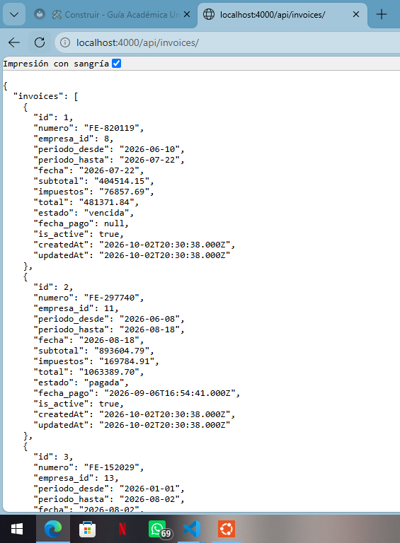

### Cierre del ISS

```bash
npm run dev
```

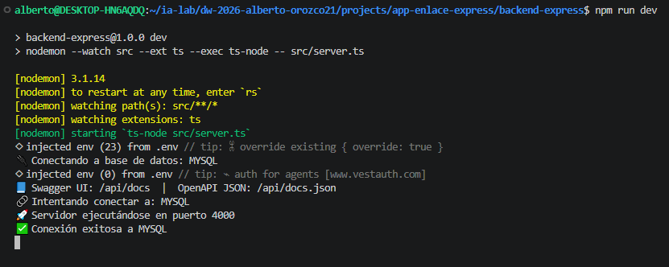

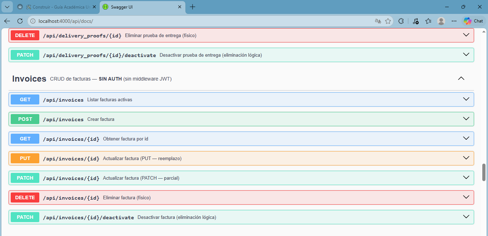

> El servidor debe arrancar sin error. Detenerlo con Ctrl+C antes de continuar.

---

## 18. ISS-17 — PARCHE — Relación Shipment ↔ Invoice

**Objetivo:** cerrar el último vínculo pendiente: un `Shipment` (Envío) queda asociado a la `Invoice` (Factura) del periodo cuando se factura. `factura_id` no pudo agregarse en ISS-12 (Shipment) porque `Invoice` todavía no existía; se agrega ahora por **PARCHE**.  
**Bloqueado por:** ISS-16.

### Criterios de aceptación (ISS-17)

- [X] **18.1** `shipment.model.ts` con `factura_id` (nullable, FK → `invoices`)
- [X] **18.2** `shipment.associations.ts` con `Shipment.belongsTo(Invoice)` / `Invoice.hasMany(Shipment)`
- [X] **18.3** `config/index.ts` importa la asociación
- [X] `npx tsc --noEmit` OK y `npm run dev` sincroniza sin error

---

## 18.1 PARCHE — `shipment.model.ts`

**PARCHE** — `src/features/business/shipment/shipment.model.ts` **ya existe** (ISS-12).

**Dentro de** la interfaz `ShipmentI`, **debajo de** `tarifa_id: number;`, **añadir**:

```ts
  factura_id?: number | null;
```

**Dentro de** la clase `Shipment`, **debajo de** `public tarifa_id!: number;`, **añadir**:

```ts
  public factura_id!: number | null;
```

**Dentro de** `Shipment.init({ ... })`, **debajo de** la columna `tarifa_id`, **añadir**:

```ts
  factura_id: {
    type: DataTypes.INTEGER,
    references: { model: "invoices", key: "id" },
    allowNull: true,
  },
```

También **añadir** `factura_id` al `create` / `updatePut` del controller (`shipment.controller.ts`), igual que `mensajero_id` / `ruta_id` (`body.factura_id ?? null`).

---

## 18.2 Asociación Shipment ↔ Invoice

**PARCHE** — `src/features/business/shipment/shipment.associations.ts` **ya existe** (ISS-12).

**Debajo de** el import de `Rate` y **debajo de** las líneas `Shipment.belongsTo(Rate, ...)` / `Rate.hasMany(Shipment, ...)`, **añadir**:

```ts
import { Invoice } from "../invoice/invoice.model";

Shipment.belongsTo(Invoice, { foreignKey: "factura_id", as: "factura" });
Invoice.hasMany(Shipment, { foreignKey: "factura_id", as: "envios" });
```

### Verificación

```bash
npx tsc --noEmit
curl -s -X PATCH http://localhost:4000/api/invoices/1 \
  -H 'Content-Type: application/json' \
  -d '{"factura_id":1}'
```

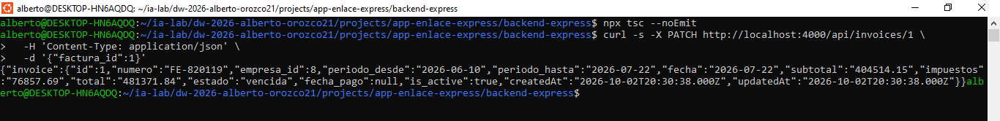

### Cierre del ISS
```bash
npm run dev
```

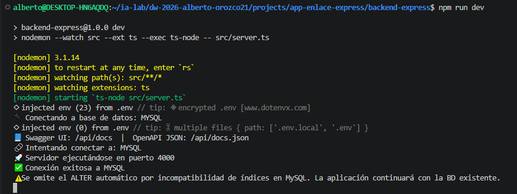

----------

## 19. Fase II: Auth con RBAC — ISS-18 — Base de seguridad compartida y modelos Auth

**Objetivo:** dejar listas las primitivas de seguridad (hash de contraseña, hashes de tokens opacos, firma y verificación de JWT, matcher de rutas) y las seis tablas del modelo RBAC con sus asociaciones, de modo que los ISS posteriores solo construyan capas sobre esta base.

**Bloqueado por:** Fase I cerrada (el App, Routes, SeedersRunner y Swagger ya existen y se extienden, no se reescriben).

Criterios de aceptación (ISS-18) — consolidados

- [X] **19.1** .env define JWT_SECRET, JWT_ACCESS_TTL y JWT_REFRESH_TTL_DAYS; jsonwebtoken y @types/jsonwebtoken instalados
- [X] **19.2** src/shared/auth/password.ts con hashPassword, comparePassword, sha256Hex, generateOpaqueToken
- [X] **19.3** src/shared/auth/jwt.ts firma y verifica con HS256, issuer, audience, expiresIn y jti
- [X] **19.4** src/shared/auth/resource-match.ts casa /api/shipments/42 con el patrón /api/shipments/:id
- [X] **19.5** src/shared/auth/auth-user.ts declara Request.auth y exporta requireAuthUser
- [X] **19.6** sendError centraliza error → HTTP; el controlador base auth lo reutiliza
- [X] **19.7** bearerSecurityScheme, unauthorizedResponse y forbiddenResponse exportados
- [X] **19.8** los 6 modelos (User, Role, Resource, RoleUser, ResourceRole, RefreshToken) con sus UK e  índices
- [X] **19.9** rbac.associations.ts declara el grafo completo (User↔Role, Role↔Resource, User→RefreshToken)
- [X] **19.10** config/index.ts y seeders/index.ts importan los modelos y las asociaciones, en ese orden
- [X] npx tsc --noEmit OK

## 19.1 Dependencias y variables de entorno

```bash
npm install bcryptjs
npm install jsonwebtoken@^9.0.3
npm install -D @types/jsonwebtoken@^9.0.10
```

Variables nuevas del .env (PARCHE: se añaden al final, no reemplazan las de Fase I):

```bash
cat >> .env << 'EOF'
# ─────────────────────────────────────────────────────────────
# Fase II — Seguridad (JWT + RBAC)
# ─────────────────────────────────────────────────────────────
# Secreto de firma del access token (HMAC SHA-256). Generar uno propio
# (p. ej. `openssl rand -base64 48`); no subirlo al repositorio.
JWT_SECRET=<pega-aqui-el-resultado-generado-por-openssl>
# Vida útil del access token en segundos (900 = 15 min).
JWT_ACCESS_TTL=900
# Vida útil del refresh token en días.
JWT_REFRESH_TTL_DAYS=7
EOF
```

> JWT_ACCESS_TTL se expresa en segundos y JWT_REFRESH_TTL_DAYS en días: son unidades distintas a propósito (el access token es de minutos; el refresh, de días). El service las convierte a milisegundos al persistir expires_at.

## 19.2 password.ts — hash de contraseña y hashes de tokens

Tres responsabilidades, todas de la capa shared (no son propias de un feature):

- hashPassword / comparePassword: bcrypt con 12 rondas (coste alto, deliberado).

- sha256Hex: para los refresh tokens, que no se guardan en claro sino como hash.

- generateOpaqueToken: crypto.randomBytes(32).toString("base64url") → token opaco (no JWT).

```bash
: > src/shared/auth/password.ts
cat >> src/shared/auth/password.ts << 'EOF'
import { hash, compare } from "bcryptjs";

/**
 * Derivación y verificación de contraseñas (bcrypt).
 *
 * Se centraliza aquí porque lo usan tres sitios distintos y **debe** usar los
 * mismos parámetros en los tres:
 *  - el hook `beforeCreate/beforeUpdate` del modelo `User` (hash al persistir);
 *  - el service de usuarios al cambiar la contraseña;
 *  - el login, que compara la credencial en memoria (nunca la devuelve).
 *
 * Coste 12 rondas: el valor de referencia del diseño de la base de datos
 * Es un compromiso entre coste de CPU del servidor y coste de fuerza bruta
 * para un atacante que obtuviera el hash.
 */
const SALT_ROUNDS = 12;

/** Devuelve el hash bcrypt de una contraseña en claro. */
export async function hashPassword(plain: string): Promise<string> {
  return hash(plain, SALT_ROUNDS);
}

/** `true` si la contraseña en claro corresponde al hash almacenado. */
export async function comparePassword(plain: string, passwordHash: string): Promise<boolean> {
  return compare(plain, passwordHash);
}

/**
 * Hash determinista (SHA-256, hex) para credenciales de **alta entropía**.
 *
 * Se usa con los refresh tokens, no con contraseñas: un token aleatorio de 64
 * bytes no es adivinable, así que no necesita un algoritmo lento; basta con
 * impedir que el valor en claro quede en la base de datos. Esto permite, además,
 * buscar por índice único (`token_hash`) en O(1).
 */
import { createHash, randomBytes } from "node:crypto";

export function sha256Hex(value: string): string {
  return createHash("sha256").update(value).digest("hex");
}

/** Genera un token opaco no adivinable (URL-safe, 64 bytes ≈ 86 caracteres). */
export function generateOpaqueToken(): string {
  return randomBytes(64).toString("base64url");
}
EOF
```

## 19.3 jwt.ts — firma y verificación del access token

¿Por qué JWT aquí y token opaco para el refresh? El access token viaja en cada petición y debe validarse sin tocar la BD (Stateless): JWT firmado. El refresh token, en cambio, debe poder revocarse; por eso es opaco y se persiste (hasheado) en refresh_tokens.

```bash
: > src/shared/auth/jwt.ts
cat >> src/shared/auth/jwt.ts << 'EOF'
import jwt, { JwtPayload } from "jsonwebtoken";
import { randomUUID } from "node:crypto";
import { AppError } from "../errors/app-error";

/**
 * Emisión y verificación del **access token** (JWT firmado, HS256).
 *
 * Referencias (fuentes oficiales):
 *  - RFC 7519 — JSON Web Token (`sub`, `iss`, `aud`, `exp`, `iat`, `jti`).
 *  - RFC 8725 §3.1 — *Perform Algorithm Verification*: el algoritmo se fija en el
 *    código (lista permitida), nunca se toma del encabezado `alg` del token.
 *  - RFC 8725 §3.8/§3.9 — validar `iss` (emisor) y `aud` (audiencia).
 *  - RFC 6750 — el token viaja en `Authorization: Bearer <token>`.
 *
 * El access token es **autocontenido y no se persiste**: se valida con la firma.
 * La base de datos solo interviene para revalidar que el usuario sigue activo
 * (ver `authenticate`), y para los refresh tokens.
 */

const ALGORITHM = "HS256";

/** Emisor/audiencia del sistema. Sirven para rechazar tokens de otro servicio. */
export const TOKEN_ISSUER = "enlace-express";
export const TOKEN_AUDIENCE = "enlace-express-api";

/** Vida útil del access token. Corta por diseño (Owasp/OAuth2: token de vida corta). */
export const ACCESS_TOKEN_TTL_SECONDS = Number(process.env.JWT_ACCESS_TTL ?? 900); // 15 min

export interface AccessTokenPayload extends JwtPayload {
  sub: string;
  username: string;
  jti: string;
}

function getSecret(): string {
  const secret = process.env.JWT_SECRET;
  if (!secret || secret.length < 32) {
    throw new AppError(
      500,
      "JWT_SECRET no configurado (mínimo 32 caracteres). Ver .env"
    );
  }
  return secret;
}

/** Firma un access token para un usuario. */
export function signAccessToken(user: { id: number; username: string }): {
  token: string;
  expiresIn: number;
} {
  const token = jwt.sign(
    { username: user.username },
    getSecret(),
    {
      algorithm: ALGORITHM,
      subject: String(user.id),
      issuer: TOKEN_ISSUER,
      audience: TOKEN_AUDIENCE,
      expiresIn: ACCESS_TOKEN_TTL_SECONDS,
      jwtid: randomUUID(),
    }
  );
  return { token, expiresIn: ACCESS_TOKEN_TTL_SECONDS };
}

/**
 * Verifica firma y *claims* y devuelve el payload.
 *
 * Se pasan las opciones explícitas (no se confía en el token): `algorithms`,
 * `issuer` y `audience`; y después se comprueban a mano `sub` y `jti`.
 *
 * Ojo: `jsonwebtoken` **no** tiene opción `require` (es de `jose`); pasarla no
 * valida nada. Por eso los claims obligatorios se verifican explícitamente.
 * Cualquier fallo se traduce a `AppError(401)` para que el middleware responda
 * **no autenticado**.
 */
export function verifyAccessToken(token: string): AccessTokenPayload {
  let payload: JwtPayload;
  try {
    payload = jwt.verify(token, getSecret(), {
      algorithms: [ALGORITHM],
      issuer: TOKEN_ISSUER,
      audience: TOKEN_AUDIENCE,
      // Tolerancia de reloj: evita 401 espurios entre máquinas desincronizadas.
      clockTolerance: 5,
    }) as JwtPayload;
  } catch {
    throw new AppError(401, "Invalid or expired access token");
  }

  // Los claims obligatorios se comprueban AQUÍ, no en `jwt.verify`.
  //
  // `jsonwebtoken` **no** admite la opción `require` (esa opción es de `jose`):
  // pasarla no valida nada. `iss`, `aud` y `exp` sí los exige `jwt.verify` con
  // las opciones de arriba; `sub` y `jti` hay que verificarle explícitamente.
  //
  //  - sin `sub` no hay identidad -> no se puede autenticar;
  //  - `sub` debe ser un entero positivo: un valor no numérico llegaría al
  //    repositorio como `NaN` y provocaría un 500 en vez de un 401;
  //  - sin `jti` se pierde la trazabilidad del token (RFC 8725).
  if (
    typeof payload.sub !== "string" ||
    !/^[1-9]\d*$/.test(payload.sub) ||
    typeof payload.jti !== "string" ||
    payload.jti.length === 0
  ) {
    throw new AppError(401, "Invalid or expired access token");
  }

  return payload as AccessTokenPayload;
}

/** Extrae el token de `Authorization: Bearer <token>` (RFC 6750). */
export function extractBearerToken(header: string | undefined): string | null {
  if (!header) return null;
  const [scheme, value] = header.split(" ");
  if (!scheme || !value || scheme.toLowerCase() !== "bearer") return null;
  return value;
}
EOF
```

> Los roles NO viajan en el token. Si viajaran, revocar un permiso no tendría efecto hasta que caducara el token. La autorización se resuelve en cada petición contra la matriz (ISS-13), lo que hace la revocación inmediata (RFC 6749 / OWASP).

## 19.4 resource-match.ts — casar la petición con el recurso

Un recurso es un par (method, path) con el path en patrón: /api/shipments/:id. El middleware authorize recibe la petición real (GET /api/shipments/42) y debe encontrar el recurso. Este módulo hace esa traducción:

- normalizePath: quita barra final, query string y colapsa 
barras repetidas.

- buildPathMatcher: convierte /api/shipments/:id en una expresión regular anclada.

- pathsMatch: comprueba un patrón contra un path real.

```bash
: > src/shared/auth/resource-match.ts
cat >> src/shared/auth/resource-match.ts << 'EOF'
/**
 * Coincidencia entre la ruta de una petición y un **recurso** almacenado.
 *
 * Un recurso se guarda como patrón (`method` + `path` con parámetros):
 *
 * ```text
 * GET  /api/shipments/:id
 * ```
 *
 * Y la petición llega con el valor concreto:
 *
 * ```text
 * GET  /api/shipments/42
 * ```
 *
 * Reglas de la comparación (deliberadamente estrictas):
 *  - El verbo HTTP debe coincidir exactamente.
 *  - Un segmento `:param` del patrón casa con **un** segmento cualquiera.
 *  - El resto de segmentos deben ser iguales carácter a carácter.
 *  - El número de segmentos debe coincidir (no hay comodines tipo `*`).
 *
 * Así, `/api/shipments/42` **no** casa con `/api/shipments` (evita que un permiso
 * de listado autorice una lectura concreta por error) y `/api/shipments/42/packages`
 * tampoco.
 */

/** Normaliza una ruta: sin cadena de consulta, sin barra final, sin duplicar `/`. */
export function normalizePath(path: string): string {
  const withoutQuery = path.split("?")[0].split("#")[0];
  const single = withoutQuery.replace(/\/{2,}/g, "/");
  const trimmed = single.replace(/\/+$/, "");
  return trimmed === "" ? "/" : trimmed;
}

/** `true` si `path` (concreto) casa con `pattern` (con `:param`). */
export function pathMatches(pattern: string, path: string): boolean {
  const patternParts = normalizePath(pattern).split("/");
  const pathParts = normalizePath(path).split("/");

  if (patternParts.length !== pathParts.length) return false;

  for (let i = 0; i < patternParts.length; i++) {
    const p = patternParts[i];
    if (p.startsWith(":")) continue; // parámetro: casa con cualquier segmento
    if (p !== pathParts[i]) return false;
  }
  return true;
}

/**
 * `true` si el conjunto de recursos concedidos cubre la operación solicitada.
 *
 * Es la decisión final del RBAC: se compara el par `(method, path)` de la
 * petición contra las concesiones del usuario. **Deny by default**: si ninguna
 * coincide, se devuelve `false`.
 *
 * La base de datos es la única fuente de verdad de la matriz de permisos; la
 * coincidencia por patrón se hace aquí.
 */
export function isOperationGranted(
  granted: ReadonlyArray<{ method: string; path: string }>,
  method: string,
  path: string
): boolean {
  const upper = method.toUpperCase();
  return granted.some(
    (resource) => resource.method.toUpperCase() === upper && pathMatches(resource.path, path)
  );
}
EOF
```

## 19.5 auth-user.ts — la identidad en Request

Extiende el tipo Request de Express con auth y expone requireAuthUser, que los controllers JWT usan para leer al usuario sin adivinar si el middleware corrió.

```bash
: > src/shared/auth/auth-user.ts
cat >> src/shared/auth/auth-user.ts << 'EOF'
import { Request } from "express";
import { AppError } from "../errors/app-error";

/**
 * Identidad resuelta que los middlewares de acceso dejan en la petición.
 *
 * Se guarda en `req.auth` (ver la ampliación de tipos más abajo) y la consumen:
 *  - los controllers que necesitan saber quién llama (`GET /api/sesion/perfil`);
 *  - `authorize`, para consultar los permisos efectivos del usuario.
 */
export interface AuthUser {
  id: number;
  username: string;
  email?: string;
  /** Token con el que se autenticó (útil para cerrar la sesión actual). */
  tokenId?: string;
}

/**
 * Devuelve la identidad de la petición o falla con 401.
 *
 * Lo usan los controllers de rutas con modalidad JWT (sin `authorize`): allí el
 * middleware ya garantizó que `req.auth` existe, pero el tipo es opcional, así
 * que esta función cierra el caso sin recurrir a `!`.
 */
export function requireAuthUser(req: Request): AuthUser {
  if (!req.auth) {
    throw new AppError(401, "Authentication required");
  }
  return req.auth;
}

declare global {
  // eslint-disable-next-line @typescript-eslint/no-namespace
  namespace Express {
    interface Request {
      /** Identidad resuelta por el middleware `authenticate`. `undefined` = OPEN. */
      auth?: AuthUser;
    }
  }
}

export {};
EOF
```

## 19.6 error-response.ts y controlador base compartido

El mapeo error → HTTP lo necesitan tanto los middlewares authenticate/authorize
como los controllers. Este backend todavía no tiene `BaseController`: el bloque
siguiente propone añadir uno compartido para los nuevos features auth y
reutilizarlo gradualmente, sin reemplazar los controllers business existentes.

```bash
: > src/shared/http/error-response.ts
cat >> src/shared/http/error-response.ts << 'EOF'
import { Response } from "express";
import { AppError } from "../errors/app-error";

/**
 * Traduce cualquier error a una respuesta HTTP. **Único punto** del proyecto
 * donde se decide el mapeo error -> status.
 *
 * Lo usan los dos sitios que pueden fallar antes de llegar a un controller:
 *  - `BaseController.handleError` (handlers de los controllers);
 *  - los middlewares de acceso (`authenticate` / `authorize`), que responden
 *    401/403 sin pasar por un controller.
 *
 * Regla: `AppError` -> su `statusCode`; cualquier otra cosa -> **500** (y el
 * detalle solo en el cuerpo, nunca el stack).
 */
export function sendError(res: Response, error: unknown): void {
  if (error instanceof AppError) {
    res.status(error.statusCode).json({ error: error.message });
    return;
  }
  res.status(500).json({ error: "Internal server error", detail: String(error) });
}
EOF
```

**PARCHE** en src/shared/http/base-controller.ts: handleError delega en sendError.

```bash
: > src/shared/http/base-controller.ts
cat >> src/shared/http/base-controller.ts << 'EOF'
import { Request, Response } from "express";
import { AppError } from "../errors/app-error";
import { sendError } from "./error-response";

/**
 * Base de los controllers HTTP.
 *
 * Aísla las tres responsabilidades puramente HTTP que, si no, se repetirían en
 * los 7 métodos de cada controller:
 *
 *  - `run`:            ejecuta el cuerpo del handler y traduce el error a HTTP.
 *  - `paramId`:        lee y valida el `:id` de la URL.
 *  - `handleError`:    mapea `AppError` a su status y lo demás a 500.
 *
 * La capa de negocio (service) no conoce `req`/`res`.
 */
export abstract class BaseController {
  /**
   * Ejecuta el cuerpo de un handler y centraliza el manejo de errores.
   *
   * Sin este helper, cada uno de los 35 métodos de los controllers tendría su
   * propio `try/catch`. Aquí el `catch` vive una sola vez.
   */
  protected async run(res: Response, work: () => Promise<void>): Promise<void> {
    try {
      await work();
    } catch (error) {
      this.handleError(res, error);
    }
  }

  /**
   * Lee el `:id` de la URL y lo valida como entero positivo.
   *
   * Sin la validación, `GET /api/companies/abc` llegaría al repository como
   * `Number("abc") === NaN` y devolvería un 404 engañoso en vez de un 400.
   */
  protected paramId(req: Request): number {
    const raw = req.params.id;
    const value = Array.isArray(raw) ? raw[0] : raw;

    if (!value || !/^\d+$/.test(value) || Number(value) < 1) {
      throw new AppError(400, "Invalid id: must be a positive integer");
    }
    return Number(value);
  }

  /**
   * Mapea errores: `AppError` -> su status; cualquier otro -> 500.
   *
   * La traducción vive en `sendError` porque los middlewares de acceso también
   * la necesitan: un único punto decide el mapeo error -> HTTP.
   */
  protected handleError(res: Response, error: unknown): void {
    sendError(res, error);
  }
}
EOF
```

## 19.7 swagger-security.ts — seguridad reutilizable para OpenAPI

|Export	| Para qué |
|-------|----------|
|bearerSecurityScheme |	Esquema bearerAuth (Authorization: Bearer <token>, RFC 6750) |
|unauthorizedResponse	| Respuesta 401 reutilizable ($ref) |
|forbiddenResponse |	Respuesta 403 reutilizable ($ref) |

```bash
: > src/shared/http/swagger-security.ts
cat >> src/shared/http/swagger-security.ts << 'EOF'
/**
 * Piezas reutilizables de OpenAPI para las **tres modalidades de acceso**.
 *
 * Centralizar aquí el esquema `bearerAuth` y las respuestas 401/403 evita repetir
 * la misma definición en los 7 módulos de Swagger (auth) y en los 5 de business.
 * Al cambiar una descripción, cambia en toda la documentación.
 *
 * Convención de uso en cada operación:
 *
 * | Modalidad | `security` |
 * |---|---|
 * | OPEN  | `openSecurity`  (arreglo vacío: no exige credencial) |
 * | JWT   | `bearerSecurity` |
 * | RBAC  | `bearerSecurity` + respuestas 401 **y** 403 |
 */

/** Esquema de seguridad (RFC 6750: `Authorization: Bearer <token>`). */
export const bearerSecurityScheme = {
  bearerAuth: {
    type: "http",
    scheme: "bearer",
    bearerFormat: "JWT",
    description:
      "Access token JWT obtenido en `POST /api/sesion/login`. Enviar como " +
      "`Authorization: Bearer <access_token>`. Vida útil corta (por defecto 15 min); " +
      "se renueva con `POST /api/sesion/refresh`.",
  },
};

/** `security` de un endpoint OPEN (no exige credencial). */
export const openSecurity: unknown[] = [];

/** `security` de un endpoint JWT o RBAC (exige access token válido). */
export const bearerSecurity = [{ bearerAuth: [] }];

/** Respuesta 401: no hay identidad válida (token ausente, inválido o usuario inactivo). */
export const unauthorizedResponse = {
  description:
    "401 No autenticado — falta el Bearer token, el token es inválido/expiró o el usuario está inactivo",
};

/** Respuesta 403: hay identidad, pero la matriz RBAC no concede `(method, path)`. */
export const forbiddenResponse = {
  description:
    "403 Prohibido — autenticado, pero sin concesión activa para esta operación (deny by default)",
};

/** Respuesta 400 ante un `:id` que no es entero positivo. */
export const invalidIdResponse = {
  description: "400 id inválido (debe ser un entero positivo)",
};

/** Respuesta 404 estándar. */
export const notFoundResponse = {
  description: "404 No encontrado",
};
EOF
```

## 19.8 Los seis modelos Sequelize

|Entidad | Tabla	Responsabilidad |
|--------|------------------------|
|User	| users	identidad del usuario (contraseña hasheada) |
|Role	| roles	agrupación de responsabilidades |
|RoleUser	| role_users	asignación User ↔ Role (N:M) |
|Resource	| resources	endpoint/acción protegible, (method, path) |
|ResourceRole	| resource_roles	el permiso: concesión Role ↔ Resource (N:M) |
|RefreshToken	| refresh_tokens	sesión renovable y revocable |

**User**

```bash
: > src/features/auth/users/user.model.ts
cat >> src/features/auth/users/user.model.ts << 'EOF'
import { DataTypes, Model } from "sequelize";
import { sequelize } from "../../../database/db";
import { hashPassword } from "../../../shared/auth/password";

/**
 * Modelo `User` (tabla `users`) — la identidad del sistema.
 *
 * Se diferencia de los modelos de business en un punto clave: **`password` nunca
 * se guarda en claro**. El hash se calcula en los hooks, de modo que ningún
 * service, repository o seeder puede olvidarse de hacerlo.
 *
 * El algoritmo y el coste viven en `shared/auth/password.ts` (única fuente), no
 * aquí: si mañana se sube el coste, se cambia en un solo sitio.
 */
export interface UserI {
  id?: number;
  username: string;
  email: string;
  password: string;
  avatar?: string | null;
  status: "active" | "inactive";
  createdAt?: Date;
  updatedAt?: Date;
}

export class User extends Model {
  public id!: number;
  public username!: string;
  public email!: string;
  public password!: string;
  public avatar!: string | null;
  public status!: "active" | "inactive";
  public readonly createdAt!: Date;
  public readonly updatedAt!: Date;
}

User.init(
  {
    username: {
      type: DataTypes.STRING(80),
      allowNull: false,
      // `unique` con nombre explícito -> la BD nombra la restricción `uq_users_username`
      // Conserva la convención de nombres acordada para las tablas auth.
      unique: "uq_users_username",
      validate: {
        notEmpty: { msg: "Username cannot be empty" },
        len: { args: [3, 80], msg: "Username must be between 3 and 80 characters" },
      },
    },
    email: {
      type: DataTypes.STRING(150),
      allowNull: false,
      unique: "uq_users_email",
      validate: {
        isEmail: { msg: "Email must be a valid email address" },
      },
    },
    password: {
      // 255: el hash bcrypt ocupa 60 y sobra margen para algoritmos futuros.
      type: DataTypes.STRING(255),
      allowNull: false,
      validate: {
        notEmpty: { msg: "Password cannot be empty" },
      },
    },
    avatar: {
      type: DataTypes.STRING(500),
      allowNull: true,
    },
    status: {
      type: DataTypes.ENUM("active", "inactive"),
      defaultValue: "inactive",
      allowNull: false,
    },
  },
  {
    sequelize,
    modelName: "User",
    tableName: "users",
    timestamps: true,
    hooks: {
      // Los tres hooks que crean/actualizan el hash. Cualquier ruta de escritura
      // (create, update, bulkCreate del seeder) pasa por aquí: no hay forma de
      // persistir una contraseña en claro.
      beforeCreate: async (user: User) => {
        if (user.password) {
          user.password = await hashPassword(user.password);
        }
      },
      beforeUpdate: async (user: User) => {
        if (user.changed("password") && user.password) {
          user.password = await hashPassword(user.password);
        }
      },
      beforeBulkCreate: async (users: User[]) => {
        for (const user of users) {
          if (user.password) {
            user.password = await hashPassword(user.password);
          }
        }
      },
      // Normalización: `username` y `email` siempre en minúsculas y sin espacios.
      // Se hace antes de validar para que el `isEmail`/`len` juzgue el valor final
      // y para que el login (que compara por igualdad) sea predecible.
      beforeValidate: (user: User) => {
        if (user.username) user.username = user.username.trim().toLowerCase();
        if (user.email) user.email = user.email.trim().toLowerCase();
      },
    },
  }
);
EOF
```

**Role**

```bash
: > src/features/auth/roles/role.model.ts
cat >> src/features/auth/roles/role.model.ts << 'EOF'
import { DataTypes, Model } from "sequelize";
import { sequelize } from "../../../database/db";

/**
 * Modelo `Role` (tabla `roles`) — agrupador lógico de responsabilidades.
 *
 * Nota de diseño: **el nombre del rol no autoriza nada**. La autorización se
 * decide por las concesiones (`resource_roles`) asociadas al rol. Un rol
 * `ADMIN` sin concesiones activas no habilita ninguna operación.
 */
export interface RoleI {
  id?: number;
  name: string;
  description?: string | null;
  status: "active" | "inactive";
  createdAt?: Date;
  updatedAt?: Date;
}

export class Role extends Model {
  public id!: number;
  public name!: string;
  public description!: string | null;
  public status!: "active" | "inactive";
  public readonly createdAt!: Date;
  public readonly updatedAt!: Date;
}

Role.init(
  {
    name: {
      type: DataTypes.STRING(80),
      allowNull: false,
      unique: "uq_roles_name",
      validate: {
        notEmpty: { msg: "Role name cannot be empty" },
      },
    },
    description: {
      type: DataTypes.STRING(255),
      allowNull: true,
    },
    status: {
      type: DataTypes.ENUM("active", "inactive"),
      defaultValue: "inactive",
      allowNull: false,
    },
  },
  {
    sequelize,
    modelName: "Role",
    tableName: "roles",
    timestamps: true,
    hooks: {
      // El nombre del rol se normaliza a MAYÚSCULAS (por ejemplo, ADMIN u OPERADOR):
      // es un identificador funcional, no una etiqueta libre.
      beforeValidate: (role: Role) => {
        if (role.name) role.name = role.name.trim().toUpperCase();
      },
    },
  }
);
EOF
```

**RoleUser**

```bash
: > src/features/auth/role-users/role-user.model.ts
cat >> src/features/auth/role-users/role-user.model.ts << 'EOF'
import { DataTypes, Model } from "sequelize";
import { sequelize } from "../../../database/db";

/**
 * Modelo `RoleUser` (tabla `role_users`) — asignación N:M `User` ↔ `Role`.
 *
 * Es el **primer eslabón** de la cadena de autorización. Un usuario sin filas
 * activas aquí no tiene ningún permiso granular, aunque tenga roles asignados
 * con estado `inactive`.
 *
 * La restricción única `(user_id, role_id)` impide duplicar la asignación:
 * revocar y volver a conceder se hace cambiando `status`, no insertando filas.
 */
export interface RoleUserI {
  id?: number;
  user_id: number;
  role_id: number;
  status: "active" | "inactive";
  createdAt?: Date;
  updatedAt?: Date;
}

export class RoleUser extends Model {
  public id!: number;
  public user_id!: number;
  public role_id!: number;
  public status!: "active" | "inactive";
  public readonly createdAt!: Date;
  public readonly updatedAt!: Date;
}

RoleUser.init(
  {
    user_id: {
      type: DataTypes.INTEGER,
      allowNull: false,
    },
    role_id: {
      type: DataTypes.INTEGER,
      allowNull: false,
    },
    status: {
      type: DataTypes.ENUM("active", "inactive"),
      defaultValue: "inactive",
      allowNull: false,
    },
  },
  {
    sequelize,
    modelName: "RoleUser",
    tableName: "role_users",
    timestamps: true,
    indexes: [
      { name: "uq_role_users_user_role", unique: true, fields: ["user_id", "role_id"] },
      { name: "ix_role_users_user_id", fields: ["user_id"] },
      { name: "ix_role_users_role_id", fields: ["role_id"] },
    ],
  }
);
EOF
```

**Resource**

```bash
: > src/features/auth/resources/resource.model.ts
cat >> src/features/auth/resources/resource.model.ts << 'EOF'
import { DataTypes, Model } from "sequelize";
import { sequelize } from "../../../database/db";
import { normalizePath } from "../../../shared/auth/resource-match";

/**
 * Modelo `Resource` (tabla `resources`) — un punto de acceso protegible.
 *
 * Un recurso **no** es una entidad de negocio: es el par `(method, path)`.
 * `GET /api/shipments` y `POST /api/shipments` son **dos recursos distintos**.
 *
 * Las rutas se guardan con el patrón, no con el valor concreto:
 * `/api/shipments/:id`. Así no se crea una fila por cada identificador y la
 * coincidencia se resuelve por patrón (`shared/auth/resource-match.ts`).
 */
export interface ResourceI {
  id?: number;
  method: string;
  path: string;
  description?: string | null;
  status: "active" | "inactive";
  createdAt?: Date;
  updatedAt?: Date;
}

export class Resource extends Model {
  public id!: number;
  public method!: string;
  public path!: string;
  public description!: string | null;
  public status!: "active" | "inactive";
  public readonly createdAt!: Date;
  public readonly updatedAt!: Date;
}

Resource.init(
  {
    method: {
      type: DataTypes.STRING(10),
      allowNull: false,
      validate: {
        isIn: {
          args: [["GET", "POST", "PUT", "PATCH", "DELETE"]],
          msg: "Method must be one of GET, POST, PUT, PATCH, DELETE",
        },
      },
    },
    path: {
      type: DataTypes.STRING(255),
      allowNull: false,
      validate: {
        notEmpty: { msg: "Path cannot be empty" },
      },
    },
    description: {
      type: DataTypes.STRING(255),
      allowNull: true,
    },
    status: {
      type: DataTypes.ENUM("active", "inactive"),
      defaultValue: "inactive",
      allowNull: false,
    },
  },
  {
    sequelize,
    modelName: "Resource",
    tableName: "resources",
    timestamps: true,
    // Clave única compuesta: el mismo verbo con distinta ruta (o al revés) son
    // recursos distintos, pero la tupla exacta no se repite.
    indexes: [
      {
        name: "uq_resources_method_path",
        unique: true,
        fields: ["method", "path"],
      },
    ],
    hooks: {
      // Normalización: verbo en mayúsculas y ruta sin barra final ni duplicados,
      // para que la comparación por patrón sea determinista.
      beforeValidate: (resource: Resource) => {
        if (resource.method) resource.method = resource.method.trim().toUpperCase();
        if (resource.path) resource.path = normalizePath(resource.path.trim());
      },
    },
  }
);
EOF

```

**ResourceRole**

```bash
: > src/features/auth/resource-roles/resource-role.model.ts
cat >> src/features/auth/resource-roles/resource-role.model.ts << 'EOF'
import { DataTypes, Model } from "sequelize";
import { sequelize } from "../../../database/db";

/**
 * Modelo `ResourceRole` (tabla `resource_roles`) — la **concesión** `Role` ↔ `Resource`.
 *
 * Esta tabla **es el permiso**. No existe una entidad `Permission`: el permiso
 * es la tupla `(rol, recurso)` materializada aquí.
 *
 * - Conceder acceso   -> insertar o reactivar una fila.
 * - Retirar acceso    -> `status = inactive`.
 * - Cambiar la matriz -> no requiere código ni despliegue.
 */
export interface ResourceRoleI {
  id?: number;
  role_id: number;
  resource_id: number;
  status: "active" | "inactive";
  createdAt?: Date;
  updatedAt?: Date;
}

export class ResourceRole extends Model {
  public id!: number;
  public role_id!: number;
  public resource_id!: number;
  public status!: "active" | "inactive";
  public readonly createdAt!: Date;
  public readonly updatedAt!: Date;
}

ResourceRole.init(
  {
    role_id: {
      type: DataTypes.INTEGER,
      allowNull: false,
    },
    resource_id: {
      type: DataTypes.INTEGER,
      allowNull: false,
    },
    status: {
      type: DataTypes.ENUM("active", "inactive"),
      defaultValue: "inactive",
      allowNull: false,
    },
  },
  {
    sequelize,
    modelName: "ResourceRole",
    tableName: "resource_roles",
    timestamps: true,
    indexes: [
      {
        name: "uq_resource_roles_role_resource",
        unique: true,
        fields: ["role_id", "resource_id"],
      },
      { name: "ix_resource_roles_role_id", fields: ["role_id"] },
      { name: "ix_resource_roles_resource_id", fields: ["resource_id"] },
    ],
  }
);
EOF
```

**RefreshToken**

```bash
: > src/features/auth/refresh-tokens/refresh-token.model.ts
cat >> src/features/auth/refresh-tokens/refresh-token.model.ts << 'EOF'
import { DataTypes, Model } from "sequelize";
import { sequelize } from "../../../database/db";

/**
 * Modelo `RefreshToken` (tabla `refresh_tokens`) — sesión renovable y revocable.
 *
 * Es el **único** artefacto de sesión que se persiste. El access token (JWT) es
 * autocontenido y no se guarda.
 *
 * Campos de seguridad:
 *  - `token_hash`: solo se almacena el SHA-256 del token opaco. Aunque se
 *    filtrara la tabla, no se puede reconstruir un token utilizable. Permite
 *    buscar por índice único en O(1).
 *  - `family_id`: agrupa todos los tokens derivados de un mismo login por
 *    rotación. Si un token ya rotado se reutiliza, se revoca **toda la familia**
 *    (detección de reutilización, Owasp/OAuth2).
 *  - `expires_at`: vigencia; un token vencido se trata como inválido.
 *  - `device_info`: soporte de auditoría y de listado de sesiones por dispositivo.
 *
 * Desviación deliberada: `status` predetermina **`active`**. Un token recién
 * emitido nace vigente por definición, a diferencia del resto de tablas.
 */
export interface RefreshTokenI {
  id?: number;
  user_id: number;
  token_hash: string;
  family_id: string;
  device_info?: string | null;
  expires_at: Date;
  status: "active" | "inactive";
  createdAt?: Date;
  updatedAt?: Date;
}

export class RefreshToken extends Model {
  public id!: number;
  public user_id!: number;
  public token_hash!: string;
  public family_id!: string;
  public device_info!: string | null;
  public expires_at!: Date;
  public status!: "active" | "inactive";
  public readonly createdAt!: Date;
  public readonly updatedAt!: Date;
}

RefreshToken.init(
  {
    user_id: {
      type: DataTypes.INTEGER,
      allowNull: false,
    },
    token_hash: {
      type: DataTypes.STRING(255),
      allowNull: false,
      unique: "uq_refresh_tokens_token_hash",
    },
    family_id: {
      type: DataTypes.STRING(100),
      allowNull: false,
    },
    device_info: {
      type: DataTypes.STRING(500),
      allowNull: true,
    },
    expires_at: {
      type: DataTypes.DATE,
      allowNull: false,
    },
    status: {
      type: DataTypes.ENUM("active", "inactive"),
      // Única tabla cuyo estado por defecto es `active` (ver doc del modelo).
      defaultValue: "active",
      allowNull: false,
    },
  },
  {
    sequelize,
    modelName: "RefreshToken",
    tableName: "refresh_tokens",
    timestamps: true,
    indexes: [
      { name: "ix_refresh_tokens_family_id", fields: ["family_id"] },
      { name: "ix_refresh_tokens_user_id", fields: ["user_id"] },
    ],
  }
);
EOF
```

## 19.9 rbac.associations.ts — el grafo en un solo lugar

Las asociaciones se declaran después de los modelos (referencian a los modelos, no al revés) y en un único archivo para que el grafo se lea entero:

```
User N:M Role           mediante RoleUser
User 1:N RefreshToken
Role N:M Resource       mediante ResourceRole
```

```bash
: > src/features/auth/rbac.associations.ts
cat >> src/features/auth/rbac.associations.ts << 'EOF'
import { User } from "./users/user.model";
import { Role } from "./roles/role.model";
import { Resource } from "./resources/resource.model";
import { RoleUser } from "./role-users/role-user.model";
import { ResourceRole } from "./resource-roles/resource-role.model";
import { RefreshToken } from "./refresh-tokens/refresh-token.model";

/**
 * Asociaciones de las seis entidades de seguridad.
 *
 * Se declaran en un solo archivo (y no dispersas por feature) porque la
 * autorización es una **cadena** que atraviesa cinco tablas; verla junta hace
 * evidente el camino que recorre la consulta de permisos:
 *
 * ```text
 * ResourceRole ──► Role ──► RoleUser ──► (filtro por user_id)
 *        │
 *        └────────► Resource  ──► (method, path)
 * ```
 *
 * Los alias (`as`) son los que usan los `include` de los repositories, así que
 * cambiar un alias aquí obliga a revisar las consultas RBAC.
 */

// --- La concesión conoce su rol y su recurso (los dos extremos del permiso) ---
ResourceRole.belongsTo(Role, { foreignKey: "role_id", as: "role" });
ResourceRole.belongsTo(Resource, { foreignKey: "resource_id", as: "resource" });
Role.hasMany(ResourceRole, { foreignKey: "role_id", as: "resource_roles" });
Resource.hasMany(ResourceRole, { foreignKey: "resource_id", as: "resource_roles" });

// --- La asignación conoce su usuario y su rol (primer eslabón de la cadena) ---
RoleUser.belongsTo(User, { foreignKey: "user_id", as: "user" });
RoleUser.belongsTo(Role, { foreignKey: "role_id", as: "role" });
User.hasMany(RoleUser, { foreignKey: "user_id", as: "role_users" });
Role.hasMany(RoleUser, { foreignKey: "role_id", as: "role_users" });

// --- Las sesiones pertenecen a un usuario ---
RefreshToken.belongsTo(User, { foreignKey: "user_id", as: "user" });
User.hasMany(RefreshToken, { foreignKey: "user_id", as: "refresh_tokens" });
EOF
```

## 19.10 Cableado de modelos en config y seeders

**PARCHE** en `src/config/index.ts` — los seis modelos, y después las asociaciones:

```typescript
import dotenv from "dotenv";
import express, { Application } from "express";
import morgan from "morgan";
var cors = require("cors");
import { sequelize, getDatabaseInfo, testConnection } from "../database/db";
import "../features/business/companies/companies.model";
import "../features/business/contact/contact.model";
import "../features/business/address/address.model";
import "../features/business/messenger/messenger.model";
import "../features/business/rate/rate.model";
import "../features/business/route/route.model";
import "../features/business/shipment/shipment.model";
import "../features/business/package/package.model";
import "../features/business/tracking-event/tracking-event.model";
import "../features/business/delivery-proof/delivery-proof.model";
import "../features/business/invoice/invoice.model";
import "../features/auth/users/user.model";
import "../features/auth/roles/role.model";
import "../features/auth/resources/resource.model";
import "../features/auth/role-users/role-user.model";
import "../features/auth/resource-roles/resource-role.model";
import "../features/auth/refresh-tokens/refresh-token.model";
import "../features/business/route/route.associations";
import "../features/business/shipment/shipment.associations";
import "../features/business/package/package.associations";
import "../features/business/tracking-event/tracking-event.associations";
import "../features/business/delivery-proof/delivery-proof.associations";
import "../features/business/invoice/invoice.associations";
import "../features/auth/rbac.associations";
import { Routes } from "../routes/index";
import "../features/business/contact/contact.associations";
import "../features/business/address/address.associations";
import "../features/business/companies/company.associations";
import { setupSwagger } from "../swagger/index";

dotenv.config();

export class App {
  public app: Application;
  public routePrv: Routes = new Routes();

  constructor(private port?: number | string) {
    this.app = express();
    this.settings();
    this.middlewares();
    this.routes();
    this.docs();
    this.dbConnection();
  }

  private settings(): void {
    this.app.set('port', this.port || process.env.PORT || 4000);
  }

  private middlewares(): void {
    this.app.use(morgan('dev'));
    this.app.use(cors());
    this.app.use(express.json());
    this.app.use(express.urlencoded({ extended: false }));
  }

  private routes(): void {
    this.routePrv.companiesRoutes.routes(this.app);
    this.routePrv.contactRoutes.routes(this.app);
    this.routePrv.addressRoutes.routes(this.app);
    this.routePrv.messengerRoutes.routes(this.app);
    this.routePrv.rateRoutes.routes(this.app);
    this.routePrv.routeRoutes.routes(this.app);
    this.routePrv.shipmentRoutes.routes(this.app);
    this.routePrv.packageRoutes.routes(this.app);
    this.routePrv.trackingEventRoutes.routes(this.app);
    this.routePrv.deliveryProofRoutes.routes(this.app);
    this.routePrv.invoiceRoutes.routes(this.app);
  }

  private docs(): void {
    setupSwagger(this.app);
  }

  private async dbConnection(): Promise<void> {
    try {
      const dbInfo = getDatabaseInfo();
      console.log(`🔗 Intentando conectar a: ${dbInfo.engine.toUpperCase()}`);

      const isConnected = await testConnection();
      if (!isConnected) {
        throw new Error(`No se pudo conectar a la base de datos ${dbInfo.engine.toUpperCase()}`);
      }

      // Por defecto evitamos `alter: true` porque MySQL falla con índices duplicados/64 keys
      // cuando la BD ya existe y se intenta re-alterar el esquema. `sync` aún crea tablas
      // faltantes sin tocar las existentes.
      const syncOptions = {
        force: false,
        alter: process.env.DB_SYNC_ALTER === "true",
      };

      try {
        await sequelize.sync(syncOptions);
        console.log(`📦 Base de datos sincronizada exitosamente`);
      } catch (error: any) {
        const errNo = error?.original?.errno ?? error?.errno ?? error?.parent?.errno;
        if (errNo === 1069 || error?.code === "ER_TOO_MANY_KEYS") {
          console.warn(
            "⚠️ Se omite el ALTER automático por incompatibilidad de índices en MySQL. La aplicación continuará con la BD existente."
          );
        } else {
          throw error;
        }
      }
    } catch (error) {
      console.error("❌ Error al conectar con la base de datos:", error);
      process.exit(1);
    }
  }

  async listen() {
    await this.app.listen(this.app.get('port'));
    console.log(`🚀 Servidor ejecutándose en puerto ${this.app.get('port')}`);
  }
}
```

**PARCHE** en `src/database/seeders/index.ts` — mismo bloque de imports (los seeders de auth se añaden en sus ISS). El orden importa: `Sequelize` solo conoce las asociaciones que se han declarado.

```typescript
import dotenv from "dotenv";
import { sequelize, testConnection } from "../db";
import "../../features/business/companies/companies.model";
import "../../features/auth/users/user.model";
import "../../features/auth/roles/role.model";
import "../../features/auth/resources/resource.model";
import "../../features/auth/role-users/role-user.model";
import "../../features/auth/resource-roles/resource-role.model";
import "../../features/auth/refresh-tokens/refresh-token.model";
import "../../features/auth/rbac.associations";
import { seedCompanies } from "../../features/business/companies/companies.seeder";
import { seedContacts } from "../../features/business/contact/contact.seeder";
import { seedAddresses } from "../../features/business/address/address.seeder";
import { seedMessengers } from "../../features/business/messenger/messenger.seeder";
import { seedRates } from "../../features/business/rate/rate.seeder";
import { seedRoutes } from "../../features/business/route/route.seeder";
import { seedShipments } from "../../features/business/shipment/shipment.seeder";
import { seedPackages } from "../../features/business/package/package.seeder";
import { seedTrackingEvents } from "../../features/business/tracking-event/tracking-event.seeder";
import { seedDeliveryProofs } from "../../features/business/delivery-proof/delivery-proof.seeder";
import { seedInvoices } from "../../features/business/invoice/invoice.seeder";
import { resolveSeedCounts } from "./counts";

dotenv.config();

/**
 * SeedersRunner — ejecuta TODOS los seeders de features, en orden de dependencias
 * (padres antes que hijos): empresa -> contacto -> direccion -> mensajero -> tarifa
 * -> ruta -> envio -> paquete -> evento_tracking -> prueba_entrega -> factura.
 *
 * Uso:
 *   npm run db:seed
 *   npm run db:seed -- --empresas=20
 *   SEED_EMPRESAS=5 npm run db:seed
 */
export async function runAllSeeders(): Promise<void> {
  const counts = resolveSeedCounts();
  console.log("🌱 Iniciando SeedersRunner...");
  console.log("📊 Conteos:", counts);

  const ok = await testConnection();
  if (!ok) {
    throw new Error("No hay conexión a la base de datos");
  }

  try {
    await sequelize.sync({ force: false, alter: process.env.DB_SYNC_ALTER === "true" });
  } catch (error: any) {
    const errNo = error?.original?.errno ?? error?.errno ?? error?.parent?.errno;
    if (errNo === 1069 || error?.code === "ER_TOO_MANY_KEYS") {
      console.warn(
        "⚠️ Se omite el ALTER automático al sembrar datos por exceso de índices en MySQL; se continúa con los seeders."
      );
    } else {
      throw error;
    }
  }

  // Orden: business (padres → hijos)
  await seedCompanies(counts.companies);
  await seedContacts(counts.contacts);
  await seedAddresses(counts.addresses);
  await seedMessengers(counts.messengers);
  await seedRates(counts.rates);
  await seedRoutes(counts.routes);
  await seedShipments(counts.shipments);
  await seedPackages(counts.packages);
  await seedTrackingEvents(counts.tracking_events);
  await seedDeliveryProofs(counts.delivery_proofs);
  await seedInvoices(counts.invoices);

  console.log("🌱 SeedersRunner finalizado");
}

if (require.main === module) {
  runAllSeeders()
    .then(async () => {
      await sequelize.close();
      process.exit(0);
    })
    .catch(async (err) => {
      console.error("❌ Error en seeders:", err);
      await sequelize.close();
      process.exit(1);
    });
}
```

Verifica el cambio usando los scripts reales del backend:

```bash
npm run build
npm run db:seed
npm run dev 
```

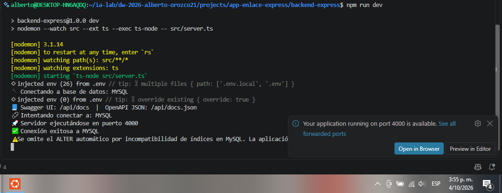

> Las 6 tablas existen.

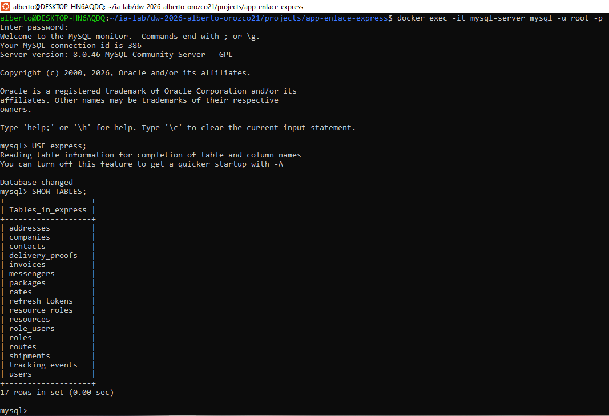

----

## 20. ISS-19 — Feature Users (identidad y contraseña)

**Objetivo:** construir el CRUD de identidades como un feature más (mismas 4 capas y mismo contrato DTO que los de Fase I), con dos diferencias clave: la contraseña nunca entra ni sale en claro, y el service expone una consulta de permisos efectivos que recorre el grafo RBAC.

**Bloqueado por:** ISS-19 (modelo User y rbac.associations.ts).

Criterios de aceptación (ISS-19) — consolidados

- [X] 20.1 carpeta dto/ con create-user.dto.ts, update-user.dto.ts, patch-user.dto.ts, change-password.dto.ts, user-response.dto.ts e index.ts
- [X] 20.2 users.repository.ts accede a Sequelize con el modelo User; incluye findByUsernameOrEmail
- [X] 20.3 users.service.ts: hashea al crear/actualizar, valida unicidad de username/email (409) y ofrece getEffectivePermissions
- [X] 20.4 users.controller.ts: usa this.run(res, …) y this.paramId(req); nunca devuelve el hash
- [X] 20.5 users.routes.ts protege todas las operaciones con authenticate, authorize
- [X] 20.6 users.seeder.ts crea admin y operador de forma idempotente
- [X] 20.7 users.swagger.ts documenta los 9 endpoints con security: bearerAuth
- [X] 20.8 archivos .http de lectura y escritura
- [X] npx tsc --noEmit OK

## 20.1 DTOs del feature

Contrato de la API (el repository no los conoce):

```bash
: > src/features/auth/users/dto/create-user.dto.ts
cat >> src/features/auth/users/dto/create-user.dto.ts << 'EOF'
/**
 * Datos de entrada de `POST /api/usuarios`.
 *
 * `status` es opcional y por defecto `active` (como en business). Después de
 * crear el usuario, el estado solo cambia con el borrado lógico.
 */
export interface CreateUserDto {
  username: string;
  email: string;
  password: string;
  avatar?: string | null;
  status?: "active" | "inactive";
}
EOF
```

```bash
: > src/features/auth/users/dto/update-user.dto.ts
cat >> src/features/auth/users/dto/update-user.dto.ts << 'EOF'
/**
 * Datos de entrada de `PUT /api/usuarios/:id` (reemplazo completo).
 *
 * Ni `password` ni `status` están aquí, a propósito:
 *  - la contraseña tiene su propia operación (`PATCH /api/usuarios/:id/password`),
 *    porque cambiar una credencial exige verificar la anterior;
 *  - el estado solo cambia con el borrado lógico (`/deactivate`).
 */
export interface UpdateUserDto {
  username: string;
  email: string;
  avatar?: string | null;
}
EOF
```

```bash
: > src/features/auth/users/dto/patch-user.dto.ts
cat >> src/features/auth/users/dto/patch-user.dto.ts << 'EOF'
import { UpdateUserDto } from "./update-user.dto";

/** Datos de entrada de `PATCH /api/usuarios/:id` (actualización parcial). */
export type PatchUserDto = Partial<UpdateUserDto>;
EOF
```

```bash
: > src/features/auth/users/dto/change-password.dto.ts
cat >> src/features/auth/users/dto/change-password.dto.ts << 'EOF'
/**
 * Datos de entrada de `PATCH /api/usuarios/:id/password`.
 *
 * Exige la contraseña **actual** además de la nueva. Es una defensa en
 * profundidad: aunque el RBAC autorice la operación, nadie puede cambiar la
 * credencial de otro usuario sin conocerla (evita que un administrador
 * comprometido rote contraseñas ajenas sin más).
 */
export interface ChangePasswordDto {
  current_password: string;
  new_password: string;
}
EOF
```

```bash
: > src/features/auth/users/dto/user-response.dto.ts
cat >> src/features/auth/users/dto/user-response.dto.ts << 'EOF'
import { User, UserI } from "../user.model";

/**
 * Respuesta HTTP de un usuario.
 *
 * Regla del DTO: `password` **nunca** sale de la API. El repositorio ni siquiera
 * lo proyecta en las lecturas (`attributes: { exclude: ["password"] }`), pero el
 * mapper lo elimina igualmente por si el modelo se cargó con el hash (p. ej. al
 * cambiar la contraseña). Doble red: el tipo no lo permite y el mapper lo borra.
 */
export type UserResponseDto = Omit<UserI, "password">;

/** Mapper modelo -> DTO de respuesta (objeto plano; elimina `password`). */
export function toUserResponse(user: User): UserResponseDto {
  const { password, ...safe } = user.toJSON() as UserI & { password?: string };
  return safe;
}
EOF
```

```bash
: > src/features/auth/users/dto/index.ts
cat >> src/features/auth/users/dto/index.ts << 'EOF'
export * from "./create-user.dto";
export * from "./update-user.dto";
export * from "./patch-user.dto";
export * from "./change-password.dto";
export * from "./user-response.dto";
EOF
```

> **Regla transversal que se mantiene:** status no viaja en UpdateUserDto ni en PatchUserDto. Solo cambia al crear o con el borrado lógico /deactivate.

> change-password.dto.ts es específico del cambio de contraseña (no es un patch del recurso): exige la contraseña actual y la nueva, y permite revoke_sessions para cerrar las sesiones abiertas del usuario.

## 20.2 Repository

Única capa que usa Sequelize. Además del CRUD genérico, aporta findByUsernameOrEmail, que necesita el login (ISS-15): acepta usuario o correo en un solo campo.

```bash
: > src/features/auth/users/users.repository.ts
cat >> src/features/auth/users/users.repository.ts << 'EOF'
import { CreationAttributes, Op, Transaction } from "sequelize";
import { User } from "./user.model";

/**
 * Capa Repository del feature Users.
 *
 * Única que habla con Sequelize (el modelo `User`). No contiene reglas de
 * negocio ni conoce `req`/`res`.
 *
 * Detalle de seguridad: las lecturas **normales** excluyen `password` en la
 * proyección SQL. Solo dos consultas lo incluyen, ambas con nombre explícito en
 * su firma (`...WithPassword`), de modo que un `findById` cualquiera jamás puede
 * devolver el hash por descuido.
 */
export class UsersRepository {
  /** Proyección sin credencial: la que usan todas las lecturas de API. */
  private static readonly WITHOUT_PASSWORD = { exclude: ["password"] };

  /** Todos los usuarios activos (sin `password`). */
  public async findAllActive(): Promise<User[]> {
    return User.findAll({
      where: { status: "active" },
      attributes: UsersRepository.WITHOUT_PASSWORD,
    });
  }

  /** Un usuario por PK (o `null`), sin `password`. Acepta transacción. */
  public async findById(id: number, transaction?: Transaction): Promise<User | null> {
    return User.findByPk(id, {
      attributes: UsersRepository.WITHOUT_PASSWORD,
      transaction,
    });
  }

  /** Un usuario por PK **con** su hash. Uso exclusivo: cambio de contraseña. */
  public async findByIdWithPassword(id: number): Promise<User | null> {
    return User.findByPk(id);
  }

  /**
   * Un usuario por `username` **o** `email`, con su hash.
   *
   * Uso exclusivo: validación de credenciales en el login (única operación que
   * lee la credencial). Normaliza el identificador a minúsculas para casar con
   * el valor almacenado.
   */
  public async findByIdentifierWithPassword(identifier: string): Promise<User | null> {
    const value = identifier.trim().toLowerCase();
    return User.findOne({
      where: { [Op.or]: [{ username: value }, { email: value }] },
    });
  }

  /** Busca por `username` o `email` (sin `password`) para detectar duplicados. */
  public async findConflicts(username: string, email: string): Promise<User[]> {
    return User.findAll({
      where: {
        [Op.or]: [
          { username: username.trim().toLowerCase() },
          { email: email.trim().toLowerCase() },
        ],
      },
      attributes: ["id", "username", "email"],
    });
  }

  /** Inserta un usuario (el hook del modelo hashea `password`). */
  public async create(data: CreationAttributes<User>): Promise<User> {
    return User.create(data);
  }

  /** Persiste cambios sobre una instancia existente. */
  public async update(user: User, data: Partial<User>): Promise<User> {
    return user.update(data);
  }

  /** Elimina físicamente una instancia. */
  public async delete(user: User): Promise<void> {
    await user.destroy();
  }
}
EOF
```

## 20.3 Service

Aquí viven las reglas de User:

- Nunca se guarda la contraseña en claro (hashPassword, bcrypt 12).

- username y email son únicos: si ya existen, AppError(409, …).

- Al actualizar, si llega password se vuelve a hashear; si no llega, se conserva.

- El borrado lógico (deactivate) no borra el hash: el registro queda inactivo e invisible.

- getEffectivePermissions recorre el grafo y devuelve la lista de (method, path) vigentes.

```bash
: > src/features/auth/users/users.service.ts
cat >> src/features/auth/users/users.service.ts << 'EOF'
import {
  ChangePasswordDto,
  CreateUserDto,
  PatchUserDto,
  UpdateUserDto,
  UserResponseDto,
  toUserResponse,
} from "./dto";
import { UsersRepository } from "./users.repository";
import { User } from "./user.model";
import { AppError } from "../../../shared/errors/app-error";
import { comparePassword } from "../../../shared/auth/password";
import { ResourceRolesService } from "../resource-roles/resource-roles.service";
import { EffectivePermissionDto } from "../resource-roles/dto";

/**
 * Capa Service del feature Users.
 *
 * Reglas de negocio: unicidad de `username`/`email`, default de `status`,
 * política de borrado lógico, cambio de credencial y consulta de permisos
 * efectivos (que delega en el feature `resource-roles`: el permiso es una
 * concesión rol-recurso, no un atributo del usuario).
 *
 * No conoce `req`/`res` ni escribe Sequelize directamente.
 */
export class UsersService {
  public constructor(
    private readonly repository: UsersRepository = new UsersRepository(),
    private readonly resourceRolesService: ResourceRolesService = new ResourceRolesService()
  ) {}

  // ================== READ ==================
  public async getAll(): Promise<UserResponseDto[]> {
    const users = await this.repository.findAllActive();
    return users.map((user) => toUserResponse(user));
  }

  public async getOne(id: number): Promise<UserResponseDto> {
    return toUserResponse(await this.findOrFail(id));
  }

  /** Permisos efectivos del usuario (cadena RBAC completa). 404 si no existe. */
  public async getEffectivePermissions(id: number): Promise<EffectivePermissionDto[]> {
    await this.findOrFail(id);
    return this.resourceRolesService.findEffectiveForUser(id);
  }

  // ================== CREATE ==================
  public async create(body: CreateUserDto): Promise<UserResponseDto> {
    await this.assertUnique(body.username, body.email);

    // Copia campo a campo: solo lo que declara el DTO llega al modelo
    // (evita *mass assignment*, p. ej. inyectar un `id` o un `status` raro).
    const user = await this.repository.create({
      username: body.username,
      email: body.email,
      password: body.password,
      avatar: body.avatar ?? null,
      status: body.status ?? "active",
    });
    return toUserResponse(user);
  }

  // ================== UPDATE ==================
  public async updatePut(id: number, body: UpdateUserDto): Promise<UserResponseDto> {
    const user = await this.findOrFail(id);
    await this.assertUnique(body.username, body.email, id);

    await this.repository.update(user, {
      username: body.username,
      email: body.email,
      avatar: body.avatar ?? null,
    });
    return toUserResponse(user);
  }

  public async updatePatch(id: number, body: PatchUserDto): Promise<UserResponseDto> {
    const user = await this.findOrFail(id);

    const username = body.username ?? user.username;
    const email = body.email ?? user.email;
    await this.assertUnique(username, email, id);

    await this.repository.update(user, body);
    return toUserResponse(user);
  }

  /**
   * Cambia la contraseña de un usuario.
   *
   * Verifica la credencial actual antes de aceptar la nueva. El hash lo vuelve a
   * calcular el hook `beforeUpdate` del modelo al detectar el campo cambiado.
   */
  public async changePassword(id: number, body: ChangePasswordDto): Promise<void> {
    if (!body.current_password || !body.new_password) {
      throw new AppError(400, "current_password and new_password are required");
    }

    const user = await this.repository.findByIdWithPassword(id);
    if (!user || user.status !== "active") {
      throw new AppError(404, "User not found");
    }

    const matches = await comparePassword(body.current_password, user.password);
    if (!matches) {
      throw new AppError(400, "Current password is incorrect");
    }

    await this.repository.update(user, { password: body.new_password });
  }

  // ================== DELETE ==================
  /** Eliminación física. */
  public async deletePhysical(id: number): Promise<void> {
    const user = await this.findOrFail(id, false);
    await this.repository.delete(user);
  }

  /** Eliminación lógica -> `status = inactive`. */
  public async deleteLogical(id: number): Promise<UserResponseDto> {
    const user = await this.findOrFail(id);
    await this.repository.update(user, { status: "inactive" });
    return toUserResponse(user);
  }

  // ================== HELPERS ==================
  /** Busca por PK y falla con 404. `onlyActive` aplica la política de borrado lógico. */
  private async findOrFail(id: number, onlyActive = true): Promise<User> {
    const user = await this.repository.findById(id);
    if (!user || (onlyActive && user.status !== "active")) {
      throw new AppError(404, "User not found");
    }
    return user;
  }

  /**
   * Comprueba que `username` y `email` no estén tomados por **otro** usuario.
   *
   * `excludeId` permite excluir al propio usuario en las actualizaciones. Se
   * hace antes de escribir para responder 409 con un mensaje útil en lugar de
   * dejar que la restricción única de la BD reviente como un 500.
   */
  private async assertUnique(
    username: string,
    email: string,
    excludeId?: number
  ): Promise<void> {
    const conflicts = await this.repository.findConflicts(username, email);
    const taken = conflicts.find((candidate) => candidate.id !== excludeId);

    if (!taken) return;
    if (taken.username === username.trim().toLowerCase()) {
      throw new AppError(409, "Username already in use");
    }
    throw new AppError(409, "Email already in use");
  }
}
EOF
```

> User → (role_users.status = 'active') → Role → (resource_roles.status = 'active') → Resource con Role.status = 'active' y Resource.status = 'active'

## 20.4 Controller

HTTP puro: this.run(res, …), this.paramId(req) y findOrFail en el service. Expone dos operaciones que no son CRUD: cambio de contraseña y permisos efectivos.

```bash
: > src/features/auth/users/users.controller.ts
cat >> src/features/auth/users/users.controller.ts << 'EOF'
import { Request, Response } from "express";
import { BaseController } from "../../../shared/http/base-controller";
import {
  ChangePasswordDto,
  CreateUserDto,
  PatchUserDto,
  UpdateUserDto,
} from "./dto";
import { UsersService } from "./users.service";

/**
 * Capa Controller del feature Users.
 * Solo HTTP: lee `req`, llama al service y arma la respuesta.
 * El manejo de errores se delega en `run()` (ver `BaseController`).
 */
export class UsersController extends BaseController {
  public constructor(
    private readonly service: UsersService = new UsersService()
  ) {
    super();
  }

  // ================== READ ==================
  public async getAll(_req: Request, res: Response): Promise<void> {
    await this.run(res, async () => {
      const users = await this.service.getAll();
      res.status(200).json({ users });
    });
  }

  public async getOne(req: Request, res: Response): Promise<void> {
    await this.run(res, async () => {
      const user = await this.service.getOne(this.paramId(req));
      res.status(200).json({ user });
    });
  }

  // ================== CREATE ==================
  public async create(req: Request, res: Response): Promise<void> {
    await this.run(res, async () => {
      const user = await this.service.create(req.body as CreateUserDto);
      res.status(201).json({ user });
    });
  }

  // ================== UPDATE ==================
  public async updatePut(req: Request, res: Response): Promise<void> {
    await this.run(res, async () => {
      const user = await this.service.updatePut(
        this.paramId(req),
        req.body as UpdateUserDto
      );
      res.status(200).json({ user });
    });
  }

  public async updatePatch(req: Request, res: Response): Promise<void> {
    await this.run(res, async () => {
      const user = await this.service.updatePatch(
        this.paramId(req),
        req.body as PatchUserDto
      );
      res.status(200).json({ user });
    });
  }

  // ================== DELETE ==================
  /** Eliminación física. */
  public async deletePhysical(req: Request, res: Response): Promise<void> {
    await this.run(res, async () => {
      const id = this.paramId(req);
      await this.service.deletePhysical(id);
      res.status(200).json({ message: "User permanently deleted", id });
    });
  }

  /** Eliminación lógica -> `status = inactive`. */
  public async deleteLogical(req: Request, res: Response): Promise<void> {
    await this.run(res, async () => {
      const user = await this.service.deleteLogical(this.paramId(req));
      res.status(200).json({ message: "User deactivated (logical delete)", user });
    });
  }

  // ================== IDENTIDAD Y PERMISOS ==================
  /** Cambio de credencial (exige la contraseña actual). */
  public async changePassword(req: Request, res: Response): Promise<void> {
    await this.run(res, async () => {
      const id = this.paramId(req);
      await this.service.changePassword(id, req.body as ChangePasswordDto);
      res.status(200).json({ message: "Password updated", id });
    });
  }

  /** Permisos efectivos del usuario: recursos concedidos por sus roles activos. */
  public async getEffectivePermissions(req: Request, res: Response): Promise<void> {
    await this.run(res, async () => {
      const permissions = await this.service.getEffectivePermissions(this.paramId(req));
      res.status(200).json({ permissions });
    });
  }
}
EOF
```

## 20.5 Rutas (modalidad JWT + RBAC)

Todos los endpoints de administración de identidades están ellos mismos protegidos por la matriz: no basta con estar autenticado, hay que tener la concesión concreta (GET /api/usuarios, POST /api/usuarios, …).

```bash
: > src/features/auth/users/users.routes.ts
cat >> src/features/auth/users/users.routes.ts << 'EOF'
import { Application } from "express";
import { UsersController } from "./users.controller";
import { authenticate, authorize } from "../access";

/**
 * Rutas del feature Users — **modalidad 3 (JWT + RBAC)** en todas las operaciones.
 *
 * La administración de identidades está ella misma protegida por la matriz de
 * permisos: no basta con estar autenticado, hay que tener la concesión concreta
 * (`GET /api/usuarios`, `POST /api/usuarios`, ...). El catálogo de recursos ya
 * incluye las 9 operaciones de este feature.
 */
export class UsersRoutes {
  public usersController: UsersController = new UsersController();

  public routes(app: Application): void {
    // getAll
    app
      .route("/api/usuarios")
      .get(authenticate, authorize, this.usersController.getAll.bind(this.usersController));

    // getOne
    app
      .route("/api/usuarios/:id")
      .get(authenticate, authorize, this.usersController.getOne.bind(this.usersController));

    // create
    app
      .route("/api/usuarios")
      .post(authenticate, authorize, this.usersController.create.bind(this.usersController));

    // update (PUT / PATCH)
    app
      .route("/api/usuarios/:id")
      .put(authenticate, authorize, this.usersController.updatePut.bind(this.usersController))
      .patch(authenticate, authorize, this.usersController.updatePatch.bind(this.usersController));

    // delete físico
    app
      .route("/api/usuarios/:id")
      .delete(
        authenticate,
        authorize,
        this.usersController.deletePhysical.bind(this.usersController)
      );

    // delete lógico
    app
      .route("/api/usuarios/:id/deactivate")
      .patch(
        authenticate,
        authorize,
        this.usersController.deleteLogical.bind(this.usersController)
      );

    // cambio de contraseña
    app
      .route("/api/usuarios/:id/password")
      .patch(
        authenticate,
        authorize,
        this.usersController.changePassword.bind(this.usersController)
      );

    // permisos efectivos del usuario
    app
      .route("/api/usuarios/:id/permisos")
      .get(
        authenticate,
        authorize,
        this.usersController.getEffectivePermissions.bind(this.usersController)
      );
  }
}
EOF
```

## 20.6 Seeder de usuarios canónicos

Dos usuarios de laboratorio, idempotentes (findOrCreate por username), con contraseña hasheada. Son la puerta de entrada para probar las tres modalidades.

```bash
: > src/features/auth/users/users.seeder.ts
cat >> src/features/auth/users/users.seeder.ts << 'EOF'
import { User } from "./user.model";
import { faker } from "@faker-js/faker";

/**
 * Seeder de usuarios (`users`).
 *
 * Crea **dos usuarios canónicos** que sostienen toda la demostración de RBAC:
 *
 * | username | password    | rol    | permisos |
 * |----------|-------------|--------|----------|
 * | `admin`  | `Admin123!` | ADMIN  | todos los recursos |
 * | `operador` | `Operador123!`| OPERADOR | 0 hasta aprobar la matriz |
 *
 * Si `count > 2`, se añaden usuarios aleatorios (sin rol asignado): sirven para
 * comprobar que **estar autenticado no basta**: recibirán 403 en todo.
 *
 * Las contraseñas se guardan como **hash**: las hashea el hook `beforeCreate` del
 * modelo. Idempotente por `username`.
 */
export const SEED_USERS = [
  { username: "admin", email: "admin@enlace-express.local", password: "Admin123!" },
  { username: "operador", email: "operador@enlace-express.local", password: "Operador123!" },
] as const;

export async function seedUsers(count: number): Promise<number> {
  if (count <= 0) {
    console.log("⏭️  users: count=0, se omite");
    return 0;
  }

  let created = 0;

  for (const item of SEED_USERS) {
    const [user, wasCreated] = await User.findOrCreate({
      where: { username: item.username },
      defaults: {
        username: item.username,
        email: item.email,
        password: item.password,
        avatar: null,
        status: "active",
      },
    });
    if (wasCreated) {
      created++;
      continue;
    }
    // Reconciliación: igual que los seeders de roles y recursos, el de usuarios
    // **reactiva** los canónicos si quedaron inactivos. Así `npm run db:seed`
    // devuelve siempre el laboratorio a un estado operable.
    if (user.status !== "active") {
      await user.update({ status: "active" });
    }
  }

  const extras = Math.max(0, count - SEED_USERS.length);
  for (let i = 0; i < extras; i++) {
    const username = `user.${i}.${faker.string.alphanumeric(6)}`.toLowerCase();
    await User.create({
      username,
      email: `${username}@example.com`,
      password: "Password123!",
      avatar: null,
      status: "active",
    });
    created++;
  }

  console.log(`✅ users: insertados ${created} usuario(s) (2 canónicos + ${extras} aleatorios)`);
  return created;
}
EOF
```

|Usuario |Contraseña |Rol |Permisos |
|--------|-----------|----|---------|
|admin	|Admin123!	|ADMIN	|todos los recursos del catálogo|
|operador	|Operador123!	|OPERADOR	|0 hasta aprobar la matriz|

## 20.7 Swagger del feature

Los 9 endpoints (GET/POST /api/usuarios, GET/PUT/PATCH/DELETE /:id, /deactivate, /password, /:id/permisos) documentados con security: [{ bearerAuth: [] }] y las respuestas 401/403 reutilizables.

```bash
: > src/features/auth/users/users.swagger.ts
cat >> src/features/auth/users/users.swagger.ts << 'EOF'
import {
  bearerSecurity,
  forbiddenResponse,
  invalidIdResponse,
  notFoundResponse,
  unauthorizedResponse,
} from "../../../shared/http/swagger-security";

/**
 * Documentación OpenAPI del feature Users.
 *
 * Modalidad de **todas** las operaciones: **JWT + RBAC**. La administración de
 * identidades está protegida por la propia matriz de permisos: además de un
 * token válido, se exige la concesión del recurso `(method, path)`.
 */
export const usersSwagger = {
  tags: [
    {
      name: "Usuarios",
      description:
        "CRUD de identidades + cambio de contraseña + permisos efectivos — **JWT + RBAC**",
    },
  ],
  paths: {
    "/api/usuarios": {
      get: {
        tags: ["Usuarios"],
        summary: "Listar usuarios activos",
        description: "JWT + RBAC — recurso `GET /api/usuarios`. Nunca devuelve `password`.",
        security: bearerSecurity,
        responses: {
          "200": { description: "Lista de usuarios (`{ users: [...] }`)" },
          "401": unauthorizedResponse,
          "403": forbiddenResponse,
        },
      },
      post: {
        tags: ["Usuarios"],
        summary: "Crear usuario",
        description:
          "JWT + RBAC — recurso `POST /api/usuarios`. El `password` se hashea (bcrypt, 12 rondas).",
        security: bearerSecurity,
        requestBody: {
          required: true,
          content: {
            "application/json": { schema: { $ref: "#/components/schemas/UserCreate" } },
          },
        },
        responses: {
          "201": { description: "Usuario creado (`{ user }`)" },
          "401": unauthorizedResponse,
          "403": forbiddenResponse,
          "409": { description: "`username` o `email` ya en uso" },
        },
      },
    },
    "/api/usuarios/{id}": {
      get: {
        tags: ["Usuarios"],
        summary: "Obtener usuario por id",
        description: "JWT + RBAC — recurso `GET /api/usuarios/:id`. 404 si no existe o está inactivo.",
        security: bearerSecurity,
        parameters: [{ name: "id", in: "path", required: true, schema: { type: "integer" } }],
        responses: {
          "200": { description: "Usuario (`{ user }`)" },
          "400": invalidIdResponse,
          "401": unauthorizedResponse,
          "403": forbiddenResponse,
          "404": notFoundResponse,
        },
      },
      put: {
        tags: ["Usuarios"],
        summary: "Reemplazar usuario (PUT)",
        description: "JWT + RBAC — recurso `PUT /api/usuarios/:id`. No cambia `password` ni `status`.",
        security: bearerSecurity,
        parameters: [{ name: "id", in: "path", required: true, schema: { type: "integer" } }],
        requestBody: {
          required: true,
          content: {
            "application/json": { schema: { $ref: "#/components/schemas/UserUpdate" } },
          },
        },
        responses: {
          "200": { description: "Usuario actualizado (`{ user }`)" },
          "400": invalidIdResponse,
          "401": unauthorizedResponse,
          "403": forbiddenResponse,
          "404": notFoundResponse,
          "409": { description: "`username` o `email` ya en uso" },
        },
      },
      patch: {
        tags: ["Usuarios"],
        summary: "Modificar usuario (PATCH)",
        description: "JWT + RBAC — recurso `PATCH /api/usuarios/:id`. Actualización parcial.",
        security: bearerSecurity,
        parameters: [{ name: "id", in: "path", required: true, schema: { type: "integer" } }],
        requestBody: {
          content: {
            "application/json": { schema: { $ref: "#/components/schemas/UserPatch" } },
          },
        },
        responses: {
          "200": { description: "Usuario actualizado (`{ user }`)" },
          "400": invalidIdResponse,
          "401": unauthorizedResponse,
          "403": forbiddenResponse,
          "404": notFoundResponse,
        },
      },
      delete: {
        tags: ["Usuarios"],
        summary: "Eliminar usuario (físico)",
        description: "JWT + RBAC — recurso `DELETE /api/usuarios/:id`.",
        security: bearerSecurity,
        parameters: [{ name: "id", in: "path", required: true, schema: { type: "integer" } }],
        responses: {
          "200": { description: "Eliminado (`{ message, id }`)" },
          "400": invalidIdResponse,
          "401": unauthorizedResponse,
          "403": forbiddenResponse,
          "404": notFoundResponse,
        },
      },
    },
    "/api/usuarios/{id}/deactivate": {
      patch: {
        tags: ["Usuarios"],
        summary: "Desactivar usuario (borrado lógico)",
        description:
          "JWT + RBAC — recurso `PATCH /api/usuarios/:id/deactivate`. " +
          "Efecto inmediato: la revalidación del middleware `authenticate` deja de reconocer al usuario (401).",
        security: bearerSecurity,
        parameters: [{ name: "id", in: "path", required: true, schema: { type: "integer" } }],
        responses: {
          "200": { description: "Desactivado (`{ message, user }`)" },
          "400": invalidIdResponse,
          "401": unauthorizedResponse,
          "403": forbiddenResponse,
          "404": notFoundResponse,
        },
      },
    },
    "/api/usuarios/{id}/password": {
      patch: {
        tags: ["Usuarios"],
        summary: "Cambiar contraseña",
        description:
          "JWT + RBAC — recurso `PATCH /api/usuarios/:id/password`. " +
          "Exige `current_password`: ni un administrador puede cambiar una credencial ajena sin conocerla (defensa en profundidad).",
        security: bearerSecurity,
        parameters: [{ name: "id", in: "path", required: true, schema: { type: "integer" } }],
        requestBody: {
          required: true,
          content: {
            "application/json": { schema: { $ref: "#/components/schemas/ChangePassword" } },
          },
        },
        responses: {
          "200": { description: "Contraseña actualizada (`{ message, id }`)" },
          "400": { description: "Faltan campos o `current_password` incorrecta" },
          "401": unauthorizedResponse,
          "403": forbiddenResponse,
          "404": notFoundResponse,
        },
      },
    },
    "/api/usuarios/{id}/permisos": {
      get: {
        tags: ["Usuarios"],
        summary: "Permisos efectivos del usuario",
        description:
          "JWT + RBAC — recurso `GET /api/usuarios/:id/permisos`. Ejecuta la consulta de autorización " +
          "(`resource_roles → roles → role_users → resources`, todos los eslabones activos) y devuelve el par `(method, path)` de cada permiso.",
        security: bearerSecurity,
        parameters: [{ name: "id", in: "path", required: true, schema: { type: "integer" } }],
        responses: {
          "200": { description: "Permisos efectivos (`{ permissions: [...] }`)" },
          "400": invalidIdResponse,
          "401": unauthorizedResponse,
          "403": forbiddenResponse,
          "404": notFoundResponse,
        },
      },
    },
  },
  components: {
    schemas: {
      User: {
        type: "object",
        properties: {
          id: { type: "integer", example: 1 },
          username: { type: "string", example: "admin" },
          email: { type: "string", format: "email", example: "admin@enlace-express.local" },
          avatar: { type: "string", nullable: true, example: null },
          status: { type: "string", enum: ["active", "inactive"], example: "active" },
          createdAt: { type: "string", format: "date-time" },
          updatedAt: { type: "string", format: "date-time" },
        },
      },
      UserCreate: {
        type: "object",
        required: ["username", "email", "password"],
        properties: {
          username: { type: "string", minLength: 3, maxLength: 80, example: "nuevo.usuario" },
          email: { type: "string", format: "email", example: "nuevo@enlace-express.local" },
          password: { type: "string", format: "password", minLength: 8, example: "Password123!" },
          avatar: { type: "string", nullable: true },
          status: { type: "string", enum: ["active", "inactive"], default: "active" },
        },
      },
      UserUpdate: {
        type: "object",
        required: ["username", "email"],
        properties: {
          username: { type: "string" },
          email: { type: "string", format: "email" },
          avatar: { type: "string", nullable: true },
        },
      },
      UserPatch: {
        type: "object",
        properties: {
          username: { type: "string" },
          email: { type: "string", format: "email" },
          avatar: { type: "string", nullable: true },
        },
      },
      ChangePassword: {
        type: "object",
        required: ["current_password", "new_password"],
        properties: {
          current_password: { type: "string", format: "password" },
          new_password: { type: "string", format: "password", minLength: 8 },
        },
      },
    },
  },
};
EOF
```

## 20.8 Pruebas HTTP

```bash
: > src/features/auth/users/http/users.get.http
cat >> src/features/auth/users/http/users.get.http << 'EOF'
### Feature Users — GET ALL / GET ONE (modalidad JWT + RBAC)
### JWT + RBAC: `authenticate` (401 si no hay identidad válida) +
### `authorize` (403 si la matriz no concede el par method+path).
@baseUrl = http://localhost:4000

# @name loginAdmin
POST {{baseUrl}}/api/sesion/login
Content-Type: application/json

{
  "identifier": "admin",
  "password": "Admin123!"
}

@adminToken = {{loginAdmin.response.body.$.access_token}}
@id = 1

### getAll — recurso `GET /api/usuarios` (solo ADMIN). Nunca devuelve `password`.
GET {{baseUrl}}/api/usuarios
Authorization: Bearer {{adminToken}}

### getOne — recurso `GET /api/usuarios/:id`
GET {{baseUrl}}/api/usuarios/{{id}}
Authorization: Bearer {{adminToken}}

### 400 — id no es entero positivo (validado en BaseController.paramId)
GET {{baseUrl}}/api/usuarios/abc
Authorization: Bearer {{adminToken}}

### 401 — sin token
GET {{baseUrl}}/api/usuarios

### 403 — el rol OPERADOR no tiene concedido `GET /api/usuarios`
# @name loginOperador
POST {{baseUrl}}/api/sesion/login
Content-Type: application/json

{
  "identifier": "operador",
  "password": "Operador123!"
}

###
GET {{baseUrl}}/api/usuarios
Authorization: Bearer {{loginOperador.response.body.$.access_token}}
EOF
```

```bash
: > src/features/auth/users/http/users.create.http
cat >> src/features/auth/users/http/users.create.http << 'EOF'
### Feature Users — CREATE / UPDATE / DELETE (modalidad JWT + RBAC)
@baseUrl = http://localhost:4000

# @name loginAdmin
POST {{baseUrl}}/api/sesion/login
Content-Type: application/json

{
  "identifier": "admin",
  "password": "Admin123!"
}

@token = {{loginAdmin.response.body.$.access_token}}
@id = 2

### CREATE — recurso `POST /api/usuarios`. El `password` se hashea (bcrypt, 12 rondas).
POST {{baseUrl}}/api/usuarios
Authorization: Bearer {{token}}
Content-Type: application/json

{
  "username": "nuevo.usuario",
  "email": "nuevo.usuario@enlace-express.local",
  "password": "Password123!",
  "avatar": null
}

### 409 — username/email ya en uso
POST {{baseUrl}}/api/usuarios
Authorization: Bearer {{token}}
Content-Type: application/json

{
  "username": "admin",
  "email": "otro@enlace-express.local",
  "password": "Password123!"
}

### UPDATE PUT — reemplazo completo. No cambia `password` ni `status`.
PUT {{baseUrl}}/api/usuarios/{{id}}
Authorization: Bearer {{token}}
Content-Type: application/json

{
  "username": "operador",
  "email": "operador@enlace-express.local",
  "avatar": "https://example.com/avatar.png"
}

### UPDATE PATCH — parcial
PATCH {{baseUrl}}/api/usuarios/{{id}}
Authorization: Bearer {{token}}
Content-Type: application/json

{
  "avatar": null
}

### CAMBIO DE CONTRASEÑA — recurso `PATCH /api/usuarios/:id/password`.
### Exige la contraseña ACTUAL (defensa en profundidad, incluso para un admin).
PATCH {{baseUrl}}/api/usuarios/{{id}}/password
Authorization: Bearer {{token}}
Content-Type: application/json

{
  "current_password": "Operador123!",
  "new_password": "Operador456!"
}

### PERMISOS EFECTIVOS del usuario — recurso `GET /api/usuarios/:id/permisos`.
### Ejecuta la cadena RBAC; OPERADOR no tiene permisos hasta aprobar la matriz.
GET {{baseUrl}}/api/usuarios/{{id}}/permisos
Authorization: Bearer {{token}}

### DELETE lógico — `status = inactive`. Efecto inmediato: sus tokens dejan de valer (401).
PATCH {{baseUrl}}/api/usuarios/{{id}}/deactivate
Authorization: Bearer {{token}}

### DELETE físico — recurso `DELETE /api/usuarios/:id`
DELETE {{baseUrl}}/api/usuarios/{{id}}
Authorization: Bearer {{token}}
EOF
```

**Verificación**

```bash
npx tsc --noEmit
npm run db:seed
npm run dev
```

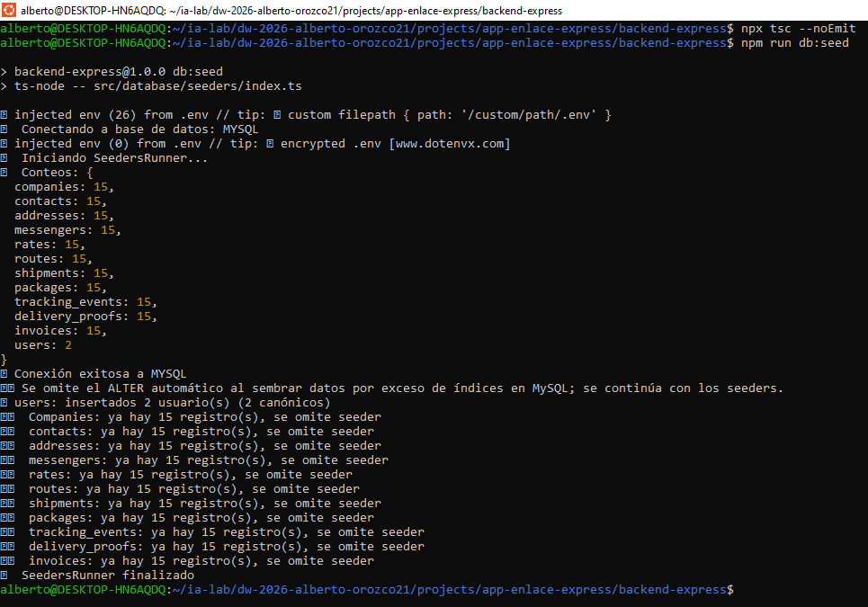

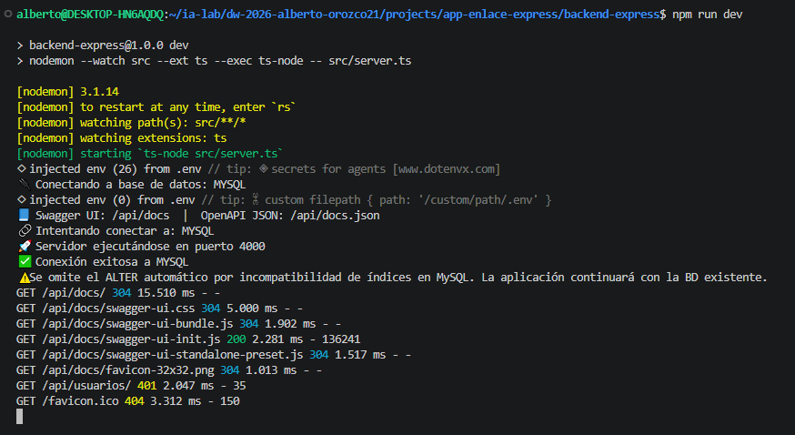


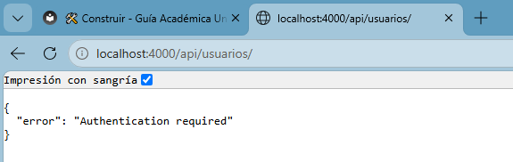

> Como las rutas son JWT + RBAC y la matriz aún no existe, en este punto un GET /api/usuarios responde 401 (no hay token). La verificación funcional se completa en el ISS-13 y en el cierre.

----

##  21. ISS-20 — Features Roles y Resources (catálogo de autorización)

**Objetivo:** construir los dos extremos del permiso:

- Role — el sujeto de la autorización (a quién se concede).

- Resource — el objeto (qué se concede), un par (method, path).

Bloqueado por: ISS-19.

Criterios de aceptación (ISS-19) — consolidados

- [x] 21.1 features/auth/roles/dto/ completo (create, update, patch, role-response, index)
- [x] 21.2 roles.repository.ts, roles.service.ts, roles.controller.ts, roles.routes.ts (JWT + RBAC)
- [x] 21.3 roles.seeder.ts (ADMIN, OPERADOR, idempotente) y roles.swagger.ts
- [x] 21.4 features/auth/resources/dto/ + resource-catalog.ts con rutas del proyecto
- [x] 21.5 resources.repository.ts, resources.service.ts, resources.controller.ts, resources.routes.ts (JWT + RBAC)
- [X] 21.6 resources.seeder.ts (carga el catálogo) y resources.swagger.ts
- [X] 21.7 archivos .http de ambos features
- [X] npx tsc --noEmit OK

## 21.1 Feature Roles — DTOs

```bash
: > src/features/auth/roles/dto/create-role.dto.ts
cat >> src/features/auth/roles/dto/create-role.dto.ts << 'EOF'
/**
 * Datos de entrada de `POST /api/roles`.
 * `name` se normaliza a MAYÚSCULAS en el modelo.
 */
export interface CreateRoleDto {
  name: string;
  description?: string | null;
  status?: "active" | "inactive";
}
EOF
```

```bash
: > src/features/auth/roles/dto/update-role.dto.ts
cat >> src/features/auth/roles/dto/update-role.dto.ts << 'EOF'
/**
 * Datos de entrada de `PUT /api/roles/:id` (reemplazo completo).
 * `status` no está aquí: el estado solo cambia con el borrado lógico.
 */
export interface UpdateRoleDto {
  name: string;
  description?: string | null;
}
EOF
```

```bash
: > src/features/auth/roles/dto/patch-role.dto.ts
cat >> src/features/auth/roles/dto/patch-role.dto.ts << 'EOF'
import { UpdateRoleDto } from "./update-role.dto";

/** Datos de entrada de `PATCH /api/roles/:id` (actualización parcial). */
export type PatchRoleDto = Partial<UpdateRoleDto>;
EOF
```

```bash
: > src/features/auth/roles/dto/role-response.dto.ts
cat >> src/features/auth/roles/dto/role-response.dto.ts << 'EOF'
import { Role, RoleI } from "../role.model";

/** Respuesta HTTP de un rol. Sin campos internos: el DTO coincide con el modelo. */
export type RoleResponseDto = RoleI;

/** Mapper modelo -> DTO de respuesta (objeto plano). */
export function toRoleResponse(role: Role): RoleResponseDto {
  return role.toJSON() as RoleI;
}
EOF
```

```bash
: > src/features/auth/roles/dto/index.ts
cat >> src/features/auth/roles/dto/index.ts << 'EOF'
export * from "./create-role.dto";
export * from "./update-role.dto";
export * from "./patch-role.dto";
export * from "./role-response.dto";
EOF
```

> Un rol se identifica por name (UK). El nombre no autoriza nada: crear un rol AUDITOR no le concede ningún recurso; el rol nace sin permisos.

## 21.2 Feature Roles — repository, service, controller y rutas

```bash
: > src/features/auth/roles/roles.repository.ts
cat >> src/features/auth/roles/roles.repository.ts << 'EOF'
import { CreationAttributes, Transaction } from "sequelize";
import { Role } from "./role.model";

/**
 * Capa Repository del feature Roles.
 * Única que habla con Sequelize (el modelo `Role`).
 */
export class RolesRepository {
  /** Todos los roles activos. */
  public async findAllActive(): Promise<Role[]> {
    return Role.findAll({ where: { status: "active" } });
  }

  /** Un rol por PK (o `null`). */
  public async findById(id: number, transaction?: Transaction): Promise<Role | null> {
    return Role.findByPk(id, { transaction });
  }

  /** Un rol por nombre normalizado a MAYÚSCULAS (o `null`). */
  public async findByName(name: string): Promise<Role | null> {
    return Role.findOne({ where: { name: name.trim().toUpperCase() } });
  }

  /** Inserta un rol. */
  public async create(data: CreationAttributes<Role>): Promise<Role> {
    return Role.create(data);
  }

  /** Persiste cambios sobre una instancia existente. */
  public async update(role: Role, data: Partial<Role>): Promise<Role> {
    return role.update(data);
  }

  /** Elimina físicamente una instancia. */
  public async delete(role: Role): Promise<void> {
    await role.destroy();
  }
}
EOF
```

```bash
: > src/features/auth/roles/roles.service.ts
cat >> src/features/auth/roles/roles.service.ts << 'EOF'
import {
  CreateRoleDto,
  PatchRoleDto,
  RoleResponseDto,
  UpdateRoleDto,
  toRoleResponse,
} from "./dto";
import { RolesRepository } from "./roles.repository";
import { Role } from "./role.model";
import { AppError } from "../../../shared/errors/app-error";

/**
 * Capa Service del feature Roles.
 *
 * Regla de negocio: el nombre del rol es único. La autorización **nunca** se
 * decide por el nombre, sino por las concesiones (`resource_roles`) asociadas;
 * el nombre solo sirve para agrupar.
 */
export class RolesService {
  public constructor(
    private readonly repository: RolesRepository = new RolesRepository()
  ) {}

  // ================== READ ==================
  public async getAll(): Promise<RoleResponseDto[]> {
    const roles = await this.repository.findAllActive();
    return roles.map((role) => toRoleResponse(role));
  }

  public async getOne(id: number): Promise<RoleResponseDto> {
    return toRoleResponse(await this.findOrFail(id));
  }

  // ================== CREATE ==================
  public async create(body: CreateRoleDto): Promise<RoleResponseDto> {
    if (!body.name) {
      throw new AppError(400, "name is required");
    }
    await this.assertNameAvailable(body.name);

    const role = await this.repository.create({
      name: body.name,
      description: body.description ?? null,
      status: body.status ?? "active",
    });
    return toRoleResponse(role);
  }

  // ================== UPDATE ==================
  public async updatePut(id: number, body: UpdateRoleDto): Promise<RoleResponseDto> {
    const role = await this.findOrFail(id);
    await this.assertNameAvailable(body.name, id);

    await this.repository.update(role, {
      name: body.name,
      description: body.description ?? null,
    });
    return toRoleResponse(role);
  }

  public async updatePatch(id: number, body: PatchRoleDto): Promise<RoleResponseDto> {
    const role = await this.findOrFail(id);

    if (body.name) {
      await this.assertNameAvailable(body.name, id);
    }

    await this.repository.update(role, body);
    return toRoleResponse(role);
  }

  // ================== DELETE ==================
  /** Eliminación física. */
  public async deletePhysical(id: number): Promise<void> {
    const role = await this.findOrFail(id, false);
    await this.repository.delete(role);
  }

  /** Eliminación lógica -> `status = inactive`. Todos sus usuarios pierden ese rol. */
  public async deleteLogical(id: number): Promise<RoleResponseDto> {
    const role = await this.findOrFail(id);
    await this.repository.update(role, { status: "inactive" });
    return toRoleResponse(role);
  }

  // ================== HELPERS ==================
  private async findOrFail(id: number, onlyActive = true): Promise<Role> {
    const role = await this.repository.findById(id);
    if (!role || (onlyActive && role.status !== "active")) {
      throw new AppError(404, "Role not found");
    }
    return role;
  }

  private async assertNameAvailable(name: string, excludeId?: number): Promise<void> {
    const existing = await this.repository.findByName(name);
    if (existing && existing.id !== excludeId) {
      throw new AppError(409, "Role name already in use");
    }
  }
}
EOF
```

```bash
: > src/features/auth/roles/roles.controller.ts
cat >> src/features/auth/roles/roles.controller.ts << 'EOF'
import { Request, Response } from "express";
import { BaseController } from "../../../shared/http/base-controller";
import { CreateRoleDto, PatchRoleDto, UpdateRoleDto } from "./dto";
import { RolesService } from "./roles.service";

/**
 * Capa Controller del feature Roles.
 * Solo HTTP: lee `req`, llama al service y arma la respuesta.
 */
export class RolesController extends BaseController {
  public constructor(
    private readonly service: RolesService = new RolesService()
  ) {
    super();
  }

  // ================== READ ==================
  public async getAll(_req: Request, res: Response): Promise<void> {
    await this.run(res, async () => {
      const roles = await this.service.getAll();
      res.status(200).json({ roles });
    });
  }

  public async getOne(req: Request, res: Response): Promise<void> {
    await this.run(res, async () => {
      const role = await this.service.getOne(this.paramId(req));
      res.status(200).json({ role });
    });
  }

  // ================== CREATE ==================
  public async create(req: Request, res: Response): Promise<void> {
    await this.run(res, async () => {
      const role = await this.service.create(req.body as CreateRoleDto);
      res.status(201).json({ role });
    });
  }

  // ================== UPDATE ==================
  public async updatePut(req: Request, res: Response): Promise<void> {
    await this.run(res, async () => {
      const role = await this.service.updatePut(
        this.paramId(req),
        req.body as UpdateRoleDto
      );
      res.status(200).json({ role });
    });
  }

  public async updatePatch(req: Request, res: Response): Promise<void> {
    await this.run(res, async () => {
      const role = await this.service.updatePatch(
        this.paramId(req),
        req.body as PatchRoleDto
      );
      res.status(200).json({ role });
    });
  }

  // ================== DELETE ==================
  /** Eliminación física. */
  public async deletePhysical(req: Request, res: Response): Promise<void> {
    await this.run(res, async () => {
      const id = this.paramId(req);
      await this.service.deletePhysical(id);
      res.status(200).json({ message: "Role permanently deleted", id });
    });
  }

  /** Eliminación lógica -> `status = inactive`. */
  public async deleteLogical(req: Request, res: Response): Promise<void> {
    await this.run(res, async () => {
      const role = await this.service.deleteLogical(this.paramId(req));
      res.status(200).json({ message: "Role deactivated (logical delete)", role });
    });
  }
}
EOF
```

```bash
: > src/features/auth/roles/roles.routes.ts
cat >> src/features/auth/roles/roles.routes.ts << 'EOF'
import { Application } from "express";
import { RolesController } from "./roles.controller";
import { authenticate, authorize } from "../access";

/** Rutas del feature Roles — **modalidad 3 (JWT + RBAC)** en todas las operaciones. */
export class RolesRoutes {
  public rolesController: RolesController = new RolesController();

  public routes(app: Application): void {
    // getAll
    app
      .route("/api/roles")
      .get(authenticate, authorize, this.rolesController.getAll.bind(this.rolesController));

    // getOne
    app
      .route("/api/roles/:id")
      .get(authenticate, authorize, this.rolesController.getOne.bind(this.rolesController));

    // create
    app
      .route("/api/roles")
      .post(authenticate, authorize, this.rolesController.create.bind(this.rolesController));

    // update (PUT / PATCH)
    app
      .route("/api/roles/:id")
      .put(authenticate, authorize, this.rolesController.updatePut.bind(this.rolesController))
      .patch(authenticate, authorize, this.rolesController.updatePatch.bind(this.rolesController));

    // delete físico
    app
      .route("/api/roles/:id")
      .delete(
        authenticate,
        authorize,
        this.rolesController.deletePhysical.bind(this.rolesController)
      );

    // delete lógico
    app
      .route("/api/roles/:id/deactivate")
      .patch(authenticate, authorize, this.rolesController.deleteLogical.bind(this.rolesController));
  }
}
EOF
```

## 21.3 Feature Roles — seeder y swagger

```bash
: > src/features/auth/roles/roles.seeder.ts
cat >> src/features/auth/roles/roles.seeder.ts << 'EOF'
import { Role } from "./role.model";

/**
 * Seeder del catálogo de roles (`roles`).
 *
 * Crea los dos roles de referencia del sistema. Es determinista (no usa datos
 * aleatorios) e idempotente: `findOrCreate` por nombre y reactivación si ya
 * existía inactivo.
 *
 * Los roles nacen **sin permisos**: las concesiones las crea el seeder de
 * `resource_roles` (ADMIN recibe el catálogo; OPERADOR parte sin concesiones).
 */
export const SEED_ROLES = [
  { name: "ADMIN", description: "Administración del sistema: gestiona usuarios, roles y permisos" },
  { name: "OPERADOR", description: "Rol operativo pendiente de matriz de permisos" },
] as const;

export async function seedRoles(): Promise<number> {
  let created = 0;

  for (const item of SEED_ROLES) {
    const [role, wasCreated] = await Role.findOrCreate({
      where: { name: item.name },
      defaults: { name: item.name, description: item.description, status: "active" },
    });

    if (wasCreated) {
      created++;
      continue;
    }
    if (role.status !== "active") {
      await role.update({ status: "active" });
    }
  }

  console.log(`✅ roles: catálogo reconciliado (${SEED_ROLES.length} roles, ${created} nuevos)`);
  return created;
}
EOF
```

```bash
: > src/features/auth/roles/roles.swagger.ts
cat >> src/features/auth/roles/roles.swagger.ts << 'EOF'
import {
  bearerSecurity,
  forbiddenResponse,
  invalidIdResponse,
  notFoundResponse,
  unauthorizedResponse,
} from "../../../shared/http/swagger-security";

/**
 * Documentación OpenAPI del feature Roles.
 *
 * Modalidad: **JWT + RBAC** en todas las operaciones.
 *
 * Recordatorio de diseño: el **nombre** del rol no autoriza nada. Un rol
 * `ADMIN` sin concesiones activas no habilita ninguna operación; la autorización
 * se decide por las filas de `resource_roles`.
 */
export const rolesSwagger = {
  tags: [
    { name: "Roles", description: "CRUD de roles (agrupadores de permisos) — **JWT + RBAC**" },
  ],
  paths: {
    "/api/roles": {
      get: {
        tags: ["Roles"],
        summary: "Listar roles activos",
        description: "JWT + RBAC — recurso `GET /api/roles`.",
        security: bearerSecurity,
        responses: {
          "200": { description: "Lista de roles (`{ roles: [...] }`)" },
          "401": unauthorizedResponse,
          "403": forbiddenResponse,
        },
      },
      post: {
        tags: ["Roles"],
        summary: "Crear rol",
        description:
          "JWT + RBAC — recurso `POST /api/roles`. El rol nace **sin permisos**: se conceden con `POST /api/concesiones-rol`.",
        security: bearerSecurity,
        requestBody: {
          required: true,
          content: {
            "application/json": { schema: { $ref: "#/components/schemas/RoleCreate" } },
          },
        },
        responses: {
          "201": { description: "Rol creado (`{ role }`)" },
          "401": unauthorizedResponse,
          "403": forbiddenResponse,
          "409": { description: "Nombre de rol ya en uso" },
        },
      },
    },
    "/api/roles/{id}": {
      get: {
        tags: ["Roles"],
        summary: "Obtener rol por id",
        description: "JWT + RBAC — recurso `GET /api/roles/:id`.",
        security: bearerSecurity,
        parameters: [{ name: "id", in: "path", required: true, schema: { type: "integer" } }],
        responses: {
          "200": { description: "Rol (`{ role }`)" },
          "400": invalidIdResponse,
          "401": unauthorizedResponse,
          "403": forbiddenResponse,
          "404": notFoundResponse,
        },
      },
      put: {
        tags: ["Roles"],
        summary: "Reemplazar rol (PUT)",
        description: "JWT + RBAC — recurso `PUT /api/roles/:id`.",
        security: bearerSecurity,
        parameters: [{ name: "id", in: "path", required: true, schema: { type: "integer" } }],
        requestBody: {
          required: true,
          content: {
            "application/json": { schema: { $ref: "#/components/schemas/RoleUpdate" } },
          },
        },
        responses: {
          "200": { description: "Rol actualizado (`{ role }`)" },
          "400": invalidIdResponse,
          "401": unauthorizedResponse,
          "403": forbiddenResponse,
          "404": notFoundResponse,
        },
      },
      patch: {
        tags: ["Roles"],
        summary: "Modificar rol (PATCH)",
        description: "JWT + RBAC — recurso `PATCH /api/roles/:id`.",
        security: bearerSecurity,
        parameters: [{ name: "id", in: "path", required: true, schema: { type: "integer" } }],
        requestBody: {
          content: {
            "application/json": { schema: { $ref: "#/components/schemas/RolePatch" } },
          },
        },
        responses: {
          "200": { description: "Rol actualizado (`{ role }`)" },
          "400": invalidIdResponse,
          "401": unauthorizedResponse,
          "403": forbiddenResponse,
          "404": notFoundResponse,
        },
      },
      delete: {
        tags: ["Roles"],
        summary: "Eliminar rol (físico)",
        description: "JWT + RBAC — recurso `DELETE /api/roles/:id`.",
        security: bearerSecurity,
        parameters: [{ name: "id", in: "path", required: true, schema: { type: "integer" } }],
        responses: {
          "200": { description: "Eliminado (`{ message, id }`)" },
          "400": invalidIdResponse,
          "401": unauthorizedResponse,
          "403": forbiddenResponse,
          "404": notFoundResponse,
        },
      },
    },
    "/api/roles/{id}/deactivate": {
      patch: {
        tags: ["Roles"],
        summary: "Desactivar rol (borrado lógico)",
        description:
          "JWT + RBAC — recurso `PATCH /api/roles/:id/deactivate`. " +
          "Efecto inmediato: todos los usuarios de ese rol pierden sus permisos (eslabón `roles` inactivo -> DENY).",
        security: bearerSecurity,
        parameters: [{ name: "id", in: "path", required: true, schema: { type: "integer" } }],
        responses: {
          "200": { description: "Desactivado (`{ message, role }`)" },
          "400": invalidIdResponse,
          "401": unauthorizedResponse,
          "403": forbiddenResponse,
          "404": notFoundResponse,
        },
      },
    },
  },
  components: {
    schemas: {
      Role: {
        type: "object",
        properties: {
          id: { type: "integer", example: 1 },
          name: { type: "string", example: "OPERADOR" },
          description: { type: "string", nullable: true },
          status: { type: "string", enum: ["active", "inactive"], example: "active" },
          createdAt: { type: "string", format: "date-time" },
          updatedAt: { type: "string", format: "date-time" },
        },
      },
      RoleCreate: {
        type: "object",
        required: ["name"],
        properties: {
          name: { type: "string", example: "MENSAJERO" },
          description: { type: "string", nullable: true },
          status: { type: "string", enum: ["active", "inactive"], default: "active" },
        },
      },
      RoleUpdate: {
        type: "object",
        required: ["name"],
        properties: {
          name: { type: "string" },
          description: { type: "string", nullable: true },
        },
      },
      RolePatch: {
        type: "object",
        properties: {
          name: { type: "string" },
          description: { type: "string", nullable: true },
        },
      },
    },
  },
};
EOF
```

## 21.4 Feature Resources — DTOs y catálogo semilla

```bash
: > src/features/auth/resources/dto/create-resource.dto.ts
cat >> src/features/auth/resources/dto/create-resource.dto.ts << 'EOF'
/**
 * Datos de entrada de `POST /api/recursos`.
 *
 * `path` se guarda con el patrón (`/api/shipments/:id`), no con un valor concreto.
 */
export interface CreateResourceDto {
  method: "GET" | "POST" | "PUT" | "PATCH" | "DELETE";
  path: string;
  description?: string | null;
  status?: "active" | "inactive";
}
EOF
```

```bash
: > src/features/auth/resources/dto/update-resource.dto.ts
cat >> src/features/auth/resources/dto/update-resource.dto.ts << 'EOF'
/**
 * Datos de entrada de `PUT /api/recursos/:id` (reemplazo completo).
 * `status` no está aquí: el estado solo cambia con el borrado lógico.
 */
export interface UpdateResourceDto {
  method: "GET" | "POST" | "PUT" | "PATCH" | "DELETE";
  path: string;
  description?: string | null;
}
EOF
```

```bash
: > src/features/auth/resources/dto/patch-resource.dto.ts
cat >> src/features/auth/resources/dto/patch-resource.dto.ts << 'EOF'
import { UpdateResourceDto } from "./update-resource.dto";

/** Datos de entrada de `PATCH /api/recursos/:id` (actualización parcial). */
export type PatchResourceDto = Partial<UpdateResourceDto>;
EOF
```

```bash
: > src/features/auth/resources/dto/resource-response.dto.ts
cat >> src/features/auth/resources/dto/resource-response.dto.ts << 'EOF'
import { Resource, ResourceI } from "../resource.model";

/**
 * Respuesta HTTP de un recurso. `resources` no tiene campos internos, así que el
 * DTO coincide con el modelo; se declara igualmente para que la API quede
 * desacoplada del modelo (cambiar el modelo no cambia el contrato por accidente).
 */
export type ResourceResponseDto = ResourceI;

/** Mapper modelo -> DTO de respuesta (objeto plano). */
export function toResourceResponse(resource: Resource): ResourceResponseDto {
  return resource.toJSON() as ResourceI;
}
EOF
```

```bash
: > src/features/auth/resources/dto/index.ts
cat >> src/features/auth/resources/dto/index.ts << 'EOF'
export * from "./create-resource.dto";
export * from "./update-resource.dto";
export * from "./patch-resource.dto";
export * from "./resource-response.dto";
EOF
```

> El catálogo es la fuente única de recursos; los roles operativos no reciben concesiones hasta aprobar su matriz.

```bash
: > src/features/auth/resources/resource-catalog.ts
cat >> src/features/auth/resources/resource-catalog.ts << 'EOF'
/**
 * Catálogo de recursos RBAC de EnlaceExpress.
 *
 * Las rutas business se derivan del patrón común de los 11 módulos existentes
 * (GET colección/detalle, POST, PUT, PATCH, DELETE y PATCH deactivate). Si un
 * módulo cambia sus rutas, actualiza aquí el catálogo para mantenerlo alineado.
 * Ajusta AUTH_RESOURCES a los endpoints finales de los módulos auth.
 */
export interface CatalogResource {
  method: "GET" | "POST" | "PUT" | "PATCH" | "DELETE";
  path: string;
  description: string;
}

const STANDARD_OPERATIONS = [
  { method: "GET", suffix: "", action: "Listar" },
  { method: "GET", suffix: "/:id", action: "Consultar" },
  { method: "POST", suffix: "", action: "Crear" },
  { method: "PUT", suffix: "/:id", action: "Reemplazar" },
  { method: "PATCH", suffix: "/:id", action: "Modificar" },
  { method: "DELETE", suffix: "/:id", action: "Eliminar" },
  { method: "PATCH", suffix: "/:id/deactivate", action: "Desactivar" },
] as const;

const BUSINESS_FEATURES = [
  "companies",
  "contacts",
  "address",
  "messengers",
  "rates",
  "routes",
  "shipments",
  "packages",
  "tracking_events",
  "delivery_proofs",
  "invoices",
] as const;

const BUSINESS_RESOURCES: CatalogResource[] = BUSINESS_FEATURES.flatMap((feature) =>
  STANDARD_OPERATIONS.map(({ method, suffix, action }) => ({
    method,
    path: `/api/${feature}${suffix}`,
    description: `${action} ${feature}`,
  }))
);

const AUTH_FEATURES = ["usuarios", "roles", "recursos"] as const;
const AUTH_RESOURCES: CatalogResource[] = [
  ...AUTH_FEATURES.flatMap((feature) =>
    STANDARD_OPERATIONS.map(({ method, suffix, action }) => ({
      method,
      path: `/api/${feature}${suffix}`,
      description: `${action} ${feature}`,
    }))
  ),
  { method: "PATCH", path: "/api/usuarios/:id/password", description: "Cambiar contraseña" },
  { method: "GET", path: "/api/usuarios/:id/permisos", description: "Permisos efectivos" },
  { method: "GET", path: "/api/asignaciones-rol", description: "Listar asignaciones" },
  { method: "GET", path: "/api/asignaciones-rol/:id", description: "Consultar asignación" },
  { method: "POST", path: "/api/asignaciones-rol", description: "Asignar rol" },
  { method: "PATCH", path: "/api/asignaciones-rol/:id/deactivate", description: "Retirar rol" },
  { method: "PATCH", path: "/api/asignaciones-rol/:id/reactivate", description: "Reactivar rol" },
  { method: "GET", path: "/api/concesiones-rol", description: "Listar concesiones" },
  { method: "GET", path: "/api/concesiones-rol/:id", description: "Consultar concesión" },
  { method: "POST", path: "/api/concesiones-rol", description: "Conceder permiso" },
  { method: "PATCH", path: "/api/concesiones-rol/:id/deactivate", description: "Retirar permiso" },
  { method: "PATCH", path: "/api/concesiones-rol/:id/reactivate", description: "Reactivar permiso" },
];

export const RESOURCE_CATALOG: readonly CatalogResource[] = [
  ...AUTH_RESOURCES,
  ...BUSINESS_RESOURCES,
];

// Sin una matriz de permisos aprobada, los roles operativos parten sin permisos.
export const OPERADOR_RESOURCES: readonly CatalogResource[] = [];

// Referencia inicial: 33 rutas de administración auth + 77 rutas business = 110.
// Recalcular al cambiar endpoints; las rutas OPEN/JWT de sesión no pertenecen a RBAC.
EOF
```

## 21.5 Feature Resources — repository, service, controller y rutas

```bash
: > src/features/auth/resources/resources.repository.ts
cat >> src/features/auth/resources/resources.repository.ts << 'EOF'
import { CreationAttributes, Transaction } from "sequelize";
import { Resource } from "./resource.model";
import { normalizePath } from "../../../shared/auth/resource-match";

/**
 * Capa Repository del feature Resources.
 * Única que habla con Sequelize (el modelo `Resource`).
 */
export class ResourcesRepository {
  /** Todos los recursos activos. */
  public async findAllActive(): Promise<Resource[]> {
    return Resource.findAll({ where: { status: "active" } });
  }

  /** Un recurso por PK (o `null`). */
  public async findById(id: number, transaction?: Transaction): Promise<Resource | null> {
    return Resource.findByPk(id, { transaction });
  }

  /** Un recurso por su par `(method, path)` (o `null`). */
  public async findByOperation(method: string, path: string): Promise<Resource | null> {
    return Resource.findOne({
      where: { method: method.trim().toUpperCase(), path: normalizePath(path.trim()) },
    });
  }

  /** Inserta un recurso. */
  public async create(data: CreationAttributes<Resource>): Promise<Resource> {
    return Resource.create(data);
  }

  /** Persiste cambios sobre una instancia existente. */
  public async update(resource: Resource, data: Partial<Resource>): Promise<Resource> {
    return resource.update(data);
  }

  /** Elimina físicamente una instancia. */
  public async delete(resource: Resource): Promise<void> {
    await resource.destroy();
  }
}
EOF
```

```bash
: > src/features/auth/resources/resources.service.ts
cat >> src/features/auth/resources/resources.service.ts << 'EOF'
import {
  CreateResourceDto,
  PatchResourceDto,
  ResourceResponseDto,
  UpdateResourceDto,
  toResourceResponse,
} from "./dto";
import { ResourcesRepository } from "./resources.repository";
import { Resource } from "./resource.model";
import { AppError } from "../../../shared/errors/app-error";

/**
 * Capa Service del feature Resources.
 *
 * Reglas de negocio: la tupla `(method, path)` es única. Se comprueba antes de
 * escribir para responder 409 con un mensaje útil en lugar de dejar reventar la
 * restricción única de la base de datos como 500.
 */
export class ResourcesService {
  public constructor(
    private readonly repository: ResourcesRepository = new ResourcesRepository()
  ) {}

  // ================== READ ==================
  public async getAll(): Promise<ResourceResponseDto[]> {
    const resources = await this.repository.findAllActive();
    return resources.map((resource) => toResourceResponse(resource));
  }

  public async getOne(id: number): Promise<ResourceResponseDto> {
    return toResourceResponse(await this.findOrFail(id));
  }

  // ================== CREATE ==================
  public async create(body: CreateResourceDto): Promise<ResourceResponseDto> {
    if (!body.method || !body.path) {
      throw new AppError(400, "method and path are required");
    }
    await this.assertOperationAvailable(body.method, body.path);

    const resource = await this.repository.create({
      method: body.method,
      path: body.path,
      description: body.description ?? null,
      status: body.status ?? "active",
    });
    return toResourceResponse(resource);
  }

  // ================== UPDATE ==================
  public async updatePut(id: number, body: UpdateResourceDto): Promise<ResourceResponseDto> {
    const resource = await this.findOrFail(id);
    await this.assertOperationAvailable(body.method, body.path, id);

    await this.repository.update(resource, {
      method: body.method,
      path: body.path,
      description: body.description ?? null,
    });
    return toResourceResponse(resource);
  }

  public async updatePatch(id: number, body: PatchResourceDto): Promise<ResourceResponseDto> {
    const resource = await this.findOrFail(id);

    const method = body.method ?? resource.method;
    const path = body.path ?? resource.path;
    await this.assertOperationAvailable(method, path, id);

    await this.repository.update(resource, body);
    return toResourceResponse(resource);
  }

  // ================== DELETE ==================
  /** Eliminación física. */
  public async deletePhysical(id: number): Promise<void> {
    const resource = await this.findOrFail(id, false);
    await this.repository.delete(resource);
  }

  /** Eliminación lógica -> `status = inactive`. Deshabilita el punto de acceso. */
  public async deleteLogical(id: number): Promise<ResourceResponseDto> {
    const resource = await this.findOrFail(id);
    await this.repository.update(resource, { status: "inactive" });
    return toResourceResponse(resource);
  }

  // ================== HELPERS ==================
  private async findOrFail(id: number, onlyActive = true): Promise<Resource> {
    const resource = await this.repository.findById(id);
    if (!resource || (onlyActive && resource.status !== "active")) {
      throw new AppError(404, "Resource not found");
    }
    return resource;
  }

  /** 409 si otro recurso ya declara el mismo `(method, path)`. */
  private async assertOperationAvailable(
    method: string,
    path: string,
    excludeId?: number
  ): Promise<void> {
    const existing = await this.repository.findByOperation(method, path);
    if (existing && existing.id !== excludeId) {
      throw new AppError(409, `Resource ${method.toUpperCase()} ${path} already exists`);
    }
  }
}
EOF
```

```bash
: > src/features/auth/resources/resources.controller.ts
cat >> src/features/auth/resources/resources.controller.ts << 'EOF'
import { Request, Response } from "express";
import { BaseController } from "../../../shared/http/base-controller";
import {
  CreateResourceDto,
  PatchResourceDto,
  UpdateResourceDto,
} from "./dto";
import { ResourcesService } from "./resources.service";

/**
 * Capa Controller del feature Resources.
 * Solo HTTP: lee `req`, llama al service y arma la respuesta.
 */
export class ResourcesController extends BaseController {
  public constructor(
    private readonly service: ResourcesService = new ResourcesService()
  ) {
    super();
  }

  // ================== READ ==================
  public async getAll(_req: Request, res: Response): Promise<void> {
    await this.run(res, async () => {
      const resources = await this.service.getAll();
      res.status(200).json({ resources });
    });
  }

  public async getOne(req: Request, res: Response): Promise<void> {
    await this.run(res, async () => {
      const resource = await this.service.getOne(this.paramId(req));
      res.status(200).json({ resource });
    });
  }

  // ================== CREATE ==================
  public async create(req: Request, res: Response): Promise<void> {
    await this.run(res, async () => {
      const resource = await this.service.create(req.body as CreateResourceDto);
      res.status(201).json({ resource });
    });
  }

  // ================== UPDATE ==================
  public async updatePut(req: Request, res: Response): Promise<void> {
    await this.run(res, async () => {
      const resource = await this.service.updatePut(
        this.paramId(req),
        req.body as UpdateResourceDto
      );
      res.status(200).json({ resource });
    });
  }

  public async updatePatch(req: Request, res: Response): Promise<void> {
    await this.run(res, async () => {
      const resource = await this.service.updatePatch(
        this.paramId(req),
        req.body as PatchResourceDto
      );
      res.status(200).json({ resource });
    });
  }

  // ================== DELETE ==================
  /** Eliminación física. */
  public async deletePhysical(req: Request, res: Response): Promise<void> {
    await this.run(res, async () => {
      const id = this.paramId(req);
      await this.service.deletePhysical(id);
      res.status(200).json({ message: "Resource permanently deleted", id });
    });
  }

  /** Eliminación lógica -> `status = inactive`. */
  public async deleteLogical(req: Request, res: Response): Promise<void> {
    await this.run(res, async () => {
      const resource = await this.service.deleteLogical(this.paramId(req));
      res.status(200).json({ message: "Resource deactivated (logical delete)", resource });
    });
  }
}
EOF
```

```bash
: > src/features/auth/resources/resources.routes.ts
cat >> src/features/auth/resources/resources.routes.ts << 'EOF'
import { Application } from "express";
import { ResourcesController } from "./resources.controller";
import { authenticate, authorize } from "../access";

/** Rutas del feature Resources — **modalidad 3 (JWT + RBAC)** en todas las operaciones. */
export class ResourcesRoutes {
  public resourcesController: ResourcesController = new ResourcesController();

  public routes(app: Application): void {
    // getAll
    app
      .route("/api/recursos")
      .get(authenticate, authorize, this.resourcesController.getAll.bind(this.resourcesController));

    // getOne
    app
      .route("/api/recursos/:id")
      .get(authenticate, authorize, this.resourcesController.getOne.bind(this.resourcesController));

    // create
    app
      .route("/api/recursos")
      .post(authenticate, authorize, this.resourcesController.create.bind(this.resourcesController));

    // update (PUT / PATCH)
    app
      .route("/api/recursos/:id")
      .put(
        authenticate,
        authorize,
        this.resourcesController.updatePut.bind(this.resourcesController)
      )
      .patch(
        authenticate,
        authorize,
        this.resourcesController.updatePatch.bind(this.resourcesController)
      );

    // delete físico
    app
      .route("/api/recursos/:id")
      .delete(
        authenticate,
        authorize,
        this.resourcesController.deletePhysical.bind(this.resourcesController)
      );

    // delete lógico
    app
      .route("/api/recursos/:id/deactivate")
      .patch(
        authenticate,
        authorize,
        this.resourcesController.deleteLogical.bind(this.resourcesController)
      );
  }
}
EOF
```

> POST /api/recursos con un (method, path) ya existente → 409: lo impone la restricción UQ(method, path).

## 21.6 Feature Resources — seeder y swagger

El seeder es idempotente y reconciliador: findOrCreate por (method, path) y reactivación si la fila estaba inactiva. Reejecutarlo deja el catálogo exacto, sin duplicados.

```bash
: > src/features/auth/resources/resources.seeder.ts
cat >> src/features/auth/resources/resources.seeder.ts << 'EOF'
import { Resource } from "./resource.model";
import { RESOURCE_CATALOG } from "./resource-catalog";

/**
 * Seeder del catálogo de recursos (`resources`).
 *
 * A diferencia de los seeders de business, este **no usa datos aleatorios**: los
 * Los recursos forman un catálogo determinista definido en `resource-catalog.ts`.
 * Es idempotente por partida doble: `findOrCreate` por `(method, path)` y
 * reactivación de las filas que ya existían inactivas, de modo que volver a
 * ejecutarlo reconcilia el catálogo sin duplicar ni perder concesiones.
 */
export async function seedResources(): Promise<number> {
  let created = 0;

  for (const item of RESOURCE_CATALOG) {
    const [resource, wasCreated] = await Resource.findOrCreate({
      where: { method: item.method, path: item.path },
      defaults: {
        method: item.method,
        path: item.path,
        description: item.description,
        status: "active",
      },
    });

    if (wasCreated) {
      created++;
      continue;
    }
    if (resource.status !== "active") {
      await resource.update({ status: "active" });
    }
  }

  console.log(
    `✅ resources: catálogo reconciliado (${RESOURCE_CATALOG.length} recursos, ${created} nuevos)`
  );
  return created;
}
EOF
```

```bash
: > src/features/auth/resources/resources.swagger.ts
cat >> src/features/auth/resources/resources.swagger.ts << 'EOF'
import {
  bearerSecurity,
  forbiddenResponse,
  invalidIdResponse,
  notFoundResponse,
  unauthorizedResponse,
} from "../../../shared/http/swagger-security";

/**
 * Documentación OpenAPI del feature Resources.
 *
 * Modalidad: **JWT + RBAC** en todas las operaciones.
 *
 * Un recurso es un par `(method, path)` con la ruta **en patrón**
 * (`/api/shipments/:id`). `GET` y `POST` sobre la misma ruta son dos recursos
 * distintos y se conceden por separado.
 */
export const resourcesSwagger = {
  tags: [
    {
      name: "Recursos",
      description:
        "Catálogo de puntos de acceso protegibles: par `(method, path)` — **JWT + RBAC**",
    },
  ],
  paths: {
    "/api/recursos": {
      get: {
        tags: ["Recursos"],
        summary: "Listar recursos activos",
        description: "JWT + RBAC — recurso `GET /api/recursos`.",
        security: bearerSecurity,
        responses: {
          "200": { description: "Lista de recursos (`{ resources: [...] }`)" },
          "401": unauthorizedResponse,
          "403": forbiddenResponse,
        },
      },
      post: {
        tags: ["Recursos"],
        summary: "Crear recurso",
        description:
          "JWT + RBAC — recurso `POST /api/recursos`. Alta de un nuevo punto de acceso; concederlo a un rol no requiere desplegar código.",
        security: bearerSecurity,
        requestBody: {
          required: true,
          content: {
            "application/json": { schema: { $ref: "#/components/schemas/ResourceCreate" } },
          },
        },
        responses: {
          "201": { description: "Recurso creado (`{ resource }`)" },
          "401": unauthorizedResponse,
          "403": forbiddenResponse,
          "409": { description: "La tupla `(method, path)` ya existe" },
        },
      },
    },
    "/api/recursos/{id}": {
      get: {
        tags: ["Recursos"],
        summary: "Obtener recurso por id",
        description: "JWT + RBAC — recurso `GET /api/recursos/:id`.",
        security: bearerSecurity,
        parameters: [{ name: "id", in: "path", required: true, schema: { type: "integer" } }],
        responses: {
          "200": { description: "Recurso (`{ resource }`)" },
          "400": invalidIdResponse,
          "401": unauthorizedResponse,
          "403": forbiddenResponse,
          "404": notFoundResponse,
        },
      },
      put: {
        tags: ["Recursos"],
        summary: "Reemplazar recurso (PUT)",
        description: "JWT + RBAC — recurso `PUT /api/recursos/:id`.",
        security: bearerSecurity,
        parameters: [{ name: "id", in: "path", required: true, schema: { type: "integer" } }],
        requestBody: {
          required: true,
          content: {
            "application/json": { schema: { $ref: "#/components/schemas/ResourceUpdate" } },
          },
        },
        responses: {
          "200": { description: "Recurso actualizado (`{ resource }`)" },
          "400": invalidIdResponse,
          "401": unauthorizedResponse,
          "403": forbiddenResponse,
          "404": notFoundResponse,
        },
      },
      patch: {
        tags: ["Recursos"],
        summary: "Modificar recurso (PATCH)",
        description: "JWT + RBAC — recurso `PATCH /api/recursos/:id`.",
        security: bearerSecurity,
        parameters: [{ name: "id", in: "path", required: true, schema: { type: "integer" } }],
        requestBody: {
          content: {
            "application/json": { schema: { $ref: "#/components/schemas/ResourcePatch" } },
          },
        },
        responses: {
          "200": { description: "Recurso actualizado (`{ resource }`)" },
          "400": invalidIdResponse,
          "401": unauthorizedResponse,
          "403": forbiddenResponse,
          "404": notFoundResponse,
        },
      },
      delete: {
        tags: ["Recursos"],
        summary: "Eliminar recurso (físico)",
        description: "JWT + RBAC — recurso `DELETE /api/recursos/:id`.",
        security: bearerSecurity,
        parameters: [{ name: "id", in: "path", required: true, schema: { type: "integer" } }],
        responses: {
          "200": { description: "Eliminado (`{ message, id }`)" },
          "400": invalidIdResponse,
          "401": unauthorizedResponse,
          "403": forbiddenResponse,
          "404": notFoundResponse,
        },
      },
    },
    "/api/recursos/{id}/deactivate": {
      patch: {
        tags: ["Recursos"],
        summary: "Desactivar recurso (borrado lógico)",
        description:
          "JWT + RBAC — recurso `PATCH /api/recursos/:id/deactivate`. " +
          "Efecto inmediato: ningún rol puede autorizar ese punto de acceso (eslabón `resources` inactivo -> DENY).",
        security: bearerSecurity,
        parameters: [{ name: "id", in: "path", required: true, schema: { type: "integer" } }],
        responses: {
          "200": { description: "Desactivado (`{ message, resource }`)" },
          "400": invalidIdResponse,
          "401": unauthorizedResponse,
          "403": forbiddenResponse,
          "404": notFoundResponse,
        },
      },
    },
  },
  components: {
    schemas: {
      Resource: {
        type: "object",
        properties: {
          id: { type: "integer", example: 1 },
          method: { type: "string", enum: ["GET", "POST", "PUT", "PATCH", "DELETE"], example: "GET" },
          path: { type: "string", example: "/api/shipments/:id" },
          description: { type: "string", nullable: true },
          status: { type: "string", enum: ["active", "inactive"], example: "active" },
          createdAt: { type: "string", format: "date-time" },
          updatedAt: { type: "string", format: "date-time" },
        },
      },
      ResourceCreate: {
        type: "object",
        required: ["method", "path"],
        properties: {
          method: { type: "string", enum: ["GET", "POST", "PUT", "PATCH", "DELETE"] },
          path: { type: "string", example: "/api/shipments/:id" },
          description: { type: "string", nullable: true },
          status: { type: "string", enum: ["active", "inactive"], default: "active" },
        },
      },
      ResourceUpdate: {
        type: "object",
        required: ["method", "path"],
        properties: {
          method: { type: "string", enum: ["GET", "POST", "PUT", "PATCH", "DELETE"] },
          path: { type: "string" },
          description: { type: "string", nullable: true },
        },
      },
      ResourcePatch: {
        type: "object",
        properties: {
          method: { type: "string", enum: ["GET", "POST", "PUT", "PATCH", "DELETE"] },
          path: { type: "string" },
          description: { type: "string", nullable: true },
        },
      },
    },
  },
};
EOF
```

## 21.7 Pruebas HTTP

```bash
: > src/features/auth/roles/http/roles.get.http
cat >> src/features/auth/roles/http/roles.get.http << 'EOF'
### Feature Roles — CRUD (modalidad JWT + RBAC)
### El NOMBRE del rol no autoriza nada: la autorización son las filas de `resource_roles`.
@baseUrl = http://localhost:4000

# @name loginAdmin
POST {{baseUrl}}/api/sesion/login
Content-Type: application/json

{
  "identifier": "admin",
  "password": "Admin123!"
}

# @name loginOperador
POST {{baseUrl}}/api/sesion/login
Content-Type: application/json

{
  "identifier": "operador",
  "password": "Operador123!"
}

@token = {{loginAdmin.response.body.$.access_token}}

### getAll — recurso `GET /api/roles` (ADMIN y OPERADOR)
GET {{baseUrl}}/api/roles
Authorization: Bearer {{token}}

### getOne
GET {{baseUrl}}/api/roles/1
Authorization: Bearer {{token}}

### CREATE — nace SIN permisos
POST {{baseUrl}}/api/roles
Authorization: Bearer {{token}}
Content-Type: application/json

{
  "name": "AUDITOR",
  "description": "Solo lectura de catálogo"
}

### UPDATE PUT
PUT {{baseUrl}}/api/roles/3
Authorization: Bearer {{token}}
Content-Type: application/json

{
  "name": "AUDITOR",
  "description": "Rol operativo pendiente de permisos aprobados"
}

### UPDATE PATCH
PATCH {{baseUrl}}/api/roles/3
Authorization: Bearer {{token}}
Content-Type: application/json

{
  "description": "Auditoría operativa"
}

### DELETE lógico — efecto inmediato: todos sus usuarios pierden esos permisos (403)
PATCH {{baseUrl}}/api/roles/3/deactivate
Authorization: Bearer {{token}}

### DELETE físico
DELETE {{baseUrl}}/api/roles/3
Authorization: Bearer {{token}}

### 403 — OPERADOR no tiene concedido `GET /api/roles`
GET {{baseUrl}}/api/roles
Authorization: Bearer {{loginOperador.response.body.$.access_token}}
EOF
```

```bash
: > src/features/auth/resources/http/resources.get.http
cat >> src/features/auth/resources/http/resources.get.http << 'EOF'
### Feature Resources — catálogo de puntos de acceso (modalidad JWT + RBAC)
### Un recurso es el par (method, path) con la ruta EN PATRÓN: /api/shipments/:id
### GET y POST sobre la misma ruta son DOS recursos distintos.
@baseUrl = http://localhost:4000

# @name loginAdmin
POST {{baseUrl}}/api/sesion/login
Content-Type: application/json

{
  "identifier": "admin",
  "password": "Admin123!"
}

@token = {{loginAdmin.response.body.$.access_token}}

### getAll — el catálogo de rutas de EnlaceExpress
GET {{baseUrl}}/api/recursos
Authorization: Bearer {{token}}

### Copia un id real de la respuesta anterior antes de probar getOne/update/delete.
@resourceId = <id-obtenido-de-GET-recursos>
GET {{baseUrl}}/api/recursos/{{resourceId}}
Authorization: Bearer {{token}}

### CREATE — alta de un punto de acceso futuro; no habilita una ruta no implementada.
# @name createResource
POST {{baseUrl}}/api/recursos
Authorization: Bearer {{token}}
Content-Type: application/json

{
  "method": "GET",
  "path": "/api/ops-dashboard",
  "description": "Consulta futura del tablero operativo"
}

@createdResourceId = {{createResource.response.body.$.resource.id}}

### 409 — la tupla (method, path) ya existe
POST {{baseUrl}}/api/recursos
Authorization: Bearer {{token}}
Content-Type: application/json

{
  "method": "GET",
  "path": "/api/companies",
  "description": "Duplicado"
}

### UPDATE PUT
PUT {{baseUrl}}/api/recursos/{{createdResourceId}}
Authorization: Bearer {{token}}
Content-Type: application/json

{
  "method": "GET",
  "path": "/api/ops-dashboard",
  "description": "Consulta futura del tablero operativo"
}

### DELETE lógico
PATCH {{baseUrl}}/api/recursos/{{createdResourceId}}/deactivate
Authorization: Bearer {{token}}

### DELETE físico
DELETE {{baseUrl}}/api/recursos/{{createdResourceId}}
Authorization: Bearer {{token}}
EOF
```

**Verificación**

```bash
npx tsc --noEmit
npm run db:seed
```

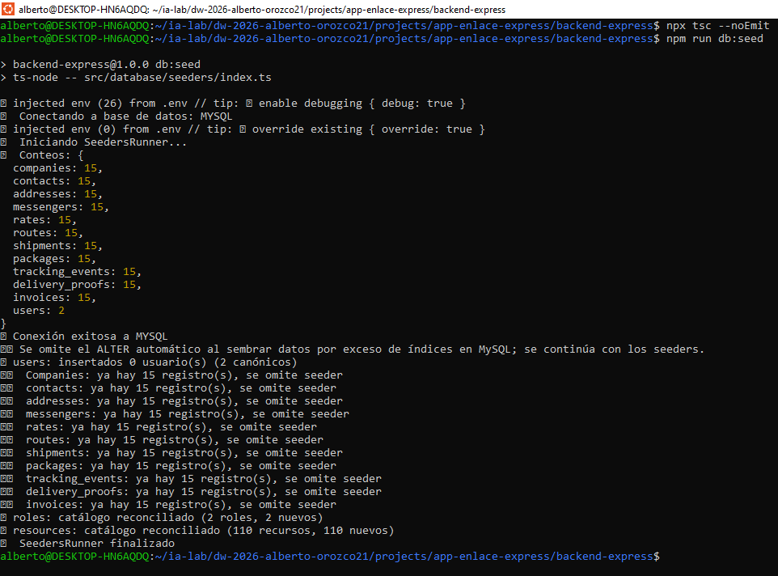

```sql
SELECT COUNT(*) FROM resources;   -- 110 con las rutas actuales
SELECT COUNT(*) FROM roles;       -- 2
SELECT name, status FROM roles;   -- ADMIN, OPERADOR
```

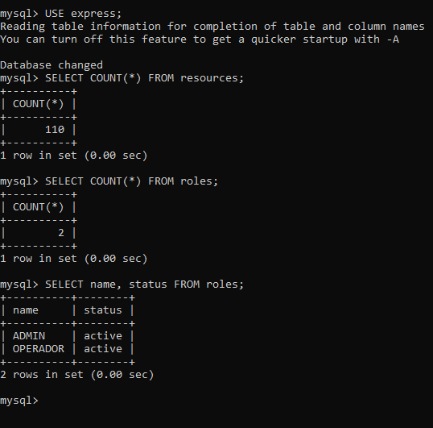

------

## 22. ISS-21 — Features RoleUsers y ResourceRoles (asignar roles y conceder permisos)

**Objetivo:** construir las dos tablas pivote que convierten el modelo en autorización real:

```
User   ──(RoleUser)────▶  Role   ──(ResourceRole)────▶  Resource
        «quién tiene        «qué agrupa»       «qué se concede»
         qué rol»
```

Son los métodos que añaden permisos a los recursos (el requisito explícito de la Fase II): sin estas dos features, Role y Resource serían catálogos inertes.

Bloqueado por: ISS-20.

Criterios de aceptación (ISS-21) — consolidados

- [X] 22.1 role-users/dto/ (create-role-user.dto.ts, role-user-response.dto.ts, index.ts)
- [X] 22.2 role-users.{repository,service,controller,routes}.ts; POST /api/asignaciones-rol idempotente (reactiva si existía inactiva)
- [X] 22.3 role-users.seeder.ts (admin→ADMIN, operador→OPERADOR) y role-users.swagger.ts
- [X] 22.4 resource-roles/dto/ (create-resource-role.dto.ts, list-resource-roles.dto.ts, resource-role-response.dto.ts, index.ts)
- [X] 22.5 resource-roles.{repository,service,controller,routes}.ts; POST /api/concesiones-rol idempotente y /deactivate · /reactivate
- [X] 22.6 ResourceRolesService.reconcileRole(roleId, resourceIds) determinista (concede lo que falta, reactiva, retira lo que sobra)
- [X] 22.7 resource-roles.seeder.ts construye la matriz (ADMIN catálogo completo; OPERADOR pendiente) y resource-roles.swagger.ts
- [X] 22.8 archivos .http de ambos features
- [X] npx tsc --noEmit OK

## 22.1 DTOs de RoleUsers

```bash
: > src/features/auth/role-users/dto/create-role-user.dto.ts
cat >> src/features/auth/role-users/dto/create-role-user.dto.ts << 'EOF'
/**
 * Datos de entrada de `POST /api/asignaciones-rol` — **asignar un rol a un usuario**.
 *
 * Es el primer eslabón de la autorización. Se envía la pareja de identificadores;
 * si la asignación ya existía inactiva, se **reactiva** en lugar de duplicarla
 * (la restricción única `(user_id, role_id)` lo garantiza).
 */
export interface CreateRoleUserDto {
  user_id: number;
  role_id: number;
}
EOF
```

```bash
: > src/features/auth/role-users/dto/role-user-response.dto.ts
cat >> src/features/auth/role-users/dto/role-user-response.dto.ts << 'EOF'
import { RoleUser, RoleUserI } from "../role-user.model";

/**
 * Respuesta HTTP de una asignación usuario-rol.
 *
 * Incluye, además de las claves foráneas, un resumen del usuario y del rol
 * (`user`, `role`) para que el consumidor no tenga que hacer dos peticiones
 * extra. La proyección del usuario **excluye la contraseña** por `attributes`
 * en el `include` del repository, no aquí: nunca sale de la base de datos.
 */
export interface RoleUserResponseDto extends RoleUserI {
  user?: { id: number; username: string; email: string } | null;
  role?: { id: number; name: string } | null;
}

/** Mapper modelo -> DTO de respuesta (objeto plano, con resúmenes si vienen). */
export function toRoleUserResponse(roleUser: RoleUser): RoleUserResponseDto {
  return roleUser.toJSON() as RoleUserResponseDto;
}
EOF
```

```bash
: > src/features/auth/role-users/dto/index.ts
cat >> src/features/auth/role-users/dto/index.ts << 'EOF'
export * from "./create-role-user.dto";
export * from "./role-user-response.dto";
EOF
```

## 22.2 RoleUsers — repository, service, controller y rutas

Asignar un rol es un upsert lógico, no un alta a ciegas:

|Situación de (user_id, role_id) |Resultado|
|--------------------------------|---------|
|No existe	| se crea la fila active|
|Existe active|	409 (ya está asignado)|
|Existe inactive| se reactiva (no se duplica)|

> **No hay borrado físico:** retirar un rol es PATCH /:id/deactivate y la auditoría de quién tuvo qué rol se conserva.

```bash
: > src/features/auth/role-users/role-users.repository.ts
cat >> src/features/auth/role-users/role-users.repository.ts << 'EOF'
import { CreationAttributes, Transaction } from "sequelize";
import { RoleUser } from "./role-user.model";
import { Role } from "../roles/role.model";
import { User } from "../users/user.model";

/** `include` reutilizable: resumen del usuario (sin contraseña) y del rol. */
const SUMMARIES = [
  { model: User, as: "user", attributes: ["id", "username", "email"] },
  { model: Role, as: "role", attributes: ["id", "name"] },
];

/**
 * Capa Repository del feature RoleUsers (tabla `role_users`).
 * Única que habla con Sequelize. La proyección del usuario excluye `password`.
 */
export class RoleUsersRepository {
  /** Asignaciones activas (con resumen de usuario y rol). */
  public async findAllActive(): Promise<RoleUser[]> {
    return RoleUser.findAll({ where: { status: "active" }, include: SUMMARIES });
  }

  /** Una asignación por PK (o `null`). */
  public async findById(id: number, transaction?: Transaction): Promise<RoleUser | null> {
    return RoleUser.findByPk(id, { include: SUMMARIES, transaction });
  }

  /**
   * La asignación de un usuario a un rol, sea cual sea su estado.
   *
   * Permite la semántica *create-or-reactivate*: si ya existe inactiva, se
   * reactiva en lugar de chocar con la restricción única `(user_id, role_id)`.
   */
  public async findByUserAndRole(userId: number, roleId: number): Promise<RoleUser | null> {
    return RoleUser.findOne({ where: { user_id: userId, role_id: roleId } });
  }

  /** Inserta una asignación. */
  public async create(data: CreationAttributes<RoleUser>): Promise<RoleUser> {
    return RoleUser.create(data);
  }

  /** Persiste cambios sobre una instancia existente. */
  public async update(roleUser: RoleUser, data: Partial<RoleUser>): Promise<RoleUser> {
    return roleUser.update(data);
  }
}
EOF
```

```bash
: > src/features/auth/role-users/role-users.service.ts
cat >> src/features/auth/role-users/role-users.service.ts << 'EOF'
import {
  CreateRoleUserDto,
  RoleUserResponseDto,
  toRoleUserResponse,
} from "./dto";
import { RoleUsersRepository } from "./role-users.repository";
import { RoleUser } from "./role-user.model";
import { UsersRepository } from "../users/users.repository";
import { RolesRepository } from "../roles/roles.repository";
import { AppError } from "../../../shared/errors/app-error";

/**
 * Capa Service del feature RoleUsers — **asignaciones usuario ↔ rol**.
 *
 * Aquí empieza la administración de la autorización. Reglas de negocio:
 *  - Solo se asigna un rol **activo** a un usuario **activo** (un eslabón
 *    inactivo rompería la cadena y el permiso no se concedería de todos modos).
 *  - Asignar es **idempotente**: si la pareja ya existía desactivada, se
 *    reactiva; si ya estaba activa, se informa 409 sin duplicar filas.
 *  - Retirar es un borrado lógico: preserva la auditoría y es reversible.
 *
 * El efecto es inmediato: la próxima petición del usuario vuelve a consultar la
 * cadena RBAC y ya ve (o deja de ver) el permiso. No hay caché que invalidar.
 */
export class RoleUsersService {
  public constructor(
    private readonly repository: RoleUsersRepository = new RoleUsersRepository(),
    private readonly usersRepository: UsersRepository = new UsersRepository(),
    private readonly rolesRepository: RolesRepository = new RolesRepository()
  ) {}

  // ================== READ ==================
  public async getAll(): Promise<RoleUserResponseDto[]> {
    const assignments = await this.repository.findAllActive();
    return assignments.map((assignment) => toRoleUserResponse(assignment));
  }

  public async getOne(id: number): Promise<RoleUserResponseDto> {
    return toRoleUserResponse(await this.findOrFail(id));
  }

  // ================== CREATE (asignar) ==================
  /** Asigna un rol a un usuario (o reactiva la asignación existente). */
  public async assign(body: CreateRoleUserDto): Promise<RoleUserResponseDto> {
    if (!body.user_id || !body.role_id) {
      throw new AppError(400, "user_id and role_id are required");
    }

    await this.assertUserActive(body.user_id);
    await this.assertRoleActive(body.role_id);

    const existing = await this.repository.findByUserAndRole(body.user_id, body.role_id);
    if (existing) {
      if (existing.status === "active") {
        throw new AppError(409, "Role is already assigned to this user");
      }
      const reactivated = await this.repository.update(existing, { status: "active" });
      return toRoleUserResponse(await this.reload(reactivated.id));
    }

    const created = await this.repository.create({
      user_id: body.user_id,
      role_id: body.role_id,
      status: "active",
    });
    return toRoleUserResponse(await this.reload(created.id));
  }

  // ================== STATE (retirar / reactivar) ==================
  /** Retirar el rol -> `status = inactive`. El usuario pierde los permisos del rol. */
  public async deactivate(id: number): Promise<RoleUserResponseDto> {
    const assignment = await this.findOrFail(id);
    await this.repository.update(assignment, { status: "inactive" });
    return toRoleUserResponse(await this.reload(assignment.id));
  }

  /** Reactivar la asignación. */
  public async reactivate(id: number): Promise<RoleUserResponseDto> {
    const assignment = await this.findOrFail(id, false);
    if (assignment.status === "active") {
      throw new AppError(409, "Assignment is already active");
    }
    await this.repository.update(assignment, { status: "active" });
    return toRoleUserResponse(await this.reload(assignment.id));
  }

  // ================== HELPERS ==================
  private async findOrFail(id: number, onlyActive = true): Promise<RoleUser> {
    const assignment = await this.repository.findById(id);
    if (!assignment || (onlyActive && assignment.status !== "active")) {
      throw new AppError(404, "Role assignment not found");
    }
    return assignment;
  }

  /** Recarga con los `include` de resumen (el `findById` ya los trae). */
  private async reload(id: number): Promise<RoleUser> {
    const assignment = await this.repository.findById(id);
    if (!assignment) {
      throw new AppError(404, "Role assignment not found");
    }
    return assignment;
  }

  private async assertUserActive(userId: number): Promise<void> {
    const user = await this.usersRepository.findById(userId);
    if (!user || user.status !== "active") {
      throw new AppError(404, "User not found or inactive");
    }
  }

  private async assertRoleActive(roleId: number): Promise<void> {
    const role = await this.rolesRepository.findById(roleId);
    if (!role || role.status !== "active") {
      throw new AppError(404, "Role not found or inactive");
    }
  }
}
EOF
```

```bash
: > src/features/auth/role-users/role-users.controller.ts
cat >> src/features/auth/role-users/role-users.controller.ts << 'EOF'
import { Request, Response } from "express";
import { BaseController } from "../../../shared/http/base-controller";
import { CreateRoleUserDto } from "./dto";
import { RoleUsersService } from "./role-users.service";

/**
 * Capa Controller del feature RoleUsers.
 *
 * Orden de operaciones (el mismo patrón del proyecto):
 * getAll → getOne → assign (create) → deactivate → reactivate.
 * No expone borrado físico: la revocación es lógica para preservar auditoría.
 */
export class RoleUsersController extends BaseController {
  public constructor(
    private readonly service: RoleUsersService = new RoleUsersService()
  ) {
    super();
  }

  // ================== READ ==================
  public async getAll(_req: Request, res: Response): Promise<void> {
    await this.run(res, async () => {
      const assignments = await this.service.getAll();
      res.status(200).json({ assignments });
    });
  }

  public async getOne(req: Request, res: Response): Promise<void> {
    await this.run(res, async () => {
      const assignment = await this.service.getOne(this.paramId(req));
      res.status(200).json({ assignment });
    });
  }

  // ================== CREATE (asignar) ==================
  public async assign(req: Request, res: Response): Promise<void> {
    await this.run(res, async () => {
      const assignment = await this.service.assign(req.body as CreateRoleUserDto);
      res.status(201).json({ assignment });
    });
  }

  // ================== STATE ==================
  /** Retirar el rol (borrado lógico). */
  public async deactivate(req: Request, res: Response): Promise<void> {
    await this.run(res, async () => {
      const assignment = await this.service.deactivate(this.paramId(req));
      res.status(200).json({ message: "Role assignment deactivated", assignment });
    });
  }

  /** Reactivar la asignación. */
  public async reactivate(req: Request, res: Response): Promise<void> {
    await this.run(res, async () => {
      const assignment = await this.service.reactivate(this.paramId(req));
      res.status(200).json({ message: "Role assignment reactivated", assignment });
    });
  }
}
EOF
```

```bash
: > src/features/auth/role-users/role-users.routes.ts
cat >> src/features/auth/role-users/role-users.routes.ts << 'EOF'
import { Application } from "express";
import { RoleUsersController } from "./role-users.controller";
import { authenticate, authorize } from "../access";

/**
 * Rutas del feature RoleUsers — **modalidad 3 (JWT + RBAC)**.
 *
 * Es la vía administrativa para **asignar un rol a un usuario**:
 * `POST /api/asignaciones-rol` con `{ user_id, role_id }`.
 *
 * No hay borrado físico: retirar un rol es un borrado lógico (`/deactivate`) y
 * es reversible (`/reactivate`). La auditoría de quién tuvo qué rol se conserva.
 */
export class RoleUsersRoutes {
  public roleUsersController: RoleUsersController = new RoleUsersController();

  public routes(app: Application): void {
    // getAll
    app
      .route("/api/asignaciones-rol")
      .get(
        authenticate,
        authorize,
        this.roleUsersController.getAll.bind(this.roleUsersController)
      );

    // getOne
    app
      .route("/api/asignaciones-rol/:id")
      .get(
        authenticate,
        authorize,
        this.roleUsersController.getOne.bind(this.roleUsersController)
      );

    // asignar rol (create)
    app
      .route("/api/asignaciones-rol")
      .post(
        authenticate,
        authorize,
        this.roleUsersController.assign.bind(this.roleUsersController)
      );

    // retirar rol (delete lógico)
    app
      .route("/api/asignaciones-rol/:id/deactivate")
      .patch(
        authenticate,
        authorize,
        this.roleUsersController.deactivate.bind(this.roleUsersController)
      );

    // reactivar asignación
    app
      .route("/api/asignaciones-rol/:id/reactivate")
      .patch(
        authenticate,
        authorize,
        this.roleUsersController.reactivate.bind(this.roleUsersController)
      );
  }
}
EOF
```

## 22.3 RoleUsers — seeder y swagger

```bash
: > src/features/auth/role-users/role-users.seeder.ts
cat >> src/features/auth/role-users/role-users.seeder.ts << 'EOF'
import { RoleUser } from "./role-user.model";
import { Role } from "../roles/role.model";
import { User } from "../users/user.model";

/**
 * Seeder de las asignaciones usuario ↔ rol (`role_users`).
 *
 * Crea las dos asignaciones de referencia. Con esto el usuario `admin` hereda
 * todos los recursos de `ADMIN` y los permisos aprobados de `OPERADOR`, sin
 * escribir ni una fila de autorización a mano.
 *
 * Idempotente: si la pareja ya existe (activa o no), se asegura de que quede
 * activa en lugar de duplicarla.
 */
export const SEED_ROLE_USERS = [
  { username: "admin", roleName: "ADMIN" },
  { username: "operador", roleName: "OPERADOR" },
] as const;

export async function seedRoleUsers(): Promise<number> {
  let created = 0;

  for (const item of SEED_ROLE_USERS) {
    const user = await User.findOne({ where: { username: item.username } });
    const role = await Role.findOne({ where: { name: item.roleName } });

    if (!user || !role) {
      console.log(
        `⏭️  role_users: falta ${item.username} o ${item.roleName}, se omite esa asignación`
      );
      continue;
    }

    const [assignment, wasCreated] = await RoleUser.findOrCreate({
      where: { user_id: user.id, role_id: role.id },
      defaults: { user_id: user.id, role_id: role.id, status: "active" },
    });

    if (wasCreated) {
      created++;
      continue;
    }
    if (assignment.status !== "active") {
      await assignment.update({ status: "active" });
    }
  }

  console.log(
    `✅ role_users: asignaciones reconciliadas (${SEED_ROLE_USERS.length}, ${created} nuevas)`
  );
  return created;
}
EOF
```

```bash
: > src/features/auth/role-users/role-users.swagger.ts
cat >> src/features/auth/role-users/role-users.swagger.ts << 'EOF'
import {
  bearerSecurity,
  forbiddenResponse,
  invalidIdResponse,
  notFoundResponse,
  unauthorizedResponse,
} from "../../../shared/http/swagger-security";

/**
 * Documentación OpenAPI del feature RoleUsers — **asignaciones usuario ↔ rol**.
 *
 * Modalidad: **JWT + RBAC** en todas las operaciones.
 *
 * Estas rutas son una de las dos vías administrativas de la autorización:
 * `POST /api/asignaciones-rol` **asigna un rol a un usuario**, primer eslabón de
 * la cadena. Sin asignación activa no hay permisos, por muchos roles que existan.
 */
export const roleUsersSwagger = {
  tags: [
    {
      name: "Asignaciones usuario-rol",
      description:
        "Asignar / retirar / reactivar el rol de un usuario (`role_users`) — **JWT + RBAC**",
    },
  ],
  paths: {
    "/api/asignaciones-rol": {
      get: {
        tags: ["Asignaciones usuario-rol"],
        summary: "Listar asignaciones activas",
        description:
          "JWT + RBAC — recurso `GET /api/asignaciones-rol`. Incluye un resumen del usuario (sin `password`) y del rol.",
        security: bearerSecurity,
        responses: {
          "200": { description: "Lista de asignaciones (`{ assignments: [...] }`)" },
          "401": unauthorizedResponse,
          "403": forbiddenResponse,
        },
      },
      post: {
        tags: ["Asignaciones usuario-rol"],
        summary: "Asignar rol a usuario",
        description:
          "JWT + RBAC — recurso `POST /api/asignaciones-rol`. " +
          "Cuerpo: `{ user_id, role_id }`. Es idempotente: si la pareja existía desactivada, se reactiva. " +
          "El usuario y el rol deben estar activos.",
        security: bearerSecurity,
        requestBody: {
          required: true,
          content: {
            "application/json": { schema: { $ref: "#/components/schemas/RoleUserCreate" } },
          },
        },
        responses: {
          "201": { description: "Asignación creada (`{ assignment }`)" },
          "401": unauthorizedResponse,
          "403": forbiddenResponse,
          "404": { description: "Usuario o rol inexistente o inactivo" },
          "409": { description: "El rol ya está asignado a ese usuario" },
        },
      },
    },
    "/api/asignaciones-rol/{id}": {
      get: {
        tags: ["Asignaciones usuario-rol"],
        summary: "Obtener asignación por id",
        description: "JWT + RBAC — recurso `GET /api/asignaciones-rol/:id`.",
        security: bearerSecurity,
        parameters: [{ name: "id", in: "path", required: true, schema: { type: "integer" } }],
        responses: {
          "200": { description: "Asignación (`{ assignment }`)" },
          "400": invalidIdResponse,
          "401": unauthorizedResponse,
          "403": forbiddenResponse,
          "404": notFoundResponse,
        },
      },
    },
    "/api/asignaciones-rol/{id}/deactivate": {
      patch: {
        tags: ["Asignaciones usuario-rol"],
        summary: "Retirar rol a usuario (borrado lógico)",
        description:
          "JWT + RBAC — recurso `PATCH /api/asignaciones-rol/:id/deactivate`. " +
          "Rompe el eslabón `role_users` -> el usuario pierde los permisos de ese rol de inmediato (403).",
        security: bearerSecurity,
        parameters: [{ name: "id", in: "path", required: true, schema: { type: "integer" } }],
        responses: {
          "200": { description: "Asignación desactivada (`{ message, assignment }`)" },
          "400": invalidIdResponse,
          "401": unauthorizedResponse,
          "403": forbiddenResponse,
          "404": notFoundResponse,
        },
      },
    },
    "/api/asignaciones-rol/{id}/reactivate": {
      patch: {
        tags: ["Asignaciones usuario-rol"],
        summary: "Reactivar asignación",
        description:
          "JWT + RBAC — recurso `PATCH /api/asignaciones-rol/:id/reactivate`. Reversible: vuelve a conceder los permisos del rol.",
        security: bearerSecurity,
        parameters: [{ name: "id", in: "path", required: true, schema: { type: "integer" } }],
        responses: {
          "200": { description: "Asignación reactivada (`{ message, assignment }`)" },
          "400": invalidIdResponse,
          "401": unauthorizedResponse,
          "403": forbiddenResponse,
          "404": notFoundResponse,
          "409": { description: "La asignación ya estaba activa" },
        },
      },
    },
  },
  components: {
    schemas: {
      RoleUser: {
        type: "object",
        properties: {
          id: { type: "integer", example: 1 },
          user_id: { type: "integer", example: 1 },
          role_id: { type: "integer", example: 1 },
          status: { type: "string", enum: ["active", "inactive"], example: "active" },
          user: {
            type: "object",
            properties: {
              id: { type: "integer" },
              username: { type: "string" },
              email: { type: "string", format: "email" },
            },
          },
          role: {
            type: "object",
            properties: { id: { type: "integer" }, name: { type: "string" } },
          },
          createdAt: { type: "string", format: "date-time" },
          updatedAt: { type: "string", format: "date-time" },
        },
      },
      RoleUserCreate: {
        type: "object",
        required: ["user_id", "role_id"],
        properties: {
          user_id: { type: "integer", example: 2 },
          role_id: { type: "integer", example: 2 },
        },
      },
    },
  },
};
EOF
```

## 22.4 DTOs de ResourceRoles

```bash
: > src/features/auth/resource-roles/dto/create-resource-role.dto.ts
cat >> src/features/auth/resource-roles/dto/create-resource-role.dto.ts << 'EOF'
/**
 * Datos de entrada de `POST /api/concesiones-rol` — **conceder un recurso a un rol**.
 *
 * Esta operación **crea un permiso**: el permiso no es una entidad con nombre,
 * es la tupla `(role_id, resource_id)` materializada en `resource_roles`. Si la
 * concesión ya existía inactiva, se reactiva en lugar de duplicarla.
 *
 * Ejemplo: conceder `POST /api/shipments` al rol `OPERADOR` significa que los
 * usuarios con ese rol podrán crear envíos, sin tocar el código.
 */
export interface CreateResourceRoleDto {
  role_id: number;
  resource_id: number;
}
EOF
```

```bash
: > src/features/auth/resource-roles/dto/create-resource-role.dto.ts
cat >> src/features/auth/resource-roles/dto/create-resource-role.dto.ts << 'EOF'
/**
 * Datos de entrada de `POST /api/concesiones-rol` — **conceder un recurso a un rol**.
 *
 * Esta operación **crea un permiso**: el permiso no es una entidad con nombre,
 * es la tupla `(role_id, resource_id)` materializada en `resource_roles`. Si la
 * concesión ya existía inactiva, se reactiva en lugar de duplicarla.
 *
 * Ejemplo: conceder `POST /api/shipments` al rol `OPERADOR` significa que los
 * usuarios con ese rol podrán crear envíos, sin tocar el código.
 */
export interface CreateResourceRoleDto {
  role_id: number;
  resource_id: number;
}
EOF
```

```bash
: > src/features/auth/resource-roles/dto/resource-role-response.dto.ts
cat >> src/features/auth/resource-roles/dto/resource-role-response.dto.ts << 'EOF'
import { ResourceRole, ResourceRoleI } from "../resource-role.model";

/**
 * Respuesta HTTP de una concesión rol-recurso (un permiso).
 *
 * Incluye un resumen del rol y del recurso: `resource` lleva `(method, path)`,
 * que es exactamente el par que evalúa el middleware de autorización.
 */
export interface ResourceRoleResponseDto extends ResourceRoleI {
  role?: { id: number; name: string } | null;
  resource?: {
    id: number;
    method: string;
    path: string;
    description: string | null;
  } | null;
}

/** Mapper modelo -> DTO de respuesta (objeto plano). */
export function toResourceRoleResponse(resourceRole: ResourceRole): ResourceRoleResponseDto {
  return resourceRole.toJSON() as ResourceRoleResponseDto;
}

/**
 * Un permiso **efectivo**: el resultado de recorrer la cadena completa
 * `role_users → roles → resource_roles → resources` para un usuario concreto.
 *
 * Es plano a propósito: el middleware de autorización solo necesita
 * `(method, path)`; el resto es información útil para el endpoint de consulta.
 */
export interface EffectivePermissionDto {
  resource_id: number;
  method: string;
  path: string;
  description: string | null;
  role_id: number;
  role_name: string;
}
EOF
```

```bash
: > src/features/auth/resource-roles/dto/index.ts
cat >> src/features/auth/resource-roles/dto/index.ts << 'EOF'
export * from "./create-resource-role.dto";
export * from "./list-resource-roles.dto";
export * from "./resource-role-response.dto";
EOF
```

El DTO de listado admite dos filtros que se usan para auditar la matriz desde ambos lados:

- ?role_id= — «¿qué concede este rol?»

- ?resource_id= — «¿qué roles conceden este recurso?»

## 22.5 ResourceRoles — repository, service, controller y rutas

POST /api/concesiones-rol con { role_id, resource_id } materializa el permiso. Misma semántica idempotente que en RoleUsers.

```bash
: > src/features/auth/resource-roles/resource-roles.repository.ts
cat >> src/features/auth/resource-roles/resource-roles.repository.ts << 'EOF'
import { CreationAttributes, Op, Transaction } from "sequelize";
import { ResourceRole } from "./resource-role.model";
import { Role } from "../roles/role.model";
import { Resource } from "../resources/resource.model";
import { RoleUser } from "../role-users/role-user.model";
import { EffectivePermissionDto } from "./dto";

/** `include` reutilizable: resumen del rol y del recurso (con `method`/`path`). */
const SUMMARIES = [
  { model: Role, as: "role", attributes: ["id", "name"] },
  {
    model: Resource,
    as: "resource",
    attributes: ["id", "method", "path", "description"],
  },
];

/**
 * Capa Repository del feature ResourceRoles (tabla `resource_roles`).
 *
 * Aquí vive la **consulta de autorización efectiva**: la única que recorre la
 * cadena completa de seguridad. Es el corazón del RBAC.
 */
export class ResourceRolesRepository {
  /** Todas las concesiones activas (con resumen de rol y recurso). */
  public async findAllActive(): Promise<ResourceRole[]> {
    return ResourceRole.findAll({ where: { status: "active" }, include: SUMMARIES });
  }

  /** Concesiones activas filtradas por rol y/o recurso. */
  public async findAllActiveFiltered(filters: {
    role_id?: number;
    resource_id?: number;
  }): Promise<ResourceRole[]> {
    const where: Record<string, unknown> = { status: "active" };
    if (filters.role_id) where.role_id = filters.role_id;
    if (filters.resource_id) where.resource_id = filters.resource_id;

    return ResourceRole.findAll({ where, include: SUMMARIES, order: [["id", "ASC"]] });
  }

  /** Una concesión por PK (o `null`). */
  public async findById(id: number, transaction?: Transaction): Promise<ResourceRole | null> {
    return ResourceRole.findByPk(id, { include: SUMMARIES, transaction });
  }

  /** La concesión de un recurso a un rol, sea cual sea su estado. */
  public async findByRoleAndResource(
    roleId: number,
    resourceId: number
  ): Promise<ResourceRole | null> {
    return ResourceRole.findOne({
      where: { role_id: roleId, resource_id: resourceId },
    });
  }

  /** Todas las concesiones (activas e inactivas) de un rol. */
  public async findAllByRole(roleId: number, transaction?: Transaction): Promise<ResourceRole[]> {
    return ResourceRole.findAll({ where: { role_id: roleId }, transaction });
  }

  /** Inserta una concesión. */
  public async create(
    data: CreationAttributes<ResourceRole>,
    transaction?: Transaction
  ): Promise<ResourceRole> {
    return ResourceRole.create(data, { transaction });
  }

  /** Persiste cambios sobre una instancia existente. */
  public async update(
    resourceRole: ResourceRole,
    data: Partial<ResourceRole>,
    transaction?: Transaction
  ): Promise<ResourceRole> {
    return resourceRole.update(data, { transaction });
  }

  /**
   * **CONSULTA DE AUTORIZACIÓN EFECTIVA**: solo concede recursos activos.
   *
   * Devuelve los recursos que un usuario puede ejecutar, recorriendo la cadena
   * y exigiendo `status = 'active'` en **los cuatro eslabones**:
   *
   * ```sql
   * resource_roles (rr)  -> rr.status = active
   *   JOIN roles (ro)     -> ro.status = active
   *   JOIN role_users(ru) -> ru.status = active AND ru.user_id = :userId
   *   JOIN resources (r)  -> r.status  = active
   * ```
   *
   * Si cualquier eslabón está inactivo o ausente, la fila no aparece: el
   * resultado vacío se traduce en **deny by default** en el middleware.
   *
   * Los `include` con `required: true` producen INNER JOIN; no se usan
   * `attributes` del `RoleUser` porque solo interesa que exista y cumpla el WHERE.
   */
  public async findEffectiveForUser(userId: number): Promise<EffectivePermissionDto[]> {
    const rows = await ResourceRole.findAll({
      where: { status: "active" },
      attributes: ["id"],
      include: [
        {
          model: Role,
          as: "role",
          required: true,
          attributes: ["id", "name"],
          where: { status: "active" },
          include: [
            {
              model: RoleUser,
              as: "role_users",
              required: true,
              attributes: [],
              where: { status: "active", user_id: userId },
            },
          ],
        },
        {
          model: Resource,
          as: "resource",
          required: true,
          attributes: ["id", "method", "path", "description"],
          where: { status: "active" },
        },
      ],
      order: [["id", "ASC"]],
    });

    return rows.map((row) => {
      const plain = row.toJSON() as unknown as {
        role: { id: number; name: string };
        resource: { id: number; method: string; path: string; description: string | null };
      };
      return {
        resource_id: plain.resource.id,
        method: plain.resource.method,
        path: plain.resource.path,
        description: plain.resource.description,
        role_id: plain.role.id,
        role_name: plain.role.name,
      };
    });
  }

  /** Cuenta las concesiones activas de un rol. */
  public async countActiveByRole(roleId: number): Promise<number> {
    return ResourceRole.count({ where: { role_id: roleId, status: "active" } });
  }

  /** Cuenta las concesiones activas totales. */
  public async countActive(): Promise<number> {
    return ResourceRole.count({ where: { status: "active" } });
  }

  /** Cuenta las concesiones activas cuyo recurso está en una lista de ids. */
  public async countActiveByResources(resourceIds: number[]): Promise<number> {
    if (resourceIds.length === 0) return 0;
    return ResourceRole.count({
      where: { resource_id: { [Op.in]: resourceIds }, status: "active" },
    });
  }
}
EOF
```

```bash
: > src/features/auth/resource-roles/resource-roles.service.ts
cat >> src/features/auth/resource-roles/resource-roles.service.ts << 'EOF'
import {
  CreateResourceRoleDto,
  EffectivePermissionDto,
  ListResourceRolesDto,
  ResourceRoleResponseDto,
  toResourceRoleResponse,
} from "./dto";
import { ResourceRolesRepository } from "./resource-roles.repository";
import { ResourceRole } from "./resource-role.model";
import { RolesRepository } from "../roles/roles.repository";
import { ResourcesRepository } from "../resources/resources.repository";
import { AppError } from "../../../shared/errors/app-error";
import { withTransaction } from "../../../shared/database/with-transaction";

/** Resumen de una reconciliación de concesiones de un rol. */
export interface ReconcileResult {
  role_id: number;
  activated: number;
  deactivated: number;
  total_active: number;
}

/**
 * Capa Service del feature ResourceRoles — **la gestión de permisos**.
 *
 * Aquí es donde el modelo "Role + Resource = permiso" se vuelve operativo:
 *  - `grant`     -> concede un recurso a un rol (crea o reactiva la concesión).
 *  - `deactivate`-> retira el permiso (borrado lógico, reversible).
 *  - `findEffectiveForUser` -> materializa los permisos de un usuario concreto.
 *  - `reconcileRole` -> deja el catálogo de un rol exactamente en un conjunto
 *    dado de recursos (idempotente); lo usa el seeder para el rol `OPERADOR`.
 *
 * Nada de esto requiere desplegar código: son filas.
 */
export class ResourceRolesService {
  public constructor(
    private readonly repository: ResourceRolesRepository = new ResourceRolesRepository(),
    private readonly rolesRepository: RolesRepository = new RolesRepository(),
    private readonly resourcesRepository: ResourcesRepository = new ResourcesRepository()
  ) {}

  // ================== READ ==================
  public async getAll(filters: ListResourceRolesDto = {}): Promise<ResourceRoleResponseDto[]> {
    const grants = await this.repository.findAllActiveFiltered({
      role_id: filters.role_id,
      resource_id: filters.resource_id,
    });
    return grants.map((grant) => toResourceRoleResponse(grant));
  }

  public async getOne(id: number): Promise<ResourceRoleResponseDto> {
    return toResourceRoleResponse(await this.findOrFail(id));
  }

  /** Permisos efectivos de un usuario (cadena RBAC completa, todos los eslabones activos). */
  public async findEffectiveForUser(userId: number): Promise<EffectivePermissionDto[]> {
    return this.repository.findEffectiveForUser(userId);
  }

  // ================== CREATE (conceder) ==================
  /** Concede un recurso a un rol (crea el permiso o reactiva la concesión). */
  public async grant(body: CreateResourceRoleDto): Promise<ResourceRoleResponseDto> {
    if (!body.role_id || !body.resource_id) {
      throw new AppError(400, "role_id and resource_id are required");
    }

    const role = await this.rolesRepository.findById(body.role_id);
    if (!role || role.status !== "active") {
      throw new AppError(404, "Role not found or inactive");
    }
    const resource = await this.resourcesRepository.findById(body.resource_id);
    if (!resource || resource.status !== "active") {
      throw new AppError(404, "Resource not found or inactive");
    }

    const existing = await this.repository.findByRoleAndResource(body.role_id, body.resource_id);
    if (existing) {
      if (existing.status === "active") {
        throw new AppError(409, "Role already has this resource granted");
      }
      const reactivated = await this.repository.update(existing, { status: "active" });
      return toResourceRoleResponse(await this.reload(reactivated.id));
    }

    const created = await this.repository.create({
      role_id: body.role_id,
      resource_id: body.resource_id,
      status: "active",
    });
    return toResourceRoleResponse(await this.reload(created.id));
  }

  // ================== STATE (retirar / reactivar) ==================
  /** Retirar el permiso -> `status = inactive`. Solo se pierde esa operación. */
  public async deactivate(id: number): Promise<ResourceRoleResponseDto> {
    const grant = await this.findOrFail(id);
    await this.repository.update(grant, { status: "inactive" });
    return toResourceRoleResponse(await this.reload(grant.id));
  }

  /** Reactivar la concesión. */
  public async reactivate(id: number): Promise<ResourceRoleResponseDto> {
    const grant = await this.findOrFail(id, false);
    if (grant.status === "active") {
      throw new AppError(409, "Grant is already active");
    }
    await this.repository.update(grant, { status: "active" });
    return toResourceRoleResponse(await this.reload(grant.id));
  }

  // ================== RECONCILIACIÓN ==================
  /**
   * Deja las concesiones de un rol **exactamente** en `resourceIds`.
   *
   * - Recursos de la lista sin concesión -> se conceden.
   * - Recursos de la lista con concesión inactiva -> se reactivan.
   * - Recursos concedidos que no están en la lista -> se retiran (inactive).
   *
   * Todo dentro de una transacción: o el rol queda con ese catálogo exacto, o no
   * se toca nada. Lo usa el seeder para `OPERADOR` (sin concesiones hasta
   * aprobar la matriz) y `ADMIN` (catálogo completo), de modo que volver a
   * ejecutarlo reconcilia en vez de duplicar.
   */
  public async reconcileRole(roleId: number, resourceIds: number[]): Promise<ReconcileResult> {
    const role = await this.rolesRepository.findById(roleId);
    if (!role) {
      throw new AppError(404, "Role not found");
    }

    const wanted = new Set(resourceIds);

    return withTransaction(async (t) => {
      const existing = await this.repository.findAllByRole(roleId, t);
      const byResource = new Map(existing.map((row) => [row.resource_id, row]));

      let activated = 0;
      let deactivated = 0;

      for (const resourceId of wanted) {
        const row = byResource.get(resourceId);
        if (!row) {
          await this.repository.create(
            { role_id: roleId, resource_id: resourceId, status: "active" },
            t
          );
          activated++;
          continue;
        }
        if (row.status !== "active") {
          await this.repository.update(row, { status: "active" }, t);
          activated++;
        }
      }

      for (const row of existing) {
        if (wanted.has(row.resource_id)) continue;
        if (row.status === "active") {
          await this.repository.update(row, { status: "inactive" }, t);
          deactivated++;
        }
      }

      return {
        role_id: roleId,
        activated,
        deactivated,
        total_active: wanted.size,
      };
    });
  }

  // ================== HELPERS ==================
  private async findOrFail(id: number, onlyActive = true): Promise<ResourceRole> {
    const grant = await this.repository.findById(id);
    if (!grant || (onlyActive && grant.status !== "active")) {
      throw new AppError(404, "Grant not found");
    }
    return grant;
  }

  private async reload(id: number): Promise<ResourceRole> {
    const grant = await this.repository.findById(id);
    if (!grant) {
      throw new AppError(404, "Grant not found");
    }
    return grant;
  }
}
EOF
```

```bash
: > src/features/auth/resource-roles/resource-roles.controller.ts
cat >> src/features/auth/resource-roles/resource-roles.controller.ts << 'EOF'
import { Request, Response } from "express";
import { BaseController } from "../../../shared/http/base-controller";
import { CreateResourceRoleDto } from "./dto";
import { ResourceRolesService } from "./resource-roles.service";

/**
 * Capa Controller del feature ResourceRoles.
 *
 * Orden de operaciones: getAll → getOne → grant (create) → deactivate → reactivate.
 * `GET /api/concesiones-rol` acepta filtros `?role_id=` y `?resource_id=`.
 */
export class ResourceRolesController extends BaseController {
  public constructor(
    private readonly service: ResourceRolesService = new ResourceRolesService()
  ) {
    super();
  }

  // ================== READ ==================
  public async getAll(req: Request, res: Response): Promise<void> {
    await this.run(res, async () => {
      const grants = await this.service.getAll({
        role_id: toOptionalNumber(req.query.role_id),
        resource_id: toOptionalNumber(req.query.resource_id),
      });
      res.status(200).json({ grants });
    });
  }

  public async getOne(req: Request, res: Response): Promise<void> {
    await this.run(res, async () => {
      const grant = await this.service.getOne(this.paramId(req));
      res.status(200).json({ grant });
    });
  }

  // ================== CREATE (conceder permiso) ==================
  public async grant(req: Request, res: Response): Promise<void> {
    await this.run(res, async () => {
      const grant = await this.service.grant(req.body as CreateResourceRoleDto);
      res.status(201).json({ message: "Resource granted to role", grant });
    });
  }

  // ================== STATE ==================
  /** Retirar el permiso (borrado lógico). */
  public async deactivate(req: Request, res: Response): Promise<void> {
    await this.run(res, async () => {
      const grant = await this.service.deactivate(this.paramId(req));
      res.status(200).json({ message: "Grant deactivated (permission revoked)", grant });
    });
  }

  /** Reactivar la concesión. */
  public async reactivate(req: Request, res: Response): Promise<void> {
    await this.run(res, async () => {
      const grant = await this.service.reactivate(this.paramId(req));
      res.status(200).json({ message: "Grant reactivated", grant });
    });
  }
}

/** Convierte un `query param` en número o `undefined` (sin lanzar por basura). */
function toOptionalNumber(value: unknown): number | undefined {
  const raw = Array.isArray(value) ? value[0] : value;
  if (typeof raw !== "string" || !/^\d+$/.test(raw)) return undefined;
  return Number(raw);
}
EOF
```

```bash
: > src/features/auth/resource-roles/resource-roles.routes.ts
cat >> src/features/auth/resource-roles/resource-roles.routes.ts << 'EOF'
import { Application } from "express";
import { ResourceRolesController } from "./resource-roles.controller";
import { authenticate, authorize } from "../access";

/**
 * Rutas del feature ResourceRoles — **modalidad 3 (JWT + RBAC)**.
 *
 * Es la vía administrativa para **conceder un recurso a un rol** (crear un
 * permiso):
 * `POST /api/concesiones-rol` con `{ role_id, resource_id }`.
 *
 * El efecto es inmediato y por datos: la siguiente petición del usuario afectado
 * ya consulta la nueva matriz. No se reinicia el servidor ni se despliega nada.
 */
export class ResourceRolesRoutes {
  public resourceRolesController: ResourceRolesController = new ResourceRolesController();

  public routes(app: Application): void {
    // getAll (filtros ?role_id= y ?resource_id=)
    app
      .route("/api/concesiones-rol")
      .get(
        authenticate,
        authorize,
        this.resourceRolesController.getAll.bind(this.resourceRolesController)
      );

    // getOne
    app
      .route("/api/concesiones-rol/:id")
      .get(
        authenticate,
        authorize,
        this.resourceRolesController.getOne.bind(this.resourceRolesController)
      );

    // conceder recurso a rol (create)
    app
      .route("/api/concesiones-rol")
      .post(
        authenticate,
        authorize,
        this.resourceRolesController.grant.bind(this.resourceRolesController)
      );

    // retirar permiso (delete lógico)
    app
      .route("/api/concesiones-rol/:id/deactivate")
      .patch(
        authenticate,
        authorize,
        this.resourceRolesController.deactivate.bind(this.resourceRolesController)
      );

    // reactivar permiso
    app
      .route("/api/concesiones-rol/:id/reactivate")
      .patch(
        authenticate,
        authorize,
        this.resourceRolesController.reactivate.bind(this.resourceRolesController)
      );
  }
}
EOF
```

## 22.6 reconcileRole — la matriz determinista

reconcileRole(roleId, resourceIds) es el método que hace que un seeder (o un proceso de despliegue) pueda declarar los permisos de un rol en lugar de mutarlos a mano:

|Recurso en la lista | Fila previa | Acción |
|--------------------|-------------|--------|
|sí | no existe | concede|
|sí	| inactive | reactiva|
|sí	| active | no toca|
|no | active | retira (borrado lógico)|

Es total y determinista: al terminar, el conjunto de concesiones activas del rol es exactamente la lista recibida. Por eso el rol OPERADOR nunca acumula permisos por accidente al reejecutar el seeder.

```
reconcileRole(ADMIN, RESOURCE_CATALOG) → todos los recursos activos
reconcileRole(OPERADOR, OPERADOR_RESOURCES) → 0 hasta aprobar permisos
```

## 22.7 Seeder de la matriz y swagger

```bash
: > src/features/auth/resource-roles/resource-roles.seeder.ts
cat >> src/features/auth/resource-roles/resource-roles.seeder.ts << 'EOF'
import { Resource } from "../resources/resource.model";
import { Role } from "../roles/role.model";
import { RESOURCE_CATALOG, OPERADOR_RESOURCES } from "../resources/resource-catalog";
import { ResourceRolesService } from "./resource-roles.service";

/**
 * Seeder de las concesiones rol ↔ recurso (`resource_roles`). **Es el que
 * construye la matriz de permisos.**
 *
 * Reparto inicial de referencia:
 *  - `ADMIN` -> todos los recursos del catálogo.
 *  - `OPERADOR` -> ninguno hasta que se apruebe la matriz de permisos del negocio.
 *
 * Como `reconcileRole` es determinista, reejecutar el seeder **reconcilia** el
 * catálogo: concede lo que falte, reactiva lo inactivo y retira lo que sobre.
 * Así el rol `OPERADOR` nunca acumula permisos por accidente.
 */
export async function seedResourceRoles(): Promise<number> {
  const service = new ResourceRolesService();

  const resources = await Resource.findAll({ where: { status: "active" } });
  const idByOperation = new Map(
    resources.map((resource) => [`${resource.method} ${resource.path}`, resource.id])
  );

  /** Traduce el catálogo en código a los `resource_id` reales de la base. */
  const idsFor = (catalog: ReadonlyArray<{ method: string; path: string }>): number[] =>
    catalog
      .map((item) => idByOperation.get(`${item.method} ${item.path}`))
      .filter((id): id is number => typeof id === "number");

  let total = 0;

  const admin = await Role.findOne({ where: { name: "ADMIN" } });
  if (admin) {
    const result = await service.reconcileRole(admin.id, idsFor(RESOURCE_CATALOG));
    console.log(
      `✅ resource_roles: ADMIN -> ${result.total_active} recursos ` +
        `(${result.activated} altas, ${result.deactivated} bajas)`
    );
    total += result.total_active;
  }

  const operador = await Role.findOne({ where: { name: "OPERADOR" } });
  if (operador) {
    const result = await service.reconcileRole(operador.id, idsFor(OPERADOR_RESOURCES));
    console.log(
      `✅ resource_roles: OPERADOR -> ${result.total_active} recursos ` +
        `(${result.activated} altas, ${result.deactivated} bajas)`
    );
    total += result.total_active;
  }

  return total;
}
EOF
```

```bash
: > src/features/auth/resource-roles/resource-roles.swagger.ts
cat >> src/features/auth/resource-roles/resource-roles.swagger.ts << 'EOF'
import {
  bearerSecurity,
  forbiddenResponse,
  invalidIdResponse,
  notFoundResponse,
  unauthorizedResponse,
} from "../../../shared/http/swagger-security";

/**
 * Documentación OpenAPI del feature ResourceRoles — **la gestión de permisos**.
 *
 * Modalidad: **JWT + RBAC** en todas las operaciones.
 *
 * Aquí se materializa el principio de diseño: **no existe una entidad
 * `Permission`**. Conceder un permiso es crear (o reactivar) una fila en
 * `resource_roles`; el permiso es la tupla `(rol, recurso)`.
 */
export const resourceRolesSwagger = {
  tags: [
    {
      name: "Concesiones rol-recurso",
      description:
        "Conceder / retirar / reactivar recursos a un rol: **el permiso** — **JWT + RBAC**",
    },
  ],
  paths: {
    "/api/concesiones-rol": {
      get: {
        tags: ["Concesiones rol-recurso"],
        summary: "Listar concesiones activas",
        description:
          "JWT + RBAC — recurso `GET /api/concesiones-rol`. " +
          "Filtros opcionales: `?role_id=` (permisos de un rol) y `?resource_id=` (roles que conceden un recurso).",
        security: bearerSecurity,
        parameters: [
          { name: "role_id", in: "query", required: false, schema: { type: "integer" } },
          { name: "resource_id", in: "query", required: false, schema: { type: "integer" } },
        ],
        responses: {
          "200": { description: "Lista de concesiones (`{ grants: [...] }`)" },
          "401": unauthorizedResponse,
          "403": forbiddenResponse,
        },
      },
      post: {
        tags: ["Concesiones rol-recurso"],
        summary: "Conceder recurso a rol (crear permiso)",
        description:
          "JWT + RBAC — recurso `POST /api/concesiones-rol`. " +
          "Cuerpo: `{ role_id, resource_id }`. Idempotente: si la concesión existía retirada, se reactiva. " +
          "Efecto inmediato y sin despliegue: la siguiente petición del usuario ya consulta la nueva matriz.",
        security: bearerSecurity,
        requestBody: {
          required: true,
          content: {
            "application/json": { schema: { $ref: "#/components/schemas/ResourceRoleCreate" } },
          },
        },
        responses: {
          "201": { description: "Permiso concedido (`{ message, grant }`)" },
          "401": unauthorizedResponse,
          "403": forbiddenResponse,
          "404": { description: "Rol o recurso inexistente o inactivo" },
          "409": { description: "El rol ya tiene concedido ese recurso" },
        },
      },
    },
    "/api/concesiones-rol/{id}": {
      get: {
        tags: ["Concesiones rol-recurso"],
        summary: "Obtener concesión por id",
        description: "JWT + RBAC — recurso `GET /api/concesiones-rol/:id`.",
        security: bearerSecurity,
        parameters: [{ name: "id", in: "path", required: true, schema: { type: "integer" } }],
        responses: {
          "200": { description: "Concesión (`{ grant }`)" },
          "400": invalidIdResponse,
          "401": unauthorizedResponse,
          "403": forbiddenResponse,
          "404": notFoundResponse,
        },
      },
    },
    "/api/concesiones-rol/{id}/deactivate": {
      patch: {
        tags: ["Concesiones rol-recurso"],
        summary: "Retirar permiso (borrado lógico)",
        description:
          "JWT + RBAC — recurso `PATCH /api/concesiones-rol/:id/deactivate`. " +
          "Solo se pierde esa operación; el resto de permisos del rol siguen vigentes.",
        security: bearerSecurity,
        parameters: [{ name: "id", in: "path", required: true, schema: { type: "integer" } }],
        responses: {
          "200": { description: "Permiso retirado (`{ message, grant }`)" },
          "400": invalidIdResponse,
          "401": unauthorizedResponse,
          "403": forbiddenResponse,
          "404": notFoundResponse,
        },
      },
    },
    "/api/concesiones-rol/{id}/reactivate": {
      patch: {
        tags: ["Concesiones rol-recurso"],
        summary: "Reactivar permiso",
        description: "JWT + RBAC — recurso `PATCH /api/concesiones-rol/:id/reactivate`.",
        security: bearerSecurity,
        parameters: [{ name: "id", in: "path", required: true, schema: { type: "integer" } }],
        responses: {
          "200": { description: "Permiso reactivado (`{ message, grant }`)" },
          "400": invalidIdResponse,
          "401": unauthorizedResponse,
          "403": forbiddenResponse,
          "404": notFoundResponse,
          "409": { description: "La concesión ya estaba activa" },
        },
      },
    },
  },
  components: {
    schemas: {
      ResourceRole: {
        type: "object",
        properties: {
          id: { type: "integer", example: 1 },
          role_id: { type: "integer", example: 2 },
          resource_id: { type: "integer", example: 25 },
          status: { type: "string", enum: ["active", "inactive"], example: "active" },
          role: {
            type: "object",
            properties: { id: { type: "integer" }, name: { type: "string", example: "OPERADOR" } },
          },
          resource: {
            type: "object",
            properties: {
              id: { type: "integer" },
              method: { type: "string", example: "POST" },
              path: { type: "string", example: "/api/shipments/:id" },
              description: { type: "string", nullable: true },
            },
          },
          createdAt: { type: "string", format: "date-time" },
          updatedAt: { type: "string", format: "date-time" },
        },
      },
      ResourceRoleCreate: {
        type: "object",
        required: ["role_id", "resource_id"],
        properties: {
          role_id: { type: "integer", example: 2 },
          resource_id: { type: "integer", example: 25 },
        },
      },
    },
  },
};
EOF
```

## 22.8 Pruebas HTTP

```bash
: > src/features/auth/role-users/http/role-users.assign.http
cat >> src/features/auth/role-users/http/role-users.assign.http << 'EOF'
### Feature RoleUsers — ASIGNAR ROL A USUARIO (modalidad JWT + RBAC)
### Primer eslabón de la cadena: sin asignación activa NO hay permisos.
@baseUrl = http://localhost:4000

# @name loginAdmin
POST {{baseUrl}}/api/sesion/login
Content-Type: application/json

{
  "identifier": "admin",
  "password": "Admin123!"
}

@token = {{loginAdmin.response.body.$.access_token}}

### getAll — asignaciones activas (con resumen de usuario y rol)
GET {{baseUrl}}/api/asignaciones-rol
Authorization: Bearer {{token}}

### getOne
GET {{baseUrl}}/api/asignaciones-rol/1
Authorization: Bearer {{token}}

### ASIGNAR — `POST /api/asignaciones-rol` con { user_id, role_id }
### En una BD de prueba limpia, ajusta user_id/role_id a los ids devueltos por los listados.
# @name assignCreate
POST {{baseUrl}}/api/asignaciones-rol
Authorization: Bearer {{token}}
Content-Type: application/json

{
  "user_id": 2,
  "role_id": 1
}

@assignmentId = {{assignCreate.response.body.$.assignment.id}}

### 409 — ese rol ya está asignado a ese usuario (la tupla es única)
POST {{baseUrl}}/api/asignaciones-rol
Authorization: Bearer {{token}}
Content-Type: application/json

{
  "user_id": 2,
  "role_id": 1
}

### 404 — usuario o rol inexistente/inactivo
POST {{baseUrl}}/api/asignaciones-rol
Authorization: Bearer {{token}}
Content-Type: application/json

{
  "user_id": 9999,
  "role_id": 2
}

### RETIRAR ROL (borrado lógico) — el usuario pierde los permisos de ese rol de inmediato
PATCH {{baseUrl}}/api/asignaciones-rol/{{assignmentId}}/deactivate
Authorization: Bearer {{token}}

### Comprobación del efecto: los permisos efectivos cambian sin reiniciar nada
GET {{baseUrl}}/api/usuarios/2/permisos
Authorization: Bearer {{token}}

### REACTIVAR asignación (reversible, la auditoría se conserva)
PATCH {{baseUrl}}/api/asignaciones-rol/{{assignmentId}}/reactivate
Authorization: Bearer {{token}}
EOF
```

```bash
: > src/features/auth/resource-roles/http/resource-roles.grant.http
cat >> src/features/auth/resource-roles/http/resource-roles.grant.http << 'EOF'
### Feature ResourceRoles — CONCEDER / RETIRAR PERMISOS (modalidad JWT + RBAC)
### Aquí se ve el principio de diseño: NO existe entidad `Permission`.
### El permiso es la tupla (rol, recurso) materializada en `resource_roles`.
### Consulta GET /api/roles y GET /api/recursos; asigna los ids reales a las variables siguientes.
@baseUrl = http://localhost:4000

# @name loginAdmin
POST {{baseUrl}}/api/sesion/login
Content-Type: application/json

{
  "identifier": "admin",
  "password": "Admin123!"
}

# @name loginOperador
POST {{baseUrl}}/api/sesion/login
Content-Type: application/json

{
  "identifier": "operador",
  "password": "Operador123!"
}

@token = {{loginAdmin.response.body.$.access_token}}
@operadorToken = {{loginOperador.response.body.$.access_token}}
@operadorRoleId = <id-de-OPERADOR-obtenido-de-GET-roles>
@companyCreateResourceId = <id-de-POST-companies-obtenido-de-GET-recursos>

### getAll — concesiones activas (ADMIN: catálogo completo; OPERADOR: ninguna hasta aprobar matriz)
GET {{baseUrl}}/api/concesiones-rol
Authorization: Bearer {{token}}

### Filtro: permisos de un rol (?role_id=)
GET {{baseUrl}}/api/concesiones-rol?role_id={{operadorRoleId}}
Authorization: Bearer {{token}}

### Filtro inverso: sustituye por un resource_id existente.
GET {{baseUrl}}/api/concesiones-rol?resource_id={{companyCreateResourceId}}
Authorization: Bearer {{token}}

### getOne
GET {{baseUrl}}/api/concesiones-rol/1
Authorization: Bearer {{token}}

### ESTADO INICIAL — OPERADOR no tiene concesión para crear una empresa -> 403
POST {{baseUrl}}/api/companies
Authorization: Bearer {{operadorToken}}
Content-Type: application/json

{
  "nit": "900123458-3",
  "razon_social": "Empresa prueba RBAC",
  "is_active": true
}

### CONCEDER — usa los IDs reales obtenidos de GET /api/roles y GET /api/recursos.
# @name grantCreate
POST {{baseUrl}}/api/concesiones-rol
Authorization: Bearer {{token}}
Content-Type: application/json

{
  "role_id": {{operadorRoleId}},
  "resource_id": {{companyCreateResourceId}}
}

@grantId = {{grantCreate.response.body.$.grant.id}}

### EFECTO INMEDIATO — el mismo operador ahora sí puede (201), sin reiniciar el servidor
POST {{baseUrl}}/api/companies
Authorization: Bearer {{operadorToken}}
Content-Type: application/json

{
  "nit": "900123459-1",
  "razon_social": "Empresa prueba RBAC 2",
  "is_active": true
}

### RETIRAR EL PERMISO (borrado lógico) — solo se pierde esa operación
PATCH {{baseUrl}}/api/concesiones-rol/{{grantId}}/deactivate
Authorization: Bearer {{token}}

### El operador vuelve a 403
POST {{baseUrl}}/api/companies
Authorization: Bearer {{operadorToken}}
Content-Type: application/json

{
  "nit": "900123460-5",
  "razon_social": "Empresa prueba RBAC 3",
  "is_active": true
}

### REACTIVAR EL PERMISO (reversible, la auditoría se conserva)
PATCH {{baseUrl}}/api/concesiones-rol/{{grantId}}/reactivate
Authorization: Bearer {{token}}

### 403 — el propio OPERADOR no puede administrar la matriz de permisos
GET {{baseUrl}}/api/concesiones-rol
Authorization: Bearer {{operadorToken}}
EOF
```

> El archivo de concesiones demuestra el efecto inmediato: un POST concede POST /api/companies al rol OPERADOR, y la siguiente petición del mismo usuario deja de recibir 403 sin reiniciar el servidor. La autorización se resuelve por datos en cada petición.

**Verificación**

```bash
npx tsc --noEmit
npm run db:seed
```

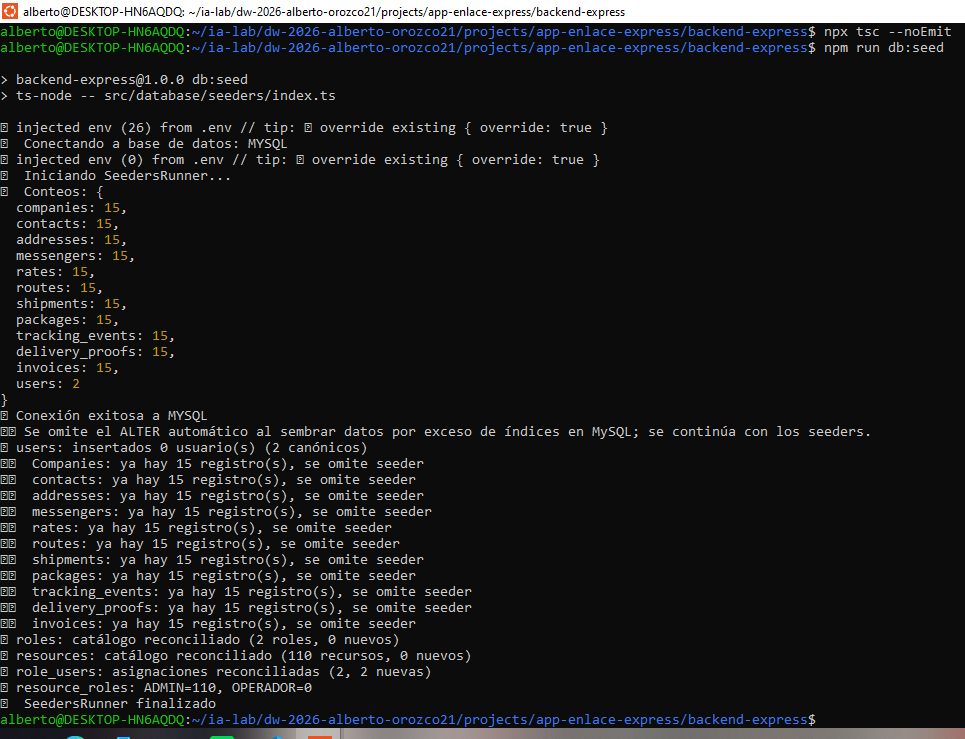

```sql
SELECT COUNT(*) FROM role_users;      -- 2 (admin→ADMIN, operador→OPERADOR)
SELECT COUNT(*) FROM resource_roles;  -- 110 si solo ADMIN tiene el catálogo completo
```

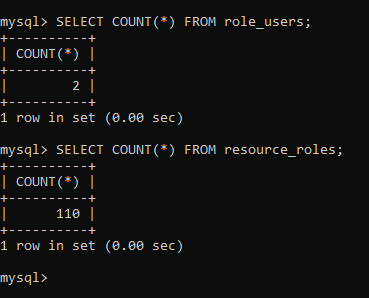

----

##  23. ISS-22 — Middlewares de acceso y las tres modalidades en rutas

**Objetivo:** materializar las tres modalidades mediante dos middlewares componibles y aplicarlos a las rutas existentes sin tocar controllers, services ni repositories.

```
OPEN            app.route(...).get(controller)
JWT             app.route(...).get(authenticate, controller)
JWT + RBAC      app.route(...).get(authenticate, authorize, controller)
```

**Bloqueado por:** ISS-21 (la matriz debe existir para que authorize tenga algo que consultar).

Criterios de aceptación (ISS-22) — consolidados

- [X] 23.1 authenticate valida el Bearer token, verifica algoritmo/issuer/audience/exp y carga el usuario activo en req.auth
- [X] 23.2 authorize resuelve (method, path) y busca concesión activa; deny by default → 403
- [X] 23.3 access/index.ts reexporta ambos middlewares
- [X] 23.4 los 11 módulos business de EnlaceExpress aplican authenticate, authorize
- [X] 23.5 documentadas las tres modalidades y qué códigos produce cada una
- [X] 23.6 sin token → 401; con token pero sin concesión → 403; con concesión → 200/201
- [X] npx tsc --noEmit OK

## 23.1 authenticate — modalidad JWT

Hace exactamente cuatro cosas, en este orden:

1. Lee el encabezado Authorization: Bearer <token> (RFC 6750). Si falta o está mal formado → 401.

2. Verifica el JWT con algoritmo, emisor y audiencia fijos (RFC 8725). Si falla → 401.

3. Carga el usuario en BD y exige status = 'active'. Si no existe o está inactivo → 401.

4. Deja la identidad en req.auth (tipado por auth-user.ts) y llama a next().

> No consulta roles ni permisos. La autorización es responsabilidad del siguiente middleware: mezclar ambas impediría tener endpoints solo-JWT.

```bash
: > src/features/auth/access/authenticate.middleware.ts
cat >> src/features/auth/access/authenticate.middleware.ts << 'EOF'
import { NextFunction, Request, Response } from "express";
import { AppError } from "../../../shared/errors/app-error";
import { sendError } from "../../../shared/http/error-response";
import { extractBearerToken, verifyAccessToken } from "../../../shared/auth/jwt";
import { UsersRepository } from "../users/users.repository";

/**
 * **MODALIDAD 2 — JWT (identidad).** Middleware de autenticación.
 *
 * Responde únicamente a la pregunta **¿quién eres?**:
 *
 *  1. Lee el token de `Authorization: Bearer <token>` (RFC 6750).
 *  2. Verifica firma, algoritmo, `iss`, `aud`, `exp` (RFC 8725).
 *  3. **Revalida contra la base de datos** que el usuario sigue existiendo y con
 *     `status = active`. Un token firmado sigue siendo válido después de
 *     desactivar la cuenta; esta revalidación hace que la desactivación tenga
 *     efecto inmediato.
 *
 * NO consulta la matriz de permisos: eso es responsabilidad de `authorize`.
 * Si todo va bien, deja la identidad en `req.auth` y cede el paso.
 *
 * Cualquier fallo se responde con **401 (no autenticado)**.
 */
const usersRepository = new UsersRepository();

export async function authenticate(
  req: Request,
  res: Response,
  next: NextFunction
): Promise<void> {
  try {
    const token = extractBearerToken(req.headers.authorization);
    if (!token) {
      throw new AppError(401, "Missing Bearer token");
    }

    const payload = verifyAccessToken(token);

    // Defensa en profundidad: `verifyAccessToken` ya garantiza que `sub` es un
    // entero positivo. Se vuelve a comprobar para que ningún cambio futuro en la
    // verificación pueda enviar un `NaN` al repositorio (500 en vez de 401).
    const userId = Number(payload.sub);
    if (!Number.isInteger(userId) || userId < 1) {
      throw new AppError(401, "Invalid or expired access token");
    }

    const user = await usersRepository.findById(userId);

    if (!user || user.status !== "active") {
      throw new AppError(401, "User is not active");
    }

    req.auth = {
      id: user.id,
      username: user.username,
      email: user.email,
      tokenId: payload.jti,
    };
    next();
  } catch (error) {
    sendError(res, error);
  }
}
EOF
```

## 23.2 authorize — modalidad JWT + RBAC

Recibe la petición, normaliza el (method, path) real y comprueba si el usuario autenticado alcanza ese recurso por el grafo:

```
req.auth.user
  → role_users (active)
  → roles (active)
  → resource_roles (active)
  → resources (active, method = req.method, path ≈ req.path)
```

Si no hay concesión → 403 (deny by default). Como la consulta se hace en cada petición, revocar un permiso tiene efecto inmediato (no hay que esperar a que caduque el token, porque los permisos no viajan en él).

```bash
: > src/features/auth/access/authorize.middleware.ts
cat >> src/features/auth/access/authorize.middleware.ts << 'EOF'
import { NextFunction, Request, Response } from "express";
import { AppError } from "../../../shared/errors/app-error";
import { sendError } from "../../../shared/http/error-response";
import { isOperationGranted, normalizePath } from "../../../shared/auth/resource-match";
import { ResourceRolesRepository } from "../resource-roles/resource-roles.repository";

/**
 * **MODALIDAD 3 — RBAC (identidad + autorización granular).** Middleware de
 * autorización.
 *
 * Debe montarse **después** de `authenticate`. Responde a la segunda pregunta:
 * *¿puede esta identidad ejecutar `method + path`?*
 *
 * Cómo resuelve la decisión:
 *  1. Toma la identidad ya resuelta en `req.auth`.
 *  2. Consulta la **cadena completa** de autorización en la base de datos
 *     (`resource_roles → roles → role_users → resources`, todos los eslabones
 *     activos) para ese `user_id`.
 *  3. Compara el par `(method, path)` de la petición con las concesiones,
 *     por patrón (`/api/shipments/:id` casa con `/api/shipments/42`).
 *
 * Reglas:
 *  - **Deny by default**: sin concesión activa que cubra la operación -> 403.
 *  - **401** si no hay identidad (falta `authenticate` o el token no valió).
 *  - **403** si hay identidad válida pero no hay permiso.
 *
 * No recibe parámetros: el recurso y la acción se derivan de la propia petición.
 * Añadir un permiso es insertar filas en la base de datos, nunca tocar el código.
 */
const resourceRolesRepository = new ResourceRolesRepository();

export async function authorize(
  req: Request,
  res: Response,
  next: NextFunction
): Promise<void> {
  try {
    if (!req.auth) {
      throw new AppError(401, "Authentication required");
    }

    const method = req.method.toUpperCase();
    const path = normalizePath(req.originalUrl);

    const granted = await resourceRolesRepository.findEffectiveForUser(req.auth.id);

    if (!isOperationGranted(granted, method, path)) {
      throw new AppError(403, `Forbidden: no grant for ${method} ${path}`);
    }

    next();
  } catch (error) {
    sendError(res, error);
  }
}
EOF
```

## 23.3 Barrel de acceso

```bash
: > src/features/auth/access/index.ts
cat >> src/features/auth/access/index.ts << 'EOF'
export * from "./authenticate.middleware";
export * from "./authorize.middleware";
EOF
```

## 23.4 Adaptación: proteger las 11 rutas de negocio con JWT + RBAC

En este backend no hay cinco features de ventas: ya están registrados once
módulos de EnlaceExpress en `src/config/index.ts`. Conserva sus handlers y añade
`authenticate, authorize` antes de cada controller en los métodos GET, POST,
PUT, PATCH y DELETE de:

`companies`, `contact`, `address`, `messenger`, `rate`, `route`, `shipment`,
`package`, `tracking-event`, `delivery-proof` e `invoice`.

Ejemplo sobre el archivo existente
`src/features/business/companies/companies.routes.ts` (el mismo patrón aplica a
los otros diez archivos; sus rutas son las que ya declaran esos módulos):

```typescript
import { authenticate, authorize } from "../../auth/access";

app.route("/api/companies")
  .get(authenticate, authorize, this.companiesController.getAll.bind(this.companiesController))
  .post(authenticate, authorize, this.companiesController.create.bind(this.companiesController));

app.route("/api/companies/:id")
  .get(authenticate, authorize, this.companiesController.getOne.bind(this.companiesController))
  .put(authenticate, authorize, this.companiesController.updatePut.bind(this.companiesController))
  .patch(authenticate, authorize, this.companiesController.updatePatch.bind(this.companiesController))
  .delete(authenticate, authorize, this.companiesController.deletePhysical.bind(this.companiesController));

app.route("/api/companies/:id/deactivate")
  .patch(authenticate, authorize, this.companiesController.deleteLogical.bind(this.companiesController));
```

No copies las rutas business del proyecto de ejemplo ni reemplaces estos archivos desde los
bloques del ejemplo. Protege cada operación explícitamente: sin token debe
responder 401; con token pero sin concesión, 403. Los recursos de `RESOURCE_CATALOG`
deben coincidir exactamente con cada método y path registrado. RBAC solo
controla operaciones; no limita qué filas puede ver o modificar cada usuario.

## 23.5 Las tres modalidades en una tabla

|Modalidad | Middleware en la ruta | Qué exige | Sin cumplir |
|----------|-----------------------|-----------|-------------|
|OPEN |	—	|nada |	—|
|JWT|	authenticate|	access token válido y usuario activo|	401|
|JWT + RBAC |	authenticate, authorize	|token válido y concesión activa de (method, path)	|401 (sin token) / 403 (sin permiso)|

|Petición |	Resultado|
|---------|----------|
|GET /api/companies sin Authorization	|401|
|GET /api/companies con token de operador	|403 hasta que se le conceda ese recurso|
|POST /api/companies con token de operador	|403 (denegación por defecto)|
|POST /api/companies con token de admin	|201 (si ADMIN tiene la concesión)|
|GET /api/companies/abc con token válido	|400 (paramId)|
|Cualquier ruta con token caducado o manipulado	|401|

## 23.6 Verificación de 401 y 403

```bash
npm run dev
```


`http://localhost:4000/api/companies` 401 — sin token

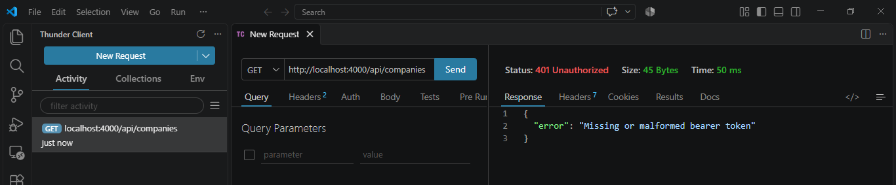


`http://localhost:4000/api/companies` 401 — token manipulado

```
- Bearer Token
Authorization: Bearer no.es.un.jwt
```

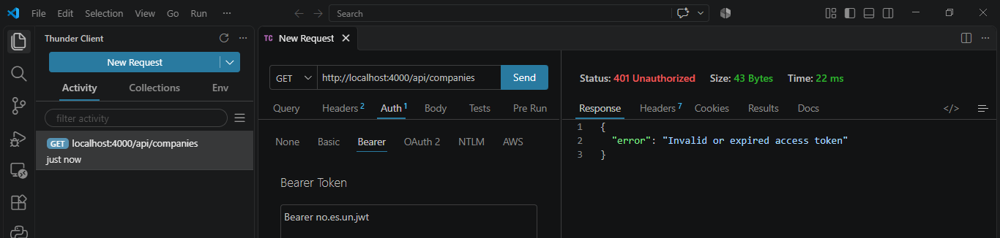

--------------

## 24. ISS-23 — Feature RefreshTokens (sesiones renovables y revocables)

**Objetivo:** persistir las sesiones como tokens opacos, de modo que un access token corto pueda renovarse mientras el usuario trabaja, y que una sesión pueda revocarse de verdad.

**Bloqueado por:** ISS-13 (authenticate es lo que permite hablar de «sesiones propias»).

Criterios de aceptación (ISS-14) — consolidados

- [X] 24.1 refresh-tokens/dto/ (refresh-token-response.dto.ts, index.ts)
- [X] 24.2 refresh-tokens.repository.ts: busca por token_hash, lista por usuario, aplica lock pesimista al rotar y revoca por familia
- [X] 24.3 refresh-tokens.service.ts: issue, rotate (con reuse detection) y revoke*
- [X] 24.4 refresh-tokens.controller.ts y refresh-tokens.routes.ts (modalidad JWT, sin authorize)
- [X] 24.5 refresh-tokens.swagger.ts
- [X] 24.6 http/sessions.get.http
- [X] npx tsc --noEmit OK

## 24.1 DTOs del feature

El service nunca devuelve la instancia de Sequelize: proyecta a un DTO plano que jamás incluye token_hash.

```bash
: > src/features/auth/refresh-tokens/dto/refresh-token-response.dto.ts
cat >> src/features/auth/refresh-tokens/dto/refresh-token-response.dto.ts << 'EOF'
import { RefreshToken, RefreshTokenI } from "../refresh-token.model";

/**
 * Respuesta HTTP de una sesión persistida (refresh token).
 *
 * `token_hash` **se omite deliberadamente**: es un artefacto de seguridad. Ni
 * siquiera su hash tiene por qué salir de la API. El `id` basta para revocar.
 */
export type RefreshTokenResponseDto = Omit<RefreshTokenI, "token_hash"> & {
  /** Derivado, no columna: `expires_at` ya pasó. */
  is_expired: boolean;
};

/** Mapper modelo -> DTO de respuesta (objeto plano; elimina `token_hash`). */
export function toRefreshTokenResponse(token: RefreshToken): RefreshTokenResponseDto {
  const { token_hash, ...safe } = token.toJSON() as RefreshTokenI & { token_hash?: string };
  return {
    ...safe,
    is_expired: new Date(token.expires_at).getTime() <= Date.now(),
  };
}
EOF
```

```bash
: > src/features/auth/refresh-tokens/dto/index.ts
cat >> src/features/auth/refresh-tokens/dto/index.ts << 'EOF'
export * from "./refresh-token-response.dto";
EOF
```

## 24.2 Repository

Tres operaciones son específicas y describen el diseño de seguridad:

|Método	|Por qué existe|
|-------|--------------|
|findByTokenHash| el token en claro no se almacena: se busca por su SHA-256|
|rotate con lock: UPDATE | la rotación es un read-modify-write; el lock evita que dos peticiones concurrentes consuman el mismo refresh token|
|revokeFamily |	la reutilización de un token ya rotado es señal de robo: se revoca toda la familia|

```bash
: > src/features/auth/refresh-tokens/refresh-tokens.repository.ts
cat >> src/features/auth/refresh-tokens/refresh-tokens.repository.ts << 'EOF'
import { CreationAttributes, Op, Transaction } from "sequelize";
import { RefreshToken } from "./refresh-token.model";

/**
 * Capa Repository del feature RefreshTokens (tabla `refresh_tokens`).
 *
 * Única que habla con Sequelize. Las consultas que participan en la rotación
 * aceptan transacción y, cuando corresponde, bloquean la fila (`FOR UPDATE`)
 * para que dos peticiones de refresh simultáneas no emitan dos tokens válidos.
 */
export class RefreshTokensRepository {
  /**
   * Busca por hash del token.
   *
   * `lock: true` añade `FOR UPDATE` dentro de la transacción: es lo que hace que
   * la rotación sea segura bajo concurrencia (solo una petición gana).
   */
  public async findByHash(
    tokenHash: string,
    transaction?: Transaction,
    lock = false
  ): Promise<RefreshToken | null> {
    return RefreshToken.findOne({
      where: { token_hash: tokenHash },
      transaction,
      ...(lock ? { lock: transaction?.LOCK.UPDATE } : {}),
    });
  }

  /** Sesiones de un usuario (activas o todas según `onlyActive`). */
  public async findAllByUser(userId: number, onlyActive = true): Promise<RefreshToken[]> {
    const where: Record<string, unknown> = { user_id: userId };
    if (onlyActive) where.status = "active";

    return RefreshToken.findAll({ where, order: [["createdAt", "DESC"]] });
  }

  /** Una sesión por PK (o `null`). */
  public async findById(id: number): Promise<RefreshToken | null> {
    return RefreshToken.findByPk(id);
  }

  /** Inserta un refresh token (alta de sesión o rotación). */
  public async create(
    data: CreationAttributes<RefreshToken>,
    transaction?: Transaction
  ): Promise<RefreshToken> {
    return RefreshToken.create(data, { transaction });
  }

  /** Persiste cambios sobre una instancia existente. */
  public async update(
    token: RefreshToken,
    data: Partial<RefreshToken>,
    transaction?: Transaction
  ): Promise<RefreshToken> {
    return token.update(data, { transaction });
  }

  /**
   * Revoca **toda la familia** de rotación.
   *
   * Se ejecuta al detectar reutilización de un token ya rotado: si un atacante
   * tiene una copia del token anterior, la sesión legítima se invalida por
   * completo y el usuario debe autenticarse de nuevo (Owasp/OAuth2: reuse
   * detection con revocación de familia).
   */
  public async revokeFamily(familyId: string, transaction?: Transaction): Promise<number> {
    const [updated] = await RefreshToken.update(
      { status: "inactive" },
      { where: { family_id: familyId, status: "active" }, transaction }
    );
    return updated;
  }

  /** Revoca todas las sesiones activas de un usuario (cierre de sesión global). */
  public async revokeAllByUser(userId: number): Promise<number> {
    const [updated] = await RefreshToken.update(
      { status: "inactive" },
      { where: { user_id: userId, status: "active" } }
    );
    return updated;
  }

  /** Elimina físicamente las sesiones ya expiradas o revocadas de un usuario. */
  public async purgeInactiveByUser(userId: number): Promise<number> {
    return RefreshToken.destroy({
      where: {
        user_id: userId,
        [Op.or]: [{ status: "inactive" }, { expires_at: { [Op.lt]: new Date() } }],
      },
    });
  }

  /** Cuenta las sesiones activas de un usuario. */
  public async countActiveByUser(userId: number): Promise<number> {
    return RefreshToken.count({ where: { user_id: userId, status: "active" } });
  }
}
EOF
```

## 24.3 Service — emitir, rotar, revocar

**Ciclo de vida:**

```
login  → emite family_id = <uuid>  +  refresh token (se guarda sha256)  +  access token (15 min)
uso    → POST /api/sesion/refresh con el refresh token
         ├─ token válido y no usado  → ROTA: el viejo pasa a `used`, nace uno nuevo (misma familia)
         └─ token ya usado           → REUSE DETECTION: se revoca la familia completa
logout → revoca el refresh token (o toda la familia)
```

|Decisión |	Motivo |
|---------|--------|
|Access token corto (15 min) |	acota la ventana de un token robado|
|Refresh token opaco y hasheado |	puede revocarse y, si roban la BD, no sirve para autenticarse|
|Rotación en cada refresh |	un refresh token es de un solo uso|
|Familia (family_id) |	permite revocar toda una cadena de sesión, no solo el último eslabón|
|Reuse detection |	un token ya consumido que reaparece implica robo -> se corta la familia entera|
|Lock pesimista al rotar |	dos refreshes simultáneos no pueden ganar los dos|

```bash
: > src/features/auth/refresh-tokens/refresh-tokens.service.ts
cat >> src/features/auth/refresh-tokens/refresh-tokens.service.ts << 'EOF'
import { Transaction } from "sequelize";
import { randomUUID } from "node:crypto";
import {
  RefreshTokenResponseDto,
  toRefreshTokenResponse,
} from "./dto";
import { RefreshTokensRepository } from "./refresh-tokens.repository";
import { RefreshToken } from "./refresh-token.model";
import { AppError } from "../../../shared/errors/app-error";
import { generateOpaqueToken, sha256Hex } from "../../../shared/auth/password";
import { withTransaction } from "../../../shared/database/with-transaction";

/** Vida útil de un refresh token (días). Configurable por entorno. */
const REFRESH_TTL_DAYS = Number(process.env.JWT_REFRESH_TTL_DAYS ?? 7);

/** Resultado de emitir una sesión nueva. */
export interface IssuedSession {
  rawToken: string;
  familyId: string;
  expiresAt: Date;
}

/**
 * Resultado de intentar rotar un refresh token.
 *
 * Se devuelve una **unión discriminada** en lugar de lanzar dentro de la
 * transacción: si se lanzara, el `rollback` desharía la revocación de la familia
 * que acabamos de escribir. El service de sesión decide el error **después** de
 * que la transacción confirme.
 */
export type RotationOutcome =
  | { kind: "rotated"; userId: number; rawToken: string; familyId: string; expiresAt: Date }
  | { kind: "invalid" }
  | { kind: "expired" }
  | { kind: "reuse"; familyId: string; revoked: number };

/**
 * Capa Service del feature RefreshTokens.
 *
 * Cubre dos responsabilidades:
 *  1. **Gestión de las sesiones propias** (listar, consultar, revocar): es la
 *     parte que se expone con la modalidad JWT, sin RBAC, porque opera solo sobre
 *     las sesiones del usuario autenticado.
 *  2. **Ciclo de vida del token** (emitir, rotar, revocar), que consume el
 *     feature `session` en login/refresh/logout.
 */
export class RefreshTokensService {
  public constructor(
    private readonly repository: RefreshTokensRepository = new RefreshTokensRepository()
  ) {}

  // ================== GESTIÓN (sesiones propias) ==================
  public async getAllMine(userId: number): Promise<RefreshTokenResponseDto[]> {
    const tokens = await this.repository.findAllByUser(userId);
    return tokens.map((token) => toRefreshTokenResponse(token));
  }

  public async getMine(userId: number, id: number): Promise<RefreshTokenResponseDto> {
    return toRefreshTokenResponse(await this.findMineOrFail(userId, id));
  }

  /** Revoca una sesión propia concreta. */
  public async revokeMine(userId: number, id: number): Promise<RefreshTokenResponseDto> {
    const token = await this.findMineOrFail(userId, id);
    await this.repository.update(token, { status: "inactive" });
    return toRefreshTokenResponse(token);
  }

  /** Revoca **todas** las sesiones propias (útil si se sospecha un robo). */
  public async revokeAllMine(userId: number): Promise<number> {
    return this.repository.revokeAllByUser(userId);
  }

  /** Purga las sesiones propias ya revocadas o expiradas. */
  public async purgeMine(userId: number): Promise<number> {
    return this.repository.purgeInactiveByUser(userId);
  }

  public async countActiveMine(userId: number): Promise<number> {
    return this.repository.countActiveByUser(userId);
  }

  // ================== CICLO DE VIDA ==================
  /** Emite una sesión nueva (alta de login). Genera un `family_id` nuevo. */
  public async issue(
    userId: number,
    deviceInfo: string | null,
    transaction?: Transaction
  ): Promise<IssuedSession> {
    const rawToken = generateOpaqueToken();
    const familyId = randomUUID();
    const expiresAt = expiryFromNow();

    await this.repository.create(
      {
        user_id: userId,
        token_hash: sha256Hex(rawToken),
        family_id: familyId,
        device_info: deviceInfo,
        expires_at: expiresAt,
        status: "active",
      },
      transaction
    );

    // El token en claro se devuelve **una sola vez**; en la base solo queda el hash.
    return { rawToken, familyId, expiresAt };
  }

  /**
   * Rota un refresh token: lo invalida y emite uno nuevo con el mismo
   * `family_id`. Todo dentro de una transacción con bloqueo de fila.
   *
   * Concurrencia: si dos peticiones presentan el mismo token, una rota y la otra
   * encuentra el token ya inactivo -> se interpreta como reutilización y se
   * revoca la familia completa.
   */
  public async rotate(rawToken: string, deviceInfo: string | null): Promise<RotationOutcome> {
    const hash = sha256Hex(rawToken);

    // El valor de retorno de la transacción se decide **dentro**, pero los
    // efectos de revocación quedan confirmados aunque el resultado final sea un
    // rechazo (por eso no se lanza aquí dentro).
    const outcome = await withTransaction<RotationOutcome>(async (t) => {
      const current = await this.repository.findByHash(hash, t, true);

      if (!current) {
        return { kind: "invalid" };
      }

      // REUSE DETECTION: el token existía pero ya no está activo (fue rotado).
      if (current.status !== "active") {
        const revoked = await this.repository.revokeFamily(current.family_id, t);
        return { kind: "reuse", familyId: current.family_id, revoked };
      }

      if (new Date(current.expires_at).getTime() <= Date.now()) {
        await this.repository.update(current, { status: "inactive" }, t);
        return { kind: "expired" };
      }

      // Rotación: el token usado se invalida y nace uno nuevo en la misma familia.
      await this.repository.update(current, { status: "inactive" }, t);

      const rawNext = generateOpaqueToken();
      const expiresAt = expiryFromNow();
      await this.repository.create(
        {
          user_id: current.user_id,
          token_hash: sha256Hex(rawNext),
          family_id: current.family_id,
          device_info: deviceInfo ?? current.device_info,
          expires_at: expiresAt,
          status: "active",
        },
        t
      );

      return {
        kind: "rotated",
        userId: current.user_id,
        rawToken: rawNext,
        familyId: current.family_id,
        expiresAt,
      };
    });

    return outcome;
  }

  /**
   * Cierra la sesión asociada a un refresh token (logout).
   *
   * Es idempotente: un token inexistente o ya revocado no es un error, porque el
   * efecto deseado (que no sirva) ya se cumple.
   */
  public async revokeByToken(rawToken: string): Promise<boolean> {
    const token = await this.repository.findByHash(sha256Hex(rawToken));
    if (!token) return false;
    if (token.status !== "active") return true;

    await this.repository.update(token, { status: "inactive" });
    return true;
  }

  // ================== HELPERS ==================
  /**
   * Busca una sesión **del propio usuario**.
   *
   * El filtro por `user_id` es la frontera de seguridad: aunque el RBAC no
   * intervenga en estas rutas, un usuario nunca puede ver ni revocar la sesión
   * de otro. Un `id` ajeno responde 404, no 403 (no se filtra su existencia).
   */
  private async findMineOrFail(userId: number, id: number): Promise<RefreshToken> {
    const token = await this.repository.findById(id);
    if (!token || token.user_id !== userId) {
      throw new AppError(404, "Session not found");
    }
    return token;
  }
}

/** `now + REFRESH_TTL_DAYS`. Ventana deslizante: cada rotación la renueva. */
function expiryFromNow(): Date {
  return new Date(Date.now() + REFRESH_TTL_DAYS * 24 * 60 * 60 * 1000);
}
EOF
```

## 24.4 Controller y rutas

A diferencia del CRUD de administración, estas rutas son modalidad JWT y sin authorize: ver y revocar las propias sesiones es un derecho derivado de estar autenticado, no una concesión de la matriz (no tendría sentido pedir un permiso para cerrar la propia sesión). Por eso tampoco figuran en el catálogo RBAC.

```bash
: > src/features/auth/refresh-tokens/refresh-tokens.controller.ts
cat >> src/features/auth/refresh-tokens/refresh-tokens.controller.ts << 'EOF'
import { Request, Response } from "express";
import { BaseController } from "../../../shared/http/base-controller";
import { requireAuthUser } from "../../../shared/auth/auth-user";
import { RefreshTokensService } from "./refresh-tokens.service";

/**
 * Capa Controller del feature RefreshTokens — **modalidad JWT**.
 *
 * Todas las operaciones actúan sobre las sesiones del usuario autenticado
 * (`req.auth.id`). No exigen RBAC: poder ver y revocar **tus propias** sesiones
 * es un derecho derivado de estar autenticado, no de tener un permiso concreto.
 *
 * Orden de operaciones (con una salvedad de enrutado, ver `refresh-tokens.routes.ts`):
 * getAll → getOne → revokeAll (literal) → revokeOne → purge.
 */
export class RefreshTokensController extends BaseController {
  public constructor(
    private readonly service: RefreshTokensService = new RefreshTokensService()
  ) {
    super();
  }

  // ================== READ ==================
  public async getAll(req: Request, res: Response): Promise<void> {
    await this.run(res, async () => {
      const sessions = await this.service.getAllMine(requireAuthUser(req).id);
      res.status(200).json({ sessions });
    });
  }

  public async getOne(req: Request, res: Response): Promise<void> {
    await this.run(res, async () => {
      const session = await this.service.getMine(requireAuthUser(req).id, this.paramId(req));
      res.status(200).json({ session });
    });
  }

  // ================== STATE (revocar) ==================
  /** Revoca **todas** las sesiones del usuario autenticado. */
  public async revokeAll(req: Request, res: Response): Promise<void> {
    await this.run(res, async () => {
      const revoked = await this.service.revokeAllMine(requireAuthUser(req).id);
      res.status(200).json({ message: "All sessions revoked", revoked });
    });
  }

  /** Revoca una sesión propia. */
  public async revokeOne(req: Request, res: Response): Promise<void> {
    await this.run(res, async () => {
      const session = await this.service.revokeMine(
        requireAuthUser(req).id,
        this.paramId(req)
      );
      res.status(200).json({ message: "Session revoked", session });
    });
  }

  // ================== PURGE ==================
  /** Purga (borrado físico) las sesiones propias ya revocadas o expiradas. */
  public async purge(req: Request, res: Response): Promise<void> {
    await this.run(res, async () => {
      const purged = await this.service.purgeMine(requireAuthUser(req).id);
      res.status(200).json({ message: "Inactive sessions purged", purged });
    });
  }
}
EOF
```

```
: > src/features/auth/refresh-tokens/refresh-tokens.routes.ts
cat >> src/features/auth/refresh-tokens/refresh-tokens.routes.ts << 'EOF'
import { Application } from "express";
import { RefreshTokensController } from "./refresh-tokens.controller";
import { authenticate } from "../access";

/**
 * Rutas del feature RefreshTokens — **modalidad 2 (JWT, sin RBAC)**.
 *
 * Todas operan sobre las **sesiones del usuario autenticado**. Ver y revocar las
 * propias sesiones es un derecho derivado de estar autenticado, no de un permiso
 * concreto; por eso no llevan `authorize` ni figuran en el catálogo de recursos.
 *
 * Nota de enrutado: `/api/sesiones/deactivate-all` es una **ruta literal** del
 * mismo verbo (`PATCH`) que la ruta parametrizada de una sola sesión
 * (`/api/sesiones/:id/deactivate`). No colisionan porque tienen distinto número
 * de segmentos, pero la literal se registra primero por claridad y para que
 * cualquier ruta literal futura siga la misma regla (Express resuelve por orden
 * de registro).
 */
export class RefreshTokensRoutes {
  public refreshTokensController: RefreshTokensController = new RefreshTokensController();

  public routes(app: Application): void {
    // getAll (sesiones propias)
    app
      .route("/api/sesiones")
      .get(
        authenticate,
        this.refreshTokensController.getAll.bind(this.refreshTokensController)
      );

    // revocar todas las sesiones propias (ruta literal: va ANTES de /:id)
    app
      .route("/api/sesiones/deactivate-all")
      .patch(
        authenticate,
        this.refreshTokensController.revokeAll.bind(this.refreshTokensController)
      );

    // getOne
    app
      .route("/api/sesiones/:id")
      .get(
        authenticate,
        this.refreshTokensController.getOne.bind(this.refreshTokensController)
      );

    // revocar una sesión propia
    app
      .route("/api/sesiones/:id/deactivate")
      .patch(
        authenticate,
        this.refreshTokensController.revokeOne.bind(this.refreshTokensController)
      );

    // purga de sesiones propias revocadas/expiradas
    app
      .route("/api/sesiones")
      .delete(authenticate, this.refreshTokensController.purge.bind(this.refreshTokensController));
  }
}
EOF
```

> **Nota de enrutado: **/api/sesiones/deactivate-all es una ruta literal del mismo verbo (PATCH) que /api/sesiones/:id/deactivate. No colisionan (distinto número de segmentos), pero la literal se registra antes por claridad y por si en el futuro se añade otra ruta literal.

## 24.5 Swagger

```bash
: > src/features/auth/refresh-tokens/refresh-tokens.swagger.ts
cat >> src/features/auth/refresh-tokens/refresh-tokens.swagger.ts << 'EOF'
import { bearerSecurity, invalidIdResponse, unauthorizedResponse } from "../../../shared/http/swagger-security";

/**
 * Documentación OpenAPI del feature RefreshTokens — **sesiones propias**.
 *
 * Modalidad: **JWT** (sin RBAC). No forman parte del catálogo de recursos: ver y
 * revocar las **propias** sesiones deriva de estar autenticado, no de un permiso
 * concedido. Un `id` de sesión ajeno responde **404** (no se filtra su existencia).
 */
export const refreshTokensSwagger = {
  tags: [
    {
      name: "Sesiones",
      description:
        "Sesiones persistidas del usuario autenticado (refresh tokens): listar, consultar y revocar — **JWT**",
    },
  ],
  paths: {
    "/api/sesiones": {
      get: {
        tags: ["Sesiones"],
        summary: "Listar mis sesiones activas",
        description: "JWT — devuelve las sesiones del usuario del token. `token_hash` nunca se expone.",
        security: bearerSecurity,
        responses: {
          "200": { description: "Sesiones propias (`{ sessions: [...] }`)" },
          "401": unauthorizedResponse,
        },
      },
      delete: {
        tags: ["Sesiones"],
        summary: "Purgar mis sesiones revocadas/expiradas",
        description: "JWT — borrado físico de las sesiones propias ya inútiles.",
        security: bearerSecurity,
        responses: {
          "200": { description: "Purga realizada (`{ message, purged }`)" },
          "401": unauthorizedResponse,
        },
      },
    },
    "/api/sesiones/deactivate-all": {
      patch: {
        tags: ["Sesiones"],
        summary: "Revocar todas mis sesiones",
        description:
          "JWT — pone `inactive` todas las sesiones propias (todos los dispositivos). " +
          "Útil ante sospecha de robo: el refresh token deja de servir de inmediato.",
        security: bearerSecurity,
        responses: {
          "200": { description: "Sesiones revocadas (`{ message, revoked }`)" },
          "401": unauthorizedResponse,
        },
      },
    },
    "/api/sesiones/{id}": {
      get: {
        tags: ["Sesiones"],
        summary: "Consultar una sesión propia",
        description: "JWT — `family_id`, `device_info`, `expires_at`, `status`. 404 si no es del usuario.",
        security: bearerSecurity,
        parameters: [{ name: "id", in: "path", required: true, schema: { type: "integer" } }],
        responses: {
          "200": { description: "Sesión (`{ session }`)" },
          "400": invalidIdResponse,
          "401": unauthorizedResponse,
          "404": { description: "No encontrada o no pertenece al usuario autenticado" },
        },
      },
    },
    "/api/sesiones/{id}/deactivate": {
      patch: {
        tags: ["Sesiones"],
        summary: "Revocar una sesión propia",
        description: "JWT — revocación lógica de una sesión concreta.",
        security: bearerSecurity,
        parameters: [{ name: "id", in: "path", required: true, schema: { type: "integer" } }],
        responses: {
          "200": { description: "Sesión revocada (`{ message, session }`)" },
          "400": invalidIdResponse,
          "401": unauthorizedResponse,
          "404": { description: "No encontrada o no pertenece al usuario autenticado" },
        },
      },
    },
  },
  components: {
    schemas: {
      Session: {
        type: "object",
        properties: {
          id: { type: "integer", example: 1 },
          user_id: { type: "integer", example: 2 },
          family_id: { type: "string", format: "uuid" },
          device_info: { type: "string", nullable: true, example: "Mozilla/5.0 ..." },
          expires_at: { type: "string", format: "date-time" },
          status: { type: "string", enum: ["active", "inactive"], example: "active" },
          is_expired: { type: "boolean", example: false },
          createdAt: { type: "string", format: "date-time" },
          updatedAt: { type: "string", format: "date-time" },
        },
      },
    },
  },
};
EOF
```

## 24.6 Pruebas HTTP

```bash
: > src/features/auth/refresh-tokens/http/sessions.get.http
cat >> src/features/auth/refresh-tokens/http/sessions.get.http << 'EOF'
### Feature RefreshTokens — SESIONES PROPIAS (modalidad JWT, sin RBAC)
### Ver y revocar las propias sesiones deriva de estar autenticado, no de un permiso.
### Un id de sesión ajeno responde 404 (no se filtra su existencia).
@baseUrl = http://localhost:4000

# @name loginOperador
POST {{baseUrl}}/api/sesion/login
Content-Type: application/json

{
  "identifier": "operador",
  "password": "Operador123!"
}

@token = {{loginOperador.response.body.$.access_token}}

### Listar mis sesiones activas (nunca expone `token_hash`)
GET {{baseUrl}}/api/sesiones
Authorization: Bearer {{token}}

### Consultar una sesión propia
GET {{baseUrl}}/api/sesiones/1
Authorization: Bearer {{token}}

### Revocar TODAS mis sesiones (ruta literal; registrar antes que /:id)
PATCH {{baseUrl}}/api/sesiones/deactivate-all
Authorization: Bearer {{token}}

### Revocar una sesión concreta
PATCH {{baseUrl}}/api/sesiones/1/deactivate
Authorization: Bearer {{token}}

### Purgar (borrado físico) mis sesiones revocadas/expiradas
DELETE {{baseUrl}}/api/sesiones
Authorization: Bearer {{token}}

### Modalidad JWT: sin token -> 401
GET {{baseUrl}}/api/sesiones
EOF
```

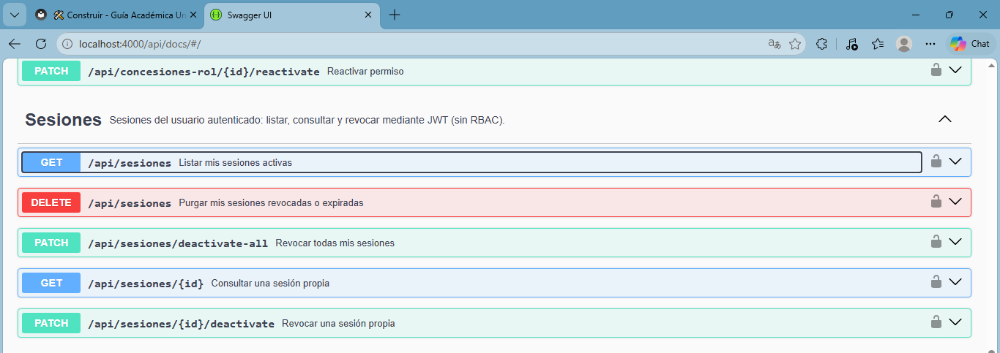

**Verificación**

```sql
-- Tras un login hay una fila `active`; tras un refresh, la vieja queda `used`.
SELECT id, user_id, family_id, status, expires_at FROM refresh_tokens ORDER BY id;
```

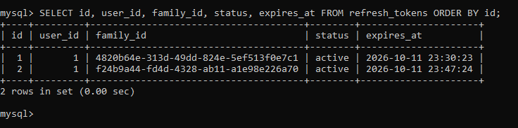

## 25. ISS-24 — Feature Session (login, refresh, logout, perfil y permisos)

**Objetivo:** exponer el punto de entrada al sistema (login), la renovación automática (refresh con rotación), la salida (logout), el perfil del usuario y sus permisos efectivos. Es el feature que demuestra que las tres modalidades conviven sin fricción.

**Bloqueado por: ISS-23.**

Criterios de aceptación (ISS-15) — consolidados
- [X] 25.1 session/dto/ (login.dto.ts, refresh-session.dto.ts, logout-session.dto.ts, session-response.dto.ts, index.ts)
- [X] 25.2 session.service.ts: login (verifica contraseña + emite sesión), refresh (rota), logout (revoca), profile, myPermissions
- [X] 25.3 session.controller.ts con this.run(res, …)
- [X] 25.4 session.routes.ts: login/refresh/logout OPEN; perfil/permisos JWT
- [X] 25.5 session.swagger.ts con security: [] en las OPEN y bearerAuth en las JWT
- [X] 25.6 archivos .http de login, refresh y perfil
- [X] 25.7 recorrido E2E que prueba OPEN → JWT → JWT + RBAC
- [X] npx tsc --noEmit OK

## 25.1 DTOs del feature

```bash
: > src/features/auth/session/dto/login.dto.ts
cat >> src/features/auth/session/dto/login.dto.ts << 'EOF'
/**
 * Datos de entrada de `POST /api/sesion/login` (modalidad OPEN).
 *
 * `identifier` acepta **usuario o correo**: la consulta de credenciales busca por
 * cualquiera de los dos, normalizando a minúsculas.
 */
export interface LoginDto {
  identifier: string;
  password: string;
}
EOF
```

```bash
: > src/features/auth/session/dto/refresh-session.dto.ts
cat >> src/features/auth/session/dto/refresh-session.dto.ts << 'EOF'
/**
 * Datos de entrada de `POST /api/sesion/refresh` (modalidad OPEN con credencial
 * de sesión).
 *
 * El refresh token viaja en el **cuerpo**, no en la cabecera `Authorization`:
 * es una credencial de sesión, no un token de acceso.
 */
export interface RefreshSessionDto {
  refresh_token: string;
}
EOF
```

```bash
: > src/features/auth/session/dto/logout-session.dto.ts
cat >> src/features/auth/session/dto/logout-session.dto.ts << 'EOF'
/**
 * Datos de entrada de `POST /api/sesion/logout`.
 *
 * Se envía el refresh token que se quiere revocar (la sesión concreta). Es
 * idempotente: repetirlo no devuelve error.
 */
export interface LogoutSessionDto {
  refresh_token: string;
}
EOF
```

```bash
: > src/features/auth/session/dto/session-response.dto.ts
cat >> src/features/auth/session/dto/session-response.dto.ts << 'EOF'
/**
 * Respuesta de `login` y `refresh`: el **par de tokens**.
 *
 * - `access_token`: JWT corto, autocontenido; viaja en `Authorization: Bearer`.
 * - `refresh_token`: token opaco larga vida; **se devuelve solo aquí**, en claro,
 *   porque el servidor guarda únicamente su hash. El cliente debe guardarlo y
 *   enviarlo a `/api/sesion/refresh` para renovar sin volver a autenticarse.
 * - `expires_in`: segundos de vida del token de acceso (para que el cliente
 *   programe la renovación *antes* de que expire).
 */
export interface SessionTokensDto {
  access_token: string;
  token_type: "Bearer";
  expires_in: number;
  refresh_token: string;
  refresh_expires_in: number;
}

/** Datos públicos del perfil propio (modalidad JWT). Nunca incluye `password`. */
export interface ProfileDto {
  id: number;
  username: string;
  email: string;
  avatar: string | null;
  status: "active" | "inactive";
}
EOF
```

```bash
: > src/features/auth/session/dto/index.ts
cat >> src/features/auth/session/dto/index.ts << 'EOF'
export * from "./login.dto";
export * from "./refresh-session.dto";
export * from "./logout-session.dto";
export * from "./session-response.dto";
EOF
```

## 25.2 Service

SessionService orquesta piezas ya construidas y no duplica su lógica:

|Método|Reutiliza | Hace |
|------|----------|------|
|login |UsersRepository.findByUsernameOrEmail, comparePassword, RefreshTokensService.issue	|autentica y abre sesión|
|refresh |	RefreshTokensService.rotate	|renueva el access token rotando el refresh|
|logout |	RefreshTokensService.revoke	|revoca la sesión|
|profile |requireAuthUser	|devuelve la identidad|
|myPermissions |UsersService.getEffectivePermissions	|lista los (method, path) vigentes|

Seguridad del login: si el usuario no existe o la contraseña no coincide, la respuesta es el mismo 401 genérico. No se distingue «usuario inexistente» de «contraseña incorrecta» (evita enumeración de usuarios). Un usuario inactive tampoco puede iniciar sesión.

```bash
: > src/features/auth/session/session.service.ts
cat >> src/features/auth/session/session.service.ts << 'EOF'
import {
  LoginDto,
  LogoutSessionDto,
  ProfileDto,
  RefreshSessionDto,
  SessionTokensDto,
} from "./dto";
import { UsersRepository } from "../users/users.repository";
import { RefreshTokensService } from "../refresh-tokens/refresh-tokens.service";
import { ResourceRolesService } from "../resource-roles/resource-roles.service";
import { EffectivePermissionDto } from "../resource-roles/dto";
import { User } from "../users/user.model";
import { AppError } from "../../../shared/errors/app-error";
import { comparePassword } from "../../../shared/auth/password";
import { ACCESS_TOKEN_TTL_SECONDS, signAccessToken } from "../../../shared/auth/jwt";

/**
 * Capa Service del feature Session — **el ciclo de vida de la sesión**.
 *
 * Cubre las dos modalidades sin autorización granular:
 *
 * | Operación | Modalidad | Escribe seguridad |
 * |---|---|---|
 * | `login`    | OPEN (valida credenciales) | `refresh_tokens` (nueva familia) |
 * | `refresh`  | OPEN (credencial de sesión) | `refresh_tokens` (rotación) |
 * | `logout`   | OPEN (credencial de sesión) | `refresh_tokens` (revocación) |
 * | `profile`  | JWT | — (solo lectura) |
 *
 * **Renovación automática.** El cliente mantiene la sesión sin volver a pedir
 * credenciales: cuando el access token está por expirar, llama a `refresh` con
 * el refresh token y recibe un par nuevo. La ventana del refresh token se
 * reinicia en cada rotación (ventana deslizante), así que un usuario que sigue
 * trabajando no se ve expulsado; uno inactivo durante toda la ventana, sí.
 */
export class SessionService {
  public constructor(
    private readonly usersRepository: UsersRepository = new UsersRepository(),
    private readonly refreshTokensService: RefreshTokensService = new RefreshTokensService(),
    private readonly resourceRolesService: ResourceRolesService = new ResourceRolesService()
  ) {}

  // ================== LOGIN (OPEN) ==================
  /**
   * Valida credenciales y abre una sesión.
   *
   * Nota de seguridad: la respuesta es **la misma** para "usuario inexistente" y
   * "contraseña incorrecta" (`Invalid credentials`) para no revelar qué usuarios
   * existen. La comparación de la contraseña ocurre en memoria; el hash nunca
   * sale de la base de datos.
   */
  public async login(body: LoginDto, deviceInfo: string | null): Promise<SessionTokensDto> {
    if (!body.identifier || !body.password) {
      throw new AppError(400, "identifier and password are required");
    }

    const user = await this.usersRepository.findByIdentifierWithPassword(body.identifier);
    if (!user || user.status !== "active") {
      throw new AppError(401, "Invalid credentials");
    }

    const matches = await comparePassword(body.password, user.password);
    if (!matches) {
      throw new AppError(401, "Invalid credentials");
    }

    const session = await this.refreshTokensService.issue(user.id, deviceInfo);
    return this.buildTokens(user, session.rawToken, session.expiresAt);
  }

  // ================== REFRESH (OPEN con credencial de sesión) ==================
  /**
   * Rota el refresh token y emite un par nuevo.
   *
   * Traduce el resultado de la rotación (que no lanza dentro de la transacción,
   * para no deshacer la revocación por reutilización) al error HTTP que
   * corresponde:
   *  - `invalid`  -> 401
   *  - `expired`  -> 401
   *  - `reuse`    -> 401 **habiendo revocado toda la familia**
   */
  public async refresh(
    body: RefreshSessionDto,
    deviceInfo: string | null
  ): Promise<SessionTokensDto> {
    if (!body.refresh_token) {
      throw new AppError(400, "refresh_token is required");
    }

    const outcome = await this.refreshTokensService.rotate(body.refresh_token, deviceInfo);

    if (outcome.kind === "invalid") {
      throw new AppError(401, "Invalid refresh token");
    }
    if (outcome.kind === "expired") {
      throw new AppError(401, "Refresh token expired");
    }
    if (outcome.kind === "reuse") {
      throw new AppError(401, "Refresh token reuse detected: session family revoked");
    }

    // Revalida la identidad: si el usuario fue desactivado, se corta la sesión
    // aunque el refresh token siga siendo válido.
    const user = await this.usersRepository.findById(outcome.userId);
    if (!user || user.status !== "active") {
      await this.refreshTokensService.revokeAllMine(outcome.userId);
      throw new AppError(401, "User is not active");
    }

    return this.buildTokens(user, outcome.rawToken, outcome.expiresAt);
  }

  // ================== LOGOUT (OPEN con credencial de sesión) ==================
  /** Revoca la sesión del refresh token presentado. Idempotente. */
  public async logout(body: LogoutSessionDto): Promise<void> {
    if (!body.refresh_token) {
      throw new AppError(400, "refresh_token is required");
    }
    await this.refreshTokensService.revokeByToken(body.refresh_token);
  }

  // ================== PERFIL (JWT) ==================
  /** Datos públicos del usuario autenticado. */
  public async profile(userId: number): Promise<ProfileDto> {
    const user = await this.usersRepository.findById(userId);
    if (!user || user.status !== "active") {
      throw new AppError(404, "User not found");
    }
    return toProfile(user);
  }

  /** Permisos efectivos del propio usuario (modalidad JWT, sin RBAC). */
  public async myPermissions(userId: number): Promise<EffectivePermissionDto[]> {
    return this.resourceRolesService.findEffectiveForUser(userId);
  }

  // ================== HELPERS ==================
  /** Arma el par de tokens: firma el access y adjunta el refresh recién emitido. */
  private buildTokens(user: User, refreshToken: string, refreshExpiresAt: Date): SessionTokensDto {
    const access = signAccessToken({ id: user.id, username: user.username });
    return {
      access_token: access.token,
      token_type: "Bearer",
      expires_in: access.expiresIn,
      refresh_token: refreshToken,
      refresh_expires_in: Math.max(
        0,
        Math.floor((refreshExpiresAt.getTime() - Date.now()) / 1000)
      ),
    };
  }
}

/** Proyección a `ProfileDto`: solo campos públicos. */
function toProfile(user: User): ProfileDto {
  return {
    id: user.id,
    username: user.username,
    email: user.email,
    avatar: user.avatar ?? null,
    status: user.status,
  };
}

/** Reexporta la constante para que el controller pueda documentar `expires_in`. */
export { ACCESS_TOKEN_TTL_SECONDS };
EOF
```

Renovación automática mientras el usuario trabaja: el cliente llama a POST /api/sesion/refresh con el refresh token cuando el access token expira. Como el refresh rota en cada uso y la familia se revoca ante reuso, la sesión puede prolongarse indefinidamente sin degradar la seguridad.

## 25.3 Controller

```bash
: > src/features/auth/session/session.controller.ts
cat >> src/features/auth/session/session.controller.ts << 'EOF'
import { Request, Response } from "express";
import { BaseController } from "../../../shared/http/base-controller";
import { requireAuthUser } from "../../../shared/auth/auth-user";
import { LoginDto, LogoutSessionDto, RefreshSessionDto } from "./dto";
import { SessionService } from "./session.service";

/**
 * Capa Controller del feature Session.
 *
 * Mezcla las dos modalidades base:
 *  - `login`, `refresh` y `logout` son **OPEN** (no hay identidad previa; la
 *    credencial va en el cuerpo);
 *  - `profile` y `myPermissions` son **JWT** (la identidad la resolvió
 *    `authenticate` antes de llegar aquí).
 */
export class SessionController extends BaseController {
  public constructor(
    private readonly service: SessionService = new SessionService()
  ) {
    super();
  }

  // ================== OPEN ==================
  /** Inicia sesión: credenciales -> par de tokens. */
  public async login(req: Request, res: Response): Promise<void> {
    await this.run(res, async () => {
      const tokens = await this.service.login(req.body as LoginDto, deviceInfo(req));
      res.status(200).json(tokens);
    });
  }

  /** Renueva el access token rotando el refresh token. */
  public async refresh(req: Request, res: Response): Promise<void> {
    await this.run(res, async () => {
      const tokens = await this.service.refresh(req.body as RefreshSessionDto, deviceInfo(req));
      res.status(200).json(tokens);
    });
  }

  /** Cierra la sesión del refresh token presentado. */
  public async logout(req: Request, res: Response): Promise<void> {
    await this.run(res, async () => {
      await this.service.logout(req.body as LogoutSessionDto);
      res.status(200).json({ message: "Session closed" });
    });
  }

  // ================== JWT ==================
  /** Perfil del usuario autenticado. */
  public async profile(req: Request, res: Response): Promise<void> {
    await this.run(res, async () => {
      const user = await this.service.profile(requireAuthUser(req).id);
      res.status(200).json({ user });
    });
  }

  /** Permisos efectivos del usuario autenticado. */
  public async myPermissions(req: Request, res: Response): Promise<void> {
    await this.run(res, async () => {
      const permissions = await this.service.myPermissions(requireAuthUser(req).id);
      res.status(200).json({ permissions });
    });
  }
}

/** `device_info` de auditoría a partir del encabezado `User-Agent`. */
function deviceInfo(req: Request): string | null {
  const value = req.headers["user-agent"];
  if (!value) return null;
  return String(value).slice(0, 500);
}
EOF
```

## 25.4 Rutas — las tres modalidades en un solo archivo

|Ruta	|Modalidad|	Middleware|
|-------|---------|-----------|
|POST /api/sesion/login	|OPEN|	—|
|POST /api/sesion/refresh	|OPEN (credencial de sesión)|	—|
|POST /api/sesion/logout	|OPEN (credencial de sesión)|	—|
|GET /api/sesion/perfil	|JWT	|authenticate|
|GET /api/permisos|	JWT	|authenticate|

Ninguna lleva authorize: la autorización granular no aplica a los puntos de acceso previos a la matriz. GET /api/permisos devuelve, eso sí, los permisos efectivos del usuario autenticado —la misma consulta que usa el middleware authorize—, lo que lo hace ideal para depurar el RBAC.

```bash
: > src/features/auth/session/session.routes.ts
cat >> src/features/auth/session/session.routes.ts << 'EOF'
import { Application } from "express";
import { SessionController } from "./session.controller";
import { authenticate } from "../access";

/**
 * Rutas del feature Session — **las tres modalidades en un solo archivo**.
 *
 * | Ruta | Modalidad | Middleware |
 * |---|---|---|
 * | `POST /api/sesion/login`   | OPEN | — |
 * | `POST /api/sesion/refresh` | OPEN (credencial de sesión) | — |
 * | `POST /api/sesion/logout`  | OPEN (credencial de sesión) | — |
 * | `GET  /api/sesion/perfil`  | JWT | `authenticate` |
 * | `GET  /api/permisos`       | JWT | `authenticate` |
 *
 * Ninguna lleva `authorize`: la autorización granular no aplica a los puntos de
 * acceso previos o ajenos a la matriz de permisos. `/api/permisos` devuelve, eso
 * sí, **los permisos efectivos** del usuario autenticado (la misma consulta que
 * usa el middleware `authorize`), lo que lo hace ideal para depurar el RBAC.
 */
export class SessionRoutes {
  public sessionController: SessionController = new SessionController();

  public routes(app: Application): void {
    // login (OPEN)
    app
      .route("/api/sesion/login")
      .post(this.sessionController.login.bind(this.sessionController));

    // refresh (OPEN + refresh token)
    app
      .route("/api/sesion/refresh")
      .post(this.sessionController.refresh.bind(this.sessionController));

    // logout (OPEN + refresh token)
    app
      .route("/api/sesion/logout")
      .post(this.sessionController.logout.bind(this.sessionController));

    // perfil (JWT)
    app
      .route("/api/sesion/perfil")
      .get(authenticate, this.sessionController.profile.bind(this.sessionController));

    // permisos efectivos del usuario autenticado (JWT)
    app
      .route("/api/permisos")
      .get(authenticate, this.sessionController.myPermissions.bind(this.sessionController));
  }
}
EOF
```

## 25.5 Swagger

refresh y logout son OPEN de facto: no exigen access token, sino el refresh token en el cuerpo. Por eso declaran security: [] y documentan su propio cuerpo.

```bash
: > src/features/auth/session/session.swagger.ts
cat >> src/features/auth/session/session.swagger.ts << 'EOF'
import {
  bearerSecurity,
  openSecurity,
  unauthorizedResponse,
} from "../../../shared/http/swagger-security";

/**
 * Documentación OpenAPI del feature Session — **las tres modalidades juntas**.
 *
 * - `login` / `refresh` / `logout`: **OPEN**. Nota didáctica: OPEN no significa
 *   "sin base de datos", significa "sin identidad previa". El login **lee** el
 *   hash de `users` y **escribe** `refresh_tokens`; el refresh **rota** el token.
 * - `perfil` / `permisos`: **JWT**.
 *
 * La respuesta de `login` y `refresh` es el **par de tokens**. El `refresh_token`
 * se devuelve en claro **solo aquí**: el servidor guarda únicamente su SHA-256.
 */
export const sessionSwagger = {
  tags: [
    { name: "Sesión", description: "Login, renovación, cierre y perfil — **OPEN** + **JWT**" },
  ],
  paths: {
    "/api/sesion/login": {
      post: {
        tags: ["Sesión"],
        summary: "Iniciar sesión (OPEN)",
        description:
          "Modalidad **OPEN**. Valida usuario/correo + contraseña y abre una sesión: " +
          "emite un access token corto (JWT) y un refresh token persistido como hash, con un `family_id` nuevo. " +
          "La respuesta es idéntica para usuario inexistente y contraseña incorrecta (no se enumeran usuarios).",
        security: openSecurity,
        requestBody: {
          required: true,
          content: {
            "application/json": { schema: { $ref: "#/components/schemas/Login" } },
          },
        },
        responses: {
          "200": { description: "Par de tokens (`access_token`, `refresh_token`, `expires_in`)" },
          "400": { description: "Faltan `identifier` o `password`" },
          "401": { description: "Credenciales inválidas o usuario inactivo" },
        },
      },
    },
    "/api/sesion/refresh": {
      post: {
        tags: ["Sesión"],
        summary: "Renovar el access token (OPEN con credencial de sesión)",
        description:
          "Modalidad **OPEN**. **Rota** el refresh token: invalida el presentado y emite uno nuevo con el mismo " +
          "`family_id`. Si se presenta un token ya rotado, se interpreta como **reutilización** y se revoca toda la " +
          "familia (401). La rotación es atómica y con bloqueo de fila, así que dos peticiones simultáneas no emiten " +
          "dos tokens válidos. La ventana del refresh se reinicia en cada rotación: renovación automática mientras el usuario trabaja.",
        security: openSecurity,
        requestBody: {
          required: true,
          content: {
            "application/json": { schema: { $ref: "#/components/schemas/RefreshToken" } },
          },
        },
        responses: {
          "200": { description: "Par de tokens nuevo (`access_token` + `refresh_token` rotado)" },
          "400": { description: "Falta `refresh_token`" },
          "401": {
            description:
              "Token inválido, expirado o **reutilizado** (en este último caso, la familia queda revocada)",
          },
        },
      },
    },
    "/api/sesion/logout": {
      post: {
        tags: ["Sesión"],
        summary: "Cerrar sesión (OPEN con credencial de sesión)",
        description:
          "Modalidad **OPEN**. Revoca el refresh token presentado. Idempotente: repetirlo no devuelve error. " +
          "El access token sigue siendo válido hasta expirar (vida corta); para invalidación inmediata, desactivar el usuario.",
        security: openSecurity,
        requestBody: {
          required: true,
          content: {
            "application/json": { schema: { $ref: "#/components/schemas/RefreshToken" } },
          },
        },
        responses: {
          "200": { description: "Sesión cerrada (`{ message }`)" },
          "400": { description: "Falta `refresh_token`" },
        },
      },
    },
    "/api/sesion/perfil": {
      get: {
        tags: ["Sesión"],
        summary: "Perfil del usuario autenticado (JWT)",
        description:
          "Modalidad **JWT**. El middleware `authenticate` valida el token y **revalida en la base** que el usuario " +
          "sigue activo: desactivar una cuenta invalida sus tokens al instante (401).",
        security: bearerSecurity,
        responses: {
          "200": { description: "Perfil (`{ user }`) — nunca incluye `password`" },
          "401": unauthorizedResponse,
        },
      },
    },
    "/api/permisos": {
      get: {
        tags: ["Sesión"],
        summary: "Mis permisos efectivos (JWT)",
        description:
          "Modalidad **JWT**. Ejecuta la misma consulta que el middleware `authorize` " +
          "(`resource_roles → roles → role_users → resources`, todos los eslabones activos) y devuelve el par " +
          "`(method, path)` de cada permiso. Es la herramienta para **depurar el RBAC**: lo que aparece aquí es exactamente lo que autoriza.",
        security: bearerSecurity,
        responses: {
          "200": { description: "Permisos efectivos (`{ permissions: [...] }`)" },
          "401": unauthorizedResponse,
        },
      },
    },
  },
  components: {
    schemas: {
      Login: {
        type: "object",
        required: ["identifier", "password"],
        properties: {
          identifier: { type: "string", example: "admin", description: "`username` o `email`" },
          password: { type: "string", format: "password", example: "Admin123!" },
        },
      },
      RefreshToken: {
        type: "object",
        required: ["refresh_token"],
        properties: {
          refresh_token: { type: "string", example: "9f2c... (opaco, no es un JWT)" },
        },
      },
      SessionTokens: {
        type: "object",
        properties: {
          access_token: { type: "string", description: "JWT firmado (HS256), vida corta" },
          token_type: { type: "string", example: "Bearer" },
          expires_in: { type: "integer", example: 900, description: "Segundos de vida del access token" },
          refresh_token: { type: "string", description: "Token opaco; se devuelve solo en login/refresh" },
          refresh_expires_in: { type: "integer", example: 604800 },
        },
      },
    },
  },
};
EOF
```

## 25.6 Pruebas HTTP

```bash
: > src/features/auth/session/http/session.login.http
cat >> src/features/auth/session/http/session.login.http << 'EOF'
### Feature Session — LOGIN (modalidad OPEN)
### OPEN = sin identidad previa. Aquí SÍ se consulta `users` (hash) y se escribe `refresh_tokens`.
@baseUrl = http://localhost:4000

# @name loginAdmin
POST {{baseUrl}}/api/sesion/login
Content-Type: application/json

{
  "identifier": "admin",
  "password": "Admin123!"
}

### Credenciales de ejemplo
# admin  / <clave-local> -> rol ADMIN (catálogo completo)
# operador / <clave-local> -> rol OPERADOR (0 hasta aprobar matriz)

### Login por correo (mismo endpoint, `identifier` acepta username o email)
POST {{baseUrl}}/api/sesion/login
Content-Type: application/json

{
  "identifier": "admin@enlace-express.local",
  "password": "Admin123!"
}

### Respuesta 401 - credenciales inválidas (mismo mensaje que "usuario inexistente")
POST {{baseUrl}}/api/sesion/login
Content-Type: application/json

{
  "identifier": "admin",
  "password": "password-incorrecta"
}

### Guarda los tokens para los demás archivos .http
@adminAccessToken = {{loginAdmin.response.body.$.access_token}}
@adminRefreshToken = {{loginAdmin.response.body.$.refresh_token}}
@expiresIn = {{loginAdmin.response.body.$.expires_in}}
EOF
```

```bash
: > src/features/auth/session/http/session.refresh.http
cat >> src/features/auth/session/http/session.refresh.http << 'EOF'
### Feature Session — REFRESH (modalidad OPEN con credencial de sesión)
### Renovación automática: el cliente llama aquí cuando el access token está por expirar.
### ROTACIÓN: el refresh token enviado queda inválido y se emite uno nuevo (misma familia).
### REUSE DETECTION: si se reenvía un token ya rotado -> 401 y se revoca toda la familia.
@baseUrl = http://localhost:4000

### 1) Login para obtener el par inicial
# @name loginAdmin
POST {{baseUrl}}/api/sesion/login
Content-Type: application/json

{
  "identifier": "admin",
  "password": "Admin123!"
}

### 2) Refresh: devuelve access_token nuevo + refresh_token ROTADO
# @name refresh
POST {{baseUrl}}/api/sesion/refresh
Content-Type: application/json

{
  "refresh_token": "{{loginAdmin.response.body.$.refresh_token}}"
}

### 3) El access token nuevo sirve en una ruta JWT
GET {{baseUrl}}/api/sesion/perfil
Authorization: Bearer {{refresh.response.body.$.access_token}}

### 4) REUSE: reenviar el token viejo -> 401 y la familia queda revocada
POST {{baseUrl}}/api/sesion/refresh
Content-Type: application/json

{
  "refresh_token": "{{loginAdmin.response.body.$.refresh_token}}"
}

### 5) Consecuencia: el token rotado (paso 2) tampoco sirve ya -> 401
POST {{baseUrl}}/api/sesion/refresh
Content-Type: application/json

{
  "refresh_token": "{{refresh.response.body.$.refresh_token}}"
}
EOF
```

```bash
: > src/features/auth/session/http/session.profile.http
cat >> src/features/auth/session/http/session.profile.http << 'EOF'
### Feature Session — LOGOUT y PERFIL (OPEN con credencial de sesión + JWT)
@baseUrl = http://localhost:4000

# @name loginOperador
POST {{baseUrl}}/api/sesion/login
Content-Type: application/json

{
  "identifier": "operador",
  "password": "Operador123!"
}

### PERFIL — modalidad JWT: `authenticate` valida el token y REVALIDA en la BD
### que el usuario sigue activo (desactivarlo invalida sus tokens al instante).
GET {{baseUrl}}/api/sesion/perfil
Authorization: Bearer {{loginOperador.response.body.$.access_token}}

### MIS PERMISOS — modalidad JWT: misma consulta RBAC que usa `authorize`
### Consulta los permisos efectivos del usuario; OPERADOR parte sin concesiones.
GET {{baseUrl}}/api/permisos
Authorization: Bearer {{loginOperador.response.body.$.access_token}}

### Sin token -> 401 (no autenticado)
GET {{baseUrl}}/api/sesion/perfil

### LOGOUT — modalidad OPEN con credencial de sesión. Idempotente.
POST {{baseUrl}}/api/sesion/logout
Content-Type: application/json

{
  "refresh_token": "{{loginOperador.response.body.$.refresh_token}}"
}

### Ya no se puede renovar -> 401
POST {{baseUrl}}/api/sesion/refresh
Content-Type: application/json

{
  "refresh_token": "{{loginOperador.response.body.$.refresh_token}}"
}
EOF
```

## 25.7 Verificación end-to-end para EnlaceExpress

Después de implementar auth y preparar una base de datos local, inicia el
backend con `npm run dev`. Los ejemplos de credenciales son solo fixtures de
desarrollo; usa los valores reales configurados para tu entorno.


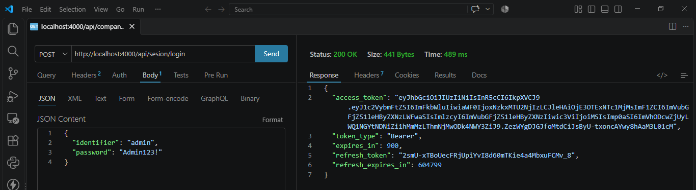

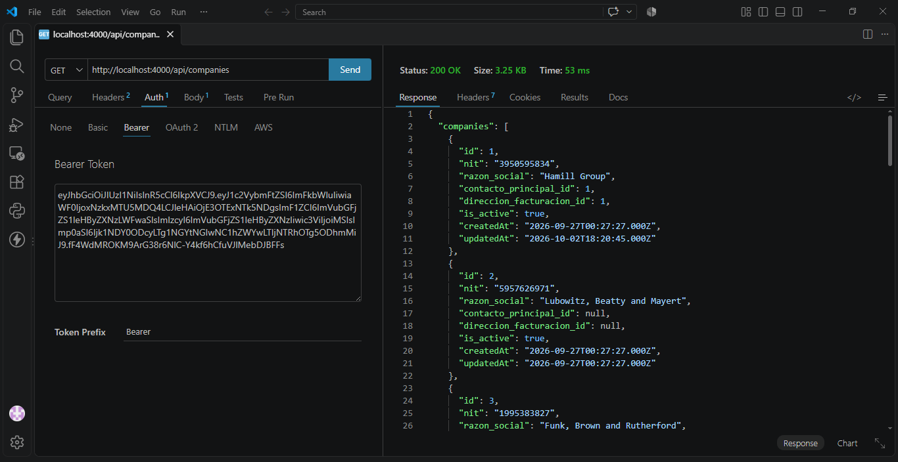

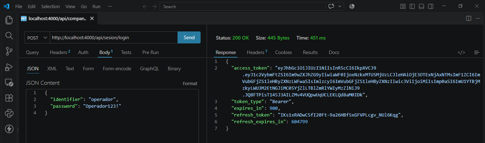

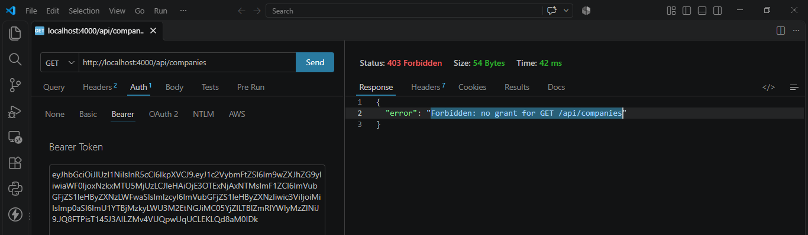

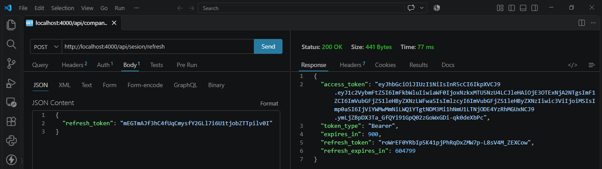

|Comprobación|Esperado|
|---|---|
|`POST /api/sesion/login` con credenciales locales válidas|200 + access token y refresh token|
|`GET /api/companies` sin token|401|
|`GET /api/companies` con permiso activo|200|
|Operación sin concesión RBAC|403|
|Reutilizar un refresh token rotado/revocado|401|

La política de `OPERADOR` no está definida por el proyecto todavía. Para
comprobar 403, asigna temporalmente un usuario autenticado a un rol sin la
concesión probada; no presupongas permisos del proyecto de ejemplo.

## Cierre del laboratorio (backend completo)

## Las tres modalidades — mapa de rutas EnlaceExpress

|Modalidad|Middlewares|Rutas|
|---|---|---|
|OPEN|—|`POST /api/sesion/login`, `/api/sesion/refresh`, `/api/sesion/logout`, Swagger|
|JWT|`authenticate`|Perfil y permisos efectivos; gestión de sesiones propias (`/api/sesiones...`)|
|JWT + RBAC|`authenticate`, `authorize`|Administración auth (`usuarios`, `roles`, `recursos`, asignaciones y concesiones) y los once módulos business: `/api/companies`, `/api/contacts`, `/api/address`, `/api/messengers`, `/api/rates`, `/api/routes`, `/api/shipments`, `/api/packages`, `/api/tracking_events`, `/api/delivery_proofs`, `/api/invoices`|

Cada combinación de método y path es un recurso individual; verifica que los
paths del catálogo coincidan con las rutas registradas. Las rutas de sesión
OPEN/JWT no forman parte del catálogo RBAC.

```
src
├── config
│   └── index.ts
├── database
│   ├── db.ts
│   └── seeders
│       ├── counts.ts
│       └── index.ts
├── features
│   ├── auth
│   │   ├── access
│   │   │   ├── authenticate.middleware.ts
│   │   │   ├── authorize.middleware.ts
│   │   │   └── index.ts
│   │   ├── rbac.associations.ts
│   │   ├── refresh-tokens
│   │   │   ├── dto
│   │   │   │   ├── index.ts
│   │   │   │   └── refresh-token-response.dto.ts
│   │   │   ├── http
│   │   │   │   └── sessions.get.http
│   │   │   ├── refresh-token.model.ts
│   │   │   ├── refresh-tokens.controller.ts
│   │   │   ├── refresh-tokens.repository.ts
│   │   │   ├── refresh-tokens.routes.ts
│   │   │   ├── refresh-tokens.service.ts
│   │   │   └── refresh-tokens.swagger.ts
│   │   ├── resource-roles
│   │   │   ├── dto
│   │   │   │   ├── create-resource-role.dto.ts
│   │   │   │   ├── effective-permission.dto.ts
│   │   │   │   ├── index.ts
│   │   │   │   ├── list-resource-roles.dto.ts
│   │   │   │   └── resource-role-response.dto.ts
│   │   │   ├── http
│   │   │   │   └── resource-roles.grant.http
│   │   │   ├── resource-role.model.ts
│   │   │   ├── resource-roles.controller.ts
│   │   │   ├── resource-roles.repository.ts
│   │   │   ├── resource-roles.routes.ts
│   │   │   ├── resource-roles.seeder.ts
│   │   │   ├── resource-roles.service.ts
│   │   │   └── resource-roles.swagger.ts
│   │   ├── resources
│   │   │   ├── dto
│   │   │   │   ├── create-resource.dto.ts
│   │   │   │   ├── index.ts
│   │   │   │   ├── patch-resource.dto.ts
│   │   │   │   ├── resource-response.dto.ts
│   │   │   │   └── update-resource.dto.ts
│   │   │   ├── http
│   │   │   │   ├── resources.get.http
│   │   │   │   └── resources.write.http
│   │   │   ├── resource-catalog.ts
│   │   │   ├── resource.model.ts
│   │   │   ├── resources.controller.ts
│   │   │   ├── resources.repository.ts
│   │   │   ├── resources.routes.ts
│   │   │   ├── resources.seeder.ts
│   │   │   ├── resources.service.ts
│   │   │   └── resources.swagger.ts
│   │   ├── role-users
│   │   │   ├── dto
│   │   │   │   ├── create-role-user.dto.ts
│   │   │   │   ├── index.ts
│   │   │   │   └── role-user-response.dto.ts
│   │   │   ├── http
│   │   │   │   └── role-users.assign.http
│   │   │   ├── role-user.model.ts
│   │   │   ├── role-users.controller.ts
│   │   │   ├── role-users.repository.ts
│   │   │   ├── role-users.routes.ts
│   │   │   ├── role-users.seeder.ts
│   │   │   ├── role-users.service.ts
│   │   │   └── role-users.swagger.ts
│   │   ├── roles
│   │   │   ├── dto
│   │   │   │   ├── create-role.dto.ts
│   │   │   │   ├── index.ts
│   │   │   │   ├── patch-role.dto.ts
│   │   │   │   ├── role-response.dto.ts
│   │   │   │   └── update-role.dto.ts
│   │   │   ├── http
│   │   │   │   ├── roles.get.http
│   │   │   │   └── roles.write.http
│   │   │   ├── role.model.ts
│   │   │   ├── roles.controller.ts
│   │   │   ├── roles.repository.ts
│   │   │   ├── roles.routes.ts
│   │   │   ├── roles.seeder.ts
│   │   │   ├── roles.service.ts
│   │   │   └── roles.swagger.ts
│   │   ├── session
│   │   │   ├── dto
│   │   │   │   ├── index.ts
│   │   │   │   ├── login.dto.ts
│   │   │   │   ├── logout-session.dto.ts
│   │   │   │   ├── refresh-session.dto.ts
│   │   │   │   └── session-response.dto.ts
│   │   │   ├── http
│   │   │   │   ├── session.e2e.http
│   │   │   │   ├── session.login.http
│   │   │   │   ├── session.profile.http
│   │   │   │   └── session.refresh.http
│   │   │   ├── session.controller.ts
│   │   │   ├── session.routes.ts
│   │   │   ├── session.service.ts
│   │   │   └── session.swagger.ts
│   │   └── users
│   │       ├── dto
│   │       │   ├── change-password.dto.ts
│   │       │   ├── create-user.dto.ts
│   │       │   ├── index.ts
│   │       │   ├── patch-user.dto.ts
│   │       │   ├── update-user.dto.ts
│   │       │   └── user-response.dto.ts
│   │       ├── http
│   │       │   ├── users.get.http
│   │       │   └── users.write.http
│   │       ├── user.model.ts
│   │       ├── users.controller.ts
│   │       ├── users.repository.ts
│   │       ├── users.routes.ts
│   │       ├── users.seeder.ts
│   │       ├── users.service.ts
│   │       └── users.swagger.ts
│   └── business
│       ├── address
│       │   ├── address.associations.ts
│       │   ├── address.controller.ts
│       │   ├── address.model.ts
│       │   ├── address.routes.ts
│       │   ├── address.seeder.ts
│       │   ├── address.swagger.ts
│       │   └── http
│       │       ├── addresses.create.http
│       │       ├── addresses.delete.http
│       │       ├── addresses.get.http
│       │       └── addresses.update.http
│       ├── companies
│       │   ├── companies.controller.ts
│       │   ├── companies.model.ts
│       │   ├── companies.routes.ts
│       │   ├── companies.seeder.ts
│       │   ├── companies.swagger.ts
│       │   ├── company.associations.ts
│       │   └── http
│       │       ├── companies.create.http
│       │       ├── companies.get.http
│       │       ├── companies.update.http
│       │       └── companiess.delete.http
│       ├── contact
│       │   ├── contact.associations.ts
│       │   ├── contact.controller.ts
│       │   ├── contact.model.ts
│       │   ├── contact.routes.ts
│       │   ├── contact.seeder.ts
│       │   ├── contact.swagger.ts
│       │   └── http
│       │       ├── contacts.create.http
│       │       ├── contacts.delete.http
│       │       ├── contacts.get.http
│       │       └── contacts.update.http
│       ├── delivery-proof
│       │   ├── delivery-proof.associations.ts
│       │   ├── delivery-proof.controller.ts
│       │   ├── delivery-proof.model.ts
│       │   ├── delivery-proof.routes.ts
│       │   ├── delivery-proof.seeder.ts
│       │   ├── delivery-proof.swagger.ts
│       │   └── http
│       │       ├── delivery_proofs.create.http
│       │       ├── delivery_proofs.delete.http
│       │       ├── delivery_proofs.get.http
│       │       └── delivery_proofs.update.http
│       ├── invoice
│       │   ├── http
│       │   │   ├── invoices.create.http
│       │   │   ├── invoices.delete.http
│       │   │   ├── invoices.get.http
│       │   │   └── invoices.update.http
│       │   ├── invoice.associations.ts
│       │   ├── invoice.controller.ts
│       │   ├── invoice.model.ts
│       │   ├── invoice.routes.ts
│       │   ├── invoice.seeder.ts
│       │   └── invoice.swagger.ts
│       ├── messenger
│       │   ├── http
│       │   │   ├── messengers.create.http
│       │   │   ├── messengers.delete.http
│       │   │   ├── messengers.get.http
│       │   │   └── messengers.update.http
│       │   ├── messenger.controller.ts
│       │   ├── messenger.model.ts
│       │   ├── messenger.routes.ts
│       │   ├── messenger.seeder.ts
│       │   └── messenger.swagger.ts
│       ├── package
│       │   ├── http
│       │   │   ├── packages.create.http
│       │   │   ├── packages.delete.http
│       │   │   ├── packages.get.http
│       │   │   └── packages.update.http
│       │   ├── package.associations.ts
│       │   ├── package.controller.ts
│       │   ├── package.model.ts
│       │   ├── package.routes.ts
│       │   ├── package.seeder.ts
│       │   └── package.swagger.ts
│       ├── rate
│       │   ├── http
│       │   │   ├── rates.create.http
│       │   │   ├── rates.delete.http
│       │   │   ├── rates.get.http
│       │   │   └── rates.update.http
│       │   ├── rate.controller.ts
│       │   ├── rate.model.ts
│       │   ├── rate.routes.ts
│       │   ├── rate.seeder.ts
│       │   └── rate.swagger.ts
│       ├── route
│       │   ├── http
│       │   │   ├── routes.create.http
│       │   │   ├── routes.delete.http
│       │   │   ├── routes.get.http
│       │   │   └── routes.update.http
│       │   ├── route.associations.ts
│       │   ├── route.controller.ts
│       │   ├── route.model.ts
│       │   ├── route.routes.ts
│       │   ├── route.seeder.ts
│       │   └── route.swagger.ts
│       ├── shipment
│       │   ├── http
│       │   │   ├── shipments.create.http
│       │   │   ├── shipments.delete.http
│       │   │   ├── shipments.get.http
│       │   │   └── shipments.update.http
│       │   ├── shipment.associations.ts
│       │   ├── shipment.controller.ts
│       │   ├── shipment.model.ts
│       │   ├── shipment.routes.ts
│       │   ├── shipment.seeder.ts
│       │   └── shipment.swagger.ts
│       └── tracking-event
│           ├── http
│           │   ├── tracking_events.create.http
│           │   ├── tracking_events.delete.http
│           │   ├── tracking_events.get.http
│           │   └── tracking_events.update.http
│           ├── tracking-event.associations.ts
│           ├── tracking-event.controller.ts
│           ├── tracking-event.model.ts
│           ├── tracking-event.routes.ts
│           ├── tracking-event.seeder.ts
│           └── tracking-event.swagger.ts
├── routes
│   └── index.ts
├── server.ts
├── shared
│   ├── auth
│   │   ├── auth-user.ts
│   │   ├── jwt.ts
│   │   ├── password.ts
│   │   └── resource-match.ts
│   ├── database
│   │   └── with-transaction.ts
│   ├── errors
│   │   └── app-error.ts
│   └── http
│       ├── base-controller.ts
│       ├── error-response.ts
│       └── swagger-security.ts
└── swagger
    └── index.ts
```