# Bitacora de creación del backend utilizando Express

## 1. ISS-00 — Requisitos previos

**Objetivo:** entorno listo para el laboratorio.  
**Bloqueado por:** ninguno.

### Criterios de aceptación (ISS-00)

- [X] `node -v` muestra v20+ (lab: v24.x)

- [X] `npm -v` responde

- [X] Motor de BD accesible (MySQL recomendado para el primer `sync`)

### Pasos

```bash
node -v
npm -v
```

### Verificación del ISS

```bash
node -v && npm -v
```

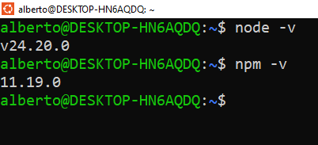

---

## 2. ISS-01 — Esqueleto del proyecto

**Objetivo:** proyecto npm + TypeScript + Express con estructura `features/` y servidor HTTP base.
**Bloqueado por:** ISS-00.

### Criterios de aceptación (ISS-01)

- [X] **2.1** Existe `package.json` con `"type": "commonjs"` y scripts `build` / `dev`
- [X] **2.2** Árbol `src/` con `config`, `database/seeders`, `routes`, `features/business/companies`
- [X] **2.3** Dependencias Express/TS instaladas
- [X] **2.4** Existe `tsconfig.json` (`rootDir: ./src`, `outDir: ./dist`, `strict: true`)
- [X] **2.5** Existen `src/server.ts` y `src/config/index.ts` (esqueleto App)
- [X] `npx tsc --noEmit` sin errores al cerrar el ISS

---

## 2.1 Inicializar npm y scripts

```bash
mkdir backend-express
cd backend-express
npm init -y
mkdir -p docs
```

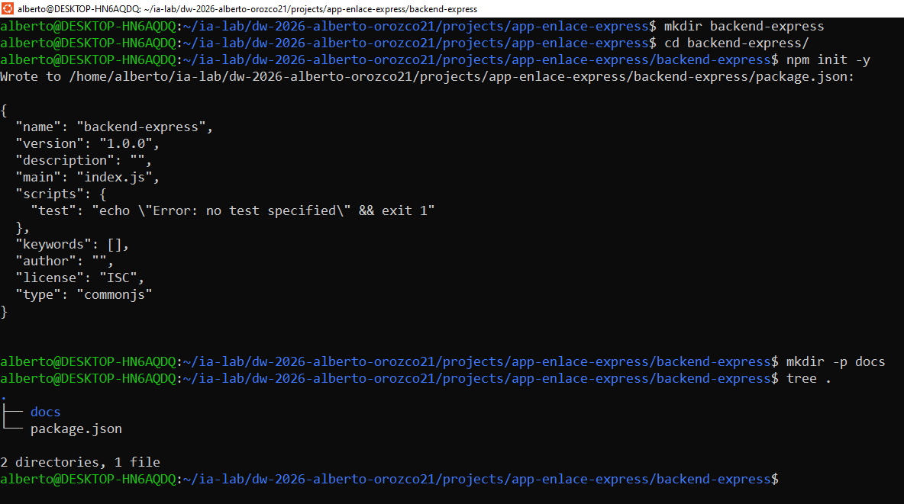

**PARCHE** — `package.json` **ya existe** (lo creó `npm init -y`).

- **Dentro de** `"scripts"`: deja solo (o añade) `build` y `dev` como abajo.
- **Debajo de** `"license"`: asegúrate de `"type": "commonjs"`.

```json
{
  "scripts": {
    "build": "tsc",
    "dev": "nodemon --watch src --ext ts --exec ts-node -- src/server.ts"
  },
  "type": "commonjs"
}
```

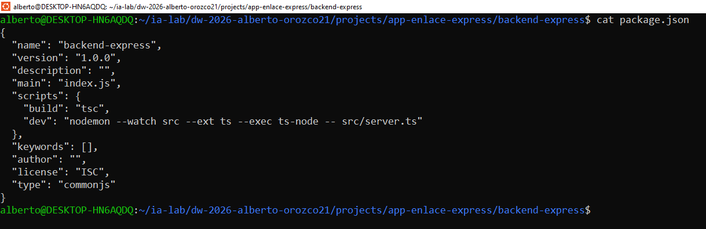

```bash
node -e "const p=require('./package.json'); console.log(p.scripts)"
```

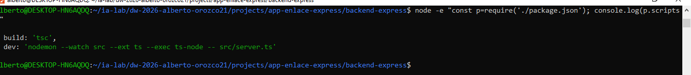

---

## 2.2 Estructura de carpetas (features)

```bash
mkdir -p \
  src/config \
  src/database/seeders \
  src/routes \
  src/features/business/companies
```

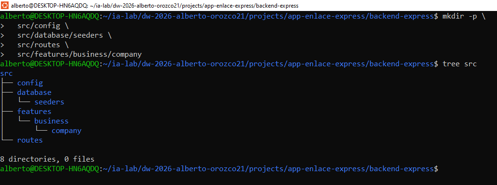

```text
src/
├── config/
├── database/
│   └── seeders/          # solo carpeta (ISS-02 §3.3); runner en ISS-04
├── routes/
├── features/
│   └── business/
│       └── companies/      # más features en ISS-06…16
└── server.ts             # §2.5
```

| Carpeta | Uso |
|---------|-----|
| `features/business/<entidad>/` | model + controller + routes (+ seeder, swagger, http, associations) |
| `database/seeders/` | counts + SeedersRunner (`npm run db:seed`) |
| `routes/index.ts` | Agregador de features |
| `config/` · `database/` | Arranque e infraestructura |

---

## 2.3 Dependencias base (Express + TypeScript)

```bash
npm install express@^5.2.1 cors@^2.8.6 dotenv@^17.4.2 morgan@^1.12.1

npm install -D typescript@~5.9.2 ts-node@^10.9.2 nodemon@^3.1.14 \
  @types/node@^22.20.3 @types/express@^5.0.6 \
  @types/cors@^2.8.19 @types/morgan@^1.9.10
```

```bash
npm ls --depth=0
```

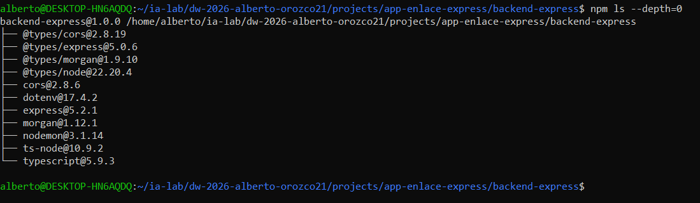

---

## 2.4 TypeScript (`tsconfig.json`)

```bash
: > tsconfig.json
cat >> tsconfig.json << 'EOF'
{
  "compilerOptions": {
    "rootDir": "./src",
    "outDir": "./dist",
    "module": "commonjs",
    "target": "ES2020",
    "lib": ["ES2020"],
    "types": ["node"],
    "esModuleInterop": true,
    "resolveJsonModule": true,
    "sourceMap": true,
    "strict": true,
    "skipLibCheck": true,
    "moduleDetection": "force",
    "isolatedModules": true,
    "forceConsistentCasingInFileNames": true
  },
  "include": ["src/**/*"],
  "exclude": ["node_modules", "dist"]
}
EOF
```

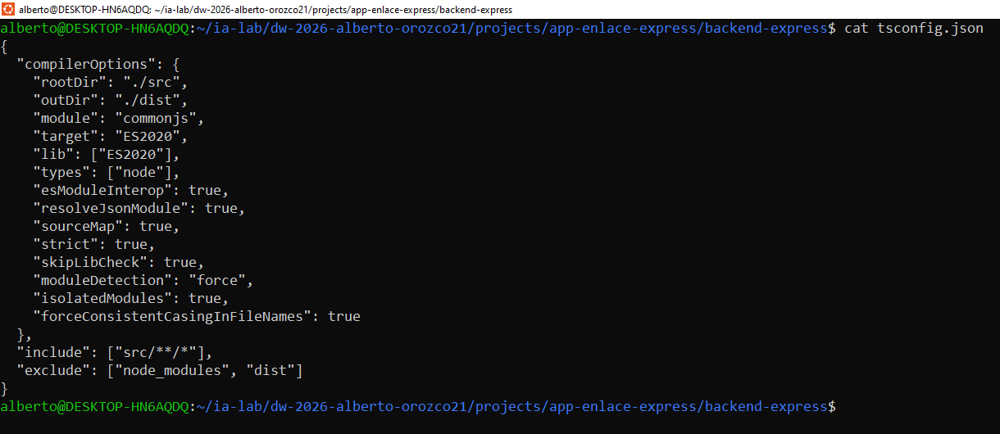

---

## 2.5 Servidor y App (esqueleto HTTP)

### 2.5.1 `src/server.ts`

```bash
: > src/server.ts
cat >> src/server.ts << 'EOF'
import { App } from './config/index';

async function main() {
    const app = new App();
    await app.listen();
}

main();
EOF
```

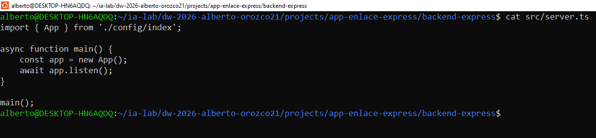

### 2.5.2 `src/config/index.ts` (esqueleto)

```bash
: > src/config/index.ts
cat >> src/config/index.ts << 'EOF'
import dotenv from "dotenv";
import express, { Application } from "express";
import morgan from "morgan";
var cors = require("cors");

dotenv.config();

export class App {
  public app: Application;

  constructor(private port?: number | string) {
    this.app = express();
    this.settings();
    this.middlewares();
    this.routes();
    this.dbConnection();
  }

  private settings(): void {
    this.app.set('port', this.port || process.env.PORT || 4000);
  }

  private middlewares(): void {
    this.app.use(morgan('dev'));
    this.app.use(cors());
    this.app.use(express.json());
    this.app.use(express.urlencoded({ extended: false }));
  }

  private routes(): void {
    // ISS-03 §4.3
  }

  private async dbConnection(): Promise<void> {
    // ISS-02 / ISS-03
  }

  async listen() {
    await this.app.listen(this.app.get('port'));
    console.log(`🚀 Servidor ejecutándose en puerto ${this.app.get('port')}`);
  }
}
EOF
```

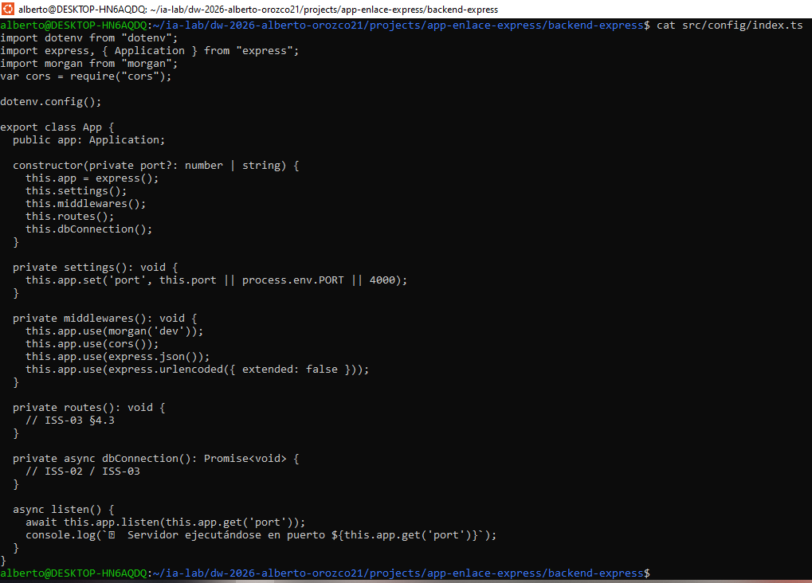

### Verificación del ISS-01

```bash
npx tsc --noEmit
find src -type f | sort
```

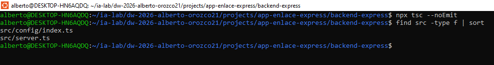

### Cierre del ISS

```bash
npm run dev
```

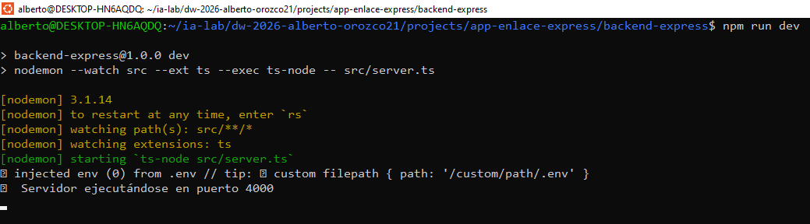

> El servidor debe arrancar sin error. Detenerlo con Ctrl+C antes de continuar.

---

## 3. ISS-02 — Infraestructura de base de datos

**Objetivo:** drivers + `.env` + módulo Sequelize + carpeta `seeders/`.
**Bloqueado por:** ISS-01.

### Criterios de aceptación (ISS-02)

- [X] **3.1** Paquetes Sequelize/drivers instalados; existe `.env` con `DB_ENGINE` y bloques de motores
- [X] **3.2** Existe `src/database/db.ts` exportando `sequelize`, `getDatabaseInfo`, `testConnection`
- [X] **3.3** Existe carpeta `src/database/seeders/` **sin** lógica implementada aún
- [X] `npx tsc --noEmit` OK

---

## 3.1 Drivers Sequelize y `.env`

```bash
npm install sequelize@^6.37.8 mysql2@^3.24.4 pg@^8.23.0 pg-hstore@^2.3.4 \
  tedious@^20.0.0 oracledb@^7.0.1
npm install -D @types/sequelize@^6.12.0
```

```bash
: > .env
cat >> .env << 'EOF'
PORT=4000

# Variable para seleccionar el motor de base de datos
DB_ENGINE=mysql

# --- MYSQL ---
DB_MYSQL_HOST=localhost
DB_MYSQL_PORT=3306
DB_MYSQL_USERNAME=root
DB_MYSQL_PASSWORD=AlbertoMySQL3306
DB_MYSQL_NAME=express

# --- POSTGRES ---
DB_POSTGRES_HOST=localhost
DB_POSTGRES_PORT=5433
DB_POSTGRES_USERNAME=alberto
DB_POSTGRES_PASSWORD=PostgreSQL5433
DB_POSTGRES_NAME=express

# --- MSSQL (SQL Server) ---
DB_MSSQL_HOST=localhost
DB_MSSQL_PORT=1433
DB_MSSQL_USERNAME=sa
DB_MSSQL_PASSWORD=sqlServer1433
DB_MSSQL_NAME=express

# --- ORACLE ---
DB_ORACLE_HOST=localhost
DB_ORACLE_PORT=1521
DB_ORACLE_USERNAME=system
DB_ORACLE_PASSWORD=OracleXe1521
DB_ORACLE_NAME=express
DB_ORACLE_CONNECT_STRING=localhost:1521/XEPDB1
EOF
```

```bash
test -f .env && grep DB_ENGINE .env
npm ls sequelize mysql2 --depth=0
```

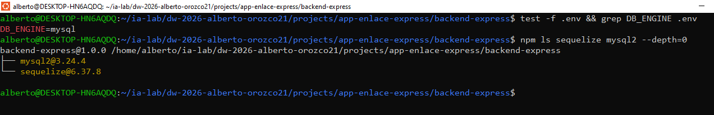

---

## 3.2 Configuración Sequelize (`database/db.ts`)

```bash
: > src/database/db.ts
cat >> src/database/db.ts << 'EOF'
import { Sequelize } from "sequelize";
import dotenv from "dotenv";

dotenv.config();

interface DatabaseConfig {
  dialect: string;
  host: string;
  username: string;
  password: string;
  database: string;
  port: number;
}

const dbConfigurations: Record<string, DatabaseConfig> = {
  mysql: {
    dialect: "mysql",
    host: process.env.MYSQL_HOST || "localhost",
    username: process.env.MYSQL_USER || "root",
    password: process.env.MYSQL_PASSWORD || "",
    database: process.env.MYSQL_NAME || "test",
    port: parseInt(process.env.MYSQL_PORT || "3306")
  },
  postgres: {
    dialect: "postgres",
    host: process.env.POSTGRES_HOST || "localhost",
    username: process.env.POSTGRES_USER || "postgres",
    password: process.env.POSTGRES_PASSWORD || "",
    database: process.env.POSTGRES_NAME || "test",
    port: parseInt(process.env.POSTGRES_PORT || "5432")
  }
};

const selectedEngine = process.env.DB_ENGINE || "mysql";
const selectedConfig = dbConfigurations[selectedEngine];

if (!selectedConfig) {
  throw new Error(`Motor de base de datos no soportado: ${selectedEngine}`);
}

console.log(`🔌 Conectando a base de datos: ${selectedEngine.toUpperCase()}`);

export const sequelize = new Sequelize(
  selectedConfig.database,
  selectedConfig.username,
  selectedConfig.password,
  {
    host: selectedConfig.host,
    port: selectedConfig.port,
    dialect: selectedConfig.dialect as any,
    logging: process.env.NODE_ENV === 'development' ? console.log : false,
    pool: {
      max: 5,
      min: 0,
      acquire: 30000,
      idle: 10000
    }
  }
);

export const getDatabaseInfo = () => {
  return {
    engine: selectedEngine,
    config: selectedConfig,
    connectionString: `${selectedConfig.dialect}://${selectedConfig.username}@${selectedConfig.host}:${selectedConfig.port}/${selectedConfig.database}`
  };
};

export const testConnection = async (): Promise<boolean> => {
  try {
    await sequelize.authenticate();
    console.log(`✅ Conexión exitosa a ${selectedEngine.toUpperCase()}`);
    return true;
  } catch (error) {
    console.error(`❌ Error de conexión a ${selectedEngine.toUpperCase()}:`, error);
    return false;
  }
};
EOF
```

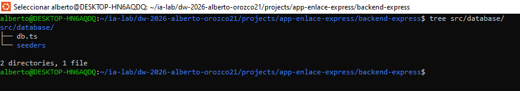

---

## 3.3 Carpeta seeders (reservada)

```bash
touch src/database/seeders/.gitkeep
```

> La lógica de seeders (runner + counts) llega en ISS-04.

### Cierre del ISS

```bash
npm run dev
```

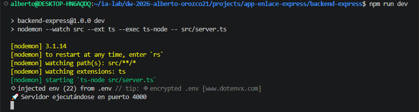

> El servidor debe arrancar sin error (sin BD conectada aún es esperado si no hay motor disponible). Detenerlo con Ctrl+C.

## 4. ISS-03 — Feature Company

**Objetivo:** primera feature de negocio: modelo, controller/routes CRUD completo, carpeta `http/` y cableado en `routes/index.ts` + `config/index.ts`. Es la entidad base del dominio (no tiene FKs propias todavía — `contacto_principal_id` y `direccion_facturacion_id` se agregan más adelante por PARCHE en ISS-08, cuando existan `Contacto` y `Direccion`).  
**Bloqueado por:** ISS-02.

### Criterios de aceptación (ISS-03)

- [X] **4.1** Modelo `companies.model.ts` (`is_active` boolean + `timestamps: true`)
- [X] **4.2** Controller + routes: getAll, getOne, create, update PUT/PATCH, delete físico y lógico
- [X] **4.3** Carpeta `http/` con get, create, update, delete
- [X] **4.4** Cableado en `routes/index.ts` + `config/index.ts` (import modelo + `sync`)
- [X] Con BD: `npm run dev` → conexión OK + sync OK + tabla `companies`

---

```bash
mkdir -p \
  src/features/business/companies/http
```

## 4.1 Modelo companies

```bash
: > src/features/business/companies/companies.model.ts
cat >> src/features/business/companies/companies.model.ts << 'EOF'
import { DataTypes, Model } from "sequelize";
import { sequelize } from "../../../database/db";

export interface CompanyI {
  id?: number;
  nit: string;
  razon_social: string;
  is_active?: boolean;
  createdAt?: Date;
  updatedAt?: Date;
}

export class Company extends Model {
  public id!: number;
  public nit!: string;
  public razon_social!: string;
  public is_active!: boolean;
  public readonly createdAt!: Date;
  public readonly updatedAt!: Date;
}

Company.init(
  {
    nit: {
      type: DataTypes.STRING,
      allowNull: false,
      unique: true,
    },
    razon_social: {
      type: DataTypes.STRING,
      allowNull: false,
    },
    is_active: {
      type: DataTypes.BOOLEAN,
      allowNull: true,
      defaultValue: false,
    },
  },
  {
    sequelize,
    modelName: "Companies",
    tableName: "companies",
    timestamps: true,
  }
);
EOF
```

---

## 4.2 Controller + routes (CRUD completo)

### 4.2.1 Controller

```bash
: > src/features/business/companies/companies.controller.ts
cat >> src/features/business/companies/companies.controller.ts << 'EOF'
import { Request, Response } from "express";
import { Company, CompanyI } from "./companies.model";

function paramId(req: Request): number {
  const raw = req.params.id;
  const value = Array.isArray(raw) ? raw[0] : raw;
  return Number(value);
}

export class CompaniesController {
  // ================== READ ==================
  public async getAll(req: Request, res: Response) {
    try {
      const companies = await Company.findAll({
        where: { is_active: true },
      });
      res.status(200).json({ companies });
    } catch (error) {
      res.status(500).json({ error: "Error fetching Companies", detail: String(error) });
    }
  }

  public async getOne(req: Request, res: Response) {
    try {
      const id = paramId(req);
      const companies = await Company.findByPk(id);
      if (!companies) {
        res.status(404).json({ error: "Company not found" });
        return;
      }
      res.status(200).json({ companies });
    } catch (error) {
      res.status(500).json({ error: "Error fetching Company", detail: String(error) });
    }
  }

  // ================== CREATE ==================
  public async create(req: Request, res: Response) {
    try {
      const body = req.body as CompanyI;


      const companies = await Company.create({
        nit: body.nit,
        razon_social: body.razon_social,
        is_active: body.is_active ?? true,
      });
      res.status(201).json({ companies });
    } catch (error) {
      res.status(500).json({ error: "Error creating Company", detail: String(error) });
    }
  }

  // ================== UPDATE ==================
  public async updatePut(req: Request, res: Response) {
    try {
      const id = paramId(req);
      const body = req.body as CompanyI;
      const companies = await Company.findByPk(id);
      if (!companies) {
        res.status(404).json({ error: "Company not found" });
        return;
      }


      await companies.update({
        nit: body.nit,
        razon_social: body.razon_social,
        is_active: body.is_active ?? companies.is_active,
      });

      res.status(200).json({ companies });
    } catch (error) {
      res.status(500).json({ error: "Error updating Company (PUT)", detail: String(error) });
    }
  }

  public async updatePatch(req: Request, res: Response) {
    try {
      const id = paramId(req);
      const body = req.body as Partial<CompanyI>;
      const companies = await Company.findByPk(id);
      if (!companies) {
        res.status(404).json({ error: "Company not found" });
        return;
      }

      await companies.update(body);
      res.status(200).json({ companies });
    } catch (error) {
      res.status(500).json({ error: "Error updating Company (PATCH)", detail: String(error) });
    }
  }

  // ================== DELETE ==================
  /** Eliminacion fisica */
  public async deletePhysical(req: Request, res: Response) {
    try {
      const id = paramId(req);
      const companies = await Company.findByPk(id);
      if (!companies) {
        res.status(404).json({ error: "Company not found" });
        return;
      }
      await companies.destroy();
      res.status(200).json({ message: "Company permanently deleted", id });
    } catch (error) {
      res.status(500).json({ error: "Error deleting Company", detail: String(error) });
    }
  }

  /** Eliminacion logica -> is_active = false */
  public async deleteLogical(req: Request, res: Response) {
    try {
      const id = paramId(req);
      const companies = await Company.findByPk(id);
      if (!companies) {
        res.status(404).json({ error: "Company not found" });
        return;
      }
      await companies.update({ is_active: false });
      res.status(200).json({
        message: "Company deactivated (logical delete)",
        companies,
      });
    } catch (error) {
      res.status(500).json({ error: "Error deactivating Company", detail: String(error) });
    }
  }
}
EOF
```

### 4.2.1 Routes

```bash
: > src/features/business/companies/companies.routes.ts
cat >> src/features/business/companies/companies.routes.ts << 'EOF'
import { Application } from "express";
import { CompaniesController } from "./companies.controller";

export class CompaniesRoutes {
  public companiesController: CompaniesController = new CompaniesController();

  public routes(app: Application): void {
    // ================== RUTAS SIN AUTENTICACION / SIN MIDDLEWARE JWT ==================

    // getAll
    app
      .route("/api/companies")
      .get(this.companiesController.getAll.bind(this.companiesController));

    // getOne
    app
      .route("/api/companies/:id")
      .get(this.companiesController.getOne.bind(this.companiesController));

    // create
    app
      .route("/api/companies")
      .post(this.companiesController.create.bind(this.companiesController));

    // update (PUT / PATCH)
    app
      .route("/api/companies/:id")
      .put(this.companiesController.updatePut.bind(this.companiesController))
      .patch(this.companiesController.updatePatch.bind(this.companiesController));

    // delete fisico
    app
      .route("/api/companies/:id")
      .delete(this.companiesController.deletePhysical.bind(this.companiesController));

    // delete logico
    app
      .route("/api/companies/:id/deactivate")
      .patch(this.companiesController.deleteLogical.bind(this.companiesController));
  }
}
EOF
```

## 4.3 HTTP

**GET**

```bash
: > src/features/business/companies/http/companies.get.http
cat >> src/features/business/companies/http/companies.get.http << 'EOF'
### Feature Companies — GET ALL / GET ONE
### Leyenda: SIN AUTH (sin middleware JWT / sin autenticacion)
@baseUrl = http://localhost:4000
@id = 1

# @name getAllCompanies
GET {{baseUrl}}/api/companies

###

# @name getOneEmpresa
GET {{baseUrl}}/api/companies/{{id}}
EOF
```

**CREATE**

```bash
: > src/features/business/companies/http/companies.create.http
cat >> src/features/business/companies/http/companies.create.http << 'EOF'
### Feature Companies — CREATE
### Leyenda: SIN AUTH (sin middleware JWT / sin autenticacion)
@baseUrl = http://localhost:4000

# @name createCompany
POST {{baseUrl}}/api/companies
Content-Type: application/json

{
  "nit": "Ejemplo nit",
  "razon_social": "Ejemplo razon_social",
  "is_active": true
}
EOF
```

**UPDATE**

```bash
: > src/features/business/companies/http/companies.update.http
cat >> src/features/business/companies/http/companies.update.http << 'EOF'
### Feature Company — UPDATE (PUT) / UPDATE (PATCH)
### Leyenda: SIN AUTH (sin middleware JWT / sin autenticacion)
@baseUrl = http://localhost:4000
@id = 1

# @name updateCompanyPut
PUT {{baseUrl}}/api/companies/{{id}}
Content-Type: application/json

{
  "nit": "Ejemplo nit",
  "razon_social": "Ejemplo razon_social",
  "is_active": true
}

###

# @name updateCompanyPatch
PATCH {{baseUrl}}/api/companies/{{id}}
Content-Type: application/json

{
  "razon_social": "Ejemplo razon_social"
}
EOF
```

**DELETE**

```bash
: > src/features/business/companies/http/companiess.delete.http
cat >> src/features/business/companies/http/companiess.delete.http << 'EOF'
### Feature Company — DELETE fisico / DELETE logico (is_active = false)
### Leyenda: SIN AUTH (sin middleware JWT / sin autenticacion)
@baseUrl = http://localhost:4000
@id = 1

# @name deleteCompanyPhysical
DELETE {{baseUrl}}/api/companies/{{id}}

###

# @name deleteCompanyLogical
PATCH {{baseUrl}}/api/companies/{{id}}/deactivate
EOF
```

---

## 4.4 Agregador Routes + cableado en Config

```bash
: > src/routes/index.ts
cat >> src/routes/index.ts << 'EOF'
import { CompaniesRoutes } from "../features/business/companies/companies.routes";

export class Routes {
  public companiesRoutes: CompaniesRoutes = new CompaniesRoutes();
}
EOF
```
**PARCHE** — `src/config/index.ts` **ya existe** (ISS-01, esqueleto).

1. **Debajo de** `var cors = require("cors");` **añadir**:

```ts
import { sequelize, getDatabaseInfo, testConnection } from "../database/db";
import "../features/business/companies/companies.model";
import { Routes } from "../routes/index";
```

2. **Dentro de** `export class App`, **debajo de** `public app: Application;` **añadir**:

```ts
  public routePrv: Routes = new Routes();
```

3. **Dentro de** `routes()`, **reemplazar** el comentario `// ISS-03 §4.3` por:

```ts
    this.routePrv.companiesRoutes.routes(this.app);
```

4. **Dentro de** `dbConnection()`, **reemplazar** el comentario `// ISS-02 / ISS-03` por:

```ts
    try {
      const dbInfo = getDatabaseInfo();
      console.log(`🔗 Intentando conectar a: ${dbInfo.engine.toUpperCase()}`);

      const isConnected = await testConnection();
      if (!isConnected) {
        throw new Error(`No se pudo conectar a la base de datos ${dbInfo.engine.toUpperCase()}`);
      }

      // alter: true actualiza columnas faltantes (ej. createdAt/updatedAt tras timestamps: true).
      // force: false no recrea tablas; no borra datos. En producción preferir migraciones.
      await sequelize.sync({ force: false, alter: true });
      console.log(`📦 Base de datos sincronizada exitosamente`);
    } catch (error) {
      console.error("❌ Error al conectar con la base de datos:", error);
      process.exit(1);
    }
```

### Verificación

```bash
test -d src/features/business/companies/http && echo HTTP_FOLDER_OK
curl -s http://localhost:4000/api/companies
```

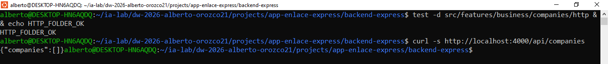

### Cierre del ISS
```bash
npm run dev
```

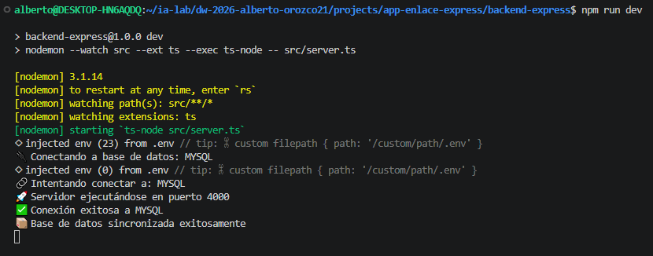

> Sync OK y tabla `companies` (con `createdAt` / `updatedAt`). Detenerlo con Ctrl+C antes de continuar.

## 5. ISS-04 — Seeders con Faker (feature + runner externo)

**Objetivo:** datos falsos por feature (Faker) y un orquestador externo que ejecuta todos los seeders enviando la cantidad por entidad.  
**Bloqueado por:** ISS-03.

### Criterios de aceptación (ISS-04)

- [ ] **5.1** `features/business/companies/companies.seeder.ts` con `@faker-js/faker`, idempotente
- [ ] **5.2** `database/seeders/index.ts` (SeedersRunner) + `database/seeders/counts.ts`
- [ ] Script `npm run db:seed` funciona; cantidad configurable por CLI/env

---

## 5.1 Seeder dentro del feature Companies

```bash
npm install -D @faker-js/faker@^10.6.0
```

```bash
: > src/features/business/companies/companies.seeder.ts
cat >> src/features/business/companies/companies.seeder.ts << 'EOF'
import { faker } from "@faker-js/faker";
import { Company } from "./companies.model";


/**
 * Seeder del feature Companies (datos falsos con @faker-js/faker).
 * Se invoca desde `src/database/seeders` (SeedersRunner), no desde la App.
 *
 * Idempotente: si ya hay filas, no vuelve a insertar.
 */
export async function seedCompanies(count: number): Promise<number> {
  if (count <= 0) {
    console.log("\u23ed\ufe0f  Companies: count=0, se omite");
    return 0;
  }

  const existing = await Company.count();
  if (existing > 0) {
    console.log(`\u23ed\ufe0f  Companies: ya hay ${existing} registro(s), se omite seeder`);
    return 0;
  }


  const rows = Array.from({ length: count }, () => ({
      nit: faker.string.numeric(10),
      razon_social: faker.company.name(),
      is_active: true,
  }));

  await Company.bulkCreate(rows);
  console.log(`\u2705 Companies: insertados ${count} registro(s) falsos`);
  return count;
}
EOF
```

---

## 5.2 SeedersRunner + conteos por entidad

```bash
: > src/database/seeders/counts.ts
cat >> src/database/seeders/counts.ts << 'EOF'
export type SeedCounts = {
  Companies: number;
};

export const DEFAULT_SEED_COUNTS: SeedCounts = {
  Companies: 15,
};

export function resolveSeedCounts(argv: string[] = process.argv.slice(2)): SeedCounts {
  const counts: SeedCounts = { ...DEFAULT_SEED_COUNTS };

  const envCompanies = process.env.SEED_COMPANIES;
  if (envCompanies !== undefined && envCompanies !== "") {
    counts.Companies = Number(envCompanies);
  }

  for (const arg of argv) {
    const m = arg.match(/^--([a-zA-Z_]+)=(\d+)$/);
    if (!m) continue;
    const key = m[1] as keyof SeedCounts;
    const value = Number(m[2]);
    if (key in counts) {
      counts[key] = value;
    }
  }

  return counts;
}
EOF
```

```bash
: > src/database/seeders/index.ts
cat >> src/database/seeders/index.ts << 'EOF'
import dotenv from "dotenv";
import { sequelize, testConnection } from "../db";
import "../../features/business/companies/companies.model";
import { seedCompanies } from "../../features/business/companies/companies.seeder";
import { resolveSeedCounts } from "./counts";

dotenv.config();

/**
 * SeedersRunner — ejecuta TODOS los seeders de features, en orden de dependencias
 * (padres antes que hijos): empresa -> contacto -> direccion -> mensajero -> tarifa
 * -> ruta -> envio -> paquete -> evento_tracking -> prueba_entrega -> factura.
 *
 * Uso:
 *   npm run db:seed
 *   npm run db:seed -- --empresas=20
 *   SEED_EMPRESAS=5 npm run db:seed
 */
export async function runAllSeeders(): Promise<void> {
  const counts = resolveSeedCounts();
  console.log("🌱 Iniciando SeedersRunner...");
  console.log("📊 Conteos:", counts);

  const ok = await testConnection();
  if (!ok) {
    throw new Error("No hay conexión a la base de datos");
  }

  await sequelize.sync({ force: false, alter: true });

  // Orden: business (padres → hijos)
  await seedCompanies(counts.Companies);

  console.log("🌱 SeedersRunner finalizado");
}

if (require.main === module) {
  runAllSeeders()
    .then(async () => {
      await sequelize.close();
      process.exit(0);
    })
    .catch(async (err) => {
      console.error("❌ Error en seeders:", err);
      await sequelize.close();
      process.exit(1);
    });
}
EOF
```

**PARCHE** — `package.json` **ya existe**.

**Dentro de** `"scripts"`, **debajo de** `"dev": "..."`, **añadir**:

```json
    "db:seed": "ts-node -- src/database/seeders/index.ts"
```

### Verificación
```bash
npm run db:seed
npm run db:seed -- --empresas=20
SEED_EMPRESAS=5 npm run db:seed
```

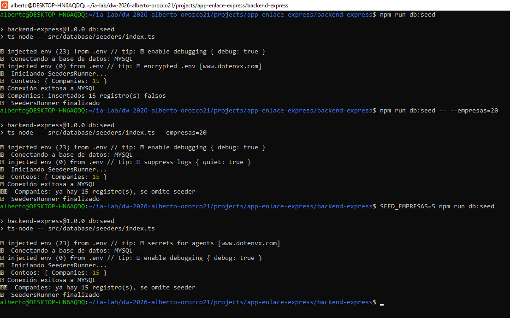

**Al agregar otra entidad (patrón, repetido en cada ISS siguiente):**

1. Archivo nuevo `features/.../<entidad>.seeder.ts`.
2. **PARCHE** `counts.ts`: añadir clave dentro de `SeedCounts` / `DEFAULT_SEED_COUNTS`.
3. **PARCHE** `database/seeders/index.ts`: añadir import + llamada `await seedX(counts.x);` debajo de la anterior.

### Cierre del ISS
```bash
npm run dev
```

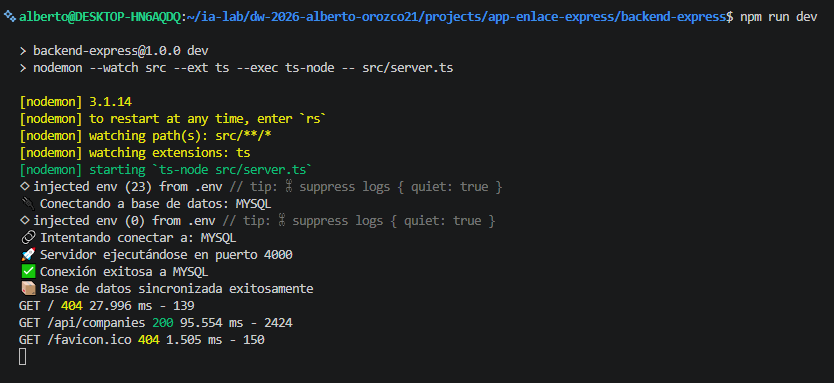

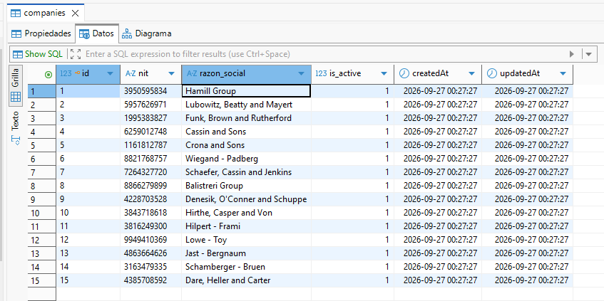

## 6. ISS-05 — Swagger / OpenAPI (feature + registry externo)

**Objetivo:** documentar el API del feature Empresa en OpenAPI 3 y montar Swagger UI desde un registry externo (mismo patrón que seeders).  
**Bloqueado por:** ISS-03.

### Criterios de aceptación (ISS-05)

- [ ] **6.1** `features/business/companies/companies.swagger.ts` con tags, paths y schemas (leyenda **SIN AUTH**)
- [ ] **6.2** `src/swagger/index.ts` agrega módulos de features y monta UI
- [ ] `App` llama `setupSwagger` (método `docs()`)
- [ ] `GET /api/docs` muestra Swagger UI y `GET /api/docs.json` el documento OpenAPI

---

## 6.1 OpenAPI dentro del feature Companies

```bash
npm install swagger-ui-express@^5.0.1
npm install -D @types/swagger-ui-express@^4.1.8
```

```bash
: > src/features/business/companies/companies.swagger.ts
cat >> src/features/business/companies/companies.swagger.ts << 'EOF'
/**
 * Documentacion OpenAPI del feature Companies.
 * Se agrega desde `src/swagger` (registry externo), no se monta aqui.
 *
 * Leyenda: endpoints documentados como SIN AUTH (sin middleware JWT).
 */

import { Company } from "./companies.model";

export const companiesSwagger = {
  tags: [
    {
      name: "Empresas",
      description: "CRUD de empresas — **SIN AUTH** (sin middleware JWT)",
    },
  ],
  paths: {
    "/api/companies": {
      get: {
        tags: ["Empresas"],
        summary: "Listar empresas activos",
        description: "SIN AUTH — retorna registros con is_active=true",
        security: [],
        responses: {
          "200": {
            description: "Lista de empresas",
            content: {
              "application/json": {
                schema: {
                  type: "object",
                  properties: {
                    empresas: {
                      type: "array",
                      items: { $ref: "#/components/schemas/company" },
                    },
                  },
                },
              },
            },
          },
        },
      },
      post: {
        tags: ["Empresas"],
        summary: "Crear empresa",
        description: "SIN AUTH",
        security: [],
        requestBody: {
          required: true,
          content: {
            "application/json": {
              schema: { $ref: "#/components/schemas/companyCreate" },
            },
          },
        },
        responses: {
          "201": {
            description: "Empresa creada",
            content: {
              "application/json": {
                schema: {
                  type: "object",
                  properties: {
                    empresa: { $ref: "#/components/schemas/company" },
                  },
                },
              },
            },
          },
        },
      },
    },
    "/api/companies/{id}": {
      get: {
        tags: ["Empresas"],
        summary: "Obtener empresa por id",
        description: "SIN AUTH",
        security: [],
        parameters: [{ name: "id", in: "path", required: true, schema: { type: "integer" } }],
        responses: {
          "200": {
            description: "Empresa encontrada",
            content: {
              "application/json": {
                schema: {
                  type: "object",
                  properties: {
                    empresa: { $ref: "#/components/schemas/company" },
                  },
                },
              },
            },
          },
          "404": { description: "No encontrada" },
        },
      },
      put: {
        tags: ["Empresas"],
        summary: "Actualizar empresa (PUT — reemplazo)",
        description: "SIN AUTH",
        security: [],
        parameters: [{ name: "id", in: "path", required: true, schema: { type: "integer" } }],
        requestBody: {
          required: true,
          content: {
            "application/json": {
              schema: { $ref: "#/components/schemas/companyCreate" },
            },
          },
        },
        responses: {
          "200": { description: "Actualizada" },
          "404": { description: "No encontrada" },
        },
      },
      patch: {
        tags: ["Empresas"],
        summary: "Actualizar empresa (PATCH — parcial)",
        description: "SIN AUTH",
        security: [],
        parameters: [{ name: "id", in: "path", required: true, schema: { type: "integer" } }],
        requestBody: {
          required: true,
          content: {
            "application/json": {
              schema: { $ref: "#/components/schemas/companyPatch" },
            },
          },
        },
        responses: {
          "200": { description: "Actualizada" },
          "404": { description: "No encontrada" },
        },
      },
      delete: {
        tags: ["Empresas"],
        summary: "Eliminar empresa (fisico)",
        description: "SIN AUTH — borra la fila",
        security: [],
        parameters: [{ name: "id", in: "path", required: true, schema: { type: "integer" } }],
        responses: {
          "200": { description: "Eliminada" },
          "404": { description: "No encontrada" },
        },
      },
    },
    "/api/companies/{id}/deactivate": {
      patch: {
        tags: ["Empresas"],
        summary: "Eliminar empresa (logico)",
        description: "SIN AUTH — is_active = false",
        security: [],
        parameters: [{ name: "id", in: "path", required: true, schema: { type: "integer" } }],
        responses: {
          "200": { description: "Desactivada" },
          "404": { description: "No encontrada" },
        },
      },
    },
  },
  components: {
    schemas: {
      company: {
        type: "object",
        properties: {
      id: { type: "integer", example: 1 },
      nit: { type: "string", example: "nit" },
      razon_social: { type: "string", example: "razon_social" },
      is_active: { type: "boolean", example: true },
      createdAt: { type: "string", format: "date-time" },
      updatedAt: { type: "string", format: "date-time" },
        },
      },
      companyCreate: {
        type: "object",
        required: ["nit", "razon_social"],
        properties: {
      nit: { type: "string", example: "nit" },
      razon_social: { type: "string", example: "razon_social" },
      is_active: { type: "boolean", example: true },
        },
      },
      companyPatch: {
        type: "object",
        properties: {
      nit: { type: "string", example: "nit" },
      razon_social: { type: "string", example: "razon_social" },
      is_active: { type: "boolean", example: true },
        },
      },
    },
  },
};
EOF
```

---

## 6.2 Registry externo + montaje en Config

```bash
mkdir -p \
  src/swagger
```

```bash
: > src/swagger/index.ts
cat >> src/swagger/index.ts << 'EOF'
import { Application } from "express";
import swaggerUi from "swagger-ui-express";
import { companiesSwagger } from "../features/business/companies/companies.swagger";

export type FeatureSwaggerModule = {
  tags: unknown[];
  paths: Record<string, unknown>;
  components?: { schemas?: Record<string, unknown> };
};

/**
 * Registry externo: importa la documentación OpenAPI de cada feature
 * (mismo patrón que SeedersRunner).
 */
const featureSwaggerModules: FeatureSwaggerModule[] = [
  companiesSwagger,
  // contactSwagger,
  // direccionSwagger,
];

export function buildOpenApiDocument() {
  const tags: unknown[] = [];
  const paths: Record<string, unknown> = {};
  const schemas: Record<string, unknown> = {};

  for (const mod of featureSwaggerModules) {
    tags.push(...mod.tags);
    Object.assign(paths, mod.paths);
    if (mod.components?.schemas) {
      Object.assign(schemas, mod.components.schemas);
    }
  }

  return {
    openapi: "3.0.3",
    info: {
      title: "EnlaceExpress API",
      version: "1.0.0",
      description:
        "API EnlaceExpress (Express + Sequelize). Todas las rutas business son **SIN AUTH** en este lab.",
    },
    servers: [
      { url: `http://localhost:${process.env.PORT || 4000}`, description: "Local" },
    ],
    tags,
    paths,
    components: { schemas },
  };
}

/** Monta Swagger UI y el JSON OpenAPI */
export function setupSwagger(app: Application): void {
  const document = buildOpenApiDocument();
  app.use("/api/docs", swaggerUi.serve, swaggerUi.setup(document));
  app.get("/api/docs.json", (_req, res) => {
    res.json(document);
  });
  console.log("📘 Swagger UI: /api/docs  |  OpenAPI JSON: /api/docs.json");
}
EOF
```
**PARCHE** — `src/config/index.ts` **ya existe**.

1. **Debajo de** `import { Routes } from "../routes/index";`, **añadir**:

```ts
import { setupSwagger } from "../swagger/index";
```

2. **Dentro del** `constructor`, **debajo de** `this.routes();` y **encima de** `this.dbConnection();`, **añadir**:

```ts
    this.docs();
```

3. **Dentro de** la clase `App`, **debajo de** `routes()` y **encima de** `dbConnection()`, **añadir**:

```ts
  private docs(): void {
    setupSwagger(this.app);
  }
```

### Verificación
```bash
curl -s http://localhost:4000/api/docs.json | head
```

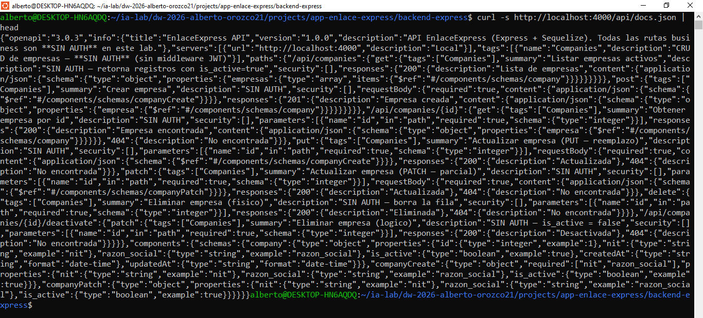

> Con el servidor del cierre: abrir `http://localhost:4000/api/docs`.

**Al agregar otra entidad (patrón, repetido en cada ISS siguiente):**

1. Archivo nuevo `features/.../<entidad>.swagger.ts`.
2. **PARCHE** `src/swagger/index.ts`: añadir import + entrada en `featureSwaggerModules`.

### Cierre del ISS
```bash
npm run dev
```

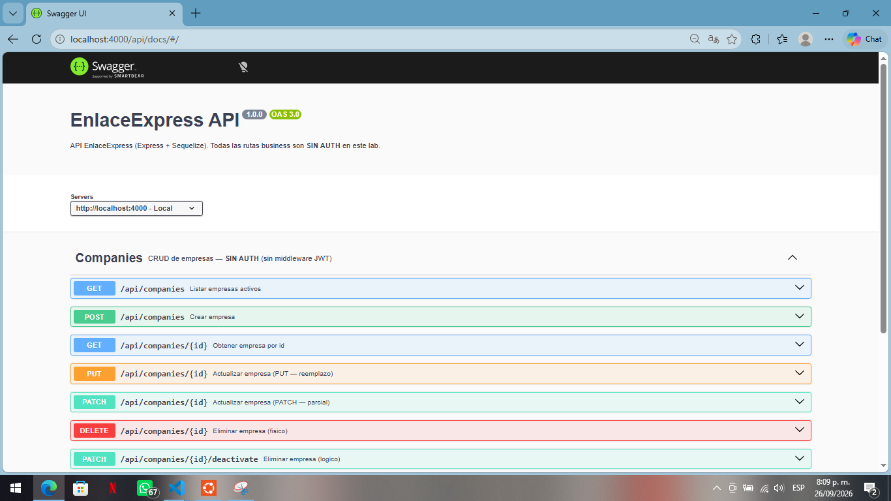

> Abrir `http://localhost:4000/api/docs`. Detenerlo con Ctrl+C antes de continuar.

---

## 7. ISS-06 — Feature Contact

**Objetivo:** CRUD completo + seeder + swagger de **Contact** (tabla `contacts`).  
**Bloqueado por:** ISS-05.  
**API:** `/api/contacts` — **SIN AUTH**.  
**Patrón:** mismo que las features anteriores (modelo → controller/routes → http → cableado → relación → seeder → swagger).

### Criterios de aceptación (ISS-06)

- [X] **7.1** Modelo `contact.model.ts` (`is_active` boolean + `timestamps: true`, columnas snake_case)
- [X] **7.2** Controller + routes: getAll, getOne, create, update PUT/PATCH, delete físico y lógico
- [X] **7.3** Carpeta `http/` con get, create, update, delete
- [X] **7.4** Cableado en `routes/index.ts` + `config/index.ts`
- [X] **7.5** Asociaciones (`contact.associations.ts`) + PARCHE `config`
- [X] **7.6** Seeder + registro en SeedersRunner / `counts.ts`
- [X] **7.7** Swagger + registro en `src/swagger`

---

```bash
mkdir -p \
  src/features/business/contact/http
```

## 7.1 Modelo Contact

```bash
: > src/features/business/contact/contact.model.ts
cat >> src/features/business/contact/contact.model.ts << 'EOF'
import { DataTypes, Model } from "sequelize";
import { sequelize } from "../../../database/db";

export interface ContactI {
  id?: number;
  empresa_id: number;
  nombre: string;
  cargo?: string | null;
  telefono?: string | null;
  email?: string | null;
  is_principal?: boolean;
  is_active?: boolean;
  createdAt?: Date;
  updatedAt?: Date;
}

export class Contact extends Model {
  public id!: number;
  public empresa_id!: number;
  public nombre!: string;
  public cargo!: string | null;
  public telefono!: string | null;
  public email!: string | null;
  public is_principal!: boolean;
  public is_active!: boolean;
  public readonly createdAt!: Date;
  public readonly updatedAt!: Date;
}

Contact.init(
  {
    empresa_id: {
      type: DataTypes.INTEGER,
      references: { model: "companies", key: "id" },
      allowNull: false,
    },
    nombre: {
      type: DataTypes.STRING,
      allowNull: false,
    },
    cargo: {
      type: DataTypes.STRING,
      allowNull: true,
    },
    telefono: {
      type: DataTypes.STRING,
      allowNull: true,
    },
    email: {
      type: DataTypes.STRING,
      allowNull: true,
    },
    is_principal: {
      type: DataTypes.BOOLEAN,
      allowNull: true,
      defaultValue: false,
    },
    is_active: {
      type: DataTypes.BOOLEAN,
      allowNull: true,
      defaultValue: false,
    },
  },
  {
    sequelize,
    modelName: "Contact",
    tableName: "contacts",
    timestamps: true,
  }
);
EOF
```

---

## 7.2 Controller + routes (CRUD completo)

**Controller**

```bash
: > src/features/business/contact/contact.controller.ts
cat >> src/features/business/contact/contact.controller.ts << 'EOF'
import { Request, Response } from "express";
import { Contact, ContactI } from "./contact.model";
import { Company } from "../company/company.model";

function paramId(req: Request): number {
  const raw = req.params.id;
  const value = Array.isArray(raw) ? raw[0] : raw;
  return Number(value);
}

export class ContactController {
  // ================== READ ==================
  public async getAll(req: Request, res: Response) {
    try {
      const contacts = await Contact.findAll({
        where: { is_active: true },
      });
      res.status(200).json({ contacts });
    } catch (error) {
      res.status(500).json({ error: "Error fetching contacts", detail: String(error) });
    }
  }

  public async getOne(req: Request, res: Response) {
    try {
      const id = paramId(req);
      const contact = await Contact.findByPk(id);
      if (!contact) {
        res.status(404).json({ error: "Contact not found" });
        return;
      }
      res.status(200).json({ contact: contact });
    } catch (error) {
      res.status(500).json({ error: "Error fetching contact", detail: String(error) });
    }
  }

  // ================== CREATE ==================
  public async create(req: Request, res: Response) {
    try {
      const body = req.body as ContactI;
      if (body.empresa_id !== undefined && body.empresa_id !== null) {
        const found_empresa_id = await Company.findByPk(body.empresa_id);
        if (!found_empresa_id) {
          res.status(404).json({ error: "Company (empresa_id) not found" });
          return;
        }
      }

      const contact = await Contact.create({
        empresa_id: body.empresa_id,
        nombre: body.nombre,
        cargo: body.cargo ?? null,
        telefono: body.telefono ?? null,
        email: body.email ?? null,
        is_principal: body.is_principal ?? null,
        is_active: body.is_active ?? true,
      });
      res.status(201).json({ contact: contact });
    } catch (error) {
      res.status(500).json({ error: "Error creating contact", detail: String(error) });
    }
  }

  // ================== UPDATE ==================
  public async updatePut(req: Request, res: Response) {
    try {
      const id = paramId(req);
      const body = req.body as ContactI;
      const contact = await Contact.findByPk(id);
      if (!contact) {
        res.status(404).json({ error: "Contact not found" });
        return;
      }
      if (body.empresa_id !== undefined && body.empresa_id !== null) {
        const found_empresa_id = await Company.findByPk(body.empresa_id);
        if (!found_empresa_id) {
          res.status(404).json({ error: "Company (empresa_id) not found" });
          return;
        }
      }

      await contact.update({
        empresa_id: body.empresa_id,
        nombre: body.nombre,
        cargo: body.cargo ?? contact.cargo,
        telefono: body.telefono ?? contact.telefono,
        email: body.email ?? contact.email,
        is_principal: body.is_principal ?? contact.is_principal,
        is_active: body.is_active ?? contact.is_active,
      });

      res.status(200).json({ contact: contact });
    } catch (error) {
      res.status(500).json({ error: "Error updating contact (PUT)", detail: String(error) });
    }
  }

  public async updatePatch(req: Request, res: Response) {
    try {
      const id = paramId(req);
      const body = req.body as Partial<ContactI>;
      const contact = await Contact.findByPk(id);
      if (!contact) {
        res.status(404).json({ error: "Contact not found" });
        return;
      }

      await contact.update(body);
      res.status(200).json({ contact: contact });
    } catch (error) {
      res.status(500).json({ error: "Error updating contact (PATCH)", detail: String(error) });
    }
  }

  // ================== DELETE ==================
  /** Eliminacion fisica */
  public async deletePhysical(req: Request, res: Response) {
    try {
      const id = paramId(req);
      const contact = await Contact.findByPk(id);
      if (!contact) {
        res.status(404).json({ error: "Contact not found" });
        return;
      }
      await contact.destroy();
      res.status(200).json({ message: "Contact permanently deleted", id });
    } catch (error) {
      res.status(500).json({ error: "Error deleting contact", detail: String(error) });
    }
  }

  /** Eliminacion logica -> is_active = false */
  public async deleteLogical(req: Request, res: Response) {
    try {
      const id = paramId(req);
      const contact = await Contact.findByPk(id);
      if (!contact) {
        res.status(404).json({ error: "Contact not found" });
        return;
      }
      await contact.update({ is_active: false });
      res.status(200).json({
        message: "Contact deactivated (logical delete)",
        contact: contact,
      });
    } catch (error) {
      res.status(500).json({ error: "Error deactivating contact", detail: String(error) });
    }
  }
}
EOF
```

**Routes**

```bash
: > src/features/business/contact/contact.routes.ts
cat >> src/features/business/contact/contact.routes.ts << 'EOF'
import { Application } from "express";
import { ContactController } from "./contact.controller";

export class ContactRoutes {
  public contactController: ContactController = new ContactController();

  public routes(app: Application): void {
    // ================== RUTAS SIN AUTENTICACION / SIN MIDDLEWARE JWT ==================

    // getAll
    app
      .route("/api/contacts")
      .get(this.contactController.getAll.bind(this.contactController));

    // getOne
    app
      .route("/api/contacts/:id")
      .get(this.contactController.getOne.bind(this.contactController));

    // create
    app
      .route("/api/contacts")
      .post(this.contactController.create.bind(this.contactController));

    // update (PUT / PATCH)
    app
      .route("/api/contacts/:id")
      .put(this.contactController.updatePut.bind(this.contactController))
      .patch(this.contactController.updatePatch.bind(this.contactController));

    // delete fisico
    app
      .route("/api/contacts/:id")
      .delete(this.contactController.deletePhysical.bind(this.contactController));

    // delete logico
    app
      .route("/api/contacts/:id/deactivate")
      .patch(this.contactController.deleteLogical.bind(this.contactController));
  }
}
EOF
```

---

## 7.3 HTTP

**GET**

```bash
: > src/features/business/contact/http/contacts.get.http
cat >> src/features/business/contact/http/contacts.get.http << 'EOF'
### Feature Contact — GET ALL / GET ONE
### Leyenda: SIN AUTH (sin middleware JWT / sin autenticacion)
@baseUrl = http://localhost:4000
@id = 1

# @name getAllContact
GET {{baseUrl}}/api/contacts

###

# @name getOneContact
GET {{baseUrl}}/api/contacts/{{id}}
EOF
```

**CREATE**

```bash
: > src/features/business/contact/http/contacts.create.http
cat >> src/features/business/contact/http/contacts.create.http << 'EOF'
### Feature Contact — CREATE
### Leyenda: SIN AUTH (sin middleware JWT / sin autenticacion)
@baseUrl = http://localhost:4000

# @name createContact
POST {{baseUrl}}/api/contacts
Content-Type: application/json

{
  "empresa_id": 1,
  "nombre": "Ejemplo nombre",
  "cargo": "Ejemplo cargo",
  "telefono": "Ejemplo telefono",
  "email": "Ejemplo email",
  "is_principal": true,
  "is_active": true
}
EOF
```

**UPDATE**

```bash
: > src/features/business/contact/http/contacts.update.http
cat >> src/features/business/contact/http/contacts.update.http << 'EOF'
### Feature Contact — UPDATE (PUT) / UPDATE (PATCH)
### Leyenda: SIN AUTH (sin middleware JWT / sin autenticacion)
@baseUrl = http://localhost:4000
@id = 1

# @name updateContactPut
PUT {{baseUrl}}/api/contacts/{{id}}
Content-Type: application/json

{
  "empresa_id": 1,
  "nombre": "Ejemplo nombre",
  "cargo": "Ejemplo cargo",
  "telefono": "Ejemplo telefono",
  "email": "Ejemplo email",
  "is_principal": true,
  "is_active": true
}

###

# @name updateContactPatch
PATCH {{baseUrl}}/api/contacts/{{id}}
Content-Type: application/json

{
  "nombre": "Ejemplo nombre"
}

EOF
```

**DELETE**

```bash
: > src/features/business/contact/http/contacts.delete.http
cat >> src/features/business/contact/http/contacts.delete.http << 'EOF'
### Feature Contact — DELETE fisico / DELETE logico (is_active = false)
### Leyenda: SIN AUTH (sin middleware JWT / sin autenticacion)
@baseUrl = http://localhost:4000
@id = 1

# @name deleteContactPhysical
DELETE {{baseUrl}}/api/contacts/{{id}}

###

# @name deleteContactLogical
PATCH {{baseUrl}}/api/contacts/{{id}}/deactivate
EOF
```

---

## 7.4 Cableado Routes + Config

**PARCHE** — `src/routes/index.ts` **ya existe**.

1. **Debajo de** `import { CompanyRoutes } ...`, **añadir**:

```ts
import { ContactRoutes } from "../features/business/contact/contact.routes";
```

2. **Dentro de** `export class Routes`, **debajo de** `companyRoutes`, **añadir**:

```ts
  public contactRoutes: ContactRoutes = new ContactRoutes();
```

**PARCHE** — `src/config/index.ts` **ya existe**.

1. **Debajo de** `import "../features/business/company/company.model";`, **añadir**:

```ts
import "../features/business/contact/contact.model";
```

2. **Dentro de** `routes()`, **debajo de** `this.routePrv.companyRoutes.routes(this.app);`, **añadir**:

```ts
    this.routePrv.contactRoutes.routes(this.app);
```

---

## 7.5 Relación / asociaciones Contact

> `Contact` referencia: **Company**. Norma FK: `<tabla_singular>_id`.

```bash
: > src/features/business/contact/contact.associations.ts
cat >> src/features/business/contact/contact.associations.ts << 'EOF'
import { Contact } from "./contact.model";
import { Company } from "../company/company.model";

Contact.belongsTo(Company, { foreignKey: "empresa_id", as: "company" });
Company.hasMany(Contact, { foreignKey: "empresa_id", as: "contacts" });
EOF
```
**PARCHE** — `src/config/index.ts` **ya existe**.

**Debajo de** `import "../features/business/contact/contact.model";` (y **encima de** `import { Routes }`), **añadir**:

```ts
import "../features/business/contact/contact.associations";
```

---

## 7.6 Seeder Contact

```bash
: > src/features/business/contact/contact.seeder.ts
cat >> src/features/business/contact/contact.seeder.ts << 'EOF'
import { faker } from "@faker-js/faker";
import { Contact } from "./contact.model";
import { Company } from "../companies/companies.model";

/**
 * Seeder del feature Contact (datos falsos con @faker-js/faker).
 * Se invoca desde `src/database/seeders` (SeedersRunner), no desde la App.
 *
 * Idempotente: si ya hay filas, no vuelve a insertar.
 */
export async function seedContacts(count: number): Promise<number> {
  if (count <= 0) {
    console.log("\u23ed\ufe0f  contacts: count=0, se omite");
    return 0;
  }

  const existing = await Contact.count();
  if (existing > 0) {
    console.log(`\u23ed\ufe0f  contacts: ya hay ${existing} registro(s), se omite seeder`);
    return 0;
  }

  const companyList = await Company.findAll({ where: { is_active: true } });
  if (companyList.length === 0) {
    console.log("\u23ed\ufe0f  contacts: faltan dependencias activas (companyList), se omite seeder");
    return 0;
  }

  const rows = Array.from({ length: count }, () => ({
      empresa_id: faker.helpers.arrayElement(companyList).id,
      nombre: faker.person.fullName(),
      cargo: faker.person.jobTitle(),
      telefono: faker.phone.number({ style: "national" }),
      email: faker.internet.email().toLowerCase(),
      is_principal: faker.datatype.boolean(),
      is_active: true,
  }));

  await Contact.bulkCreate(rows);
  console.log(`\u2705 contacts: insertados ${count} registro(s) falsos`);
  return count;
}
EOF
```

**PARCHE** — `src/database/seeders/counts.ts` **ya existe**.

- **Dentro de** `SeedCounts`, **añadir** `contacts: number;`
- **Dentro de** `DEFAULT_SEED_COUNTS`, **añadir** `contacts: 15,`
- Lectura opcional por env: `SEED_CONTACTS`.

**PARCHE** — `src/database/seeders/index.ts` **ya existe**.

1. **Debajo de** el import del seeder anterior, **añadir** `import { seedContacts } from "../../features/business/contact/contact.seeder";`
2. **Debajo de** `await seedCompanies(counts.companies);`, **añadir** `await seedContacts(counts.contacts);`

---

## 7.7 Swagger Contact

```bash
: > src/features/business/contact/contact.swagger.ts
cat >> src/features/business/contact/contact.swagger.ts << 'EOF'
/**
 * Documentacion OpenAPI del feature Contact.
 * Se agrega desde `src/swagger` (registry externo), no se monta aqui.
 *
 * Leyenda: endpoints documentados como SIN AUTH (sin middleware JWT).
 */

export const contactSwagger = {
  tags: [
    {
      name: "Contacts",
      description: "CRUD de contacts — **SIN AUTH** (sin middleware JWT)",
    },
  ],
  paths: {
    "/api/contacts": {
      get: {
        tags: ["Contacts"],
        summary: "Listar contacts activos",
        description: "SIN AUTH — retorna registros con is_active=true",
        security: [],
        responses: {
          "200": {
            description: "Lista de contacts",
            content: {
              "application/json": {
                schema: {
                  type: "object",
                  properties: {
                    contacts: {
                      type: "array",
                      items: { $ref: "#/components/schemas/Contact" },
                    },
                  },
                },
              },
            },
          },
        },
      },
      post: {
        tags: ["Contacts"],
        summary: "Crear contact",
        description: "SIN AUTH",
        security: [],
        requestBody: {
          required: true,
          content: {
            "application/json": {
              schema: { $ref: "#/components/schemas/ContactCreate" },
            },
          },
        },
        responses: {
          "201": {
            description: "Contact creado",
            content: {
              "application/json": {
                schema: {
                  type: "object",
                  properties: {
                    contact: { $ref: "#/components/schemas/Contact" },
                  },
                },
              },
            },
          },
        },
      },
    },
    "/api/contacts/{id}": {
      get: {
        tags: ["Contacts"],
        summary: "Obtener contact por id",
        description: "SIN AUTH",
        security: [],
        parameters: [{ name: "id", in: "path", required: true, schema: { type: "integer" } }],
        responses: {
          "200": {
            description: "Contact encontrado",
            content: {
              "application/json": {
                schema: {
                  type: "object",
                  properties: {
                    contact: { $ref: "#/components/schemas/Contact" },
                  },
                },
              },
            },
          },
          "404": { description: "No encontrado" },
        },
      },
      put: {
        tags: ["Contacts"],
        summary: "Actualizar contact (PUT — reemplazo)",
        description: "SIN AUTH",
        security: [],
        parameters: [{ name: "id", in: "path", required: true, schema: { type: "integer" } }],
        requestBody: {
          required: true,
          content: {
            "application/json": {
              schema: { $ref: "#/components/schemas/ContactCreate" },
            },
          },
        },
        responses: {
          "200": { description: "Actualizado" },
          "404": { description: "No encontrado" },
        },
      },
      patch: {
        tags: ["Contacts"],
        summary: "Actualizar contact (PATCH — parcial)",
        description: "SIN AUTH",
        security: [],
        parameters: [{ name: "id", in: "path", required: true, schema: { type: "integer" } }],
        requestBody: {
          required: true,
          content: {
            "application/json": {
              schema: { $ref: "#/components/schemas/ContactPatch" },
            },
          },
        },
        responses: {
          "200": { description: "Actualizado" },
          "404": { description: "No encontrado" },
        },
      },
      delete: {
        tags: ["Contacts"],
        summary: "Eliminar contact (fisico)",
        description: "SIN AUTH — borra la fila",
        security: [],
        parameters: [{ name: "id", in: "path", required: true, schema: { type: "integer" } }],
        responses: {
          "200": { description: "Eliminado" },
          "404": { description: "No encontrado" },
        },
      },
    },
    "/api/contacts/{id}/deactivate": {
      patch: {
        tags: ["Contacts"],
        summary: "Eliminar contact (logico)",
        description: "SIN AUTH — is_active = false",
        security: [],
        parameters: [{ name: "id", in: "path", required: true, schema: { type: "integer" } }],
        responses: {
          "200": { description: "Desactivado" },
          "404": { description: "No encontrado" },
        },
      },
    },
  },
  components: {
    schemas: {
      Contact: {
        type: "object",
        properties: {
      id: { type: "integer", example: 1 },
      empresa_id: { type: "integer", example: 1 },
      nombre: { type: "string", example: "nombre" },
      cargo: { type: "string", example: "cargo" },
      telefono: { type: "string", example: "telefono" },
      email: { type: "string", example: "email" },
      is_principal: { type: "boolean", example: true },
      is_active: { type: "boolean", example: true },
      createdAt: { type: "string", format: "date-time" },
      updatedAt: { type: "string", format: "date-time" },
        },
      },
      ContactCreate: {
        type: "object",
        required: ["empresa_id", "nombre"],
        properties: {
      empresa_id: { type: "integer", example: 1 },
      nombre: { type: "string", example: "nombre" },
      cargo: { type: "string", example: "cargo" },
      telefono: { type: "string", example: "telefono" },
      email: { type: "string", example: "email" },
      is_principal: { type: "boolean", example: true },
      is_active: { type: "boolean", example: true },
        },
      },
      ContactPatch: {
        type: "object",
        properties: {
      empresa_id: { type: "integer", example: 1 },
      nombre: { type: "string", example: "nombre" },
      cargo: { type: "string", example: "cargo" },
      telefono: { type: "string", example: "telefono" },
      email: { type: "string", example: "email" },
      is_principal: { type: "boolean", example: true },
      is_active: { type: "boolean", example: true },
        },
      },
    },
  },
};
EOF
```

**PARCHE** — `src/swagger/index.ts` **ya existe**.

1. **Debajo de** `import { companySwagger } ...`

**añadir** 

`import { contactSwagger } from "../features/business/contact/contact.swagger";`

2. **Dentro de** `featureSwaggerModules`, **debajo de** `companySwagger,`

**añadir** `contactSwagger,`

### Verificación

```bash
npx tsc --noEmit
curl -s http://localhost:4000/api/contacts
```

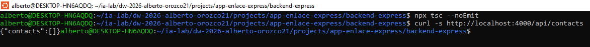

### Cierre del ISS

```bash
npm run dev
```

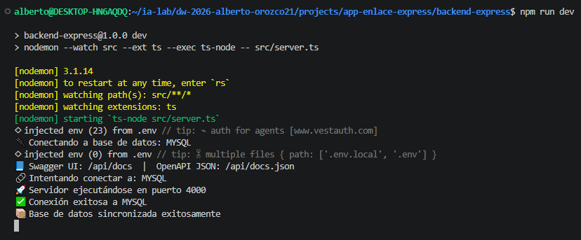


> El servidor debe arrancar sin error. Detenerlo con Ctrl+C antes de continuar.

---

## 8. ISS-07 — Feature Address

**Objetivo:** CRUD completo + seeder + swagger de **Address** (tabla `addresses`).  
**Bloqueado por:** ISS-06.  
**API:** `/api/direcciones` — **SIN AUTH**.  
**Patrón:** mismo que las features anteriores (modelo → controller/routes → http → cableado → relación → seeder → swagger).

### Criterios de aceptación (ISS-07)

- [ ] **8.1** Modelo `address.model.ts` (`is_active` boolean + `timestamps: true`, columnas snake_case)
- [ ] **8.2** Controller + routes: getAll, getOne, create, update PUT/PATCH, delete físico y lógico
- [ ] **8.3** Carpeta `http/` con get, create, update, delete
- [ ] **8.4** Cableado en `routes/index.ts` + `config/index.ts`
- [ ] **8.5** Asociaciones (`address.associations.ts`) + PARCHE `config`
- [ ] **8.6** Seeder + registro en SeedersRunner / `counts.ts`
- [ ] **8.7** Swagger + registro en `src/swagger`

---

```bash
mkdir -p \
  src/features/business/address/http
```

## 8.1 Modelo Address

```bash
: > src/features/business/address/address.model.ts
cat >> src/features/business/address/address.model.ts << 'EOF'
import { DataTypes, Model } from "sequelize";
import { sequelize } from "../../../database/db";

export interface AddressI {
  id?: number;
  empresa_id: number;
  alias: string;
  linea1: string;
  linea2?: string | null;
  ciudad: string;
  departamento?: string | null;
  pais?: string | null;
  codigo_postal?: string | null;
  latitud?: number | null;
  longitud?: number | null;
  tipo: "recogida" | "entrega" | "mixta";
  is_active?: boolean;
  createdAt?: Date;
  updatedAt?: Date;
}

export class Address extends Model {
  public id!: number;
  public empresa_id!: number;
  public alias!: string;
  public linea1!: string;
  public linea2!: string | null;
  public ciudad!: string;
  public departamento!: string | null;
  public pais!: string | null;
  public codigo_postal!: string | null;
  public latitud!: number | null;
  public longitud!: number | null;
  public tipo!: "recogida" | "entrega" | "mixta";
  public is_active!: boolean;
  public readonly createdAt!: Date;
  public readonly updatedAt!: Date;
}

Address.init(
  {
    empresa_id: {
      type: DataTypes.INTEGER,
      references: { model: "companies", key: "id" },
      allowNull: false,
    },
    alias: {
      type: DataTypes.STRING,
      allowNull: false,
    },
    linea1: {
      type: DataTypes.STRING,
      allowNull: false,
    },
    linea2: {
      type: DataTypes.STRING,
      allowNull: true,
    },
    ciudad: {
      type: DataTypes.STRING,
      allowNull: false,
    },
    departamento: {
      type: DataTypes.STRING,
      allowNull: true,
    },
    pais: {
      type: DataTypes.STRING,
      allowNull: true,
    },
    codigo_postal: {
      type: DataTypes.STRING,
      allowNull: true,
    },
    latitud: {
      type: DataTypes.DECIMAL(10, 7),
      allowNull: true,
    },
    longitud: {
      type: DataTypes.DECIMAL(10, 7),
      allowNull: true,
    },
    tipo: {
      type: DataTypes.ENUM("recogida", "entrega", "mixta"),
      allowNull: false,
      defaultValue: "recogida",
    },
    is_active: {
      type: DataTypes.BOOLEAN,
      allowNull: true,
      defaultValue: false,
    },
  },
  {
    sequelize,
    modelName: "Address",
    tableName: "addresses",
    timestamps: true,
  }
);
EOF
```

---

## 8.2 Controller + routes (CRUD completo)

**Controller**

```bash
: > src/features/business/address/address.controller.ts
cat >> src/features/business/address/address.controller.ts << 'EOF'
import { Request, Response } from "express";
import { Address, AddressI } from "./address.model";
import { Company } from "../company/company.model";

function paramId(req: Request): number {
  const raw = req.params.id;
  const value = Array.isArray(raw) ? raw[0] : raw;
  return Number(value);
}

export class AddressController {
  // ================== READ ==================
  public async getAll(req: Request, res: Response) {
    try {
      const addresses = await Address.findAll({
        where: { is_active: true },
      });
      res.status(200).json({ addresses });
    } catch (error) {
      res.status(500).json({ error: "Error fetching addresses", detail: String(error) });
    }
  }

  public async getOne(req: Request, res: Response) {
    try {
      const id = paramId(req);
      const address = await Address.findByPk(id);
      if (!address) {
        res.status(404).json({ error: "Address not found" });
        return;
      }
      res.status(200).json({ address: address });
    } catch (error) {
      res.status(500).json({ error: "Error fetching address", detail: String(error) });
    }
  }

  // ================== CREATE ==================
  public async create(req: Request, res: Response) {
    try {
      const body = req.body as AddressI;
      if (body.empresa_id !== undefined && body.empresa_id !== null) {
        const found_empresa_id = await Company.findByPk(body.empresa_id);
        if (!found_empresa_id) {
          res.status(404).json({ error: "Company (empresa_id) not found" });
          return;
        }
      }

      const address = await Address.create({
        empresa_id: body.empresa_id,
        alias: body.alias,
        linea1: body.linea1,
        linea2: body.linea2 ?? null,
        ciudad: body.ciudad,
        departamento: body.departamento ?? null,
        pais: body.pais ?? null,
        codigo_postal: body.codigo_postal ?? null,
        latitud: body.latitud ?? null,
        longitud: body.longitud ?? null,
        tipo: body.tipo,
        is_active: body.is_active ?? true,
      });
      res.status(201).json({ address: address });
    } catch (error) {
      res.status(500).json({ error: "Error creating address", detail: String(error) });
    }
  }

  // ================== UPDATE ==================
  public async updatePut(req: Request, res: Response) {
    try {
      const id = paramId(req);
      const body = req.body as AddressI;
      const address = await Address.findByPk(id);
      if (!address) {
        res.status(404).json({ error: "Address not found" });
        return;
      }
      if (body.empresa_id !== undefined && body.empresa_id !== null) {
        const found_empresa_id = await Company.findByPk(body.empresa_id);
        if (!found_empresa_id) {
          res.status(404).json({ error: "Company (empresa_id) not found" });
          return;
        }
      }

      await address.update({
        empresa_id: body.empresa_id,
        alias: body.alias,
        linea1: body.linea1,
        linea2: body.linea2 ?? address.linea2,
        ciudad: body.ciudad,
        departamento: body.departamento ?? address.departamento,
        pais: body.pais ?? address.pais,
        codigo_postal: body.codigo_postal ?? address.codigo_postal,
        latitud: body.latitud ?? address.latitud,
        longitud: body.longitud ?? address.longitud,
        tipo: body.tipo,
        is_active: body.is_active ?? address.is_active,
      });

      res.status(200).json({ address: address });
    } catch (error) {
      res.status(500).json({ error: "Error updating address (PUT)", detail: String(error) });
    }
  }

  public async updatePatch(req: Request, res: Response) {
    try {
      const id = paramId(req);
      const body = req.body as Partial<AddressI>;
      const address = await Address.findByPk(id);
      if (!address) {
        res.status(404).json({ error: "Address not found" });
        return;
      }

      await address.update(body);
      res.status(200).json({ address: address });
    } catch (error) {
      res.status(500).json({ error: "Error updating address (PATCH)", detail: String(error) });
    }
  }

  // ================== DELETE ==================
  /** Eliminacion fisica */
  public async deletePhysical(req: Request, res: Response) {
    try {
      const id = paramId(req);
      const address = await Address.findByPk(id);
      if (!address) {
        res.status(404).json({ error: "Address not found" });
        return;
      }
      await address.destroy();
      res.status(200).json({ message: "Address permanently deleted", id });
    } catch (error) {
      res.status(500).json({ error: "Error deleting address", detail: String(error) });
    }
  }

  /** Eliminacion logica -> is_active = false */
  public async deleteLogical(req: Request, res: Response) {
    try {
      const id = paramId(req);
      const address = await Address.findByPk(id);
      if (!address) {
        res.status(404).json({ error: "Address not found" });
        return;
      }
      await address.update({ is_active: false });
      res.status(200).json({
        message: "Address deactivated (logical delete)",
        address: address,
      });
    } catch (error) {
      res.status(500).json({ error: "Error deactivating address", detail: String(error) });
    }
  }
}
EOF
```

**Routes**

```bash
: > src/features/business/address/address.routes.ts
cat >> src/features/business/address/address.routes.ts << 'EOF'
import { Application } from "express";
import { AddressController } from "./address.controller";

export class AddressRoutes {
  public addressController: AddressController = new AddressController();

  public routes(app: Application): void {
    // ================== RUTAS SIN AUTENTICACION / SIN MIDDLEWARE JWT ==================

    // getAll
    app
      .route("/api/address")
      .get(this.addressController.getAll.bind(this.addressController));

    // getOne
    app
      .route("/api/address/:id")
      .get(this.addressController.getOne.bind(this.addressController));

    // create
    app
      .route("/api/address")
      .post(this.addressController.create.bind(this.addressController));

    // update (PUT / PATCH)
    app
      .route("/api/address/:id")
      .put(this.addressController.updatePut.bind(this.addressController))
      .patch(this.addressController.updatePatch.bind(this.addressController));

    // delete fisico
    app
      .route("/api/address/:id")
      .delete(this.addressController.deletePhysical.bind(this.addressController));

    // delete logico
    app
      .route("/api/address/:id/deactivate")
      .patch(this.addressController.deleteLogical.bind(this.addressController));
  }
}
EOF
```

---

## 8.3 HTTP

**GET**

```bash
: > src/features/business/address/http/addresses.get.http
cat >> src/features/business/address/http/addresses.get.http << 'EOF'
### Feature Address — GET ALL / GET ONE
### Leyenda: SIN AUTH (sin middleware JWT / sin autenticacion)
@baseUrl = http://localhost:4000
@id = 1

# @name getAllAddress
GET {{baseUrl}}/api/address

###

# @name getOneAddress
GET {{baseUrl}}/api/address/{{id}}
EOF
```

**CREATE**

```bash
: > src/features/business/address/http/addresses.create.http
cat >> src/features/business/address/http/addresses.create.http << 'EOF'
### Feature Address — CREATE
### Leyenda: SIN AUTH (sin middleware JWT / sin autenticacion)
@baseUrl = http://localhost:4000

# @name createAddress
POST {{baseUrl}}/api/address
Content-Type: application/json

{
  "empresa_id": 1,
  "alias": "Ejemplo alias",
  "linea1": "Ejemplo linea1",
  "linea2": "Ejemplo linea2",
  "ciudad": "Ejemplo ciudad",
  "departamento": "Ejemplo departamento",
  "pais": "Ejemplo pais",
  "codigo_postal": "Ejemplo codigo_postal",
  "latitud": 10.5,
  "longitud": 10.5,
  "tipo": "recogida",
  "is_active": true
}
EOF
```

**UPDATE**

```bash
: > src/features/business/address/http/addresses.update.http
cat >> src/features/business/address/http/addresses.update.http << 'EOF'
### Feature Address — UPDATE (PUT) / UPDATE (PATCH)
### Leyenda: SIN AUTH (sin middleware JWT / sin autenticacion)
@baseUrl = http://localhost:4000
@id = 1

# @name updateAddressPut
PUT {{baseUrl}}/api/address/{{id}}
Content-Type: application/json

{
  "empresa_id": 1,
  "alias": "Ejemplo alias",
  "linea1": "Ejemplo linea1",
  "linea2": "Ejemplo linea2",
  "ciudad": "Ejemplo ciudad",
  "departamento": "Ejemplo departamento",
  "pais": "Ejemplo pais",
  "codigo_postal": "Ejemplo codigo_postal",
  "latitud": 10.5,
  "longitud": 10.5,
  "tipo": "recogida",
  "is_active": true
}

###

# @name updateAddressPatch
PATCH {{baseUrl}}/api/direcciones/{{id}}
Content-Type: application/json

{
  "alias": "Ejemplo alias"
}
EOF
```

**DELETE**

```bash
: > src/features/business/address/http/addresses.delete.http
cat >> src/features/business/address/http/addresses.delete.http << 'EOF'
### Feature Address — DELETE fisico / DELETE logico (is_active = false)
### Leyenda: SIN AUTH (sin middleware JWT / sin autenticacion)
@baseUrl = http://localhost:4000
@id = 1

# @name deleteAddressPhysical
DELETE {{baseUrl}}/api/address/{{id}}

###

# @name deleteAddressLogical
PATCH {{baseUrl}}/api/address/{{id}}/deactivate
EOF
```

---

## 8.4 Cableado Routes + Config

**PARCHE** — `src/routes/index.ts` **ya existe**.

1. **Debajo de** `import { ContactRoutes } ...`, **añadir**:

```ts
import { AddressRoutes } from "../features/business/address/address.routes";
```

2. **Dentro de** `export class Routes`, **debajo de** `contactRoutes`, **añadir**:

```ts
  public addressRoutes: AddressRoutes = new AddressRoutes();
```

**PARCHE** — `src/config/index.ts` **ya existe**.

1. **Debajo de** `import "../features/business/contact/contact.model";`, **añadir**:

```ts
import "../features/business/address/address.model";
```

2. **Dentro de** `routes()`, **debajo de** `this.routePrv.contactRoutes.routes(this.app);`, **añadir**:

```ts
    this.routePrv.addressRoutes.routes(this.app);
```

---

## 8.5 Relación / asociaciones Address

> `Address` referencia: **Company**. Norma FK: `<tabla_singular>_id`.

```bash
: > src/features/business/address/address.associations.ts
cat >> src/features/business/address/address.associations.ts << 'EOF'
import { Address } from "./address.model";
import { Company } from "../companies/companies.model";

Address.belongsTo(Company, { foreignKey: "empresa_id", as: "company" });
Company.hasMany(Address, { foreignKey: "empresa_id", as: "addresss" });
EOF
```
**PARCHE** — `src/config/index.ts` **ya existe**.

**Debajo de** `import "../features/business/address/address.model";` (y **encima de** `import { Routes }`), **añadir**:

```ts
import "../features/business/address/address.associations";
```

---

## 8.6 Seeder Address

```bash
: > src/features/business/address/address.seeder.ts
cat >> src/features/business/address/address.seeder.ts << 'EOF'
import { faker } from "@faker-js/faker";
import { Address } from "./address.model";
import { Company } from "../companies/companies.model";

/**
 * Seeder del feature Address (datos falsos con @faker-js/faker).
 * Se invoca desde `src/database/seeders` (SeedersRunner), no desde la App.
 *
 * Idempotente: si ya hay filas, no vuelve a insertar.
 */
export async function seedAddresses(count: number): Promise<number> {
  if (count <= 0) {
    console.log("\u23ed\ufe0f  addresses: count=0, se omite");
    return 0;
  }

  const existing = await Address.count();
  if (existing > 0) {
    console.log(`\u23ed\ufe0f  addresses: ya hay ${existing} registro(s), se omite seeder`);
    return 0;
  }

  const companyList = await Company.findAll({ where: { is_active: true } });
  if (companyList.length === 0) {
    console.log("\u23ed\ufe0f  addresses: faltan dependencias activas (companyList), se omite seeder");
    return 0;
  }

  const rows = Array.from({ length: count }, () => ({
      empresa_id: faker.helpers.arrayElement(companyList).id,
      alias: faker.commerce.department() + " " + faker.location.direction(),
      linea1: faker.location.streetAddress(),
      linea2: faker.location.secondaryAddress(),
      ciudad: faker.location.city(),
      departamento: faker.location.state(),
      pais: faker.location.country(),
      codigo_postal: faker.location.zipCode(),
      latitud: Number(faker.location.latitude()),
      longitud: Number(faker.location.longitude()),
      tipo: faker.helpers.arrayElement(["recogida", "entrega", "mixta"]),
      is_active: true,
  }));

  await Address.bulkCreate(rows);
  console.log(`\u2705 addresses: insertados ${count} registro(s) falsos`);
  return count;
}
EOF
```

**PARCHE** — `src/database/seeders/counts.ts` **ya existe**.

- **Dentro de** `SeedCounts`, **añadir** `addresses: number;`
- **Dentro de** `DEFAULT_SEED_COUNTS`, **añadir** `addresses: 15,`
- Lectura opcional por env: `SEED_ADDRESSES`.

**PARCHE** — `src/database/seeders/index.ts` **ya existe**.

1. **Debajo de** el import del seeder anterior, **añadir** `import { seedAddresses } from "../../features/business/address/address.seeder";`
2. **Debajo de** `await seedContacts(counts.contacts);`, **añadir** `await seedAddresses(counts.addresses);`