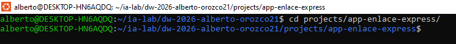
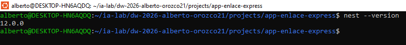
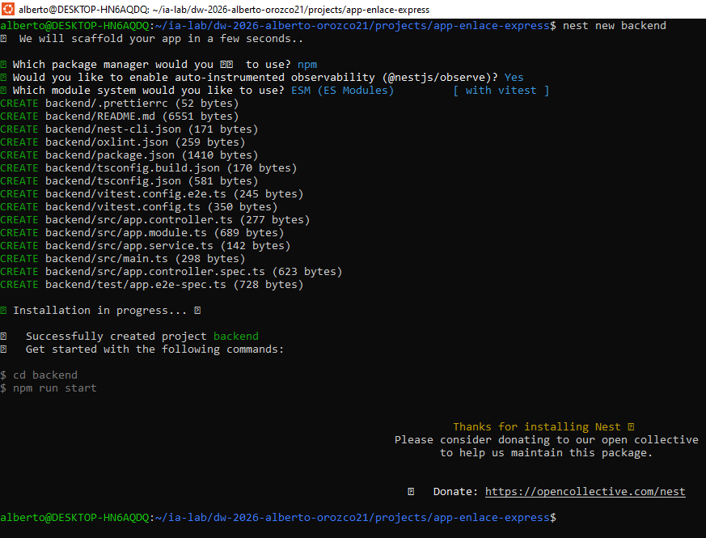
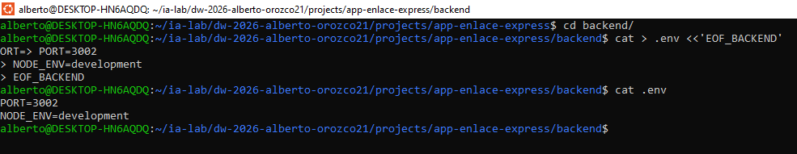

# Bitacora de creación del backend manual

## FASE 1 — 00_BASE_INIT_NESTJS

### 1.1 — Crear carpetas padre y permisos
Preparacion de la ruta de trabajo en WSL

```bash
mkdir -p /home/alberto/ia-lab/dw-2026-alberto-orozco21/projects/app-enlace-express
chmod -R 755 /home/alberto/ia-lab/dw-2026-alberto-orozco21/projects/app-enlace-express
```



### 1.2 — Instalar Nest CLI (si no existe)

El CLI genera `main.ts`, `app.module.ts`, `tsconfig`, scripts npm, etc.

```bash
npm install -g @nestjs/cli
nest --version
```



### 1.3 — Crear proyecto NestJS

Usamos el nombre `backend` (workspace didáctico). Responde las preguntas del CLI (package manager: npm).

```bash
cd /home/alberto/ia-lab/dw-2026-alberto-orozco21/projects/app-enlace-express
nest new backend
cd backend
```



### 1.4 — Crear `.env` mínimo (puerto)

El puerto `3002` evita choques con el 3000. Más adelante el `.env` crecerá con BD.

```bash
cat > .env <<'EOF_BACKEND'
PORT=3002
NODE_ENV=development
EOF_BACKEND
```

