# Bitacora de creación del backend manual

## FASE 1 — 00_BASE_INIT_NESTJS

### 1.1 — Crear carpetas padre y permisos
Preparacion de la ruta de trabajo en WSL

```bash
mkdir -p /home/alberto/ia-lab/dw-2026-alberto-orozco21/projects/app-enlace-express
chmod -R 755 /home/alberto/ia-lab/dw-2026-alberto-orozco21/projects/app-enlace-express
```


### 1.2 — Instalar Nest CLI (si no existe)

El CLI genera `main.ts`, `app.module.ts`, `tsconfig`, scripts npm, etc.

```bash
npm install -g @nestjs/cli
nest --version
```


### 1.3 — Crear proyecto NestJS

Usamos el nombre `backend` (workspace didáctico). Responde las preguntas del CLI (package manager: npm).

```bash
cd /home/alberto/ia-lab/dw-2026-alberto-orozco21/projects/app-enlace-express
nest new backend
cd backend
```


### 1.4 — Crear `.env` mínimo (puerto)

El puerto `3002` evita choques con el 3000. Más adelante el `.env` crecerá con BD.

```bash
cat > .env <<'EOF_BACKEND'
PORT=3002
NODE_ENV=development
EOF_BACKEND
```


---------------------------------------------------------------------------

## FASE 2 — `01_BASE_DEPS_Y_PUERTO`

### 2.1 — Dependencias de producción

Config, Swagger, JWT/Passport, Sequelize + drivers de 4 motores, validación, bcrypt y utilidades HTTP.

```bash
npm install @nestjs/config @nestjs/swagger @nestjs/jwt @nestjs/passport @nestjs/mapped-types \
  passport passport-jwt sequelize sequelize-typescript mysql2 pg tedious oracledb \
  class-validator class-transformer bcrypt reflect-metadata express compression helmet
```

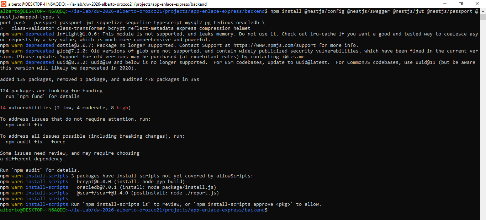

### 2.2 — Dependencias de desarrollo

Tipados y sequelize-cli para herramientas de BD.

```bash
npm install -D @types/bcrypt @types/passport-jwt sequelize-cli
```

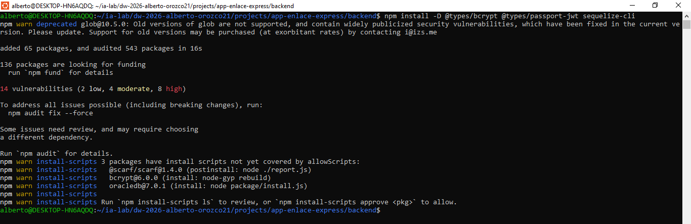

### 2.3 — Script para liberar puerto (evita EADDRINUSE)

Si reinicias Nest sin matar el proceso anterior, Node lanza `listen EADDRINUSE`. Este script lee `PORT` del `.env` y libera el puerto en Linux/WSL.

```bash
mkdir -p scripts
cat > scripts/free-port.js <<'EOF_BACKEND'
/**
 * Libera el puerto configurado en .env (PORT) antes de arrancar Nest.
 * Evita EADDRINUSE cuando queda una instancia previa de start:dev.
 */
import { execSync } from 'child_process';
import fs from 'fs';
import path from 'path';
import { fileURLToPath } from 'url';
 
const __filename = fileURLToPath(import.meta.url);
const __dirname = path.dirname(__filename);
 
function readPortFromEnv() {
  const envPath = path.join(__dirname, '..', '.env');
  let port = 3002;
 
  if (fs.existsSync(envPath)) {
    const content = fs.readFileSync(envPath, 'utf8');
    const match = content.match(/^\s*PORT\s*=\s*(\d+)\s*$/m);
    if (match) {
      port = parseInt(match[1], 10);
    }
  }
 
  if (process.env.PORT) {
    port = parseInt(process.env.PORT, 10) || port;
  }
 
  return port;
}
 
function freePort(port) {
  try {
    // Linux/WSL: mata el proceso que escucha en el puerto
    execSync(`fuser -k ${port}/tcp`, { stdio: 'ignore' });
    console.log(`✅ Puerto ${port} liberado`);
  } catch {
    // No había proceso escuchando: ok
    console.log(`ℹ️  Puerto ${port} disponible`);
  }
}
 
const port = readPortFromEnv();
freePort(port);
EOF_BACKEND
```

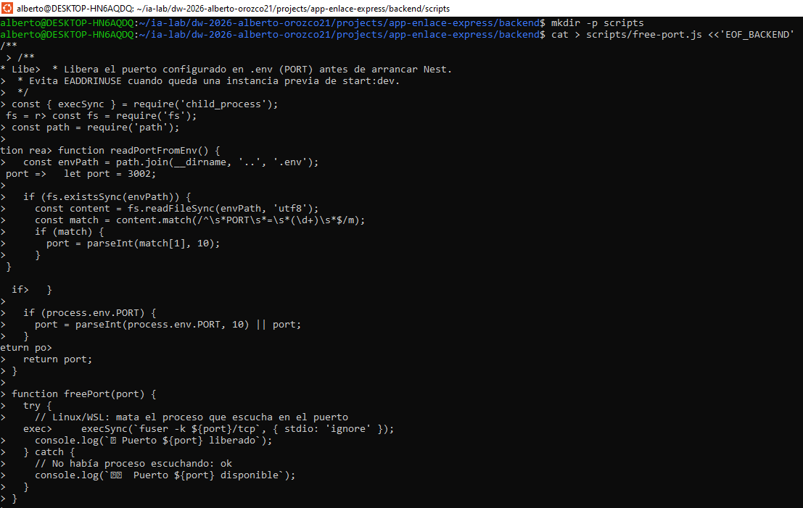

### 2.4 — Actualizar scripts npm en package.json

Integra `free:port` en `start:dev` / `start:debug`. Aplica el cambio con Node para no editar JSON a mano.

```bash
node <<'EOF_BACKEND'
const fs = require('fs');
const pkg = JSON.parse(fs.readFileSync('package.json', 'utf8'));
pkg.scripts = {
  ...pkg.scripts,
  'free:port': 'node scripts/free-port.js',
  'start:dev': 'npm run free:port && nest start --watch',
  'start:debug': 'npm run free:port && nest start --debug --watch',
};
fs.writeFileSync('package.json', JSON.stringify(pkg, null, 2) + '\n');
console.log('✅ package.json scripts actualizados');
EOF_BACKEND
```

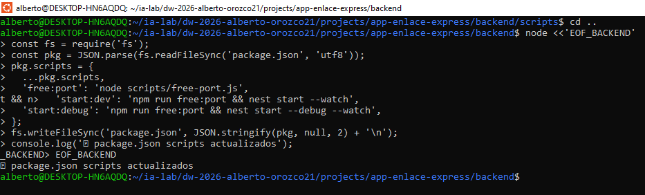

### 2.5 — Verificar arranque base

Debe levantar el Hello World de Nest en el puerto del `.env`.

```bash
npm run start:dev
# Ctrl+C cuando veas el log de arranque
curl -s http://localhost:3002 || true
```

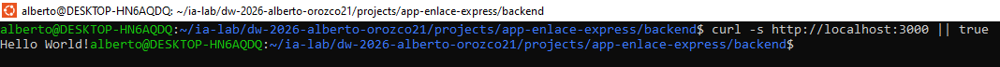

------------------------------------------------------------------------

## FASE 3 — `02_BASE_ESTRUCTURA_CA`

### 3.1 — Crear árbol base de carpetas

Aún no hay código de dominio. Solo directorios y módulos vacíos de features para anclar imports futuros.

```bash
mkdir -p src/config/{app,database,environment,logger,swagger}
mkdir -p src/common/{constants,decorators,enums,exceptions,filters,guards,interceptors,interfaces,pipes,types,utils,validators}
mkdir -p src/infrastructure/database/{sequelize,migrations,seeders}
mkdir -p src/infrastructure/logging
mkdir -p src/features/shipping/{companies,contacts,addresses,shipments,packages,tracking-events,couriers,routes,rates,delivery-proofs,invoices}/{application/{dto,mappers,use-cases},domain/{entities,enums,exceptions,interfaces,services,validators},infrastructure/persistence/{models,repositories,migrations,seeders},presentation/http/{controllers,decorators,serializers,swagger},tests}
cat > src/features/shipping/shipping.module.ts <<'EOF_BACKEND'
import { Module } from '@nestjs/common';

@Module({
  imports: [],
  exports: [],
})
export class ShippingModule {}
EOF_BACKEND
```

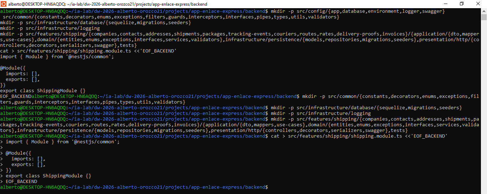

### 3.2 — Recordatorio de responsabilidades

| Carpeta | Responsabilidad |
|---------|------------------|
| `config/` | Cómo se configura la app (env, jwt, swagger) |
| `common/` | Piezas transversales reutilizables |
| `infrastructure/` | Detalles técnicos (Sequelize, bcrypt, JWT) |
| `features/*` | Dominios (business/auth) con CA interna |

**Error típico:** poner `@Table` de Sequelize dentro de `domain/entities`.

-----------------------------------------------------------------------

## FASE 4 — `03_BASE_ENTORNO_ENV`

### 4.1 — Crear `.env.example` y actualizar `.env` completo

El `.env` real NO se sube a Git. Usa BD dedicada `enlace_express`.

**Contrato multi-base**

- `DB_DIALECT` = `mysql` | `postgres` | `mssql` | `oracle` (elige qué motor corre).
- MySQL: `DB_MYSQL_HOST`, `DB_MYSQL_PORT`, `DB_MYSQL_USERNAME`, `DB_MYSQL_PASSWORD`, `DB_MYSQL_NAME`.
- PostgreSQL: `DB_POSTGRES_*` (puerto lab 5432).
- SQL Server: `DB_MSSQL_*` (puerto lab 1433, usuario `sa`).
- Oracle: `DB_ORACLE_*` + `DB_ORACLE_CONNECT_STRING` (puerto lab 1521).
- Para cambiar de motor, cambia **solo** `DB_DIALECT`. No uses `DB_HOST` / `DB_USERNAME` genéricos.

```bash
cat > .env.example <<'EOF_BACKEND'
# ==========================================
# APP
# ==========================================
PORT=3002
NODE_ENV=development

# ==========================================
# DATABASE
# ==========================================
# Selector del motor en ejecución (un solo valor):
# mysql | postgres | mssql | oracle
DB_DIALECT=mysql

# --- MYSQL ---
DB_MYSQL_HOST=localhost
DB_MYSQL_PORT=3306
DB_MYSQL_USERNAME=root
DB_MYSQL_PASSWORD=root
DB_MYSQL_NAME=tecnogua_ia

# --- POSTGRES ---
DB_POSTGRES_HOST=localhost
DB_POSTGRES_PORT=5432
DB_POSTGRES_USERNAME=postgres
DB_POSTGRES_PASSWORD=postgres
DB_POSTGRES_NAME=tecnogua_ia

# --- MSSQL (SQL Server) ---
DB_MSSQL_HOST=localhost
DB_MSSQL_PORT=1433
DB_MSSQL_USERNAME=sa
DB_MSSQL_PASSWORD=YourStrong@Passw0rd
DB_MSSQL_NAME=tecnogua_ia

# --- ORACLE ---
DB_ORACLE_HOST=localhost
DB_ORACLE_PORT=1521
DB_ORACLE_USERNAME=system
DB_ORACLE_PASSWORD=oracle
DB_ORACLE_NAME=tecnogua_ia
DB_ORACLE_CONNECT_STRING=localhost:1521/XEPDB1

EOF_BACKEND
```

```bash
cp .env.example .env
# Laboratorio: DB_DIALECT + un bloque por motor (MYSQL/POSTGRES/MSSQL/ORACLE).
# Cambia solo el bloque del motor que uses. Mantén DB_*_NAME=tecnogua_ia
```

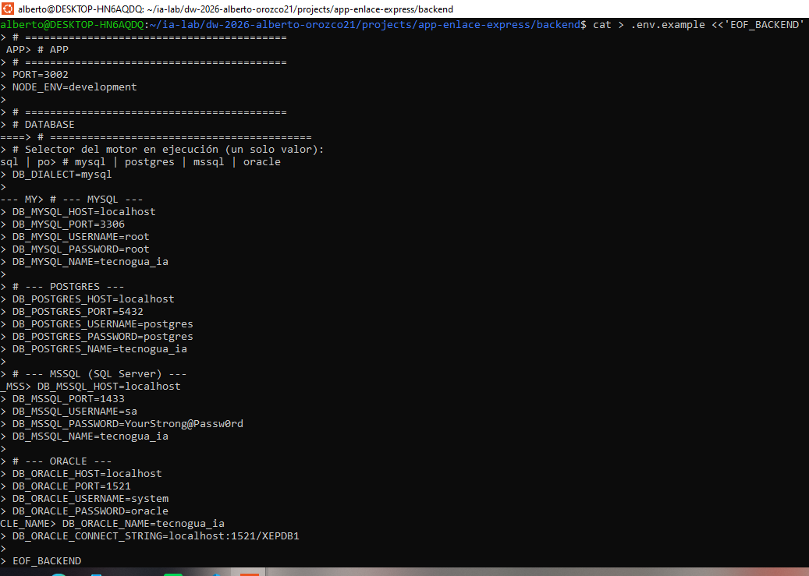

### 4.2 — Interface de entorno

Tipos TypeScript de las variables de entorno (APP, DB) y enum de dialectos.

**Archivo:** `src/config/environment/env.interface.ts`

```bash
mkdir -p src/config/environment
cat > src/config/environment/env.interface.ts <<'EOF_BACKEND'
export enum Environment {
  Development = 'development',
  Production = 'production',
  Test = 'test',
}

export enum DatabaseDialect {
  MySQL = 'mysql',
  Postgres = 'postgres',
  MSSQL = 'mssql',
  Oracle = 'oracle',
}

export interface AppConfig {
  port: number;
  nodeEnv: Environment;
}

export interface DatabaseConfig {
  dialect: DatabaseDialect;
  host: string;
  port: number;
  username: string;
  password: string;
  database: string;
  connectString?: string;
}

export interface EnvironmentConfig {
  app: AppConfig;
  database: DatabaseConfig;
}
EOF_BACKEND
```

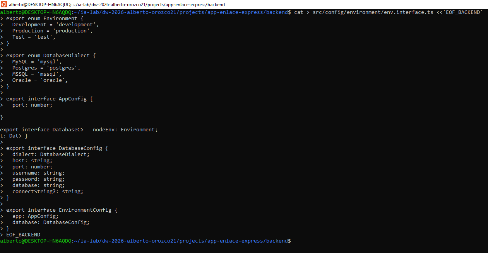

### 4.3 — Validación de entorno con class-validator

Si falta DB_DIALECT es inválido, o el bloque del motor activo está vacío, el boot falla con mensaje claro.

**Archivo:** `src/config/environment/env.validation.ts`

```bash
mkdir -p src/config/environment
cat > src/config/environment/env.validation.ts <<'EOF_BACKEND'
import { plainToInstance } from 'class-transformer';
import {
  IsEnum,
  IsNumber,
  IsOptional,
  IsString,
  Max,
  Min,
  validateSync,
} from 'class-validator';
import {
  assertActiveDialectCredentials,
  resolveDialectCredentials,
} from './db-env';
import { DatabaseDialect, Environment } from './env.interface';

export class EnvironmentVariables {
  @IsEnum(Environment)
  @IsOptional()
  NODE_ENV: Environment = Environment.Development;

  @IsNumber()
  @Min(0)
  @Max(65535)
  @IsOptional()
  PORT: number = 3002;

  @IsEnum(DatabaseDialect)
  DB_DIALECT: DatabaseDialect;

  @IsString()
  @IsOptional()
  DB_MYSQL_HOST?: string;

  @IsNumber()
  @IsOptional()
  DB_MYSQL_PORT?: number;

  @IsString()
  @IsOptional()
  DB_MYSQL_USERNAME?: string;

  @IsString()
  @IsOptional()
  DB_MYSQL_PASSWORD?: string;

  @IsString()
  @IsOptional()
  DB_MYSQL_NAME?: string;

  @IsString()
  @IsOptional()
  DB_POSTGRES_HOST?: string;

  @IsNumber()
  @IsOptional()
  DB_POSTGRES_PORT?: number;

  @IsString()
  @IsOptional()
  DB_POSTGRES_USERNAME?: string;

  @IsString()
  @IsOptional()
  DB_POSTGRES_PASSWORD?: string;

  @IsString()
  @IsOptional()
  DB_POSTGRES_NAME?: string;

  @IsString()
  @IsOptional()
  DB_MSSQL_HOST?: string;

  @IsNumber()
  @IsOptional()
  DB_MSSQL_PORT?: number;

  @IsString()
  @IsOptional()
  DB_MSSQL_USERNAME?: string;

  @IsString()
  @IsOptional()
  DB_MSSQL_PASSWORD?: string;

  @IsString()
  @IsOptional()
  DB_MSSQL_NAME?: string;

  @IsString()
  @IsOptional()
  DB_ORACLE_HOST?: string;

  @IsNumber()
  @IsOptional()
  DB_ORACLE_PORT?: number;

  @IsString()
  @IsOptional()
  DB_ORACLE_USERNAME?: string;

  @IsString()
  @IsOptional()
  DB_ORACLE_PASSWORD?: string;

  @IsString()
  @IsOptional()
  DB_ORACLE_NAME?: string;

  @IsString()
  @IsOptional()
  DB_ORACLE_CONNECT_STRING?: string;
}

function formatValidationErrors(
  errors: ReturnType<typeof validateSync>,
): string {
  return errors
    .map((error) => {
      const constraints = error.constraints
        ? Object.values(error.constraints).join(', ')
        : 'valor inválido';
      return `${error.property}: ${constraints}`;
    })
    .join('; ');
}

export function validate(config: Record<string, unknown>): EnvironmentVariables {
  const validatedConfig = plainToInstance(EnvironmentVariables, config, {
    enableImplicitConversion: true,
    exposeDefaultValues: true,
  });

  const errors = validateSync(validatedConfig, {
    skipMissingProperties: false,
  });

  if (errors.length > 0) {
    throw new Error(
      `Error de configuración: variable(s) crítica(s) inválida(s) o ausente(s). ${formatValidationErrors(errors)}. Copia .env.example a .env y completa el bloque del motor elegido (DB_DIALECT).`,
    );
  }

  assertActiveDialectCredentials(resolveDialectCredentials(validatedConfig));

  return validatedConfig;
}
EOF_BACKEND
```

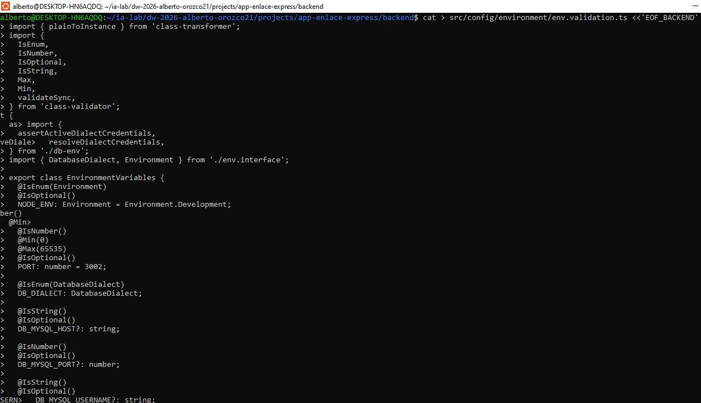

### 4.4 — Resolver de credenciales por motor

Lee el bloque DB_MYSQL_* / DB_POSTGRES_* / DB_MSSQL_* / DB_ORACLE_* según DB_DIALECT.

**Archivo:** `src/config/environment/db-env.ts`

```bash
mkdir -p src/config/environment
cat > src/config/environment/db-env.ts <<'EOF_BACKEND'
import { DatabaseConfig, DatabaseDialect } from './env.interface';

export const DEFAULT_DB_PORTS: Record<DatabaseDialect, number> = {
  [DatabaseDialect.MySQL]: 3306,
  [DatabaseDialect.Postgres]: 5433,
  [DatabaseDialect.MSSQL]: 1433,
  [DatabaseDialect.Oracle]: 1521,
};

export type DialectEnvSource = {
  DB_DIALECT: DatabaseDialect;
  DB_MYSQL_HOST?: string;
  DB_MYSQL_PORT?: string | number;
  DB_MYSQL_USERNAME?: string;
  DB_MYSQL_PASSWORD?: string;
  DB_MYSQL_NAME?: string;
  DB_POSTGRES_HOST?: string;
  DB_POSTGRES_PORT?: string | number;
  DB_POSTGRES_USERNAME?: string;
  DB_POSTGRES_PASSWORD?: string;
  DB_POSTGRES_NAME?: string;
  DB_MSSQL_HOST?: string;
  DB_MSSQL_PORT?: string | number;
  DB_MSSQL_USERNAME?: string;
  DB_MSSQL_PASSWORD?: string;
  DB_MSSQL_NAME?: string;
  DB_ORACLE_HOST?: string;
  DB_ORACLE_PORT?: string | number;
  DB_ORACLE_USERNAME?: string;
  DB_ORACLE_PASSWORD?: string;
  DB_ORACLE_NAME?: string;
  DB_ORACLE_CONNECT_STRING?: string;
};

function toPort(value: string | number | undefined, fallback: number): number {
  if (typeof value === 'number' && Number.isFinite(value)) {
    return value;
  }
  if (typeof value === 'string' && value.trim() !== '') {
    const parsed = parseInt(value, 10);
    if (Number.isFinite(parsed)) {
      return parsed;
    }
  }
  return fallback;
}

function text(value: string | undefined): string {
  return value?.trim() ?? '';
}

export function resolveDialectCredentials(
  env: DialectEnvSource,
): DatabaseConfig {
  const dialect = env.DB_DIALECT;
  const port = DEFAULT_DB_PORTS[dialect];

  switch (dialect) {
    case DatabaseDialect.MySQL:
      return {
        dialect,
        host: text(env.DB_MYSQL_HOST),
        port: toPort(env.DB_MYSQL_PORT, port),
        username: text(env.DB_MYSQL_USERNAME),
        password: text(env.DB_MYSQL_PASSWORD),
        database: text(env.DB_MYSQL_NAME),
      };
    case DatabaseDialect.Postgres:
      return {
        dialect,
        host: text(env.DB_POSTGRES_HOST),
        port: toPort(env.DB_POSTGRES_PORT, port),
        username: text(env.DB_POSTGRES_USERNAME),
        password: text(env.DB_POSTGRES_PASSWORD),
        database: text(env.DB_POSTGRES_NAME),
      };
    case DatabaseDialect.MSSQL:
      return {
        dialect,
        host: text(env.DB_MSSQL_HOST),
        port: toPort(env.DB_MSSQL_PORT, port),
        username: text(env.DB_MSSQL_USERNAME),
        password: text(env.DB_MSSQL_PASSWORD),
        database: text(env.DB_MSSQL_NAME),
      };
    case DatabaseDialect.Oracle:
      return {
        dialect,
        host: text(env.DB_ORACLE_HOST),
        port: toPort(env.DB_ORACLE_PORT, port),
        username: text(env.DB_ORACLE_USERNAME),
        password: text(env.DB_ORACLE_PASSWORD),
        database: text(env.DB_ORACLE_NAME),
        connectString: text(env.DB_ORACLE_CONNECT_STRING) || undefined,
      };
    default:
      throw new Error(
        `Error de configuración: DB_DIALECT inválido. Use mysql, postgres, mssql u oracle.`,
      );
  }
}

export function assertActiveDialectCredentials(config: DatabaseConfig): void {
  const prefix: Record<DatabaseDialect, string> = {
    [DatabaseDialect.MySQL]: 'DB_MYSQL',
    [DatabaseDialect.Postgres]: 'DB_POSTGRES',
    [DatabaseDialect.MSSQL]: 'DB_MSSQL',
    [DatabaseDialect.Oracle]: 'DB_ORACLE',
  };
  const tag = prefix[config.dialect];
  const missing: string[] = [];

  if (!config.host) missing.push(`${tag}_HOST`);
  if (!config.username) missing.push(`${tag}_USERNAME`);
  if (!config.database) missing.push(`${tag}_NAME`);
  if (config.dialect === DatabaseDialect.Oracle && !config.connectString) {
    missing.push('DB_ORACLE_CONNECT_STRING');
  }

  if (missing.length > 0) {
    throw new Error(
      `Error de configuración: variable(s) crítica(s) inválida(s) o ausente(s) para ${config.dialect}: ${missing.join(', ')}. Completa el bloque de ese motor en .env (no commitees secretos).`,
    );
  }
}
EOF_BACKEND
```

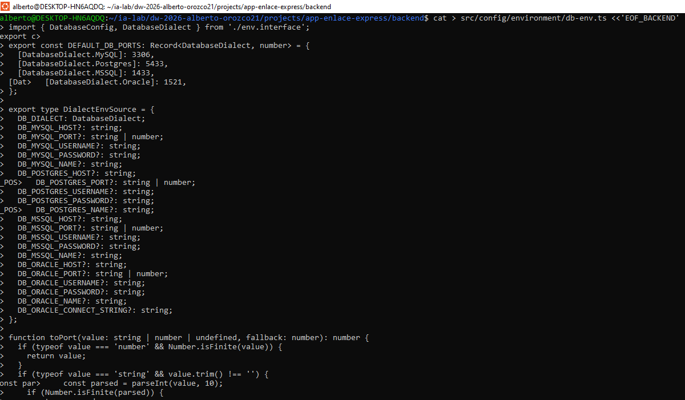

### 4.5 — Factory registerAs de entorno

Expone `environment.*` vía ConfigService (`registerAs`).

**Archivo:** `src/config/environment/env.config.ts`

```bash
mkdir -p src/config/environment
cat > src/config/environment/env.config.ts <<'EOF_BACKEND'
import { registerAs } from '@nestjs/config';
import { resolveDialectCredentials } from './db-env';
import { Environment } from './env.interface';
import { validate } from './env.validation';

export const ENV_CONFIG_NAME = 'environment';

export const envConfig = registerAs(ENV_CONFIG_NAME, () => {
  const validated = validate(process.env);

  return {
    app: {
      port: validated.PORT,
      nodeEnv: validated.NODE_ENV ?? Environment.Development,
    },
    database: resolveDialectCredentials(validated),
  };
});
EOF_BACKEND
```

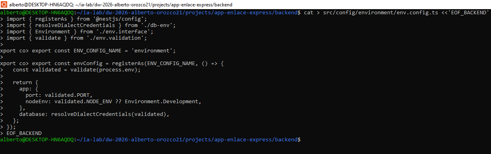

------------------------------------------------------------------------

## FASE 5 — `04_BASE_DATABASE_SEQUELIZE`

### 5.1 — Constante SEQUELIZE_TOKEN

Token DI para inyectar la instancia Sequelize en repositorios.

**Archivo:** `src/common/constants/database.constants.ts`

```bash
mkdir -p src/common/constants
cat > src/common/constants/database.constants.ts <<'EOF_BACKEND'
export const SEQUELIZE_TOKEN = 'SEQUELIZE';
EOF_BACKEND
```

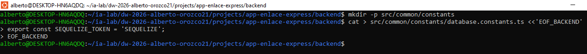

### 5.2 — Tipos auxiliares de database config

Tipos auxiliares del bloque config/database (legado/compat).

**Archivo:** `src/config/database/database.types.ts`

```bash
mkdir -p src/config/database
cat > src/config/database/database.types.ts <<'EOF_BACKEND'
import { Options as SequelizeOptions } from 'sequelize';

export type DialectOptions =
  | { dialect: 'mysql'; options?: SequelizeOptions }
  | { dialect: 'postgres'; options?: SequelizeOptions }
  | { dialect: 'mssql'; options?: SequelizeOptions }
  | { dialect: 'oracle'; options?: SequelizeOptions };
EOF_BACKEND
```

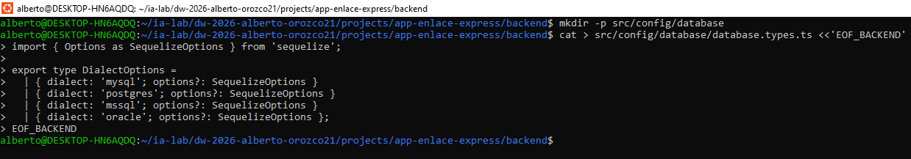

### 5.3 — database.config.ts

Factory registerAs opcional para namespace `database` (complementa environment).

**Archivo:** `src/config/database/database.config.ts`

```bash
mkdir -p src/config/database
cat > src/config/database/database.config.ts <<'EOF_BACKEND'
import { registerAs } from '@nestjs/config';
import { resolveDialectCredentials } from '../environment/db-env';
import { DatabaseDialect } from '../environment/env.interface';

export const DATABASE_CONFIG_NAME = 'database';

const dialectModuleMap: Record<DatabaseDialect, string> = {
  [DatabaseDialect.MySQL]: 'mysql2',
  [DatabaseDialect.Postgres]: 'pg',
  [DatabaseDialect.MSSQL]: 'tedious',
  [DatabaseDialect.Oracle]: 'oracledb',
};

export const databaseConfig = registerAs(DATABASE_CONFIG_NAME, () => {
  const dialect =
    (process.env.DB_DIALECT as DatabaseDialect) || DatabaseDialect.MySQL;
  const credentials = resolveDialectCredentials({
    DB_DIALECT: dialect,
    ...process.env,
  });

  return {
    ...credentials,
    dialectModulePath: dialectModuleMap[dialect],
    autoLoadModels: true,
    synchronize: process.env.NODE_ENV !== 'production',
    logging: process.env.NODE_ENV === 'development' ? console.log : false,
  };
});
EOF_BACKEND
```

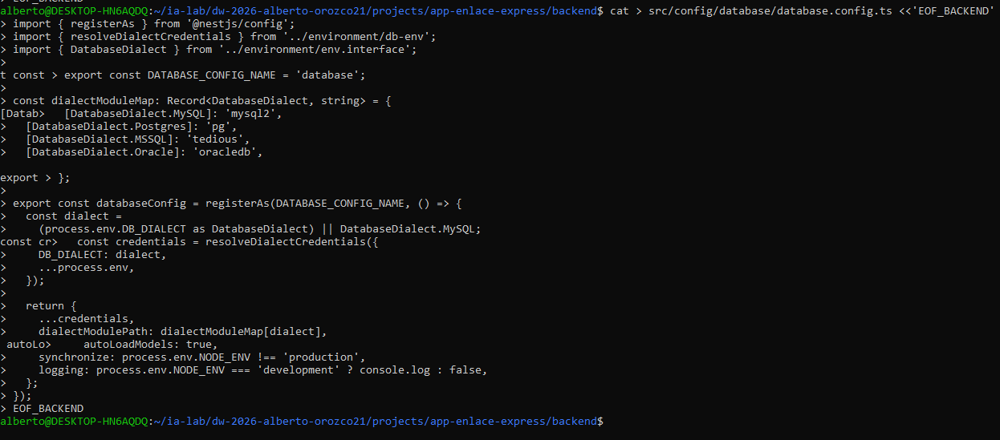

### 5.4 — database.module.ts / providers

Módulo de configuración de BD (forFeature). Los providers quedan vacíos a propósito.

**Archivo:** `src/config/database/database.module.ts`

```bash
mkdir -p src/config/database
cat > src/config/database/database.module.ts <<'EOF_BACKEND_IA'
import { Module } from '@nestjs/common';
import { ConfigModule } from '@nestjs/config';
import { databaseConfig } from './database.config';

@Module({
  imports: [ConfigModule.forFeature(databaseConfig)],
  exports: [ConfigModule],
})
export class DatabaseConfigModule {}
EOF_BACKEND_IA
```

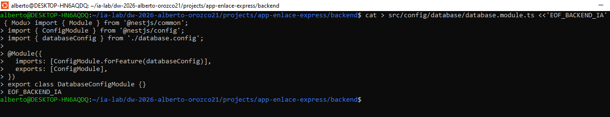

### 5.5 — database.providers.ts

Placeholder de providers de config/database.

**Archivo:** `src/config/database/database.providers.ts`

```bash
mkdir -p src/config/database
cat > src/config/database/database.providers.ts <<'EOF_BACKEND'
export const DATABASE_PROVIDERS = [];
EOF_BACKEND
```

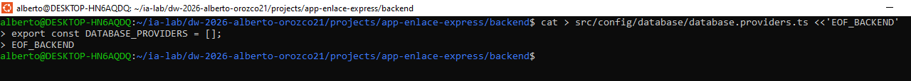

### 5.6 — Opciones Sequelize por dialecto

Arma host/port/user/password/logging con el bloque del motor seleccionado por DB_DIALECT.

**Archivo:** `src/infrastructure/database/sequelize/sequelize.options.ts`

```bash
mkdir -p src/infrastructure/database/sequelize
cat > src/infrastructure/database/sequelize/sequelize.options.ts <<'EOF_BACKEND_IA'
import { SequelizeOptions } from 'sequelize-typescript';
import { resolveDialectCredentials } from '../../../config/environment/db-env';
import { DatabaseDialect } from '../../../config/environment/env.interface';

export function getSequelizeOptions(
  dialect: DatabaseDialect,
): Partial<SequelizeOptions> {
  const credentials = resolveDialectCredentials({
    DB_DIALECT: dialect,
    ...process.env,
  });

  const base: SequelizeOptions = {
    dialect: dialect as SequelizeOptions['dialect'],
    host: credentials.host,
    port: credentials.port,
    username: credentials.username,
    password: credentials.password,
    database: credentials.database,
    logging: process.env.NODE_ENV === 'development' ? console.log : false,
    define: {
      underscored: false,
      freezeTableName: true,
    },
  };

  switch (dialect) {
    case DatabaseDialect.MSSQL:
      return {
        ...base,
        dialectOptions: {
          options: {
            encrypt: true,
            trustServerCertificate: true,
          },
        },
      };
    case DatabaseDialect.Oracle:
      return {
        ...base,
        dialectOptions: {
          connectString: credentials.connectString,
        },
      };
    default:
      return base;
  }
}
EOF_BACKEND_IA
```

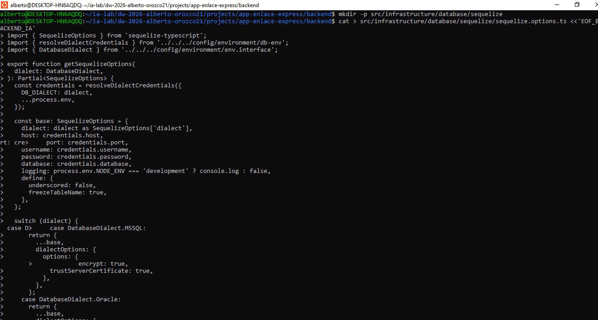

### 5.7 — Factory Sequelize (sin modelos aún)

Crea la instancia Sequelize. `ALL_MODELS` empieza vacío: se llena al crear cada entidad.

**Archivo:** `src/infrastructure/database/sequelize/sequelize.factory.ts`

```bash
mkdir -p src/infrastructure/database/sequelize
cat > src/infrastructure/database/sequelize/sequelize.factory.ts <<'EOF_BACKEND_IA'
import { Sequelize } from 'sequelize-typescript';
import { DatabaseDialect } from '../../../config/environment/env.interface';
import { getSequelizeOptions } from './sequelize.options';


export const ALL_MODELS = [
  // (aún sin modelos — se agregan por feature)
];

export async function createSequelizeInstance(
  dialect: DatabaseDialect,
): Promise<Sequelize> {
  const options = getSequelizeOptions(dialect);

  let dialectModule: any;

  switch (dialect) {
    case DatabaseDialect.MySQL:
      dialectModule = require('mysql2');
      break;
    case DatabaseDialect.Postgres:
      dialectModule = require('pg');
      break;
    case DatabaseDialect.MSSQL:
      dialectModule = require('tedious');
      break;
    case DatabaseDialect.Oracle:
      dialectModule = require('oracledb');
      break;
    default:
      throw new Error(`Dialecto no soportado: ${dialect}`);
  }

  const sequelize = new Sequelize({
    ...options,
    dialectModule,
    models: ALL_MODELS,
  } as any);

  try {
    await sequelize.authenticate();
    console.log(`✅ Conexión exitosa a ${dialect.toUpperCase()}`);
  } catch (error: any) {
    console.error(
      `❌ Error conectando a ${dialect.toUpperCase()}:`,
      error.message,
    );
    throw error;
  }

  if (process.env.NODE_ENV !== 'production') {
    await sequelize.sync({ alter: false });
    console.log('✅ Tablas sincronizadas');
  }

  return sequelize;
}
EOF_BACKEND_IA
```

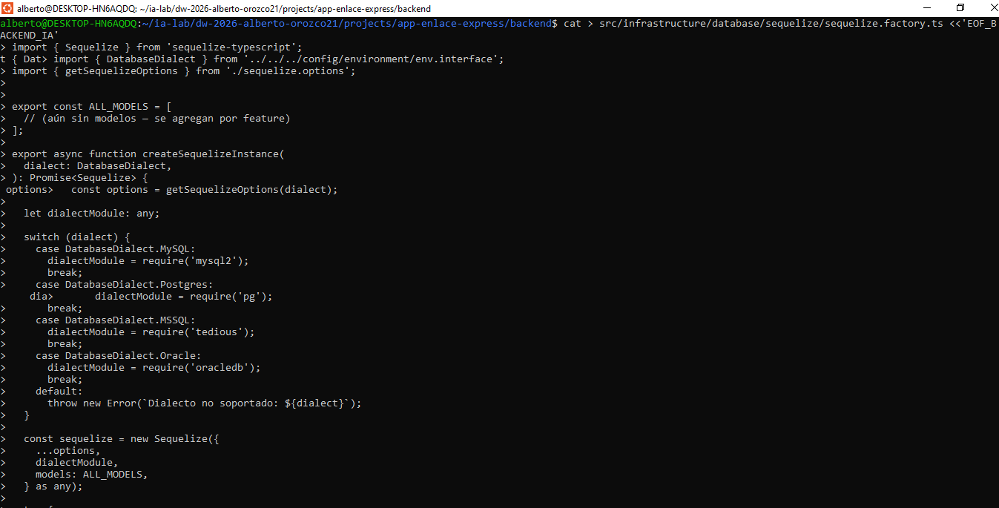

### 5.8 — DatabaseSeederService (sin seeders aún)

Hook OnModuleInit para seeders. Todavía no llama a ningún seeder de feature.

**Archivo:** `src/infrastructure/database/seeders/database-seeder.service.ts`

```bash
mkdir -p src/infrastructure/database/seeders
cat > src/infrastructure/database/seeders/database-seeder.service.ts <<'EOF_BACKEND_IA'
import { Injectable, Logger, OnModuleInit } from '@nestjs/common';


/**
 * Ejecuta seeders en orden de dependencias.
 * Solo en entornos no productivos.
 */
@Injectable()
export class DatabaseSeederService implements OnModuleInit {
  private readonly logger = new Logger(DatabaseSeederService.name);

  async onModuleInit(): Promise<void> {
    if (process.env.NODE_ENV === 'production') {
      return;
    }

    try {
      // sin seeders aún
      this.logger.log('✅ Seeders ejecutados');
    } catch (error: any) {
      this.logger.error(`❌ Error en seeders: ${error.message}`, error.stack);
      throw error;
    }
  }
}
EOF_BACKEND_IA
```

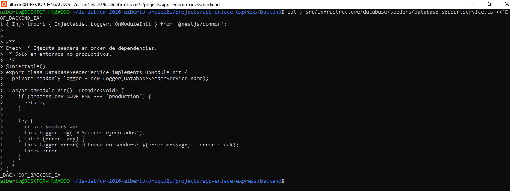

### 5.9 — Módulo global Sequelize

Módulo `@Global()` que provee `SEQUELIZE_TOKEN` + ejecuta seeders.

**Archivo:** `src/infrastructure/database/sequelize/sequelize.module.ts`

```bash
mkdir -p src/infrastructure/database/sequelize
cat > src/infrastructure/database/sequelize/sequelize.module.ts <<'EOF_BACKEND_IA'
import { Module, Global } from '@nestjs/common';
import { ConfigService } from '@nestjs/config';
import { Sequelize } from 'sequelize-typescript';
import { DatabaseDialect } from '../../../config/environment/env.interface';
import { SEQUELIZE_TOKEN } from '../../../common/constants/database.constants';
import { createSequelizeInstance } from './sequelize.factory';
import { DatabaseSeederService } from '../seeders/database-seeder.service';

@Global()
@Module({
  providers: [
    {
      provide: SEQUELIZE_TOKEN,
      useFactory: async (configService: ConfigService): Promise<Sequelize> => {
        const dialect = configService.get<DatabaseDialect>(
          'environment.database.dialect',
          DatabaseDialect.MySQL,
        );
        return createSequelizeInstance(dialect);
      },
      inject: [ConfigService],
    },
    DatabaseSeederService,
  ],
  exports: [SEQUELIZE_TOKEN],
})
export class SequelizeDatabaseModule {}
EOF_BACKEND_IA
```

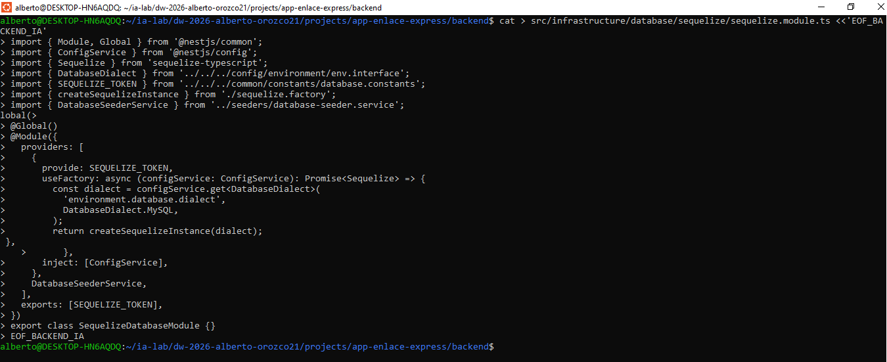

### 5.10 — Verificar conexión a BD

Crea la BD vacía `enlace_express` en el motor que indica `DB_DIALECT`. Aún no hay tablas de negocio. Si falla el authenticate, corrige el **bloque de ese motor** en `.env` (no el de otro).

```bash
npm run start:dev
```

**MYSQL**

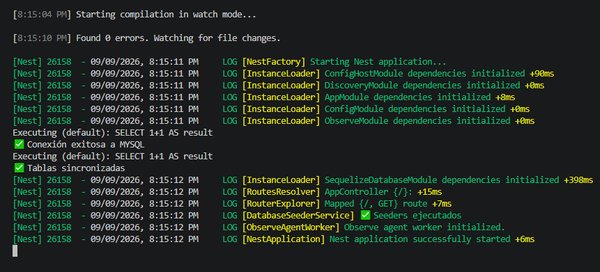

**POSTGRES**

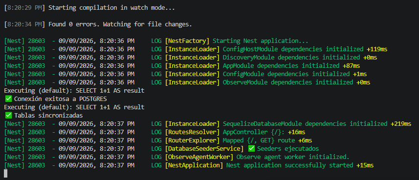

**MS SQL SERVER**

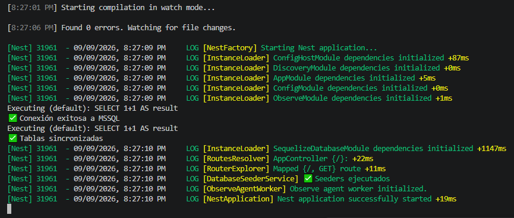

**ORACLE**

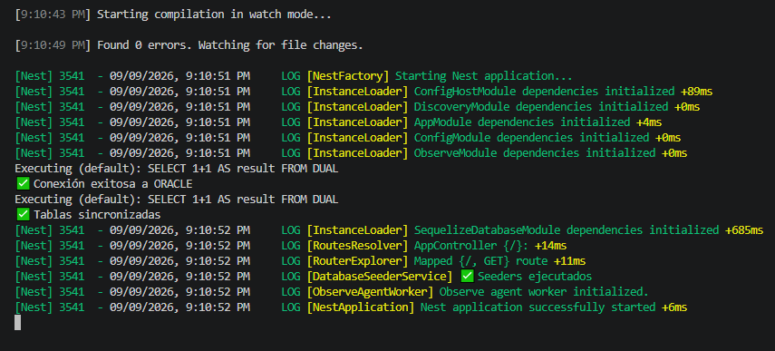

------------------------------------------------------------------------

## FASE 6 — `05_BASE_APP_COMMON_SECURITY`

### 6.1 — config/app/app.constants.ts

Archivo del feature en Clean Architecture.

**Archivo:** `src/config/app/app.constants.ts`

```bash
mkdir -p src/config/app
cat > src/config/app/app.constants.ts <<'EOF_BACKEND_IA'
export const APP_CONFIG_NAME = 'app';

export const APP_DEFAULTS = {
  PORT: 3000,
  NODE_ENV: 'development',
};
EOF_BACKEND_IA
```

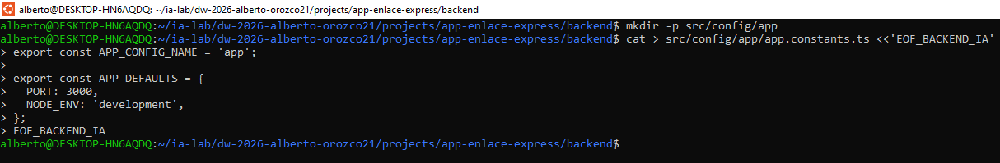

### 6.2 — config/app/app.config.ts

Archivo del feature en Clean Architecture.

**Archivo:** `src/config/app/app.config.ts`

```bash
mkdir -p src/config/app
cat > src/config/app/app.config.ts <<'EOF_BACKEND_IA'
import { registerAs } from '@nestjs/config';
import { APP_CONFIG_NAME, APP_DEFAULTS } from './app.constants';
import { Environment } from '../environment/env.interface';

export const appConfig = registerAs(APP_CONFIG_NAME, () => ({
  port: parseInt(process.env.PORT || String(APP_DEFAULTS.PORT), 10),
  nodeEnv: (process.env.NODE_ENV as Environment) || APP_DEFAULTS.NODE_ENV,
}));
EOF_BACKEND_IA
```

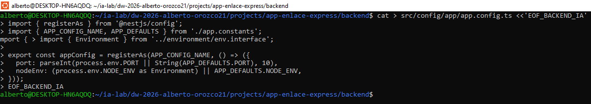

### 6.3 — config/logger/logger.config.ts

Archivo del feature en Clean Architecture.

**Archivo:** `src/config/logger/logger.config.ts`

```bash
mkdir -p src/config/logger
cat > src/config/logger/logger.config.ts <<'EOF_BACKEND_IA'
import { LogLevel } from '@nestjs/common';

export function getLoggerConfig(): { logLevels: LogLevel[] } {
  const isDev = process.env.NODE_ENV === 'development';

  return {
    logLevels: isDev
      ? ['log', 'error', 'warn', 'debug', 'verbose', 'fatal']
      : ['log', 'error', 'warn'],
  };
}
EOF_BACKEND_IA
```

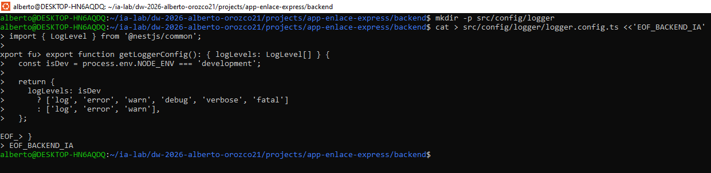

### 6.4 — config/logger/logger.module.ts

Módulo Nest del feature: cablea providers, tokens DI y controller.

**Archivo:** `src/config/logger/logger.module.ts`

```bash
mkdir -p src/config/logger
cat > src/config/logger/logger.module.ts <<'EOF_BACKEND_IA'
import { Module, Global, Logger } from '@nestjs/common';

@Global()
@Module({
  providers: [Logger],
  exports: [Logger],
})
export class LoggerModule {}
EOF_BACKEND_IA
```

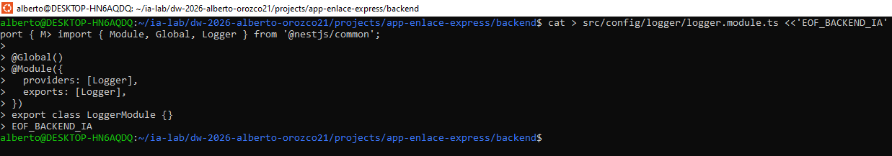

### 6.5 — config/swagger/swagger.constants.ts

Archivo del feature en Clean Architecture.

**Archivo:** `src/config/swagger/swagger.constants.ts`

```bash
mkdir -p src/config/swagger
cat > src/config/swagger/swagger.constants.ts <<'EOF_BACKEND_IA'
export const SWAGGER_TITLE = 'EnlaceExpress API';
export const SWAGGER_DESCRIPTION =
  'API de mensajería corporativa EnlaceExpress: envíos, tracking, tarifas y facturación (Clean Architecture / DDD sobre NestJS + Sequelize, multi-motor)';
export const SWAGGER_VERSION = '1.0';
export const SWAGGER_PATH = 'api/docs';
EOF_BACKEND_IA
```

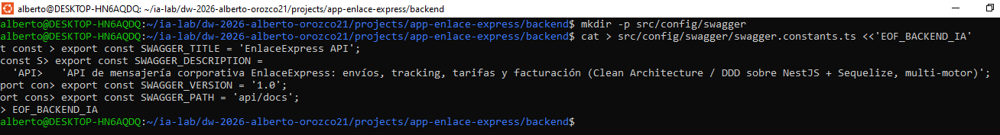

### 6.6 — config/swagger/swagger.config.ts

Archivo del feature en Clean Architecture. *(adaptado: se quitó `.addBearerAuth(...)`, ya que el proyecto no maneja autenticación)*

**Archivo:** `src/config/swagger/swagger.config.ts`

```bash
mkdir -p src/config/swagger
cat > src/config/swagger/swagger.config.ts <<'EOF_BACKEND_IA'
import { INestApplication } from '@nestjs/common';
import { DocumentBuilder, SwaggerModule } from '@nestjs/swagger';
import {
  SWAGGER_DESCRIPTION,
  SWAGGER_PATH,
  SWAGGER_TITLE,
  SWAGGER_VERSION,
} from './swagger.constants';

export function setupSwagger(app: INestApplication): void {
  const config = new DocumentBuilder()
    .setTitle(SWAGGER_TITLE)
    .setDescription(SWAGGER_DESCRIPTION)
    .setVersion(SWAGGER_VERSION)
    .build();

  const document = SwaggerModule.createDocument(app, config);
  SwaggerModule.setup(SWAGGER_PATH, app, document);
}
EOF_BACKEND_IA
```

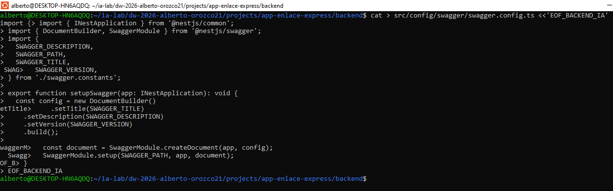

### 6.7 — common/enums/status.enum.ts

Archivo del feature en Clean Architecture.

**Archivo:** `src/common/enums/status.enum.ts`

```bash
mkdir -p src/common/enums
cat > src/common/enums/status.enum.ts <<'EOF_BACKEND_IA'
export enum Status {
  ACTIVE = 'ACTIVE',
  INACTIVE = 'INACTIVE',
}
EOF_BACKEND_IA
```

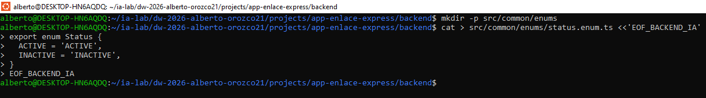

### 6.8 — common/enums/http-method.enum.ts

Archivo del feature en Clean Architecture.

**Archivo:** `src/common/enums/http-method.enum.ts`

```bash
mkdir -p src/common/enums
cat > src/common/enums/http-method.enum.ts <<'EOF_BACKEND_IA'
export enum HttpMethod {
  GET = 'GET',
  POST = 'POST',
  PUT = 'PUT',
  PATCH = 'PATCH',
  DELETE = 'DELETE',
}
EOF_BACKEND_IA
```

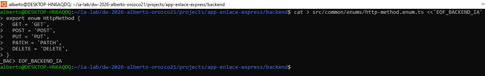

### 6.9 — common/enums/sort-order.enum.ts

Archivo del feature en Clean Architecture.

**Archivo:** `src/common/enums/sort-order.enum.ts`

```bash
mkdir -p src/common/enums
cat > src/common/enums/sort-order.enum.ts <<'EOF_BACKEND_IA'
export enum SortOrder {
  ASC = 'ASC',
  DESC = 'DESC',
}
EOF_BACKEND_IA
```

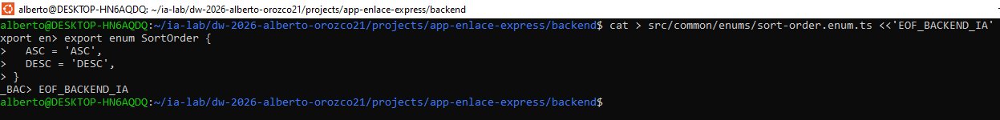

### 6.10 — common/constants/app.constants.ts

Archivo del feature en Clean Architecture. *(adaptado: `APP_NAME` al nombre del proyecto)*

**Archivo:** `src/common/constants/app.constants.ts`

```bash
mkdir -p src/common/constants
cat > src/common/constants/app.constants.ts <<'EOF_BACKEND_IA'
export const APP_NAME = 'enlace_express_api';
export const GLOBAL_PREFIX = 'api';
EOF_BACKEND_IA
```

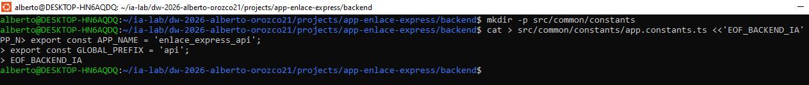

### 6.11 — common/constants/pagination.constants.ts

Archivo del feature en Clean Architecture.

**Archivo:** `src/common/constants/pagination.constants.ts`

```bash
mkdir -p src/common/constants
cat > src/common/constants/pagination.constants.ts <<'EOF_BACKEND_IA'
export const DEFAULT_PAGE = 1;
export const DEFAULT_LIMIT = 10;
export const MAX_LIMIT = 100;
EOF_BACKEND_IA
```

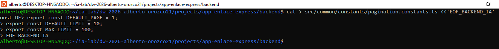

### 6.12 — common/exceptions/application.exception.ts

Archivo del feature en Clean Architecture.

**Archivo:** `src/common/exceptions/application.exception.ts`

```bash
mkdir -p src/common/exceptions
cat > src/common/exceptions/application.exception.ts <<'EOF_BACKEND_IA'
export class ApplicationException extends Error {
  public readonly timestamp: string;

  constructor(
    public readonly message: string,
    public readonly statusCode: number = 500,
  ) {
    super(message);
    this.timestamp = new Date().toISOString();
    Error.captureStackTrace(this, this.constructor);
  }
}
EOF_BACKEND_IA
```

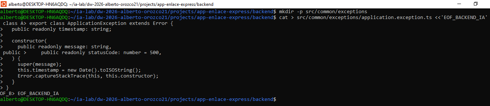

### 6.13 — common/exceptions/domain.exception.ts

Archivo del feature en Clean Architecture.

**Archivo:** `src/common/exceptions/domain.exception.ts`

```bash
mkdir -p src/common/exceptions
cat > src/common/exceptions/domain.exception.ts <<'EOF_BACKEND_IA'
import { ApplicationException } from './application.exception';

export class DomainException extends ApplicationException {
  constructor(message: string) {
    super(message, 400);
  }
}
EOF_BACKEND_IA
```

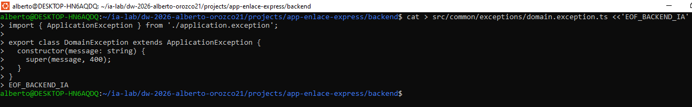

### 6.14 — common/exceptions/entity-not-found.exception.ts

Archivo del feature en Clean Architecture.

**Archivo:** `src/common/exceptions/entity-not-found.exception.ts`

```bash
mkdir -p src/common/exceptions
cat > src/common/exceptions/entity-not-found.exception.ts <<'EOF_BACKEND_IA'
import { ApplicationException } from './application.exception';

export class EntityNotFoundException extends ApplicationException {
  constructor(entityName: string, identifier: string | number) {
    super(`${entityName} con ID ${identifier} no encontrado`, 404);
  }
}
EOF_BACKEND_IA
```

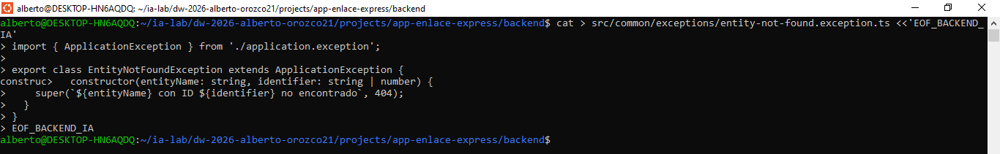

### 6.15 — common/exceptions/validation.exception.ts

Archivo del feature en Clean Architecture.

**Archivo:** `src/common/exceptions/validation.exception.ts`

```bash
mkdir -p src/common/exceptions
cat > src/common/exceptions/validation.exception.ts <<'EOF_BACKEND_IA'
import { ApplicationException } from './application.exception';

export class ValidationException extends ApplicationException {
  constructor(message: string = 'Error de validación') {
    super(message, 422);
  }
}
EOF_BACKEND_IA
```

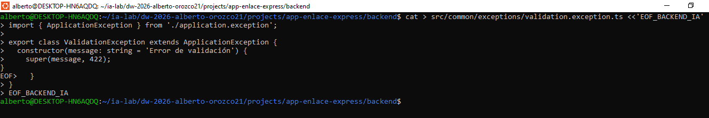

### 6.16 — common/filters/global-exception.filter.ts

Archivo del feature en Clean Architecture.

**Archivo:** `src/common/filters/global-exception.filter.ts`

```bash
mkdir -p src/common/filters
cat > src/common/filters/global-exception.filter.ts <<'EOF_BACKEND_IA'
import {
  ExceptionFilter,
  Catch,
  ArgumentsHost,
  HttpException,
  HttpStatus,
} from '@nestjs/common';
import { Request, Response } from 'express';
import { ApplicationException } from '../exceptions/application.exception';

@Catch()
export class GlobalExceptionFilter implements ExceptionFilter {
  catch(exception: unknown, host: ArgumentsHost): void {
    const ctx = host.switchToHttp();
    const response = ctx.getResponse<Response>();
    const request = ctx.getRequest<Request>();

    let status = HttpStatus.INTERNAL_SERVER_ERROR;
    let message: string | string[] = 'Error interno del servidor';

    if (exception instanceof ApplicationException) {
      status = exception.statusCode;
      message = exception.message;
    } else if (exception instanceof HttpException) {
      status = exception.getStatus();
      const res = exception.getResponse();
      message = typeof res === 'string' ? res : (res as any).message;
    }

    response.status(status).json({
      statusCode: status,
      message,
      timestamp: new Date().toISOString(),
      path: request.url,
    });
  }
}
EOF_BACKEND_IA
```

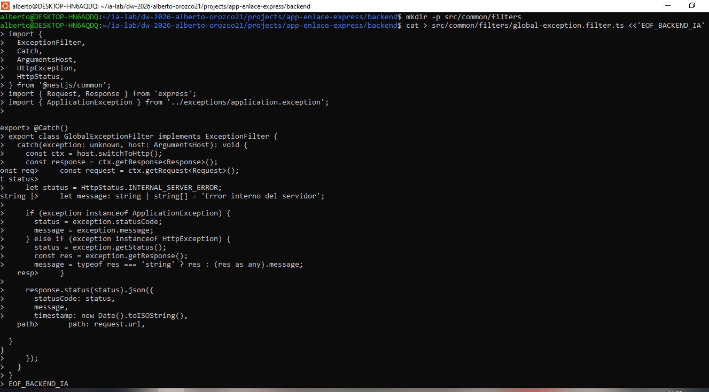

### 6.17 — common/filters/sequelize-exception.filter.ts

Archivo del feature en Clean Architecture.

**Archivo:** `src/common/filters/sequelize-exception.filter.ts`

```bash
mkdir -p src/common/filters
cat > src/common/filters/sequelize-exception.filter.ts <<'EOF_BACKEND_IA'
import { ExceptionFilter, Catch, ArgumentsHost } from '@nestjs/common';
import { Response } from 'express';

@Catch()
export class SequelizeExceptionFilter implements ExceptionFilter {
  catch(exception: any, host: ArgumentsHost): void {
    const ctx = host.switchToHttp();
    const response = ctx.getResponse<Response>();

    const sequelizeErrors = [
      'SequelizeUniqueConstraintError',
      'SequelizeForeignKeyConstraintError',
      'SequelizeConnectionError',
      'SequelizeValidationError',
      'SequelizeDatabaseError',
    ];

    if (!exception?.name || !sequelizeErrors.includes(exception.name)) {
      throw exception;
    }

    let status = 500;
    let message = 'Error de base de datos';

    if (exception.name === 'SequelizeUniqueConstraintError') {
      status = 409;
      message = 'El recurso ya existe (violación de unicidad)';
    } else if (exception.name === 'SequelizeForeignKeyConstraintError') {
      status = 400;
      message = 'Violación de clave foránea';
    } else if (exception.name === 'SequelizeConnectionError') {
      status = 503;
      message = 'No se pudo conectar a la base de datos';
    } else if (exception.name === 'SequelizeValidationError') {
      status = 422;
      message = exception.message || 'Error de validación en base de datos';
    }

    response.status(status).json({
      statusCode: status,
      message,
      timestamp: new Date().toISOString(),
    });
  }
}
EOF_BACKEND_IA
```

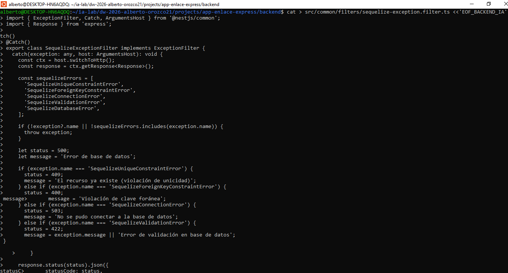

### 6.18 — common/interceptors/response.interceptor.ts

Archivo del feature en Clean Architecture.

**Archivo:** `src/common/interceptors/response.interceptor.ts`

```bash
mkdir -p src/common/interceptors
cat > src/common/interceptors/response.interceptor.ts <<'EOF_BACKEND_IA'
import {
  Injectable,
  NestInterceptor,
  ExecutionContext,
  CallHandler,
} from '@nestjs/common';
import { Observable } from 'rxjs';
import { map } from 'rxjs/operators';

export interface ApiResponse<T> {
  statusCode: number;
  message: string;
  data: T;
  timestamp: string;
}

@Injectable()
export class ResponseInterceptor<T>
  implements NestInterceptor<T, ApiResponse<T>>
{
  intercept(
    context: ExecutionContext,
    next: CallHandler,
  ): Observable<ApiResponse<T>> {
    const response = context.switchToHttp().getResponse();
    const statusCode = response.statusCode;

    return next.handle().pipe(
      map((data) => ({
        statusCode,
        message: 'Operación exitosa',
        data,
        timestamp: new Date().toISOString(),
      })),
    );
  }
}
EOF_BACKEND_IA
```

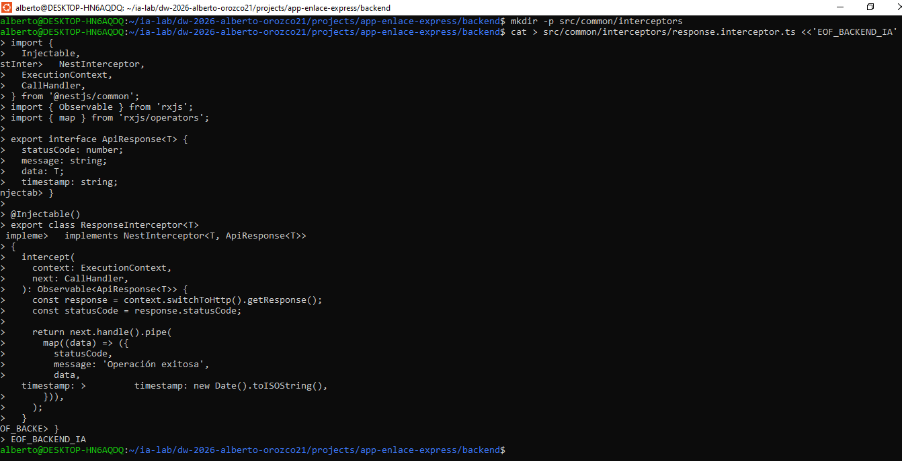

### 6.19 — common/interceptors/logging.interceptor.ts

Archivo del feature en Clean Architecture.

**Archivo:** `src/common/interceptors/logging.interceptor.ts`

```bash
mkdir -p src/common/interceptors
cat > src/common/interceptors/logging.interceptor.ts <<'EOF_BACKEND_IA'
import {
  Injectable,
  NestInterceptor,
  ExecutionContext,
  CallHandler,
  Logger,
} from '@nestjs/common';
import { Observable } from 'rxjs';
import { tap } from 'rxjs/operators';

@Injectable()
export class LoggingInterceptor implements NestInterceptor {
  private readonly logger = new Logger('HTTP');

  intercept(context: ExecutionContext, next: CallHandler): Observable<any> {
    const req = context.switchToHttp().getRequest();
    const { method, url } = req;
    const now = Date.now();

    return next.handle().pipe(
      tap(() => {
        const res = context.switchToHttp().getResponse();
        const delay = Date.now() - now;
        this.logger.log(`${method} ${url} ${res.statusCode} - ${delay}ms`);
      }),
    );
  }
}
EOF_BACKEND_IA
```

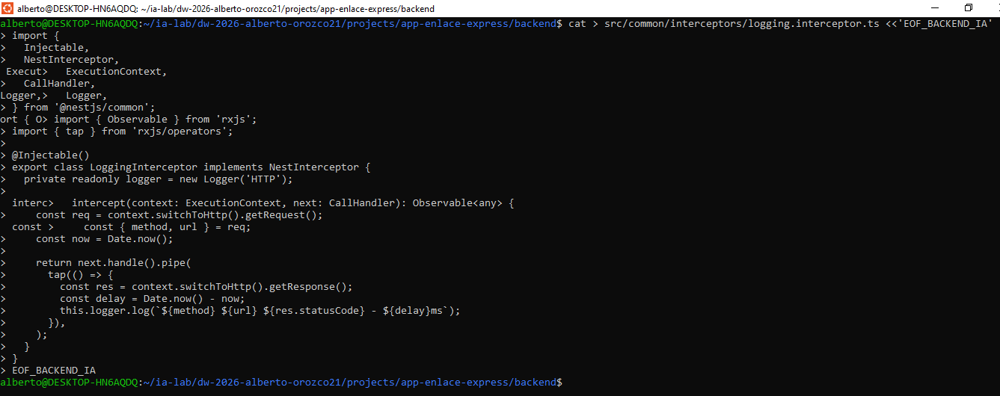

### 6.20 — common/interceptors/timeout.interceptor.ts

Archivo del feature en Clean Architecture.

**Archivo:** `src/common/interceptors/timeout.interceptor.ts`

```bash
mkdir -p src/common/interceptors
cat > src/common/interceptors/timeout.interceptor.ts <<'EOF_BACKEND_IA'
import {
  Injectable,
  NestInterceptor,
  ExecutionContext,
  CallHandler,
  RequestTimeoutException,
} from '@nestjs/common';
import { Observable, throwError, TimeoutError } from 'rxjs';
import { catchError, timeout } from 'rxjs/operators';

@Injectable()
export class TimeoutInterceptor implements NestInterceptor {
  intercept(context: ExecutionContext, next: CallHandler): Observable<any> {
    return next.handle().pipe(
      timeout(30000),
      catchError((err) => {
        if (err instanceof TimeoutError) {
          return throwError(() => new RequestTimeoutException());
        }
        return throwError(() => err);
      }),
    );
  }
}
EOF_BACKEND_IA
```

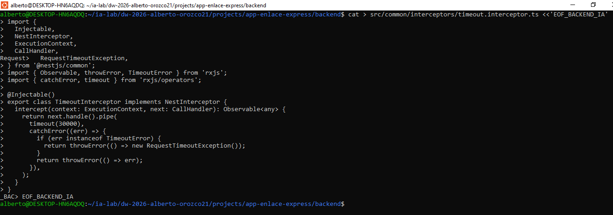

### 6.21 — common/pipes/validation.pipe.ts

Archivo del feature en Clean Architecture.

**Archivo:** `src/common/pipes/validation.pipe.ts`

```bash
mkdir -p src/common/pipes
cat > src/common/pipes/validation.pipe.ts <<'EOF_BACKEND_IA'
import {
  PipeTransform,
  Injectable,
  ArgumentMetadata,
  BadRequestException,
} from '@nestjs/common';
import { validate } from 'class-validator';
import { plainToInstance } from 'class-transformer';

@Injectable()
export class CustomValidationPipe implements PipeTransform<any> {
  async transform(value: any, { metatype }: ArgumentMetadata) {
    if (!metatype || !this.toValidate(metatype)) {
      return value;
    }

    const object = plainToInstance(metatype, value);
    const errors = await validate(object);

    if (errors.length > 0) {
      const messages = errors.map(
        (err) =>
          `${err.property}: ${Object.values(err.constraints || {}).join(', ')}`,
      );
      throw new BadRequestException(messages);
    }

    return object;
  }

  private toValidate(metatype: any): boolean {
    const types = [String, Boolean, Number, Array, Object];
    return !types.includes(metatype);
  }
}
EOF_BACKEND_IA
```

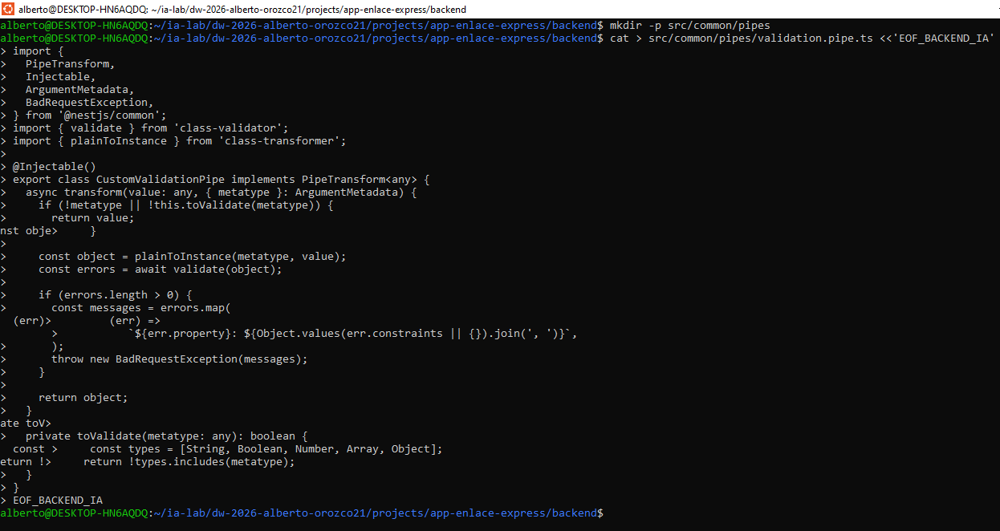

### 6.22 — common/pipes/parse-positive-int.pipe.ts

Archivo del feature en Clean Architecture.

**Archivo:** `src/common/pipes/parse-positive-int.pipe.ts`

```bash
mkdir -p src/common/pipes
cat > src/common/pipes/parse-positive-int.pipe.ts <<'EOF_BACKEND_IA'
import {
  PipeTransform,
  Injectable,
  BadRequestException,
} from '@nestjs/common';

@Injectable()
export class ParsePositiveIntPipe implements PipeTransform<string, number> {
  transform(value: string): number {
    const parsed = parseInt(value, 10);

    if (isNaN(parsed) || parsed <= 0) {
      throw new BadRequestException(
        `El valor '${value}' no es un entero positivo`,
      );
    }

    return parsed;
  }
}
EOF_BACKEND_IA
```

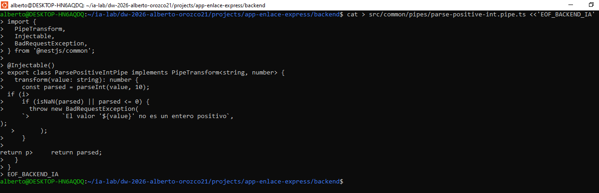

### 6.23 — common/interfaces/pagination.interface.ts

Archivo del feature en Clean Architecture.

**Archivo:** `src/common/interfaces/pagination.interface.ts`

```bash
mkdir -p src/common/interfaces
cat > src/common/interfaces/pagination.interface.ts <<'EOF_BACKEND_IA'
export interface PaginationMeta {
  page: number;
  limit: number;
  total: number;
  totalPages: number;
}

export interface PaginatedResult<T> {
  items: T[];
  meta: PaginationMeta;
}
EOF_BACKEND_IA
```

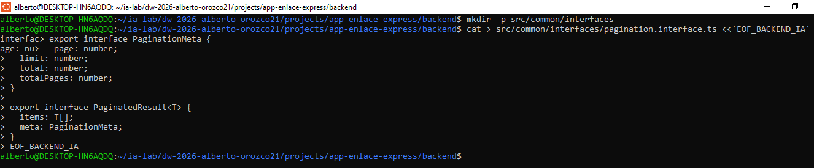

### 6.24 — common/interfaces/api-response.interface.ts

Archivo del feature en Clean Architecture.

**Archivo:** `src/common/interfaces/api-response.interface.ts`

```bash
mkdir -p src/common/interfaces
cat > src/common/interfaces/api-response.interface.ts <<'EOF_BACKEND_IA'
export interface ApiResponseBody<T> {
  statusCode: number;
  message: string;
  data: T;
  timestamp: string;
}
EOF_BACKEND_IA
```

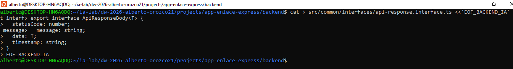

### 6.25 — common/types/nullable.type.ts

Archivo del feature en Clean Architecture.

**Archivo:** `src/common/types/nullable.type.ts`

```bash
mkdir -p src/common/types
cat > src/common/types/nullable.type.ts <<'EOF_BACKEND_IA'
export type Nullable<T> = T | null;
EOF_BACKEND_IA
```

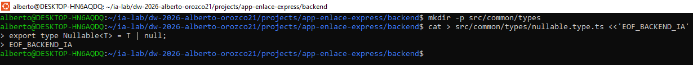

### 6.26 — common/types/optional.type.ts

Archivo del feature en Clean Architecture.

**Archivo:** `src/common/types/optional.type.ts`

```bash
mkdir -p src/common/types
cat > src/common/types/optional.type.ts <<'EOF_BACKEND_IA'
export type Optional<T> = T | undefined;
EOF_BACKEND_IA
```

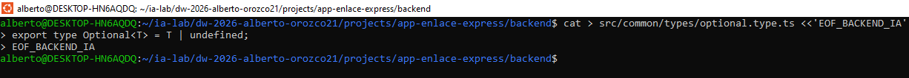

### 6.27 — common/utils/pagination.util.ts

Archivo del feature en Clean Architecture.

**Archivo:** `src/common/utils/pagination.util.ts`

```bash
mkdir -p src/common/utils
cat > src/common/utils/pagination.util.ts <<'EOF_BACKEND_IA'
import {
  DEFAULT_LIMIT,
  DEFAULT_PAGE,
  MAX_LIMIT,
} from '../constants/pagination.constants';
import { PaginatedResult } from '../interfaces/pagination.interface';

export function normalizePagination(page?: number, limit?: number) {
  const safePage = !page || page < 1 ? DEFAULT_PAGE : page;
  const safeLimit = !limit || limit < 1 ? DEFAULT_LIMIT : Math.min(limit, MAX_LIMIT);
  const offset = (safePage - 1) * safeLimit;
  return { page: safePage, limit: safeLimit, offset };
}

export function buildPaginatedResult<T>(
  items: T[],
  total: number,
  page: number,
  limit: number,
): PaginatedResult<T> {
  return {
    items,
    meta: {
      page,
      limit,
      total,
      totalPages: Math.ceil(total / limit) || 0,
    },
  };
}
EOF_BACKEND_IA
```

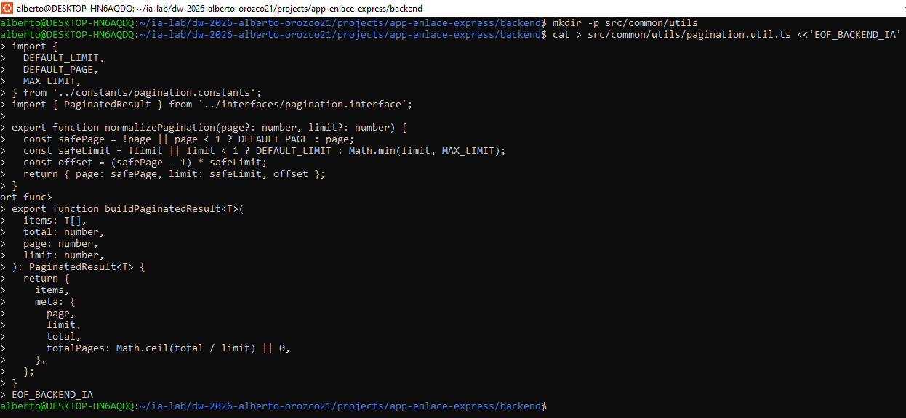

### 6.28 — common/utils/date.util.ts

Archivo del feature en Clean Architecture.

**Archivo:** `src/common/utils/date.util.ts`

```bash
mkdir -p src/common/utils
cat > src/common/utils/date.util.ts <<'EOF_BACKEND_IA'
export function addDays(date: Date, days: number): Date {
  const result = new Date(date);
  result.setDate(result.getDate() + days);
  return result;
}

export function parseDurationToMs(duration: string): number {
  const match = /^(\d+)([smhd])$/.exec(duration);
  if (!match) {
    return 24 * 60 * 60 * 1000;
  }

  const value = parseInt(match[1], 10);
  const unit = match[2];

  switch (unit) {
    case 's':
      return value * 1000;
    case 'm':
      return value * 60 * 1000;
    case 'h':
      return value * 60 * 60 * 1000;
    case 'd':
      return value * 24 * 60 * 60 * 1000;
    default:
      return 24 * 60 * 60 * 1000;
  }
}
EOF_BACKEND_IA
```

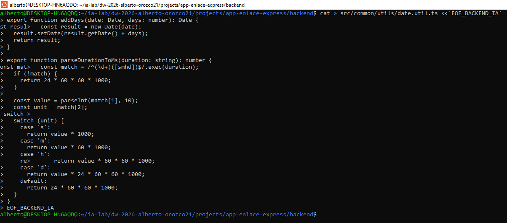

### 6.29 — common/utils/string.util.ts

Archivo del feature en Clean Architecture.

**Archivo:** `src/common/utils/string.util.ts`

```bash
mkdir -p src/common/utils
cat > src/common/utils/string.util.ts <<'EOF_BACKEND_IA'
export function normalizeEmail(email: string): string {
  return email.trim().toLowerCase();
}

export function isBlank(value?: string | null): boolean {
  return !value || value.trim().length === 0;
}
EOF_BACKEND_IA
```

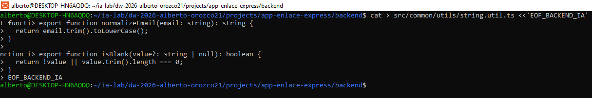

### 6.30 — Actualizar main.ts (bootstrap completo)

Prefix global, filters, interceptors, pipes, Swagger y manejo amigable de EADDRINUSE.

**Archivo:** `src/main.ts`

```bash
mkdir -p src
cat > src/main.ts <<'EOF_BACKEND_IA'
import { NestFactory } from '@nestjs/core';
import { ConfigService } from '@nestjs/config';
import { AppModule } from './app.module';
import { getLoggerConfig } from './config/logger/logger.config';
import { GlobalExceptionFilter } from './common/filters/global-exception.filter';
import { ResponseInterceptor } from './common/interceptors/response.interceptor';
import { LoggingInterceptor } from './common/interceptors/logging.interceptor';
import { TimeoutInterceptor } from './common/interceptors/timeout.interceptor';
import { CustomValidationPipe } from './common/pipes/validation.pipe';
import { setupSwagger } from './config/swagger/swagger.config';
import { GLOBAL_PREFIX } from './common/constants/app.constants';

async function bootstrap() {
  const app = await NestFactory.create(AppModule, {
    logger: getLoggerConfig().logLevels,
  });

  const configService = app.get(ConfigService);
  const port = configService.get<number>('app.port', 3002);

  app.setGlobalPrefix(GLOBAL_PREFIX);

  app.useGlobalFilters(new GlobalExceptionFilter());

  app.useGlobalInterceptors(
    new ResponseInterceptor(),
    new LoggingInterceptor(),
    new TimeoutInterceptor(),
  );

  app.useGlobalPipes(new CustomValidationPipe());

  setupSwagger(app);

  try {
    await app.listen(port);
    console.log(`🚀 Application running on: http://localhost:${port}`);
    console.log(`📘 Swagger: http://localhost:${port}/api/docs`);
  } catch (error: any) {
    if (error?.code === 'EADDRINUSE') {
      console.error(
        `❌ El puerto ${port} ya está en uso (EADDRINUSE).\n` +
          `   Solución rápida:\n` +
          `   1) npm run free:port\n` +
          `   2) npm run start:dev\n` +
          `   O cambia PORT en el archivo .env`,
      );
      await app.close();
      process.exit(1);
    }
    throw error;
  }
}
bootstrap();
EOF_BACKEND_IA
```

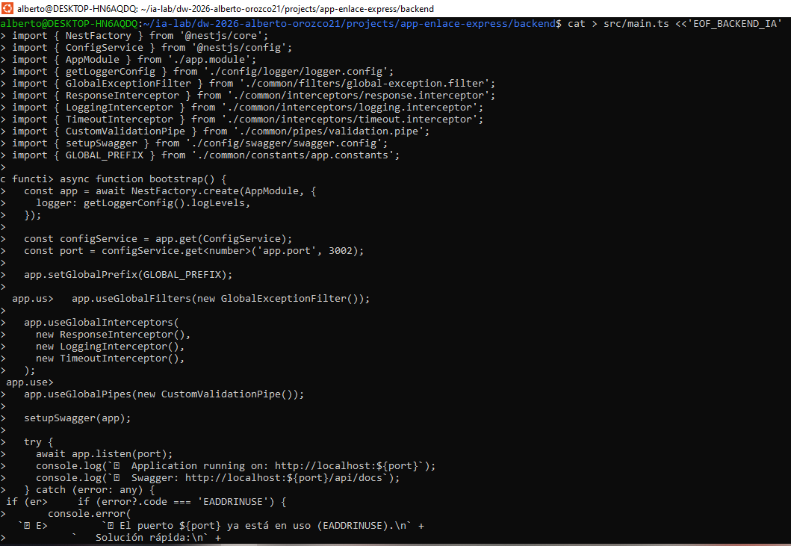

### 6.31 — Actualizar app.module.ts (base sin features ni security)

Cablea Config + Sequelize + Logger. Business llega en fases posteriores.

**Archivo:** `src/app.module.ts`

```bash
mkdir -p src
cat > src/app.module.ts <<'EOF_BACKEND_IA'
import { Module } from '@nestjs/common';
import { ConfigModule } from '@nestjs/config';
import { envConfig } from './config/environment/env.config';
import { appConfig } from './config/app/app.config';
import { LoggerModule } from './config/logger/logger.module';
import { SequelizeDatabaseModule } from './infrastructure/database/sequelize/sequelize.module';
import { AppController } from './app.controller';
import { AppService } from './app.service';

@Module({
  imports: [
    ConfigModule.forRoot({
      isGlobal: true,
      load: [envConfig, appConfig],
      envFilePath: '.env',
    }),
    SequelizeDatabaseModule,
    LoggerModule,
  ],
  controllers: [AppController],
  providers: [
    AppService,
  ],
})
export class AppModule {}
EOF_BACKEND_IA
```

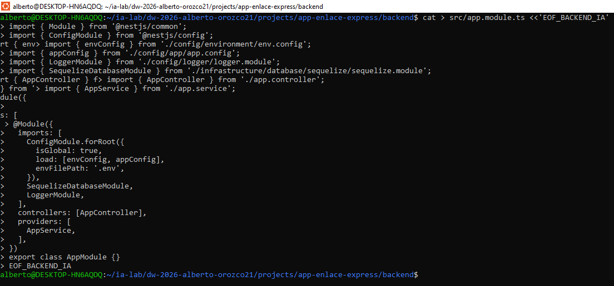

### 6.32 — Verificar bootstrap transversal

La app debe arrancar, mostrar Swagger en `/api/docs` y conectar a BD. Todavía no hay endpoints de negocio.

```bash
npm run start:dev
# Abre http://localhost:3002/api/docs
# Ctrl+C
```

**Consola**

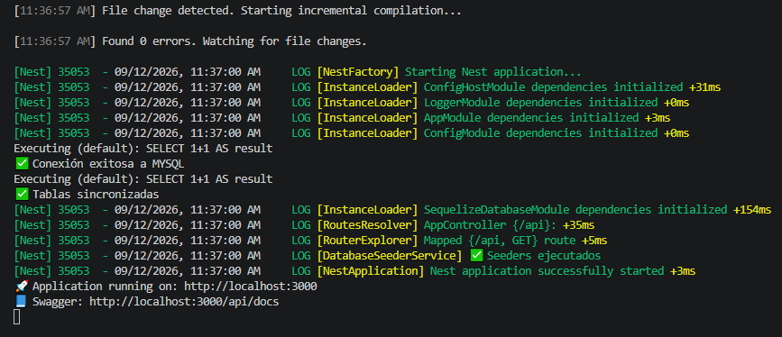


**http://localhost:3002/api/docs**

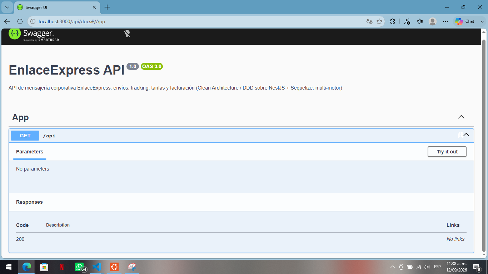

----------------------------------------------------------------------------------

## FASE 7 — `06_BUSINESS_COMPANIES`

### Business — Companies / Empresa (patrón completo CA)

> **Objetivo de la fase:** Primera entidad de negocio de EnlaceExpress: Empresa. Orden lógico: dominio → infraestructura → aplicación → presentación → módulo → cableado → verificación.
>
> **Nota sobre asociaciones:** `Empresa` se relaciona `1:N` con `Contacto`, `Direccion`, `Envio` y `Factura`, pero esas entidades aún no existen. A diferencia de la plantilla original (que usaba `require()` diferido dentro de `@HasMany`, algo que no funciona en este proyecto ESM), aquí `CompanyModel` se crea **sin asociaciones**. Se agregarán con imports estáticos normales cuando se construyan esas entidades en fases posteriores.

### 7.1 — features/shipping/companies/domain/entities/company.entity.ts

Entidad de dominio (TypeScript puro). No extiende Sequelize `Model`. Aquí viven las reglas del negocio.

**Archivo:** `src/features/shipping/companies/domain/entities/company.entity.ts`

```bash
mkdir -p src/features/shipping/companies/domain/entities
cat > src/features/shipping/companies/domain/entities/company.entity.ts <<'EOF_BACKEND_IA'
import { isValidNit } from '../validators/company-nit.validator';

export interface CompanyProps {
  id?: number;
  nit: string;
  razonSocial: string;
  isActive?: boolean;
  createdAt?: Date;
  updatedAt?: Date;
}

export class Company {
  id?: number;
  nit: string;
  razonSocial: string;
  isActive: boolean;
  createdAt?: Date;
  updatedAt?: Date;

  private constructor(props: CompanyProps) {
    this.id = props.id;
    this.nit = props.nit;
    this.razonSocial = props.razonSocial;
    this.isActive = props.isActive ?? true;
    this.createdAt = props.createdAt;
    this.updatedAt = props.updatedAt;
  }

  static create(
    props: Omit<CompanyProps, 'id' | 'isActive' | 'createdAt' | 'updatedAt'>,
  ): Company {
    if (!props.nit?.trim()) {
      throw new Error('El NIT de la empresa es requerido');
    }

    if (!isValidNit(props.nit)) {
      throw new Error('El NIT de la empresa no es válido');
    }

    if (!props.razonSocial?.trim()) {
      throw new Error('La razón social de la empresa es requerida');
    }

    return new Company(props);
  }

  static reconstitute(props: CompanyProps): Company {
    return new Company(props);
  }

  update(
    props: Partial<
      Omit<CompanyProps, 'id' | 'isActive' | 'createdAt' | 'updatedAt'>
    >,
  ): void {
    if (props.nit !== undefined) {
      if (!props.nit.trim()) {
        throw new Error('El NIT de la empresa es requerido');
      }
      if (!isValidNit(props.nit)) {
        throw new Error('El NIT de la empresa no es válido');
      }
      this.nit = props.nit;
    }

    if (props.razonSocial !== undefined) {
      if (!props.razonSocial.trim()) {
        throw new Error('La razón social de la empresa es requerida');
      }
      this.razonSocial = props.razonSocial;
    }
  }

  deactivate(): void {
    this.isActive = false;
  }

  activate(): void {
    this.isActive = true;
  }
}
EOF_BACKEND_IA
```

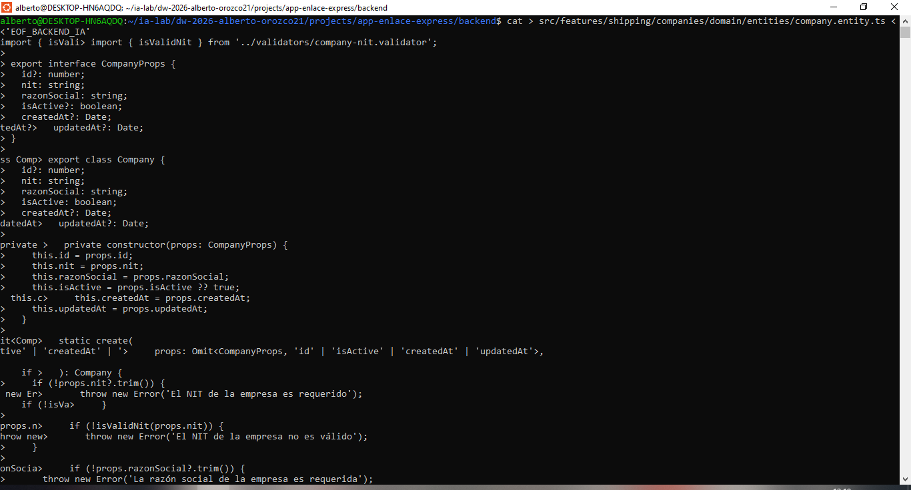

### 7.2 — features/shipping/companies/domain/exceptions/company-nit-already-exists.exception.ts

Excepción de dominio. El caso de uso la lanza; el filter HTTP la traduce a status code.

**Archivo:** `src/features/shipping/companies/domain/exceptions/company-nit-already-exists.exception.ts`

```bash
mkdir -p src/features/shipping/companies/domain/exceptions
cat > src/features/shipping/companies/domain/exceptions/company-nit-already-exists.exception.ts <<'EOF_BACKEND_IA'
import { DomainException } from '../../../../../common/exceptions/domain.exception';

export class CompanyNitAlreadyExistsException extends DomainException {
  constructor(nit: string) {
    super(`El NIT '${nit}' ya está registrado`);
  }
}
EOF_BACKEND_IA
```

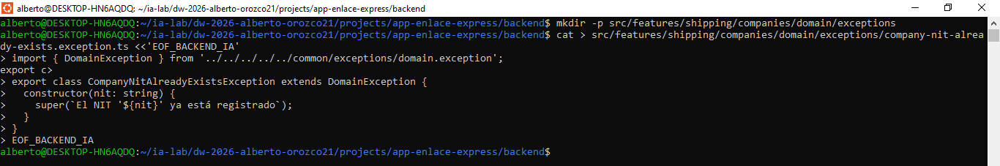

### 7.3 — features/shipping/companies/domain/exceptions/company-not-found.exception.ts

Excepción de dominio. El caso de uso la lanza; el filter HTTP la traduce a status code.

**Archivo:** `src/features/shipping/companies/domain/exceptions/company-not-found.exception.ts`

```bash
mkdir -p src/features/shipping/companies/domain/exceptions
cat > src/features/shipping/companies/domain/exceptions/company-not-found.exception.ts <<'EOF_BACKEND_IA'
import { EntityNotFoundException } from '../../../../../common/exceptions/entity-not-found.exception';

export class CompanyNotFoundException extends EntityNotFoundException {
  constructor(id: number) {
    super('Empresa', id);
  }
}
EOF_BACKEND_IA
```

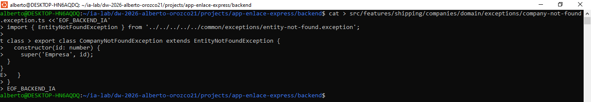

### 7.4 — features/shipping/companies/domain/interfaces/company-repository.interface.ts

Puerto (contrato) del repositorio. La aplicación depende de esta interface, no de Sequelize.

**Archivo:** `src/features/shipping/companies/domain/interfaces/company-repository.interface.ts`

```bash
mkdir -p src/features/shipping/companies/domain/interfaces
cat > src/features/shipping/companies/domain/interfaces/company-repository.interface.ts <<'EOF_BACKEND_IA'
import { PaginatedResult } from '../../../../../common/interfaces/pagination.interface';
import { Company } from '../entities/company.entity';

export const COMPANY_REPOSITORY = 'COMPANY_REPOSITORY';

export interface CompanyFindAllParams {
  page?: number;
  limit?: number;
  search?: string;
}

export interface ICompanyRepository {
  create(company: Company): Promise<Company>;
  update(company: Company): Promise<Company>;
  delete(id: number): Promise<void>;
  findById(id: number): Promise<Company | null>;
  findByNit(nit: string): Promise<Company | null>;
  findAll(params: CompanyFindAllParams): Promise<PaginatedResult<Company>>;
}
EOF_BACKEND_IA
```

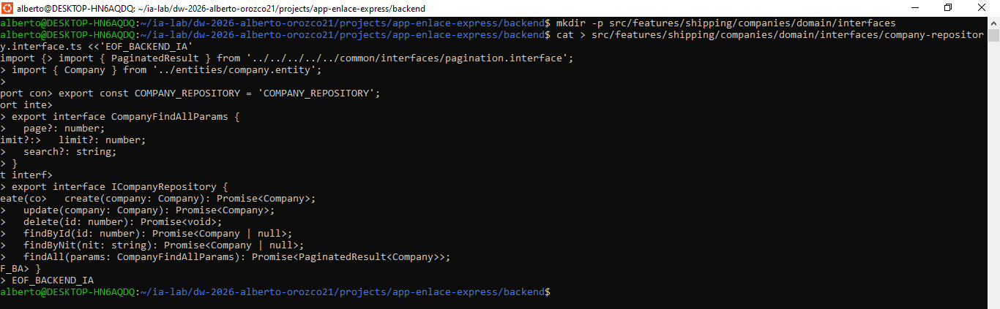

### 7.5 — features/shipping/companies/domain/validators/company-nit.validator.ts

Validador de dominio reutilizable (reglas independientes del framework HTTP).

**Archivo:** `src/features/shipping/companies/domain/validators/company-nit.validator.ts`

```bash
mkdir -p src/features/shipping/companies/domain/validators
cat > src/features/shipping/companies/domain/validators/company-nit.validator.ts <<'EOF_BACKEND_IA'
export function isValidNit(nit: string): boolean {
  // Dígitos, con guion y dígito de verificación opcional (ej. 900123456-7)
  const nitRegex = /^\d{5,15}(-\d)?$/;
  return nitRegex.test(nit.trim());
}
EOF_BACKEND_IA
```

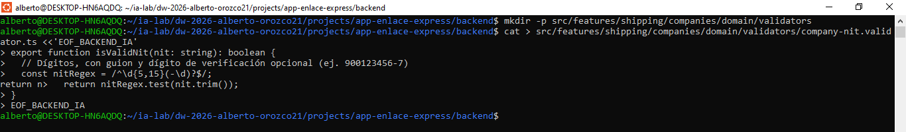

### 7.6 — features/shipping/companies/infrastructure/persistence/models/company.model.ts

Modelo Sequelize (`@Table`). Solo infraestructura: mapeo a tabla física. *(sin asociaciones todavía — ver nota al inicio de la fase)*

**Archivo:** `src/features/shipping/companies/infrastructure/persistence/models/company.model.ts`

```bash
mkdir -p src/features/shipping/companies/infrastructure/persistence/models
cat > src/features/shipping/companies/infrastructure/persistence/models/company.model.ts <<'EOF_BACKEND_IA'
import {
  AutoIncrement,
  Column,
  CreatedAt,
  DataType,
  Model,
  PrimaryKey,
  Table,
  UpdatedAt,
} from 'sequelize-typescript';

@Table({ tableName: 'companies' })
export class CompanyModel extends Model {
  @PrimaryKey
  @AutoIncrement
  @Column(DataType.INTEGER)
  declare id: number;

  @Column({ type: DataType.STRING(20), allowNull: false, unique: true })
  declare nit: string;

  @Column({ type: DataType.STRING(200), allowNull: false })
  declare razonSocial: string;

  @Column({ type: DataType.BOOLEAN, allowNull: false, defaultValue: true })
  declare isActive: boolean;

  @CreatedAt
  declare createdAt: Date;

  @UpdatedAt
  declare updatedAt: Date;

  // Asociaciones (contacts, addresses, shipments, invoices) se agregan
  // en las fases donde se crean esas entidades, con import estático normal.
}
EOF_BACKEND_IA
```

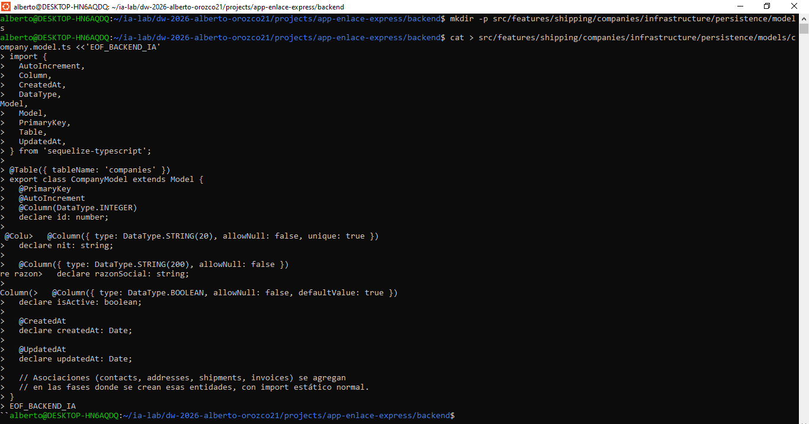

### 7.7 — features/shipping/companies/infrastructure/persistence/repositories/company.repository.ts

Adaptador del repositorio: implementa el puerto de dominio con Sequelize.

**Archivo:** `src/features/shipping/companies/infrastructure/persistence/repositories/company.repository.ts`

```bash
mkdir -p src/features/shipping/companies/infrastructure/persistence/repositories
cat > src/features/shipping/companies/infrastructure/persistence/repositories/company.repository.ts <<'EOF_BACKEND_IA'
import { Injectable } from '@nestjs/common';
import { Op } from 'sequelize';
import {
  buildPaginatedResult,
  normalizePagination,
} from '../../../../../../common/utils/pagination.util';
import { Company } from '../../../domain/entities/company.entity';
import {
  CompanyFindAllParams,
  ICompanyRepository,
} from '../../../domain/interfaces/company-repository.interface';
import { CompanyMapper } from '../../../application/mappers/company.mapper';
import { CompanyModel } from '../models/company.model';

@Injectable()
export class CompanyRepository implements ICompanyRepository {
  async create(company: Company): Promise<Company> {
    const model = await CompanyModel.create(
      CompanyMapper.toPersistence(company),
    );
    return CompanyMapper.toDomain(model);
  }

  async update(company: Company): Promise<Company> {
    await CompanyModel.update(CompanyMapper.toPersistence(company), {
      where: { id: company.id },
    });
    const updated = await CompanyModel.findByPk(company.id!);
    return CompanyMapper.toDomain(updated!);
  }

  async delete(id: number): Promise<void> {
    await CompanyModel.destroy({ where: { id } });
  }

  async findById(id: number): Promise<Company | null> {
    const model = await CompanyModel.findByPk(id);
    return model ? CompanyMapper.toDomain(model) : null;
  }

  async findByNit(nit: string): Promise<Company | null> {
    const model = await CompanyModel.findOne({ where: { nit } });
    return model ? CompanyMapper.toDomain(model) : null;
  }

  async findAll(params: CompanyFindAllParams) {
    const { page, limit, offset } = normalizePagination(
      params.page,
      params.limit,
    );

    const where = params.search
      ? {
          [Op.or]: [
            { razonSocial: { [Op.like]: `%${params.search}%` } },
            { nit: { [Op.like]: `%${params.search}%` } },
          ],
        }
      : {};

    const { rows, count } = await CompanyModel.findAndCountAll({
      where,
      limit,
      offset,
      order: [['createdAt', 'DESC']],
    });

    return buildPaginatedResult(
      rows.map((row) => CompanyMapper.toDomain(row)),
      count,
      page,
      limit,
    );
  }
}
EOF_BACKEND_IA
```

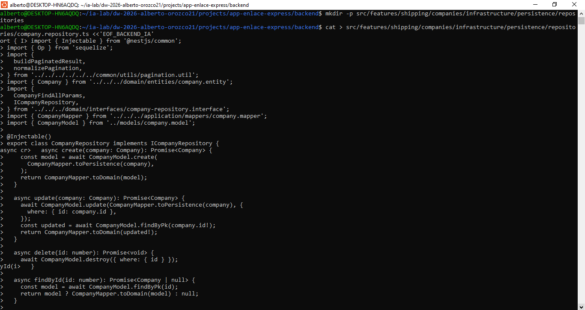

### 7.8 — features/shipping/companies/infrastructure/persistence/migrations/create-companies-table.migration.ts

Migración documental/auxiliar de la tabla. En dev el sync de Sequelize crea el esquema.

**Archivo:** `src/features/shipping/companies/infrastructure/persistence/migrations/create-companies-table.migration.ts`

```bash
mkdir -p src/features/shipping/companies/infrastructure/persistence/migrations
cat > src/features/shipping/companies/infrastructure/persistence/migrations/create-companies-table.migration.ts <<'EOF_BACKEND_IA'
export const createCompaniesTableMigration = {
  name: 'create-companies-table',
  async up(): Promise<void> {
    // Sequelize sync handles table creation in development.
    // Production: CREATE TABLE companies (id, nit, razonSocial, isActive, createdAt, updatedAt)
  },
  async down(): Promise<void> {
    // Production: DROP TABLE companies
  },
};
EOF_BACKEND_IA
```

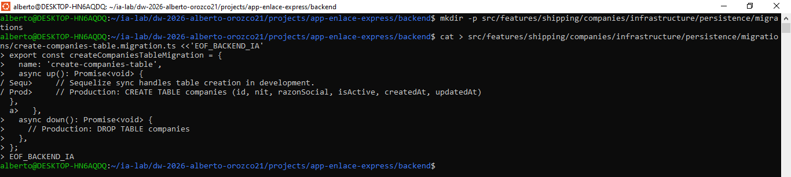

### 7.9 — features/shipping/companies/infrastructure/persistence/seeders/companies.seeder.ts

Seeder de datos iniciales para desarrollo y verificación física en BD.

**Archivo:** `src/features/shipping/companies/infrastructure/persistence/seeders/companies.seeder.ts`

```bash
mkdir -p src/features/shipping/companies/infrastructure/persistence/seeders
cat > src/features/shipping/companies/infrastructure/persistence/seeders/companies.seeder.ts <<'EOF_BACKEND_IA'
import { CompanyModel } from '../models/company.model';

export async function seedCompanies(): Promise<void> {
  const count = await CompanyModel.count();
  if (count > 0) {
    return;
  }

  await CompanyModel.bulkCreate([
    {
      nit: '900123456-7',
      razonSocial: 'Comercializadora Andina S.A.S.',
      isActive: true,
    },
    {
      nit: '901987654-3',
      razonSocial: 'Distribuciones del Caribe Ltda.',
      isActive: true,
    },
  ]);
}
EOF_BACKEND_IA
```

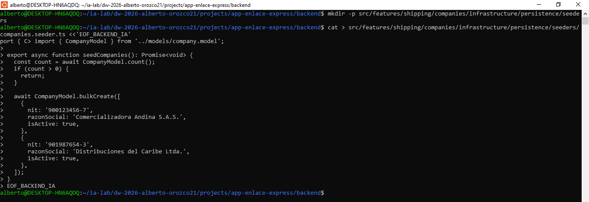

### 7.10 — features/shipping/companies/application/dto/company-filter.dto.ts

DTO de entrada/salida HTTP con `class-validator` / Swagger.

**Archivo:** `src/features/shipping/companies/application/dto/company-filter.dto.ts`

```bash
mkdir -p src/features/shipping/companies/application/dto
cat > src/features/shipping/companies/application/dto/company-filter.dto.ts <<'EOF_BACKEND_IA'
import { ApiPropertyOptional } from '@nestjs/swagger';
import { Type } from 'class-transformer';
import { IsInt, IsOptional, IsPositive, IsString, Min } from 'class-validator';

export class CompanyFilterDto {
  @ApiPropertyOptional({ example: 1, default: 1 })
  @IsOptional()
  @Type(() => Number)
  @IsInt()
  @Min(1)
  page?: number;

  @ApiPropertyOptional({ example: 10, default: 10 })
  @IsOptional()
  @Type(() => Number)
  @IsInt()
  @IsPositive()
  limit?: number;

  @ApiPropertyOptional({ example: 'andina' })
  @IsOptional()
  @IsString()
  search?: string;
}
EOF_BACKEND_IA
```

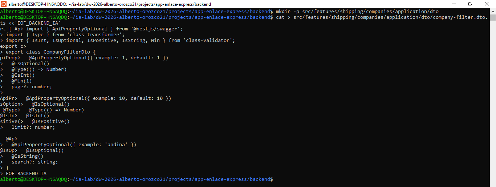

### 7.11 — features/shipping/companies/application/dto/company-response.dto.ts

DTO de entrada/salida HTTP con `class-validator` / Swagger.

**Archivo:** `src/features/shipping/companies/application/dto/company-response.dto.ts`

```bash
mkdir -p src/features/shipping/companies/application/dto
cat > src/features/shipping/companies/application/dto/company-response.dto.ts <<'EOF_BACKEND_IA'
import { ApiProperty } from '@nestjs/swagger';

export class CompanyResponseDto {
  @ApiProperty({ example: 1 })
  id: number;

  @ApiProperty({ example: '900123456-7' })
  nit: string;

  @ApiProperty({ example: 'Comercializadora Andina S.A.S.' })
  razonSocial: string;

  @ApiProperty({ example: true })
  isActive: boolean;

  @ApiProperty()
  createdAt: Date;

  @ApiProperty()
  updatedAt: Date;
}
EOF_BACKEND_IA
```

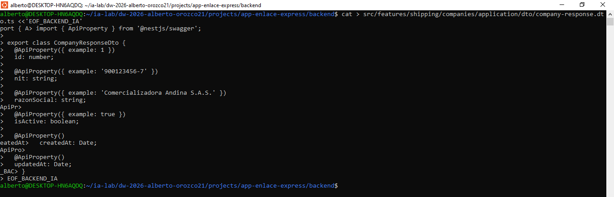

### 7.12 — features/shipping/companies/application/dto/create-company.dto.ts

DTO de entrada/salida HTTP con `class-validator` / Swagger.

**Archivo:** `src/features/shipping/companies/application/dto/create-company.dto.ts`

```bash
mkdir -p src/features/shipping/companies/application/dto
cat > src/features/shipping/companies/application/dto/create-company.dto.ts <<'EOF_BACKEND_IA'
import { ApiProperty } from '@nestjs/swagger';
import { IsNotEmpty, IsString, Matches, MaxLength } from 'class-validator';

export class CreateCompanyDto {
  @ApiProperty({ example: '900123456-7' })
  @IsString()
  @IsNotEmpty()
  @MaxLength(20)
  @Matches(/^\d{5,15}(-\d)?$/, {
    message: 'El NIT no tiene un formato válido',
  })
  nit: string;

  @ApiProperty({ example: 'Comercializadora Andina S.A.S.' })
  @IsString()
  @IsNotEmpty()
  @MaxLength(200)
  razonSocial: string;
}
EOF_BACKEND_IA
```

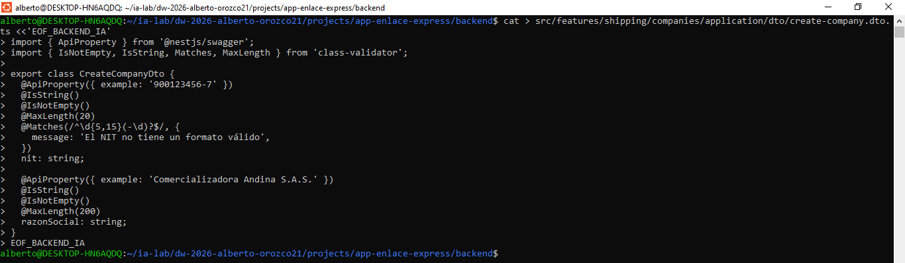

### 7.13 — features/shipping/companies/application/dto/update-company.dto.ts

DTO de entrada/salida HTTP con `class-validator` / Swagger.

**Archivo:** `src/features/shipping/companies/application/dto/update-company.dto.ts`

```bash
mkdir -p src/features/shipping/companies/application/dto
cat > src/features/shipping/companies/application/dto/update-company.dto.ts <<'EOF_BACKEND_IA'
import { PartialType } from '@nestjs/mapped-types';
import { CreateCompanyDto } from './create-company.dto';

export class UpdateCompanyDto extends PartialType(CreateCompanyDto) {}
EOF_BACKEND_IA
```

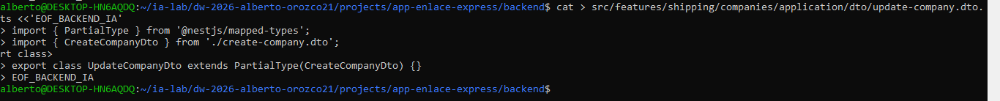

### 7.14 — features/shipping/companies/application/mappers/company.mapper.ts

Mapper entre entidad de dominio y DTO de respuesta.

**Archivo:** `src/features/shipping/companies/application/mappers/company.mapper.ts`

```bash
mkdir -p src/features/shipping/companies/application/mappers
cat > src/features/shipping/companies/application/mappers/company.mapper.ts <<'EOF_BACKEND_IA'
import { Company } from '../../domain/entities/company.entity';
import { CompanyResponseDto } from '../dto/company-response.dto';
import { CompanyModel } from '../../infrastructure/persistence/models/company.model';

export class CompanyMapper {
  static toDomain(model: CompanyModel): Company {
    return Company.reconstitute({
      id: model.id,
      nit: model.nit,
      razonSocial: model.razonSocial,
      isActive: model.isActive,
      createdAt: model.createdAt,
      updatedAt: model.updatedAt,
    });
  }

  static toResponse(entity: Company): CompanyResponseDto {
    return {
      id: entity.id!,
      nit: entity.nit,
      razonSocial: entity.razonSocial,
      isActive: entity.isActive,
      createdAt: entity.createdAt!,
      updatedAt: entity.updatedAt!,
    };
  }

  static toPersistence(entity: Company): Partial<CompanyModel> {
    return {
      id: entity.id,
      nit: entity.nit,
      razonSocial: entity.razonSocial,
      isActive: entity.isActive ?? true,
    };
  }
}
EOF_BACKEND_IA
```

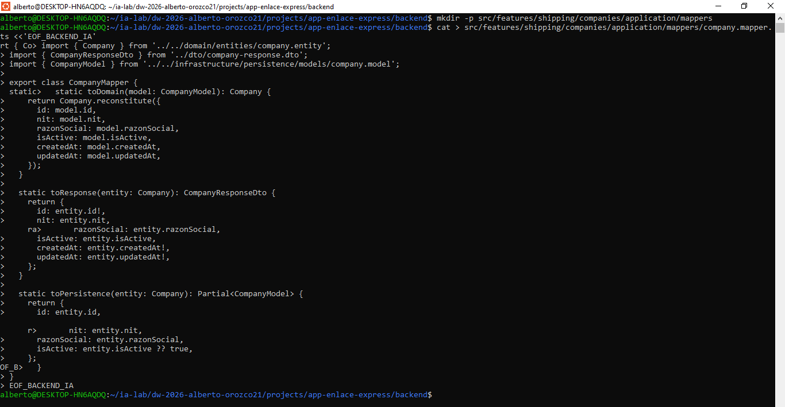

### 7.15 — features/shipping/companies/application/use-cases/create-company.use-case.ts

Caso de uso (aplicación). Orquesta dominio + repositorio. El controller solo lo invoca.

**Archivo:** `src/features/shipping/companies/application/use-cases/create-company.use-case.ts`

```bash
mkdir -p src/features/shipping/companies/application/use-cases
cat > src/features/shipping/companies/application/use-cases/create-company.use-case.ts <<'EOF_BACKEND_IA'
import { Inject, Injectable } from '@nestjs/common';
import { CompanyNitAlreadyExistsException } from '../../domain/exceptions/company-nit-already-exists.exception';
import { Company } from '../../domain/entities/company.entity';
import {
  COMPANY_REPOSITORY,
  type ICompanyRepository,
} from '../../domain/interfaces/company-repository.interface';
import { CreateCompanyDto } from '../dto/create-company.dto';
import { CompanyMapper } from '../mappers/company.mapper';

@Injectable()
export class CreateCompanyUseCase {
  constructor(
    @Inject(COMPANY_REPOSITORY)
    private readonly companyRepository: ICompanyRepository,
  ) {}

  async execute(dto: CreateCompanyDto) {
    const existing = await this.companyRepository.findByNit(dto.nit);
    if (existing) {
      throw new CompanyNitAlreadyExistsException(dto.nit);
    }

    const company = Company.create({
      nit: dto.nit,
      razonSocial: dto.razonSocial,
    });

    const created = await this.companyRepository.create(company);
    return CompanyMapper.toResponse(created);
  }
}
EOF_BACKEND_IA
```

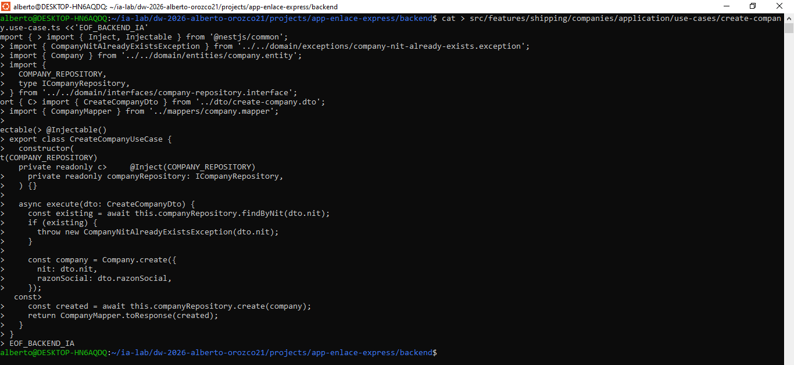

### 7.16 — features/shipping/companies/application/use-cases/delete-company.use-case.ts

Caso de uso (aplicación). Orquesta dominio + repositorio. El controller solo lo invoca.

**Archivo:** `src/features/shipping/companies/application/use-cases/delete-company.use-case.ts`

```bash
mkdir -p src/features/shipping/companies/application/use-cases
cat > src/features/shipping/companies/application/use-cases/delete-company.use-case.ts <<'EOF_BACKEND_IA'
import { Inject, Injectable } from '@nestjs/common';
import { CompanyNotFoundException } from '../../domain/exceptions/company-not-found.exception';
import {
  COMPANY_REPOSITORY,
  type ICompanyRepository,
} from '../../domain/interfaces/company-repository.interface';

@Injectable()
export class DeleteCompanyUseCase {
  constructor(
    @Inject(COMPANY_REPOSITORY)
    private readonly companyRepository: ICompanyRepository,
  ) {}

  async execute(id: number): Promise<void> {
    const company = await this.companyRepository.findById(id);
    if (!company) {
      throw new CompanyNotFoundException(id);
    }

    await this.companyRepository.delete(id);
  }
}
EOF_BACKEND_IA
```

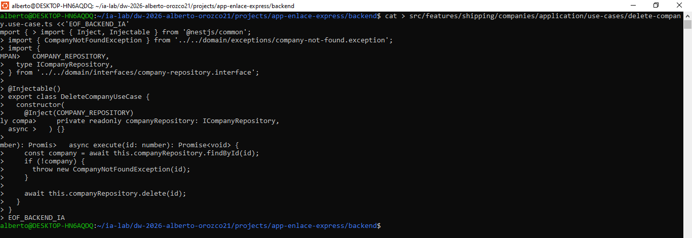

### 7.17 — features/shipping/companies/application/use-cases/get-company.use-case.ts

Caso de uso (aplicación). Orquesta dominio + repositorio. El controller solo lo invoca.

**Archivo:** `src/features/shipping/companies/application/use-cases/get-company.use-case.ts`

```bash
mkdir -p src/features/shipping/companies/application/use-cases
cat > src/features/shipping/companies/application/use-cases/get-company.use-case.ts <<'EOF_BACKEND_IA'
import { Inject, Injectable } from '@nestjs/common';
import { CompanyNotFoundException } from '../../domain/exceptions/company-not-found.exception';
import {
  COMPANY_REPOSITORY,
  type ICompanyRepository,
} from '../../domain/interfaces/company-repository.interface';
import { CompanyMapper } from '../mappers/company.mapper';

@Injectable()
export class GetCompanyUseCase {
  constructor(
    @Inject(COMPANY_REPOSITORY)
    private readonly companyRepository: ICompanyRepository,
  ) {}

  async execute(id: number) {
    const company = await this.companyRepository.findById(id);
    if (!company) {
      throw new CompanyNotFoundException(id);
    }

    return CompanyMapper.toResponse(company);
  }
}
EOF_BACKEND_IA
```

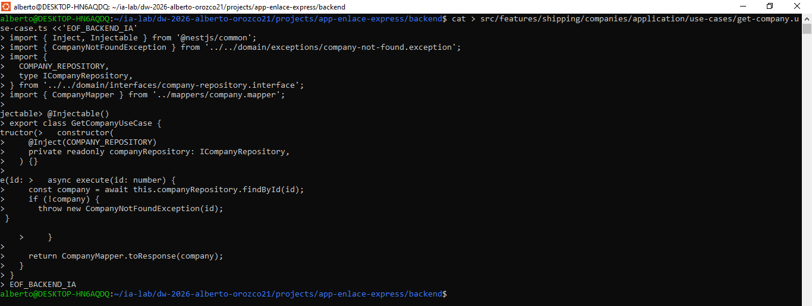

### 7.18 — features/shipping/companies/application/use-cases/list-companies.use-case.ts

Caso de uso (aplicación). Orquesta dominio + repositorio. El controller solo lo invoca.

**Archivo:** `src/features/shipping/companies/application/use-cases/list-companies.use-case.ts`

```bash
mkdir -p src/features/shipping/companies/application/use-cases
cat > src/features/shipping/companies/application/use-cases/list-companies.use-case.ts <<'EOF_BACKEND_IA'
import { Inject, Injectable } from '@nestjs/common';
import {
  COMPANY_REPOSITORY,
  type ICompanyRepository,
} from '../../domain/interfaces/company-repository.interface';
import { CompanyFilterDto } from '../dto/company-filter.dto';
import { CompanyMapper } from '../mappers/company.mapper';

@Injectable()
export class ListCompaniesUseCase {
  constructor(
    @Inject(COMPANY_REPOSITORY)
    private readonly companyRepository: ICompanyRepository,
  ) {}

  async execute(filter: CompanyFilterDto) {
    const result = await this.companyRepository.findAll(filter);
    return {
      items: result.items.map((company) => CompanyMapper.toResponse(company)),
      meta: result.meta,
    };
  }
}
EOF_BACKEND_IA
```


### 7.19 — features/shipping/companies/application/use-cases/update-company.use-case.ts

Caso de uso (aplicación). Orquesta dominio + repositorio. El controller solo lo invoca.

**Archivo:** `src/features/shipping/companies/application/use-cases/update-company.use-case.ts`

```bash
mkdir -p src/features/shipping/companies/application/use-cases
cat > src/features/shipping/companies/application/use-cases/update-company.use-case.ts <<'EOF_BACKEND_IA'
import { Inject, Injectable } from '@nestjs/common';
import { CompanyNitAlreadyExistsException } from '../../domain/exceptions/company-nit-already-exists.exception';
import { CompanyNotFoundException } from '../../domain/exceptions/company-not-found.exception';
import {
  COMPANY_REPOSITORY,
  type ICompanyRepository,
} from '../../domain/interfaces/company-repository.interface';
import { UpdateCompanyDto } from '../dto/update-company.dto';
import { CompanyMapper } from '../mappers/company.mapper';

@Injectable()
export class UpdateCompanyUseCase {
  constructor(
    @Inject(COMPANY_REPOSITORY)
    private readonly companyRepository: ICompanyRepository,
  ) {}

  async execute(id: number, dto: UpdateCompanyDto) {
    const company = await this.companyRepository.findById(id);
    if (!company) {
      throw new CompanyNotFoundException(id);
    }

    if (dto.nit && dto.nit !== company.nit) {
      const existing = await this.companyRepository.findByNit(dto.nit);
      if (existing) {
        throw new CompanyNitAlreadyExistsException(dto.nit);
      }
    }

    company.update(dto);
    const updated = await this.companyRepository.update(company);
    return CompanyMapper.toResponse(updated);
  }
}
EOF_BACKEND_IA
```

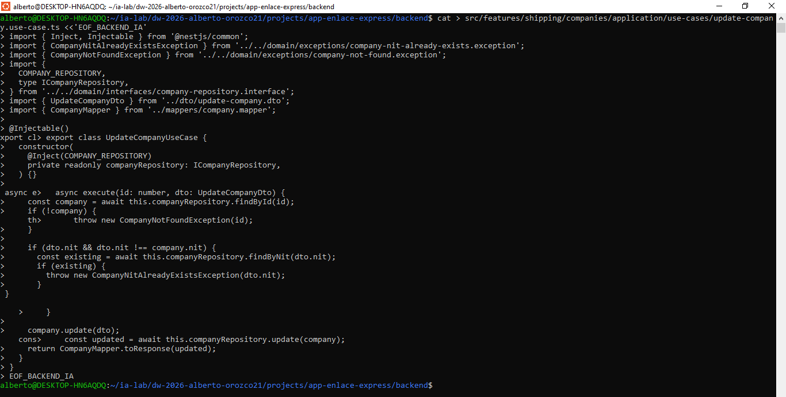

### 7.20 — features/shipping/companies/presentation/http/serializers/company.serializer.ts

Serializer de presentación (forma estable de la respuesta HTTP).

**Archivo:** `src/features/shipping/companies/presentation/http/serializers/company.serializer.ts`

```bash
mkdir -p src/features/shipping/companies/presentation/http/serializers
cat > src/features/shipping/companies/presentation/http/serializers/company.serializer.ts <<'EOF_BACKEND_IA'
import { Company } from '../../../domain/entities/company.entity';
import { CompanyResponseDto } from '../../../application/dto/company-response.dto';
import { CompanyMapper } from '../../../application/mappers/company.mapper';

export class CompanySerializer {
  static serialize(entity: Company): CompanyResponseDto {
    return CompanyMapper.toResponse(entity);
  }
}
EOF_BACKEND_IA
```

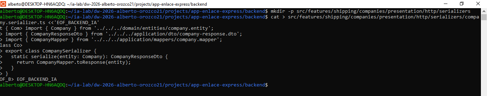

### 7.21 — features/shipping/companies/presentation/http/controllers/companies.controller.ts

Controller delgado: valida DTO, llama use-case, devuelve respuesta.

**Archivo:** `src/features/shipping/companies/presentation/http/controllers/companies.controller.ts`

```bash
mkdir -p src/features/shipping/companies/presentation/http/controllers
cat > src/features/shipping/companies/presentation/http/controllers/companies.controller.ts <<'EOF_BACKEND_IA'
import {
  Body,
  Controller,
  Delete,
  Get,
  HttpCode,
  HttpStatus,
  Param,
  Patch,
  Post,
  Query,
} from '@nestjs/common';
import {
  ApiCreatedResponse,
  ApiNoContentResponse,
  ApiOkResponse,
  ApiOperation,
  ApiTags,
} from '@nestjs/swagger';
import { ParsePositiveIntPipe } from '../../../../../../common/pipes/parse-positive-int.pipe';
import { CreateCompanyDto } from '../../../application/dto/create-company.dto';
import { UpdateCompanyDto } from '../../../application/dto/update-company.dto';
import { CompanyFilterDto } from '../../../application/dto/company-filter.dto';
import { CompanyResponseDto } from '../../../application/dto/company-response.dto';
import { CreateCompanyUseCase } from '../../../application/use-cases/create-company.use-case';
import { UpdateCompanyUseCase } from '../../../application/use-cases/update-company.use-case';
import { DeleteCompanyUseCase } from '../../../application/use-cases/delete-company.use-case';
import { GetCompanyUseCase } from '../../../application/use-cases/get-company.use-case';
import { ListCompaniesUseCase } from '../../../application/use-cases/list-companies.use-case';

@ApiTags('Companies')
@Controller('companies')
export class CompaniesController {
  constructor(
    private readonly createCompanyUseCase: CreateCompanyUseCase,
    private readonly updateCompanyUseCase: UpdateCompanyUseCase,
    private readonly deleteCompanyUseCase: DeleteCompanyUseCase,
    private readonly getCompanyUseCase: GetCompanyUseCase,
    private readonly listCompaniesUseCase: ListCompaniesUseCase,
  ) {}

  @Post()
  @ApiOperation({ summary: 'Crear una empresa' })
  @ApiCreatedResponse({ type: CompanyResponseDto })
  create(@Body() dto: CreateCompanyDto) {
    return this.createCompanyUseCase.execute(dto);
  }

  @Get()
  @ApiOperation({ summary: 'Listar empresas' })
  @ApiOkResponse({ type: [CompanyResponseDto] })
  findAll(@Query() filter: CompanyFilterDto) {
    return this.listCompaniesUseCase.execute(filter);
  }

  @Get(':id')
  @ApiOperation({ summary: 'Obtener una empresa por ID' })
  @ApiOkResponse({ type: CompanyResponseDto })
  findOne(@Param('id', ParsePositiveIntPipe) id: number) {
    return this.getCompanyUseCase.execute(id);
  }

  @Patch(':id')
  @ApiOperation({ summary: 'Actualizar una empresa' })
  @ApiOkResponse({ type: CompanyResponseDto })
  update(
    @Param('id', ParsePositiveIntPipe) id: number,
    @Body() dto: UpdateCompanyDto,
  ) {
    return this.updateCompanyUseCase.execute(id, dto);
  }

  @Delete(':id')
  @HttpCode(HttpStatus.NO_CONTENT)
  @ApiOperation({ summary: 'Eliminar una empresa' })
  @ApiNoContentResponse()
  remove(@Param('id', ParsePositiveIntPipe) id: number) {
    return this.deleteCompanyUseCase.execute(id);
  }
}
EOF_BACKEND_IA
```

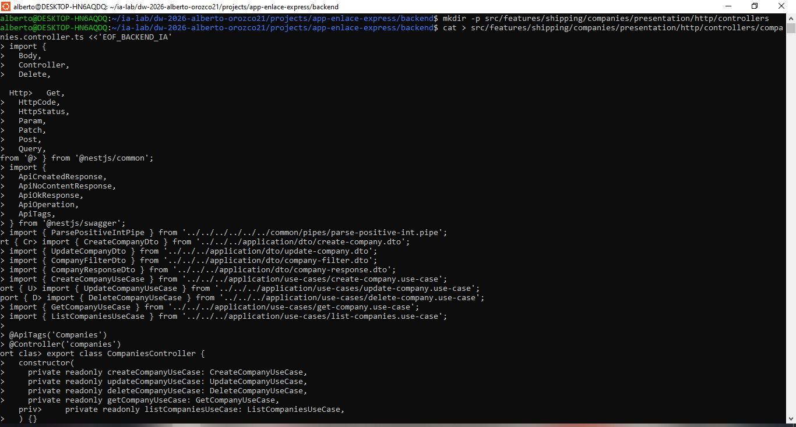

### 7.22 — features/shipping/companies/index.ts

Barrel export del feature para imports limpios.

**Archivo:** `src/features/shipping/companies/index.ts`

```bash
mkdir -p src/features/shipping/companies
cat > src/features/shipping/companies/index.ts <<'EOF_BACKEND_IA'
export { CompaniesModule } from './companies.module';
EOF_BACKEND_IA
```

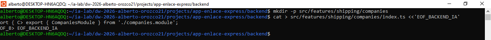

### 7.23 — features/shipping/companies/companies.module.ts

Módulo Nest del feature: cablea providers, tokens DI y controller.

**Archivo:** `src/features/shipping/companies/companies.module.ts`

```bash
mkdir -p src/features/shipping/companies
cat > src/features/shipping/companies/companies.module.ts <<'EOF_BACKEND_IA'
import { Module } from '@nestjs/common';
import { COMPANY_REPOSITORY } from './domain/interfaces/company-repository.interface';
import { CompanyRepository } from './infrastructure/persistence/repositories/company.repository';
import { CreateCompanyUseCase } from './application/use-cases/create-company.use-case';
import { UpdateCompanyUseCase } from './application/use-cases/update-company.use-case';
import { DeleteCompanyUseCase } from './application/use-cases/delete-company.use-case';
import { GetCompanyUseCase } from './application/use-cases/get-company.use-case';
import { ListCompaniesUseCase } from './application/use-cases/list-companies.use-case';
import { CompaniesController } from './presentation/http/controllers/companies.controller';

@Module({
  controllers: [CompaniesController],
  providers: [
    CompanyRepository,
    { provide: COMPANY_REPOSITORY, useExisting: CompanyRepository },
    CreateCompanyUseCase,
    UpdateCompanyUseCase,
    DeleteCompanyUseCase,
    GetCompanyUseCase,
    ListCompaniesUseCase,
  ],
  exports: [COMPANY_REPOSITORY],
})
export class CompaniesModule {}
EOF_BACKEND_IA
```

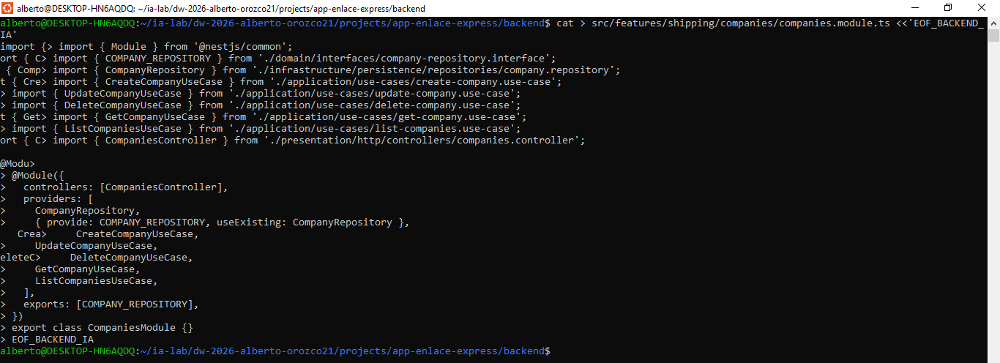

### 7.24 — Actualizar sequelize.factory.ts (registrar CompanyModel)

Registra en ALL_MODELS solo los modelos ya creados (orden de dependencias). *(mantiene el fix ESM de fase 5: `import()` dinámico en vez de `require()`)*

**Archivo:** `src/infrastructure/database/sequelize/sequelize.factory.ts`

```bash
mkdir -p src/infrastructure/database/sequelize
cat > src/infrastructure/database/sequelize/sequelize.factory.ts <<'EOF_BACKEND_IA'
import { Sequelize } from 'sequelize-typescript';
import { DatabaseDialect } from '../../../config/environment/env.interface';
import { getSequelizeOptions } from './sequelize.options';

import { CompanyModel } from '../../../features/shipping/companies/infrastructure/persistence/models/company.model';

export const ALL_MODELS = [
  CompanyModel,
];

async function loadDialectModule(moduleName: string): Promise<any> {
  // Proyecto ESM: require() no existe como global, se usa import() dinámico.
  const mod: any = await import(moduleName);
  return mod.default ?? mod;
}

export async function createSequelizeInstance(
  dialect: DatabaseDialect,
): Promise<Sequelize> {
  const options = getSequelizeOptions(dialect);

  let dialectModule: any;

  switch (dialect) {
    case DatabaseDialect.MySQL:
      dialectModule = await loadDialectModule('mysql2');
      break;
    case DatabaseDialect.Postgres:
      dialectModule = await loadDialectModule('pg');
      break;
    case DatabaseDialect.MSSQL:
      dialectModule = await loadDialectModule('tedious');
      break;
    case DatabaseDialect.Oracle:
      dialectModule = await loadDialectModule('oracledb');
      break;
    default:
      throw new Error(`Dialecto no soportado: ${dialect}`);
  }

  const sequelize = new Sequelize({
    ...options,
    dialectModule,
    models: ALL_MODELS,
  } as any);

  try {
    await sequelize.authenticate();
    console.log(`✅ Conexión exitosa a ${dialect.toUpperCase()}`);
  } catch (error: any) {
    console.error(
      `❌ Error conectando a ${dialect.toUpperCase()}:`,
      error.message,
    );
    throw error;
  }

  if (process.env.NODE_ENV !== 'production') {
    await sequelize.sync({ alter: false });
    console.log('✅ Tablas sincronizadas');
  }

  return sequelize;
}
EOF_BACKEND_IA
```

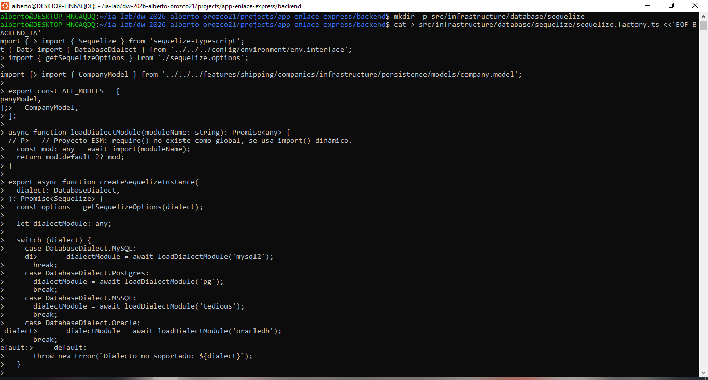

### 7.25 — Actualizar shipping.module.ts

Agrega el feature module de negocio recién terminado.

**Archivo:** `src/features/shipping/shipping.module.ts`

```bash
mkdir -p src/features/shipping
cat > src/features/shipping/shipping.module.ts <<'EOF_BACKEND_IA'
import { Module } from '@nestjs/common';
import { CompaniesModule } from './companies/companies.module';

@Module({
  imports: [CompaniesModule],
  exports: [CompaniesModule],
})
export class ShippingModule {}
EOF_BACKEND_IA
```

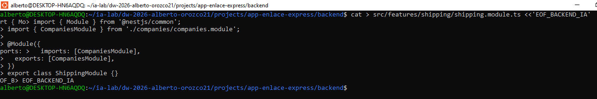

### 7.26 — Actualizar database-seeder.service.ts

Ejecuta seeders en orden de dependencias al arrancar (dev).

**Archivo:** `src/infrastructure/database/seeders/database-seeder.service.ts`

```bash
mkdir -p src/infrastructure/database/seeders
cat > src/infrastructure/database/seeders/database-seeder.service.ts <<'EOF_BACKEND_IA'
import { Injectable, Logger, OnModuleInit } from '@nestjs/common';
import { seedCompanies } from '../../../features/shipping/companies/infrastructure/persistence/seeders/companies.seeder';

/**
 * Ejecuta seeders en orden de dependencias.
 * Solo en entornos no productivos.
 */
@Injectable()
export class DatabaseSeederService implements OnModuleInit {
  private readonly logger = new Logger(DatabaseSeederService.name);

  async onModuleInit(): Promise<void> {
    if (process.env.NODE_ENV === 'production') {
      return;
    }

    try {
      await seedCompanies();
      this.logger.log('✅ Seeders ejecutados');
    } catch (error: any) {
      this.logger.error(`❌ Error en seeders: ${error.message}`, error.stack);
      throw error;
    }
  }
}
EOF_BACKEND_IA
```

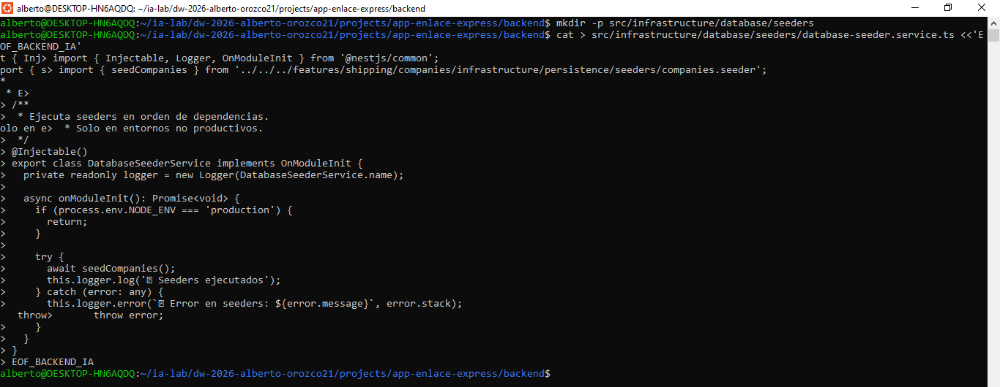

### 7.27 — Actualizar app.module.ts

Importa ShippingModule.

**Archivo:** `src/app.module.ts`

```bash
mkdir -p src
cat > src/app.module.ts <<'EOF_BACKEND_IA'
import { Module } from '@nestjs/common';
import { ConfigModule } from '@nestjs/config';
import { envConfig } from './config/environment/env.config';
import { appConfig } from './config/app/app.config';
import { LoggerModule } from './config/logger/logger.module';
import { SequelizeDatabaseModule } from './infrastructure/database/sequelize/sequelize.module';
import { ShippingModule } from './features/shipping/shipping.module';
import { AppController } from './app.controller';
import { AppService } from './app.service';

@Module({
  imports: [
    ConfigModule.forRoot({
      isGlobal: true,
      load: [envConfig, appConfig],
      envFilePath: '.env',
    }),
    SequelizeDatabaseModule,
    LoggerModule,
    ShippingModule,
  ],
  controllers: [AppController],
  providers: [
    AppService,
  ],
})
export class AppModule {}
EOF_BACKEND_IA
```

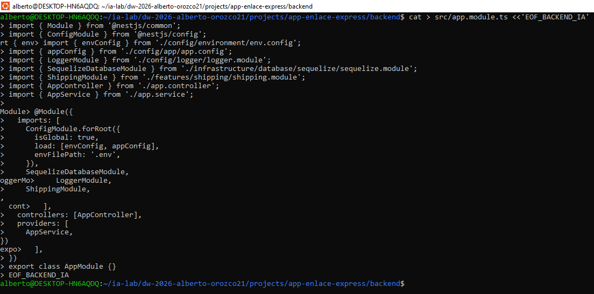

### 7.28 — Verificar tabla física `companies` y API

Arranca la app. Debe crear/sync tabla `companies`, correr seeder y exponer `/api/companies`. Prueba list/create en Swagger o curl.

```bash
npm run start:dev
```

**Consola**

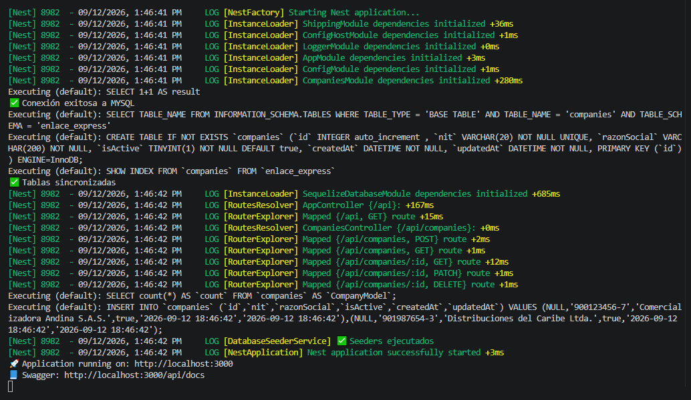

**/api/companies**

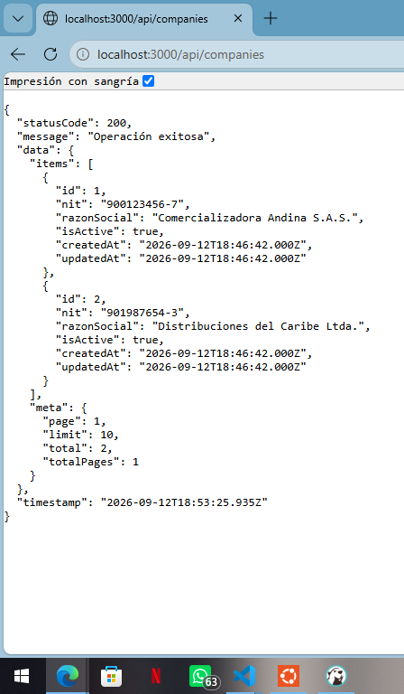

## FASE 8 — `07_BUSINESS_CONTACTS`

### Business — Contacts / Contacto (patrón completo CA)

> **Objetivo de la fase:** Segunda entidad de negocio de EnlaceExpress: Contacto, que pertenece a una Empresa (`companyId`). Orden lógico: dominio → infraestructura → aplicación → presentación → módulo → cableado → verificación.

### 8.1 — features/shipping/contacts/domain/entities/contact.entity.ts

Entidad de dominio (TypeScript puro). No extiende Sequelize `Model`. Aquí viven las reglas del negocio.

**Archivo:** `src/features/shipping/contacts/domain/entities/contact.entity.ts`

```bash
mkdir -p src/features/shipping/contacts/domain/entities
cat > src/features/shipping/contacts/domain/entities/contact.entity.ts <<'EOF_BACKEND_IA'
import { isValidContactEmail } from '../validators/contact-email.validator.js';
import { isValidContactPhone } from '../validators/contact-phone.validator.js';

export interface ContactProps {
  id?: number;
  companyId: number;
  name: string;
  position?: string;
  phone?: string;
  email?: string;
  isPrimary?: boolean;
  isActive?: boolean;
  createdAt?: Date;
  updatedAt?: Date;
}

export class Contact {
  id?: number;
  companyId: number;
  name: string;
  position?: string;
  phone?: string;
  email?: string;
  isPrimary: boolean;
  isActive: boolean;
  createdAt?: Date;
  updatedAt?: Date;

  private constructor(props: ContactProps) {
    this.id = props.id;
    this.companyId = props.companyId;
    this.name = props.name;
    this.position = props.position;
    this.phone = props.phone;
    this.email = props.email;
    this.isPrimary = props.isPrimary ?? false;
    this.isActive = props.isActive ?? true;
    this.createdAt = props.createdAt;
    this.updatedAt = props.updatedAt;
  }

  static create(
    props: Omit<ContactProps, 'id' | 'isActive' | 'createdAt' | 'updatedAt'>,
  ): Contact {
    if (!props.companyId) {
      throw new Error('El contacto debe pertenecer a una empresa');
    }

    if (!props.name?.trim()) {
      throw new Error('El nombre del contacto es requerido');
    }

    if (props.email && !isValidContactEmail(props.email)) {
      throw new Error('El email del contacto no es válido');
    }

    if (props.phone && !isValidContactPhone(props.phone)) {
      throw new Error('El teléfono del contacto no es válido');
    }

    return new Contact(props);
  }

  static reconstitute(props: ContactProps): Contact {
    return new Contact(props);
  }

  update(
    props: Partial<
      Omit<ContactProps, 'id' | 'companyId' | 'isActive' | 'createdAt' | 'updatedAt'>
    >,
  ): void {
    if (props.name !== undefined) {
      if (!props.name.trim()) {
        throw new Error('El nombre del contacto es requerido');
      }
      this.name = props.name;
    }

    if (props.position !== undefined) {
      this.position = props.position;
    }

    if (props.phone !== undefined) {
      if (props.phone && !isValidContactPhone(props.phone)) {
        throw new Error('El teléfono del contacto no es válido');
      }
      this.phone = props.phone;
    }

    if (props.email !== undefined) {
      if (props.email && !isValidContactEmail(props.email)) {
        throw new Error('El email del contacto no es válido');
      }
      this.email = props.email;
    }

    if (props.isPrimary !== undefined) {
      this.isPrimary = props.isPrimary;
    }
  }

  deactivate(): void {
    this.isActive = false;
  }

  activate(): void {
    this.isActive = true;
  }
}
EOF_BACKEND_IA
```

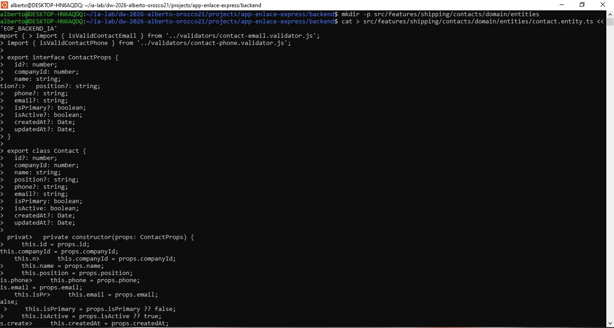

### 8.2 — features/shipping/contacts/domain/exceptions/contact-not-found.exception.ts

Excepción de dominio. El caso de uso la lanza; el filter HTTP la traduce a status code.

**Archivo:** `src/features/shipping/contacts/domain/exceptions/contact-not-found.exception.ts`

```bash
mkdir -p src/features/shipping/contacts/domain/exceptions
cat > src/features/shipping/contacts/domain/exceptions/contact-not-found.exception.ts <<'EOF_BACKEND_IA'
import { EntityNotFoundException } from '../../../../../common/exceptions/entity-not-found.exception.js';

export class ContactNotFoundException extends EntityNotFoundException {
  constructor(id: number) {
    super('Contacto', id);
  }
}
EOF_BACKEND_IA
```

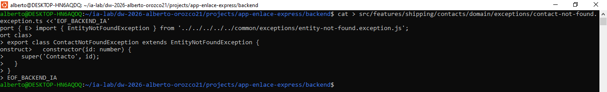

### 8.3 — features/shipping/contacts/domain/interfaces/contact-repository.interface.ts

Puerto (contrato) del repositorio. Incluye `clearPrimaryFlag` para la regla "un solo contacto principal por empresa".

**Archivo:** `src/features/shipping/contacts/domain/interfaces/contact-repository.interface.ts`

```bash
mkdir -p src/features/shipping/contacts/domain/interfaces
cat > src/features/shipping/contacts/domain/interfaces/contact-repository.interface.ts <<'EOF_BACKEND_IA'
import { PaginatedResult } from '../../../../../common/interfaces/pagination.interface.js';
import { Contact } from '../entities/contact.entity.js';

export const CONTACT_REPOSITORY = 'CONTACT_REPOSITORY';

export interface ContactFindAllParams {
  page?: number;
  limit?: number;
  search?: string;
  companyId?: number;
}

export interface IContactRepository {
  create(contact: Contact): Promise<Contact>;
  update(contact: Contact): Promise<Contact>;
  delete(id: number): Promise<void>;
  findById(id: number): Promise<Contact | null>;
  findAll(params: ContactFindAllParams): Promise<PaginatedResult<Contact>>;
  /** Quita el flag isPrimary de cualquier otro contacto de la misma empresa. */
  clearPrimaryFlag(companyId: number, excludeId?: number): Promise<void>;
}
EOF_BACKEND_IA
```

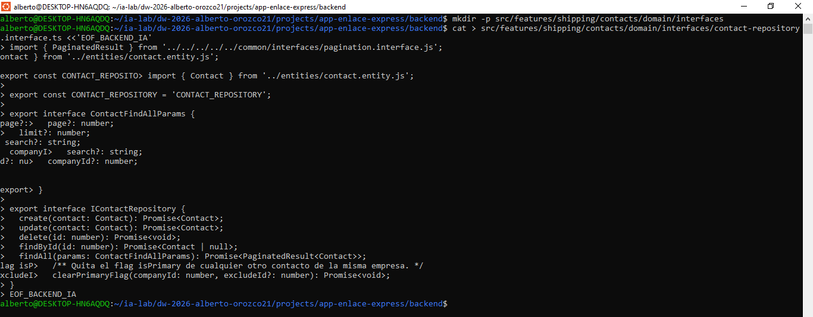

### 8.4 — features/shipping/contacts/domain/validators/contact-email.validator.ts

Validador de dominio reutilizable (reglas independientes del framework HTTP).

**Archivo:** `src/features/shipping/contacts/domain/validators/contact-email.validator.ts`

```bash
mkdir -p src/features/shipping/contacts/domain/validators
cat > src/features/shipping/contacts/domain/validators/contact-email.validator.ts <<'EOF_BACKEND_IA'
export function isValidContactEmail(email: string): boolean {
  const emailRegex = /^[^\s@]+@[^\s@]+\.[^\s@]+$/;
  return emailRegex.test(email);
}
EOF_BACKEND_IA
```

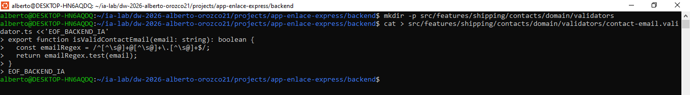

### 8.5 — features/shipping/contacts/domain/validators/contact-phone.validator.ts

Validador de dominio reutilizable (reglas independientes del framework HTTP).

**Archivo:** `src/features/shipping/contacts/domain/validators/contact-phone.validator.ts`

```bash
mkdir -p src/features/shipping/contacts/domain/validators
cat > src/features/shipping/contacts/domain/validators/contact-phone.validator.ts <<'EOF_BACKEND_IA'
export function isValidContactPhone(phone: string): boolean {
  const phoneRegex = /^[+]?[\d\s()-]{7,20}$/;
  return phoneRegex.test(phone);
}
EOF_BACKEND_IA
```

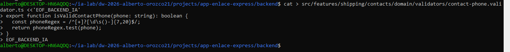

### 8.6 — features/shipping/contacts/infrastructure/persistence/models/contact.model.ts

Modelo Sequelize (`@Table`). Incluye la FK real y `@BelongsTo(() => CompanyModel)`.

**Archivo:** `src/features/shipping/contacts/infrastructure/persistence/models/contact.model.ts`

```bash
mkdir -p src/features/shipping/contacts/infrastructure/persistence/models
cat > src/features/shipping/contacts/infrastructure/persistence/models/contact.model.ts <<'EOF_BACKEND_IA'
import {
  AutoIncrement,
  BelongsTo,
  Column,
  CreatedAt,
  DataType,
  ForeignKey,
  Model,
  PrimaryKey,
  Table,
  UpdatedAt,
} from 'sequelize-typescript';
import { CompanyModel } from '../../../../companies/infrastructure/persistence/models/company.model.js';

@Table({ tableName: 'contacts' })
export class ContactModel extends Model {
  @PrimaryKey
  @AutoIncrement
  @Column(DataType.INTEGER)
  declare id: number;

  @ForeignKey(() => CompanyModel)
  @Column({ type: DataType.INTEGER, allowNull: false })
  declare companyId: number;

  @BelongsTo(() => CompanyModel)
  declare company: CompanyModel;

  @Column({ type: DataType.STRING(150), allowNull: false })
  declare name: string;

  @Column({ type: DataType.STRING(100), allowNull: true })
  declare position: string | null;

  @Column({ type: DataType.STRING(30), allowNull: true })
  declare phone: string | null;

  @Column({ type: DataType.STRING(150), allowNull: true })
  declare email: string | null;

  @Column({ type: DataType.BOOLEAN, allowNull: false, defaultValue: false })
  declare isPrimary: boolean;

  @Column({ type: DataType.BOOLEAN, allowNull: false, defaultValue: true })
  declare isActive: boolean;

  @CreatedAt
  declare createdAt: Date;

  @UpdatedAt
  declare updatedAt: Date;
}
EOF_BACKEND_IA
```

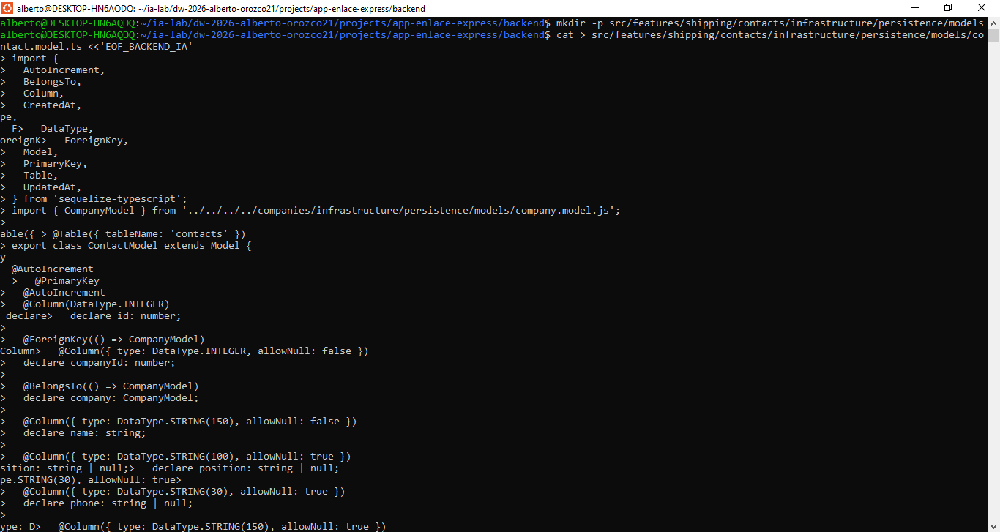

### 8.7 — features/shipping/contacts/infrastructure/persistence/repositories/contact.repository.ts

Adaptador del repositorio: implementa el puerto de dominio con Sequelize.

**Archivo:** `src/features/shipping/contacts/infrastructure/persistence/repositories/contact.repository.ts`

```bash
mkdir -p src/features/shipping/contacts/infrastructure/persistence/repositories
cat > src/features/shipping/contacts/infrastructure/persistence/repositories/contact.repository.ts <<'EOF_BACKEND_IA'
import { Injectable } from '@nestjs/common';
import { Op } from 'sequelize';
import {
  buildPaginatedResult,
  normalizePagination,
} from '../../../../../../common/utils/pagination.util.js';
import { Contact } from '../../../domain/entities/contact.entity.js';
import {
  ContactFindAllParams,
  IContactRepository,
} from '../../../domain/interfaces/contact-repository.interface.js';
import { ContactMapper } from '../../../application/mappers/contact.mapper.js';
import { ContactModel } from '../models/contact.model.js';

@Injectable()
export class ContactRepository implements IContactRepository {
  async create(contact: Contact): Promise<Contact> {
    const model = await ContactModel.create(
      ContactMapper.toPersistence(contact),
    );
    return ContactMapper.toDomain(model);
  }

  async update(contact: Contact): Promise<Contact> {
    await ContactModel.update(ContactMapper.toPersistence(contact), {
      where: { id: contact.id },
    });
    const updated = await ContactModel.findByPk(contact.id!);
    return ContactMapper.toDomain(updated!);
  }

  async delete(id: number): Promise<void> {
    await ContactModel.destroy({ where: { id } });
  }

  async findById(id: number): Promise<Contact | null> {
    const model = await ContactModel.findByPk(id);
    return model ? ContactMapper.toDomain(model) : null;
  }

  async findAll(params: ContactFindAllParams) {
    const { page, limit, offset } = normalizePagination(
      params.page,
      params.limit,
    );

    const where: Record<string, unknown> = {};

    if (params.companyId) {
      where.companyId = params.companyId;
    }

    if (params.search) {
      where[Op.or as unknown as string] = [
        { name: { [Op.like]: `%${params.search}%` } },
        { email: { [Op.like]: `%${params.search}%` } },
      ];
    }

    const { rows, count } = await ContactModel.findAndCountAll({
      where,
      limit,
      offset,
      order: [['createdAt', 'DESC']],
    });

    return buildPaginatedResult(
      rows.map((row) => ContactMapper.toDomain(row)),
      count,
      page,
      limit,
    );
  }

  async clearPrimaryFlag(companyId: number, excludeId?: number): Promise<void> {
    const where: Record<string, unknown> = { companyId, isPrimary: true };
    if (excludeId) {
      where.id = { [Op.ne]: excludeId };
    }
    await ContactModel.update({ isPrimary: false }, { where });
  }
}
EOF_BACKEND_IA
```

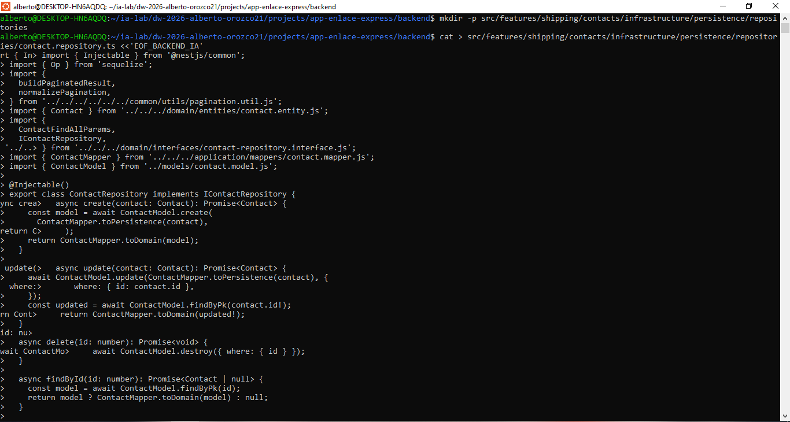

### 8.8 — features/shipping/contacts/infrastructure/persistence/migrations/create-contacts-table.migration.ts

Migración documental/auxiliar de la tabla. En dev el sync de Sequelize crea el esquema.

**Archivo:** `src/features/shipping/contacts/infrastructure/persistence/migrations/create-contacts-table.migration.ts`

```bash
mkdir -p src/features/shipping/contacts/infrastructure/persistence/migrations
cat > src/features/shipping/contacts/infrastructure/persistence/migrations/create-contacts-table.migration.ts <<'EOF_BACKEND_IA'
export const createContactsTableMigration = {
  name: 'create-contacts-table',
  async up(): Promise<void> {
    // Sequelize sync handles table creation in development.
    // Production: CREATE TABLE contacts (id, companyId FK->companies, name, position,
    //   phone, email, isPrimary, isActive, createdAt, updatedAt)
  },
  async down(): Promise<void> {
    // Production: DROP TABLE contacts
  },
};
EOF_BACKEND_IA
```

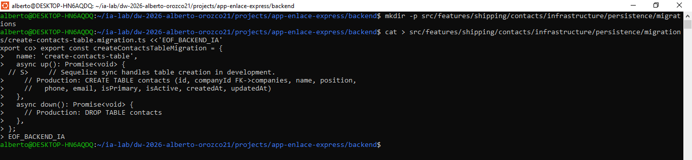

### 8.9 — features/shipping/contacts/infrastructure/persistence/seeders/contacts.seeder.ts

Seeder de datos iniciales. Depende de que ya existan empresas (fase 7).

**Archivo:** `src/features/shipping/contacts/infrastructure/persistence/seeders/contacts.seeder.ts`

```bash
mkdir -p src/features/shipping/contacts/infrastructure/persistence/seeders
cat > src/features/shipping/contacts/infrastructure/persistence/seeders/contacts.seeder.ts <<'EOF_BACKEND_IA'
import { ContactModel } from '../models/contact.model.js';
import { CompanyModel } from '../../../../companies/infrastructure/persistence/models/company.model.js';

export async function seedContacts(): Promise<void> {
  const count = await ContactModel.count();
  if (count > 0) {
    return;
  }

  const companies = await CompanyModel.findAll({
    limit: 2,
    order: [['id', 'ASC']],
  });

  if (companies.length === 0) {
    return;
  }

  const records = [
    {
      companyId: companies[0].id,
      name: 'Laura Gómez',
      position: 'Gerente de Logística',
      phone: '+57 301 2223344',
      email: 'laura.gomez@example.com',
      isPrimary: true,
      isActive: true,
    },
  ];

  if (companies[1]) {
    records.push({
      companyId: companies[1].id,
      name: 'Carlos Ruiz',
      position: 'Coordinador de Compras',
      phone: '+57 315 5556677',
      email: 'carlos.ruiz@example.com',
      isPrimary: true,
      isActive: true,
    });
  }

  await ContactModel.bulkCreate(records);
}
EOF_BACKEND_IA
```

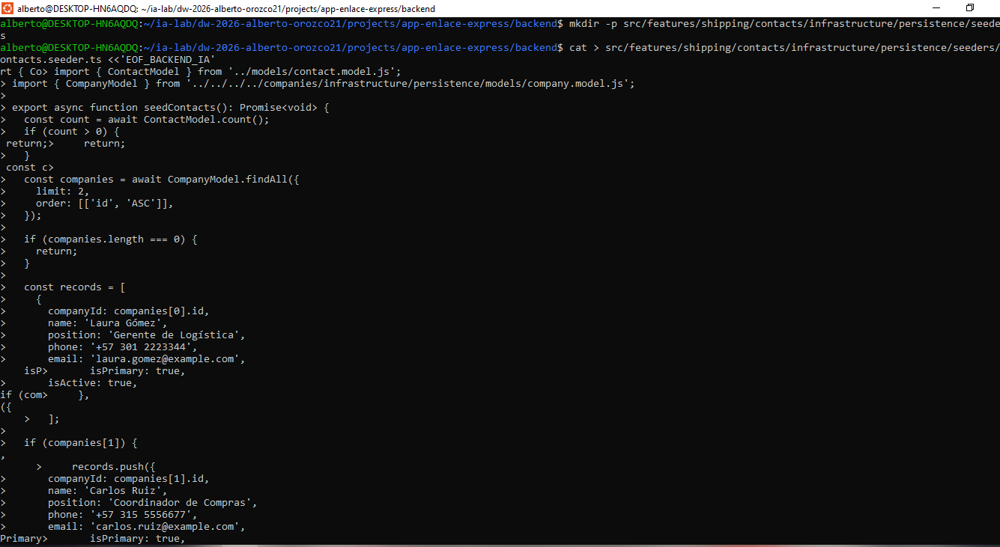

### 8.10 — features/shipping/contacts/application/dto/contact-filter.dto.ts

DTO de entrada/salida HTTP con `class-validator` / Swagger. Incluye filtro por `companyId`.

**Archivo:** `src/features/shipping/contacts/application/dto/contact-filter.dto.ts`

```bash
mkdir -p src/features/shipping/contacts/application/dto
cat > src/features/shipping/contacts/application/dto/contact-filter.dto.ts <<'EOF_BACKEND_IA'
import { ApiPropertyOptional } from '@nestjs/swagger';
import { Type } from 'class-transformer';
import { IsInt, IsOptional, IsPositive, IsString, Min } from 'class-validator';

export class ContactFilterDto {
  @ApiPropertyOptional({ example: 1, default: 1 })
  @IsOptional()
  @Type(() => Number)
  @IsInt()
  @Min(1)
  page?: number;

  @ApiPropertyOptional({ example: 10, default: 10 })
  @IsOptional()
  @Type(() => Number)
  @IsInt()
  @IsPositive()
  limit?: number;

  @ApiPropertyOptional({ example: 'laura' })
  @IsOptional()
  @IsString()
  search?: string;

  @ApiPropertyOptional({ example: 1 })
  @IsOptional()
  @Type(() => Number)
  @IsInt()
  @IsPositive()
  companyId?: number;
}
EOF_BACKEND_IA
```

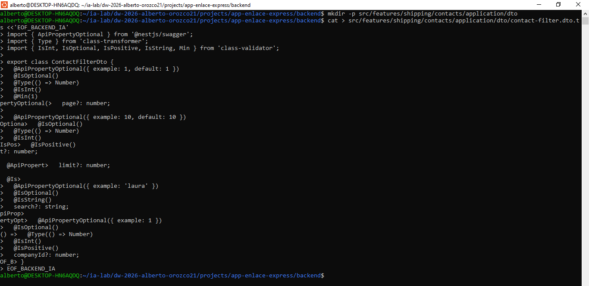

### 8.11 — features/shipping/contacts/application/dto/contact-response.dto.ts

DTO de entrada/salida HTTP con `class-validator` / Swagger.

**Archivo:** `src/features/shipping/contacts/application/dto/contact-response.dto.ts`

```bash
mkdir -p src/features/shipping/contacts/application/dto
cat > src/features/shipping/contacts/application/dto/contact-response.dto.ts <<'EOF_BACKEND_IA'
import { ApiProperty, ApiPropertyOptional } from '@nestjs/swagger';

export class ContactResponseDto {
  @ApiProperty({ example: 1 })
  id: number;

  @ApiProperty({ example: 1 })
  companyId: number;

  @ApiProperty({ example: 'Laura Gómez' })
  name: string;

  @ApiPropertyOptional({ example: 'Gerente de Logística' })
  position?: string;

  @ApiPropertyOptional({ example: '+57 301 2223344' })
  phone?: string;

  @ApiPropertyOptional({ example: 'laura.gomez@example.com' })
  email?: string;

  @ApiProperty({ example: true })
  isPrimary: boolean;

  @ApiProperty({ example: true })
  isActive: boolean;

  @ApiProperty()
  createdAt: Date;

  @ApiProperty()
  updatedAt: Date;
}
EOF_BACKEND_IA
```

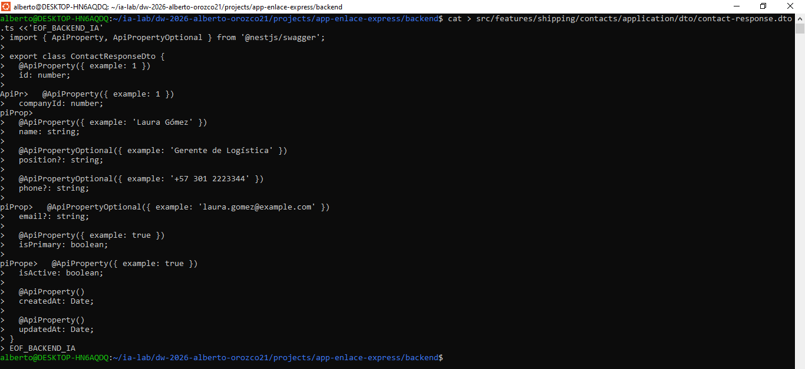

### 8.12 — features/shipping/contacts/application/dto/create-contact.dto.ts

DTO de entrada/salida HTTP con `class-validator` / Swagger.

**Archivo:** `src/features/shipping/contacts/application/dto/create-contact.dto.ts`

```bash
mkdir -p src/features/shipping/contacts/application/dto
cat > src/features/shipping/contacts/application/dto/create-contact.dto.ts <<'EOF_BACKEND_IA'
import { ApiProperty, ApiPropertyOptional } from '@nestjs/swagger';
import {
  IsBoolean,
  IsEmail,
  IsInt,
  IsNotEmpty,
  IsOptional,
  IsPositive,
  IsString,
  MaxLength,
} from 'class-validator';

export class CreateContactDto {
  @ApiProperty({ example: 1 })
  @IsInt()
  @IsPositive()
  companyId: number;

  @ApiProperty({ example: 'Laura Gómez' })
  @IsString()
  @IsNotEmpty()
  @MaxLength(150)
  name: string;

  @ApiPropertyOptional({ example: 'Gerente de Logística' })
  @IsOptional()
  @IsString()
  @MaxLength(100)
  position?: string;

  @ApiPropertyOptional({ example: '+57 301 2223344' })
  @IsOptional()
  @IsString()
  @MaxLength(30)
  phone?: string;

  @ApiPropertyOptional({ example: 'laura.gomez@example.com' })
  @IsOptional()
  @IsEmail()
  @MaxLength(150)
  email?: string;

  @ApiPropertyOptional({ example: true, default: false })
  @IsOptional()
  @IsBoolean()
  isPrimary?: boolean;
}
EOF_BACKEND_IA
```

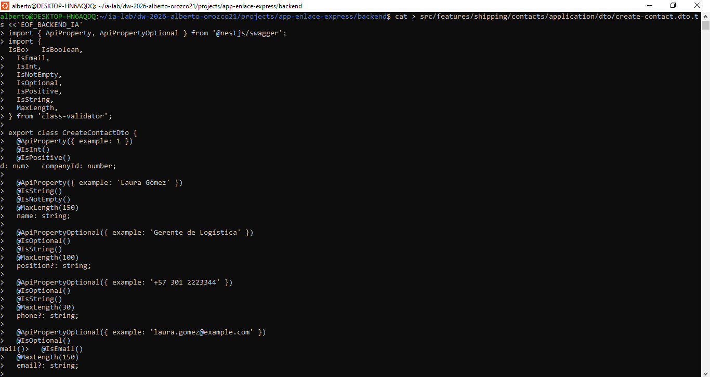

### 8.13 — features/shipping/contacts/application/dto/update-contact.dto.ts

DTO de actualización. `companyId` se excluye a propósito: un contacto no cambia de empresa.

**Archivo:** `src/features/shipping/contacts/application/dto/update-contact.dto.ts`

```bash
mkdir -p src/features/shipping/contacts/application/dto
cat > src/features/shipping/contacts/application/dto/update-contact.dto.ts <<'EOF_BACKEND_IA'
import { OmitType, PartialType } from '@nestjs/mapped-types';
import { CreateContactDto } from './create-contact.dto.js';

export class UpdateContactDto extends PartialType(
  OmitType(CreateContactDto, ['companyId'] as const),
) {}
EOF_BACKEND_IA
```

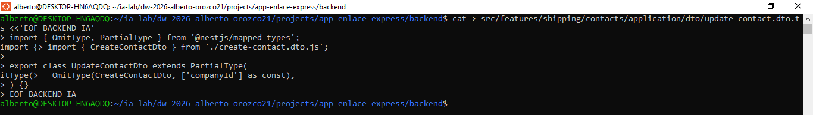

### 8.14 — features/shipping/contacts/application/mappers/contact.mapper.ts

Mapper entre entidad de dominio y DTO de respuesta.

**Archivo:** `src/features/shipping/contacts/application/mappers/contact.mapper.ts`

```bash
mkdir -p src/features/shipping/contacts/application/mappers
cat > src/features/shipping/contacts/application/mappers/contact.mapper.ts <<'EOF_BACKEND_IA'
import { Contact } from '../../domain/entities/contact.entity.js';
import { ContactResponseDto } from '../dto/contact-response.dto.js';
import { ContactModel } from '../../infrastructure/persistence/models/contact.model.js';

export class ContactMapper {
  static toDomain(model: ContactModel): Contact {
    return Contact.reconstitute({
      id: model.id,
      companyId: model.companyId,
      name: model.name,
      position: model.position ?? undefined,
      phone: model.phone ?? undefined,
      email: model.email ?? undefined,
      isPrimary: model.isPrimary,
      isActive: model.isActive,
      createdAt: model.createdAt,
      updatedAt: model.updatedAt,
    });
  }

  static toResponse(entity: Contact): ContactResponseDto {
    return {
      id: entity.id!,
      companyId: entity.companyId,
      name: entity.name,
      position: entity.position,
      phone: entity.phone,
      email: entity.email,
      isPrimary: entity.isPrimary,
      isActive: entity.isActive,
      createdAt: entity.createdAt!,
      updatedAt: entity.updatedAt!,
    };
  }

  static toPersistence(entity: Contact): Partial<ContactModel> {
    return {
      id: entity.id,
      companyId: entity.companyId,
      name: entity.name,
      position: entity.position ?? null,
      phone: entity.phone ?? null,
      email: entity.email ?? null,
      isPrimary: entity.isPrimary ?? false,
      isActive: entity.isActive ?? true,
    };
  }
}
EOF_BACKEND_IA
```

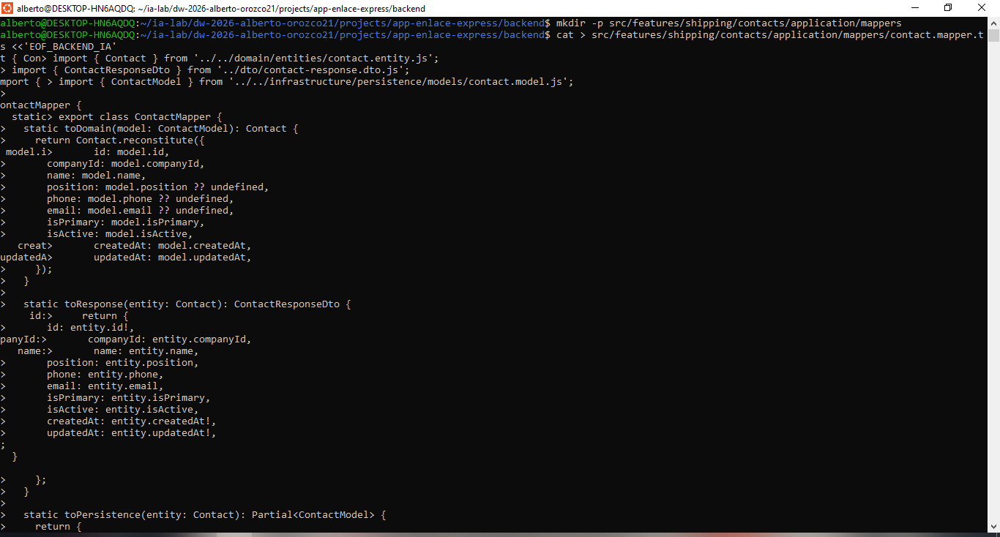

### 8.15 — features/shipping/contacts/application/use-cases/create-contact.use-case.ts

Caso de uso. Verifica que la empresa exista (cruce con el feature `companies`) y aplica la regla de contacto principal único.

**Archivo:** `src/features/shipping/contacts/application/use-cases/create-contact.use-case.ts`

```bash
mkdir -p src/features/shipping/contacts/application/use-cases
cat > src/features/shipping/contacts/application/use-cases/create-contact.use-case.ts <<'EOF_BACKEND_IA'
import { Inject, Injectable } from '@nestjs/common';
import { CompanyNotFoundException } from '../../../companies/domain/exceptions/company-not-found.exception.js';
import {
  COMPANY_REPOSITORY,
  type ICompanyRepository,
} from '../../../companies/domain/interfaces/company-repository.interface.js';
import { Contact } from '../../domain/entities/contact.entity.js';
import {
  CONTACT_REPOSITORY,
  type IContactRepository,
} from '../../domain/interfaces/contact-repository.interface.js';
import { CreateContactDto } from '../dto/create-contact.dto.js';
import { ContactMapper } from '../mappers/contact.mapper.js';

@Injectable()
export class CreateContactUseCase {
  constructor(
    @Inject(CONTACT_REPOSITORY)
    private readonly contactRepository: IContactRepository,
    @Inject(COMPANY_REPOSITORY)
    private readonly companyRepository: ICompanyRepository,
  ) {}

  async execute(dto: CreateContactDto) {
    const company = await this.companyRepository.findById(dto.companyId);
    if (!company) {
      throw new CompanyNotFoundException(dto.companyId);
    }

    const contact = Contact.create({
      companyId: dto.companyId,
      name: dto.name,
      position: dto.position,
      phone: dto.phone,
      email: dto.email,
      isPrimary: dto.isPrimary,
    });

    if (contact.isPrimary) {
      await this.contactRepository.clearPrimaryFlag(dto.companyId);
    }

    const created = await this.contactRepository.create(contact);
    return ContactMapper.toResponse(created);
  }
}
EOF_BACKEND_IA
```

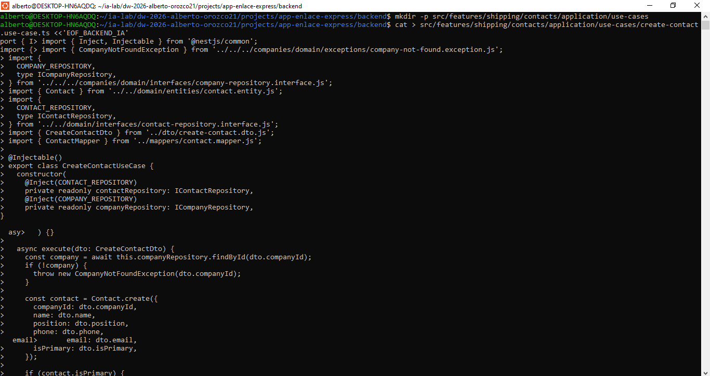

### 8.16 — features/shipping/contacts/application/use-cases/delete-contact.use-case.ts

Caso de uso (aplicación). Orquesta dominio + repositorio. El controller solo lo invoca.

**Archivo:** `src/features/shipping/contacts/application/use-cases/delete-contact.use-case.ts`

```bash
mkdir -p src/features/shipping/contacts/application/use-cases
cat > src/features/shipping/contacts/application/use-cases/delete-contact.use-case.ts <<'EOF_BACKEND_IA'
import { Inject, Injectable } from '@nestjs/common';
import { ContactNotFoundException } from '../../domain/exceptions/contact-not-found.exception.js';
import {
  CONTACT_REPOSITORY,
  type IContactRepository,
} from '../../domain/interfaces/contact-repository.interface.js';

@Injectable()
export class DeleteContactUseCase {
  constructor(
    @Inject(CONTACT_REPOSITORY)
    private readonly contactRepository: IContactRepository,
  ) {}

  async execute(id: number): Promise<void> {
    const contact = await this.contactRepository.findById(id);
    if (!contact) {
      throw new ContactNotFoundException(id);
    }

    await this.contactRepository.delete(id);
  }
}
EOF_BACKEND_IA
```

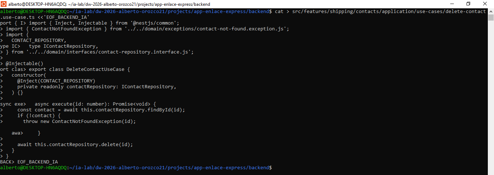

### 8.17 — features/shipping/contacts/application/use-cases/get-contact.use-case.ts

Caso de uso (aplicación). Orquesta dominio + repositorio. El controller solo lo invoca.

**Archivo:** `src/features/shipping/contacts/application/use-cases/get-contact.use-case.ts`

```bash
mkdir -p src/features/shipping/contacts/application/use-cases
cat > src/features/shipping/contacts/application/use-cases/get-contact.use-case.ts <<'EOF_BACKEND_IA'
import { Inject, Injectable } from '@nestjs/common';
import { ContactNotFoundException } from '../../domain/exceptions/contact-not-found.exception.js';
import {
  CONTACT_REPOSITORY,
  type IContactRepository,
} from '../../domain/interfaces/contact-repository.interface.js';
import { ContactMapper } from '../mappers/contact.mapper.js';

@Injectable()
export class GetContactUseCase {
  constructor(
    @Inject(CONTACT_REPOSITORY)
    private readonly contactRepository: IContactRepository,
  ) {}

  async execute(id: number) {
    const contact = await this.contactRepository.findById(id);
    if (!contact) {
      throw new ContactNotFoundException(id);
    }

    return ContactMapper.toResponse(contact);
  }
}
EOF_BACKEND_IA
```

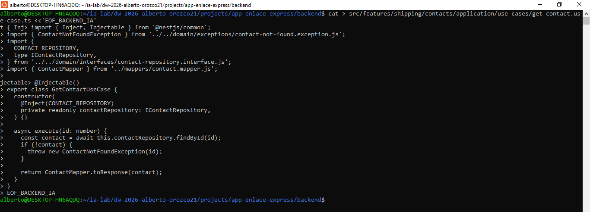

### 8.18 — features/shipping/contacts/application/use-cases/list-contacts.use-case.ts

Caso de uso (aplicación). Orquesta dominio + repositorio. El controller solo lo invoca.

**Archivo:** `src/features/shipping/contacts/application/use-cases/list-contacts.use-case.ts`

```bash
mkdir -p src/features/shipping/contacts/application/use-cases
cat > src/features/shipping/contacts/application/use-cases/list-contacts.use-case.ts <<'EOF_BACKEND_IA'
import { Inject, Injectable } from '@nestjs/common';
import {
  CONTACT_REPOSITORY,
  type IContactRepository,
} from '../../domain/interfaces/contact-repository.interface.js';
import { ContactFilterDto } from '../dto/contact-filter.dto.js';
import { ContactMapper } from '../mappers/contact.mapper.js';

@Injectable()
export class ListContactsUseCase {
  constructor(
    @Inject(CONTACT_REPOSITORY)
    private readonly contactRepository: IContactRepository,
  ) {}

  async execute(filter: ContactFilterDto) {
    const result = await this.contactRepository.findAll(filter);
    return {
      items: result.items.map((contact) => ContactMapper.toResponse(contact)),
      meta: result.meta,
    };
  }
}
EOF_BACKEND_IA
```


### 8.19 — features/shipping/contacts/application/use-cases/update-contact.use-case.ts

Caso de uso (aplicación). También aplica la regla de contacto principal único al actualizar.

**Archivo:** `src/features/shipping/contacts/application/use-cases/update-contact.use-case.ts`

```bash
mkdir -p src/features/shipping/contacts/application/use-cases
cat > src/features/shipping/contacts/application/use-cases/update-contact.use-case.ts <<'EOF_BACKEND_IA'
import { Inject, Injectable } from '@nestjs/common';
import { ContactNotFoundException } from '../../domain/exceptions/contact-not-found.exception.js';
import {
  CONTACT_REPOSITORY,
  type IContactRepository,
} from '../../domain/interfaces/contact-repository.interface.js';
import { UpdateContactDto } from '../dto/update-contact.dto.js';
import { ContactMapper } from '../mappers/contact.mapper.js';

@Injectable()
export class UpdateContactUseCase {
  constructor(
    @Inject(CONTACT_REPOSITORY)
    private readonly contactRepository: IContactRepository,
  ) {}

  async execute(id: number, dto: UpdateContactDto) {
    const contact = await this.contactRepository.findById(id);
    if (!contact) {
      throw new ContactNotFoundException(id);
    }

    contact.update(dto);

    if (dto.isPrimary === true) {
      await this.contactRepository.clearPrimaryFlag(contact.companyId, contact.id);
    }

    const updated = await this.contactRepository.update(contact);
    return ContactMapper.toResponse(updated);
  }
}
EOF_BACKEND_IA
```

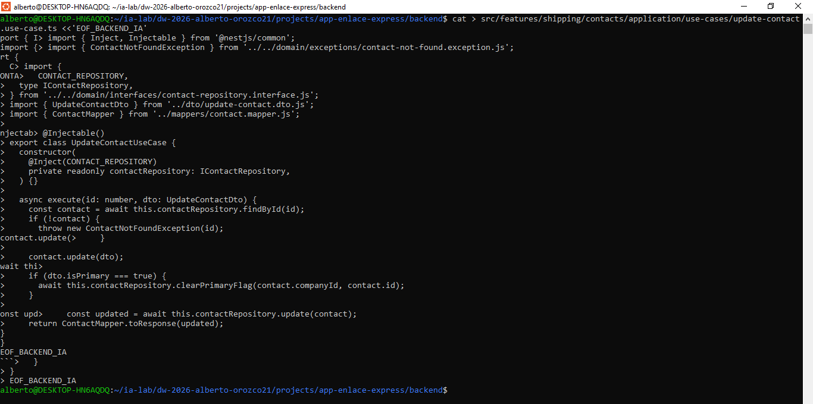

### 8.20 — features/shipping/contacts/presentation/http/serializers/contact.serializer.ts

Serializer de presentación (forma estable de la respuesta HTTP).

**Archivo:** `src/features/shipping/contacts/presentation/http/serializers/contact.serializer.ts`

```bash
mkdir -p src/features/shipping/contacts/presentation/http/serializers
cat > src/features/shipping/contacts/presentation/http/serializers/contact.serializer.ts <<'EOF_BACKEND_IA'
import { Contact } from '../../../domain/entities/contact.entity.js';
import { ContactResponseDto } from '../../../application/dto/contact-response.dto.js';
import { ContactMapper } from '../../../application/mappers/contact.mapper.js';

export class ContactSerializer {
  static serialize(entity: Contact): ContactResponseDto {
    return ContactMapper.toResponse(entity);
  }
}
EOF_BACKEND_IA
```

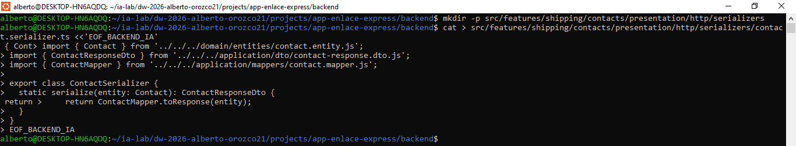

### 8.21 — features/shipping/contacts/presentation/http/controllers/contacts.controller.ts

Controller delgado: valida DTO, llama use-case, devuelve respuesta.

**Archivo:** `src/features/shipping/contacts/presentation/http/controllers/contacts.controller.ts`

```bash
mkdir -p src/features/shipping/contacts/presentation/http/controllers
cat > src/features/shipping/contacts/presentation/http/controllers/contacts.controller.ts <<'EOF_BACKEND_IA'
import {
  Body,
  Controller,
  Delete,
  Get,
  HttpCode,
  HttpStatus,
  Param,
  Patch,
  Post,
  Query,
} from '@nestjs/common';
import {
  ApiCreatedResponse,
  ApiNoContentResponse,
  ApiOkResponse,
  ApiOperation,
  ApiTags,
} from '@nestjs/swagger';
import { ParsePositiveIntPipe } from '../../../../../../common/pipes/parse-positive-int.pipe.js';
import { CreateContactDto } from '../../../application/dto/create-contact.dto.js';
import { UpdateContactDto } from '../../../application/dto/update-contact.dto.js';
import { ContactFilterDto } from '../../../application/dto/contact-filter.dto.js';
import { ContactResponseDto } from '../../../application/dto/contact-response.dto.js';
import { CreateContactUseCase } from '../../../application/use-cases/create-contact.use-case.js';
import { UpdateContactUseCase } from '../../../application/use-cases/update-contact.use-case.js';
import { DeleteContactUseCase } from '../../../application/use-cases/delete-contact.use-case.js';
import { GetContactUseCase } from '../../../application/use-cases/get-contact.use-case.js';
import { ListContactsUseCase } from '../../../application/use-cases/list-contacts.use-case.js';

@ApiTags('Contacts')
@Controller('contacts')
export class ContactsController {
  constructor(
    private readonly createContactUseCase: CreateContactUseCase,
    private readonly updateContactUseCase: UpdateContactUseCase,
    private readonly deleteContactUseCase: DeleteContactUseCase,
    private readonly getContactUseCase: GetContactUseCase,
    private readonly listContactsUseCase: ListContactsUseCase,
  ) {}

  @Post()
  @ApiOperation({ summary: 'Crear un contacto' })
  @ApiCreatedResponse({ type: ContactResponseDto })
  create(@Body() dto: CreateContactDto) {
    return this.createContactUseCase.execute(dto);
  }

  @Get()
  @ApiOperation({ summary: 'Listar contactos (opcionalmente por empresa)' })
  @ApiOkResponse({ type: [ContactResponseDto] })
  findAll(@Query() filter: ContactFilterDto) {
    return this.listContactsUseCase.execute(filter);
  }

  @Get(':id')
  @ApiOperation({ summary: 'Obtener un contacto por ID' })
  @ApiOkResponse({ type: ContactResponseDto })
  findOne(@Param('id', ParsePositiveIntPipe) id: number) {
    return this.getContactUseCase.execute(id);
  }

  @Patch(':id')
  @ApiOperation({ summary: 'Actualizar un contacto' })
  @ApiOkResponse({ type: ContactResponseDto })
  update(
    @Param('id', ParsePositiveIntPipe) id: number,
    @Body() dto: UpdateContactDto,
  ) {
    return this.updateContactUseCase.execute(id, dto);
  }

  @Delete(':id')
  @HttpCode(HttpStatus.NO_CONTENT)
  @ApiOperation({ summary: 'Eliminar un contacto' })
  @ApiNoContentResponse()
  remove(@Param('id', ParsePositiveIntPipe) id: number) {
    return this.deleteContactUseCase.execute(id);
  }
}
EOF_BACKEND_IA
```

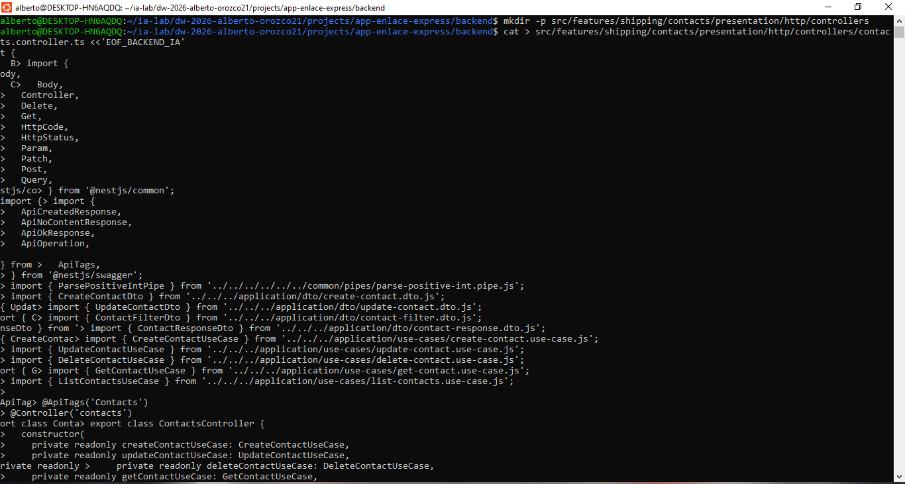

### 8.22 — features/shipping/contacts/index.ts

Barrel export del feature para imports limpios.

**Archivo:** `src/features/shipping/contacts/index.ts`

```bash
mkdir -p src/features/shipping/contacts
cat > src/features/shipping/contacts/index.ts <<'EOF_BACKEND_IA'
export { ContactsModule } from './contacts.module.js';
EOF_BACKEND_IA
```

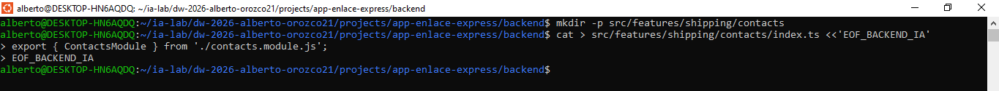

### 8.23 — features/shipping/contacts/contacts.module.ts

Módulo Nest del feature. Importa `CompaniesModule` para poder inyectar `COMPANY_REPOSITORY` y validar la FK.

**Archivo:** `src/features/shipping/contacts/contacts.module.ts`

```bash
mkdir -p src/features/shipping/contacts
cat > src/features/shipping/contacts/contacts.module.ts <<'EOF_BACKEND_IA'
import { Module } from '@nestjs/common';
import { CompaniesModule } from '../companies/companies.module.js';
import { CONTACT_REPOSITORY } from './domain/interfaces/contact-repository.interface.js';
import { ContactRepository } from './infrastructure/persistence/repositories/contact.repository.js';
import { CreateContactUseCase } from './application/use-cases/create-contact.use-case.js';
import { UpdateContactUseCase } from './application/use-cases/update-contact.use-case.js';
import { DeleteContactUseCase } from './application/use-cases/delete-contact.use-case.js';
import { GetContactUseCase } from './application/use-cases/get-contact.use-case.js';
import { ListContactsUseCase } from './application/use-cases/list-contacts.use-case.js';
import { ContactsController } from './presentation/http/controllers/contacts.controller.js';

@Module({
  imports: [CompaniesModule],
  controllers: [ContactsController],
  providers: [
    ContactRepository,
    { provide: CONTACT_REPOSITORY, useExisting: ContactRepository },
    CreateContactUseCase,
    UpdateContactUseCase,
    DeleteContactUseCase,
    GetContactUseCase,
    ListContactsUseCase,
  ],
  exports: [CONTACT_REPOSITORY],
})
export class ContactsModule {}
EOF_BACKEND_IA
```

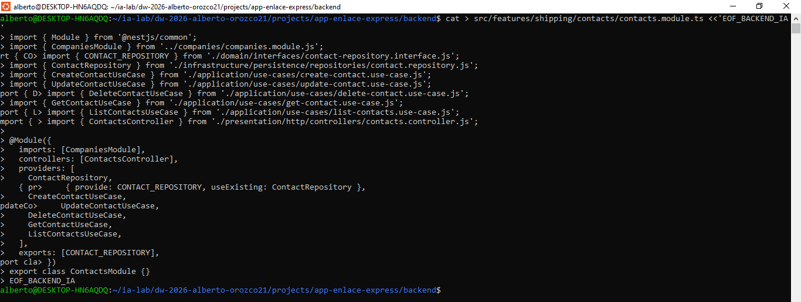

### 8.24 — Actualizar company.model.ts (cerrar la asociación)

Vuelve al modelo de Empresa (fase 7) y agrega `@HasMany(() => ContactModel)` con import estático.

**Archivo:** `src/features/shipping/companies/infrastructure/persistence/models/company.model.ts`

```bash
mkdir -p src/features/shipping/companies/infrastructure/persistence/models
cat > src/features/shipping/companies/infrastructure/persistence/models/company.model.ts <<'EOF_BACKEND_IA'
import {
  AutoIncrement,
  Column,
  CreatedAt,
  DataType,
  HasMany,
  Model,
  PrimaryKey,
  Table,
  UpdatedAt,
} from 'sequelize-typescript';
import { ContactModel } from '../../../../contacts/infrastructure/persistence/models/contact.model.js';

@Table({ tableName: 'companies' })
export class CompanyModel extends Model {
  @PrimaryKey
  @AutoIncrement
  @Column(DataType.INTEGER)
  declare id: number;

  @Column({ type: DataType.STRING(20), allowNull: false, unique: true })
  declare nit: string;

  @Column({ type: DataType.STRING(200), allowNull: false })
  declare razonSocial: string;

  @Column({ type: DataType.BOOLEAN, allowNull: false, defaultValue: true })
  declare isActive: boolean;

  @CreatedAt
  declare createdAt: Date;

  @UpdatedAt
  declare updatedAt: Date;

  @HasMany(() => ContactModel)
  declare contacts: ContactModel[];

  // addresses, shipments, invoices se agregan en sus respectivas fases.
}
EOF_BACKEND_IA
```

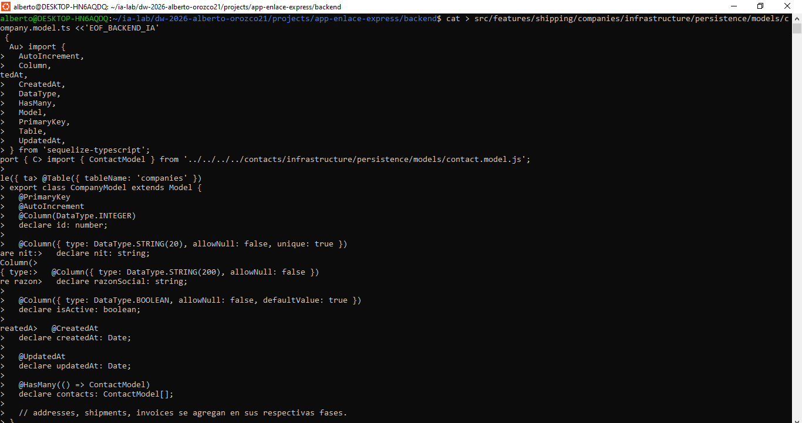

### 8.25 — Actualizar sequelize.factory.ts (registrar ContactModel)

Registra en ALL_MODELS solo los modelos ya creados (orden de dependencias).

**Archivo:** `src/infrastructure/database/sequelize/sequelize.factory.ts`

```bash
mkdir -p src/infrastructure/database/sequelize
cat > src/infrastructure/database/sequelize/sequelize.factory.ts <<'EOF_BACKEND_IA'
import { Sequelize } from 'sequelize-typescript';
import { DatabaseDialect } from '../../../config/environment/env.interface.js';
import { getSequelizeOptions } from './sequelize.options.js';

import { CompanyModel } from '../../../features/shipping/companies/infrastructure/persistence/models/company.model.js';
import { ContactModel } from '../../../features/shipping/contacts/infrastructure/persistence/models/contact.model.js';

export const ALL_MODELS = [
  CompanyModel,
  ContactModel,
];

async function loadDialectModule(moduleName: string): Promise<any> {
  // Proyecto ESM: require() no existe como global, se usa import() dinámico.
  const mod: any = await import(moduleName);
  return mod.default ?? mod;
}

export async function createSequelizeInstance(
  dialect: DatabaseDialect,
): Promise<Sequelize> {
  const options = getSequelizeOptions(dialect);

  let dialectModule: any;

  switch (dialect) {
    case DatabaseDialect.MySQL:
      dialectModule = await loadDialectModule('mysql2');
      break;
    case DatabaseDialect.Postgres:
      dialectModule = await loadDialectModule('pg');
      break;
    case DatabaseDialect.MSSQL:
      dialectModule = await loadDialectModule('tedious');
      break;
    case DatabaseDialect.Oracle:
      dialectModule = await loadDialectModule('oracledb');
      break;
    default:
      throw new Error(`Dialecto no soportado: ${dialect}`);
  }

  const sequelize = new Sequelize({
    ...options,
    dialectModule,
    models: ALL_MODELS,
  } as any);

  try {
    await sequelize.authenticate();
    console.log(`✅ Conexión exitosa a ${dialect.toUpperCase()}`);
  } catch (error: any) {
    console.error(
      `❌ Error conectando a ${dialect.toUpperCase()}:`,
      error.message,
    );
    throw error;
  }

  if (process.env.NODE_ENV !== 'production') {
    await sequelize.sync({ alter: false });
    console.log('✅ Tablas sincronizadas');
  }

  return sequelize;
}
EOF_BACKEND_IA
```

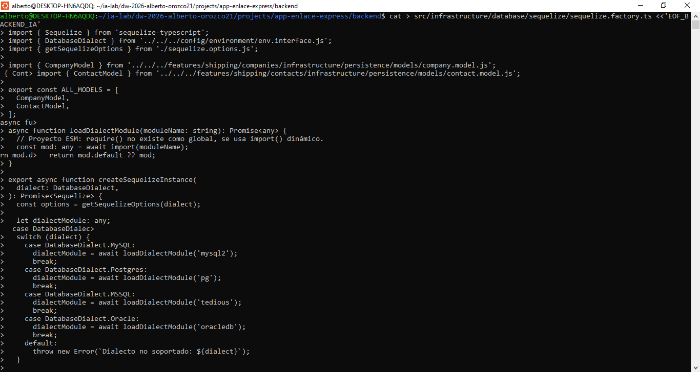

### 8.26 — Actualizar shipping.module.ts

Agrega el feature module de negocio recién terminado.

**Archivo:** `src/features/shipping/shipping.module.ts`

```bash
mkdir -p src/features/shipping
cat > src/features/shipping/shipping.module.ts <<'EOF_BACKEND_IA'
import { Module } from '@nestjs/common';
import { CompaniesModule } from './companies/companies.module.js';
import { ContactsModule } from './contacts/contacts.module.js';

@Module({
  imports: [CompaniesModule, ContactsModule],
  exports: [CompaniesModule, ContactsModule],
})
export class ShippingModule {}
EOF_BACKEND_IA
```

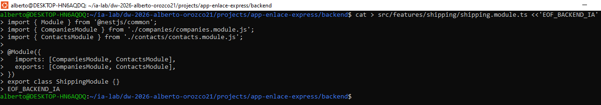

### 8.27 — Actualizar database-seeder.service.ts

Ejecuta seeders en orden de dependencias: primero empresas, luego contactos.

**Archivo:** `src/infrastructure/database/seeders/database-seeder.service.ts`

```bash
mkdir -p src/infrastructure/database/seeders
cat > src/infrastructure/database/seeders/database-seeder.service.ts <<'EOF_BACKEND_IA'
import { Injectable, Logger, OnModuleInit } from '@nestjs/common';
import { seedCompanies } from '../../../features/shipping/companies/infrastructure/persistence/seeders/companies.seeder.js';
import { seedContacts } from '../../../features/shipping/contacts/infrastructure/persistence/seeders/contacts.seeder.js';

/**
 * Ejecuta seeders en orden de dependencias.
 * Solo en entornos no productivos.
 */
@Injectable()
export class DatabaseSeederService implements OnModuleInit {
  private readonly logger = new Logger(DatabaseSeederService.name);

  async onModuleInit(): Promise<void> {
    if (process.env.NODE_ENV === 'production') {
      return;
    }

    try {
      await seedCompanies();
      await seedContacts();
      this.logger.log('✅ Seeders ejecutados');
    } catch (error: any) {
      this.logger.error(`❌ Error en seeders: ${error.message}`, error.stack);
      throw error;
    }
  }
}
EOF_BACKEND_IA
```

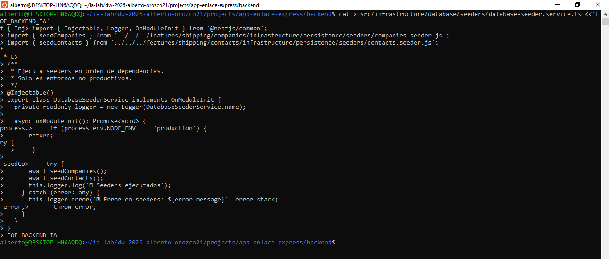

### 8.28 — Verificar tabla física `contacts` y API

`app.module.ts` **no necesita cambios**: ya importa `ShippingModule`, que ahora expone tanto `CompaniesModule` como `ContactsModule`.

Arranca la app. Debe crear/sync tabla `contacts` (con FK a `companies`), correr seeder y exponer `/api/contacts`. Prueba list/create en Swagger o curl, y confirma que `GET /api/contacts?companyId=1` filtra correctamente.

```bash
npm run start:dev
```

**Consola**

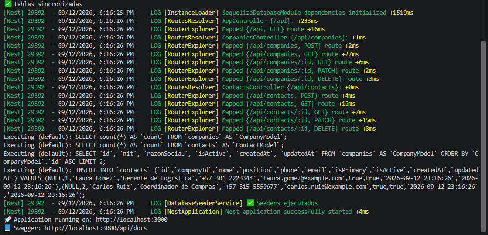

**/api/contacts**

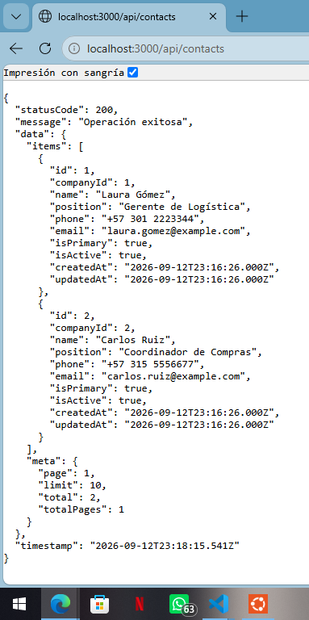

---------------------------------------------------------------

## FASE 9 — `08_BUSINESS_ADDRESSES`

### Business — Addresses / Direccion (patrón completo CA)

> **Objetivo de la fase:** Tercera entidad de negocio de EnlaceExpress: Direccion, que también pertenece a una Empresa (`companyId`) y representa un punto físico de recogida/entrega. Orden lógico: dominio → infraestructura → aplicación → presentación → módulo → cableado → verificación.
>
> Sigue las mismas convenciones de fase 8: imports relativos con `.js`, y asociación real con `CompanyModel` (import estático + referencia diferida `() => Modelo`).

### 9.1 — features/shipping/addresses/domain/enums/address-type.enum.ts

Enum de dominio propio del feature (no va en `common/enums` porque solo aplica a Direccion).

**Archivo:** `src/features/shipping/addresses/domain/enums/address-type.enum.ts`

```bash
mkdir -p src/features/shipping/addresses/domain/enums
cat > src/features/shipping/addresses/domain/enums/address-type.enum.ts <<'EOF_BACKEND_IA'
export enum AddressType {
  PICKUP = 'recogida',
  DELIVERY = 'entrega',
  MIXED = 'mixta',
}
EOF_BACKEND_IA
```

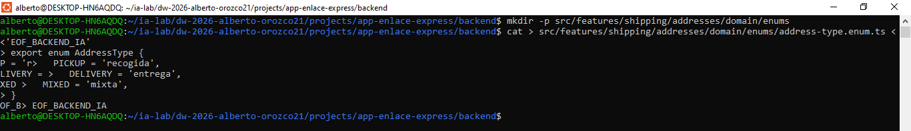

### 9.2 — features/shipping/addresses/domain/validators/address-coordinates.validator.ts

Validador de dominio reutilizable: rangos válidos de latitud/longitud.

**Archivo:** `src/features/shipping/addresses/domain/validators/address-coordinates.validator.ts`

```bash
mkdir -p src/features/shipping/addresses/domain/validators
cat > src/features/shipping/addresses/domain/validators/address-coordinates.validator.ts <<'EOF_BACKEND_IA'
export function isValidLatitude(latitude: number): boolean {
  return latitude >= -90 && latitude <= 90;
}

export function isValidLongitude(longitude: number): boolean {
  return longitude >= -180 && longitude <= 180;
}
EOF_BACKEND_IA
```

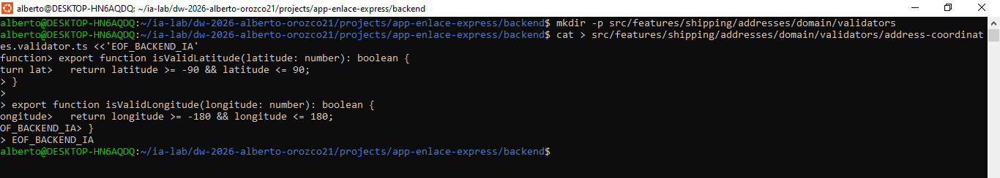

### 9.3 — features/shipping/addresses/domain/entities/address.entity.ts

Entidad de dominio (TypeScript puro). No extiende Sequelize `Model`. Aquí viven las reglas del negocio.

**Archivo:** `src/features/shipping/addresses/domain/entities/address.entity.ts`

```bash
mkdir -p src/features/shipping/addresses/domain/entities
cat > src/features/shipping/addresses/domain/entities/address.entity.ts <<'EOF_BACKEND_IA'
import { AddressType } from '../enums/address-type.enum.js';
import {
  isValidLatitude,
  isValidLongitude,
} from '../validators/address-coordinates.validator.js';

export interface AddressProps {
  id?: number;
  companyId: number;
  alias: string;
  addressLine1: string;
  addressLine2?: string;
  city: string;
  state?: string;
  country?: string;
  postalCode?: string;
  latitude?: number;
  longitude?: number;
  type?: AddressType;
  isActive?: boolean;
  createdAt?: Date;
  updatedAt?: Date;
}

export class Address {
  id?: number;
  companyId: number;
  alias: string;
  addressLine1: string;
  addressLine2?: string;
  city: string;
  state?: string;
  country: string;
  postalCode?: string;
  latitude?: number;
  longitude?: number;
  type: AddressType;
  isActive: boolean;
  createdAt?: Date;
  updatedAt?: Date;

  private constructor(props: AddressProps) {
    this.id = props.id;
    this.companyId = props.companyId;
    this.alias = props.alias;
    this.addressLine1 = props.addressLine1;
    this.addressLine2 = props.addressLine2;
    this.city = props.city;
    this.state = props.state;
    this.country = props.country ?? 'Colombia';
    this.postalCode = props.postalCode;
    this.latitude = props.latitude;
    this.longitude = props.longitude;
    this.type = props.type ?? AddressType.MIXED;
    this.isActive = props.isActive ?? true;
    this.createdAt = props.createdAt;
    this.updatedAt = props.updatedAt;
  }

  private static validateCoordinates(
    latitude?: number,
    longitude?: number,
  ): void {
    if (latitude !== undefined && !isValidLatitude(latitude)) {
      throw new Error('La latitud debe estar entre -90 y 90');
    }
    if (longitude !== undefined && !isValidLongitude(longitude)) {
      throw new Error('La longitud debe estar entre -180 y 180');
    }
  }

  static create(
    props: Omit<AddressProps, 'id' | 'isActive' | 'createdAt' | 'updatedAt'>,
  ): Address {
    if (!props.companyId) {
      throw new Error('La dirección debe pertenecer a una empresa');
    }

    if (!props.alias?.trim()) {
      throw new Error('El alias de la dirección es requerido');
    }

    if (!props.addressLine1?.trim()) {
      throw new Error('La línea de dirección es requerida');
    }

    if (!props.city?.trim()) {
      throw new Error('La ciudad es requerida');
    }

    Address.validateCoordinates(props.latitude, props.longitude);

    return new Address(props);
  }

  static reconstitute(props: AddressProps): Address {
    return new Address(props);
  }

  update(
    props: Partial<
      Omit<AddressProps, 'id' | 'companyId' | 'isActive' | 'createdAt' | 'updatedAt'>
    >,
  ): void {
    if (props.alias !== undefined) {
      if (!props.alias.trim()) {
        throw new Error('El alias de la dirección es requerido');
      }
      this.alias = props.alias;
    }

    if (props.addressLine1 !== undefined) {
      if (!props.addressLine1.trim()) {
        throw new Error('La línea de dirección es requerida');
      }
      this.addressLine1 = props.addressLine1;
    }

    if (props.addressLine2 !== undefined) {
      this.addressLine2 = props.addressLine2;
    }

    if (props.city !== undefined) {
      if (!props.city.trim()) {
        throw new Error('La ciudad es requerida');
      }
      this.city = props.city;
    }

    if (props.state !== undefined) {
      this.state = props.state;
    }

    if (props.country !== undefined) {
      this.country = props.country;
    }

    if (props.postalCode !== undefined) {
      this.postalCode = props.postalCode;
    }

    if (props.latitude !== undefined || props.longitude !== undefined) {
      const nextLatitude = props.latitude ?? this.latitude;
      const nextLongitude = props.longitude ?? this.longitude;
      Address.validateCoordinates(nextLatitude, nextLongitude);
      if (props.latitude !== undefined) this.latitude = props.latitude;
      if (props.longitude !== undefined) this.longitude = props.longitude;
    }

    if (props.type !== undefined) {
      this.type = props.type;
    }
  }

  deactivate(): void {
    this.isActive = false;
  }

  activate(): void {
    this.isActive = true;
  }
}
EOF_BACKEND_IA
```

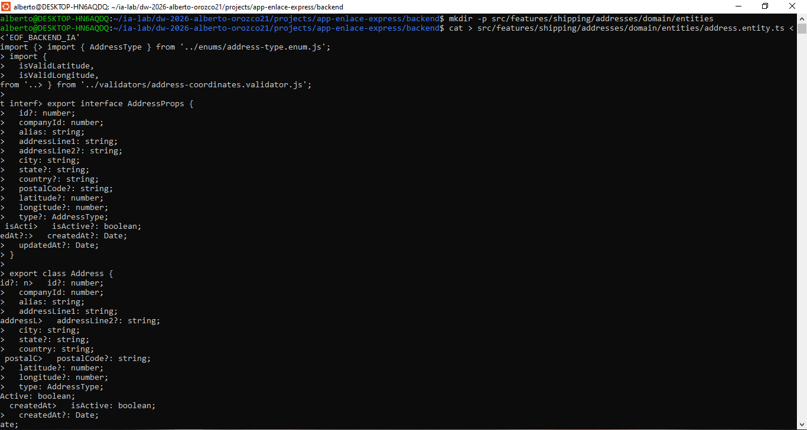

### 9.4 — features/shipping/addresses/domain/exceptions/address-not-found.exception.ts

Excepción de dominio. El caso de uso la lanza; el filter HTTP la traduce a status code.

**Archivo:** `src/features/shipping/addresses/domain/exceptions/address-not-found.exception.ts`

```bash
mkdir -p src/features/shipping/addresses/domain/exceptions
cat > src/features/shipping/addresses/domain/exceptions/address-not-found.exception.ts <<'EOF_BACKEND_IA'
import { EntityNotFoundException } from '../../../../../common/exceptions/entity-not-found.exception.js';

export class AddressNotFoundException extends EntityNotFoundException {
  constructor(id: number) {
    super('Dirección', id);
  }
}
EOF_BACKEND_IA
```

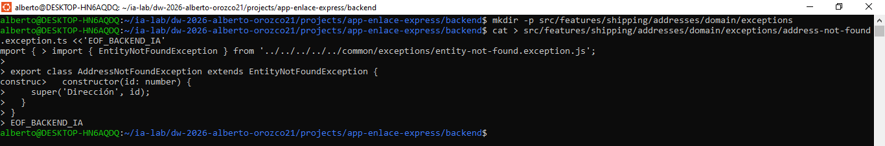

### 9.5 — features/shipping/addresses/domain/interfaces/address-repository.interface.ts

Puerto (contrato) del repositorio. La aplicación depende de esta interface, no de Sequelize.

**Archivo:** `src/features/shipping/addresses/domain/interfaces/address-repository.interface.ts`

```bash
mkdir -p src/features/shipping/addresses/domain/interfaces
cat > src/features/shipping/addresses/domain/interfaces/address-repository.interface.ts <<'EOF_BACKEND_IA'
import { PaginatedResult } from '../../../../../common/interfaces/pagination.interface.js';
import { AddressType } from '../enums/address-type.enum.js';
import { Address } from '../entities/address.entity.js';

export const ADDRESS_REPOSITORY = 'ADDRESS_REPOSITORY';

export interface AddressFindAllParams {
  page?: number;
  limit?: number;
  search?: string;
  companyId?: number;
  type?: AddressType;
}

export interface IAddressRepository {
  create(address: Address): Promise<Address>;
  update(address: Address): Promise<Address>;
  delete(id: number): Promise<void>;
  findById(id: number): Promise<Address | null>;
  findAll(params: AddressFindAllParams): Promise<PaginatedResult<Address>>;
}
EOF_BACKEND_IA
```

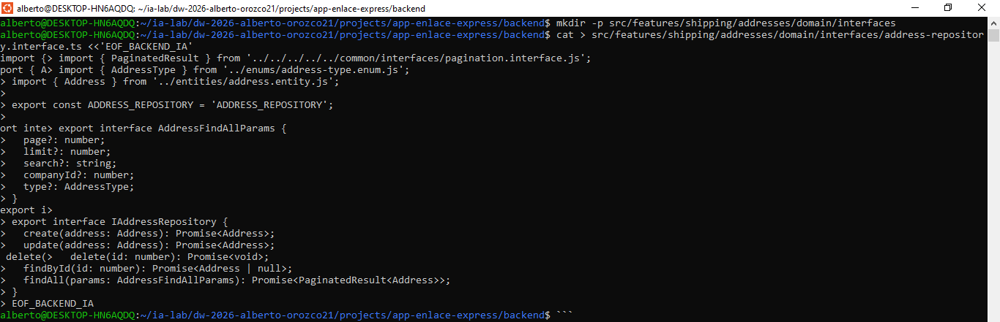

### 9.6 — features/shipping/addresses/infrastructure/persistence/models/address.model.ts

Modelo Sequelize (`@Table`). Incluye la FK real y `@BelongsTo(() => CompanyModel)`.

**Archivo:** `src/features/shipping/addresses/infrastructure/persistence/models/address.model.ts`

```bash
mkdir -p src/features/shipping/addresses/infrastructure/persistence/models
cat > src/features/shipping/addresses/infrastructure/persistence/models/address.model.ts <<'EOF_BACKEND_IA'
import {
  AutoIncrement,
  BelongsTo,
  Column,
  CreatedAt,
  DataType,
  ForeignKey,
  Model,
  PrimaryKey,
  Table,
  UpdatedAt,
} from 'sequelize-typescript';
import { CompanyModel } from '../../../../companies/infrastructure/persistence/models/company.model.js';
import { AddressType } from '../../../domain/enums/address-type.enum.js';

@Table({ tableName: 'addresses' })
export class AddressModel extends Model {
  @PrimaryKey
  @AutoIncrement
  @Column(DataType.INTEGER)
  declare id: number;

  @ForeignKey(() => CompanyModel)
  @Column({ type: DataType.INTEGER, allowNull: false })
  declare companyId: number;

  @BelongsTo(() => CompanyModel)
  declare company: CompanyModel;

  @Column({ type: DataType.STRING(100), allowNull: false })
  declare alias: string;

  @Column({ type: DataType.STRING(255), allowNull: false })
  declare addressLine1: string;

  @Column({ type: DataType.STRING(255), allowNull: true })
  declare addressLine2: string | null;

  @Column({ type: DataType.STRING(100), allowNull: false })
  declare city: string;

  @Column({ type: DataType.STRING(100), allowNull: true })
  declare state: string | null;

  @Column({ type: DataType.STRING(100), allowNull: false, defaultValue: 'Colombia' })
  declare country: string;

  @Column({ type: DataType.STRING(20), allowNull: true })
  declare postalCode: string | null;

  @Column({ type: DataType.DECIMAL(10, 7), allowNull: true })
  declare latitude: number | null;

  @Column({ type: DataType.DECIMAL(10, 7), allowNull: true })
  declare longitude: number | null;

  @Column({
    type: DataType.ENUM(...Object.values(AddressType)),
    allowNull: false,
    defaultValue: AddressType.MIXED,
  })
  declare type: AddressType;

  @Column({ type: DataType.BOOLEAN, allowNull: false, defaultValue: true })
  declare isActive: boolean;

  @CreatedAt
  declare createdAt: Date;

  @UpdatedAt
  declare updatedAt: Date;
}
EOF_BACKEND_IA
```

[text](dw2026-2-bitacora-proceso.md)

### 9.7 — features/shipping/addresses/infrastructure/persistence/repositories/address.repository.ts

Adaptador del repositorio: implementa el puerto de dominio con Sequelize.

**Archivo:** `src/features/shipping/addresses/infrastructure/persistence/repositories/address.repository.ts`

```bash
mkdir -p src/features/shipping/addresses/infrastructure/persistence/repositories
cat > src/features/shipping/addresses/infrastructure/persistence/repositories/address.repository.ts <<'EOF_BACKEND_IA'
import { Injectable } from '@nestjs/common';
import { Op } from 'sequelize';
import {
  buildPaginatedResult,
  normalizePagination,
} from '../../../../../../common/utils/pagination.util.js';
import { Address } from '../../../domain/entities/address.entity.js';
import {
  AddressFindAllParams,
  IAddressRepository,
} from '../../../domain/interfaces/address-repository.interface.js';
import { AddressMapper } from '../../../application/mappers/address.mapper.js';
import { AddressModel } from '../models/address.model.js';

@Injectable()
export class AddressRepository implements IAddressRepository {
  async create(address: Address): Promise<Address> {
    const model = await AddressModel.create(
      AddressMapper.toPersistence(address),
    );
    return AddressMapper.toDomain(model);
  }

  async update(address: Address): Promise<Address> {
    await AddressModel.update(AddressMapper.toPersistence(address), {
      where: { id: address.id },
    });
    const updated = await AddressModel.findByPk(address.id!);
    return AddressMapper.toDomain(updated!);
  }

  async delete(id: number): Promise<void> {
    await AddressModel.destroy({ where: { id } });
  }

  async findById(id: number): Promise<Address | null> {
    const model = await AddressModel.findByPk(id);
    return model ? AddressMapper.toDomain(model) : null;
  }

  async findAll(params: AddressFindAllParams) {
    const { page, limit, offset } = normalizePagination(
      params.page,
      params.limit,
    );

    const where: Record<string, unknown> = {};

    if (params.companyId) {
      where.companyId = params.companyId;
    }

    if (params.type) {
      where.type = params.type;
    }

    if (params.search) {
      where[Op.or as unknown as string] = [
        { alias: { [Op.like]: `%${params.search}%` } },
        { city: { [Op.like]: `%${params.search}%` } },
        { addressLine1: { [Op.like]: `%${params.search}%` } },
      ];
    }

    const { rows, count } = await AddressModel.findAndCountAll({
      where,
      limit,
      offset,
      order: [['createdAt', 'DESC']],
    });

    return buildPaginatedResult(
      rows.map((row) => AddressMapper.toDomain(row)),
      count,
      page,
      limit,
    );
  }
}
EOF_BACKEND_IA
```

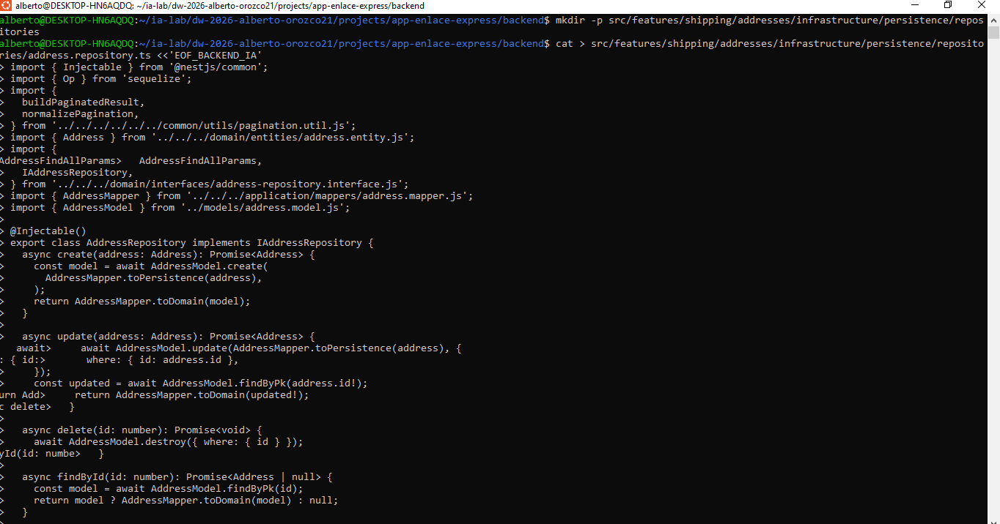

### 9.8 — features/shipping/addresses/infrastructure/persistence/migrations/create-addresses-table.migration.ts

Migración documental/auxiliar de la tabla. En dev el sync de Sequelize crea el esquema.

**Archivo:** `src/features/shipping/addresses/infrastructure/persistence/migrations/create-addresses-table.migration.ts`

```bash
mkdir -p src/features/shipping/addresses/infrastructure/persistence/migrations
cat > src/features/shipping/addresses/infrastructure/persistence/migrations/create-addresses-table.migration.ts <<'EOF_BACKEND_IA'
export const createAddressesTableMigration = {
  name: 'create-addresses-table',
  async up(): Promise<void> {
    // Sequelize sync handles table creation in development.
    // Production: CREATE TABLE addresses (id, companyId FK->companies, alias, addressLine1,
    //   addressLine2, city, state, country, postalCode, latitude, longitude, type,
    //   isActive, createdAt, updatedAt)
  },
  async down(): Promise<void> {
    // Production: DROP TABLE addresses
  },
};
EOF_BACKEND_IA
```

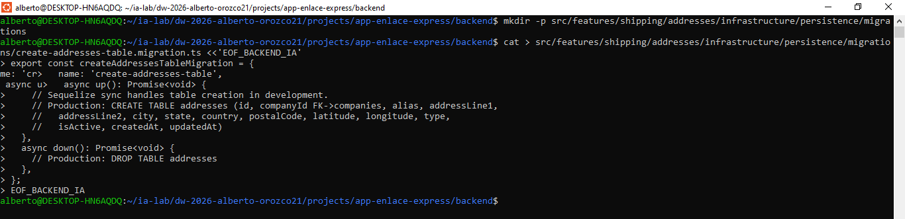

### 9.9 — features/shipping/addresses/infrastructure/persistence/seeders/addresses.seeder.ts

Seeder de datos iniciales. Depende de que ya existan empresas (fase 7).

**Archivo:** `src/features/shipping/addresses/infrastructure/persistence/seeders/addresses.seeder.ts`

```bash
mkdir -p src/features/shipping/addresses/infrastructure/persistence/seeders
cat > src/features/shipping/addresses/infrastructure/persistence/seeders/addresses.seeder.ts <<'EOF_BACKEND_IA'
import { AddressModel } from '../models/address.model.js';
import { CompanyModel } from '../../../../companies/infrastructure/persistence/models/company.model.js';
import { AddressType } from '../../../domain/enums/address-type.enum.js';

export async function seedAddresses(): Promise<void> {
  const count = await AddressModel.count();
  if (count > 0) {
    return;
  }

  const companies = await CompanyModel.findAll({
    limit: 2,
    order: [['id', 'ASC']],
  });

  if (companies.length === 0) {
    return;
  }

  const records = [
    {
      companyId: companies[0].id,
      alias: 'Bodega norte',
      addressLine1: 'Cra 45 # 98-20',
      city: 'Barranquilla',
      state: 'Atlántico',
      country: 'Colombia',
      postalCode: '080020',
      latitude: 11.0184,
      longitude: -74.8508,
      type: AddressType.MIXED,
      isActive: true,
    },
  ];

  if (companies[1]) {
    records.push({
      companyId: companies[1].id,
      alias: 'Oficina principal',
      addressLine1: 'Calle 72 # 10-34',
      city: 'Bogotá',
      state: 'Cundinamarca',
      country: 'Colombia',
      postalCode: '110221',
      latitude: 4.711,
      longitude: -74.0721,
      type: AddressType.PICKUP,
      isActive: true,
    });
  }

  await AddressModel.bulkCreate(records);
}
EOF_BACKEND_IA
```

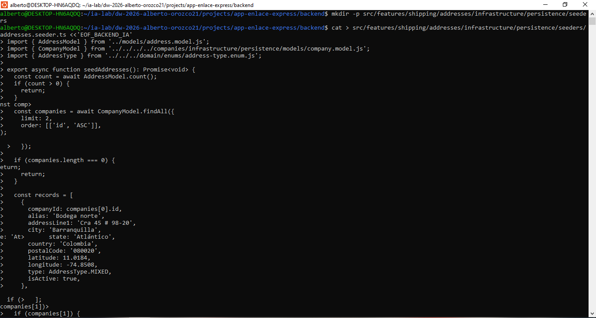

### 9.10 — features/shipping/addresses/application/dto/address-filter.dto.ts

DTO de entrada/salida HTTP con `class-validator` / Swagger. Incluye filtro por `companyId` y `type`.

**Archivo:** `src/features/shipping/addresses/application/dto/address-filter.dto.ts`

```bash
mkdir -p src/features/shipping/addresses/application/dto
cat > src/features/shipping/addresses/application/dto/address-filter.dto.ts <<'EOF_BACKEND_IA'
import { ApiPropertyOptional } from '@nestjs/swagger';
import { Type } from 'class-transformer';
import {
  IsEnum,
  IsInt,
  IsOptional,
  IsPositive,
  IsString,
  Min,
} from 'class-validator';
import { AddressType } from '../../domain/enums/address-type.enum.js';

export class AddressFilterDto {
  @ApiPropertyOptional({ example: 1, default: 1 })
  @IsOptional()
  @Type(() => Number)
  @IsInt()
  @Min(1)
  page?: number;

  @ApiPropertyOptional({ example: 10, default: 10 })
  @IsOptional()
  @Type(() => Number)
  @IsInt()
  @IsPositive()
  limit?: number;

  @ApiPropertyOptional({ example: 'bodega' })
  @IsOptional()
  @IsString()
  search?: string;

  @ApiPropertyOptional({ example: 1 })
  @IsOptional()
  @Type(() => Number)
  @IsInt()
  @IsPositive()
  companyId?: number;

  @ApiPropertyOptional({ enum: AddressType, example: AddressType.PICKUP })
  @IsOptional()
  @IsEnum(AddressType)
  type?: AddressType;
}
EOF_BACKEND_IA
```

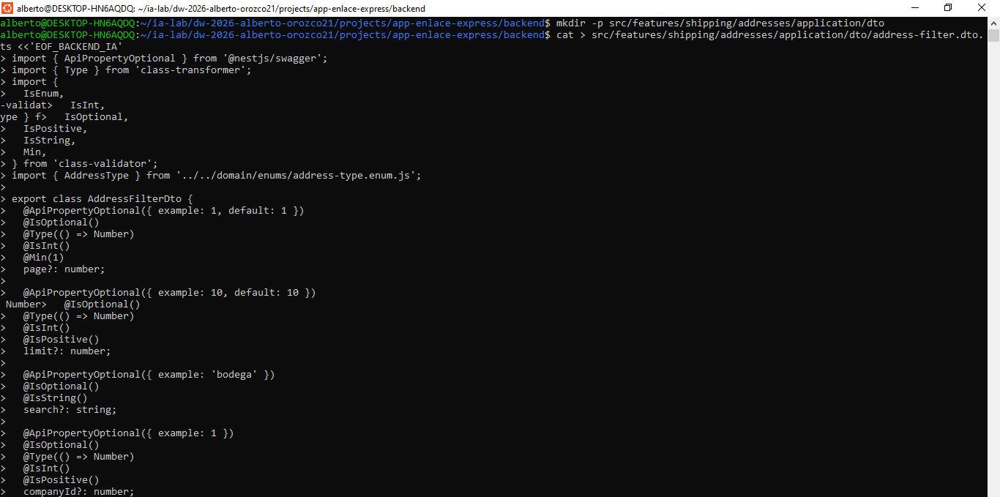

### 9.11 — features/shipping/addresses/application/dto/address-response.dto.ts

DTO de entrada/salida HTTP con `class-validator` / Swagger.

**Archivo:** `src/features/shipping/addresses/application/dto/address-response.dto.ts`

```bash
mkdir -p src/features/shipping/addresses/application/dto
cat > src/features/shipping/addresses/application/dto/address-response.dto.ts <<'EOF_BACKEND_IA'
import { ApiProperty, ApiPropertyOptional } from '@nestjs/swagger';
import { AddressType } from '../../domain/enums/address-type.enum.js';

export class AddressResponseDto {
  @ApiProperty({ example: 1 })
  id: number;

  @ApiProperty({ example: 1 })
  companyId: number;

  @ApiProperty({ example: 'Bodega norte' })
  alias: string;

  @ApiProperty({ example: 'Cra 45 # 98-20' })
  addressLine1: string;

  @ApiPropertyOptional({ example: 'Bodega 3, interior 2' })
  addressLine2?: string;

  @ApiProperty({ example: 'Barranquilla' })
  city: string;

  @ApiPropertyOptional({ example: 'Atlántico' })
  state?: string;

  @ApiProperty({ example: 'Colombia' })
  country: string;

  @ApiPropertyOptional({ example: '080020' })
  postalCode?: string;

  @ApiPropertyOptional({ example: 11.0184 })
  latitude?: number;

  @ApiPropertyOptional({ example: -74.8508 })
  longitude?: number;

  @ApiProperty({ enum: AddressType, example: AddressType.MIXED })
  type: AddressType;

  @ApiProperty({ example: true })
  isActive: boolean;

  @ApiProperty()
  createdAt: Date;

  @ApiProperty()
  updatedAt: Date;
}
EOF_BACKEND_IA
```

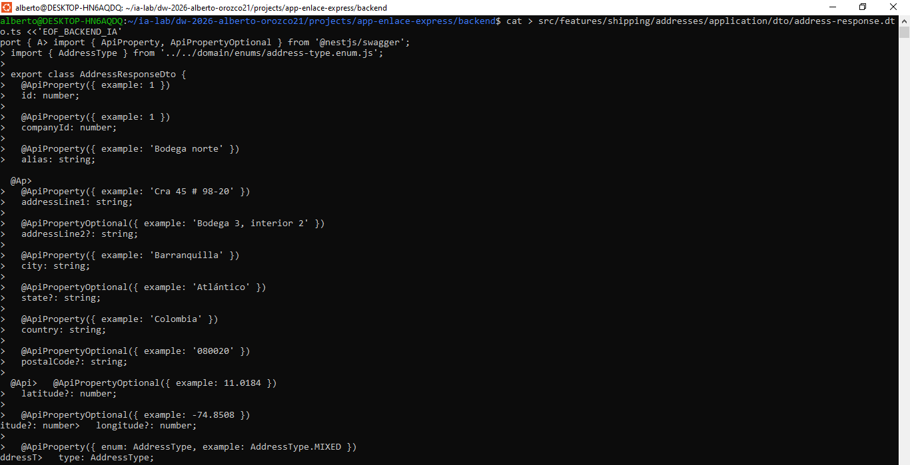

### 9.12 — features/shipping/addresses/application/dto/create-address.dto.ts

DTO de entrada/salida HTTP con `class-validator` / Swagger.

**Archivo:** `src/features/shipping/addresses/application/dto/create-address.dto.ts`

```bash
mkdir -p src/features/shipping/addresses/application/dto
cat > src/features/shipping/addresses/application/dto/create-address.dto.ts <<'EOF_BACKEND_IA'
import { ApiProperty, ApiPropertyOptional } from '@nestjs/swagger';
import {
  IsEnum,
  IsInt,
  IsLatitude,
  IsLongitude,
  IsNotEmpty,
  IsOptional,
  IsPositive,
  IsString,
  MaxLength,
} from 'class-validator';
import { AddressType } from '../../domain/enums/address-type.enum.js';

export class CreateAddressDto {
  @ApiProperty({ example: 1 })
  @IsInt()
  @IsPositive()
  companyId: number;

  @ApiProperty({ example: 'Bodega norte' })
  @IsString()
  @IsNotEmpty()
  @MaxLength(100)
  alias: string;

  @ApiProperty({ example: 'Cra 45 # 98-20' })
  @IsString()
  @IsNotEmpty()
  @MaxLength(255)
  addressLine1: string;

  @ApiPropertyOptional({ example: 'Bodega 3, interior 2' })
  @IsOptional()
  @IsString()
  @MaxLength(255)
  addressLine2?: string;

  @ApiProperty({ example: 'Barranquilla' })
  @IsString()
  @IsNotEmpty()
  @MaxLength(100)
  city: string;

  @ApiPropertyOptional({ example: 'Atlántico' })
  @IsOptional()
  @IsString()
  @MaxLength(100)
  state?: string;

  @ApiPropertyOptional({ example: 'Colombia', default: 'Colombia' })
  @IsOptional()
  @IsString()
  @MaxLength(100)
  country?: string;

  @ApiPropertyOptional({ example: '080020' })
  @IsOptional()
  @IsString()
  @MaxLength(20)
  postalCode?: string;

  @ApiPropertyOptional({ example: 11.0184 })
  @IsOptional()
  @IsLatitude()
  latitude?: number;

  @ApiPropertyOptional({ example: -74.8508 })
  @IsOptional()
  @IsLongitude()
  longitude?: number;

  @ApiPropertyOptional({ enum: AddressType, example: AddressType.MIXED })
  @IsOptional()
  @IsEnum(AddressType)
  type?: AddressType;
}
EOF_BACKEND_IA
```

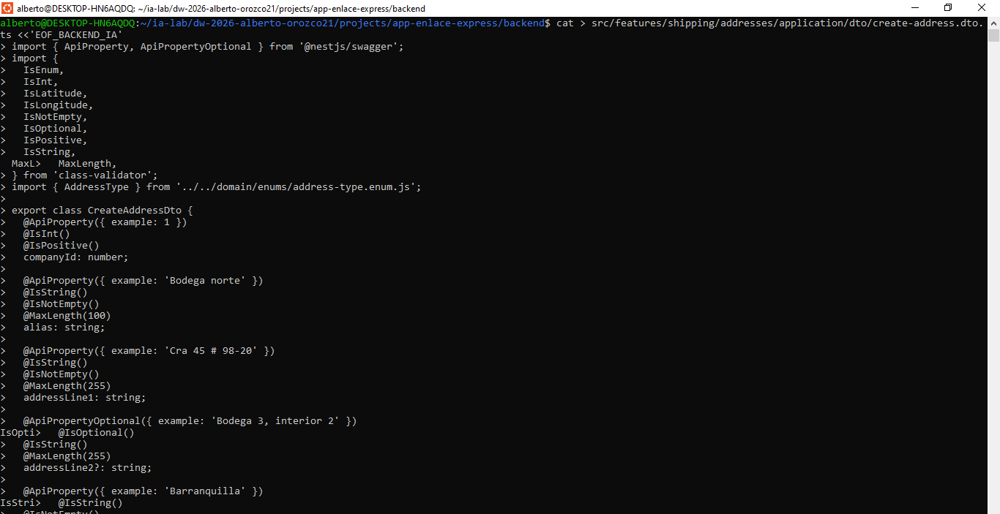

### 9.13 — features/shipping/addresses/application/dto/update-address.dto.ts

DTO de actualización. `companyId` se excluye a propósito: una dirección no cambia de empresa.

**Archivo:** `src/features/shipping/addresses/application/dto/update-address.dto.ts`

```bash
mkdir -p src/features/shipping/addresses/application/dto
cat > src/features/shipping/addresses/application/dto/update-address.dto.ts <<'EOF_BACKEND_IA'
import { OmitType, PartialType } from '@nestjs/mapped-types';
import { CreateAddressDto } from './create-address.dto.js';

export class UpdateAddressDto extends PartialType(
  OmitType(CreateAddressDto, ['companyId'] as const),
) {}
EOF_BACKEND_IA
```

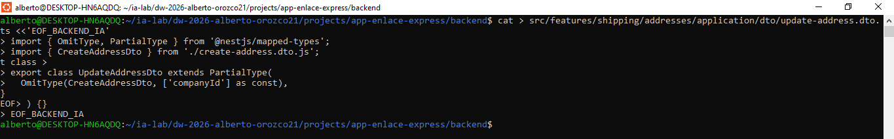

### 9.14 — features/shipping/addresses/application/mappers/address.mapper.ts

Mapper entre entidad de dominio y DTO de respuesta.

**Archivo:** `src/features/shipping/addresses/application/mappers/address.mapper.ts`

```bash
mkdir -p src/features/shipping/addresses/application/mappers
cat > src/features/shipping/addresses/application/mappers/address.mapper.ts <<'EOF_BACKEND_IA'
import { Address } from '../../domain/entities/address.entity.js';
import { AddressResponseDto } from '../dto/address-response.dto.js';
import { AddressModel } from '../../infrastructure/persistence/models/address.model.js';

export class AddressMapper {
  static toDomain(model: AddressModel): Address {
    return Address.reconstitute({
      id: model.id,
      companyId: model.companyId,
      alias: model.alias,
      addressLine1: model.addressLine1,
      addressLine2: model.addressLine2 ?? undefined,
      city: model.city,
      state: model.state ?? undefined,
      country: model.country,
      postalCode: model.postalCode ?? undefined,
      latitude: model.latitude !== null ? Number(model.latitude) : undefined,
      longitude:
        model.longitude !== null ? Number(model.longitude) : undefined,
      type: model.type,
      isActive: model.isActive,
      createdAt: model.createdAt,
      updatedAt: model.updatedAt,
    });
  }

  static toResponse(entity: Address): AddressResponseDto {
    return {
      id: entity.id!,
      companyId: entity.companyId,
      alias: entity.alias,
      addressLine1: entity.addressLine1,
      addressLine2: entity.addressLine2,
      city: entity.city,
      state: entity.state,
      country: entity.country,
      postalCode: entity.postalCode,
      latitude: entity.latitude,
      longitude: entity.longitude,
      type: entity.type,
      isActive: entity.isActive,
      createdAt: entity.createdAt!,
      updatedAt: entity.updatedAt!,
    };
  }

  static toPersistence(entity: Address): Partial<AddressModel> {
    return {
      id: entity.id,
      companyId: entity.companyId,
      alias: entity.alias,
      addressLine1: entity.addressLine1,
      addressLine2: entity.addressLine2 ?? null,
      city: entity.city,
      state: entity.state ?? null,
      country: entity.country,
      postalCode: entity.postalCode ?? null,
      latitude: entity.latitude ?? null,
      longitude: entity.longitude ?? null,
      type: entity.type,
      isActive: entity.isActive ?? true,
    };
  }
}
EOF_BACKEND_IA
```

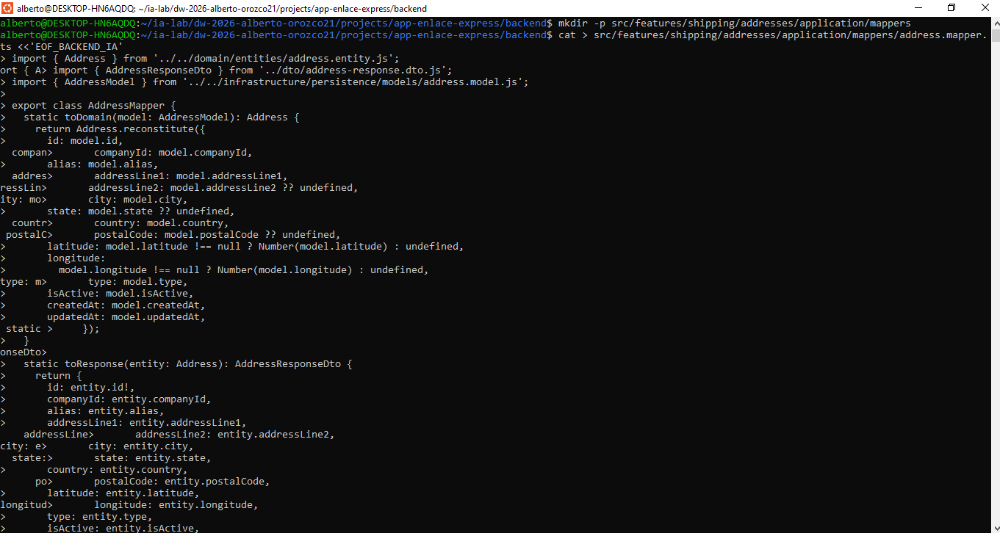

### 9.15 — features/shipping/addresses/application/use-cases/create-address.use-case.ts

Caso de uso. Verifica que la empresa exista (cruce con el feature `companies`).

**Archivo:** `src/features/shipping/addresses/application/use-cases/create-address.use-case.ts`

```bash
mkdir -p src/features/shipping/addresses/application/use-cases
cat > src/features/shipping/addresses/application/use-cases/create-address.use-case.ts <<'EOF_BACKEND_IA'
import { Inject, Injectable } from '@nestjs/common';
import { CompanyNotFoundException } from '../../../companies/domain/exceptions/company-not-found.exception.js';
import {
  COMPANY_REPOSITORY,
  type ICompanyRepository,
} from '../../../companies/domain/interfaces/company-repository.interface.js';
import { Address } from '../../domain/entities/address.entity.js';
import {
  ADDRESS_REPOSITORY,
  type IAddressRepository,
} from '../../domain/interfaces/address-repository.interface.js';
import { CreateAddressDto } from '../dto/create-address.dto.js';
import { AddressMapper } from '../mappers/address.mapper.js';

@Injectable()
export class CreateAddressUseCase {
  constructor(
    @Inject(ADDRESS_REPOSITORY)
    private readonly addressRepository: IAddressRepository,
    @Inject(COMPANY_REPOSITORY)
    private readonly companyRepository: ICompanyRepository,
  ) {}

  async execute(dto: CreateAddressDto) {
    const company = await this.companyRepository.findById(dto.companyId);
    if (!company) {
      throw new CompanyNotFoundException(dto.companyId);
    }

    const address = Address.create({
      companyId: dto.companyId,
      alias: dto.alias,
      addressLine1: dto.addressLine1,
      addressLine2: dto.addressLine2,
      city: dto.city,
      state: dto.state,
      country: dto.country,
      postalCode: dto.postalCode,
      latitude: dto.latitude,
      longitude: dto.longitude,
      type: dto.type,
    });

    const created = await this.addressRepository.create(address);
    return AddressMapper.toResponse(created);
  }
}
EOF_BACKEND_IA
```

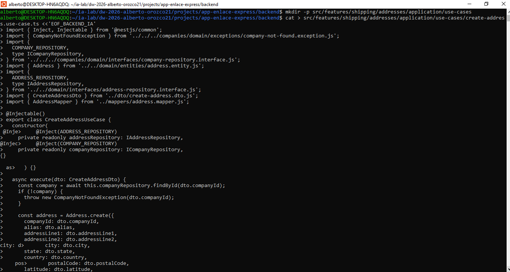

### 9.16 — features/shipping/addresses/application/use-cases/delete-address.use-case.ts

Caso de uso (aplicación). Orquesta dominio + repositorio. El controller solo lo invoca.

**Archivo:** `src/features/shipping/addresses/application/use-cases/delete-address.use-case.ts`

```bash
mkdir -p src/features/shipping/addresses/application/use-cases
cat > src/features/shipping/addresses/application/use-cases/delete-address.use-case.ts <<'EOF_BACKEND_IA'
import { Inject, Injectable } from '@nestjs/common';
import { AddressNotFoundException } from '../../domain/exceptions/address-not-found.exception.js';
import {
  ADDRESS_REPOSITORY,
  type IAddressRepository,
} from '../../domain/interfaces/address-repository.interface.js';

@Injectable()
export class DeleteAddressUseCase {
  constructor(
    @Inject(ADDRESS_REPOSITORY)
    private readonly addressRepository: IAddressRepository,
  ) {}

  async execute(id: number): Promise<void> {
    const address = await this.addressRepository.findById(id);
    if (!address) {
      throw new AddressNotFoundException(id);
    }

    await this.addressRepository.delete(id);
  }
}
EOF_BACKEND_IA
```

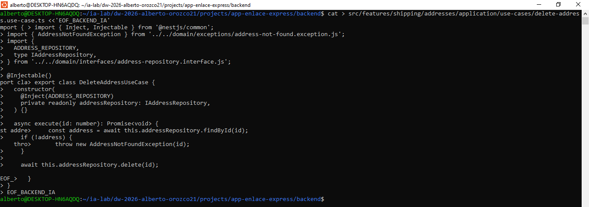

### 9.17 — features/shipping/addresses/application/use-cases/get-address.use-case.ts

Caso de uso (aplicación). Orquesta dominio + repositorio. El controller solo lo invoca.

**Archivo:** `src/features/shipping/addresses/application/use-cases/get-address.use-case.ts`

```bash
mkdir -p src/features/shipping/addresses/application/use-cases
cat > src/features/shipping/addresses/application/use-cases/get-address.use-case.ts <<'EOF_BACKEND_IA'
import { Inject, Injectable } from '@nestjs/common';
import { AddressNotFoundException } from '../../domain/exceptions/address-not-found.exception.js';
import {
  ADDRESS_REPOSITORY,
  type IAddressRepository,
} from '../../domain/interfaces/address-repository.interface.js';
import { AddressMapper } from '../mappers/address.mapper.js';

@Injectable()
export class GetAddressUseCase {
  constructor(
    @Inject(ADDRESS_REPOSITORY)
    private readonly addressRepository: IAddressRepository,
  ) {}

  async execute(id: number) {
    const address = await this.addressRepository.findById(id);
    if (!address) {
      throw new AddressNotFoundException(id);
    }

    return AddressMapper.toResponse(address);
  }
}
EOF_BACKEND_IA
```
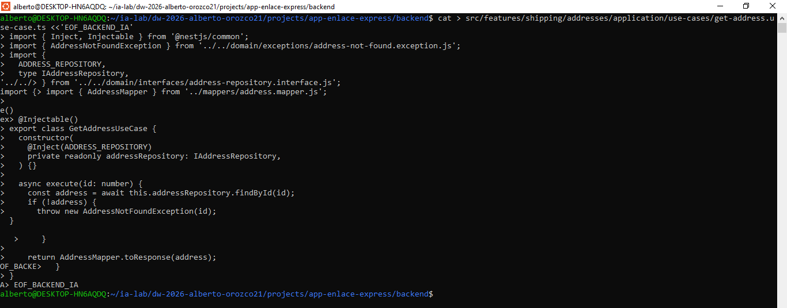

### 9.18 — features/shipping/addresses/application/use-cases/list-addresses.use-case.ts

Caso de uso (aplicación). Orquesta dominio + repositorio. El controller solo lo invoca.

**Archivo:** `src/features/shipping/addresses/application/use-cases/list-addresses.use-case.ts`

```bash
mkdir -p src/features/shipping/addresses/application/use-cases
cat > src/features/shipping/addresses/application/use-cases/list-addresses.use-case.ts <<'EOF_BACKEND_IA'
import { Inject, Injectable } from '@nestjs/common';
import {
  ADDRESS_REPOSITORY,
  type IAddressRepository,
} from '../../domain/interfaces/address-repository.interface.js';
import { AddressFilterDto } from '../dto/address-filter.dto.js';
import { AddressMapper } from '../mappers/address.mapper.js';

@Injectable()
export class ListAddressesUseCase {
  constructor(
    @Inject(ADDRESS_REPOSITORY)
    private readonly addressRepository: IAddressRepository,
  ) {}

  async execute(filter: AddressFilterDto) {
    const result = await this.addressRepository.findAll(filter);
    return {
      items: result.items.map((address) => AddressMapper.toResponse(address)),
      meta: result.meta,
    };
  }
}
EOF_BACKEND_IA
```

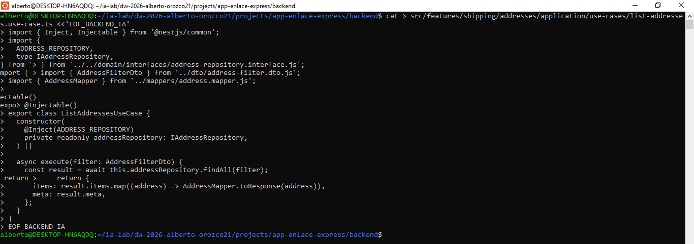

### 9.19 — features/shipping/addresses/application/use-cases/update-address.use-case.ts

Caso de uso (aplicación). Orquesta dominio + repositorio. El controller solo lo invoca.

**Archivo:** `src/features/shipping/addresses/application/use-cases/update-address.use-case.ts`

```bash
mkdir -p src/features/shipping/addresses/application/use-cases
cat > src/features/shipping/addresses/application/use-cases/update-address.use-case.ts <<'EOF_BACKEND_IA'
import { Inject, Injectable } from '@nestjs/common';
import { AddressNotFoundException } from '../../domain/exceptions/address-not-found.exception.js';
import {
  ADDRESS_REPOSITORY,
  type IAddressRepository,
} from '../../domain/interfaces/address-repository.interface.js';
import { UpdateAddressDto } from '../dto/update-address.dto.js';
import { AddressMapper } from '../mappers/address.mapper.js';

@Injectable()
export class UpdateAddressUseCase {
  constructor(
    @Inject(ADDRESS_REPOSITORY)
    private readonly addressRepository: IAddressRepository,
  ) {}

  async execute(id: number, dto: UpdateAddressDto) {
    const address = await this.addressRepository.findById(id);
    if (!address) {
      throw new AddressNotFoundException(id);
    }

    address.update(dto);
    const updated = await this.addressRepository.update(address);
    return AddressMapper.toResponse(updated);
  }
}
EOF_BACKEND_IA
```

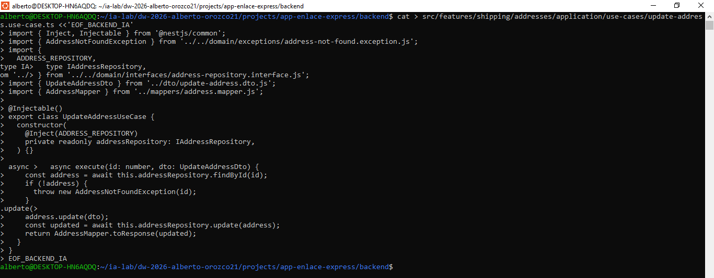

### 9.20 — features/shipping/addresses/presentation/http/serializers/address.serializer.ts

Serializer de presentación (forma estable de la respuesta HTTP).

**Archivo:** `src/features/shipping/addresses/presentation/http/serializers/address.serializer.ts`

```bash
mkdir -p src/features/shipping/addresses/presentation/http/serializers
cat > src/features/shipping/addresses/presentation/http/serializers/address.serializer.ts <<'EOF_BACKEND_IA'
import { Address } from '../../../domain/entities/address.entity.js';
import { AddressResponseDto } from '../../../application/dto/address-response.dto.js';
import { AddressMapper } from '../../../application/mappers/address.mapper.js';

export class AddressSerializer {
  static serialize(entity: Address): AddressResponseDto {
    return AddressMapper.toResponse(entity);
  }
}
EOF_BACKEND_IA
```

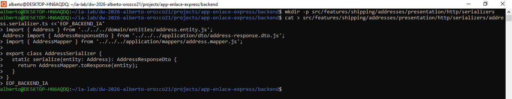

### 9.21 — features/shipping/addresses/presentation/http/controllers/addresses.controller.ts

Controller delgado: valida DTO, llama use-case, devuelve respuesta.

**Archivo:** `src/features/shipping/addresses/presentation/http/controllers/addresses.controller.ts`

```bash
mkdir -p src/features/shipping/addresses/presentation/http/controllers
cat > src/features/shipping/addresses/presentation/http/controllers/addresses.controller.ts <<'EOF_BACKEND_IA'
import {
  Body,
  Controller,
  Delete,
  Get,
  HttpCode,
  HttpStatus,
  Param,
  Patch,
  Post,
  Query,
} from '@nestjs/common';
import {
  ApiCreatedResponse,
  ApiNoContentResponse,
  ApiOkResponse,
  ApiOperation,
  ApiTags,
} from '@nestjs/swagger';
import { ParsePositiveIntPipe } from '../../../../../../common/pipes/parse-positive-int.pipe.js';
import { CreateAddressDto } from '../../../application/dto/create-address.dto.js';
import { UpdateAddressDto } from '../../../application/dto/update-address.dto.js';
import { AddressFilterDto } from '../../../application/dto/address-filter.dto.js';
import { AddressResponseDto } from '../../../application/dto/address-response.dto.js';
import { CreateAddressUseCase } from '../../../application/use-cases/create-address.use-case.js';
import { UpdateAddressUseCase } from '../../../application/use-cases/update-address.use-case.js';
import { DeleteAddressUseCase } from '../../../application/use-cases/delete-address.use-case.js';
import { GetAddressUseCase } from '../../../application/use-cases/get-address.use-case.js';
import { ListAddressesUseCase } from '../../../application/use-cases/list-addresses.use-case.js';

@ApiTags('Addresses')
@Controller('addresses')
export class AddressesController {
  constructor(
    private readonly createAddressUseCase: CreateAddressUseCase,
    private readonly updateAddressUseCase: UpdateAddressUseCase,
    private readonly deleteAddressUseCase: DeleteAddressUseCase,
    private readonly getAddressUseCase: GetAddressUseCase,
    private readonly listAddressesUseCase: ListAddressesUseCase,
  ) {}

  @Post()
  @ApiOperation({ summary: 'Crear una dirección' })
  @ApiCreatedResponse({ type: AddressResponseDto })
  create(@Body() dto: CreateAddressDto) {
    return this.createAddressUseCase.execute(dto);
  }

  @Get()
  @ApiOperation({ summary: 'Listar direcciones (opcionalmente por empresa o tipo)' })
  @ApiOkResponse({ type: [AddressResponseDto] })
  findAll(@Query() filter: AddressFilterDto) {
    return this.listAddressesUseCase.execute(filter);
  }

  @Get(':id')
  @ApiOperation({ summary: 'Obtener una dirección por ID' })
  @ApiOkResponse({ type: AddressResponseDto })
  findOne(@Param('id', ParsePositiveIntPipe) id: number) {
    return this.getAddressUseCase.execute(id);
  }

  @Patch(':id')
  @ApiOperation({ summary: 'Actualizar una dirección' })
  @ApiOkResponse({ type: AddressResponseDto })
  update(
    @Param('id', ParsePositiveIntPipe) id: number,
    @Body() dto: UpdateAddressDto,
  ) {
    return this.updateAddressUseCase.execute(id, dto);
  }

  @Delete(':id')
  @HttpCode(HttpStatus.NO_CONTENT)
  @ApiOperation({ summary: 'Eliminar una dirección' })
  @ApiNoContentResponse()
  remove(@Param('id', ParsePositiveIntPipe) id: number) {
    return this.deleteAddressUseCase.execute(id);
  }
}
EOF_BACKEND_IA
```

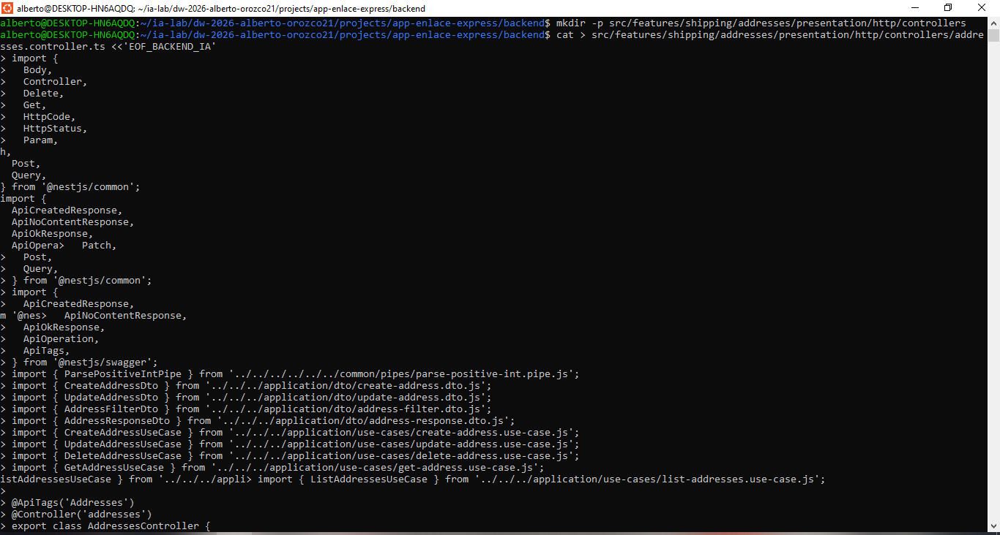

### 9.22 — features/shipping/addresses/index.ts

Barrel export del feature para imports limpios.

**Archivo:** `src/features/shipping/addresses/index.ts`

```bash
mkdir -p src/features/shipping/addresses
cat > src/features/shipping/addresses/index.ts <<'EOF_BACKEND_IA'
export { AddressesModule } from './addresses.module.js';
EOF_BACKEND_IA
```

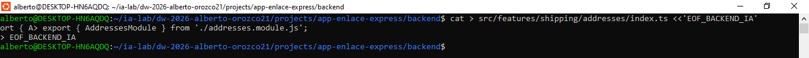

### 9.23 — features/shipping/addresses/addresses.module.ts

Módulo Nest del feature. Importa `CompaniesModule` para poder inyectar `COMPANY_REPOSITORY` y validar la FK.

**Archivo:** `src/features/shipping/addresses/addresses.module.ts`

```bash
mkdir -p src/features/shipping/addresses
cat > src/features/shipping/addresses/addresses.module.ts <<'EOF_BACKEND_IA'
import { Module } from '@nestjs/common';
import { CompaniesModule } from '../companies/companies.module.js';
import { ADDRESS_REPOSITORY } from './domain/interfaces/address-repository.interface.js';
import { AddressRepository } from './infrastructure/persistence/repositories/address.repository.js';
import { CreateAddressUseCase } from './application/use-cases/create-address.use-case.js';
import { UpdateAddressUseCase } from './application/use-cases/update-address.use-case.js';
import { DeleteAddressUseCase } from './application/use-cases/delete-address.use-case.js';
import { GetAddressUseCase } from './application/use-cases/get-address.use-case.js';
import { ListAddressesUseCase } from './application/use-cases/list-addresses.use-case.js';
import { AddressesController } from './presentation/http/controllers/addresses.controller.js';

@Module({
  imports: [CompaniesModule],
  controllers: [AddressesController],
  providers: [
    AddressRepository,
    { provide: ADDRESS_REPOSITORY, useExisting: AddressRepository },
    CreateAddressUseCase,
    UpdateAddressUseCase,
    DeleteAddressUseCase,
    GetAddressUseCase,
    ListAddressesUseCase,
  ],
  exports: [ADDRESS_REPOSITORY],
})
export class AddressesModule {}
EOF_BACKEND_IA
```

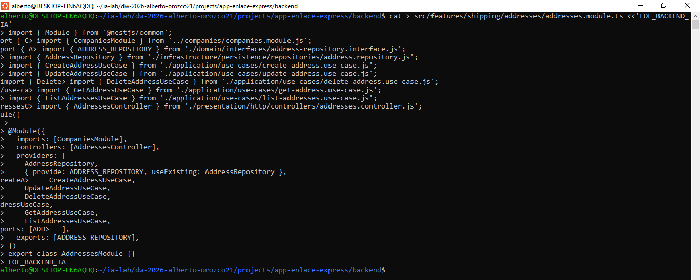

### 9.24 — Actualizar sequelize.factory.ts (registrar AddressModel)

Registra en ALL_MODELS solo los modelos ya creados (orden de dependencias).

**Archivo:** `src/infrastructure/database/sequelize/sequelize.factory.ts`

```bash
mkdir -p src/infrastructure/database/sequelize
cat > src/infrastructure/database/sequelize/sequelize.factory.ts <<'EOF_BACKEND_IA'
import { Sequelize } from 'sequelize-typescript';
import { DatabaseDialect } from '../../../config/environment/env.interface.js';
import { getSequelizeOptions } from './sequelize.options.js';

import { CompanyModel } from '../../../features/shipping/companies/infrastructure/persistence/models/company.model.js';
import { ContactModel } from '../../../features/shipping/contacts/infrastructure/persistence/models/contact.model.js';
import { AddressModel } from '../../../features/shipping/addresses/infrastructure/persistence/models/address.model.js';

export const ALL_MODELS = [
  CompanyModel,
  ContactModel,
  AddressModel,
];

async function loadDialectModule(moduleName: string): Promise<any> {
  // Proyecto ESM: require() no existe como global, se usa import() dinámico.
  const mod: any = await import(moduleName);
  return mod.default ?? mod;
}

export async function createSequelizeInstance(
  dialect: DatabaseDialect,
): Promise<Sequelize> {
  const options = getSequelizeOptions(dialect);

  let dialectModule: any;

  switch (dialect) {
    case DatabaseDialect.MySQL:
      dialectModule = await loadDialectModule('mysql2');
      break;
    case DatabaseDialect.Postgres:
      dialectModule = await loadDialectModule('pg');
      break;
    case DatabaseDialect.MSSQL:
      dialectModule = await loadDialectModule('tedious');
      break;
    case DatabaseDialect.Oracle:
      dialectModule = await loadDialectModule('oracledb');
      break;
    default:
      throw new Error(`Dialecto no soportado: ${dialect}`);
  }

  const sequelize = new Sequelize({
    ...options,
    dialectModule,
    models: ALL_MODELS,
  } as any);

  try {
    await sequelize.authenticate();
    console.log(`✅ Conexión exitosa a ${dialect.toUpperCase()}`);
  } catch (error: any) {
    console.error(
      `❌ Error conectando a ${dialect.toUpperCase()}:`,
      error.message,
    );
    throw error;
  }

  if (process.env.NODE_ENV !== 'production') {
    await sequelize.sync({ alter: false });
    console.log('✅ Tablas sincronizadas');
  }

  return sequelize;
}
EOF_BACKEND_IA
```

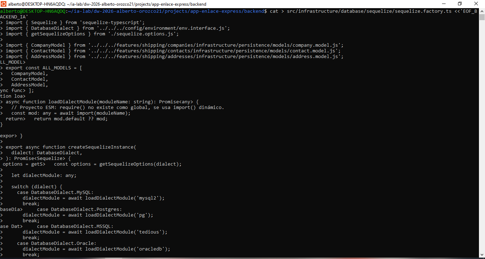

### 9.26 — Actualizar shipping.module.ts

Agrega el feature module de negocio recién terminado.

**Archivo:** `src/features/shipping/shipping.module.ts`

```bash
mkdir -p src/features/shipping
cat > src/features/shipping/shipping.module.ts <<'EOF_BACKEND_IA'
import { Module } from '@nestjs/common';
import { CompaniesModule } from './companies/companies.module.js';
import { ContactsModule } from './contacts/contacts.module.js';
import { AddressesModule } from './addresses/addresses.module.js';

@Module({
  imports: [CompaniesModule, ContactsModule, AddressesModule],
  exports: [CompaniesModule, ContactsModule, AddressesModule],
})
export class ShippingModule {}
EOF_BACKEND_IA
```

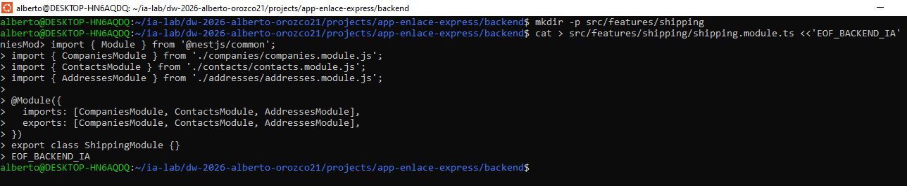

### 9.27 — Actualizar database-seeder.service.ts

Ejecuta seeders en orden de dependencias: empresas, luego contactos, luego direcciones.

**Archivo:** `src/infrastructure/database/seeders/database-seeder.service.ts`

```bash
mkdir -p src/infrastructure/database/seeders
cat > src/infrastructure/database/seeders/database-seeder.service.ts <<'EOF_BACKEND_IA'
import { Injectable, Logger, OnModuleInit } from '@nestjs/common';
import { seedCompanies } from '../../../features/shipping/companies/infrastructure/persistence/seeders/companies.seeder.js';
import { seedContacts } from '../../../features/shipping/contacts/infrastructure/persistence/seeders/contacts.seeder.js';
import { seedAddresses } from '../../../features/shipping/addresses/infrastructure/persistence/seeders/addresses.seeder.js';

/**
 * Ejecuta seeders en orden de dependencias.
 * Solo en entornos no productivos.
 */
@Injectable()
export class DatabaseSeederService implements OnModuleInit {
  private readonly logger = new Logger(DatabaseSeederService.name);

  async onModuleInit(): Promise<void> {
    if (process.env.NODE_ENV === 'production') {
      return;
    }

    try {
      await seedCompanies();
      await seedContacts();
      await seedAddresses();
      this.logger.log('✅ Seeders ejecutados');
    } catch (error: any) {
      this.logger.error(`❌ Error en seeders: ${error.message}`, error.stack);
      throw error;
    }
  }
}
EOF_BACKEND_IA
```

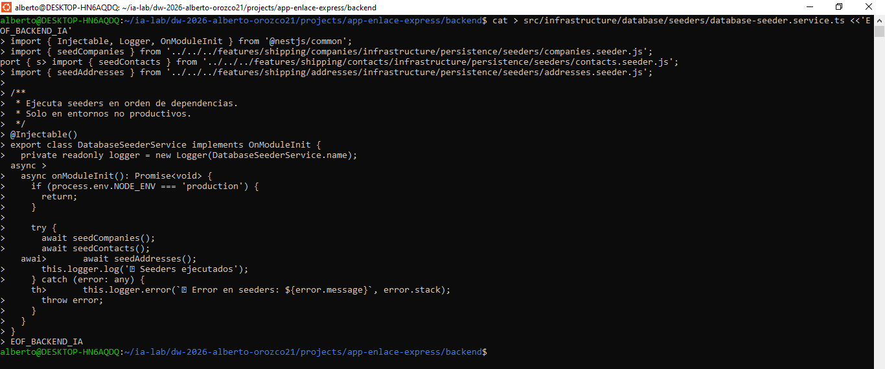

### 9.28 — Verificar tabla física `addresses` y API

`app.module.ts` **no necesita cambios**: ya importa `ShippingModule`, que ahora expone `CompaniesModule`, `ContactsModule` y `AddressesModule`.

Arranca la app. Debe crear/sync tabla `addresses` (con FK a `companies`), correr seeder y exponer `/api/addresses`. Prueba list/create en Swagger o curl, y confirma que `GET /api/addresses?companyId=1&type=recogida` filtra correctamente.

```bash
npm run start:dev
```

**Consola**

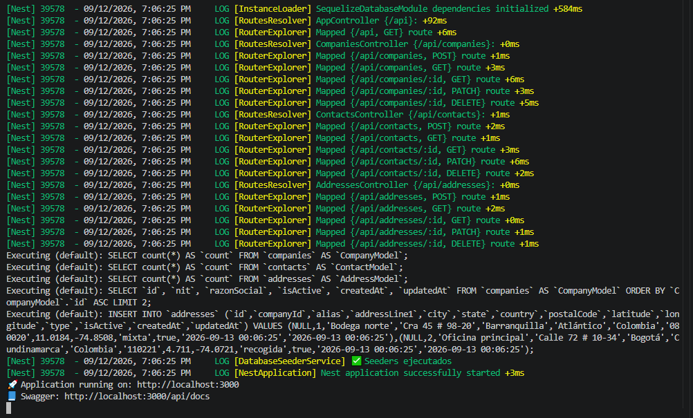

**/api/addresses**

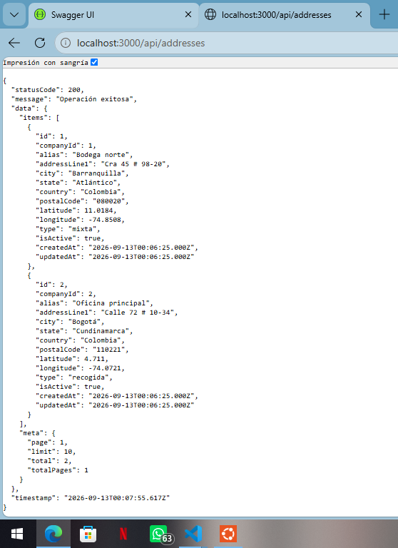

---------------------------------------------------------------

## FASE 10 — `09_BUSINESS_RATES`

### Business — Rates / Tarifa (patrón completo CA)

> **Objetivo de la fase:** Cuarta entidad de negocio de EnlaceExpress: Tarifa. A diferencia de Contacto/Direccion, **Tarifa es independiente** — no tiene FK hacia Empresa ni ninguna otra entidad — así que este feature no importa ningún otro módulo. Orden lógico: dominio → infraestructura → aplicación → presentación → módulo → cableado → verificación.

### 10.1 — features/shipping/rates/domain/enums/rate-calculation-rule.enum.ts

Enum de dominio propio del feature.

**Archivo:** `src/features/shipping/rates/domain/enums/rate-calculation-rule.enum.ts`

```bash
mkdir -p src/features/shipping/rates/domain/enums
cat > src/features/shipping/rates/domain/enums/rate-calculation-rule.enum.ts <<'EOF_BACKEND_IA'
export enum RateCalculationRule {
  BY_WEIGHT = 'por_peso',
  BY_ZONE = 'por_zona',
  FLAT = 'plana',
}
EOF_BACKEND_IA
```

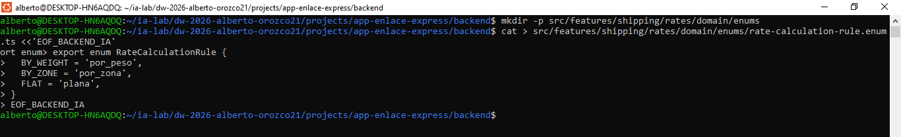

### 10.2 — features/shipping/rates/domain/entities/rate.entity.ts

Entidad de dominio. Regla: si `calculationRule` es `BY_ZONE`, `zone` es obligatorio. Si hay `validUntil`, debe ser posterior a `validFrom`.

**Archivo:** `src/features/shipping/rates/domain/entities/rate.entity.ts`

```bash
mkdir -p src/features/shipping/rates/domain/entities
cat > src/features/shipping/rates/domain/entities/rate.entity.ts <<'EOF_BACKEND_IA'
import { RateCalculationRule } from '../enums/rate-calculation-rule.enum.js';

export interface RateProps {
  id?: number;
  name: string;
  zone?: string;
  calculationRule: RateCalculationRule;
  baseValue: number;
  additionalValuePerKg?: number;
  urgentSurchargePct?: number;
  validFrom: Date;
  validUntil?: Date;
  isActive?: boolean;
  createdAt?: Date;
  updatedAt?: Date;
}

export class Rate {
  id?: number;
  name: string;
  zone?: string;
  calculationRule: RateCalculationRule;
  baseValue: number;
  additionalValuePerKg: number;
  urgentSurchargePct: number;
  validFrom: Date;
  validUntil?: Date;
  isActive: boolean;
  createdAt?: Date;
  updatedAt?: Date;

  private constructor(props: RateProps) {
    this.id = props.id;
    this.name = props.name;
    this.zone = props.zone;
    this.calculationRule = props.calculationRule;
    this.baseValue = props.baseValue;
    this.additionalValuePerKg = props.additionalValuePerKg ?? 0;
    this.urgentSurchargePct = props.urgentSurchargePct ?? 0;
    this.validFrom = props.validFrom;
    this.validUntil = props.validUntil;
    this.isActive = props.isActive ?? true;
    this.createdAt = props.createdAt;
    this.updatedAt = props.updatedAt;
  }

  private static validateBusinessRules(props: {
    zone?: string;
    calculationRule: RateCalculationRule;
    baseValue: number;
    additionalValuePerKg?: number;
    urgentSurchargePct?: number;
    validFrom: Date;
    validUntil?: Date;
  }): void {
    if (props.calculationRule === RateCalculationRule.BY_ZONE && !props.zone?.trim()) {
      throw new Error('La zona es requerida cuando la regla de cálculo es "por_zona"');
    }

    if (props.baseValue === undefined || props.baseValue < 0) {
      throw new Error('El valor base debe ser un número positivo');
    }

    if (props.additionalValuePerKg !== undefined && props.additionalValuePerKg < 0) {
      throw new Error('El valor por kg adicional no puede ser negativo');
    }

    if (props.urgentSurchargePct !== undefined && props.urgentSurchargePct < 0) {
      throw new Error('El recargo urgente no puede ser negativo');
    }

    if (props.validUntil && props.validUntil <= props.validFrom) {
      throw new Error('La fecha de fin de vigencia debe ser posterior a la de inicio');
    }
  }

  static create(
    props: Omit<RateProps, 'id' | 'isActive' | 'createdAt' | 'updatedAt'>,
  ): Rate {
    if (!props.name?.trim()) {
      throw new Error('El nombre de la tarifa es requerido');
    }

    Rate.validateBusinessRules(props);

    return new Rate(props);
  }

  static reconstitute(props: RateProps): Rate {
    return new Rate(props);
  }

  update(
    props: Partial<Omit<RateProps, 'id' | 'isActive' | 'createdAt' | 'updatedAt'>>,
  ): void {
    const next = {
      zone: props.zone !== undefined ? props.zone : this.zone,
      calculationRule: props.calculationRule ?? this.calculationRule,
      baseValue: props.baseValue ?? this.baseValue,
      additionalValuePerKg:
        props.additionalValuePerKg !== undefined
          ? props.additionalValuePerKg
          : this.additionalValuePerKg,
      urgentSurchargePct:
        props.urgentSurchargePct !== undefined
          ? props.urgentSurchargePct
          : this.urgentSurchargePct,
      validFrom: props.validFrom ?? this.validFrom,
      validUntil: props.validUntil !== undefined ? props.validUntil : this.validUntil,
    };

    if (props.name !== undefined && !props.name.trim()) {
      throw new Error('El nombre de la tarifa es requerido');
    }

    Rate.validateBusinessRules(next);

    if (props.name !== undefined) this.name = props.name;
    this.zone = next.zone;
    this.calculationRule = next.calculationRule;
    this.baseValue = next.baseValue;
    this.additionalValuePerKg = next.additionalValuePerKg;
    this.urgentSurchargePct = next.urgentSurchargePct;
    this.validFrom = next.validFrom;
    this.validUntil = next.validUntil;
  }

  deactivate(): void {
    this.isActive = false;
  }

  activate(): void {
    this.isActive = true;
  }
}
EOF_BACKEND_IA
```

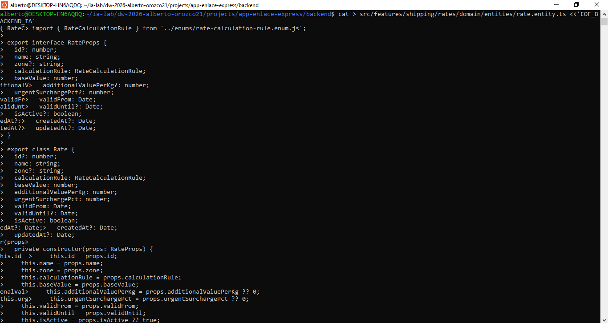

### 10.3 — features/shipping/rates/domain/exceptions/rate-not-found.exception.ts

Excepción de dominio. El caso de uso la lanza; el filter HTTP la traduce a status code.

**Archivo:** `src/features/shipping/rates/domain/exceptions/rate-not-found.exception.ts`

```bash
mkdir -p src/features/shipping/rates/domain/exceptions
cat > src/features/shipping/rates/domain/exceptions/rate-not-found.exception.ts <<'EOF_BACKEND_IA'
import { EntityNotFoundException } from '../../../../../common/exceptions/entity-not-found.exception.js';

export class RateNotFoundException extends EntityNotFoundException {
  constructor(id: number) {
    super('Tarifa', id);
  }
}
EOF_BACKEND_IA
```

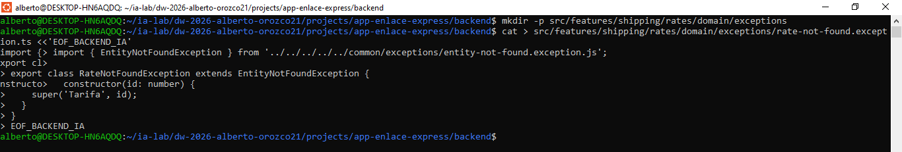

### 10.4 — features/shipping/rates/domain/interfaces/rate-repository.interface.ts

Puerto (contrato) del repositorio. Incluye `findCurrentByZone` para cuando la fase de Envio necesite cotizar.

**Archivo:** `src/features/shipping/rates/domain/interfaces/rate-repository.interface.ts`

```bash
mkdir -p src/features/shipping/rates/domain/interfaces
cat > src/features/shipping/rates/domain/interfaces/rate-repository.interface.ts <<'EOF_BACKEND_IA'
import { PaginatedResult } from '../../../../../common/interfaces/pagination.interface.js';
import { RateCalculationRule } from '../enums/rate-calculation-rule.enum.js';
import { Rate } from '../entities/rate.entity.js';

export const RATE_REPOSITORY = 'RATE_REPOSITORY';

export interface RateFindAllParams {
  page?: number;
  limit?: number;
  search?: string;
  calculationRule?: RateCalculationRule;
  zone?: string;
}

export interface IRateRepository {
  create(rate: Rate): Promise<Rate>;
  update(rate: Rate): Promise<Rate>;
  delete(id: number): Promise<void>;
  findById(id: number): Promise<Rate | null>;
  findAll(params: RateFindAllParams): Promise<PaginatedResult<Rate>>;
  /** Tarifa vigente para una zona en una fecha dada (usada luego por Envio). */
  findCurrentByZone(zone: string, date?: Date): Promise<Rate | null>;
}
EOF_BACKEND_IA
```

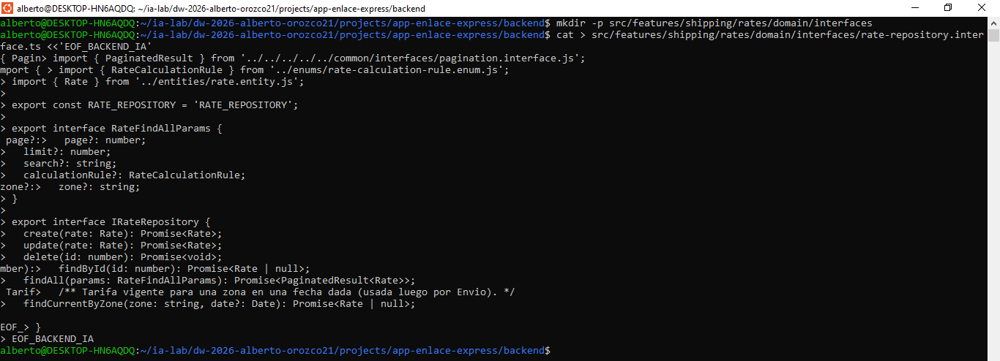

### 10.5 — features/shipping/rates/infrastructure/persistence/models/rate.model.ts

Modelo Sequelize (`@Table`). Sin asociaciones: Tarifa es independiente.

**Archivo:** `src/features/shipping/rates/infrastructure/persistence/models/rate.model.ts`

```bash
mkdir -p src/features/shipping/rates/infrastructure/persistence/models
cat > src/features/shipping/rates/infrastructure/persistence/models/rate.model.ts <<'EOF_BACKEND_IA'
import {
  AutoIncrement,
  Column,
  CreatedAt,
  DataType,
  Model,
  PrimaryKey,
  Table,
  UpdatedAt,
} from 'sequelize-typescript';
import { RateCalculationRule } from '../../../domain/enums/rate-calculation-rule.enum.js';

@Table({ tableName: 'rates' })
export class RateModel extends Model {
  @PrimaryKey
  @AutoIncrement
  @Column(DataType.INTEGER)
  declare id: number;

  @Column({ type: DataType.STRING(150), allowNull: false })
  declare name: string;

  @Column({ type: DataType.STRING(100), allowNull: true })
  declare zone: string | null;

  @Column({
    type: DataType.ENUM(...Object.values(RateCalculationRule)),
    allowNull: false,
  })
  declare calculationRule: RateCalculationRule;

  @Column({ type: DataType.DECIMAL(12, 2), allowNull: false })
  declare baseValue: number;

  @Column({ type: DataType.DECIMAL(12, 2), allowNull: false, defaultValue: 0 })
  declare additionalValuePerKg: number;

  @Column({ type: DataType.DECIMAL(5, 2), allowNull: false, defaultValue: 0 })
  declare urgentSurchargePct: number;

  @Column({ type: DataType.DATEONLY, allowNull: false })
  declare validFrom: string;

  @Column({ type: DataType.DATEONLY, allowNull: true })
  declare validUntil: string | null;

  @Column({ type: DataType.BOOLEAN, allowNull: false, defaultValue: true })
  declare isActive: boolean;

  @CreatedAt
  declare createdAt: Date;

  @UpdatedAt
  declare updatedAt: Date;
}
EOF_BACKEND_IA
```

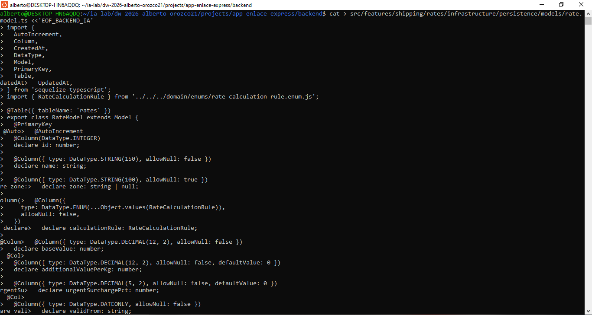

### 10.6 — features/shipping/rates/infrastructure/persistence/repositories/rate.repository.ts

Adaptador del repositorio: implementa el puerto de dominio con Sequelize.

**Archivo:** `src/features/shipping/rates/infrastructure/persistence/repositories/rate.repository.ts`

```bash
mkdir -p src/features/shipping/rates/infrastructure/persistence/repositories
cat > src/features/shipping/rates/infrastructure/persistence/repositories/rate.repository.ts <<'EOF_BACKEND_IA'
import { Injectable } from '@nestjs/common';
import { Op } from 'sequelize';
import {
  buildPaginatedResult,
  normalizePagination,
} from '../../../../../../common/utils/pagination.util.js';
import { Rate } from '../../../domain/entities/rate.entity.js';
import {
  RateFindAllParams,
  IRateRepository,
} from '../../../domain/interfaces/rate-repository.interface.js';
import { RateMapper } from '../../../application/mappers/rate.mapper.js';
import { RateModel } from '../models/rate.model.js';

@Injectable()
export class RateRepository implements IRateRepository {
  async create(rate: Rate): Promise<Rate> {
    const model = await RateModel.create(RateMapper.toPersistence(rate));
    return RateMapper.toDomain(model);
  }

  async update(rate: Rate): Promise<Rate> {
    await RateModel.update(RateMapper.toPersistence(rate), {
      where: { id: rate.id },
    });
    const updated = await RateModel.findByPk(rate.id!);
    return RateMapper.toDomain(updated!);
  }

  async delete(id: number): Promise<void> {
    await RateModel.destroy({ where: { id } });
  }

  async findById(id: number): Promise<Rate | null> {
    const model = await RateModel.findByPk(id);
    return model ? RateMapper.toDomain(model) : null;
  }

  async findAll(params: RateFindAllParams) {
    const { page, limit, offset } = normalizePagination(
      params.page,
      params.limit,
    );

    const where: Record<string, unknown> = {};

    if (params.calculationRule) {
      where.calculationRule = params.calculationRule;
    }

    if (params.zone) {
      where.zone = params.zone;
    }

    if (params.search) {
      where[Op.or as unknown as string] = [
        { name: { [Op.like]: `%${params.search}%` } },
        { zone: { [Op.like]: `%${params.search}%` } },
      ];
    }

    const { rows, count } = await RateModel.findAndCountAll({
      where,
      limit,
      offset,
      order: [['createdAt', 'DESC']],
    });

    return buildPaginatedResult(
      rows.map((row) => RateMapper.toDomain(row)),
      count,
      page,
      limit,
    );
  }

  async findCurrentByZone(zone: string, date: Date = new Date()): Promise<Rate | null> {
    const isoDate = date.toISOString().slice(0, 10);

    const model = await RateModel.findOne({
      where: {
        zone,
        isActive: true,
        validFrom: { [Op.lte]: isoDate },
        [Op.or]: [{ validUntil: null }, { validUntil: { [Op.gte]: isoDate } }],
      },
      order: [['validFrom', 'DESC']],
    });

    return model ? RateMapper.toDomain(model) : null;
  }
}
EOF_BACKEND_IA
```

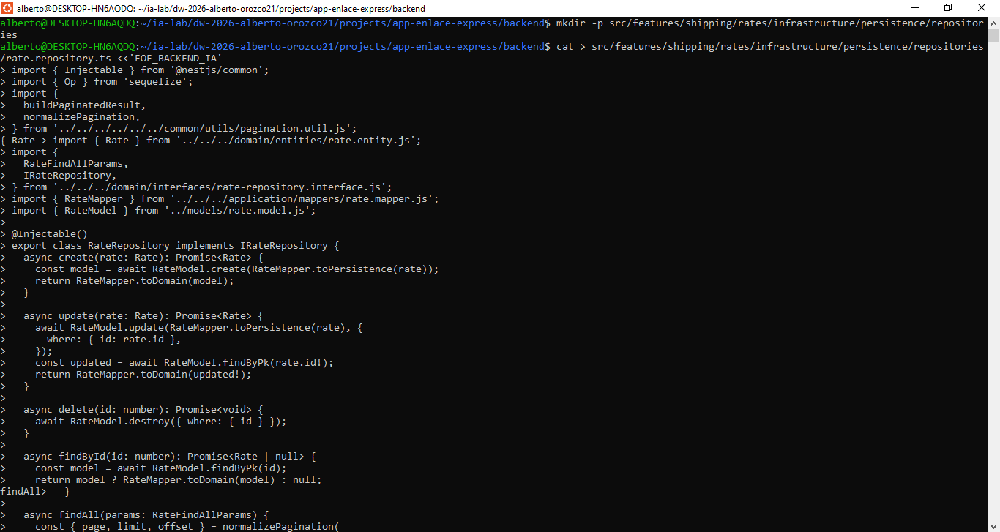

### 10.7 — features/shipping/rates/infrastructure/persistence/migrations/create-rates-table.migration.ts

Migración documental/auxiliar de la tabla. En dev el sync de Sequelize crea el esquema.

**Archivo:** `src/features/shipping/rates/infrastructure/persistence/migrations/create-rates-table.migration.ts`

```bash
mkdir -p src/features/shipping/rates/infrastructure/persistence/migrations
cat > src/features/shipping/rates/infrastructure/persistence/migrations/create-rates-table.migration.ts <<'EOF_BACKEND_IA'
export const createRatesTableMigration = {
  name: 'create-rates-table',
  async up(): Promise<void> {
    // Sequelize sync handles table creation in development.
    // Production: CREATE TABLE rates (id, name, zone, calculationRule, baseValue,
    //   additionalValuePerKg, urgentSurchargePct, validFrom, validUntil, isActive,
    //   createdAt, updatedAt)
  },
  async down(): Promise<void> {
    // Production: DROP TABLE rates
  },
};
EOF_BACKEND_IA
```

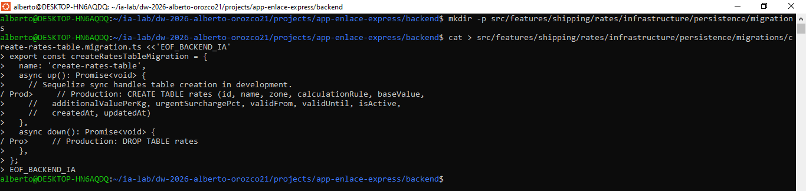

### 10.8 — features/shipping/rates/infrastructure/persistence/seeders/rates.seeder.ts

Seeder de datos iniciales. No depende de ninguna otra entidad.

**Archivo:** `src/features/shipping/rates/infrastructure/persistence/seeders/rates.seeder.ts`

```bash
mkdir -p src/features/shipping/rates/infrastructure/persistence/seeders
cat > src/features/shipping/rates/infrastructure/persistence/seeders/rates.seeder.ts <<'EOF_BACKEND_IA'
import { RateModel } from '../models/rate.model.js';
import { RateCalculationRule } from '../../../domain/enums/rate-calculation-rule.enum.js';

export async function seedRates(): Promise<void> {
  const count = await RateModel.count();
  if (count > 0) {
    return;
  }

  await RateModel.bulkCreate([
    {
      name: 'Tarifa zona Barranquilla',
      zone: 'Barranquilla',
      calculationRule: RateCalculationRule.BY_ZONE,
      baseValue: 12000,
      additionalValuePerKg: 800,
      urgentSurchargePct: 25,
      validFrom: '2026-01-01',
      validUntil: null,
      isActive: true,
    },
    {
      name: 'Tarifa por peso nacional',
      zone: null,
      calculationRule: RateCalculationRule.BY_WEIGHT,
      baseValue: 8000,
      additionalValuePerKg: 1200,
      urgentSurchargePct: 30,
      validFrom: '2026-01-01',
      validUntil: null,
      isActive: true,
    },
    {
      name: 'Tarifa plana mensajería local',
      zone: null,
      calculationRule: RateCalculationRule.FLAT,
      baseValue: 15000,
      additionalValuePerKg: 0,
      urgentSurchargePct: 20,
      validFrom: '2026-01-01',
      validUntil: null,
      isActive: true,
    },
  ]);
}
EOF_BACKEND_IA
```

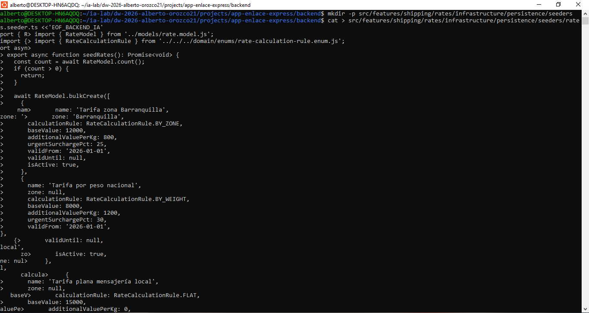

### 10.9 — features/shipping/rates/application/dto/rate-filter.dto.ts

DTO de entrada/salida HTTP con `class-validator` / Swagger.

**Archivo:** `src/features/shipping/rates/application/dto/rate-filter.dto.ts`

```bash
mkdir -p src/features/shipping/rates/application/dto
cat > src/features/shipping/rates/application/dto/rate-filter.dto.ts <<'EOF_BACKEND_IA'
import { ApiPropertyOptional } from '@nestjs/swagger';
import { Type } from 'class-transformer';
import {
  IsEnum,
  IsInt,
  IsOptional,
  IsPositive,
  IsString,
  Min,
} from 'class-validator';
import { RateCalculationRule } from '../../domain/enums/rate-calculation-rule.enum.js';

export class RateFilterDto {
  @ApiPropertyOptional({ example: 1, default: 1 })
  @IsOptional()
  @Type(() => Number)
  @IsInt()
  @Min(1)
  page?: number;

  @ApiPropertyOptional({ example: 10, default: 10 })
  @IsOptional()
  @Type(() => Number)
  @IsInt()
  @IsPositive()
  limit?: number;

  @ApiPropertyOptional({ example: 'zona norte' })
  @IsOptional()
  @IsString()
  search?: string;

  @ApiPropertyOptional({ enum: RateCalculationRule, example: RateCalculationRule.BY_ZONE })
  @IsOptional()
  @IsEnum(RateCalculationRule)
  calculationRule?: RateCalculationRule;

  @ApiPropertyOptional({ example: 'Barranquilla' })
  @IsOptional()
  @IsString()
  zone?: string;
}
EOF_BACKEND_IA
```

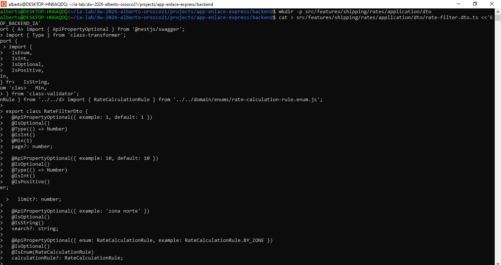

### 10.10 — features/shipping/rates/application/dto/rate-response.dto.ts

DTO de entrada/salida HTTP con `class-validator` / Swagger.

**Archivo:** `src/features/shipping/rates/application/dto/rate-response.dto.ts`

```bash
mkdir -p src/features/shipping/rates/application/dto
cat > src/features/shipping/rates/application/dto/rate-response.dto.ts <<'EOF_BACKEND_IA'
import { ApiProperty, ApiPropertyOptional } from '@nestjs/swagger';
import { RateCalculationRule } from '../../domain/enums/rate-calculation-rule.enum.js';

export class RateResponseDto {
  @ApiProperty({ example: 1 })
  id: number;

  @ApiProperty({ example: 'Tarifa zona Barranquilla' })
  name: string;

  @ApiPropertyOptional({ example: 'Barranquilla' })
  zone?: string;

  @ApiProperty({ enum: RateCalculationRule, example: RateCalculationRule.BY_ZONE })
  calculationRule: RateCalculationRule;

  @ApiProperty({ example: 12000 })
  baseValue: number;

  @ApiProperty({ example: 800 })
  additionalValuePerKg: number;

  @ApiProperty({ example: 25 })
  urgentSurchargePct: number;

  @ApiProperty({ example: '2026-01-01' })
  validFrom: Date;

  @ApiPropertyOptional({ example: '2026-12-31' })
  validUntil?: Date;

  @ApiProperty({ example: true })
  isActive: boolean;

  @ApiProperty()
  createdAt: Date;

  @ApiProperty()
  updatedAt: Date;
}
EOF_BACKEND_IA
```

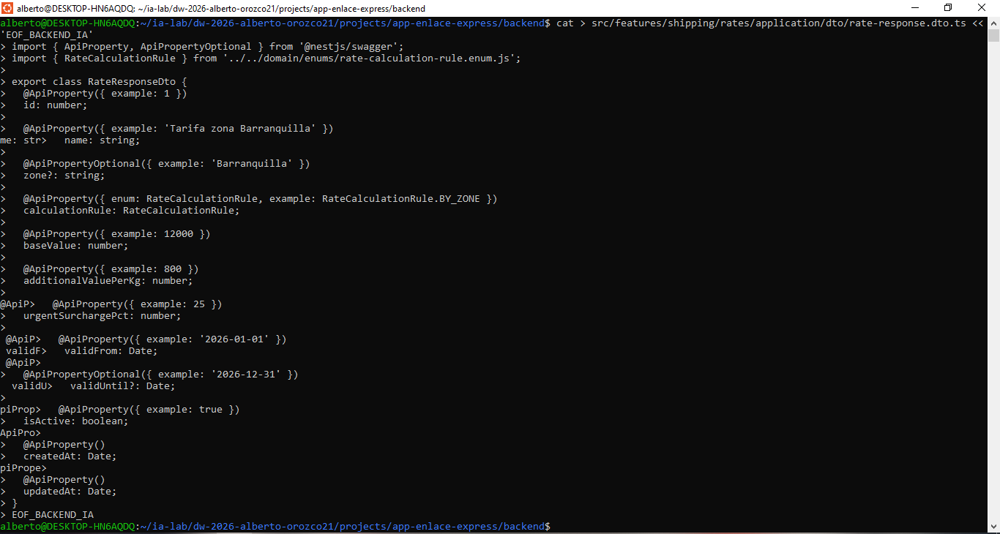

### 10.11 — features/shipping/rates/application/dto/create-rate.dto.ts

DTO de entrada/salida HTTP con `class-validator` / Swagger.

**Archivo:** `src/features/shipping/rates/application/dto/create-rate.dto.ts`

```bash
mkdir -p src/features/shipping/rates/application/dto
cat > src/features/shipping/rates/application/dto/create-rate.dto.ts <<'EOF_BACKEND_IA'
import { ApiProperty, ApiPropertyOptional } from '@nestjs/swagger';
import {
  IsDateString,
  IsEnum,
  IsNotEmpty,
  IsNumber,
  IsOptional,
  IsString,
  Min,
} from 'class-validator';
import { RateCalculationRule } from '../../domain/enums/rate-calculation-rule.enum.js';

export class CreateRateDto {
  @ApiProperty({ example: 'Tarifa zona Barranquilla' })
  @IsString()
  @IsNotEmpty()
  name: string;

  @ApiPropertyOptional({ example: 'Barranquilla' })
  @IsOptional()
  @IsString()
  zone?: string;

  @ApiProperty({ enum: RateCalculationRule, example: RateCalculationRule.BY_ZONE })
  @IsEnum(RateCalculationRule)
  calculationRule: RateCalculationRule;

  @ApiProperty({ example: 12000 })
  @IsNumber()
  @Min(0)
  baseValue: number;

  @ApiPropertyOptional({ example: 800, default: 0 })
  @IsOptional()
  @IsNumber()
  @Min(0)
  additionalValuePerKg?: number;

  @ApiPropertyOptional({ example: 25, default: 0 })
  @IsOptional()
  @IsNumber()
  @Min(0)
  urgentSurchargePct?: number;

  @ApiProperty({ example: '2026-01-01' })
  @IsDateString()
  validFrom: string;

  @ApiPropertyOptional({ example: '2026-12-31' })
  @IsOptional()
  @IsDateString()
  validUntil?: string;
}
EOF_BACKEND_IA
```

### 10.12 — features/shipping/rates/application/dto/update-rate.dto.ts

DTO de entrada/salida HTTP con `class-validator` / Swagger.

**Archivo:** `src/features/shipping/rates/application/dto/update-rate.dto.ts`

```bash
mkdir -p src/features/shipping/rates/application/dto
cat > src/features/shipping/rates/application/dto/update-rate.dto.ts <<'EOF_BACKEND_IA'
import { PartialType } from '@nestjs/mapped-types';
import { CreateRateDto } from './create-rate.dto.js';

export class UpdateRateDto extends PartialType(CreateRateDto) {}
EOF_BACKEND_IA
```

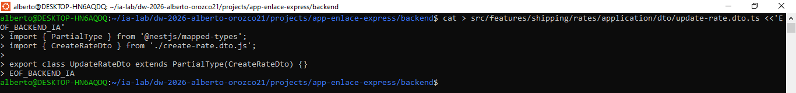

### 10.13 — features/shipping/rates/application/mappers/rate.mapper.ts

Mapper entre entidad de dominio y DTO de respuesta. Convierte los `DECIMAL`/`DATEONLY` de Sequelize (llegan como string) a `number`/`Date`.

**Archivo:** `src/features/shipping/rates/application/mappers/rate.mapper.ts`

```bash
mkdir -p src/features/shipping/rates/application/mappers
cat > src/features/shipping/rates/application/mappers/rate.mapper.ts <<'EOF_BACKEND_IA'
import { Rate } from '../../domain/entities/rate.entity.js';
import { RateResponseDto } from '../dto/rate-response.dto.js';
import { RateModel } from '../../infrastructure/persistence/models/rate.model.js';

export class RateMapper {
  static toDomain(model: RateModel): Rate {
    return Rate.reconstitute({
      id: model.id,
      name: model.name,
      zone: model.zone ?? undefined,
      calculationRule: model.calculationRule,
      baseValue: Number(model.baseValue),
      additionalValuePerKg: Number(model.additionalValuePerKg),
      urgentSurchargePct: Number(model.urgentSurchargePct),
      validFrom: new Date(model.validFrom),
      validUntil: model.validUntil ? new Date(model.validUntil) : undefined,
      isActive: model.isActive,
      createdAt: model.createdAt,
      updatedAt: model.updatedAt,
    });
  }

  static toResponse(entity: Rate): RateResponseDto {
    return {
      id: entity.id!,
      name: entity.name,
      zone: entity.zone,
      calculationRule: entity.calculationRule,
      baseValue: entity.baseValue,
      additionalValuePerKg: entity.additionalValuePerKg,
      urgentSurchargePct: entity.urgentSurchargePct,
      validFrom: entity.validFrom,
      validUntil: entity.validUntil,
      isActive: entity.isActive,
      createdAt: entity.createdAt!,
      updatedAt: entity.updatedAt!,
    };
  }

  static toPersistence(entity: Rate): Partial<RateModel> {
    return {
      id: entity.id,
      name: entity.name,
      zone: entity.zone ?? null,
      calculationRule: entity.calculationRule,
      baseValue: entity.baseValue,
      additionalValuePerKg: entity.additionalValuePerKg,
      urgentSurchargePct: entity.urgentSurchargePct,
      validFrom: entity.validFrom.toISOString().slice(0, 10) as any,
      validUntil: entity.validUntil
        ? (entity.validUntil.toISOString().slice(0, 10) as any)
        : null,
      isActive: entity.isActive ?? true,
    };
  }
}
EOF_BACKEND_IA
```

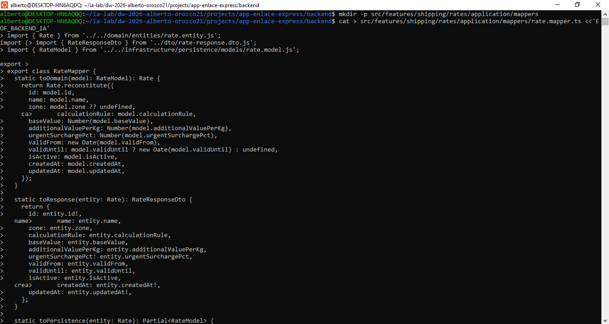

### 10.14 — features/shipping/rates/application/use-cases/create-rate.use-case.ts

Caso de uso (aplicación). No depende de otro feature: Tarifa es independiente.

**Archivo:** `src/features/shipping/rates/application/use-cases/create-rate.use-case.ts`

```bash
mkdir -p src/features/shipping/rates/application/use-cases
cat > src/features/shipping/rates/application/use-cases/create-rate.use-case.ts <<'EOF_BACKEND_IA'
import { Inject, Injectable } from '@nestjs/common';
import { Rate } from '../../domain/entities/rate.entity.js';
import {
  RATE_REPOSITORY,
  type IRateRepository,
} from '../../domain/interfaces/rate-repository.interface.js';
import { CreateRateDto } from '../dto/create-rate.dto.js';
import { RateMapper } from '../mappers/rate.mapper.js';

@Injectable()
export class CreateRateUseCase {
  constructor(
    @Inject(RATE_REPOSITORY)
    private readonly rateRepository: IRateRepository,
  ) {}

  async execute(dto: CreateRateDto) {
    const rate = Rate.create({
      name: dto.name,
      zone: dto.zone,
      calculationRule: dto.calculationRule,
      baseValue: dto.baseValue,
      additionalValuePerKg: dto.additionalValuePerKg,
      urgentSurchargePct: dto.urgentSurchargePct,
      validFrom: new Date(dto.validFrom),
      validUntil: dto.validUntil ? new Date(dto.validUntil) : undefined,
    });

    const created = await this.rateRepository.create(rate);
    return RateMapper.toResponse(created);
  }
}
EOF_BACKEND_IA
```

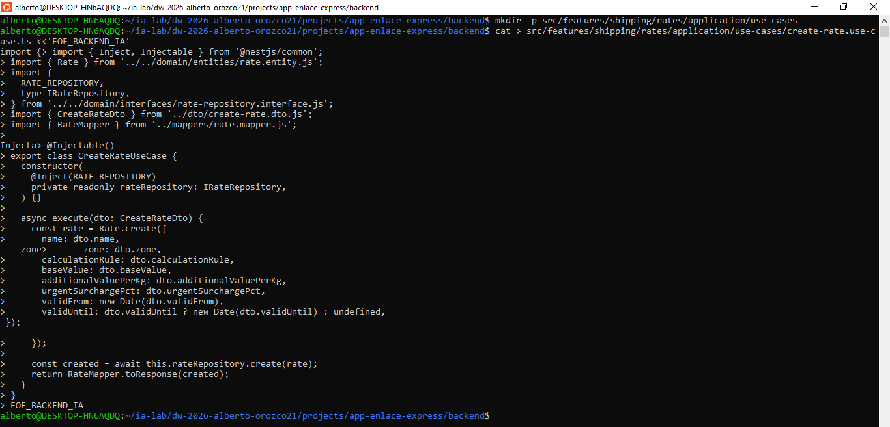

### 10.15 — features/shipping/rates/application/use-cases/delete-rate.use-case.ts

Caso de uso (aplicación). Orquesta dominio + repositorio. El controller solo lo invoca.

**Archivo:** `src/features/shipping/rates/application/use-cases/delete-rate.use-case.ts`

```bash
mkdir -p src/features/shipping/rates/application/use-cases
cat > src/features/shipping/rates/application/use-cases/delete-rate.use-case.ts <<'EOF_BACKEND_IA'
import { Inject, Injectable } from '@nestjs/common';
import { RateNotFoundException } from '../../domain/exceptions/rate-not-found.exception.js';
import {
  RATE_REPOSITORY,
  type IRateRepository,
} from '../../domain/interfaces/rate-repository.interface.js';

@Injectable()
export class DeleteRateUseCase {
  constructor(
    @Inject(RATE_REPOSITORY)
    private readonly rateRepository: IRateRepository,
  ) {}

  async execute(id: number): Promise<void> {
    const rate = await this.rateRepository.findById(id);
    if (!rate) {
      throw new RateNotFoundException(id);
    }

    await this.rateRepository.delete(id);
  }
}
EOF_BACKEND_IA
```

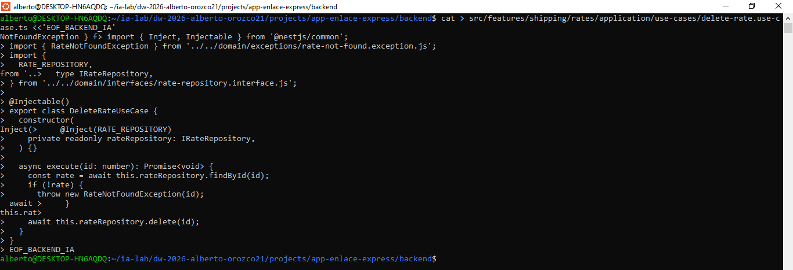

### 10.16 — features/shipping/rates/application/use-cases/get-rate.use-case.ts

Caso de uso (aplicación). Orquesta dominio + repositorio. El controller solo lo invoca.

**Archivo:** `src/features/shipping/rates/application/use-cases/get-rate.use-case.ts`

```bash
mkdir -p src/features/shipping/rates/application/use-cases
cat > src/features/shipping/rates/application/use-cases/get-rate.use-case.ts <<'EOF_BACKEND_IA'
import { Inject, Injectable } from '@nestjs/common';
import { RateNotFoundException } from '../../domain/exceptions/rate-not-found.exception.js';
import {
  RATE_REPOSITORY,
  type IRateRepository,
} from '../../domain/interfaces/rate-repository.interface.js';
import { RateMapper } from '../mappers/rate.mapper.js';

@Injectable()
export class GetRateUseCase {
  constructor(
    @Inject(RATE_REPOSITORY)
    private readonly rateRepository: IRateRepository,
  ) {}

  async execute(id: number) {
    const rate = await this.rateRepository.findById(id);
    if (!rate) {
      throw new RateNotFoundException(id);
    }

    return RateMapper.toResponse(rate);
  }
}
EOF_BACKEND_IA
```

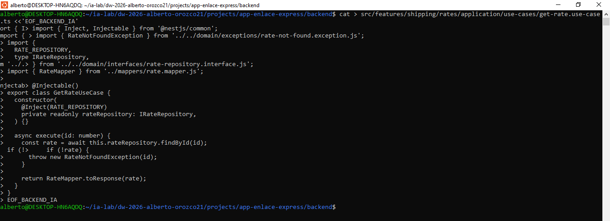

### 10.17 — features/shipping/rates/application/use-cases/list-rates.use-case.ts

Caso de uso (aplicación). Orquesta dominio + repositorio. El controller solo lo invoca.

**Archivo:** `src/features/shipping/rates/application/use-cases/list-rates.use-case.ts`

```bash
mkdir -p src/features/shipping/rates/application/use-cases
cat > src/features/shipping/rates/application/use-cases/list-rates.use-case.ts <<'EOF_BACKEND_IA'
import { Inject, Injectable } from '@nestjs/common';
import {
  RATE_REPOSITORY,
  type IRateRepository,
} from '../../domain/interfaces/rate-repository.interface.js';
import { RateFilterDto } from '../dto/rate-filter.dto.js';
import { RateMapper } from '../mappers/rate.mapper.js';

@Injectable()
export class ListRatesUseCase {
  constructor(
    @Inject(RATE_REPOSITORY)
    private readonly rateRepository: IRateRepository,
  ) {}

  async execute(filter: RateFilterDto) {
    const result = await this.rateRepository.findAll(filter);
    return {
      items: result.items.map((rate) => RateMapper.toResponse(rate)),
      meta: result.meta,
    };
  }
}
EOF_BACKEND_IA
```

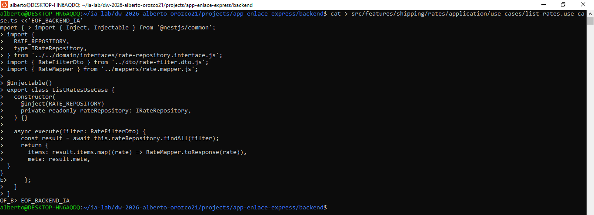

### 10.18 — features/shipping/rates/application/use-cases/update-rate.use-case.ts

Caso de uso (aplicación). Orquesta dominio + repositorio. El controller solo lo invoca.

**Archivo:** `src/features/shipping/rates/application/use-cases/update-rate.use-case.ts`

```bash
mkdir -p src/features/shipping/rates/application/use-cases
cat > src/features/shipping/rates/application/use-cases/update-rate.use-case.ts <<'EOF_BACKEND_IA'
import { Inject, Injectable } from '@nestjs/common';
import { RateNotFoundException } from '../../domain/exceptions/rate-not-found.exception.js';
import {
  RATE_REPOSITORY,
  type IRateRepository,
} from '../../domain/interfaces/rate-repository.interface.js';
import { UpdateRateDto } from '../dto/update-rate.dto.js';
import { RateMapper } from '../mappers/rate.mapper.js';

@Injectable()
export class UpdateRateUseCase {
  constructor(
    @Inject(RATE_REPOSITORY)
    private readonly rateRepository: IRateRepository,
  ) {}

  async execute(id: number, dto: UpdateRateDto) {
    const rate = await this.rateRepository.findById(id);
    if (!rate) {
      throw new RateNotFoundException(id);
    }

    rate.update({
      name: dto.name,
      zone: dto.zone,
      calculationRule: dto.calculationRule,
      baseValue: dto.baseValue,
      additionalValuePerKg: dto.additionalValuePerKg,
      urgentSurchargePct: dto.urgentSurchargePct,
      validFrom: dto.validFrom ? new Date(dto.validFrom) : undefined,
      validUntil: dto.validUntil ? new Date(dto.validUntil) : undefined,
    });

    const updated = await this.rateRepository.update(rate);
    return RateMapper.toResponse(updated);
  }
}
EOF_BACKEND_IA
```

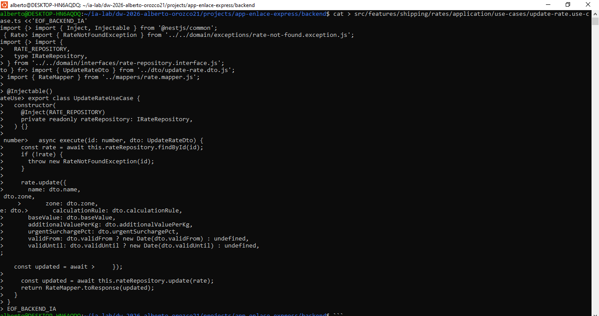

### 10.19 — features/shipping/rates/presentation/http/serializers/rate.serializer.ts

Serializer de presentación (forma estable de la respuesta HTTP).

**Archivo:** `src/features/shipping/rates/presentation/http/serializers/rate.serializer.ts`

```bash
mkdir -p src/features/shipping/rates/presentation/http/serializers
cat > src/features/shipping/rates/presentation/http/serializers/rate.serializer.ts <<'EOF_BACKEND_IA'
import { Rate } from '../../../domain/entities/rate.entity.js';
import { RateResponseDto } from '../../../application/dto/rate-response.dto.js';
import { RateMapper } from '../../../application/mappers/rate.mapper.js';

export class RateSerializer {
  static serialize(entity: Rate): RateResponseDto {
    return RateMapper.toResponse(entity);
  }
}
EOF_BACKEND_IA
```

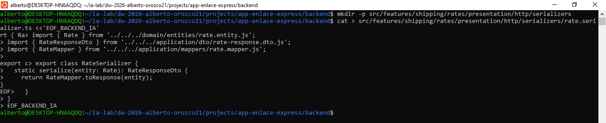

### 10.20 — features/shipping/rates/presentation/http/controllers/rates.controller.ts

Controller delgado: valida DTO, llama use-case, devuelve respuesta.

**Archivo:** `src/features/shipping/rates/presentation/http/controllers/rates.controller.ts`

```bash
mkdir -p src/features/shipping/rates/presentation/http/controllers
cat > src/features/shipping/rates/presentation/http/controllers/rates.controller.ts <<'EOF_BACKEND_IA'
import {
  Body,
  Controller,
  Delete,
  Get,
  HttpCode,
  HttpStatus,
  Param,
  Patch,
  Post,
  Query,
} from '@nestjs/common';
import {
  ApiCreatedResponse,
  ApiNoContentResponse,
  ApiOkResponse,
  ApiOperation,
  ApiTags,
} from '@nestjs/swagger';
import { ParsePositiveIntPipe } from '../../../../../../common/pipes/parse-positive-int.pipe.js';
import { CreateRateDto } from '../../../application/dto/create-rate.dto.js';
import { UpdateRateDto } from '../../../application/dto/update-rate.dto.js';
import { RateFilterDto } from '../../../application/dto/rate-filter.dto.js';
import { RateResponseDto } from '../../../application/dto/rate-response.dto.js';
import { CreateRateUseCase } from '../../../application/use-cases/create-rate.use-case.js';
import { UpdateRateUseCase } from '../../../application/use-cases/update-rate.use-case.js';
import { DeleteRateUseCase } from '../../../application/use-cases/delete-rate.use-case.js';
import { GetRateUseCase } from '../../../application/use-cases/get-rate.use-case.js';
import { ListRatesUseCase } from '../../../application/use-cases/list-rates.use-case.js';

@ApiTags('Rates')
@Controller('rates')
export class RatesController {
  constructor(
    private readonly createRateUseCase: CreateRateUseCase,
    private readonly updateRateUseCase: UpdateRateUseCase,
    private readonly deleteRateUseCase: DeleteRateUseCase,
    private readonly getRateUseCase: GetRateUseCase,
    private readonly listRatesUseCase: ListRatesUseCase,
  ) {}

  @Post()
  @ApiOperation({ summary: 'Crear una tarifa' })
  @ApiCreatedResponse({ type: RateResponseDto })
  create(@Body() dto: CreateRateDto) {
    return this.createRateUseCase.execute(dto);
  }

  @Get()
  @ApiOperation({ summary: 'Listar tarifas' })
  @ApiOkResponse({ type: [RateResponseDto] })
  findAll(@Query() filter: RateFilterDto) {
    return this.listRatesUseCase.execute(filter);
  }

  @Get(':id')
  @ApiOperation({ summary: 'Obtener una tarifa por ID' })
  @ApiOkResponse({ type: RateResponseDto })
  findOne(@Param('id', ParsePositiveIntPipe) id: number) {
    return this.getRateUseCase.execute(id);
  }

  @Patch(':id')
  @ApiOperation({ summary: 'Actualizar una tarifa' })
  @ApiOkResponse({ type: RateResponseDto })
  update(
    @Param('id', ParsePositiveIntPipe) id: number,
    @Body() dto: UpdateRateDto,
  ) {
    return this.updateRateUseCase.execute(id, dto);
  }

  @Delete(':id')
  @HttpCode(HttpStatus.NO_CONTENT)
  @ApiOperation({ summary: 'Eliminar una tarifa' })
  @ApiNoContentResponse()
  remove(@Param('id', ParsePositiveIntPipe) id: number) {
    return this.deleteRateUseCase.execute(id);
  }
}
EOF_BACKEND_IA
```

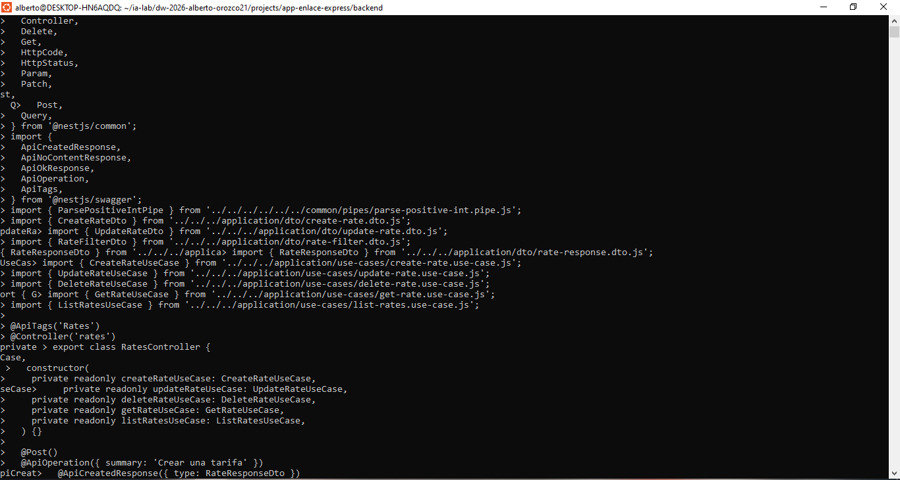

### 10.21 — features/shipping/rates/index.ts

Barrel export del feature para imports limpios.

**Archivo:** `src/features/shipping/rates/index.ts`

```bash
mkdir -p src/features/shipping/rates
cat > src/features/shipping/rates/index.ts <<'EOF_BACKEND_IA'
export { RatesModule } from './rates.module.js';
EOF_BACKEND_IA
```

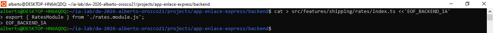

### 10.22 — features/shipping/rates/rates.module.ts

Módulo Nest del feature. No importa ningún otro módulo de negocio.

**Archivo:** `src/features/shipping/rates/rates.module.ts`

```bash
mkdir -p src/features/shipping/rates
cat > src/features/shipping/rates/rates.module.ts <<'EOF_BACKEND_IA'
import { Module } from '@nestjs/common';
import { RATE_REPOSITORY } from './domain/interfaces/rate-repository.interface.js';
import { RateRepository } from './infrastructure/persistence/repositories/rate.repository.js';
import { CreateRateUseCase } from './application/use-cases/create-rate.use-case.js';
import { UpdateRateUseCase } from './application/use-cases/update-rate.use-case.js';
import { DeleteRateUseCase } from './application/use-cases/delete-rate.use-case.js';
import { GetRateUseCase } from './application/use-cases/get-rate.use-case.js';
import { ListRatesUseCase } from './application/use-cases/list-rates.use-case.js';
import { RatesController } from './presentation/http/controllers/rates.controller.js';

@Module({
  controllers: [RatesController],
  providers: [
    RateRepository,
    { provide: RATE_REPOSITORY, useExisting: RateRepository },
    CreateRateUseCase,
    UpdateRateUseCase,
    DeleteRateUseCase,
    GetRateUseCase,
    ListRatesUseCase,
  ],
  exports: [RATE_REPOSITORY],
})
export class RatesModule {}
EOF_BACKEND_IA
```

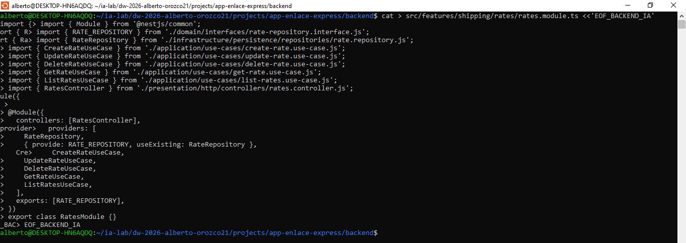

### 10.23 — Actualizar sequelize.factory.ts (registrar RateModel)

Registra en ALL_MODELS solo los modelos ya creados (orden de dependencias).

**Archivo:** `src/infrastructure/database/sequelize/sequelize.factory.ts`

```bash
mkdir -p src/infrastructure/database/sequelize
cat > src/infrastructure/database/sequelize/sequelize.factory.ts <<'EOF_BACKEND_IA'
import { Sequelize } from 'sequelize-typescript';
import { DatabaseDialect } from '../../../config/environment/env.interface.js';
import { getSequelizeOptions } from './sequelize.options.js';

import { CompanyModel } from '../../../features/shipping/companies/infrastructure/persistence/models/company.model.js';
import { ContactModel } from '../../../features/shipping/contacts/infrastructure/persistence/models/contact.model.js';
import { AddressModel } from '../../../features/shipping/addresses/infrastructure/persistence/models/address.model.js';
import { RateModel } from '../../../features/shipping/rates/infrastructure/persistence/models/rate.model.js';

export const ALL_MODELS = [
  CompanyModel,
  ContactModel,
  AddressModel,
  RateModel,
];

async function loadDialectModule(moduleName: string): Promise<any> {
  // Proyecto ESM: require() no existe como global, se usa import() dinámico.
  const mod: any = await import(moduleName);
  return mod.default ?? mod;
}

export async function createSequelizeInstance(
  dialect: DatabaseDialect,
): Promise<Sequelize> {
  const options = getSequelizeOptions(dialect);

  let dialectModule: any;

  switch (dialect) {
    case DatabaseDialect.MySQL:
      dialectModule = await loadDialectModule('mysql2');
      break;
    case DatabaseDialect.Postgres:
      dialectModule = await loadDialectModule('pg');
      break;
    case DatabaseDialect.MSSQL:
      dialectModule = await loadDialectModule('tedious');
      break;
    case DatabaseDialect.Oracle:
      dialectModule = await loadDialectModule('oracledb');
      break;
    default:
      throw new Error(`Dialecto no soportado: ${dialect}`);
  }

  const sequelize = new Sequelize({
    ...options,
    dialectModule,
    models: ALL_MODELS,
  } as any);

  try {
    await sequelize.authenticate();
    console.log(`✅ Conexión exitosa a ${dialect.toUpperCase()}`);
  } catch (error: any) {
    console.error(
      `❌ Error conectando a ${dialect.toUpperCase()}:`,
      error.message,
    );
    throw error;
  }

  if (process.env.NODE_ENV !== 'production') {
    await sequelize.sync({ alter: false });
    console.log('✅ Tablas sincronizadas');
  }

  return sequelize;
}
EOF_BACKEND_IA
```

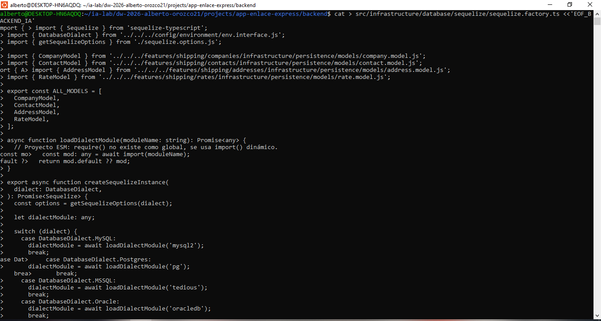

### 10.24 — Actualizar shipping.module.ts

Agrega el feature module de negocio recién terminado.

**Archivo:** `src/features/shipping/shipping.module.ts`

```bash
mkdir -p src/features/shipping
cat > src/features/shipping/shipping.module.ts <<'EOF_BACKEND_IA'
import { Module } from '@nestjs/common';
import { CompaniesModule } from './companies/companies.module.js';
import { ContactsModule } from './contacts/contacts.module.js';
import { AddressesModule } from './addresses/addresses.module.js';
import { RatesModule } from './rates/rates.module.js';

@Module({
  imports: [CompaniesModule, ContactsModule, AddressesModule, RatesModule],
  exports: [CompaniesModule, ContactsModule, AddressesModule, RatesModule],
})
export class ShippingModule {}
EOF_BACKEND_IA
```

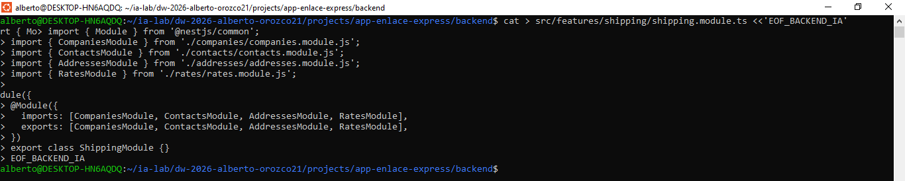

### 10.25 — Actualizar database-seeder.service.ts

Agrega `seedRates`. No depende de los seeders anteriores (Tarifa es independiente), pero se mantiene el orden general.

**Archivo:** `src/infrastructure/database/seeders/database-seeder.service.ts`

```bash
mkdir -p src/infrastructure/database/seeders
cat > src/infrastructure/database/seeders/database-seeder.service.ts <<'EOF_BACKEND_IA'
import { Injectable, Logger, OnModuleInit } from '@nestjs/common';
import { seedCompanies } from '../../../features/shipping/companies/infrastructure/persistence/seeders/companies.seeder.js';
import { seedContacts } from '../../../features/shipping/contacts/infrastructure/persistence/seeders/contacts.seeder.js';
import { seedAddresses } from '../../../features/shipping/addresses/infrastructure/persistence/seeders/addresses.seeder.js';
import { seedRates } from '../../../features/shipping/rates/infrastructure/persistence/seeders/rates.seeder.js';

/**
 * Ejecuta seeders en orden de dependencias.
 * Solo en entornos no productivos.
 */
@Injectable()
export class DatabaseSeederService implements OnModuleInit {
  private readonly logger = new Logger(DatabaseSeederService.name);

  async onModuleInit(): Promise<void> {
    if (process.env.NODE_ENV === 'production') {
      return;
    }

    try {
      await seedCompanies();
      await seedContacts();
      await seedAddresses();
      await seedRates();
      this.logger.log('✅ Seeders ejecutados');
    } catch (error: any) {
      this.logger.error(`❌ Error en seeders: ${error.message}`, error.stack);
      throw error;
    }
  }
}
EOF_BACKEND_IA
```

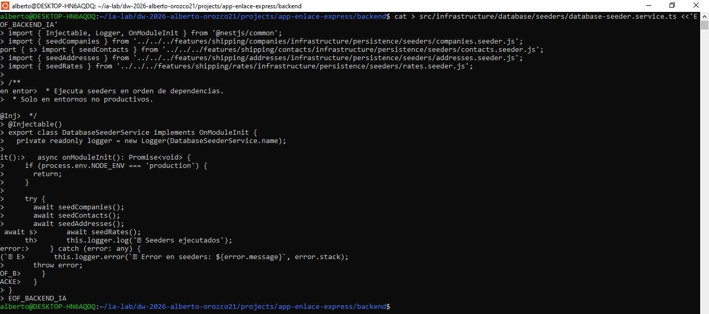

### 10.26 — Verificar tabla física `rates` y API

`app.module.ts` no necesita cambios: `ShippingModule` ya expone `RatesModule`.

Arranca la app. Debe crear/sync tabla `rates`, correr seeder y exponer `/api/rates`. Prueba list/create en Swagger o curl, y confirma que `GET /api/rates?calculationRule=por_zona` filtra correctamente.

```bash
npm run start:dev
```

**Consola**

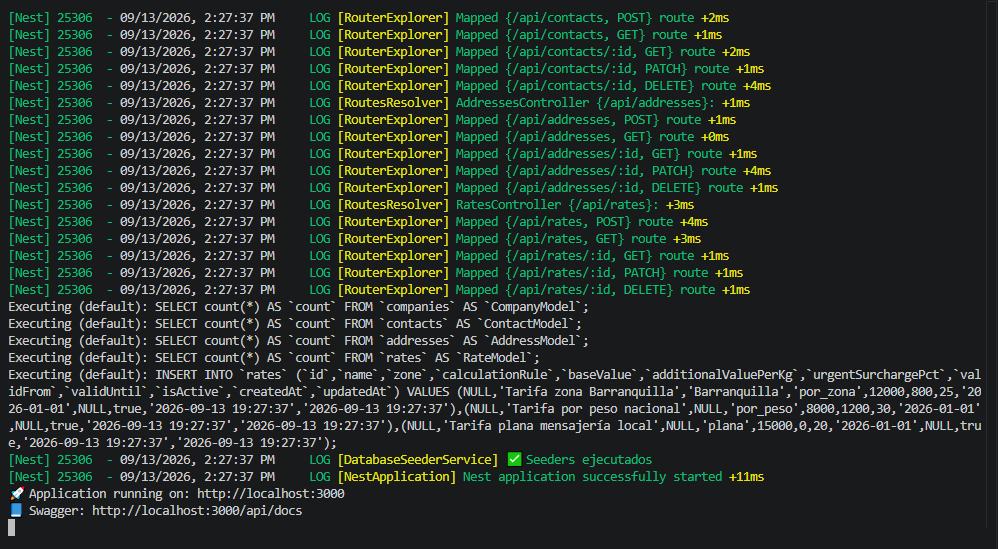


**/api/rates**

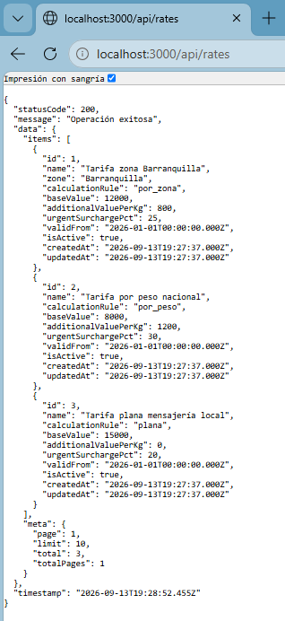

---------------------------------------------------------------

## FASE 11 — `10_BUSINESS_COURIERS`

### Business — Couriers / Mensajero (patrón completo CA)

> **Objetivo de la fase:** Quinta entidad de negocio de EnlaceExpress: Mensajero. Igual que Tarifa, **es independiente** — no tiene FK hacia otra entidad — pero sí introduce dos reglas de negocio nuevas: `documentoIdentidad` único (como el `nit` de Empresa) y `placaVehiculo` obligatoria solo si el vehículo es moto o carro. Orden lógico: dominio → infraestructura → aplicación → presentación → módulo → cableado → verificación.

#### 11.1 — features/shipping/couriers/domain/enums/vehicle-type.enum.ts

Enum de dominio propio del feature.

**Archivo:** `src/features/shipping/couriers/domain/enums/vehicle-type.enum.ts`

```bash
mkdir -p src/features/shipping/couriers/domain/enums
cat > src/features/shipping/couriers/domain/enums/vehicle-type.enum.ts <<'EOF_BACKEND_IA'
export enum VehicleType {
  MOTORCYCLE = 'moto',
  CAR = 'carro',
  BICYCLE = 'bicicleta',
  ON_FOOT = 'a_pie',
}
EOF_BACKEND_IA
```

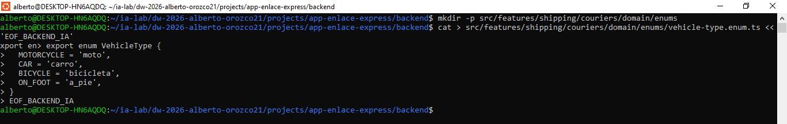

### 11.2 — features/shipping/couriers/domain/validators/courier-phone.validator.ts

Validador de dominio reutilizable (reglas independientes del framework HTTP).

**Archivo:** `src/features/shipping/couriers/domain/validators/courier-phone.validator.ts`

```bash
mkdir -p src/features/shipping/couriers/domain/validators
cat > src/features/shipping/couriers/domain/validators/courier-phone.validator.ts <<'EOF_BACKEND_IA'
export function isValidCourierPhone(phone: string): boolean {
  const phoneRegex = /^[+]?[\d\s()-]{7,20}$/;
  return phoneRegex.test(phone);
}
EOF_BACKEND_IA
```

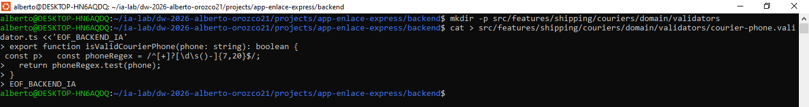

### 11.3 — features/shipping/couriers/domain/entities/courier.entity.ts

Entidad de dominio. Regla clave: `licensePlate` es obligatoria si `vehicleType` es `MOTORCYCLE` o `CAR`, y debe estar vacía si es `BICYCLE` o `ON_FOOT`.

**Archivo:** `src/features/shipping/couriers/domain/entities/courier.entity.ts`

```bash
mkdir -p src/features/shipping/couriers/domain/entities
cat > src/features/shipping/couriers/domain/entities/courier.entity.ts <<'EOF_BACKEND_IA'
import { VehicleType } from '../enums/vehicle-type.enum.js';
import { isValidCourierPhone } from '../validators/courier-phone.validator.js';

const PLATE_REQUIRED_TYPES = [VehicleType.MOTORCYCLE, VehicleType.CAR];

export interface CourierProps {
  id?: number;
  name: string;
  documentId: string;
  phone?: string;
  vehicleType: VehicleType;
  licensePlate?: string;
  assignedZone?: string;
  isActive?: boolean;
  createdAt?: Date;
  updatedAt?: Date;
}

export class Courier {
  id?: number;
  name: string;
  documentId: string;
  phone?: string;
  vehicleType: VehicleType;
  licensePlate?: string;
  assignedZone?: string;
  isActive: boolean;
  createdAt?: Date;
  updatedAt?: Date;

  private constructor(props: CourierProps) {
    this.id = props.id;
    this.name = props.name;
    this.documentId = props.documentId;
    this.phone = props.phone;
    this.vehicleType = props.vehicleType;
    this.licensePlate = props.licensePlate;
    this.assignedZone = props.assignedZone;
    this.isActive = props.isActive ?? true;
    this.createdAt = props.createdAt;
    this.updatedAt = props.updatedAt;
  }

  private static validatePlate(
    vehicleType: VehicleType,
    licensePlate?: string,
  ): void {
    const requiresPlate = PLATE_REQUIRED_TYPES.includes(vehicleType);

    if (requiresPlate && !licensePlate?.trim()) {
      throw new Error(
        `La placa es requerida para vehículos de tipo '${vehicleType}'`,
      );
    }

    if (!requiresPlate && licensePlate?.trim()) {
      throw new Error(
        `Los vehículos de tipo '${vehicleType}' no deben tener placa`,
      );
    }
  }

  static create(
    props: Omit<CourierProps, 'id' | 'isActive' | 'createdAt' | 'updatedAt'>,
  ): Courier {
    if (!props.name?.trim()) {
      throw new Error('El nombre del mensajero es requerido');
    }

    if (!props.documentId?.trim()) {
      throw new Error('El documento de identidad es requerido');
    }

    if (props.phone && !isValidCourierPhone(props.phone)) {
      throw new Error('El teléfono del mensajero no es válido');
    }

    Courier.validatePlate(props.vehicleType, props.licensePlate);

    return new Courier(props);
  }

  static reconstitute(props: CourierProps): Courier {
    return new Courier(props);
  }

  update(
    props: Partial<
      Omit<CourierProps, 'id' | 'documentId' | 'isActive' | 'createdAt' | 'updatedAt'>
    >,
  ): void {
    const nextVehicleType = props.vehicleType ?? this.vehicleType;
    const nextPlate =
      props.licensePlate !== undefined ? props.licensePlate : this.licensePlate;

    if (props.name !== undefined) {
      if (!props.name.trim()) {
        throw new Error('El nombre del mensajero es requerido');
      }
      this.name = props.name;
    }

    if (props.phone !== undefined) {
      if (props.phone && !isValidCourierPhone(props.phone)) {
        throw new Error('El teléfono del mensajero no es válido');
      }
      this.phone = props.phone;
    }

    if (props.vehicleType !== undefined || props.licensePlate !== undefined) {
      Courier.validatePlate(nextVehicleType, nextPlate);
      this.vehicleType = nextVehicleType;
      this.licensePlate = nextPlate;
    }

    if (props.assignedZone !== undefined) {
      this.assignedZone = props.assignedZone;
    }
  }

  deactivate(): void {
    this.isActive = false;
  }

  activate(): void {
    this.isActive = true;
  }
}
EOF_BACKEND_IA
```

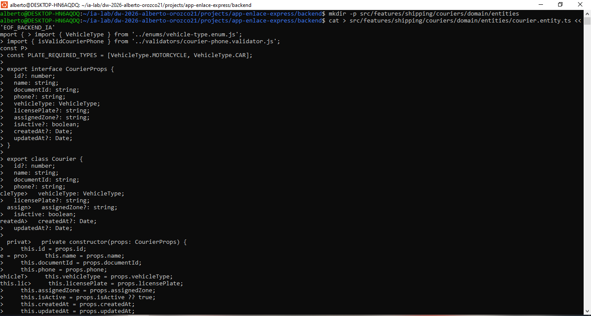

### 11.4 — features/shipping/couriers/domain/exceptions/courier-document-already-exists.exception.ts

Excepción de dominio. El caso de uso la lanza; el filter HTTP la traduce a status code.

**Archivo:** `src/features/shipping/couriers/domain/exceptions/courier-document-already-exists.exception.ts`

```bash
mkdir -p src/features/shipping/couriers/domain/exceptions
cat > src/features/shipping/couriers/domain/exceptions/courier-document-already-exists.exception.ts <<'EOF_BACKEND_IA'
import { DomainException } from '../../../../../common/exceptions/domain.exception.js';

export class CourierDocumentAlreadyExistsException extends DomainException {
  constructor(documentId: string) {
    super(`El documento de identidad '${documentId}' ya está registrado`);
  }
}
EOF_BACKEND_IA
```

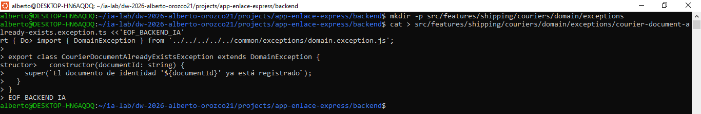

### 11.5 — features/shipping/couriers/domain/exceptions/courier-not-found.exception.ts

Excepción de dominio. El caso de uso la lanza; el filter HTTP la traduce a status code.

**Archivo:** `src/features/shipping/couriers/domain/exceptions/courier-not-found.exception.ts`

```bash
mkdir -p src/features/shipping/couriers/domain/exceptions
cat > src/features/shipping/couriers/domain/exceptions/courier-not-found.exception.ts <<'EOF_BACKEND_IA'
import { EntityNotFoundException } from '../../../../../common/exceptions/entity-not-found.exception.js';

export class CourierNotFoundException extends EntityNotFoundException {
  constructor(id: number) {
    super('Mensajero', id);
  }
}
EOF_BACKEND_IA
```

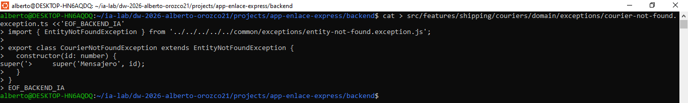

### 11.6 — features/shipping/couriers/domain/interfaces/courier-repository.interface.ts

Puerto (contrato) del repositorio. La aplicación depende de esta interface, no de Sequelize.

**Archivo:** `src/features/shipping/couriers/domain/interfaces/courier-repository.interface.ts`

```bash
mkdir -p src/features/shipping/couriers/domain/interfaces
cat > src/features/shipping/couriers/domain/interfaces/courier-repository.interface.ts <<'EOF_BACKEND_IA'
import { PaginatedResult } from '../../../../../common/interfaces/pagination.interface.js';
import { VehicleType } from '../enums/vehicle-type.enum.js';
import { Courier } from '../entities/courier.entity.js';

export const COURIER_REPOSITORY = 'COURIER_REPOSITORY';

export interface CourierFindAllParams {
  page?: number;
  limit?: number;
  search?: string;
  vehicleType?: VehicleType;
  assignedZone?: string;
}

export interface ICourierRepository {
  create(courier: Courier): Promise<Courier>;
  update(courier: Courier): Promise<Courier>;
  delete(id: number): Promise<void>;
  findById(id: number): Promise<Courier | null>;
  findByDocumentId(documentId: string): Promise<Courier | null>;
  findAll(params: CourierFindAllParams): Promise<PaginatedResult<Courier>>;
}
EOF_BACKEND_IA
```

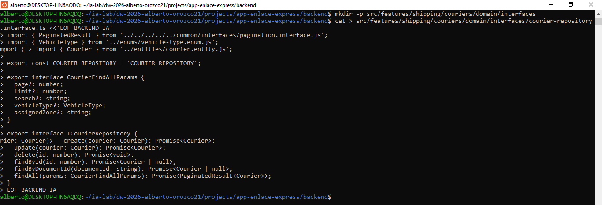

### 11.7 — features/shipping/couriers/infrastructure/persistence/models/courier.model.ts

Modelo Sequelize (`@Table`). Sin asociaciones propias todavía: `Ruta` (fase 12) es la que va a apuntar hacia acá.

**Archivo:** `src/features/shipping/couriers/infrastructure/persistence/models/courier.model.ts`

```bash
mkdir -p src/features/shipping/couriers/infrastructure/persistence/models
cat > src/features/shipping/couriers/infrastructure/persistence/models/courier.model.ts <<'EOF_BACKEND_IA'
import {
  AutoIncrement,
  Column,
  CreatedAt,
  DataType,
  Model,
  PrimaryKey,
  Table,
  UpdatedAt,
} from 'sequelize-typescript';
import { VehicleType } from '../../../domain/enums/vehicle-type.enum.js';

@Table({ tableName: 'couriers' })
export class CourierModel extends Model {
  @PrimaryKey
  @AutoIncrement
  @Column(DataType.INTEGER)
  declare id: number;

  @Column({ type: DataType.STRING(150), allowNull: false })
  declare name: string;

  @Column({ type: DataType.STRING(30), allowNull: false, unique: true })
  declare documentId: string;

  @Column({ type: DataType.STRING(30), allowNull: true })
  declare phone: string | null;

  @Column({
    type: DataType.ENUM(...Object.values(VehicleType)),
    allowNull: false,
  })
  declare vehicleType: VehicleType;

  @Column({ type: DataType.STRING(15), allowNull: true })
  declare licensePlate: string | null;

  @Column({ type: DataType.STRING(100), allowNull: true })
  declare assignedZone: string | null;

  @Column({ type: DataType.BOOLEAN, allowNull: false, defaultValue: true })
  declare isActive: boolean;

  @CreatedAt
  declare createdAt: Date;

  @UpdatedAt
  declare updatedAt: Date;

  // routes se agrega en fase 12 (Ruta), con import estático normal.
}
EOF_BACKEND_IA
```

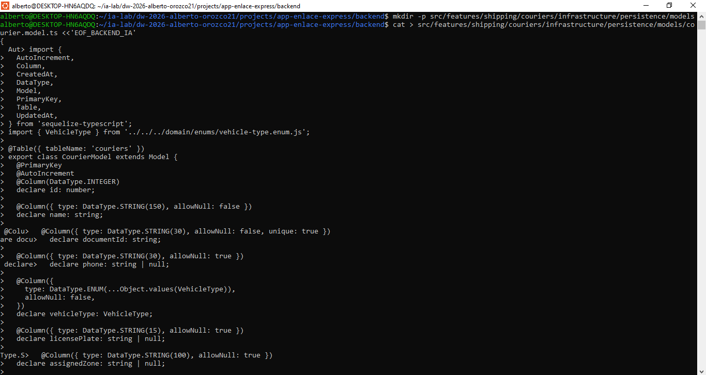

### 11.8 — features/shipping/couriers/infrastructure/persistence/repositories/courier.repository.ts

Adaptador del repositorio: implementa el puerto de dominio con Sequelize.

**Archivo:** `src/features/shipping/couriers/infrastructure/persistence/repositories/courier.repository.ts`

```bash
mkdir -p src/features/shipping/couriers/infrastructure/persistence/repositories
cat > src/features/shipping/couriers/infrastructure/persistence/repositories/courier.repository.ts <<'EOF_BACKEND_IA'
import { Injectable } from '@nestjs/common';
import { Op } from 'sequelize';
import {
  buildPaginatedResult,
  normalizePagination,
} from '../../../../../../common/utils/pagination.util.js';
import { Courier } from '../../../domain/entities/courier.entity.js';
import {
  CourierFindAllParams,
  ICourierRepository,
} from '../../../domain/interfaces/courier-repository.interface.js';
import { CourierMapper } from '../../../application/mappers/courier.mapper.js';
import { CourierModel } from '../models/courier.model.js';

@Injectable()
export class CourierRepository implements ICourierRepository {
  async create(courier: Courier): Promise<Courier> {
    const model = await CourierModel.create(
      CourierMapper.toPersistence(courier),
    );
    return CourierMapper.toDomain(model);
  }

  async update(courier: Courier): Promise<Courier> {
    await CourierModel.update(CourierMapper.toPersistence(courier), {
      where: { id: courier.id },
    });
    const updated = await CourierModel.findByPk(courier.id!);
    return CourierMapper.toDomain(updated!);
  }

  async delete(id: number): Promise<void> {
    await CourierModel.destroy({ where: { id } });
  }

  async findById(id: number): Promise<Courier | null> {
    const model = await CourierModel.findByPk(id);
    return model ? CourierMapper.toDomain(model) : null;
  }

  async findByDocumentId(documentId: string): Promise<Courier | null> {
    const model = await CourierModel.findOne({ where: { documentId } });
    return model ? CourierMapper.toDomain(model) : null;
  }

  async findAll(params: CourierFindAllParams) {
    const { page, limit, offset } = normalizePagination(
      params.page,
      params.limit,
    );

    const where: Record<string, unknown> = {};

    if (params.vehicleType) {
      where.vehicleType = params.vehicleType;
    }

    if (params.assignedZone) {
      where.assignedZone = params.assignedZone;
    }

    if (params.search) {
      where[Op.or as unknown as string] = [
        { name: { [Op.like]: `%${params.search}%` } },
        { documentId: { [Op.like]: `%${params.search}%` } },
      ];
    }

    const { rows, count } = await CourierModel.findAndCountAll({
      where,
      limit,
      offset,
      order: [['createdAt', 'DESC']],
    });

    return buildPaginatedResult(
      rows.map((row) => CourierMapper.toDomain(row)),
      count,
      page,
      limit,
    );
  }
}
EOF_BACKEND_IA
```

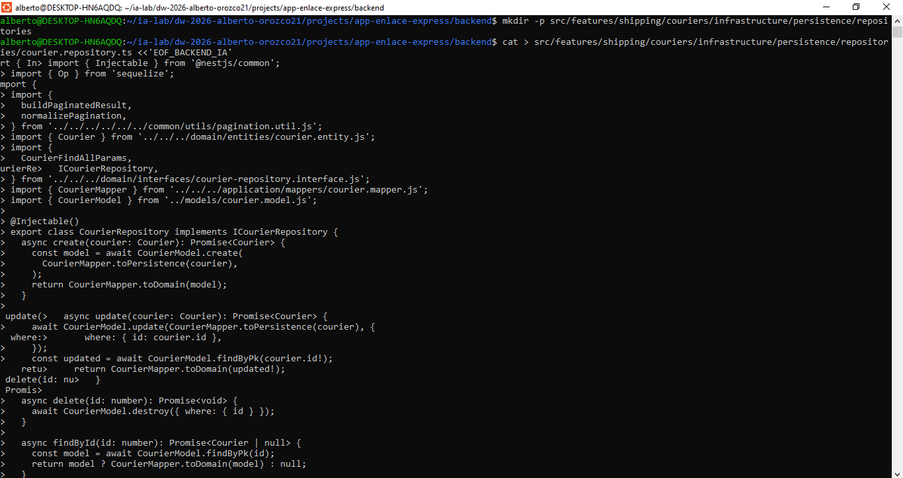

#### 11.9 — features/shipping/couriers/infrastructure/persistence/migrations/create-couriers-table.migration.ts

Migración documental/auxiliar de la tabla. En dev el sync de Sequelize crea el esquema.

**Archivo:** `src/features/shipping/couriers/infrastructure/persistence/migrations/create-couriers-table.migration.ts`

```bash
mkdir -p src/features/shipping/couriers/infrastructure/persistence/migrations
cat > src/features/shipping/couriers/infrastructure/persistence/migrations/create-couriers-table.migration.ts <<'EOF_BACKEND_IA'
export const createCouriersTableMigration = {
  name: 'create-couriers-table',
  async up(): Promise<void> {
    // Sequelize sync handles table creation in development.
    // Production: CREATE TABLE couriers (id, name, documentId UQ, phone, vehicleType,
    //   licensePlate, assignedZone, isActive, createdAt, updatedAt)
  },
  async down(): Promise<void> {
    // Production: DROP TABLE couriers
  },
};
EOF_BACKEND_IA
```

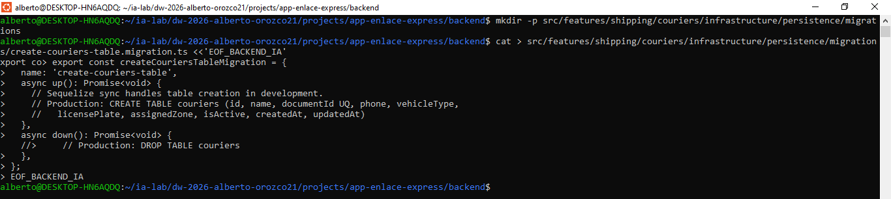

### 11.10 — features/shipping/couriers/infrastructure/persistence/seeders/couriers.seeder.ts

Seeder de datos iniciales. No depende de ninguna otra entidad.

**Archivo:** `src/features/shipping/couriers/infrastructure/persistence/seeders/couriers.seeder.ts`

```bash
mkdir -p src/features/shipping/couriers/infrastructure/persistence/seeders
cat > src/features/shipping/couriers/infrastructure/persistence/seeders/couriers.seeder.ts <<'EOF_BACKEND_IA'
import { CourierModel } from '../models/courier.model.js';
import { VehicleType } from '../../../domain/enums/vehicle-type.enum.js';

export async function seedCouriers(): Promise<void> {
  const count = await CourierModel.count();
  if (count > 0) {
    return;
  }

  await CourierModel.bulkCreate([
    {
      name: 'Jorge Martínez',
      documentId: '1042567890',
      phone: '+57 300 1112233',
      vehicleType: VehicleType.MOTORCYCLE,
      licensePlate: 'ABC12D',
      assignedZone: 'Barranquilla Norte',
      isActive: true,
    },
    {
      name: 'Andrea Torres',
      documentId: '1098765432',
      phone: '+57 312 4445566',
      vehicleType: VehicleType.BICYCLE,
      licensePlate: null,
      assignedZone: 'Barranquilla Centro',
      isActive: true,
    },
  ]);
}
EOF_BACKEND_IA
```

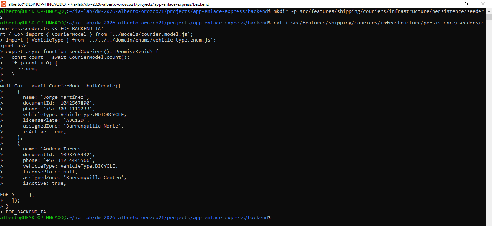

### 11.11 — features/shipping/couriers/application/dto/courier-filter.dto.ts

DTO de entrada/salida HTTP con `class-validator` / Swagger.

**Archivo:** `src/features/shipping/couriers/application/dto/courier-filter.dto.ts`

```bash
mkdir -p src/features/shipping/couriers/application/dto
cat > src/features/shipping/couriers/application/dto/courier-filter.dto.ts <<'EOF_BACKEND_IA'
import { ApiPropertyOptional } from '@nestjs/swagger';
import { Type } from 'class-transformer';
import {
  IsEnum,
  IsInt,
  IsOptional,
  IsPositive,
  IsString,
  Min,
} from 'class-validator';
import { VehicleType } from '../../domain/enums/vehicle-type.enum.js';

export class CourierFilterDto {
  @ApiPropertyOptional({ example: 1, default: 1 })
  @IsOptional()
  @Type(() => Number)
  @IsInt()
  @Min(1)
  page?: number;

  @ApiPropertyOptional({ example: 10, default: 10 })
  @IsOptional()
  @Type(() => Number)
  @IsInt()
  @IsPositive()
  limit?: number;

  @ApiPropertyOptional({ example: 'jorge' })
  @IsOptional()
  @IsString()
  search?: string;

  @ApiPropertyOptional({ enum: VehicleType, example: VehicleType.MOTORCYCLE })
  @IsOptional()
  @IsEnum(VehicleType)
  vehicleType?: VehicleType;

  @ApiPropertyOptional({ example: 'Barranquilla Norte' })
  @IsOptional()
  @IsString()
  assignedZone?: string;
}
EOF_BACKEND_IA
```

### 11.12 — features/shipping/couriers/application/dto/courier-response.dto.ts

DTO de entrada/salida HTTP con `class-validator` / Swagger.

**Archivo:** `src/features/shipping/couriers/application/dto/courier-response.dto.ts`

```bash
mkdir -p src/features/shipping/couriers/application/dto
cat > src/features/shipping/couriers/application/dto/courier-response.dto.ts <<'EOF_BACKEND_IA'
import { ApiProperty, ApiPropertyOptional } from '@nestjs/swagger';
import { VehicleType } from '../../domain/enums/vehicle-type.enum.js';

export class CourierResponseDto {
  @ApiProperty({ example: 1 })
  id: number;

  @ApiProperty({ example: 'Jorge Martínez' })
  name: string;

  @ApiProperty({ example: '1042567890' })
  documentId: string;

  @ApiPropertyOptional({ example: '+57 300 1112233' })
  phone?: string;

  @ApiProperty({ enum: VehicleType, example: VehicleType.MOTORCYCLE })
  vehicleType: VehicleType;

  @ApiPropertyOptional({ example: 'ABC12D' })
  licensePlate?: string;

  @ApiPropertyOptional({ example: 'Barranquilla Norte' })
  assignedZone?: string;

  @ApiProperty({ example: true })
  isActive: boolean;

  @ApiProperty()
  createdAt: Date;

  @ApiProperty()
  updatedAt: Date;
}
EOF_BACKEND_IA
```

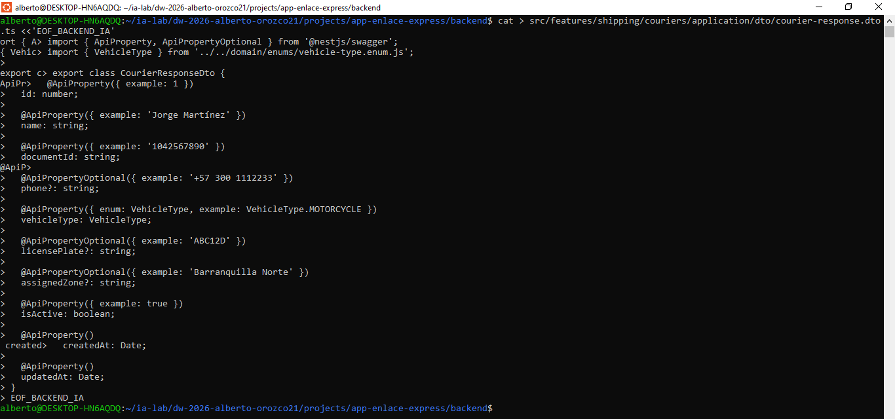

### 11.13 — features/shipping/couriers/application/dto/create-courier.dto.ts

DTO de entrada/salida HTTP con `class-validator` / Swagger.

**Archivo:** `src/features/shipping/couriers/application/dto/create-courier.dto.ts`

```bash
mkdir -p src/features/shipping/couriers/application/dto
cat > src/features/shipping/couriers/application/dto/create-courier.dto.ts <<'EOF_BACKEND_IA'
import { ApiProperty, ApiPropertyOptional } from '@nestjs/swagger';
import {
  IsEnum,
  IsNotEmpty,
  IsOptional,
  IsString,
  MaxLength,
} from 'class-validator';
import { VehicleType } from '../../domain/enums/vehicle-type.enum.js';

export class CreateCourierDto {
  @ApiProperty({ example: 'Jorge Martínez' })
  @IsString()
  @IsNotEmpty()
  @MaxLength(150)
  name: string;

  @ApiProperty({ example: '1042567890' })
  @IsString()
  @IsNotEmpty()
  @MaxLength(30)
  documentId: string;

  @ApiPropertyOptional({ example: '+57 300 1112233' })
  @IsOptional()
  @IsString()
  @MaxLength(30)
  phone?: string;

  @ApiProperty({ enum: VehicleType, example: VehicleType.MOTORCYCLE })
  @IsEnum(VehicleType)
  vehicleType: VehicleType;

  @ApiPropertyOptional({ example: 'ABC12D' })
  @IsOptional()
  @IsString()
  @MaxLength(15)
  licensePlate?: string;

  @ApiPropertyOptional({ example: 'Barranquilla Norte' })
  @IsOptional()
  @IsString()
  @MaxLength(100)
  assignedZone?: string;
}
EOF_BACKEND_IA
```

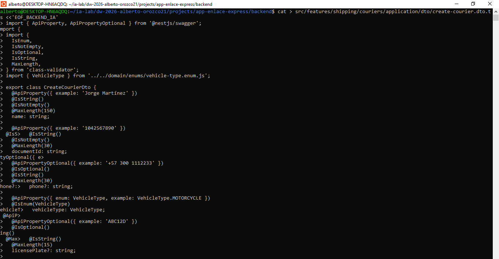

### 11.14 — features/shipping/couriers/application/dto/update-courier.dto.ts

DTO de actualización. `documentId` se excluye a propósito: el documento de identidad no cambia.

**Archivo:** `src/features/shipping/couriers/application/dto/update-courier.dto.ts`

```bash
mkdir -p src/features/shipping/couriers/application/dto
cat > src/features/shipping/couriers/application/dto/update-courier.dto.ts <<'EOF_BACKEND_IA'
import { OmitType, PartialType } from '@nestjs/mapped-types';
import { CreateCourierDto } from './create-courier.dto.js';

export class UpdateCourierDto extends PartialType(
  OmitType(CreateCourierDto, ['documentId'] as const),
) {}
EOF_BACKEND_IA
```

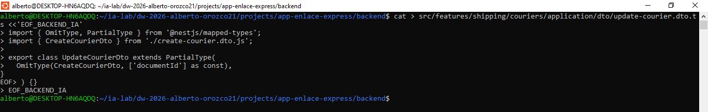

### 11.15 — features/shipping/couriers/application/mappers/courier.mapper.ts

Mapper entre entidad de dominio y DTO de respuesta.

**Archivo:** `src/features/shipping/couriers/application/mappers/courier.mapper.ts`

```bash
mkdir -p src/features/shipping/couriers/application/mappers
cat > src/features/shipping/couriers/application/mappers/courier.mapper.ts <<'EOF_BACKEND_IA'
import { Courier } from '../../domain/entities/courier.entity.js';
import { CourierResponseDto } from '../dto/courier-response.dto.js';
import { CourierModel } from '../../infrastructure/persistence/models/courier.model.js';

export class CourierMapper {
  static toDomain(model: CourierModel): Courier {
    return Courier.reconstitute({
      id: model.id,
      name: model.name,
      documentId: model.documentId,
      phone: model.phone ?? undefined,
      vehicleType: model.vehicleType,
      licensePlate: model.licensePlate ?? undefined,
      assignedZone: model.assignedZone ?? undefined,
      isActive: model.isActive,
      createdAt: model.createdAt,
      updatedAt: model.updatedAt,
    });
  }

  static toResponse(entity: Courier): CourierResponseDto {
    return {
      id: entity.id!,
      name: entity.name,
      documentId: entity.documentId,
      phone: entity.phone,
      vehicleType: entity.vehicleType,
      licensePlate: entity.licensePlate,
      assignedZone: entity.assignedZone,
      isActive: entity.isActive,
      createdAt: entity.createdAt!,
      updatedAt: entity.updatedAt!,
    };
  }

  static toPersistence(entity: Courier): Partial<CourierModel> {
    return {
      id: entity.id,
      name: entity.name,
      documentId: entity.documentId,
      phone: entity.phone ?? null,
      vehicleType: entity.vehicleType,
      licensePlate: entity.licensePlate ?? null,
      assignedZone: entity.assignedZone ?? null,
      isActive: entity.isActive ?? true,
    };
  }
}
EOF_BACKEND_IA
```

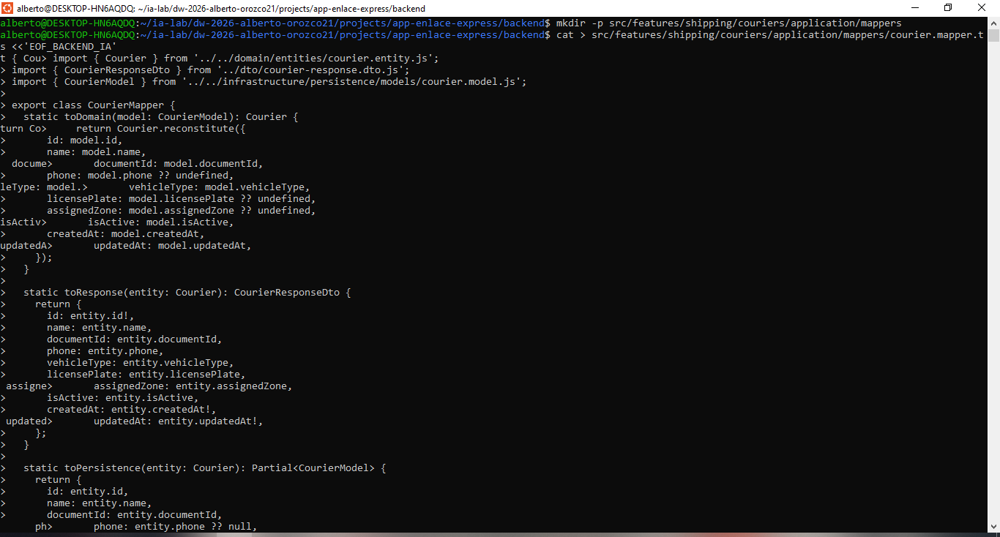

### 11.16 — features/shipping/couriers/application/use-cases/create-courier.use-case.ts

Caso de uso. Verifica que el documento de identidad no esté ya registrado.

**Archivo:** `src/features/shipping/couriers/application/use-cases/create-courier.use-case.ts`

```bash
mkdir -p src/features/shipping/couriers/application/use-cases
cat > src/features/shipping/couriers/application/use-cases/create-courier.use-case.ts <<'EOF_BACKEND_IA'
import { Inject, Injectable } from '@nestjs/common';
import { CourierDocumentAlreadyExistsException } from '../../domain/exceptions/courier-document-already-exists.exception.js';
import { Courier } from '../../domain/entities/courier.entity.js';
import {
  COURIER_REPOSITORY,
  type ICourierRepository,
} from '../../domain/interfaces/courier-repository.interface.js';
import { CreateCourierDto } from '../dto/create-courier.dto.js';
import { CourierMapper } from '../mappers/courier.mapper.js';

@Injectable()
export class CreateCourierUseCase {
  constructor(
    @Inject(COURIER_REPOSITORY)
    private readonly courierRepository: ICourierRepository,
  ) {}

  async execute(dto: CreateCourierDto) {
    const existing = await this.courierRepository.findByDocumentId(
      dto.documentId,
    );
    if (existing) {
      throw new CourierDocumentAlreadyExistsException(dto.documentId);
    }

    const courier = Courier.create({
      name: dto.name,
      documentId: dto.documentId,
      phone: dto.phone,
      vehicleType: dto.vehicleType,
      licensePlate: dto.licensePlate,
      assignedZone: dto.assignedZone,
    });

    const created = await this.courierRepository.create(courier);
    return CourierMapper.toResponse(created);
  }
}
EOF_BACKEND_IA
```

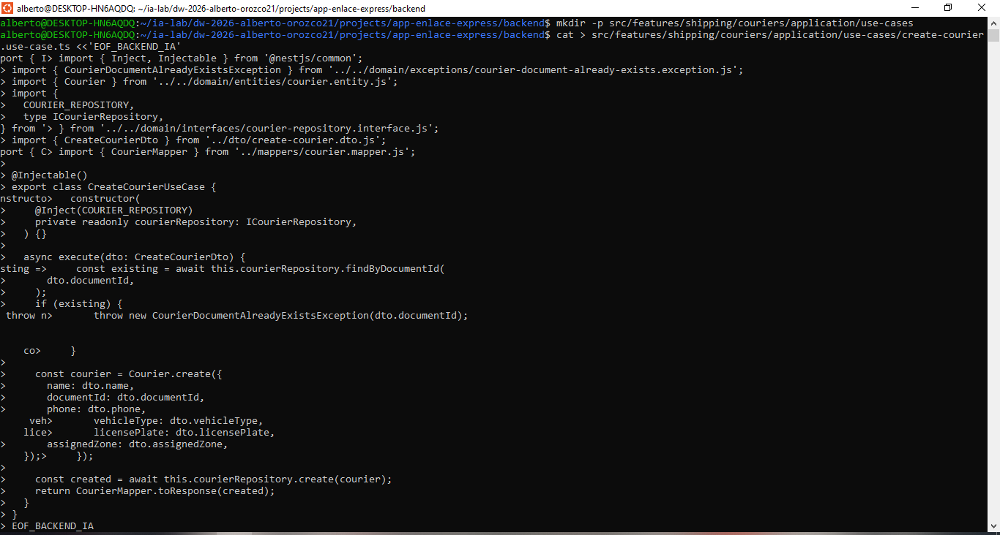

### 11.17 — features/shipping/couriers/application/use-cases/delete-courier.use-case.ts

Caso de uso (aplicación). Orquesta dominio + repositorio. El controller solo lo invoca.

**Archivo:** `src/features/shipping/couriers/application/use-cases/delete-courier.use-case.ts`

```bash
mkdir -p src/features/shipping/couriers/application/use-cases
cat > src/features/shipping/couriers/application/use-cases/delete-courier.use-case.ts <<'EOF_BACKEND_IA'
import { Inject, Injectable } from '@nestjs/common';
import { CourierNotFoundException } from '../../domain/exceptions/courier-not-found.exception.js';
import {
  COURIER_REPOSITORY,
  type ICourierRepository,
} from '../../domain/interfaces/courier-repository.interface.js';

@Injectable()
export class DeleteCourierUseCase {
  constructor(
    @Inject(COURIER_REPOSITORY)
    private readonly courierRepository: ICourierRepository,
  ) {}

  async execute(id: number): Promise<void> {
    const courier = await this.courierRepository.findById(id);
    if (!courier) {
      throw new CourierNotFoundException(id);
    }

    await this.courierRepository.delete(id);
  }
}
EOF_BACKEND_IA
```

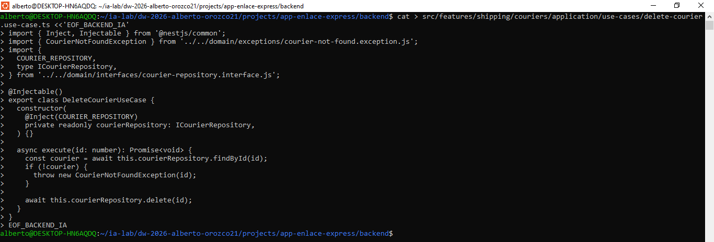

### 11.18 — features/shipping/couriers/application/use-cases/get-courier.use-case.ts

Caso de uso (aplicación). Orquesta dominio + repositorio. El controller solo lo invoca.

**Archivo:** `src/features/shipping/couriers/application/use-cases/get-courier.use-case.ts`

```bash
mkdir -p src/features/shipping/couriers/application/use-cases
cat > src/features/shipping/couriers/application/use-cases/get-courier.use-case.ts <<'EOF_BACKEND_IA'
import { Inject, Injectable } from '@nestjs/common';
import { CourierNotFoundException } from '../../domain/exceptions/courier-not-found.exception.js';
import {
  COURIER_REPOSITORY,
  type ICourierRepository,
} from '../../domain/interfaces/courier-repository.interface.js';
import { CourierMapper } from '../mappers/courier.mapper.js';

@Injectable()
export class GetCourierUseCase {
  constructor(
    @Inject(COURIER_REPOSITORY)
    private readonly courierRepository: ICourierRepository,
  ) {}

  async execute(id: number) {
    const courier = await this.courierRepository.findById(id);
    if (!courier) {
      throw new CourierNotFoundException(id);
    }

    return CourierMapper.toResponse(courier);
  }
}
EOF_BACKEND_IA
```

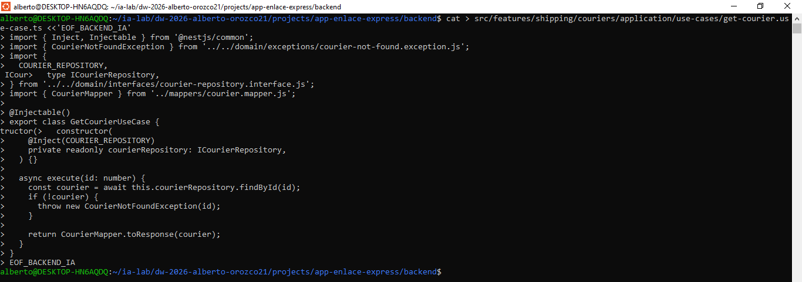

### 11.19 — features/shipping/couriers/application/use-cases/list-couriers.use-case.ts

Caso de uso (aplicación). Orquesta dominio + repositorio. El controller solo lo invoca.

**Archivo:** `src/features/shipping/couriers/application/use-cases/list-couriers.use-case.ts`

```bash
mkdir -p src/features/shipping/couriers/application/use-cases
cat > src/features/shipping/couriers/application/use-cases/list-couriers.use-case.ts <<'EOF_BACKEND_IA'
import { Inject, Injectable } from '@nestjs/common';
import {
  COURIER_REPOSITORY,
  type ICourierRepository,
} from '../../domain/interfaces/courier-repository.interface.js';
import { CourierFilterDto } from '../dto/courier-filter.dto.js';
import { CourierMapper } from '../mappers/courier.mapper.js';

@Injectable()
export class ListCouriersUseCase {
  constructor(
    @Inject(COURIER_REPOSITORY)
    private readonly courierRepository: ICourierRepository,
  ) {}

  async execute(filter: CourierFilterDto) {
    const result = await this.courierRepository.findAll(filter);
    return {
      items: result.items.map((courier) => CourierMapper.toResponse(courier)),
      meta: result.meta,
    };
  }
}
EOF_BACKEND_IA
```

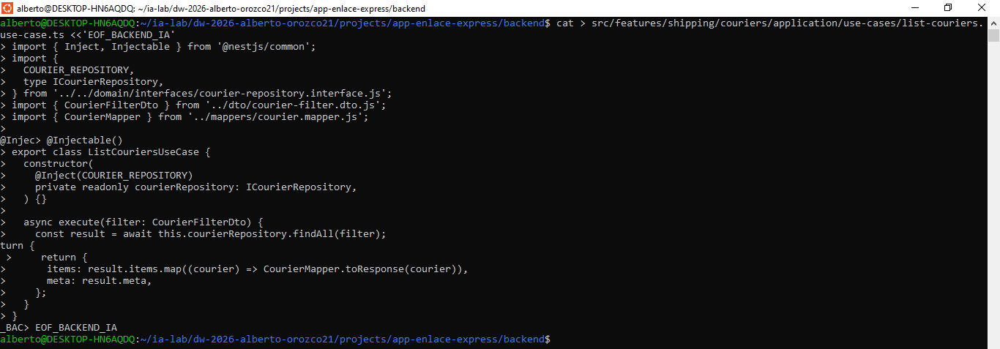

### 11.20 — features/shipping/couriers/application/use-cases/update-courier.use-case.ts

Caso de uso (aplicación). Orquesta dominio + repositorio. El controller solo lo invoca.

**Archivo:** `src/features/shipping/couriers/application/use-cases/update-courier.use-case.ts`

```bash
mkdir -p src/features/shipping/couriers/application/use-cases
cat > src/features/shipping/couriers/application/use-cases/update-courier.use-case.ts <<'EOF_BACKEND_IA'
import { Inject, Injectable } from '@nestjs/common';
import { CourierNotFoundException } from '../../domain/exceptions/courier-not-found.exception.js';
import {
  COURIER_REPOSITORY,
  type ICourierRepository,
} from '../../domain/interfaces/courier-repository.interface.js';
import { UpdateCourierDto } from '../dto/update-courier.dto.js';
import { CourierMapper } from '../mappers/courier.mapper.js';

@Injectable()
export class UpdateCourierUseCase {
  constructor(
    @Inject(COURIER_REPOSITORY)
    private readonly courierRepository: ICourierRepository,
  ) {}

  async execute(id: number, dto: UpdateCourierDto) {
    const courier = await this.courierRepository.findById(id);
    if (!courier) {
      throw new CourierNotFoundException(id);
    }

    courier.update(dto);
    const updated = await this.courierRepository.update(courier);
    return CourierMapper.toResponse(updated);
  }
}
EOF_BACKEND_IA
```

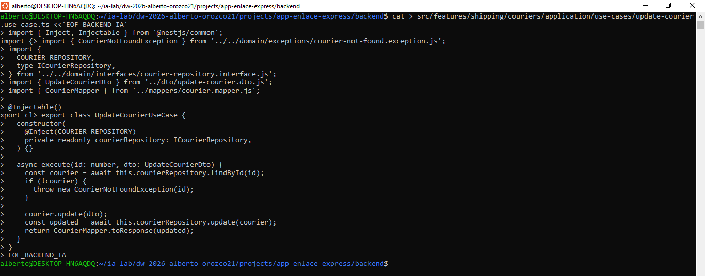

### 11.21 — features/shipping/couriers/presentation/http/serializers/courier.serializer.ts

Serializer de presentación (forma estable de la respuesta HTTP).

**Archivo:** `src/features/shipping/couriers/presentation/http/serializers/courier.serializer.ts`

```bash
mkdir -p src/features/shipping/couriers/presentation/http/serializers
cat > src/features/shipping/couriers/presentation/http/serializers/courier.serializer.ts <<'EOF_BACKEND_IA'
import { Courier } from '../../../domain/entities/courier.entity.js';
import { CourierResponseDto } from '../../../application/dto/courier-response.dto.js';
import { CourierMapper } from '../../../application/mappers/courier.mapper.js';

export class CourierSerializer {
  static serialize(entity: Courier): CourierResponseDto {
    return CourierMapper.toResponse(entity);
  }
}
EOF_BACKEND_IA
```

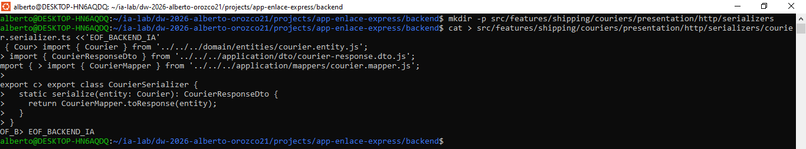

### 11.22 — features/shipping/couriers/presentation/http/controllers/couriers.controller.ts

Controller delgado: valida DTO, llama use-case, devuelve respuesta.

**Archivo:** `src/features/shipping/couriers/presentation/http/controllers/couriers.controller.ts`

```bash
mkdir -p src/features/shipping/couriers/presentation/http/controllers
cat > src/features/shipping/couriers/presentation/http/controllers/couriers.controller.ts <<'EOF_BACKEND_IA'
import {
  Body,
  Controller,
  Delete,
  Get,
  HttpCode,
  HttpStatus,
  Param,
  Patch,
  Post,
  Query,
} from '@nestjs/common';
import {
  ApiCreatedResponse,
  ApiNoContentResponse,
  ApiOkResponse,
  ApiOperation,
  ApiTags,
} from '@nestjs/swagger';
import { ParsePositiveIntPipe } from '../../../../../../common/pipes/parse-positive-int.pipe.js';
import { CreateCourierDto } from '../../../application/dto/create-courier.dto.js';
import { UpdateCourierDto } from '../../../application/dto/update-courier.dto.js';
import { CourierFilterDto } from '../../../application/dto/courier-filter.dto.js';
import { CourierResponseDto } from '../../../application/dto/courier-response.dto.js';
import { CreateCourierUseCase } from '../../../application/use-cases/create-courier.use-case.js';
import { UpdateCourierUseCase } from '../../../application/use-cases/update-courier.use-case.js';
import { DeleteCourierUseCase } from '../../../application/use-cases/delete-courier.use-case.js';
import { GetCourierUseCase } from '../../../application/use-cases/get-courier.use-case.js';
import { ListCouriersUseCase } from '../../../application/use-cases/list-couriers.use-case.js';

@ApiTags('Couriers')
@Controller('couriers')
export class CouriersController {
  constructor(
    private readonly createCourierUseCase: CreateCourierUseCase,
    private readonly updateCourierUseCase: UpdateCourierUseCase,
    private readonly deleteCourierUseCase: DeleteCourierUseCase,
    private readonly getCourierUseCase: GetCourierUseCase,
    private readonly listCouriersUseCase: ListCouriersUseCase,
  ) {}

  @Post()
  @ApiOperation({ summary: 'Crear un mensajero' })
  @ApiCreatedResponse({ type: CourierResponseDto })
  create(@Body() dto: CreateCourierDto) {
    return this.createCourierUseCase.execute(dto);
  }

  @Get()
  @ApiOperation({ summary: 'Listar mensajeros' })
  @ApiOkResponse({ type: [CourierResponseDto] })
  findAll(@Query() filter: CourierFilterDto) {
    return this.listCouriersUseCase.execute(filter);
  }

  @Get(':id')
  @ApiOperation({ summary: 'Obtener un mensajero por ID' })
  @ApiOkResponse({ type: CourierResponseDto })
  findOne(@Param('id', ParsePositiveIntPipe) id: number) {
    return this.getCourierUseCase.execute(id);
  }

  @Patch(':id')
  @ApiOperation({ summary: 'Actualizar un mensajero' })
  @ApiOkResponse({ type: CourierResponseDto })
  update(
    @Param('id', ParsePositiveIntPipe) id: number,
    @Body() dto: UpdateCourierDto,
  ) {
    return this.updateCourierUseCase.execute(id, dto);
  }

  @Delete(':id')
  @HttpCode(HttpStatus.NO_CONTENT)
  @ApiOperation({ summary: 'Eliminar un mensajero' })
  @ApiNoContentResponse()
  remove(@Param('id', ParsePositiveIntPipe) id: number) {
    return this.deleteCourierUseCase.execute(id);
  }
}
EOF_BACKEND_IA
```

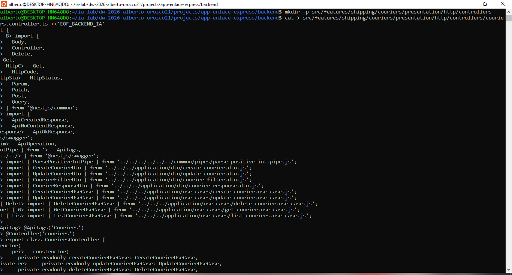

### 11.23 — features/shipping/couriers/index.ts

Barrel export del feature para imports limpios.

**Archivo:** `src/features/shipping/couriers/index.ts`

```bash
mkdir -p src/features/shipping/couriers
cat > src/features/shipping/couriers/index.ts <<'EOF_BACKEND_IA'
export { CouriersModule } from './couriers.module.js';
EOF_BACKEND_IA
```

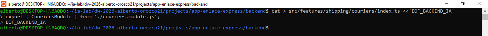

### 11.24 — features/shipping/couriers/couriers.module.ts

Módulo Nest del feature. No importa ningún otro módulo de negocio (pero `Ruta`, en fase 12, sí importará este).

**Archivo:** `src/features/shipping/couriers/couriers.module.ts`

```bash
mkdir -p src/features/shipping/couriers
cat > src/features/shipping/couriers/couriers.module.ts <<'EOF_BACKEND_IA'
import { Module } from '@nestjs/common';
import { COURIER_REPOSITORY } from './domain/interfaces/courier-repository.interface.js';
import { CourierRepository } from './infrastructure/persistence/repositories/courier.repository.js';
import { CreateCourierUseCase } from './application/use-cases/create-courier.use-case.js';
import { UpdateCourierUseCase } from './application/use-cases/update-courier.use-case.js';
import { DeleteCourierUseCase } from './application/use-cases/delete-courier.use-case.js';
import { GetCourierUseCase } from './application/use-cases/get-courier.use-case.js';
import { ListCouriersUseCase } from './application/use-cases/list-couriers.use-case.js';
import { CouriersController } from './presentation/http/controllers/couriers.controller.js';

@Module({
  controllers: [CouriersController],
  providers: [
    CourierRepository,
    { provide: COURIER_REPOSITORY, useExisting: CourierRepository },
    CreateCourierUseCase,
    UpdateCourierUseCase,
    DeleteCourierUseCase,
    GetCourierUseCase,
    ListCouriersUseCase,
  ],
  exports: [COURIER_REPOSITORY],
})
export class CouriersModule {}
EOF_BACKEND_IA
```

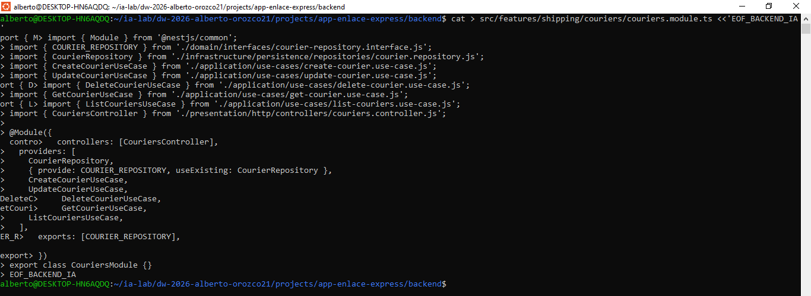

### 11.25 — Actualizar sequelize.factory.ts (registrar CourierModel)

Registra en ALL_MODELS solo los modelos ya creados (orden de dependencias).

**Archivo:** `src/infrastructure/database/sequelize/sequelize.factory.ts`

```bash
mkdir -p src/infrastructure/database/sequelize
cat > src/infrastructure/database/sequelize/sequelize.factory.ts <<'EOF_BACKEND_IA'
import { Sequelize } from 'sequelize-typescript';
import { DatabaseDialect } from '../../../config/environment/env.interface.js';
import { getSequelizeOptions } from './sequelize.options.js';

import { CompanyModel } from '../../../features/shipping/companies/infrastructure/persistence/models/company.model.js';
import { ContactModel } from '../../../features/shipping/contacts/infrastructure/persistence/models/contact.model.js';
import { AddressModel } from '../../../features/shipping/addresses/infrastructure/persistence/models/address.model.js';
import { RateModel } from '../../../features/shipping/rates/infrastructure/persistence/models/rate.model.js';
import { CourierModel } from '../../../features/shipping/couriers/infrastructure/persistence/models/courier.model.js';

export const ALL_MODELS = [
  CompanyModel,
  ContactModel,
  AddressModel,
  RateModel,
  CourierModel,
];

async function loadDialectModule(moduleName: string): Promise<any> {
  // Proyecto ESM: require() no existe como global, se usa import() dinámico.
  const mod: any = await import(moduleName);
  return mod.default ?? mod;
}

export async function createSequelizeInstance(
  dialect: DatabaseDialect,
): Promise<Sequelize> {
  const options = getSequelizeOptions(dialect);

  let dialectModule: any;

  switch (dialect) {
    case DatabaseDialect.MySQL:
      dialectModule = await loadDialectModule('mysql2');
      break;
    case DatabaseDialect.Postgres:
      dialectModule = await loadDialectModule('pg');
      break;
    case DatabaseDialect.MSSQL:
      dialectModule = await loadDialectModule('tedious');
      break;
    case DatabaseDialect.Oracle:
      dialectModule = await loadDialectModule('oracledb');
      break;
    default:
      throw new Error(`Dialecto no soportado: ${dialect}`);
  }

  const sequelize = new Sequelize({
    ...options,
    dialectModule,
    models: ALL_MODELS,
  } as any);

  try {
    await sequelize.authenticate();
    console.log(`✅ Conexión exitosa a ${dialect.toUpperCase()}`);
  } catch (error: any) {
    console.error(
      `❌ Error conectando a ${dialect.toUpperCase()}:`,
      error.message,
    );
    throw error;
  }

  if (process.env.NODE_ENV !== 'production') {
    await sequelize.sync({ alter: false });
    console.log('✅ Tablas sincronizadas');
  }

  return sequelize;
}
EOF_BACKEND_IA
```

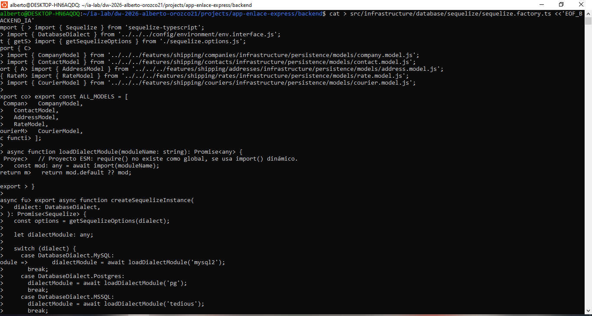

### 11.26 — Actualizar shipping.module.ts

Agrega el feature module de negocio recién terminado.

**Archivo:** `src/features/shipping/shipping.module.ts`

```bash
mkdir -p src/features/shipping
cat > src/features/shipping/shipping.module.ts <<'EOF_BACKEND_IA'
import { Module } from '@nestjs/common';
import { CompaniesModule } from './companies/companies.module.js';
import { ContactsModule } from './contacts/contacts.module.js';
import { AddressesModule } from './addresses/addresses.module.js';
import { RatesModule } from './rates/rates.module.js';
import { CouriersModule } from './couriers/couriers.module.js';

@Module({
  imports: [
    CompaniesModule,
    ContactsModule,
    AddressesModule,
    RatesModule,
    CouriersModule,
  ],
  exports: [
    CompaniesModule,
    ContactsModule,
    AddressesModule,
    RatesModule,
    CouriersModule,
  ],
})
export class ShippingModule {}
EOF_BACKEND_IA
```

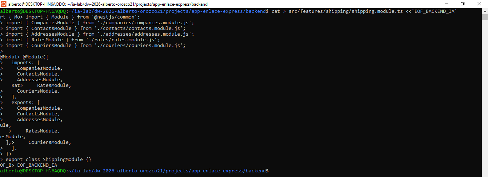

### 11.27 — Actualizar database-seeder.service.ts

Agrega `seedCouriers`. Independiente de los seeders anteriores.

**Archivo:** `src/infrastructure/database/seeders/database-seeder.service.ts`

```bash
mkdir -p src/infrastructure/database/seeders
cat > src/infrastructure/database/seeders/database-seeder.service.ts <<'EOF_BACKEND_IA'
import { Injectable, Logger, OnModuleInit } from '@nestjs/common';
import { seedCompanies } from '../../../features/shipping/companies/infrastructure/persistence/seeders/companies.seeder.js';
import { seedContacts } from '../../../features/shipping/contacts/infrastructure/persistence/seeders/contacts.seeder.js';
import { seedAddresses } from '../../../features/shipping/addresses/infrastructure/persistence/seeders/addresses.seeder.js';
import { seedRates } from '../../../features/shipping/rates/infrastructure/persistence/seeders/rates.seeder.js';
import { seedCouriers } from '../../../features/shipping/couriers/infrastructure/persistence/seeders/couriers.seeder.js';

/**
 * Ejecuta seeders en orden de dependencias.
 * Solo en entornos no productivos.
 */
@Injectable()
export class DatabaseSeederService implements OnModuleInit {
  private readonly logger = new Logger(DatabaseSeederService.name);

  async onModuleInit(): Promise<void> {
    if (process.env.NODE_ENV === 'production') {
      return;
    }

    try {
      await seedCompanies();
      await seedContacts();
      await seedAddresses();
      await seedRates();
      await seedCouriers();
      this.logger.log('✅ Seeders ejecutados');
    } catch (error: any) {
      this.logger.error(`❌ Error en seeders: ${error.message}`, error.stack);
      throw error;
    }
  }
}
EOF_BACKEND_IA
```

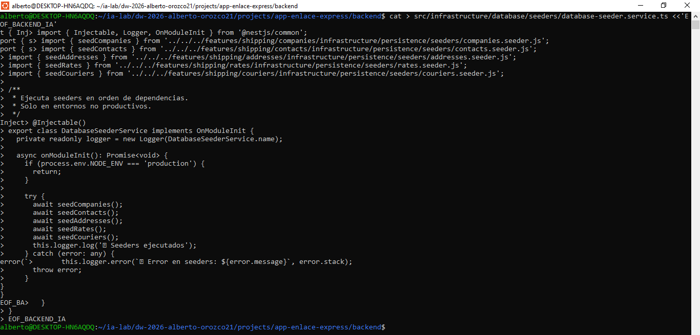

### 11.28 — Verificar tabla física `couriers` y API

`app.module.ts` no necesita cambios: `ShippingModule` ya expone `CouriersModule`.

Arranca la app. Debe crear/sync tabla `couriers`, correr seeder y exponer `/api/couriers`. Prueba:
- Crear un mensajero con `vehicleType: "moto"` sin `licensePlate` → debe fallar (400) por la regla de dominio.
- Crear uno con `vehicleType: "bicicleta"` y `licensePlate` → debe fallar también.
- Crear uno con `documentId` repetido → debe fallar (409, vía `CourierDocumentAlreadyExistsException`).

```bash
npm run start:dev
```

**Consola**

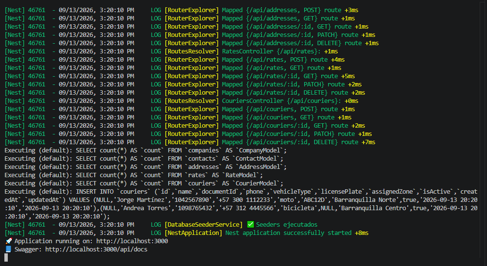

**/api/couriers**

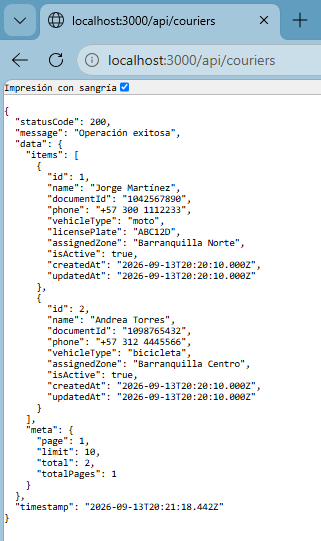

-------------------------------------------------------------

## FASE 12 — `11_BUSINESS_ROUTES`

### Business — Routes / Ruta (patrón completo CA)

> **Objetivo de la fase:** Sexta entidad de negocio de EnlaceExpress: Ruta, que pertenece a un Mensajero (`courierId`). Mismo patrón que Contacto/Direccion → Empresa: asociación real con `@BelongsTo(() => CourierModel)` + import estático, y se vuelve a `courier.model.ts` para agregar `@HasMany(() => RouteModel)`. Orden lógico: dominio → infraestructura → aplicación → presentación → módulo → cableado → verificación.

#### 12.1 — features/shipping/routes/domain/enums/route-status.enum.ts

Enum de dominio propio del feature.

**Archivo:** `src/features/shipping/routes/domain/enums/route-status.enum.ts`

```bash
mkdir -p src/features/shipping/routes/domain/enums
cat > src/features/shipping/routes/domain/enums/route-status.enum.ts <<'EOF_BACKEND_IA'
export enum RouteStatus {
  PLANNED = 'planificada',
  IN_PROGRESS = 'en_curso',
  FINISHED = 'finalizada',
}
EOF_BACKEND_IA
```

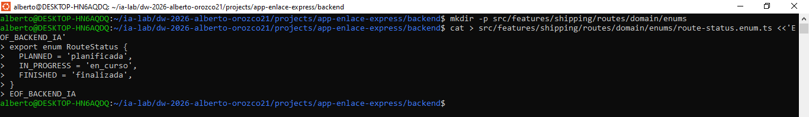

### 12.2 — features/shipping/routes/domain/entities/route.entity.ts

Entidad de dominio. Regla: si hay `endTime`, debe ser posterior a `startTime`.

**Archivo:** `src/features/shipping/routes/domain/entities/route.entity.ts`

```bash
mkdir -p src/features/shipping/routes/domain/entities
cat > src/features/shipping/routes/domain/entities/route.entity.ts <<'EOF_BACKEND_IA'
import { RouteStatus } from '../enums/route-status.enum.js';

export interface RouteProps {
  id?: number;
  courierId: number;
  name: string;
  coverageZone?: string;
  date: Date;
  startTime: Date;
  endTime?: Date;
  status?: RouteStatus;
  isActive?: boolean;
  createdAt?: Date;
  updatedAt?: Date;
}

export class Route {
  id?: number;
  courierId: number;
  name: string;
  coverageZone?: string;
  date: Date;
  startTime: Date;
  endTime?: Date;
  status: RouteStatus;
  isActive: boolean;
  createdAt?: Date;
  updatedAt?: Date;

  private constructor(props: RouteProps) {
    this.id = props.id;
    this.courierId = props.courierId;
    this.name = props.name;
    this.coverageZone = props.coverageZone;
    this.date = props.date;
    this.startTime = props.startTime;
    this.endTime = props.endTime;
    this.status = props.status ?? RouteStatus.PLANNED;
    this.isActive = props.isActive ?? true;
    this.createdAt = props.createdAt;
    this.updatedAt = props.updatedAt;
  }

  private static validateTimes(startTime: Date, endTime?: Date): void {
    if (endTime && endTime <= startTime) {
      throw new Error('La hora de fin debe ser posterior a la hora de inicio');
    }
  }

  static create(
    props: Omit<RouteProps, 'id' | 'isActive' | 'createdAt' | 'updatedAt'>,
  ): Route {
    if (!props.courierId) {
      throw new Error('La ruta debe estar asignada a un mensajero');
    }

    if (!props.name?.trim()) {
      throw new Error('El nombre de la ruta es requerido');
    }

    if (!props.date) {
      throw new Error('La fecha de la ruta es requerida');
    }

    if (!props.startTime) {
      throw new Error('La hora de inicio es requerida');
    }

    Route.validateTimes(props.startTime, props.endTime);

    return new Route(props);
  }

  static reconstitute(props: RouteProps): Route {
    return new Route(props);
  }

  update(
    props: Partial<
      Omit<RouteProps, 'id' | 'courierId' | 'isActive' | 'createdAt' | 'updatedAt'>
    >,
  ): void {
    const nextStartTime = props.startTime ?? this.startTime;
    const nextEndTime = props.endTime !== undefined ? props.endTime : this.endTime;

    if (props.name !== undefined) {
      if (!props.name.trim()) {
        throw new Error('El nombre de la ruta es requerida');
      }
      this.name = props.name;
    }

    if (props.coverageZone !== undefined) {
      this.coverageZone = props.coverageZone;
    }

    if (props.date !== undefined) {
      this.date = props.date;
    }

    if (props.startTime !== undefined || props.endTime !== undefined) {
      Route.validateTimes(nextStartTime, nextEndTime);
      this.startTime = nextStartTime;
      this.endTime = nextEndTime;
    }

    if (props.status !== undefined) {
      this.status = props.status;
    }
  }

  deactivate(): void {
    this.isActive = false;
  }

  activate(): void {
    this.isActive = true;
  }
}
EOF_BACKEND_IA
```

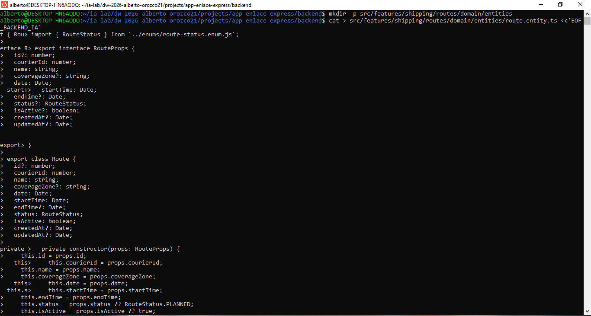

### 12.3 — features/shipping/routes/domain/exceptions/route-not-found.exception.ts

Excepción de dominio. El caso de uso la lanza; el filter HTTP la traduce a status code.

**Archivo:** `src/features/shipping/routes/domain/exceptions/route-not-found.exception.ts`

```bash
mkdir -p src/features/shipping/routes/domain/exceptions
cat > src/features/shipping/routes/domain/exceptions/route-not-found.exception.ts <<'EOF_BACKEND_IA'
import { EntityNotFoundException } from '../../../../../common/exceptions/entity-not-found.exception.js';

export class RouteNotFoundException extends EntityNotFoundException {
  constructor(id: number) {
    super('Ruta', id);
  }
}
EOF_BACKEND_IA
```

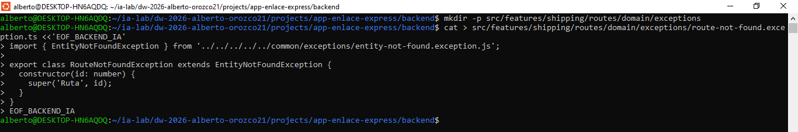

### 12.4 — features/shipping/routes/domain/interfaces/route-repository.interface.ts

Puerto (contrato) del repositorio. La aplicación depende de esta interface, no de Sequelize.

**Archivo:** `src/features/shipping/routes/domain/interfaces/route-repository.interface.ts`

```bash
mkdir -p src/features/shipping/routes/domain/interfaces
cat > src/features/shipping/routes/domain/interfaces/route-repository.interface.ts <<'EOF_BACKEND_IA'
import { PaginatedResult } from '../../../../../common/interfaces/pagination.interface.js';
import { RouteStatus } from '../enums/route-status.enum.js';
import { Route } from '../entities/route.entity.js';

export const ROUTE_REPOSITORY = 'ROUTE_REPOSITORY';

export interface RouteFindAllParams {
  page?: number;
  limit?: number;
  search?: string;
  courierId?: number;
  status?: RouteStatus;
}

export interface IRouteRepository {
  create(route: Route): Promise<Route>;
  update(route: Route): Promise<Route>;
  delete(id: number): Promise<void>;
  findById(id: number): Promise<Route | null>;
  findAll(params: RouteFindAllParams): Promise<PaginatedResult<Route>>;
}
EOF_BACKEND_IA
```


### 12.5 — features/shipping/routes/infrastructure/persistence/models/route.model.ts

Modelo Sequelize (`@Table`). Incluye la FK real y `@BelongsTo(() => CourierModel)`.

**Archivo:** `src/features/shipping/routes/infrastructure/persistence/models/route.model.ts`

```bash
mkdir -p src/features/shipping/routes/infrastructure/persistence/models
cat > src/features/shipping/routes/infrastructure/persistence/models/route.model.ts <<'EOF_BACKEND_IA'
import {
  AutoIncrement,
  BelongsTo,
  Column,
  CreatedAt,
  DataType,
  ForeignKey,
  Model,
  PrimaryKey,
  Table,
  UpdatedAt,
} from 'sequelize-typescript';
import { CourierModel } from '../../../../couriers/infrastructure/persistence/models/courier.model.js';
import { RouteStatus } from '../../../domain/enums/route-status.enum.js';

@Table({ tableName: 'routes' })
export class RouteModel extends Model {
  @PrimaryKey
  @AutoIncrement
  @Column(DataType.INTEGER)
  declare id: number;

  @ForeignKey(() => CourierModel)
  @Column({ type: DataType.INTEGER, allowNull: false })
  declare courierId: number;

  @BelongsTo(() => CourierModel)
  declare courier: CourierModel;

  @Column({ type: DataType.STRING(150), allowNull: false })
  declare name: string;

  @Column({ type: DataType.STRING(100), allowNull: true })
  declare coverageZone: string | null;

  @Column({ type: DataType.DATEONLY, allowNull: false })
  declare date: string;

  @Column({ type: DataType.DATE, allowNull: false })
  declare startTime: Date;

  @Column({ type: DataType.DATE, allowNull: true })
  declare endTime: Date | null;

  @Column({
    type: DataType.ENUM(...Object.values(RouteStatus)),
    allowNull: false,
    defaultValue: RouteStatus.PLANNED,
  })
  declare status: RouteStatus;

  @Column({ type: DataType.BOOLEAN, allowNull: false, defaultValue: true })
  declare isActive: boolean;

  @CreatedAt
  declare createdAt: Date;

  @UpdatedAt
  declare updatedAt: Date;
}
EOF_BACKEND_IA
```

### 12.6 — features/shipping/routes/infrastructure/persistence/repositories/route.repository.ts

Adaptador del repositorio: implementa el puerto de dominio con Sequelize.

**Archivo:** `src/features/shipping/routes/infrastructure/persistence/repositories/route.repository.ts`

```bash
mkdir -p src/features/shipping/routes/infrastructure/persistence/repositories
cat > src/features/shipping/routes/infrastructure/persistence/repositories/route.repository.ts <<'EOF_BACKEND_IA'
import { Injectable } from '@nestjs/common';
import { Op } from 'sequelize';
import {
  buildPaginatedResult,
  normalizePagination,
} from '../../../../../../common/utils/pagination.util.js';
import { Route } from '../../../domain/entities/route.entity.js';
import {
  RouteFindAllParams,
  IRouteRepository,
} from '../../../domain/interfaces/route-repository.interface.js';
import { RouteMapper } from '../../../application/mappers/route.mapper.js';
import { RouteModel } from '../models/route.model.js';

@Injectable()
export class RouteRepository implements IRouteRepository {
  async create(route: Route): Promise<Route> {
    const model = await RouteModel.create(RouteMapper.toPersistence(route));
    return RouteMapper.toDomain(model);
  }

  async update(route: Route): Promise<Route> {
    await RouteModel.update(RouteMapper.toPersistence(route), {
      where: { id: route.id },
    });
    const updated = await RouteModel.findByPk(route.id!);
    return RouteMapper.toDomain(updated!);
  }

  async delete(id: number): Promise<void> {
    await RouteModel.destroy({ where: { id } });
  }

  async findById(id: number): Promise<Route | null> {
    const model = await RouteModel.findByPk(id);
    return model ? RouteMapper.toDomain(model) : null;
  }

  async findAll(params: RouteFindAllParams) {
    const { page, limit, offset } = normalizePagination(
      params.page,
      params.limit,
    );

    const where: Record<string, unknown> = {};

    if (params.courierId) {
      where.courierId = params.courierId;
    }

    if (params.status) {
      where.status = params.status;
    }

    if (params.search) {
      where[Op.or as unknown as string] = [
        { name: { [Op.like]: `%${params.search}%` } },
        { coverageZone: { [Op.like]: `%${params.search}%` } },
      ];
    }

    const { rows, count } = await RouteModel.findAndCountAll({
      where,
      limit,
      offset,
      order: [['date', 'DESC']],
    });

    return buildPaginatedResult(
      rows.map((row) => RouteMapper.toDomain(row)),
      count,
      page,
      limit,
    );
  }
}
EOF_BACKEND_IA
```

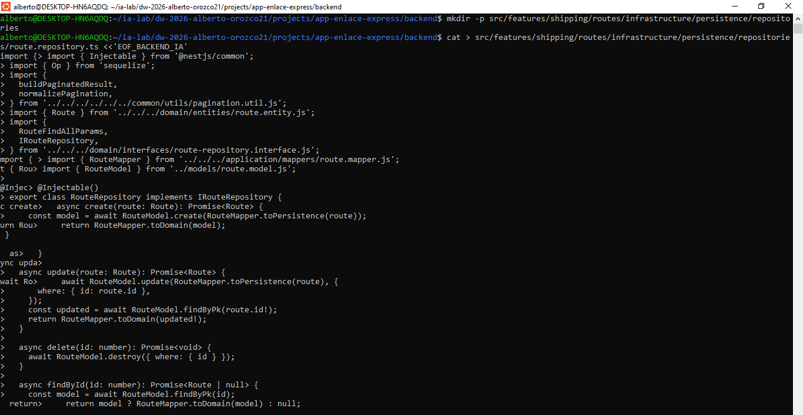

### 12.7 — features/shipping/routes/infrastructure/persistence/migrations/create-routes-table.migration.ts

Migración documental/auxiliar de la tabla. En dev el sync de Sequelize crea el esquema.

**Archivo:** `src/features/shipping/routes/infrastructure/persistence/migrations/create-routes-table.migration.ts`

```bash
mkdir -p src/features/shipping/routes/infrastructure/persistence/migrations
cat > src/features/shipping/routes/infrastructure/persistence/migrations/create-routes-table.migration.ts <<'EOF_BACKEND_IA'
export const createRoutesTableMigration = {
  name: 'create-routes-table',
  async up(): Promise<void> {
    // Sequelize sync handles table creation in development.
    // Production: CREATE TABLE routes (id, courierId FK->couriers, name, coverageZone,
    //   date, startTime, endTime, status, isActive, createdAt, updatedAt)
  },
  async down(): Promise<void> {
    // Production: DROP TABLE routes
  },
};
EOF_BACKEND_IA
```

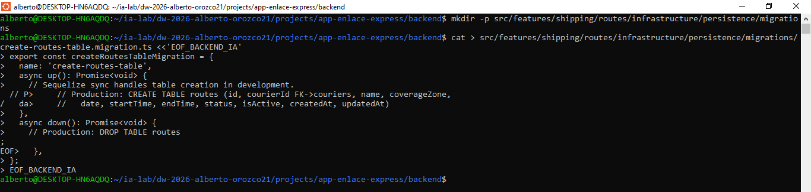

### 12.8 — features/shipping/routes/infrastructure/persistence/seeders/routes.seeder.ts

Seeder de datos iniciales. Depende de que ya existan mensajeros (fase 11).

**Archivo:** `src/features/shipping/routes/infrastructure/persistence/seeders/routes.seeder.ts`

```bash
mkdir -p src/features/shipping/routes/infrastructure/persistence/seeders
cat > src/features/shipping/routes/infrastructure/persistence/seeders/routes.seeder.ts <<'EOF_BACKEND_IA'
import { RouteModel } from '../models/route.model.js';
import { CourierModel } from '../../../../couriers/infrastructure/persistence/models/courier.model.js';
import { RouteStatus } from '../../../domain/enums/route-status.enum.js';

export async function seedRoutes(): Promise<void> {
  const count = await RouteModel.count();
  if (count > 0) {
    return;
  }

  const couriers = await CourierModel.findAll({
    limit: 2,
    order: [['id', 'ASC']],
  });

  if (couriers.length === 0) {
    return;
  }

  const records = [
    {
      courierId: couriers[0].id,
      name: 'Ruta matutina norte',
      coverageZone: 'Barranquilla Norte',
      date: '2026-09-15',
      startTime: new Date('2026-09-15T08:00:00Z'),
      endTime: new Date('2026-09-15T12:00:00Z'),
      status: RouteStatus.PLANNED,
      isActive: true,
    },
  ];

  if (couriers[1]) {
    records.push({
      courierId: couriers[1].id,
      name: 'Ruta vespertina centro',
      coverageZone: 'Barranquilla Centro',
      date: '2026-09-15',
      startTime: new Date('2026-09-15T13:00:00Z'),
      endTime: new Date('2026-09-15T17:00:00Z'),
      status: RouteStatus.PLANNED,
      isActive: true,
    });
  }

  await RouteModel.bulkCreate(records);
}
EOF_BACKEND_IA
```

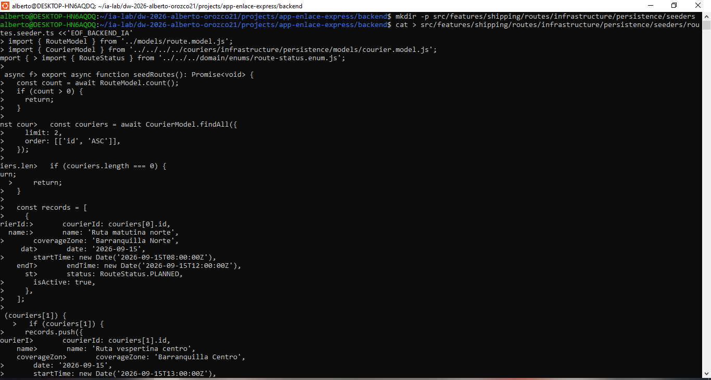

### 12.9 — features/shipping/routes/application/dto/route-filter.dto.ts

DTO de entrada/salida HTTP con `class-validator` / Swagger. Incluye filtro por `courierId` y `status`.

**Archivo:** `src/features/shipping/routes/application/dto/route-filter.dto.ts`

```bash
mkdir -p src/features/shipping/routes/application/dto
cat > src/features/shipping/routes/application/dto/route-filter.dto.ts <<'EOF_BACKEND_IA'
import { ApiPropertyOptional } from '@nestjs/swagger';
import { Type } from 'class-transformer';
import {
  IsEnum,
  IsInt,
  IsOptional,
  IsPositive,
  IsString,
  Min,
} from 'class-validator';
import { RouteStatus } from '../../domain/enums/route-status.enum.js';

export class RouteFilterDto {
  @ApiPropertyOptional({ example: 1, default: 1 })
  @IsOptional()
  @Type(() => Number)
  @IsInt()
  @Min(1)
  page?: number;

  @ApiPropertyOptional({ example: 10, default: 10 })
  @IsOptional()
  @Type(() => Number)
  @IsInt()
  @IsPositive()
  limit?: number;

  @ApiPropertyOptional({ example: 'norte' })
  @IsOptional()
  @IsString()
  search?: string;

  @ApiPropertyOptional({ example: 1 })
  @IsOptional()
  @Type(() => Number)
  @IsInt()
  @IsPositive()
  courierId?: number;

  @ApiPropertyOptional({ enum: RouteStatus, example: RouteStatus.PLANNED })
  @IsOptional()
  @IsEnum(RouteStatus)
  status?: RouteStatus;
}
EOF_BACKEND_IA
```

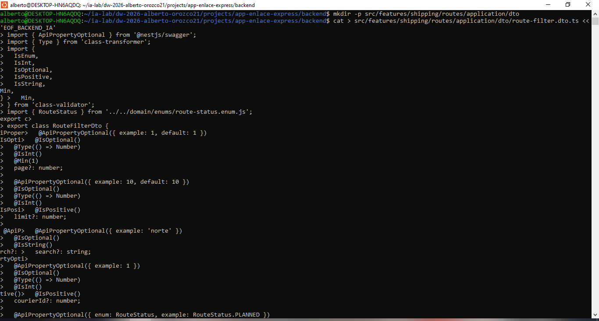

### 12.10 — features/shipping/routes/application/dto/route-response.dto.ts

DTO de entrada/salida HTTP con `class-validator` / Swagger.

**Archivo:** `src/features/shipping/routes/application/dto/route-response.dto.ts`

```bash
mkdir -p src/features/shipping/routes/application/dto
cat > src/features/shipping/routes/application/dto/route-response.dto.ts <<'EOF_BACKEND_IA'
import { ApiProperty, ApiPropertyOptional } from '@nestjs/swagger';
import { RouteStatus } from '../../domain/enums/route-status.enum.js';

export class RouteResponseDto {
  @ApiProperty({ example: 1 })
  id: number;

  @ApiProperty({ example: 1 })
  courierId: number;

  @ApiProperty({ example: 'Ruta matutina norte' })
  name: string;

  @ApiPropertyOptional({ example: 'Barranquilla Norte' })
  coverageZone?: string;

  @ApiProperty({ example: '2026-09-15' })
  date: Date;

  @ApiProperty({ example: '2026-09-15T08:00:00Z' })
  startTime: Date;

  @ApiPropertyOptional({ example: '2026-09-15T12:00:00Z' })
  endTime?: Date;

  @ApiProperty({ enum: RouteStatus, example: RouteStatus.PLANNED })
  status: RouteStatus;

  @ApiProperty({ example: true })
  isActive: boolean;

  @ApiProperty()
  createdAt: Date;

  @ApiProperty()
  updatedAt: Date;
}
EOF_BACKEND_IA
```

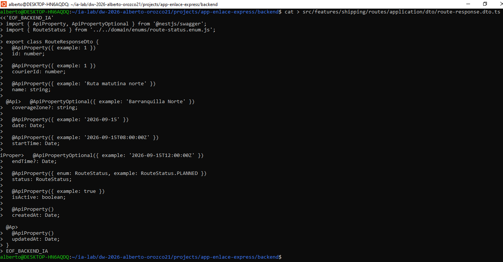

### 12.11 — features/shipping/routes/application/dto/create-route.dto.ts

DTO de entrada/salida HTTP con `class-validator` / Swagger.

**Archivo:** `src/features/shipping/routes/application/dto/create-route.dto.ts`

```bash
mkdir -p src/features/shipping/routes/application/dto
cat > src/features/shipping/routes/application/dto/create-route.dto.ts <<'EOF_BACKEND_IA'
import { ApiProperty, ApiPropertyOptional } from '@nestjs/swagger';
import {
  IsDateString,
  IsEnum,
  IsInt,
  IsNotEmpty,
  IsOptional,
  IsPositive,
  IsString,
  MaxLength,
} from 'class-validator';
import { RouteStatus } from '../../domain/enums/route-status.enum.js';

export class CreateRouteDto {
  @ApiProperty({ example: 1 })
  @IsInt()
  @IsPositive()
  courierId: number;

  @ApiProperty({ example: 'Ruta matutina norte' })
  @IsString()
  @IsNotEmpty()
  @MaxLength(150)
  name: string;

  @ApiPropertyOptional({ example: 'Barranquilla Norte' })
  @IsOptional()
  @IsString()
  @MaxLength(100)
  coverageZone?: string;

  @ApiProperty({ example: '2026-09-15' })
  @IsDateString()
  date: string;

  @ApiProperty({ example: '2026-09-15T08:00:00Z' })
  @IsDateString()
  startTime: string;

  @ApiPropertyOptional({ example: '2026-09-15T12:00:00Z' })
  @IsOptional()
  @IsDateString()
  endTime?: string;

  @ApiPropertyOptional({ enum: RouteStatus, example: RouteStatus.PLANNED })
  @IsOptional()
  @IsEnum(RouteStatus)
  status?: RouteStatus;
}
EOF_BACKEND_IA
```

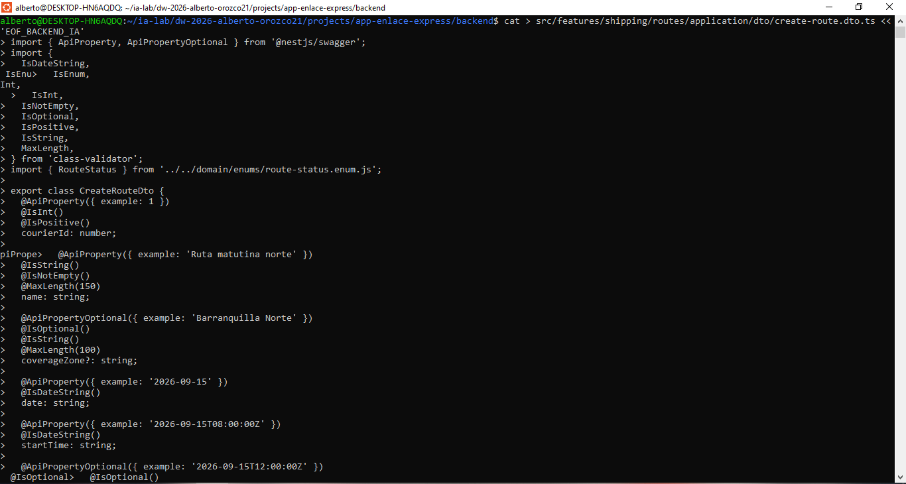

### 12.12 — features/shipping/routes/application/dto/update-route.dto.ts

DTO de actualización. `courierId` se excluye a propósito: una ruta no cambia de mensajero (se cancela y se crea otra).

**Archivo:** `src/features/shipping/routes/application/dto/update-route.dto.ts`

```bash
mkdir -p src/features/shipping/routes/application/dto
cat > src/features/shipping/routes/application/dto/update-route.dto.ts <<'EOF_BACKEND_IA'
import { OmitType, PartialType } from '@nestjs/mapped-types';
import { CreateRouteDto } from './create-route.dto.js';

export class UpdateRouteDto extends PartialType(
  OmitType(CreateRouteDto, ['courierId'] as const),
) {}
EOF_BACKEND_IA
```

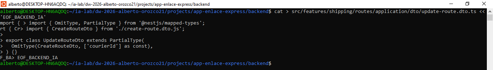

### 12.13 — features/shipping/routes/application/mappers/route.mapper.ts

Mapper entre entidad de dominio y DTO de respuesta.

**Archivo:** `src/features/shipping/routes/application/mappers/route.mapper.ts`

```bash
mkdir -p src/features/shipping/routes/application/mappers
cat > src/features/shipping/routes/application/mappers/route.mapper.ts <<'EOF_BACKEND_IA'
import { Route } from '../../domain/entities/route.entity.js';
import { RouteResponseDto } from '../dto/route-response.dto.js';
import { RouteModel } from '../../infrastructure/persistence/models/route.model.js';

export class RouteMapper {
  static toDomain(model: RouteModel): Route {
    return Route.reconstitute({
      id: model.id,
      courierId: model.courierId,
      name: model.name,
      coverageZone: model.coverageZone ?? undefined,
      date: new Date(model.date),
      startTime: model.startTime,
      endTime: model.endTime ?? undefined,
      status: model.status,
      isActive: model.isActive,
      createdAt: model.createdAt,
      updatedAt: model.updatedAt,
    });
  }

  static toResponse(entity: Route): RouteResponseDto {
    return {
      id: entity.id!,
      courierId: entity.courierId,
      name: entity.name,
      coverageZone: entity.coverageZone,
      date: entity.date,
      startTime: entity.startTime,
      endTime: entity.endTime,
      status: entity.status,
      isActive: entity.isActive,
      createdAt: entity.createdAt!,
      updatedAt: entity.updatedAt!,
    };
  }

  static toPersistence(entity: Route): Partial<RouteModel> {
    return {
      id: entity.id,
      courierId: entity.courierId,
      name: entity.name,
      coverageZone: entity.coverageZone ?? null,
      date: entity.date.toISOString().slice(0, 10) as any,
      startTime: entity.startTime,
      endTime: entity.endTime ?? null,
      status: entity.status,
      isActive: entity.isActive ?? true,
    };
  }
}
EOF_BACKEND_IA
```

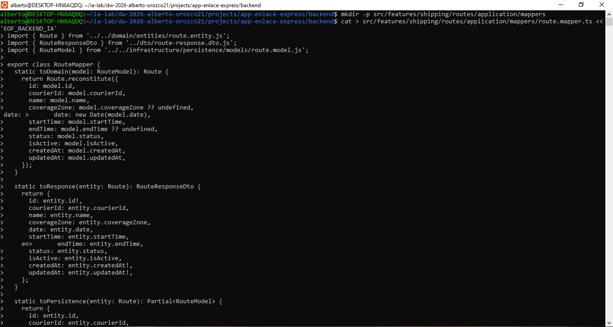

### 12.14 — features/shipping/routes/application/use-cases/create-route.use-case.ts

Caso de uso. Verifica que el mensajero exista (cruce con el feature `couriers`).

**Archivo:** `src/features/shipping/routes/application/use-cases/create-route.use-case.ts`

```bash
mkdir -p src/features/shipping/routes/application/use-cases
cat > src/features/shipping/routes/application/use-cases/create-route.use-case.ts <<'EOF_BACKEND_IA'
import { Inject, Injectable } from '@nestjs/common';
import { CourierNotFoundException } from '../../../couriers/domain/exceptions/courier-not-found.exception.js';
import {
  COURIER_REPOSITORY,
  type ICourierRepository,
} from '../../../couriers/domain/interfaces/courier-repository.interface.js';
import { Route } from '../../domain/entities/route.entity.js';
import {
  ROUTE_REPOSITORY,
  type IRouteRepository,
} from '../../domain/interfaces/route-repository.interface.js';
import { CreateRouteDto } from '../dto/create-route.dto.js';
import { RouteMapper } from '../mappers/route.mapper.js';

@Injectable()
export class CreateRouteUseCase {
  constructor(
    @Inject(ROUTE_REPOSITORY)
    private readonly routeRepository: IRouteRepository,
    @Inject(COURIER_REPOSITORY)
    private readonly courierRepository: ICourierRepository,
  ) {}

  async execute(dto: CreateRouteDto) {
    const courier = await this.courierRepository.findById(dto.courierId);
    if (!courier) {
      throw new CourierNotFoundException(dto.courierId);
    }

    const route = Route.create({
      courierId: dto.courierId,
      name: dto.name,
      coverageZone: dto.coverageZone,
      date: new Date(dto.date),
      startTime: new Date(dto.startTime),
      endTime: dto.endTime ? new Date(dto.endTime) : undefined,
      status: dto.status,
    });

    const created = await this.routeRepository.create(route);
    return RouteMapper.toResponse(created);
  }
}
EOF_BACKEND_IA
```

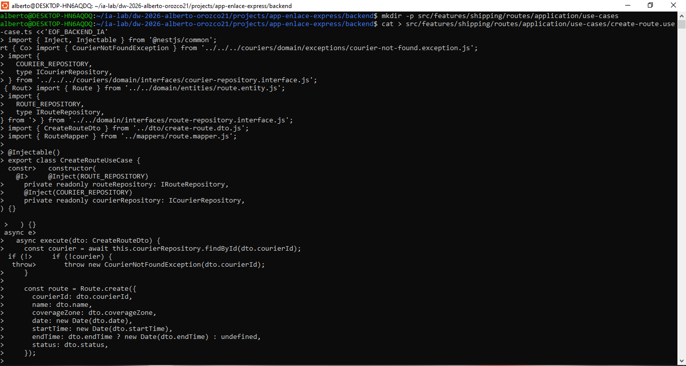

### 12.15 — features/shipping/routes/application/use-cases/delete-route.use-case.ts

Caso de uso (aplicación). Orquesta dominio + repositorio. El controller solo lo invoca.

**Archivo:** `src/features/shipping/routes/application/use-cases/delete-route.use-case.ts`

```bash
mkdir -p src/features/shipping/routes/application/use-cases
cat > src/features/shipping/routes/application/use-cases/delete-route.use-case.ts <<'EOF_BACKEND_IA'
import { Inject, Injectable } from '@nestjs/common';
import { RouteNotFoundException } from '../../domain/exceptions/route-not-found.exception.js';
import {
  ROUTE_REPOSITORY,
  type IRouteRepository,
} from '../../domain/interfaces/route-repository.interface.js';

@Injectable()
export class DeleteRouteUseCase {
  constructor(
    @Inject(ROUTE_REPOSITORY)
    private readonly routeRepository: IRouteRepository,
  ) {}

  async execute(id: number): Promise<void> {
    const route = await this.routeRepository.findById(id);
    if (!route) {
      throw new RouteNotFoundException(id);
    }

    await this.routeRepository.delete(id);
  }
}
EOF_BACKEND_IA
```

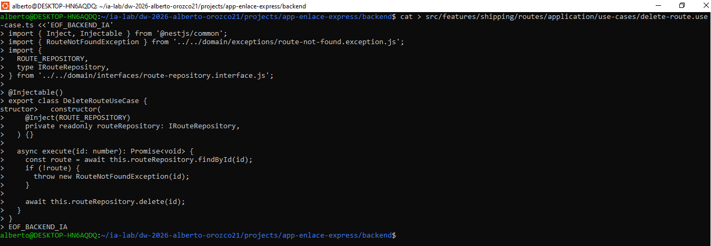

### 12.16 — features/shipping/routes/application/use-cases/get-route.use-case.ts

Caso de uso (aplicación). Orquesta dominio + repositorio. El controller solo lo invoca.

**Archivo:** `src/features/shipping/routes/application/use-cases/get-route.use-case.ts`

```bash
mkdir -p src/features/shipping/routes/application/use-cases
cat > src/features/shipping/routes/application/use-cases/get-route.use-case.ts <<'EOF_BACKEND_IA'
import { Inject, Injectable } from '@nestjs/common';
import { RouteNotFoundException } from '../../domain/exceptions/route-not-found.exception.js';
import {
  ROUTE_REPOSITORY,
  type IRouteRepository,
} from '../../domain/interfaces/route-repository.interface.js';
import { RouteMapper } from '../mappers/route.mapper.js';

@Injectable()
export class GetRouteUseCase {
  constructor(
    @Inject(ROUTE_REPOSITORY)
    private readonly routeRepository: IRouteRepository,
  ) {}

  async execute(id: number) {
    const route = await this.routeRepository.findById(id);
    if (!route) {
      throw new RouteNotFoundException(id);
    }

    return RouteMapper.toResponse(route);
  }
}
EOF_BACKEND_IA
```

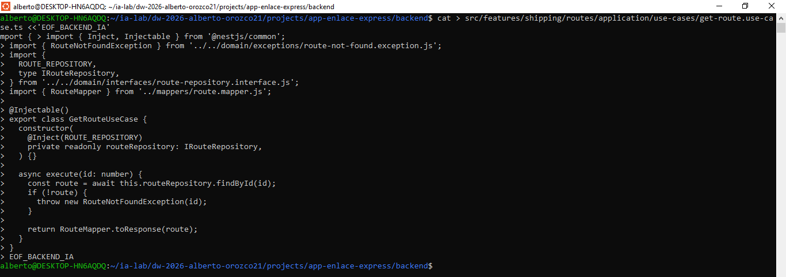

### 12.17 — features/shipping/routes/application/use-cases/list-routes.use-case.ts

Caso de uso (aplicación). Orquesta dominio + repositorio. El controller solo lo invoca.

**Archivo:** `src/features/shipping/routes/application/use-cases/list-routes.use-case.ts`

```bash
mkdir -p src/features/shipping/routes/application/use-cases
cat > src/features/shipping/routes/application/use-cases/list-routes.use-case.ts <<'EOF_BACKEND_IA'
import { Inject, Injectable } from '@nestjs/common';
import {
  ROUTE_REPOSITORY,
  type IRouteRepository,
} from '../../domain/interfaces/route-repository.interface.js';
import { RouteFilterDto } from '../dto/route-filter.dto.js';
import { RouteMapper } from '../mappers/route.mapper.js';

@Injectable()
export class ListRoutesUseCase {
  constructor(
    @Inject(ROUTE_REPOSITORY)
    private readonly routeRepository: IRouteRepository,
  ) {}

  async execute(filter: RouteFilterDto) {
    const result = await this.routeRepository.findAll(filter);
    return {
      items: result.items.map((route) => RouteMapper.toResponse(route)),
      meta: result.meta,
    };
  }
}
EOF_BACKEND_IA
```

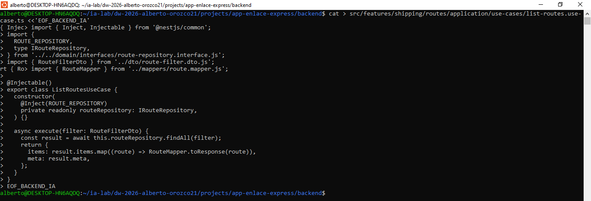

### 12.18 — features/shipping/routes/application/use-cases/update-route.use-case.ts

Caso de uso (aplicación). Orquesta dominio + repositorio. El controller solo lo invoca.

**Archivo:** `src/features/shipping/routes/application/use-cases/update-route.use-case.ts`

```bash
mkdir -p src/features/shipping/routes/application/use-cases
cat > src/features/shipping/routes/application/use-cases/update-route.use-case.ts <<'EOF_BACKEND_IA'
import { Inject, Injectable } from '@nestjs/common';
import { RouteNotFoundException } from '../../domain/exceptions/route-not-found.exception.js';
import {
  ROUTE_REPOSITORY,
  type IRouteRepository,
} from '../../domain/interfaces/route-repository.interface.js';
import { UpdateRouteDto } from '../dto/update-route.dto.js';
import { RouteMapper } from '../mappers/route.mapper.js';

@Injectable()
export class UpdateRouteUseCase {
  constructor(
    @Inject(ROUTE_REPOSITORY)
    private readonly routeRepository: IRouteRepository,
  ) {}

  async execute(id: number, dto: UpdateRouteDto) {
    const route = await this.routeRepository.findById(id);
    if (!route) {
      throw new RouteNotFoundException(id);
    }

    route.update({
      name: dto.name,
      coverageZone: dto.coverageZone,
      date: dto.date ? new Date(dto.date) : undefined,
      startTime: dto.startTime ? new Date(dto.startTime) : undefined,
      endTime: dto.endTime ? new Date(dto.endTime) : undefined,
      status: dto.status,
    });

    const updated = await this.routeRepository.update(route);
    return RouteMapper.toResponse(updated);
  }
}
EOF_BACKEND_IA
```

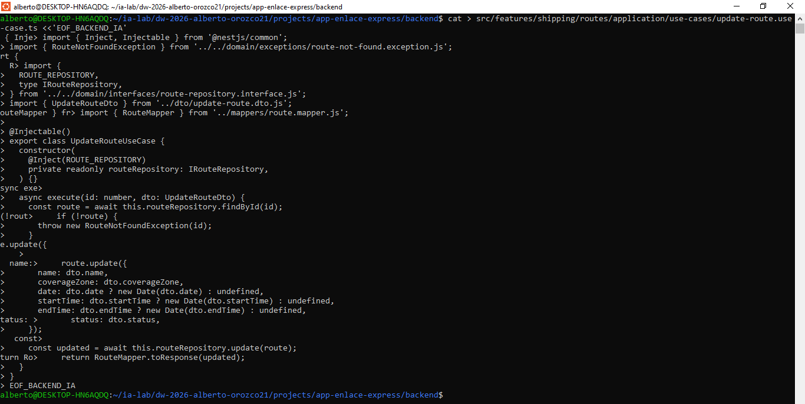

### 12.19 — features/shipping/routes/presentation/http/serializers/route.serializer.ts

Serializer de presentación (forma estable de la respuesta HTTP).

**Archivo:** `src/features/shipping/routes/presentation/http/serializers/route.serializer.ts`

```bash
mkdir -p src/features/shipping/routes/presentation/http/serializers
cat > src/features/shipping/routes/presentation/http/serializers/route.serializer.ts <<'EOF_BACKEND_IA'
import { Route } from '../../../domain/entities/route.entity.js';
import { RouteResponseDto } from '../../../application/dto/route-response.dto.js';
import { RouteMapper } from '../../../application/mappers/route.mapper.js';

export class RouteSerializer {
  static serialize(entity: Route): RouteResponseDto {
    return RouteMapper.toResponse(entity);
  }
}
EOF_BACKEND_IA
```

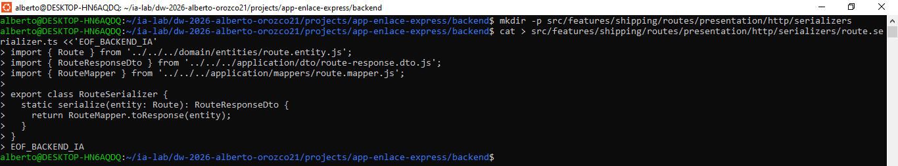

### 12.20 — features/shipping/routes/presentation/http/controllers/routes.controller.ts

Controller delgado: valida DTO, llama use-case, devuelve respuesta.

**Archivo:** `src/features/shipping/routes/presentation/http/controllers/routes.controller.ts`

```bash
mkdir -p src/features/shipping/routes/presentation/http/controllers
cat > src/features/shipping/routes/presentation/http/controllers/routes.controller.ts <<'EOF_BACKEND_IA'
import {
  Body,
  Controller,
  Delete,
  Get,
  HttpCode,
  HttpStatus,
  Param,
  Patch,
  Post,
  Query,
} from '@nestjs/common';
import {
  ApiCreatedResponse,
  ApiNoContentResponse,
  ApiOkResponse,
  ApiOperation,
  ApiTags,
} from '@nestjs/swagger';
import { ParsePositiveIntPipe } from '../../../../../../common/pipes/parse-positive-int.pipe.js';
import { CreateRouteDto } from '../../../application/dto/create-route.dto.js';
import { UpdateRouteDto } from '../../../application/dto/update-route.dto.js';
import { RouteFilterDto } from '../../../application/dto/route-filter.dto.js';
import { RouteResponseDto } from '../../../application/dto/route-response.dto.js';
import { CreateRouteUseCase } from '../../../application/use-cases/create-route.use-case.js';
import { UpdateRouteUseCase } from '../../../application/use-cases/update-route.use-case.js';
import { DeleteRouteUseCase } from '../../../application/use-cases/delete-route.use-case.js';
import { GetRouteUseCase } from '../../../application/use-cases/get-route.use-case.js';
import { ListRoutesUseCase } from '../../../application/use-cases/list-routes.use-case.js';

@ApiTags('Routes')
@Controller('routes')
export class RoutesController {
  constructor(
    private readonly createRouteUseCase: CreateRouteUseCase,
    private readonly updateRouteUseCase: UpdateRouteUseCase,
    private readonly deleteRouteUseCase: DeleteRouteUseCase,
    private readonly getRouteUseCase: GetRouteUseCase,
    private readonly listRoutesUseCase: ListRoutesUseCase,
  ) {}

  @Post()
  @ApiOperation({ summary: 'Crear una ruta' })
  @ApiCreatedResponse({ type: RouteResponseDto })
  create(@Body() dto: CreateRouteDto) {
    return this.createRouteUseCase.execute(dto);
  }

  @Get()
  @ApiOperation({ summary: 'Listar rutas (opcionalmente por mensajero o estado)' })
  @ApiOkResponse({ type: [RouteResponseDto] })
  findAll(@Query() filter: RouteFilterDto) {
    return this.listRoutesUseCase.execute(filter);
  }

  @Get(':id')
  @ApiOperation({ summary: 'Obtener una ruta por ID' })
  @ApiOkResponse({ type: RouteResponseDto })
  findOne(@Param('id', ParsePositiveIntPipe) id: number) {
    return this.getRouteUseCase.execute(id);
  }

  @Patch(':id')
  @ApiOperation({ summary: 'Actualizar una ruta' })
  @ApiOkResponse({ type: RouteResponseDto })
  update(
    @Param('id', ParsePositiveIntPipe) id: number,
    @Body() dto: UpdateRouteDto,
  ) {
    return this.updateRouteUseCase.execute(id, dto);
  }

  @Delete(':id')
  @HttpCode(HttpStatus.NO_CONTENT)
  @ApiOperation({ summary: 'Eliminar una ruta' })
  @ApiNoContentResponse()
  remove(@Param('id', ParsePositiveIntPipe) id: number) {
    return this.deleteRouteUseCase.execute(id);
  }
}
EOF_BACKEND_IA
```

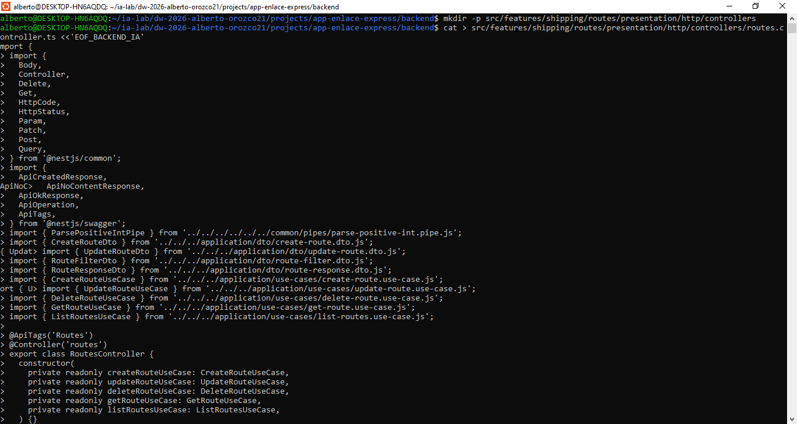

### 12.21 — features/shipping/routes/index.ts

Barrel export del feature para imports limpios.

**Archivo:** `src/features/shipping/routes/index.ts`

```bash
mkdir -p src/features/shipping/routes
cat > src/features/shipping/routes/index.ts <<'EOF_BACKEND_IA'
export { RoutesModule } from './routes.module.js';
EOF_BACKEND_IA
```

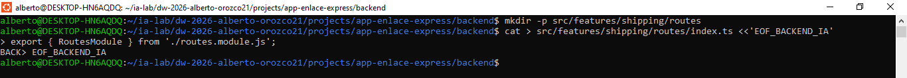

### 12.22 — features/shipping/routes/routes.module.ts

Módulo Nest del feature. Importa `CouriersModule` para poder inyectar `COURIER_REPOSITORY` y validar la FK.

**Archivo:** `src/features/shipping/routes/routes.module.ts`

```bash
mkdir -p src/features/shipping/routes
cat > src/features/shipping/routes/routes.module.ts <<'EOF_BACKEND_IA'
import { Module } from '@nestjs/common';
import { CouriersModule } from '../couriers/couriers.module.js';
import { ROUTE_REPOSITORY } from './domain/interfaces/route-repository.interface.js';
import { RouteRepository } from './infrastructure/persistence/repositories/route.repository.js';
import { CreateRouteUseCase } from './application/use-cases/create-route.use-case.js';
import { UpdateRouteUseCase } from './application/use-cases/update-route.use-case.js';
import { DeleteRouteUseCase } from './application/use-cases/delete-route.use-case.js';
import { GetRouteUseCase } from './application/use-cases/get-route.use-case.js';
import { ListRoutesUseCase } from './application/use-cases/list-routes.use-case.js';
import { RoutesController } from './presentation/http/controllers/routes.controller.js';

@Module({
  imports: [CouriersModule],
  controllers: [RoutesController],
  providers: [
    RouteRepository,
    { provide: ROUTE_REPOSITORY, useExisting: RouteRepository },
    CreateRouteUseCase,
    UpdateRouteUseCase,
    DeleteRouteUseCase,
    GetRouteUseCase,
    ListRoutesUseCase,
  ],
  exports: [ROUTE_REPOSITORY],
})
export class RoutesModule {}
EOF_BACKEND_IA
```

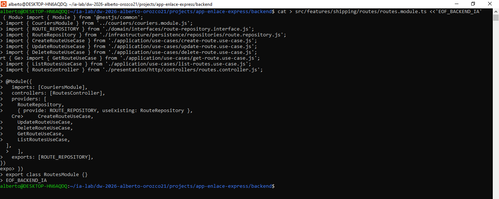

### 12.23 — Actualizar courier.model.ts (cerrar la asociación)

Vuelve al modelo de Mensajero (fase 11) y agrega `@HasMany(() => RouteModel)` con import estático.

**Archivo:** `src/features/shipping/couriers/infrastructure/persistence/models/courier.model.ts`

```bash
mkdir -p src/features/shipping/couriers/infrastructure/persistence/models
cat > src/features/shipping/couriers/infrastructure/persistence/models/courier.model.ts <<'EOF_BACKEND_IA'
import {
  AutoIncrement,
  Column,
  CreatedAt,
  DataType,
  HasMany,
  Model,
  PrimaryKey,
  Table,
  UpdatedAt,
} from 'sequelize-typescript';
import { VehicleType } from '../../../domain/enums/vehicle-type.enum.js';
import { RouteModel } from '../../../../routes/infrastructure/persistence/models/route.model.js';

@Table({ tableName: 'couriers' })
export class CourierModel extends Model {
  @PrimaryKey
  @AutoIncrement
  @Column(DataType.INTEGER)
  declare id: number;

  @Column({ type: DataType.STRING(150), allowNull: false })
  declare name: string;

  @Column({ type: DataType.STRING(30), allowNull: false, unique: true })
  declare documentId: string;

  @Column({ type: DataType.STRING(30), allowNull: true })
  declare phone: string | null;

  @Column({
    type: DataType.ENUM(...Object.values(VehicleType)),
    allowNull: false,
  })
  declare vehicleType: VehicleType;

  @Column({ type: DataType.STRING(15), allowNull: true })
  declare licensePlate: string | null;

  @Column({ type: DataType.STRING(100), allowNull: true })
  declare assignedZone: string | null;

  @Column({ type: DataType.BOOLEAN, allowNull: false, defaultValue: true })
  declare isActive: boolean;

  @CreatedAt
  declare createdAt: Date;

  @UpdatedAt
  declare updatedAt: Date;

}
EOF_BACKEND_IA
```

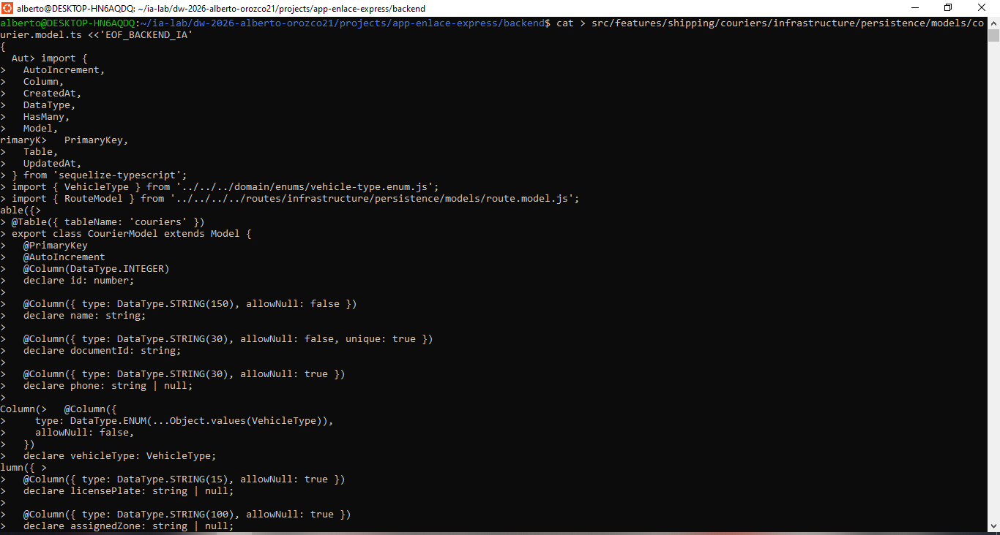

### 12.24 — Actualizar sequelize.factory.ts (registrar RouteModel)

Registra en ALL_MODELS solo los modelos ya creados (orden de dependencias).

**Archivo:** `src/infrastructure/database/sequelize/sequelize.factory.ts`

```bash
mkdir -p src/infrastructure/database/sequelize
cat > src/infrastructure/database/sequelize/sequelize.factory.ts <<'EOF_BACKEND_IA'
import { Sequelize } from 'sequelize-typescript';
import { DatabaseDialect } from '../../../config/environment/env.interface.js';
import { getSequelizeOptions } from './sequelize.options.js';

import { CompanyModel } from '../../../features/shipping/companies/infrastructure/persistence/models/company.model.js';
import { ContactModel } from '../../../features/shipping/contacts/infrastructure/persistence/models/contact.model.js';
import { AddressModel } from '../../../features/shipping/addresses/infrastructure/persistence/models/address.model.js';
import { RateModel } from '../../../features/shipping/rates/infrastructure/persistence/models/rate.model.js';
import { CourierModel } from '../../../features/shipping/couriers/infrastructure/persistence/models/courier.model.js';
import { RouteModel } from '../../../features/shipping/routes/infrastructure/persistence/models/route.model.js';

export const ALL_MODELS = [
  CompanyModel,
  ContactModel,
  AddressModel,
  RateModel,
  CourierModel,
  RouteModel,
];

async function loadDialectModule(moduleName: string): Promise<any> {
  // Proyecto ESM: require() no existe como global, se usa import() dinámico.
  const mod: any = await import(moduleName);
  return mod.default ?? mod;
}

export async function createSequelizeInstance(
  dialect: DatabaseDialect,
): Promise<Sequelize> {
  const options = getSequelizeOptions(dialect);

  let dialectModule: any;

  switch (dialect) {
    case DatabaseDialect.MySQL:
      dialectModule = await loadDialectModule('mysql2');
      break;
    case DatabaseDialect.Postgres:
      dialectModule = await loadDialectModule('pg');
      break;
    case DatabaseDialect.MSSQL:
      dialectModule = await loadDialectModule('tedious');
      break;
    case DatabaseDialect.Oracle:
      dialectModule = await loadDialectModule('oracledb');
      break;
    default:
      throw new Error(`Dialecto no soportado: ${dialect}`);
  }

  const sequelize = new Sequelize({
    ...options,
    dialectModule,
    models: ALL_MODELS,
  } as any);

  try {
    await sequelize.authenticate();
    console.log(`✅ Conexión exitosa a ${dialect.toUpperCase()}`);
  } catch (error: any) {
    console.error(
      `❌ Error conectando a ${dialect.toUpperCase()}:`,
      error.message,
    );
    throw error;
  }

  if (process.env.NODE_ENV !== 'production') {
    await sequelize.sync({ alter: false });
    console.log('✅ Tablas sincronizadas');
  }

  return sequelize;
}
EOF_BACKEND_IA
```

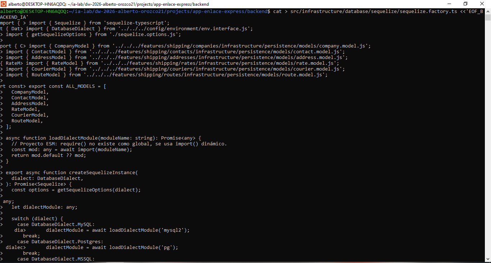

### 12.25 — Actualizar shipping.module.ts

Agrega el feature module de negocio recién terminado.

**Archivo:** `src/features/shipping/shipping.module.ts`

```bash
mkdir -p src/features/shipping
cat > src/features/shipping/shipping.module.ts <<'EOF_BACKEND_IA'
import { Module } from '@nestjs/common';
import { CompaniesModule } from './companies/companies.module.js';
import { ContactsModule } from './contacts/contacts.module.js';
import { AddressesModule } from './addresses/addresses.module.js';
import { RatesModule } from './rates/rates.module.js';
import { CouriersModule } from './couriers/couriers.module.js';
import { RoutesModule } from './routes/routes.module.js';

@Module({
  imports: [
    CompaniesModule,
    ContactsModule,
    AddressesModule,
    RatesModule,
    CouriersModule,
    RoutesModule,
  ],
  exports: [
    CompaniesModule,
    ContactsModule,
    AddressesModule,
    RatesModule,
    CouriersModule,
    RoutesModule,
  ],
})
export class ShippingModule {}
EOF_BACKEND_IA
```

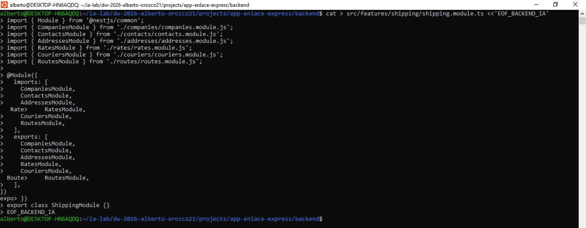

### 12.26 — Actualizar database-seeder.service.ts

Ejecuta seeders en orden de dependencias: ..., mensajeros, luego rutas.

**Archivo:** `src/infrastructure/database/seeders/database-seeder.service.ts`

```bash
mkdir -p src/infrastructure/database/seeders
cat > src/infrastructure/database/seeders/database-seeder.service.ts <<'EOF_BACKEND_IA'
import { Injectable, Logger, OnModuleInit } from '@nestjs/common';
import { seedCompanies } from '../../../features/shipping/companies/infrastructure/persistence/seeders/companies.seeder.js';
import { seedContacts } from '../../../features/shipping/contacts/infrastructure/persistence/seeders/contacts.seeder.js';
import { seedAddresses } from '../../../features/shipping/addresses/infrastructure/persistence/seeders/addresses.seeder.js';
import { seedRates } from '../../../features/shipping/rates/infrastructure/persistence/seeders/rates.seeder.js';
import { seedCouriers } from '../../../features/shipping/couriers/infrastructure/persistence/seeders/couriers.seeder.js';
import { seedRoutes } from '../../../features/shipping/routes/infrastructure/persistence/seeders/routes.seeder.js';

/**
 * Ejecuta seeders en orden de dependencias.
 * Solo en entornos no productivos.
 */
@Injectable()
export class DatabaseSeederService implements OnModuleInit {
  private readonly logger = new Logger(DatabaseSeederService.name);

  async onModuleInit(): Promise<void> {
    if (process.env.NODE_ENV === 'production') {
      return;
    }

    try {
      await seedCompanies();
      await seedContacts();
      await seedAddresses();
      await seedRates();
      await seedCouriers();
      await seedRoutes();
      this.logger.log('✅ Seeders ejecutados');
    } catch (error: any) {
      this.logger.error(`❌ Error en seeders: ${error.message}`, error.stack);
      throw error;
    }
  }
}
EOF_BACKEND_IA
```

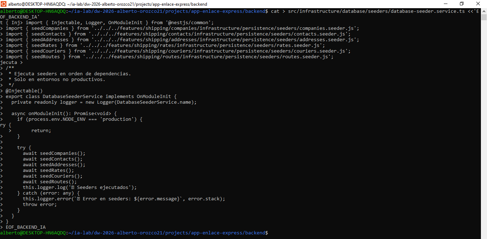

### 12.27 — Verificar tabla física `routes` y API

`app.module.ts` no necesita cambios: `ShippingModule` ya expone `RoutesModule`.

Arranca la app. Debe crear/sync tabla `routes` (con FK a `couriers`), correr seeder y exponer `/api/routes`. Prueba list/create en Swagger o curl, y confirma que `GET /api/routes?courierId=1&status=planificada` filtra correctamente, y que crear una ruta con `endTime` anterior a `startTime` falla (400).

```bash
npm run start:dev
```

**Consola**

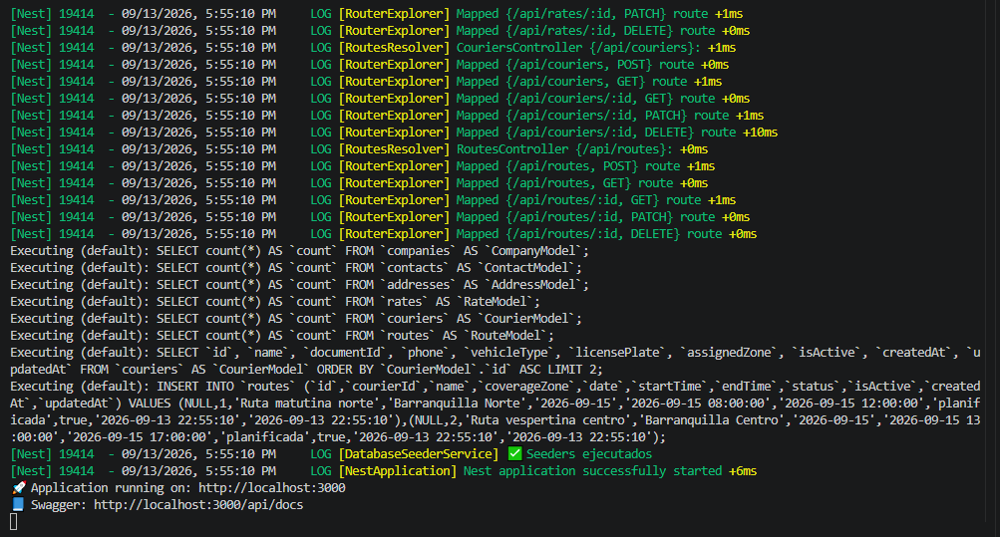

**/api/routes**

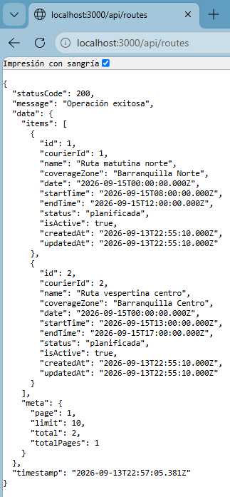

--------------------------------------------------------------------------------------------------

## FASE 13 — `12_BUSINESS_INVOICES`

### Business — Invoices / Factura (patrón completo CA)

> **Objetivo de la fase:** Séptima entidad de negocio de EnlaceExpress: Factura, que pertenece a una Empresa (`companyId`). Introduce un ciclo de vida propio (`pendiente → pagada` / `pendiente → vencida → pagada` / `→ anulada`) con transiciones controladas en el dominio, en vez de un `update` genérico. Mismo patrón de asociación real que Contacto/Direccion → Empresa. Orden lógico: dominio → infraestructura → aplicación → presentación → módulo → cableado → verificación.

#### 13.1 — features/shipping/invoices/domain/enums/invoice-status.enum.ts

Enum de dominio propio del feature.

**Archivo:** `src/features/shipping/invoices/domain/enums/invoice-status.enum.ts`

```bash
mkdir -p src/features/shipping/invoices/domain/enums
cat > src/features/shipping/invoices/domain/enums/invoice-status.enum.ts <<'EOF_BACKEND_IA'
export enum InvoiceStatus {
  PENDING = 'pendiente',
  PAID = 'pagada',
  OVERDUE = 'vencida',
  VOIDED = 'anulada',
}
EOF_BACKEND_IA
```

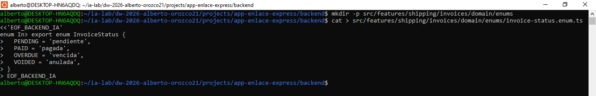

### 13.2 — features/shipping/invoices/domain/entities/invoice.entity.ts

Entidad de dominio. `total` se calcula siempre (`subtotal + taxes`), nunca se recibe como input. Las transiciones de estado (`markAsPaid`, `markAsOverdue`, `void`) son los únicos caminos válidos para cambiar `status`; `update()` solo toca datos mientras la factura está `PENDING`.

**Archivo:** `src/features/shipping/invoices/domain/entities/invoice.entity.ts`

```bash
mkdir -p src/features/shipping/invoices/domain/entities
cat > src/features/shipping/invoices/domain/entities/invoice.entity.ts <<'EOF_BACKEND_IA'
import { InvoiceStatus } from '../enums/invoice-status.enum.js';

export interface InvoiceProps {
  id?: number;
  companyId: number;
  number: string;
  periodStart: Date;
  periodEnd: Date;
  issueDate: Date;
  subtotal: number;
  taxes: number;
  total?: number;
  status?: InvoiceStatus;
  paymentDate?: Date;
  createdAt?: Date;
  updatedAt?: Date;
}

export class Invoice {
  id?: number;
  companyId: number;
  number: string;
  periodStart: Date;
  periodEnd: Date;
  issueDate: Date;
  subtotal: number;
  taxes: number;
  total: number;
  status: InvoiceStatus;
  paymentDate?: Date;
  createdAt?: Date;
  updatedAt?: Date;

  private constructor(props: InvoiceProps) {
    this.id = props.id;
    this.companyId = props.companyId;
    this.number = props.number;
    this.periodStart = props.periodStart;
    this.periodEnd = props.periodEnd;
    this.issueDate = props.issueDate;
    this.subtotal = props.subtotal;
    this.taxes = props.taxes;
    this.total = props.total ?? Invoice.computeTotal(props.subtotal, props.taxes);
    this.status = props.status ?? InvoiceStatus.PENDING;
    this.paymentDate = props.paymentDate;
    this.createdAt = props.createdAt;
    this.updatedAt = props.updatedAt;
  }

  private static computeTotal(subtotal: number, taxes: number): number {
    return Number((subtotal + taxes).toFixed(2));
  }

  private static validateAmounts(subtotal: number, taxes: number): void {
    if (subtotal === undefined || subtotal < 0) {
      throw new Error('El subtotal debe ser un número positivo');
    }
    if (taxes === undefined || taxes < 0) {
      throw new Error('Los impuestos no pueden ser negativos');
    }
  }

  static create(
    props: Omit<
      InvoiceProps,
      'id' | 'total' | 'status' | 'paymentDate' | 'createdAt' | 'updatedAt'
    >,
  ): Invoice {
    if (!props.companyId) {
      throw new Error('La factura debe pertenecer a una empresa');
    }

    if (!props.number?.trim()) {
      throw new Error('El número de factura es requerido');
    }

    if (!props.periodStart || !props.periodEnd) {
      throw new Error('El periodo de facturación es requerido');
    }

    if (props.periodEnd < props.periodStart) {
      throw new Error('El fin del periodo debe ser posterior o igual al inicio');
    }

    if (!props.issueDate) {
      throw new Error('La fecha de emisión es requerida');
    }

    Invoice.validateAmounts(props.subtotal, props.taxes);

    return new Invoice(props);
  }

  static reconstitute(props: InvoiceProps): Invoice {
    return new Invoice(props);
  }

  /** Solo permite editar datos mientras la factura está pendiente. */
  update(
    props: Partial<
      Pick<
        InvoiceProps,
        'periodStart' | 'periodEnd' | 'issueDate' | 'subtotal' | 'taxes'
      >
    >,
  ): void {
    if (this.status !== InvoiceStatus.PENDING) {
      throw new Error(
        `No se puede modificar una factura en estado '${this.status}'`,
      );
    }

    const nextPeriodStart = props.periodStart ?? this.periodStart;
    const nextPeriodEnd = props.periodEnd ?? this.periodEnd;

    if (nextPeriodEnd < nextPeriodStart) {
      throw new Error('El fin del periodo debe ser posterior o igual al inicio');
    }

    const nextSubtotal = props.subtotal ?? this.subtotal;
    const nextTaxes = props.taxes ?? this.taxes;
    Invoice.validateAmounts(nextSubtotal, nextTaxes);

    this.periodStart = nextPeriodStart;
    this.periodEnd = nextPeriodEnd;
    if (props.issueDate !== undefined) this.issueDate = props.issueDate;
    this.subtotal = nextSubtotal;
    this.taxes = nextTaxes;
    this.total = Invoice.computeTotal(nextSubtotal, nextTaxes);
  }

  markAsPaid(paymentDate?: Date): void {
    if (this.status !== InvoiceStatus.PENDING && this.status !== InvoiceStatus.OVERDUE) {
      throw new Error(
        `Solo una factura pendiente o vencida puede marcarse como pagada (estado actual: '${this.status}')`,
      );
    }
    this.status = InvoiceStatus.PAID;
    this.paymentDate = paymentDate ?? new Date();
  }

  markAsOverdue(): void {
    if (this.status !== InvoiceStatus.PENDING) {
      throw new Error(
        `Solo una factura pendiente puede marcarse como vencida (estado actual: '${this.status}')`,
      );
    }
    this.status = InvoiceStatus.OVERDUE;
  }

  void(): void {
    if (this.status === InvoiceStatus.PAID) {
      throw new Error('No se puede anular una factura ya pagada');
    }
    this.status = InvoiceStatus.VOIDED;
  }
}
EOF_BACKEND_IA
```

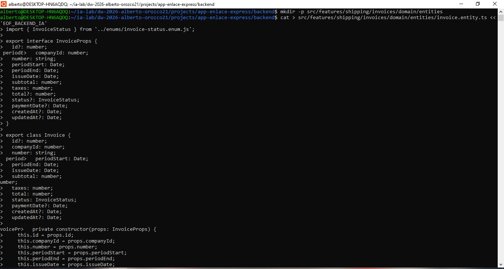

### 13.3 — features/shipping/invoices/domain/exceptions/invoice-number-already-exists.exception.ts

Excepción de dominio. El caso de uso la lanza; el filter HTTP la traduce a status code.

**Archivo:** `src/features/shipping/invoices/domain/exceptions/invoice-number-already-exists.exception.ts`

```bash
mkdir -p src/features/shipping/invoices/domain/exceptions
cat > src/features/shipping/invoices/domain/exceptions/invoice-number-already-exists.exception.ts <<'EOF_BACKEND_IA'
import { DomainException } from '../../../../../common/exceptions/domain.exception.js';

export class InvoiceNumberAlreadyExistsException extends DomainException {
  constructor(number: string) {
    super(`El número de factura '${number}' ya está registrado`);
  }
}
EOF_BACKEND_IA
```

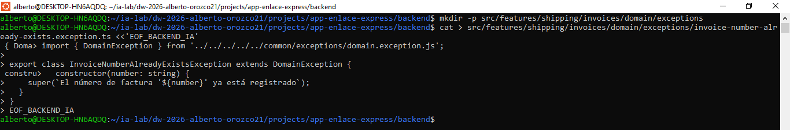

#### 13.4 — features/shipping/invoices/domain/exceptions/invoice-not-found.exception.ts

Excepción de dominio. El caso de uso la lanza; el filter HTTP la traduce a status code.

**Archivo:** `src/features/shipping/invoices/domain/exceptions/invoice-not-found.exception.ts`

```bash
mkdir -p src/features/shipping/invoices/domain/exceptions
cat > src/features/shipping/invoices/domain/exceptions/invoice-not-found.exception.ts <<'EOF_BACKEND_IA'
import { EntityNotFoundException } from '../../../../../common/exceptions/entity-not-found.exception.js';

export class InvoiceNotFoundException extends EntityNotFoundException {
  constructor(id: number) {
    super('Factura', id);
  }
}
EOF_BACKEND_IA
```

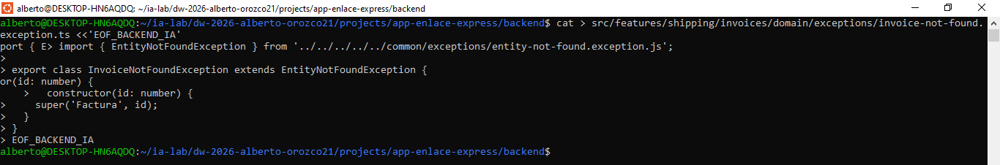

### 13.5 — features/shipping/invoices/domain/interfaces/invoice-repository.interface.ts

Puerto (contrato) del repositorio. La aplicación depende de esta interface, no de Sequelize.

**Archivo:** `src/features/shipping/invoices/domain/interfaces/invoice-repository.interface.ts`

```bash
mkdir -p src/features/shipping/invoices/domain/interfaces
cat > src/features/shipping/invoices/domain/interfaces/invoice-repository.interface.ts <<'EOF_BACKEND_IA'
import { PaginatedResult } from '../../../../../common/interfaces/pagination.interface.js';
import { InvoiceStatus } from '../enums/invoice-status.enum.js';
import { Invoice } from '../entities/invoice.entity.js';

export const INVOICE_REPOSITORY = 'INVOICE_REPOSITORY';

export interface InvoiceFindAllParams {
  page?: number;
  limit?: number;
  search?: string;
  companyId?: number;
  status?: InvoiceStatus;
}

export interface IInvoiceRepository {
  create(invoice: Invoice): Promise<Invoice>;
  update(invoice: Invoice): Promise<Invoice>;
  delete(id: number): Promise<void>;
  findById(id: number): Promise<Invoice | null>;
  findByNumber(number: string): Promise<Invoice | null>;
  findAll(params: InvoiceFindAllParams): Promise<PaginatedResult<Invoice>>;
}
EOF_BACKEND_IA
```

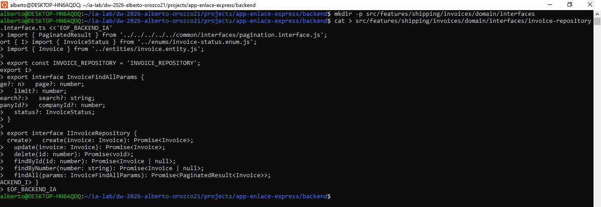

### 13.6 — features/shipping/invoices/infrastructure/persistence/models/invoice.model.ts

Modelo Sequelize (`@Table`). Incluye la FK real y `@BelongsTo(() => CompanyModel)`.

**Archivo:** `src/features/shipping/invoices/infrastructure/persistence/models/invoice.model.ts`

```bash
mkdir -p src/features/shipping/invoices/infrastructure/persistence/models
cat > src/features/shipping/invoices/infrastructure/persistence/models/invoice.model.ts <<'EOF_BACKEND_IA'
import {
  AutoIncrement,
  BelongsTo,
  Column,
  CreatedAt,
  DataType,
  ForeignKey,
  Model,
  PrimaryKey,
  Table,
  UpdatedAt,
} from 'sequelize-typescript';
import { CompanyModel } from '../../../../companies/infrastructure/persistence/models/company.model.js';
import { InvoiceStatus } from '../../../domain/enums/invoice-status.enum.js';

@Table({ tableName: 'invoices' })
export class InvoiceModel extends Model {
  @PrimaryKey
  @AutoIncrement
  @Column(DataType.INTEGER)
  declare id: number;

  @ForeignKey(() => CompanyModel)
  @Column({ type: DataType.INTEGER, allowNull: false })
  declare companyId: number;

  @BelongsTo(() => CompanyModel)
  declare company: CompanyModel;

  @Column({ type: DataType.STRING(30), allowNull: false, unique: true })
  declare number: string;

  @Column({ type: DataType.DATEONLY, allowNull: false })
  declare periodStart: string;

  @Column({ type: DataType.DATEONLY, allowNull: false })
  declare periodEnd: string;

  @Column({ type: DataType.DATEONLY, allowNull: false })
  declare issueDate: string;

  @Column({ type: DataType.DECIMAL(14, 2), allowNull: false })
  declare subtotal: number;

  @Column({ type: DataType.DECIMAL(14, 2), allowNull: false })
  declare taxes: number;

  @Column({ type: DataType.DECIMAL(14, 2), allowNull: false })
  declare total: number;

  @Column({
    type: DataType.ENUM(...Object.values(InvoiceStatus)),
    allowNull: false,
    defaultValue: InvoiceStatus.PENDING,
  })
  declare status: InvoiceStatus;

  @Column({ type: DataType.DATE, allowNull: true })
  declare paymentDate: Date | null;

  @CreatedAt
  declare createdAt: Date;

  @UpdatedAt
  declare updatedAt: Date;
}
EOF_BACKEND_IA
```

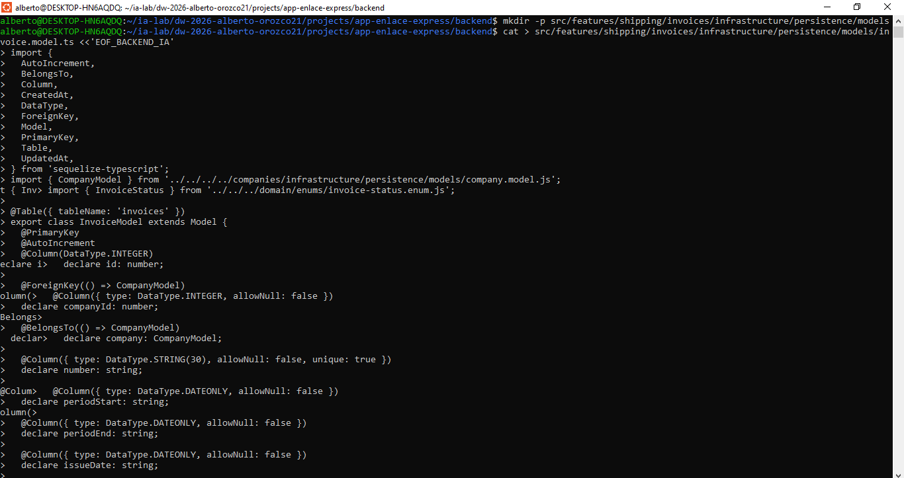

### 13.7 — features/shipping/invoices/infrastructure/persistence/repositories/invoice.repository.ts

Adaptador del repositorio: implementa el puerto de dominio con Sequelize.

**Archivo:** `src/features/shipping/invoices/infrastructure/persistence/repositories/invoice.repository.ts`

```bash
mkdir -p src/features/shipping/invoices/infrastructure/persistence/repositories
cat > src/features/shipping/invoices/infrastructure/persistence/repositories/invoice.repository.ts <<'EOF_BACKEND_IA'
import { Injectable } from '@nestjs/common';
import { Op } from 'sequelize';
import {
  buildPaginatedResult,
  normalizePagination,
} from '../../../../../../common/utils/pagination.util.js';
import { Invoice } from '../../../domain/entities/invoice.entity.js';
import {
  InvoiceFindAllParams,
  IInvoiceRepository,
} from '../../../domain/interfaces/invoice-repository.interface.js';
import { InvoiceMapper } from '../../../application/mappers/invoice.mapper.js';
import { InvoiceModel } from '../models/invoice.model.js';

@Injectable()
export class InvoiceRepository implements IInvoiceRepository {
  async create(invoice: Invoice): Promise<Invoice> {
    const model = await InvoiceModel.create(
      InvoiceMapper.toPersistence(invoice),
    );
    return InvoiceMapper.toDomain(model);
  }

  async update(invoice: Invoice): Promise<Invoice> {
    await InvoiceModel.update(InvoiceMapper.toPersistence(invoice), {
      where: { id: invoice.id },
    });
    const updated = await InvoiceModel.findByPk(invoice.id!);
    return InvoiceMapper.toDomain(updated!);
  }

  async delete(id: number): Promise<void> {
    await InvoiceModel.destroy({ where: { id } });
  }

  async findById(id: number): Promise<Invoice | null> {
    const model = await InvoiceModel.findByPk(id);
    return model ? InvoiceMapper.toDomain(model) : null;
  }

  async findByNumber(number: string): Promise<Invoice | null> {
    const model = await InvoiceModel.findOne({ where: { number } });
    return model ? InvoiceMapper.toDomain(model) : null;
  }

  async findAll(params: InvoiceFindAllParams) {
    const { page, limit, offset } = normalizePagination(
      params.page,
      params.limit,
    );

    const where: Record<string, unknown> = {};

    if (params.companyId) {
      where.companyId = params.companyId;
    }

    if (params.status) {
      where.status = params.status;
    }

    if (params.search) {
      where[Op.or as unknown as string] = [
        { number: { [Op.like]: `%${params.search}%` } },
      ];
    }

    const { rows, count } = await InvoiceModel.findAndCountAll({
      where,
      limit,
      offset,
      order: [['issueDate', 'DESC']],
    });

    return buildPaginatedResult(
      rows.map((row) => InvoiceMapper.toDomain(row)),
      count,
      page,
      limit,
    );
  }
}
EOF_BACKEND_IA
```

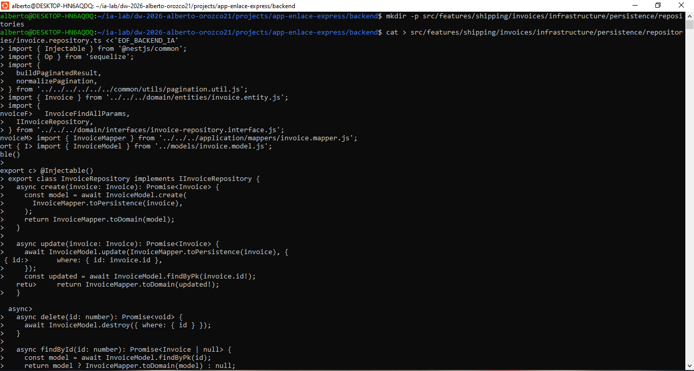

### 13.8 — features/shipping/invoices/infrastructure/persistence/migrations/create-invoices-table.migration.ts

Migración documental/auxiliar de la tabla. En dev el sync de Sequelize crea el esquema.

**Archivo:** `src/features/shipping/invoices/infrastructure/persistence/migrations/create-invoices-table.migration.ts`

```bash
mkdir -p src/features/shipping/invoices/infrastructure/persistence/migrations
cat > src/features/shipping/invoices/infrastructure/persistence/migrations/create-invoices-table.migration.ts <<'EOF_BACKEND_IA'
export const createInvoicesTableMigration = {
  name: 'create-invoices-table',
  async up(): Promise<void> {
    // Sequelize sync handles table creation in development.
    // Production: CREATE TABLE invoices (id, companyId FK->companies, number UQ,
    //   periodStart, periodEnd, issueDate, subtotal, taxes, total, status,
    //   paymentDate, createdAt, updatedAt)
  },
  async down(): Promise<void> {
    // Production: DROP TABLE invoices
  },
};
EOF_BACKEND_IA
```

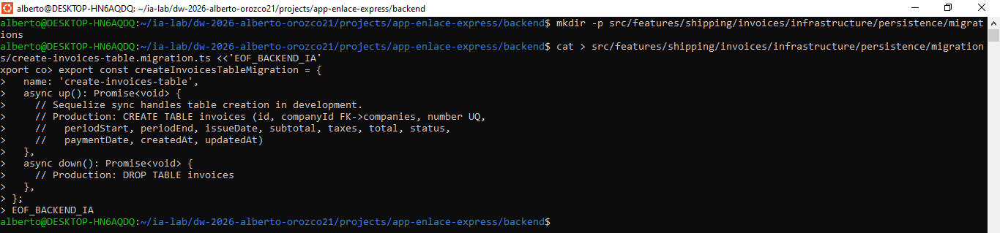

### 13.9 — features/shipping/invoices/infrastructure/persistence/seeders/invoices.seeder.ts

Seeder de datos iniciales. Depende de que ya existan empresas (fase 7).

**Archivo:** `src/features/shipping/invoices/infrastructure/persistence/seeders/invoices.seeder.ts`

```bash
mkdir -p src/features/shipping/invoices/infrastructure/persistence/seeders
cat > src/features/shipping/invoices/infrastructure/persistence/seeders/invoices.seeder.ts <<'EOF_BACKEND_IA'
import { InvoiceModel } from '../models/invoice.model.js';
import { CompanyModel } from '../../../../companies/infrastructure/persistence/models/company.model.js';
import { InvoiceStatus } from '../../../domain/enums/invoice-status.enum.js';

export async function seedInvoices(): Promise<void> {
  const count = await InvoiceModel.count();
  if (count > 0) {
    return;
  }

  const companies = await CompanyModel.findAll({
    limit: 2,
    order: [['id', 'ASC']],
  });

  if (companies.length === 0) {
    return;
  }

  const records = [
    {
      companyId: companies[0].id,
      number: 'FAC-2026-0001',
      periodStart: '2026-08-01',
      periodEnd: '2026-08-31',
      issueDate: '2026-09-01',
      subtotal: 450000,
      taxes: 85500,
      total: 535500,
      status: InvoiceStatus.PENDING,
      paymentDate: null,
    },
  ];

  if (companies[1]) {
    records.push({
      companyId: companies[1].id,
      number: 'FAC-2026-0002',
      periodStart: '2026-08-01',
      periodEnd: '2026-08-31',
      issueDate: '2026-09-01',
      subtotal: 210000,
      taxes: 39900,
      total: 249900,
      status: InvoiceStatus.PENDING,
      paymentDate: null,
    });
  }

  await InvoiceModel.bulkCreate(records);
}
EOF_BACKEND_IA
```

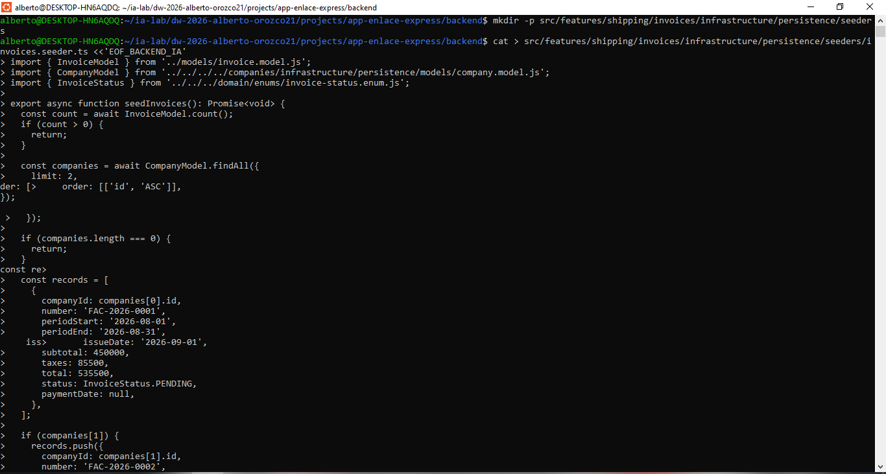

### 13.10 — features/shipping/invoices/application/dto/invoice-filter.dto.ts

DTO de entrada/salida HTTP con `class-validator` / Swagger. Incluye filtro por `companyId` y `status`.

**Archivo:** `src/features/shipping/invoices/application/dto/invoice-filter.dto.ts`

```bash
mkdir -p src/features/shipping/invoices/application/dto
cat > src/features/shipping/invoices/application/dto/invoice-filter.dto.ts <<'EOF_BACKEND_IA'
import { ApiPropertyOptional } from '@nestjs/swagger';
import { Type } from 'class-transformer';
import {
  IsEnum,
  IsInt,
  IsOptional,
  IsPositive,
  IsString,
  Min,
} from 'class-validator';
import { InvoiceStatus } from '../../domain/enums/invoice-status.enum.js';

export class InvoiceFilterDto {
  @ApiPropertyOptional({ example: 1, default: 1 })
  @IsOptional()
  @Type(() => Number)
  @IsInt()
  @Min(1)
  page?: number;

  @ApiPropertyOptional({ example: 10, default: 10 })
  @IsOptional()
  @Type(() => Number)
  @IsInt()
  @IsPositive()
  limit?: number;

  @ApiPropertyOptional({ example: 'FAC-2026' })
  @IsOptional()
  @IsString()
  search?: string;

  @ApiPropertyOptional({ example: 1 })
  @IsOptional()
  @Type(() => Number)
  @IsInt()
  @IsPositive()
  companyId?: number;

  @ApiPropertyOptional({ enum: InvoiceStatus, example: InvoiceStatus.PENDING })
  @IsOptional()
  @IsEnum(InvoiceStatus)
  status?: InvoiceStatus;
}
EOF_BACKEND_IA
```

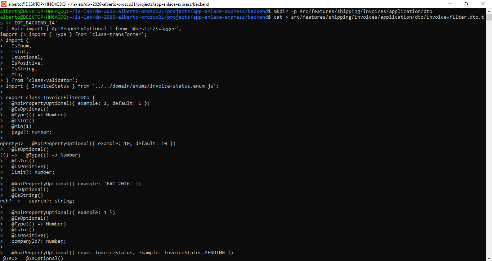

### 13.11 — features/shipping/invoices/application/dto/invoice-response.dto.ts

DTO de entrada/salida HTTP con `class-validator` / Swagger.

**Archivo:** `src/features/shipping/invoices/application/dto/invoice-response.dto.ts`

```bash
mkdir -p src/features/shipping/invoices/application/dto
cat > src/features/shipping/invoices/application/dto/invoice-response.dto.ts <<'EOF_BACKEND_IA'
import { ApiProperty, ApiPropertyOptional } from '@nestjs/swagger';
import { InvoiceStatus } from '../../domain/enums/invoice-status.enum.js';

export class InvoiceResponseDto {
  @ApiProperty({ example: 1 })
  id: number;

  @ApiProperty({ example: 1 })
  companyId: number;

  @ApiProperty({ example: 'FAC-2026-0001' })
  number: string;

  @ApiProperty({ example: '2026-08-01' })
  periodStart: Date;

  @ApiProperty({ example: '2026-08-31' })
  periodEnd: Date;

  @ApiProperty({ example: '2026-09-01' })
  issueDate: Date;

  @ApiProperty({ example: 450000 })
  subtotal: number;

  @ApiProperty({ example: 85500 })
  taxes: number;

  @ApiProperty({ example: 535500 })
  total: number;

  @ApiProperty({ enum: InvoiceStatus, example: InvoiceStatus.PENDING })
  status: InvoiceStatus;

  @ApiPropertyOptional({ example: '2026-09-10T15:00:00Z' })
  paymentDate?: Date;

  @ApiProperty()
  createdAt: Date;

  @ApiProperty()
  updatedAt: Date;
}
EOF_BACKEND_IA
```

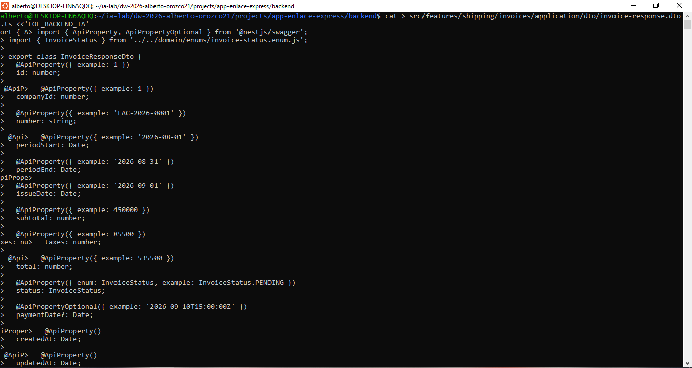

#### 13.12 — features/shipping/invoices/application/dto/create-invoice.dto.ts

DTO de entrada/salida HTTP con `class-validator` / Swagger. Nota: no incluye `total` (se calcula) ni `status` (siempre nace `pendiente`).

**Archivo:** `src/features/shipping/invoices/application/dto/create-invoice.dto.ts`

```bash
mkdir -p src/features/shipping/invoices/application/dto
cat > src/features/shipping/invoices/application/dto/create-invoice.dto.ts <<'EOF_BACKEND_IA'
import { ApiProperty } from '@nestjs/swagger';
import {
  IsDateString,
  IsInt,
  IsNotEmpty,
  IsNumber,
  IsPositive,
  IsString,
  Min,
} from 'class-validator';

export class CreateInvoiceDto {
  @ApiProperty({ example: 1 })
  @IsInt()
  @IsPositive()
  companyId: number;

  @ApiProperty({ example: 'FAC-2026-0001' })
  @IsString()
  @IsNotEmpty()
  number: string;

  @ApiProperty({ example: '2026-08-01' })
  @IsDateString()
  periodStart: string;

  @ApiProperty({ example: '2026-08-31' })
  @IsDateString()
  periodEnd: string;

  @ApiProperty({ example: '2026-09-01' })
  @IsDateString()
  issueDate: string;

  @ApiProperty({ example: 450000 })
  @IsNumber()
  @Min(0)
  subtotal: number;

  @ApiProperty({ example: 85500 })
  @IsNumber()
  @Min(0)
  taxes: number;
}
EOF_BACKEND_IA
```

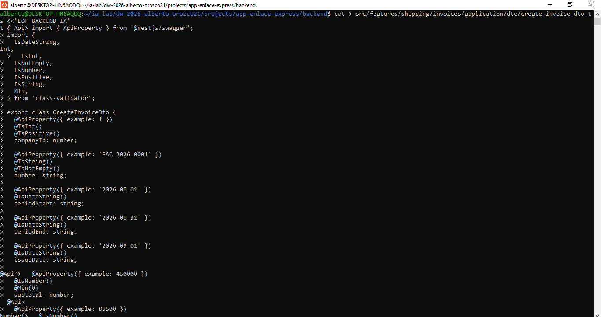


#### 13.13 — features/shipping/invoices/application/dto/update-invoice.dto.ts

DTO de actualización. `companyId` y `number` se excluyen: no cambian de empresa ni de número una vez creada la factura.

**Archivo:** `src/features/shipping/invoices/application/dto/update-invoice.dto.ts`

```bash
mkdir -p src/features/shipping/invoices/application/dto
cat > src/features/shipping/invoices/application/dto/update-invoice.dto.ts <<'EOF_BACKEND_IA'
import { OmitType, PartialType } from '@nestjs/mapped-types';
import { CreateInvoiceDto } from './create-invoice.dto.js';

export class UpdateInvoiceDto extends PartialType(
  OmitType(CreateInvoiceDto, ['companyId', 'number'] as const),
) {}
EOF_BACKEND_IA
```

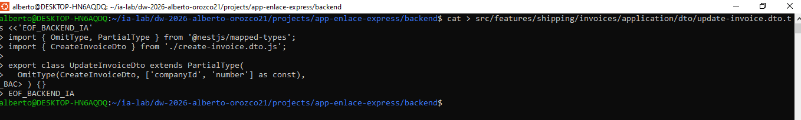


#### 13.14 — features/shipping/invoices/application/dto/mark-invoice-paid.dto.ts

DTO para la transición de pago. `paymentDate` es opcional (si no se envía, se usa la fecha actual).

**Archivo:** `src/features/shipping/invoices/application/dto/mark-invoice-paid.dto.ts`

```bash
mkdir -p src/features/shipping/invoices/application/dto
cat > src/features/shipping/invoices/application/dto/mark-invoice-paid.dto.ts <<'EOF_BACKEND_IA'
import { ApiPropertyOptional } from '@nestjs/swagger';
import { IsDateString, IsOptional } from 'class-validator';

export class MarkInvoicePaidDto {
  @ApiPropertyOptional({ example: '2026-09-10T15:00:00Z' })
  @IsOptional()
  @IsDateString()
  paymentDate?: string;
}
EOF_BACKEND_IA
```

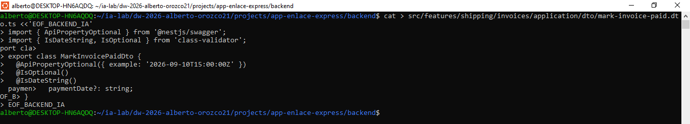

### 13.15 — features/shipping/invoices/application/mappers/invoice.mapper.ts

Mapper entre entidad de dominio y DTO de respuesta.

**Archivo:** `src/features/shipping/invoices/application/mappers/invoice.mapper.ts`

```bash
mkdir -p src/features/shipping/invoices/application/mappers
cat > src/features/shipping/invoices/application/mappers/invoice.mapper.ts <<'EOF_BACKEND_IA'
import { Invoice } from '../../domain/entities/invoice.entity.js';
import { InvoiceResponseDto } from '../dto/invoice-response.dto.js';
import { InvoiceModel } from '../../infrastructure/persistence/models/invoice.model.js';

export class InvoiceMapper {
  static toDomain(model: InvoiceModel): Invoice {
    return Invoice.reconstitute({
      id: model.id,
      companyId: model.companyId,
      number: model.number,
      periodStart: new Date(model.periodStart),
      periodEnd: new Date(model.periodEnd),
      issueDate: new Date(model.issueDate),
      subtotal: Number(model.subtotal),
      taxes: Number(model.taxes),
      total: Number(model.total),
      status: model.status,
      paymentDate: model.paymentDate ?? undefined,
      createdAt: model.createdAt,
      updatedAt: model.updatedAt,
    });
  }

  static toResponse(entity: Invoice): InvoiceResponseDto {
    return {
      id: entity.id!,
      companyId: entity.companyId,
      number: entity.number,
      periodStart: entity.periodStart,
      periodEnd: entity.periodEnd,
      issueDate: entity.issueDate,
      subtotal: entity.subtotal,
      taxes: entity.taxes,
      total: entity.total,
      status: entity.status,
      paymentDate: entity.paymentDate,
      createdAt: entity.createdAt!,
      updatedAt: entity.updatedAt!,
    };
  }

  static toPersistence(entity: Invoice): Partial<InvoiceModel> {
    return {
      id: entity.id,
      companyId: entity.companyId,
      number: entity.number,
      periodStart: entity.periodStart.toISOString().slice(0, 10) as any,
      periodEnd: entity.periodEnd.toISOString().slice(0, 10) as any,
      issueDate: entity.issueDate.toISOString().slice(0, 10) as any,
      subtotal: entity.subtotal,
      taxes: entity.taxes,
      total: entity.total,
      status: entity.status,
      paymentDate: entity.paymentDate ?? null,
    };
  }
}
EOF_BACKEND_IA
```

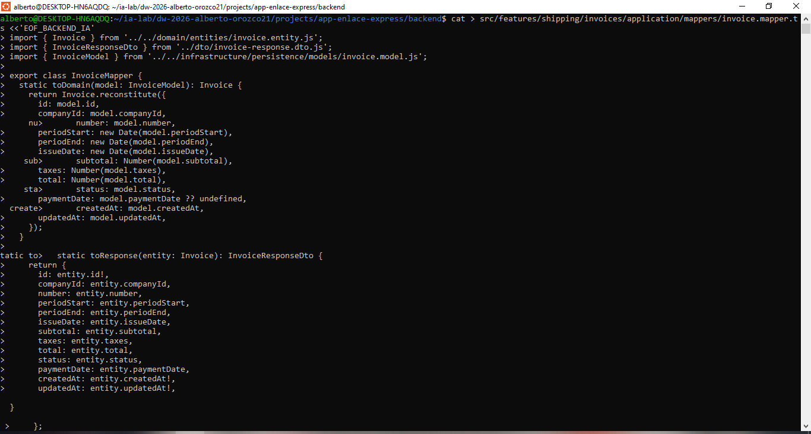

### 13.16 — features/shipping/invoices/application/use-cases/create-invoice.use-case.ts

Caso de uso. Verifica que la empresa exista y que el número de factura no esté repetido.

**Archivo:** `src/features/shipping/invoices/application/use-cases/create-invoice.use-case.ts`

```bash
mkdir -p src/features/shipping/invoices/application/use-cases
cat > src/features/shipping/invoices/application/use-cases/create-invoice.use-case.ts <<'EOF_BACKEND_IA'
import { Inject, Injectable } from '@nestjs/common';
import { CompanyNotFoundException } from '../../../companies/domain/exceptions/company-not-found.exception.js';
import {
  COMPANY_REPOSITORY,
  type ICompanyRepository,
} from '../../../companies/domain/interfaces/company-repository.interface.js';
import { InvoiceNumberAlreadyExistsException } from '../../domain/exceptions/invoice-number-already-exists.exception.js';
import { Invoice } from '../../domain/entities/invoice.entity.js';
import {
  INVOICE_REPOSITORY,
  type IInvoiceRepository,
} from '../../domain/interfaces/invoice-repository.interface.js';
import { CreateInvoiceDto } from '../dto/create-invoice.dto.js';
import { InvoiceMapper } from '../mappers/invoice.mapper.js';

@Injectable()
export class CreateInvoiceUseCase {
  constructor(
    @Inject(INVOICE_REPOSITORY)
    private readonly invoiceRepository: IInvoiceRepository,
    @Inject(COMPANY_REPOSITORY)
    private readonly companyRepository: ICompanyRepository,
  ) {}

  async execute(dto: CreateInvoiceDto) {
    const company = await this.companyRepository.findById(dto.companyId);
    if (!company) {
      throw new CompanyNotFoundException(dto.companyId);
    }

    const existing = await this.invoiceRepository.findByNumber(dto.number);
    if (existing) {
      throw new InvoiceNumberAlreadyExistsException(dto.number);
    }

    const invoice = Invoice.create({
      companyId: dto.companyId,
      number: dto.number,
      periodStart: new Date(dto.periodStart),
      periodEnd: new Date(dto.periodEnd),
      issueDate: new Date(dto.issueDate),
      subtotal: dto.subtotal,
      taxes: dto.taxes,
    });

    const created = await this.invoiceRepository.create(invoice);
    return InvoiceMapper.toResponse(created);
  }
}
EOF_BACKEND_IA
```

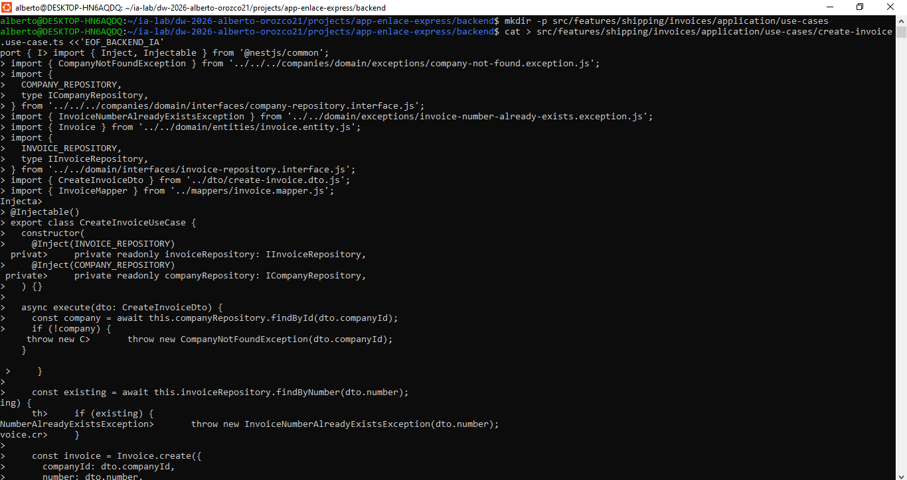


#### 13.17 — features/shipping/invoices/application/use-cases/delete-invoice.use-case.ts

Caso de uso. No permite eliminar una factura ya pagada.

**Archivo:** `src/features/shipping/invoices/application/use-cases/delete-invoice.use-case.ts`

```bash
mkdir -p src/features/shipping/invoices/application/use-cases
cat > src/features/shipping/invoices/application/use-cases/delete-invoice.use-case.ts <<'EOF_BACKEND_IA'
import { Inject, Injectable } from '@nestjs/common';
import { InvoiceStatus } from '../../domain/enums/invoice-status.enum.js';
import { InvoiceNotFoundException } from '../../domain/exceptions/invoice-not-found.exception.js';
import {
  INVOICE_REPOSITORY,
  type IInvoiceRepository,
} from '../../domain/interfaces/invoice-repository.interface.js';

@Injectable()
export class DeleteInvoiceUseCase {
  constructor(
    @Inject(INVOICE_REPOSITORY)
    private readonly invoiceRepository: IInvoiceRepository,
  ) {}

  async execute(id: number): Promise<void> {
    const invoice = await this.invoiceRepository.findById(id);
    if (!invoice) {
      throw new InvoiceNotFoundException(id);
    }

    if (invoice.status === InvoiceStatus.PAID) {
      throw new Error('No se puede eliminar una factura ya pagada');
    }

    await this.invoiceRepository.delete(id);
  }
}
EOF_BACKEND_IA
```

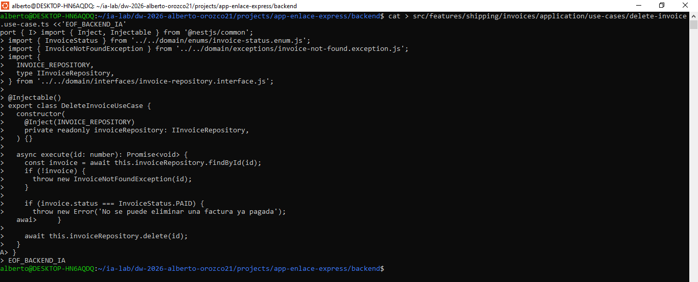

#### 13.18 — features/shipping/invoices/application/use-cases/get-invoice.use-case.ts

Caso de uso (aplicación). Orquesta dominio + repositorio. El controller solo lo invoca.

**Archivo:** `src/features/shipping/invoices/application/use-cases/get-invoice.use-case.ts`

```bash
mkdir -p src/features/shipping/invoices/application/use-cases
cat > src/features/shipping/invoices/application/use-cases/get-invoice.use-case.ts <<'EOF_BACKEND_IA'
import { Inject, Injectable } from '@nestjs/common';
import { InvoiceNotFoundException } from '../../domain/exceptions/invoice-not-found.exception.js';
import {
  INVOICE_REPOSITORY,
  type IInvoiceRepository,
} from '../../domain/interfaces/invoice-repository.interface.js';
import { InvoiceMapper } from '../mappers/invoice.mapper.js';

@Injectable()
export class GetInvoiceUseCase {
  constructor(
    @Inject(INVOICE_REPOSITORY)
    private readonly invoiceRepository: IInvoiceRepository,
  ) {}

  async execute(id: number) {
    const invoice = await this.invoiceRepository.findById(id);
    if (!invoice) {
      throw new InvoiceNotFoundException(id);
    }

    return InvoiceMapper.toResponse(invoice);
  }
}
EOF_BACKEND_IA
```

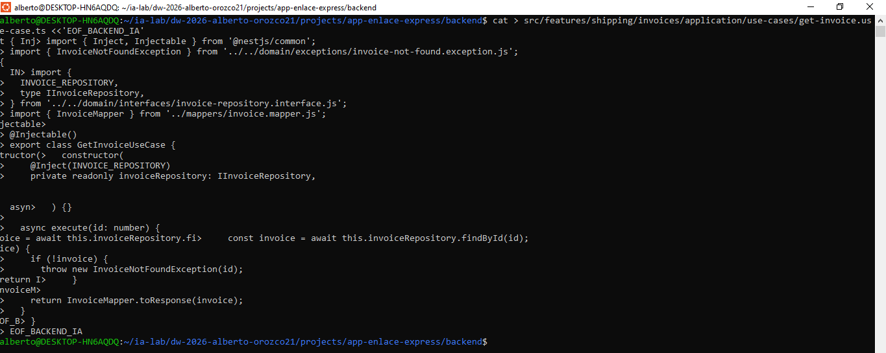

#### 13.19 — features/shipping/invoices/application/use-cases/list-invoices.use-case.ts

Caso de uso (aplicación). Orquesta dominio + repositorio. El controller solo lo invoca.

**Archivo:** `src/features/shipping/invoices/application/use-cases/list-invoices.use-case.ts`

```bash
mkdir -p src/features/shipping/invoices/application/use-cases
cat > src/features/shipping/invoices/application/use-cases/list-invoices.use-case.ts <<'EOF_BACKEND_IA'
import { Inject, Injectable } from '@nestjs/common';
import {
  INVOICE_REPOSITORY,
  type IInvoiceRepository,
} from '../../domain/interfaces/invoice-repository.interface.js';
import { InvoiceFilterDto } from '../dto/invoice-filter.dto.js';
import { InvoiceMapper } from '../mappers/invoice.mapper.js';

@Injectable()
export class ListInvoicesUseCase {
  constructor(
    @Inject(INVOICE_REPOSITORY)
    private readonly invoiceRepository: IInvoiceRepository,
  ) {}

  async execute(filter: InvoiceFilterDto) {
    const result = await this.invoiceRepository.findAll(filter);
    return {
      items: result.items.map((invoice) => InvoiceMapper.toResponse(invoice)),
      meta: result.meta,
    };
  }
}
EOF_BACKEND_IA
```

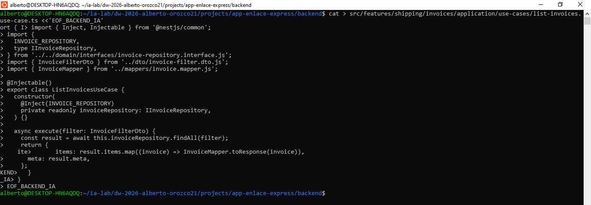

#### 13.20 — features/shipping/invoices/application/use-cases/update-invoice.use-case.ts

Caso de uso. Delega en `Invoice.update`, que rechaza cambios si la factura no está `pendiente`.

**Archivo:** `src/features/shipping/invoices/application/use-cases/update-invoice.use-case.ts`

```bash
mkdir -p src/features/shipping/invoices/application/use-cases
cat > src/features/shipping/invoices/application/use-cases/update-invoice.use-case.ts <<'EOF_BACKEND_IA'
import { Inject, Injectable } from '@nestjs/common';
import { InvoiceNotFoundException } from '../../domain/exceptions/invoice-not-found.exception.js';
import {
  INVOICE_REPOSITORY,
  type IInvoiceRepository,
} from '../../domain/interfaces/invoice-repository.interface.js';
import { UpdateInvoiceDto } from '../dto/update-invoice.dto.js';
import { InvoiceMapper } from '../mappers/invoice.mapper.js';

@Injectable()
export class UpdateInvoiceUseCase {
  constructor(
    @Inject(INVOICE_REPOSITORY)
    private readonly invoiceRepository: IInvoiceRepository,
  ) {}

  async execute(id: number, dto: UpdateInvoiceDto) {
    const invoice = await this.invoiceRepository.findById(id);
    if (!invoice) {
      throw new InvoiceNotFoundException(id);
    }

    invoice.update({
      periodStart: dto.periodStart ? new Date(dto.periodStart) : undefined,
      periodEnd: dto.periodEnd ? new Date(dto.periodEnd) : undefined,
      issueDate: dto.issueDate ? new Date(dto.issueDate) : undefined,
      subtotal: dto.subtotal,
      taxes: dto.taxes,
    });

    const updated = await this.invoiceRepository.update(invoice);
    return InvoiceMapper.toResponse(updated);
  }
}
EOF_BACKEND_IA
```

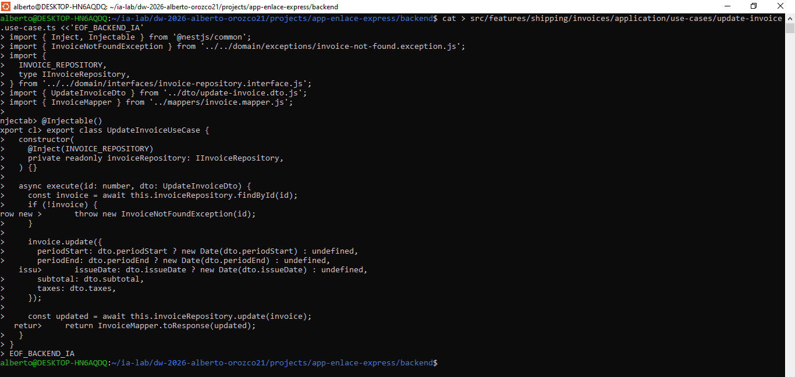

#### 13.21 — features/shipping/invoices/application/use-cases/mark-invoice-paid.use-case.ts

Caso de uso dedicado a la transición de pago (no es un `update` genérico).

**Archivo:** `src/features/shipping/invoices/application/use-cases/mark-invoice-paid.use-case.ts`

```bash
mkdir -p src/features/shipping/invoices/application/use-cases
cat > src/features/shipping/invoices/application/use-cases/mark-invoice-paid.use-case.ts <<'EOF_BACKEND_IA'
import { Inject, Injectable } from '@nestjs/common';
import { InvoiceNotFoundException } from '../../domain/exceptions/invoice-not-found.exception.js';
import {
  INVOICE_REPOSITORY,
  type IInvoiceRepository,
} from '../../domain/interfaces/invoice-repository.interface.js';
import { MarkInvoicePaidDto } from '../dto/mark-invoice-paid.dto.js';
import { InvoiceMapper } from '../mappers/invoice.mapper.js';

@Injectable()
export class MarkInvoicePaidUseCase {
  constructor(
    @Inject(INVOICE_REPOSITORY)
    private readonly invoiceRepository: IInvoiceRepository,
  ) {}

  async execute(id: number, dto: MarkInvoicePaidDto) {
    const invoice = await this.invoiceRepository.findById(id);
    if (!invoice) {
      throw new InvoiceNotFoundException(id);
    }

    invoice.markAsPaid(dto.paymentDate ? new Date(dto.paymentDate) : undefined);

    const updated = await this.invoiceRepository.update(invoice);
    return InvoiceMapper.toResponse(updated);
  }
}
EOF_BACKEND_IA
```

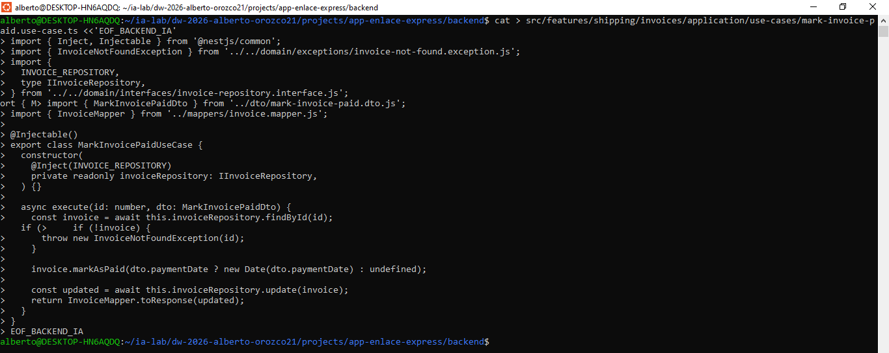

#### 13.22 — features/shipping/invoices/application/use-cases/void-invoice.use-case.ts

Caso de uso dedicado a la anulación (no es un `update` genérico).

**Archivo:** `src/features/shipping/invoices/application/use-cases/void-invoice.use-case.ts`

```bash
mkdir -p src/features/shipping/invoices/application/use-cases
cat > src/features/shipping/invoices/application/use-cases/void-invoice.use-case.ts <<'EOF_BACKEND_IA'
import { Inject, Injectable } from '@nestjs/common';
import { InvoiceNotFoundException } from '../../domain/exceptions/invoice-not-found.exception.js';
import {
  INVOICE_REPOSITORY,
  type IInvoiceRepository,
} from '../../domain/interfaces/invoice-repository.interface.js';
import { InvoiceMapper } from '../mappers/invoice.mapper.js';

@Injectable()
export class VoidInvoiceUseCase {
  constructor(
    @Inject(INVOICE_REPOSITORY)
    private readonly invoiceRepository: IInvoiceRepository,
  ) {}

  async execute(id: number) {
    const invoice = await this.invoiceRepository.findById(id);
    if (!invoice) {
      throw new InvoiceNotFoundException(id);
    }

    invoice.void();

    const updated = await this.invoiceRepository.update(invoice);
    return InvoiceMapper.toResponse(updated);
  }
}
EOF_BACKEND_IA
```

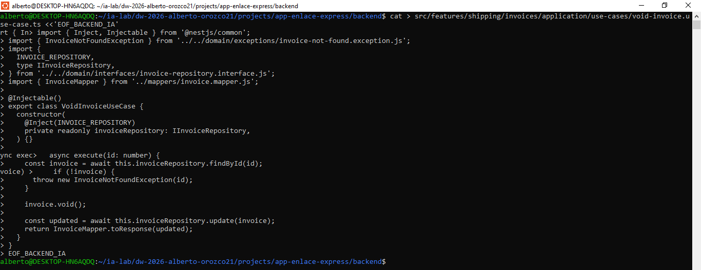

#### 13.23 — features/shipping/invoices/presentation/http/serializers/invoice.serializer.ts

Serializer de presentación (forma estable de la respuesta HTTP).

**Archivo:** `src/features/shipping/invoices/presentation/http/serializers/invoice.serializer.ts`

```bash
mkdir -p src/features/shipping/invoices/presentation/http/serializers
cat > src/features/shipping/invoices/presentation/http/serializers/invoice.serializer.ts <<'EOF_BACKEND_IA'
import { Invoice } from '../../../domain/entities/invoice.entity.js';
import { InvoiceResponseDto } from '../../../application/dto/invoice-response.dto.js';
import { InvoiceMapper } from '../../../application/mappers/invoice.mapper.js';

export class InvoiceSerializer {
  static serialize(entity: Invoice): InvoiceResponseDto {
    return InvoiceMapper.toResponse(entity);
  }
}
EOF_BACKEND_IA
```

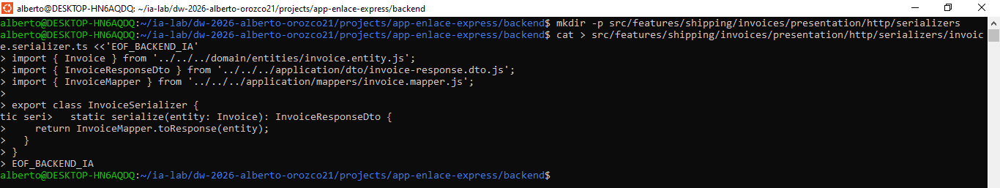

### 13.24 — features/shipping/invoices/presentation/http/controllers/invoices.controller.ts

Controller delgado. Incluye dos rutas extra (`/pay`, `/void`) para las transiciones de estado, además del CRUD estándar.

**Archivo:** `src/features/shipping/invoices/presentation/http/controllers/invoices.controller.ts`

```bash
mkdir -p src/features/shipping/invoices/presentation/http/controllers
cat > src/features/shipping/invoices/presentation/http/controllers/invoices.controller.ts <<'EOF_BACKEND_IA'
import {
  Body,
  Controller,
  Delete,
  Get,
  HttpCode,
  HttpStatus,
  Param,
  Patch,
  Post,
  Query,
} from '@nestjs/common';
import {
  ApiCreatedResponse,
  ApiNoContentResponse,
  ApiOkResponse,
  ApiOperation,
  ApiTags,
} from '@nestjs/swagger';
import { ParsePositiveIntPipe } from '../../../../../../common/pipes/parse-positive-int.pipe.js';
import { CreateInvoiceDto } from '../../../application/dto/create-invoice.dto.js';
import { UpdateInvoiceDto } from '../../../application/dto/update-invoice.dto.js';
import { MarkInvoicePaidDto } from '../../../application/dto/mark-invoice-paid.dto.js';
import { InvoiceFilterDto } from '../../../application/dto/invoice-filter.dto.js';
import { InvoiceResponseDto } from '../../../application/dto/invoice-response.dto.js';
import { CreateInvoiceUseCase } from '../../../application/use-cases/create-invoice.use-case.js';
import { UpdateInvoiceUseCase } from '../../../application/use-cases/update-invoice.use-case.js';
import { DeleteInvoiceUseCase } from '../../../application/use-cases/delete-invoice.use-case.js';
import { GetInvoiceUseCase } from '../../../application/use-cases/get-invoice.use-case.js';
import { ListInvoicesUseCase } from '../../../application/use-cases/list-invoices.use-case.js';
import { MarkInvoicePaidUseCase } from '../../../application/use-cases/mark-invoice-paid.use-case.js';
import { VoidInvoiceUseCase } from '../../../application/use-cases/void-invoice.use-case.js';

@ApiTags('Invoices')
@Controller('invoices')
export class InvoicesController {
  constructor(
    private readonly createInvoiceUseCase: CreateInvoiceUseCase,
    private readonly updateInvoiceUseCase: UpdateInvoiceUseCase,
    private readonly deleteInvoiceUseCase: DeleteInvoiceUseCase,
    private readonly getInvoiceUseCase: GetInvoiceUseCase,
    private readonly listInvoicesUseCase: ListInvoicesUseCase,
    private readonly markInvoicePaidUseCase: MarkInvoicePaidUseCase,
    private readonly voidInvoiceUseCase: VoidInvoiceUseCase,
  ) {}

  @Post()
  @ApiOperation({ summary: 'Crear una factura' })
  @ApiCreatedResponse({ type: InvoiceResponseDto })
  create(@Body() dto: CreateInvoiceDto) {
    return this.createInvoiceUseCase.execute(dto);
  }

  @Get()
  @ApiOperation({ summary: 'Listar facturas (opcionalmente por empresa o estado)' })
  @ApiOkResponse({ type: [InvoiceResponseDto] })
  findAll(@Query() filter: InvoiceFilterDto) {
    return this.listInvoicesUseCase.execute(filter);
  }

  @Get(':id')
  @ApiOperation({ summary: 'Obtener una factura por ID' })
  @ApiOkResponse({ type: InvoiceResponseDto })
  findOne(@Param('id', ParsePositiveIntPipe) id: number) {
    return this.getInvoiceUseCase.execute(id);
  }

  @Patch(':id')
  @ApiOperation({ summary: 'Actualizar una factura pendiente' })
  @ApiOkResponse({ type: InvoiceResponseDto })
  update(
    @Param('id', ParsePositiveIntPipe) id: number,
    @Body() dto: UpdateInvoiceDto,
  ) {
    return this.updateInvoiceUseCase.execute(id, dto);
  }

  @Patch(':id/pay')
  @ApiOperation({ summary: 'Marcar una factura como pagada' })
  @ApiOkResponse({ type: InvoiceResponseDto })
  markAsPaid(
    @Param('id', ParsePositiveIntPipe) id: number,
    @Body() dto: MarkInvoicePaidDto,
  ) {
    return this.markInvoicePaidUseCase.execute(id, dto);
  }

  @Patch(':id/void')
  @ApiOperation({ summary: 'Anular una factura' })
  @ApiOkResponse({ type: InvoiceResponseDto })
  void(@Param('id', ParsePositiveIntPipe) id: number) {
    return this.voidInvoiceUseCase.execute(id);
  }

  @Delete(':id')
  @HttpCode(HttpStatus.NO_CONTENT)
  @ApiOperation({ summary: 'Eliminar una factura (no pagada)' })
  @ApiNoContentResponse()
  remove(@Param('id', ParsePositiveIntPipe) id: number) {
    return this.deleteInvoiceUseCase.execute(id);
  }
}
EOF_BACKEND_IA
```

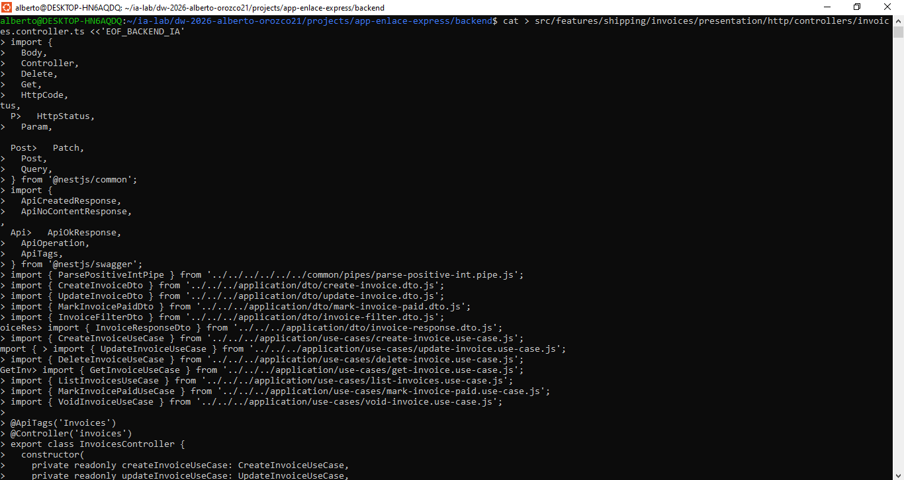

### 13.25 — features/shipping/invoices/index.ts

Barrel export del feature para imports limpios.

**Archivo:** `src/features/shipping/invoices/index.ts`

```bash
mkdir -p src/features/shipping/invoices
cat > src/features/shipping/invoices/index.ts <<'EOF_BACKEND_IA'
export { InvoicesModule } from './invoices.module.js';
EOF_BACKEND_IA
```

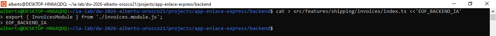

### 13.26 — features/shipping/invoices/invoices.module.ts

Módulo Nest del feature. Importa `CompaniesModule` para poder inyectar `COMPANY_REPOSITORY` y validar la FK.

**Archivo:** `src/features/shipping/invoices/invoices.module.ts`

```bash
mkdir -p src/features/shipping/invoices
cat > src/features/shipping/invoices/invoices.module.ts <<'EOF_BACKEND_IA'
import { Module } from '@nestjs/common';
import { CompaniesModule } from '../companies/companies.module.js';
import { INVOICE_REPOSITORY } from './domain/interfaces/invoice-repository.interface.js';
import { InvoiceRepository } from './infrastructure/persistence/repositories/invoice.repository.js';
import { CreateInvoiceUseCase } from './application/use-cases/create-invoice.use-case.js';
import { UpdateInvoiceUseCase } from './application/use-cases/update-invoice.use-case.js';
import { DeleteInvoiceUseCase } from './application/use-cases/delete-invoice.use-case.js';
import { GetInvoiceUseCase } from './application/use-cases/get-invoice.use-case.js';
import { ListInvoicesUseCase } from './application/use-cases/list-invoices.use-case.js';
import { MarkInvoicePaidUseCase } from './application/use-cases/mark-invoice-paid.use-case.js';
import { VoidInvoiceUseCase } from './application/use-cases/void-invoice.use-case.js';
import { InvoicesController } from './presentation/http/controllers/invoices.controller.js';

@Module({
  imports: [CompaniesModule],
  controllers: [InvoicesController],
  providers: [
    InvoiceRepository,
    { provide: INVOICE_REPOSITORY, useExisting: InvoiceRepository },
    CreateInvoiceUseCase,
    UpdateInvoiceUseCase,
    DeleteInvoiceUseCase,
    GetInvoiceUseCase,
    ListInvoicesUseCase,
    MarkInvoicePaidUseCase,
    VoidInvoiceUseCase,
  ],
  exports: [INVOICE_REPOSITORY],
})
export class InvoicesModule {}
EOF_BACKEND_IA
```

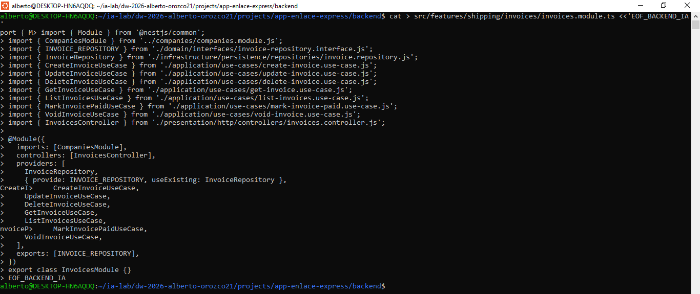

### 13.27 — Actualizar company.model.ts (cerrar la asociación)

Vuelve al modelo de Empresa y agrega `@HasMany(() => InvoiceModel)` con import estático. Con esto, `Empresa` ya tiene sus tres asociaciones completas (`contacts`, `addresses`, `invoices`); solo falta `shipments`, que llegará con Envio.

**Archivo:** `src/features/shipping/companies/infrastructure/persistence/models/company.model.ts`

```bash
mkdir -p src/features/shipping/companies/infrastructure/persistence/models
cat > src/features/shipping/companies/infrastructure/persistence/models/company.model.ts <<'EOF_BACKEND_IA'
import {
  AutoIncrement,
  Column,
  CreatedAt,
  DataType,
  HasMany,
  Model,
  PrimaryKey,
  Table,
  UpdatedAt,
} from 'sequelize-typescript';
import { ContactModel } from '../../../../contacts/infrastructure/persistence/models/contact.model.js';
import { AddressModel } from '../../../../addresses/infrastructure/persistence/models/address.model.js';
import { InvoiceModel } from '../../../../invoices/infrastructure/persistence/models/invoice.model.js';

@Table({ tableName: 'companies' })
export class CompanyModel extends Model {
  @PrimaryKey
  @AutoIncrement
  @Column(DataType.INTEGER)
  declare id: number;

  @Column({ type: DataType.STRING(20), allowNull: false, unique: true })
  declare nit: string;

  @Column({ type: DataType.STRING(200), allowNull: false })
  declare razonSocial: string;

  @Column({ type: DataType.BOOLEAN, allowNull: false, defaultValue: true })
  declare isActive: boolean;

  @CreatedAt
  declare createdAt: Date;

  @UpdatedAt
  declare updatedAt: Date;
}
EOF_BACKEND_IA
```

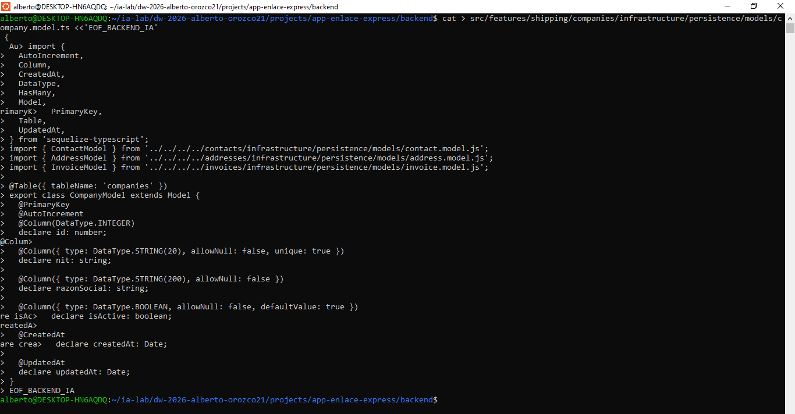

### 13.28 — Actualizar sequelize.factory.ts (registrar InvoiceModel)

Registra en ALL_MODELS solo los modelos ya creados (orden de dependencias).

**Archivo:** `src/infrastructure/database/sequelize/sequelize.factory.ts`

```bash
mkdir -p src/infrastructure/database/sequelize
cat > src/infrastructure/database/sequelize/sequelize.factory.ts <<'EOF_BACKEND_IA'
import { Sequelize } from 'sequelize-typescript';
import { DatabaseDialect } from '../../../config/environment/env.interface.js';
import { getSequelizeOptions } from './sequelize.options.js';

import { CompanyModel } from '../../../features/shipping/companies/infrastructure/persistence/models/company.model.js';
import { ContactModel } from '../../../features/shipping/contacts/infrastructure/persistence/models/contact.model.js';
import { AddressModel } from '../../../features/shipping/addresses/infrastructure/persistence/models/address.model.js';
import { RateModel } from '../../../features/shipping/rates/infrastructure/persistence/models/rate.model.js';
import { CourierModel } from '../../../features/shipping/couriers/infrastructure/persistence/models/courier.model.js';
import { RouteModel } from '../../../features/shipping/routes/infrastructure/persistence/models/route.model.js';
import { InvoiceModel } from '../../../features/shipping/invoices/infrastructure/persistence/models/invoice.model.js';

export const ALL_MODELS = [
  CompanyModel,
  ContactModel,
  AddressModel,
  RateModel,
  CourierModel,
  RouteModel,
  InvoiceModel,
];

async function loadDialectModule(moduleName: string): Promise<any> {
  // Proyecto ESM: require() no existe como global, se usa import() dinámico.
  const mod: any = await import(moduleName);
  return mod.default ?? mod;
}

export async function createSequelizeInstance(
  dialect: DatabaseDialect,
): Promise<Sequelize> {
  const options = getSequelizeOptions(dialect);

  let dialectModule: any;

  switch (dialect) {
    case DatabaseDialect.MySQL:
      dialectModule = await loadDialectModule('mysql2');
      break;
    case DatabaseDialect.Postgres:
      dialectModule = await loadDialectModule('pg');
      break;
    case DatabaseDialect.MSSQL:
      dialectModule = await loadDialectModule('tedious');
      break;
    case DatabaseDialect.Oracle:
      dialectModule = await loadDialectModule('oracledb');
      break;
    default:
      throw new Error(`Dialecto no soportado: ${dialect}`);
  }

  const sequelize = new Sequelize({
    ...options,
    dialectModule,
    models: ALL_MODELS,
  } as any);

  try {
    await sequelize.authenticate();
    console.log(`✅ Conexión exitosa a ${dialect.toUpperCase()}`);
  } catch (error: any) {
    console.error(
      `❌ Error conectando a ${dialect.toUpperCase()}:`,
      error.message,
    );
    throw error;
  }

  if (process.env.NODE_ENV !== 'production') {
    await sequelize.sync({ alter: false });
    console.log('✅ Tablas sincronizadas');
  }

  return sequelize;
}
EOF_BACKEND_IA
```

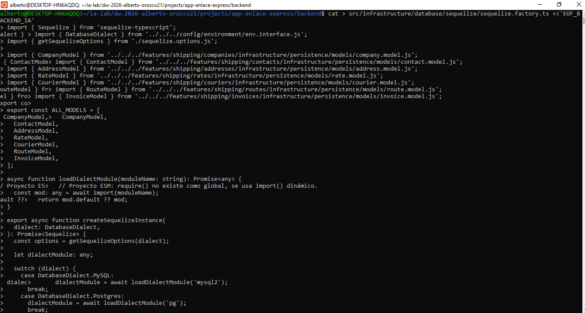


### 13.29 — Actualizar shipping.module.ts

Agrega el feature module de negocio recién terminado.

**Archivo:** `src/features/shipping/shipping.module.ts`

```bash
mkdir -p src/features/shipping
cat > src/features/shipping/shipping.module.ts <<'EOF_BACKEND_IA'
import { Module } from '@nestjs/common';
import { CompaniesModule } from './companies/companies.module.js';
import { ContactsModule } from './contacts/contacts.module.js';
import { AddressesModule } from './addresses/addresses.module.js';
import { RatesModule } from './rates/rates.module.js';
import { CouriersModule } from './couriers/couriers.module.js';
import { RoutesModule } from './routes/routes.module.js';
import { InvoicesModule } from './invoices/invoices.module.js';

@Module({
  imports: [
    CompaniesModule,
    ContactsModule,
    AddressesModule,
    RatesModule,
    CouriersModule,
    RoutesModule,
    InvoicesModule,
  ],
  exports: [
    CompaniesModule,
    ContactsModule,
    AddressesModule,
    RatesModule,
    CouriersModule,
    RoutesModule,
    InvoicesModule,
  ],
})
export class ShippingModule {}
EOF_BACKEND_IA
```

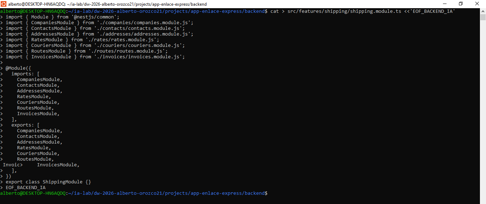

### 13.30 — Actualizar database-seeder.service.ts y verificar tabla `invoices`

Agrega `seedInvoices` (depende de empresas). `app.module.ts` no necesita cambios: `ShippingModule` ya expone `InvoicesModule`.

**Archivo:** `src/infrastructure/database/seeders/database-seeder.service.ts`

```bash
mkdir -p src/infrastructure/database/seeders
cat > src/infrastructure/database/seeders/database-seeder.service.ts <<'EOF_BACKEND_IA'
import { Injectable, Logger, OnModuleInit } from '@nestjs/common';
import { seedCompanies } from '../../../features/shipping/companies/infrastructure/persistence/seeders/companies.seeder.js';
import { seedContacts } from '../../../features/shipping/contacts/infrastructure/persistence/seeders/contacts.seeder.js';
import { seedAddresses } from '../../../features/shipping/addresses/infrastructure/persistence/seeders/addresses.seeder.js';
import { seedRates } from '../../../features/shipping/rates/infrastructure/persistence/seeders/rates.seeder.js';
import { seedCouriers } from '../../../features/shipping/couriers/infrastructure/persistence/seeders/couriers.seeder.js';
import { seedRoutes } from '../../../features/shipping/routes/infrastructure/persistence/seeders/routes.seeder.js';
import { seedInvoices } from '../../../features/shipping/invoices/infrastructure/persistence/seeders/invoices.seeder.js';

/**
 * Ejecuta seeders en orden de dependencias.
 * Solo en entornos no productivos.
 */
@Injectable()
export class DatabaseSeederService implements OnModuleInit {
  private readonly logger = new Logger(DatabaseSeederService.name);

  async onModuleInit(): Promise<void> {
    if (process.env.NODE_ENV === 'production') {
      return;
    }

    try {
      await seedCompanies();
      await seedContacts();
      await seedAddresses();
      await seedRates();
      await seedCouriers();
      await seedRoutes();
      await seedInvoices();
      this.logger.log('✅ Seeders ejecutados');
    } catch (error: any) {
      this.logger.error(`❌ Error en seeders: ${error.message}`, error.stack);
      throw error;
    }
  }
}
EOF_BACKEND_IA
```

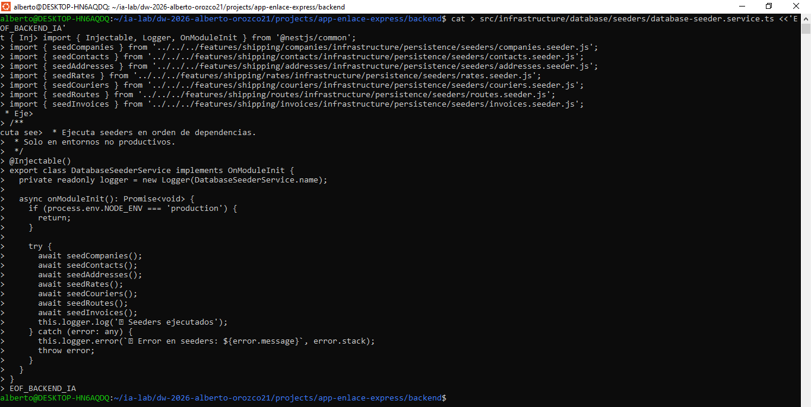

Arranca la app. Debe crear/sync tabla `invoices` (con FK a `companies`), correr seeder y exponer `/api/invoices`. Prueba:
- `PATCH /api/invoices/:id/pay` → factura pasa a `pagada`.
- Intentar `PATCH /api/invoices/:id` (update genérico) sobre una factura ya pagada → debe fallar.
- Intentar `DELETE /api/invoices/:id` sobre una factura pagada → debe fallar.
- Intentar `PATCH /api/invoices/:id/void` sobre una factura pagada → debe fallar.

```bash
npm run start:dev
```

**Consola**

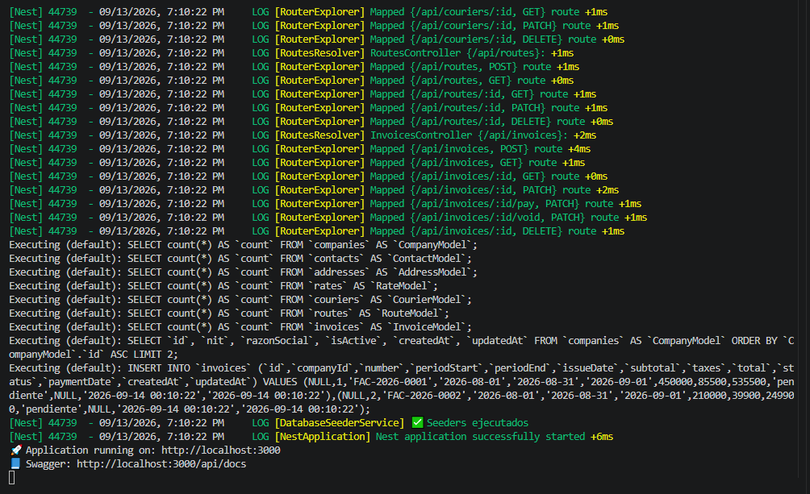

**/api/invoices**

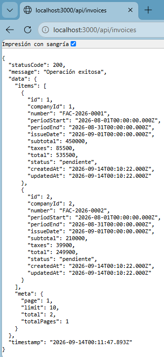

---------------------------------------------------------------------

## FASE 14 — `13_BUSINESS_SHIPMENTS`

### Business — Shipments / Envio (patrón completo CA)

> **Objetivo de la fase:** Entidad central de EnlaceExpress. Referencia a Empresa, Contacto (origen y destino — dos asociaciones distintas hacia la misma tabla), Direccion (origen y destino, igual), Tarifa, y opcionalmente Mensajero/Ruta/Factura (se asignan después de creado). Tiene una máquina de estados con transiciones controladas en el dominio, no en el controller.
>
> **Transiciones válidas:**
> ```
> creado → cotizado → asignado → en_ruta → entregado
>                                      ↕
>                                 con_novedad
> cualquier estado (excepto entregado/cancelado) → cancelado
> ```
>
> **Sobre `numero_guia`**: se genera automáticamente en el dominio (`Shipment.generateGuideNumber()`, formato `ENV-<timestamp36>-<random4>`), no lo envía el cliente. La columna sigue siendo `unique` en BD como red de seguridad ante una colisión improbable — si ocurriera, `sequelize-exception.filter.ts` (fase 6) ya la convierte en un 409 en vez de un 500 genérico.
>
> **Sobre "no se puede marcar entregado sin evidencia y receptor"**: esa regla depende de `PruebaEntrega`, que no existe todavía. `deliver()` queda implementado con un comentario `TODO` explícito; cuando construyamos PruebaEntrega, ese use-case pasará a exigir que exista evidencia antes de invocar `shipment.deliver()`.

#### 14.1 — features/shipping/shipments/domain/enums/shipment-priority.enum.ts

**Archivo:** `src/features/shipping/shipments/domain/enums/shipment-priority.enum.ts`

```bash
mkdir -p src/features/shipping/shipments/domain/enums
cat > src/features/shipping/shipments/domain/enums/shipment-priority.enum.ts <<'EOF_BACKEND_IA'
export enum ShipmentPriority {
  NORMAL = 'normal',
  URGENT = 'urgente',
  EXPRESS = 'express',
}
EOF_BACKEND_IA
```

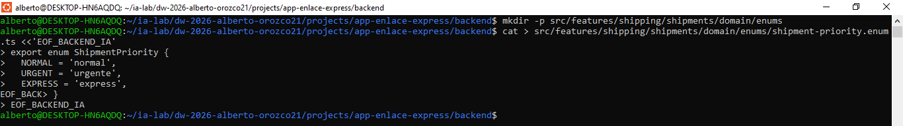

### 14.2 — features/shipping/shipments/domain/enums/shipment-status.enum.ts

**Archivo:** `src/features/shipping/shipments/domain/enums/shipment-status.enum.ts`

```bash
mkdir -p src/features/shipping/shipments/domain/enums
cat > src/features/shipping/shipments/domain/enums/shipment-status.enum.ts <<'EOF_BACKEND_IA'
export enum ShipmentStatus {
  CREATED = 'creado',
  QUOTED = 'cotizado',
  ASSIGNED = 'asignado',
  IN_TRANSIT = 'en_ruta',
  DELIVERED = 'entregado',
  WITH_ISSUE = 'con_novedad',
  CANCELLED = 'cancelado',
}
EOF_BACKEND_IA
```

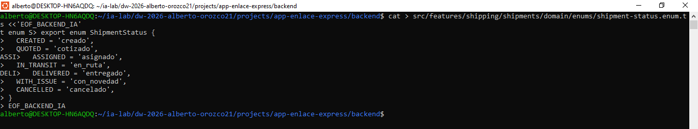

### 14.3 — features/shipping/shipments/domain/exceptions/invalid-shipment-transition.exception.ts

**Archivo:** `src/features/shipping/shipments/domain/exceptions/invalid-shipment-transition.exception.ts`

```bash
mkdir -p src/features/shipping/shipments/domain/exceptions
cat > src/features/shipping/shipments/domain/exceptions/invalid-shipment-transition.exception.ts <<'EOF_BACKEND_IA'
import { DomainException } from '../../../../../common/exceptions/domain.exception.js';
import { ShipmentStatus } from '../enums/shipment-status.enum.js';

export class InvalidShipmentTransitionException extends DomainException {
  constructor(from: ShipmentStatus, action: string) {
    super(`No se puede '${action}' un envío en estado '${from}'`);
  }
}
EOF_BACKEND_IA
```

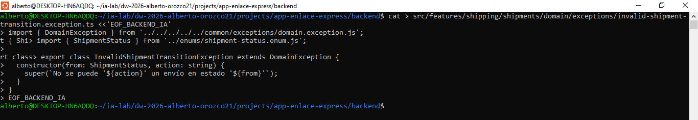
**Sugerencia de commit (issue):**

### 14.4 — features/shipping/shipments/domain/exceptions/shipment-not-found.exception.ts

**Archivo:** `src/features/shipping/shipments/domain/exceptions/shipment-not-found.exception.ts`

```bash
mkdir -p src/features/shipping/shipments/domain/exceptions
cat > src/features/shipping/shipments/domain/exceptions/shipment-not-found.exception.ts <<'EOF_BACKEND_IA'
import { EntityNotFoundException } from '../../../../../common/exceptions/entity-not-found.exception.js';

export class ShipmentNotFoundException extends EntityNotFoundException {
  constructor(id: number) {
    super('Envío', id);
  }
}
EOF_BACKEND_IA
```

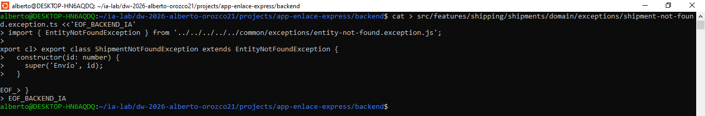

### 14.5 — features/shipping/shipments/domain/entities/shipment.entity.ts

La entidad más grande del proyecto: crea con estado `CREATED`, y solo cambia de estado a través de sus métodos (`quote`, `assign`, `startTransit`, `reportIssue`, `deliver`, `cancel`), cada uno validando la transición.

**Archivo:** `src/features/shipping/shipments/domain/entities/shipment.entity.ts`

```bash
mkdir -p src/features/shipping/shipments/domain/entities
cat > src/features/shipping/shipments/domain/entities/shipment.entity.ts <<'EOF_BACKEND_IA'
import { ShipmentPriority } from '../enums/shipment-priority.enum.js';
import { ShipmentStatus } from '../enums/shipment-status.enum.js';
import { InvalidShipmentTransitionException } from '../exceptions/invalid-shipment-transition.exception.js';

export interface ShipmentProps {
  id?: number;
  guideNumber: string;
  companyId: number;
  originContactId: number;
  originAddressId: number;
  destinationContactId: number;
  destinationAddressId: number;
  rateId: number;
  courierId?: number;
  routeId?: number;
  invoiceId?: number;
  priority?: ShipmentPriority;
  totalWeightKg: number;
  declaredValue: number;
  calculatedCost?: number;
  status?: ShipmentStatus;
  requestDate?: Date;
  estimatedDeliveryDate: Date;
  actualDeliveryDate?: Date;
  isActive?: boolean;
  createdAt?: Date;
  updatedAt?: Date;
}

export class Shipment {
  id?: number;
  guideNumber: string;
  companyId: number;
  originContactId: number;
  originAddressId: number;
  destinationContactId: number;
  destinationAddressId: number;
  rateId: number;
  courierId?: number;
  routeId?: number;
  invoiceId?: number;
  priority: ShipmentPriority;
  totalWeightKg: number;
  declaredValue: number;
  calculatedCost?: number;
  status: ShipmentStatus;
  requestDate: Date;
  estimatedDeliveryDate: Date;
  actualDeliveryDate?: Date;
  isActive: boolean;
  createdAt?: Date;
  updatedAt?: Date;

  private constructor(props: ShipmentProps) {
    this.id = props.id;
    this.guideNumber = props.guideNumber;
    this.companyId = props.companyId;
    this.originContactId = props.originContactId;
    this.originAddressId = props.originAddressId;
    this.destinationContactId = props.destinationContactId;
    this.destinationAddressId = props.destinationAddressId;
    this.rateId = props.rateId;
    this.courierId = props.courierId;
    this.routeId = props.routeId;
    this.invoiceId = props.invoiceId;
    this.priority = props.priority ?? ShipmentPriority.NORMAL;
    this.totalWeightKg = props.totalWeightKg;
    this.declaredValue = props.declaredValue;
    this.calculatedCost = props.calculatedCost;
    this.status = props.status ?? ShipmentStatus.CREATED;
    this.requestDate = props.requestDate ?? new Date();
    this.estimatedDeliveryDate = props.estimatedDeliveryDate;
    this.actualDeliveryDate = props.actualDeliveryDate;
    this.isActive = props.isActive ?? true;
    this.createdAt = props.createdAt;
    this.updatedAt = props.updatedAt;
  }

  static generateGuideNumber(): string {
    const timestamp = Date.now().toString(36).toUpperCase();
    const random = Math.random().toString(36).slice(2, 6).toUpperCase();
    return `ENV-${timestamp}-${random}`;
  }

  private assertStatus(allowed: ShipmentStatus[], action: string): void {
    if (!allowed.includes(this.status)) {
      throw new InvalidShipmentTransitionException(this.status, action);
    }
  }

  static create(
    props: Omit<
      ShipmentProps,
      | 'id'
      | 'status'
      | 'calculatedCost'
      | 'courierId'
      | 'routeId'
      | 'invoiceId'
      | 'actualDeliveryDate'
      | 'isActive'
      | 'createdAt'
      | 'updatedAt'
    >,
  ): Shipment {
    if (!props.companyId) throw new Error('El envío debe pertenecer a una empresa');
    if (!props.originContactId) throw new Error('El contacto de origen es requerido');
    if (!props.originAddressId) throw new Error('La dirección de origen es requerida');
    if (!props.destinationContactId) throw new Error('El contacto de destino es requerido');
    if (!props.destinationAddressId) throw new Error('La dirección de destino es requerida');
    if (!props.rateId) throw new Error('La tarifa es requerida');
    if (!props.totalWeightKg || props.totalWeightKg <= 0) {
      throw new Error('El peso total debe ser mayor a cero');
    }
    if (props.declaredValue === undefined || props.declaredValue < 0) {
      throw new Error('El valor declarado no puede ser negativo');
    }
    if (!props.estimatedDeliveryDate) {
      throw new Error('La fecha estimada de entrega es requerida');
    }

    return new Shipment({
      ...props,
      guideNumber: props.guideNumber ?? Shipment.generateGuideNumber(),
    });
  }

  static reconstitute(props: ShipmentProps): Shipment {
    return new Shipment(props);
  }

  /** Solo permite editar datos comerciales mientras el envío está recién creado. */
  update(
    props: Partial<
      Pick<ShipmentProps, 'priority' | 'totalWeightKg' | 'declaredValue' | 'estimatedDeliveryDate'>
    >,
  ): void {
    this.assertStatus([ShipmentStatus.CREATED], 'modificar');

    if (props.totalWeightKg !== undefined && props.totalWeightKg <= 0) {
      throw new Error('El peso total debe ser mayor a cero');
    }
    if (props.declaredValue !== undefined && props.declaredValue < 0) {
      throw new Error('El valor declarado no puede ser negativo');
    }

    if (props.priority !== undefined) this.priority = props.priority;
    if (props.totalWeightKg !== undefined) this.totalWeightKg = props.totalWeightKg;
    if (props.declaredValue !== undefined) this.declaredValue = props.declaredValue;
    if (props.estimatedDeliveryDate !== undefined) {
      this.estimatedDeliveryDate = props.estimatedDeliveryDate;
    }
  }

  quote(calculatedCost: number): void {
    this.assertStatus([ShipmentStatus.CREATED], 'cotizar');
    this.calculatedCost = calculatedCost;
    this.status = ShipmentStatus.QUOTED;
  }

  assign(courierId: number, routeId: number): void {
    this.assertStatus([ShipmentStatus.QUOTED], 'asignar mensajero/ruta a');
    this.courierId = courierId;
    this.routeId = routeId;
    this.status = ShipmentStatus.ASSIGNED;
  }

  startTransit(): void {
    this.assertStatus(
      [ShipmentStatus.ASSIGNED, ShipmentStatus.WITH_ISSUE],
      'poner en ruta',
    );
    this.status = ShipmentStatus.IN_TRANSIT;
  }

  reportIssue(): void {
    this.assertStatus([ShipmentStatus.IN_TRANSIT], 'reportar novedad en');
    this.status = ShipmentStatus.WITH_ISSUE;
  }

  /**
   * TODO(fase PruebaEntrega): antes de invocar esto, el use-case deberá exigir
   * que exista una PruebaEntrega válida con receptor. Por ahora la transición
   * es libre a nivel de dominio.
   */
  deliver(deliveredAt?: Date): void {
    this.assertStatus([ShipmentStatus.IN_TRANSIT], 'marcar como entregado');
    this.status = ShipmentStatus.DELIVERED;
    this.actualDeliveryDate = deliveredAt ?? new Date();
  }

  cancel(): void {
    this.assertStatus(
      [
        ShipmentStatus.CREATED,
        ShipmentStatus.QUOTED,
        ShipmentStatus.ASSIGNED,
        ShipmentStatus.IN_TRANSIT,
        ShipmentStatus.WITH_ISSUE,
      ],
      'cancelar',
    );
    this.status = ShipmentStatus.CANCELLED;
  }

  attachInvoice(invoiceId: number): void {
    this.invoiceId = invoiceId;
  }

  deactivate(): void {
    this.isActive = false;
  }

  activate(): void {
    this.isActive = true;
  }
}
EOF_BACKEND_IA
```

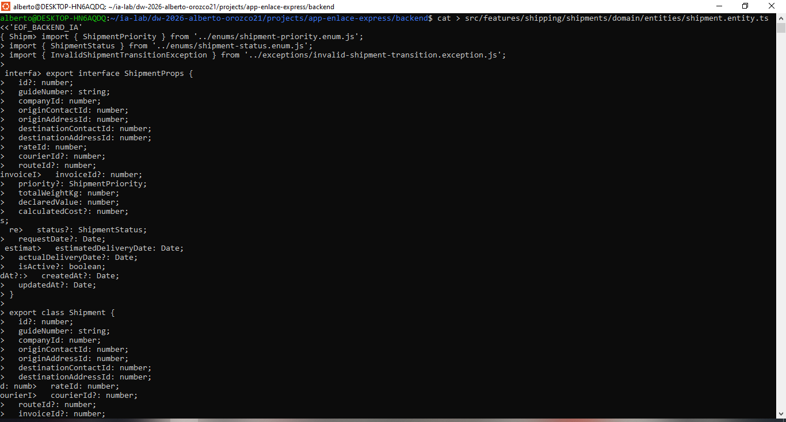

### 14.6 — features/shipping/shipments/domain/interfaces/shipment-repository.interface.ts

**Archivo:** `src/features/shipping/shipments/domain/interfaces/shipment-repository.interface.ts`

```bash
mkdir -p src/features/shipping/shipments/domain/interfaces
cat > src/features/shipping/shipments/domain/interfaces/shipment-repository.interface.ts <<'EOF_BACKEND_IA'
import { PaginatedResult } from '../../../../../common/interfaces/pagination.interface.js';
import { ShipmentPriority } from '../enums/shipment-priority.enum.js';
import { ShipmentStatus } from '../enums/shipment-status.enum.js';
import { Shipment } from '../entities/shipment.entity.js';

export const SHIPMENT_REPOSITORY = 'SHIPMENT_REPOSITORY';

export interface ShipmentFindAllParams {
  page?: number;
  limit?: number;
  search?: string;
  companyId?: number;
  courierId?: number;
  status?: ShipmentStatus;
  priority?: ShipmentPriority;
}

export interface IShipmentRepository {
  create(shipment: Shipment): Promise<Shipment>;
  update(shipment: Shipment): Promise<Shipment>;
  delete(id: number): Promise<void>;
  findById(id: number): Promise<Shipment | null>;
  findAll(params: ShipmentFindAllParams): Promise<PaginatedResult<Shipment>>;
}
EOF_BACKEND_IA
```

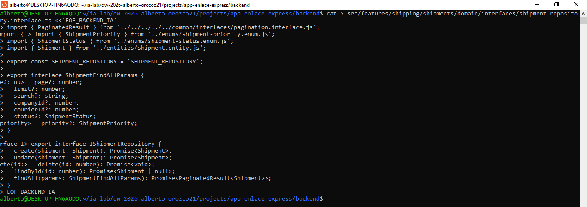

### 14.7 — features/shipping/shipments/infrastructure/persistence/models/shipment.model.ts

El modelo con más asociaciones del proyecto. `originContact`/`destinationContact` apuntan al mismo `ContactModel` con alias distintos; igual para `originAddress`/`destinationAddress`.

**Archivo:** `src/features/shipping/shipments/infrastructure/persistence/models/shipment.model.ts`

```bash
mkdir -p src/features/shipping/shipments/infrastructure/persistence/models
cat > src/features/shipping/shipments/infrastructure/persistence/models/shipment.model.ts <<'EOF_BACKEND_IA'
import {
  AutoIncrement,
  BelongsTo,
  Column,
  CreatedAt,
  DataType,
  ForeignKey,
  Model,
  PrimaryKey,
  Table,
  UpdatedAt,
} from 'sequelize-typescript';
import { CompanyModel } from '../../../../companies/infrastructure/persistence/models/company.model.js';
import { ContactModel } from '../../../../contacts/infrastructure/persistence/models/contact.model.js';
import { AddressModel } from '../../../../addresses/infrastructure/persistence/models/address.model.js';
import { RateModel } from '../../../../rates/infrastructure/persistence/models/rate.model.js';
import { CourierModel } from '../../../../couriers/infrastructure/persistence/models/courier.model.js';
import { RouteModel } from '../../../../routes/infrastructure/persistence/models/route.model.js';
import { InvoiceModel } from '../../../../invoices/infrastructure/persistence/models/invoice.model.js';
import { ShipmentPriority } from '../../../domain/enums/shipment-priority.enum.js';
import { ShipmentStatus } from '../../../domain/enums/shipment-status.enum.js';

@Table({ tableName: 'shipments' })
export class ShipmentModel extends Model {
  @PrimaryKey
  @AutoIncrement
  @Column(DataType.INTEGER)
  declare id: number;

  @Column({ type: DataType.STRING(30), allowNull: false, unique: true })
  declare guideNumber: string;

  @ForeignKey(() => CompanyModel)
  @Column({ type: DataType.INTEGER, allowNull: false })
  declare companyId: number;

  @BelongsTo(() => CompanyModel)
  declare company: CompanyModel;

  @ForeignKey(() => ContactModel)
  @Column({ type: DataType.INTEGER, allowNull: false })
  declare originContactId: number;

  @BelongsTo(() => ContactModel, { foreignKey: 'originContactId', as: 'originContact' })
  declare originContact: ContactModel;

  @ForeignKey(() => AddressModel)
  @Column({ type: DataType.INTEGER, allowNull: false })
  declare originAddressId: number;

  @BelongsTo(() => AddressModel, { foreignKey: 'originAddressId', as: 'originAddress' })
  declare originAddress: AddressModel;

  @ForeignKey(() => ContactModel)
  @Column({ type: DataType.INTEGER, allowNull: false })
  declare destinationContactId: number;

  @BelongsTo(() => ContactModel, {
    foreignKey: 'destinationContactId',
    as: 'destinationContact',
  })
  declare destinationContact: ContactModel;

  @ForeignKey(() => AddressModel)
  @Column({ type: DataType.INTEGER, allowNull: false })
  declare destinationAddressId: number;

  @BelongsTo(() => AddressModel, {
    foreignKey: 'destinationAddressId',
    as: 'destinationAddress',
  })
  declare destinationAddress: AddressModel;

  @ForeignKey(() => RateModel)
  @Column({ type: DataType.INTEGER, allowNull: false })
  declare rateId: number;

  @BelongsTo(() => RateModel)
  declare rate: RateModel;

  @ForeignKey(() => CourierModel)
  @Column({ type: DataType.INTEGER, allowNull: true })
  declare courierId: number | null;

  @BelongsTo(() => CourierModel)
  declare courier: CourierModel;

  @ForeignKey(() => RouteModel)
  @Column({ type: DataType.INTEGER, allowNull: true })
  declare routeId: number | null;

  @BelongsTo(() => RouteModel)
  declare route: RouteModel;

  @ForeignKey(() => InvoiceModel)
  @Column({ type: DataType.INTEGER, allowNull: true })
  declare invoiceId: number | null;

  @BelongsTo(() => InvoiceModel)
  declare invoice: InvoiceModel;

  @Column({
    type: DataType.ENUM(...Object.values(ShipmentPriority)),
    allowNull: false,
    defaultValue: ShipmentPriority.NORMAL,
  })
  declare priority: ShipmentPriority;

  @Column({ type: DataType.DECIMAL(8, 2), allowNull: false })
  declare totalWeightKg: number;

  @Column({ type: DataType.DECIMAL(14, 2), allowNull: false })
  declare declaredValue: number;

  @Column({ type: DataType.DECIMAL(14, 2), allowNull: true })
  declare calculatedCost: number | null;

  @Column({
    type: DataType.ENUM(...Object.values(ShipmentStatus)),
    allowNull: false,
    defaultValue: ShipmentStatus.CREATED,
  })
  declare status: ShipmentStatus;

  @Column({ type: DataType.DATE, allowNull: false })
  declare requestDate: Date;

  @Column({ type: DataType.DATE, allowNull: false })
  declare estimatedDeliveryDate: Date;

  @Column({ type: DataType.DATE, allowNull: true })
  declare actualDeliveryDate: Date | null;

  @Column({ type: DataType.BOOLEAN, allowNull: false, defaultValue: true })
  declare isActive: boolean;

  @CreatedAt
  declare createdAt: Date;

  @UpdatedAt
  declare updatedAt: Date;
}
EOF_BACKEND_IA
```

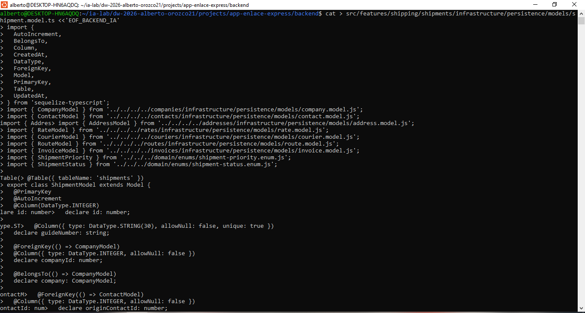

### 14.8 — features/shipping/shipments/infrastructure/persistence/repositories/shipment.repository.ts

**Archivo:** `src/features/shipping/shipments/infrastructure/persistence/repositories/shipment.repository.ts`

```bash
mkdir -p src/features/shipping/shipments/infrastructure/persistence/repositories
cat > src/features/shipping/shipments/infrastructure/persistence/repositories/shipment.repository.ts <<'EOF_BACKEND_IA'
import { Injectable } from '@nestjs/common';
import { Op } from 'sequelize';
import {
  buildPaginatedResult,
  normalizePagination,
} from '../../../../../../common/utils/pagination.util.js';
import { Shipment } from '../../../domain/entities/shipment.entity.js';
import {
  ShipmentFindAllParams,
  IShipmentRepository,
} from '../../../domain/interfaces/shipment-repository.interface.js';
import { ShipmentMapper } from '../../../application/mappers/shipment.mapper.js';
import { ShipmentModel } from '../models/shipment.model.js';

@Injectable()
export class ShipmentRepository implements IShipmentRepository {
  async create(shipment: Shipment): Promise<Shipment> {
    const model = await ShipmentModel.create(
      ShipmentMapper.toPersistence(shipment),
    );
    return ShipmentMapper.toDomain(model);
  }

  async update(shipment: Shipment): Promise<Shipment> {
    await ShipmentModel.update(ShipmentMapper.toPersistence(shipment), {
      where: { id: shipment.id },
    });
    const updated = await ShipmentModel.findByPk(shipment.id!);
    return ShipmentMapper.toDomain(updated!);
  }

  async delete(id: number): Promise<void> {
    await ShipmentModel.destroy({ where: { id } });
  }

  async findById(id: number): Promise<Shipment | null> {
    const model = await ShipmentModel.findByPk(id);
    return model ? ShipmentMapper.toDomain(model) : null;
  }

  async findAll(params: ShipmentFindAllParams) {
    const { page, limit, offset } = normalizePagination(
      params.page,
      params.limit,
    );

    const where: Record<string, unknown> = {};

    if (params.companyId) where.companyId = params.companyId;
    if (params.courierId) where.courierId = params.courierId;
    if (params.status) where.status = params.status;
    if (params.priority) where.priority = params.priority;

    if (params.search) {
      where[Op.or as unknown as string] = [
        { guideNumber: { [Op.like]: `%${params.search}%` } },
      ];
    }

    const { rows, count } = await ShipmentModel.findAndCountAll({
      where,
      limit,
      offset,
      order: [['createdAt', 'DESC']],
    });

    return buildPaginatedResult(
      rows.map((row) => ShipmentMapper.toDomain(row)),
      count,
      page,
      limit,
    );
  }
}
EOF_BACKEND_IA
```

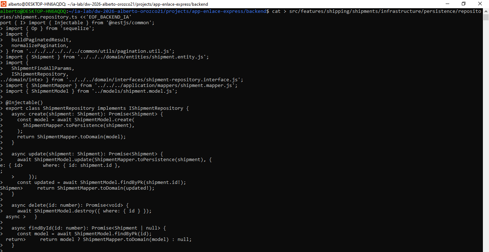

### 14.9 — features/shipping/shipments/infrastructure/persistence/migrations/create-shipments-table.migration.ts

**Archivo:** `src/features/shipping/shipments/infrastructure/persistence/migrations/create-shipments-table.migration.ts`

```bash
mkdir -p src/features/shipping/shipments/infrastructure/persistence/migrations
cat > src/features/shipping/shipments/infrastructure/persistence/migrations/create-shipments-table.migration.ts <<'EOF_BACKEND_IA'
export const createShipmentsTableMigration = {
  name: 'create-shipments-table',
  async up(): Promise<void> {
    // Sequelize sync handles table creation in development.
    // Production: CREATE TABLE shipments (id, guideNumber UQ, companyId FK->companies,
    //   originContactId FK->contacts, originAddressId FK->addresses,
    //   destinationContactId FK->contacts, destinationAddressId FK->addresses,
    //   rateId FK->rates, courierId FK->couriers NULL, routeId FK->routes NULL,
    //   invoiceId FK->invoices NULL, priority, totalWeightKg, declaredValue,
    //   calculatedCost, status, requestDate, estimatedDeliveryDate,
    //   actualDeliveryDate, isActive, createdAt, updatedAt)
  },
  async down(): Promise<void> {
    // Production: DROP TABLE shipments
  },
};
EOF_BACKEND_IA
```

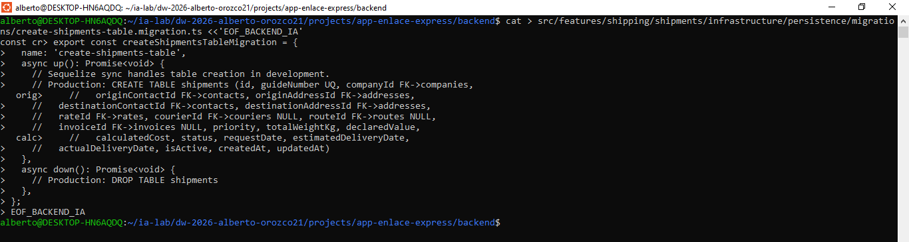

### 14.10 — features/shipping/shipments/infrastructure/persistence/seeders/shipments.seeder.ts

Depende de que ya existan empresas, contactos, direcciones y tarifas.

**Archivo:** `src/features/shipping/shipments/infrastructure/persistence/seeders/shipments.seeder.ts`

```bash
mkdir -p src/features/shipping/shipments/infrastructure/persistence/seeders
cat > src/features/shipping/shipments/infrastructure/persistence/seeders/shipments.seeder.ts <<'EOF_BACKEND_IA'
import { ShipmentModel } from '../models/shipment.model.js';
import { CompanyModel } from '../../../../companies/infrastructure/persistence/models/company.model.js';
import { ContactModel } from '../../../../contacts/infrastructure/persistence/models/contact.model.js';
import { AddressModel } from '../../../../addresses/infrastructure/persistence/models/address.model.js';
import { RateModel } from '../../../../rates/infrastructure/persistence/models/rate.model.js';
import { ShipmentPriority } from '../../../domain/enums/shipment-priority.enum.js';
import { ShipmentStatus } from '../../../domain/enums/shipment-status.enum.js';
import { Shipment } from '../../../domain/entities/shipment.entity.js';

export async function seedShipments(): Promise<void> {
  const count = await ShipmentModel.count();
  if (count > 0) {
    return;
  }

  const company = await CompanyModel.findOne({ order: [['id', 'ASC']] });
  const contact = await ContactModel.findOne({ order: [['id', 'ASC']] });
  const address = await AddressModel.findOne({ order: [['id', 'ASC']] });
  const rate = await RateModel.findOne({ order: [['id', 'ASC']] });

  if (!company || !contact || !address || !rate) {
    return;
  }

  await ShipmentModel.create({
    guideNumber: Shipment.generateGuideNumber(),
    companyId: company.id,
    originContactId: contact.id,
    originAddressId: address.id,
    destinationContactId: contact.id,
    destinationAddressId: address.id,
    rateId: rate.id,
    priority: ShipmentPriority.NORMAL,
    totalWeightKg: 5,
    declaredValue: 150000,
    status: ShipmentStatus.CREATED,
    requestDate: new Date(),
    estimatedDeliveryDate: new Date(Date.now() + 2 * 24 * 60 * 60 * 1000),
    isActive: true,
  });
}
EOF_BACKEND_IA
```

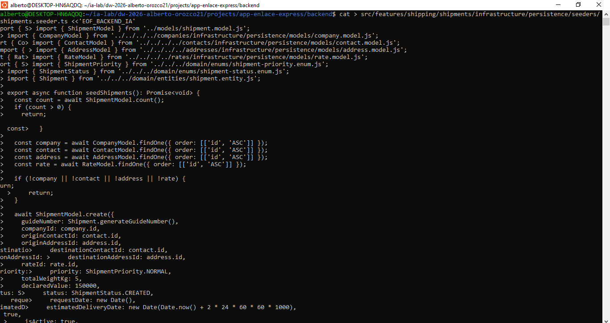

### 14.11 — features/shipping/shipments/application/dto/shipment-filter.dto.ts

**Archivo:** `src/features/shipping/shipments/application/dto/shipment-filter.dto.ts`

```bash
mkdir -p src/features/shipping/shipments/application/dto
cat > src/features/shipping/shipments/application/dto/shipment-filter.dto.ts <<'EOF_BACKEND_IA'
import { ApiPropertyOptional } from '@nestjs/swagger';
import { Type } from 'class-transformer';
import {
  IsEnum,
  IsInt,
  IsOptional,
  IsPositive,
  IsString,
  Min,
} from 'class-validator';
import { ShipmentPriority } from '../../domain/enums/shipment-priority.enum.js';
import { ShipmentStatus } from '../../domain/enums/shipment-status.enum.js';

export class ShipmentFilterDto {
  @ApiPropertyOptional({ example: 1, default: 1 })
  @IsOptional()
  @Type(() => Number)
  @IsInt()
  @Min(1)
  page?: number;

  @ApiPropertyOptional({ example: 10, default: 10 })
  @IsOptional()
  @Type(() => Number)
  @IsInt()
  @IsPositive()
  limit?: number;

  @ApiPropertyOptional({ example: 'ENV-' })
  @IsOptional()
  @IsString()
  search?: string;

  @ApiPropertyOptional({ example: 1 })
  @IsOptional()
  @Type(() => Number)
  @IsInt()
  @IsPositive()
  companyId?: number;

  @ApiPropertyOptional({ example: 1 })
  @IsOptional()
  @Type(() => Number)
  @IsInt()
  @IsPositive()
  courierId?: number;

  @ApiPropertyOptional({ enum: ShipmentStatus, example: ShipmentStatus.IN_TRANSIT })
  @IsOptional()
  @IsEnum(ShipmentStatus)
  status?: ShipmentStatus;

  @ApiPropertyOptional({ enum: ShipmentPriority, example: ShipmentPriority.URGENT })
  @IsOptional()
  @IsEnum(ShipmentPriority)
  priority?: ShipmentPriority;
}
EOF_BACKEND_IA
```

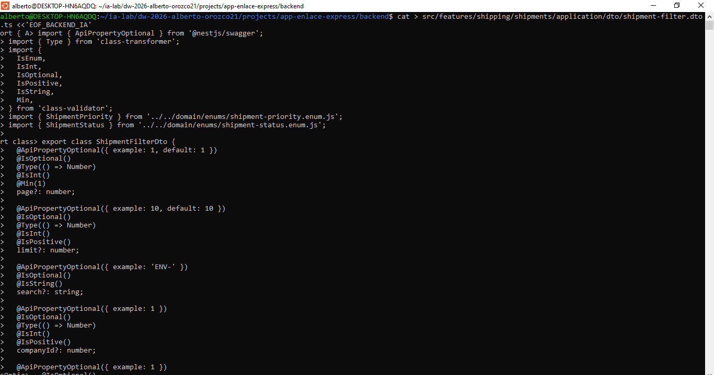

### 14.12 — features/shipping/shipments/application/dto/shipment-response.dto.ts

**Archivo:** `src/features/shipping/shipments/application/dto/shipment-response.dto.ts`

```bash
mkdir -p src/features/shipping/shipments/application/dto
cat > src/features/shipping/shipments/application/dto/shipment-response.dto.ts <<'EOF_BACKEND_IA'
import { ApiProperty, ApiPropertyOptional } from '@nestjs/swagger';
import { ShipmentPriority } from '../../domain/enums/shipment-priority.enum.js';
import { ShipmentStatus } from '../../domain/enums/shipment-status.enum.js';

export class ShipmentResponseDto {
  @ApiProperty({ example: 1 })
  id: number;

  @ApiProperty({ example: 'ENV-LK3F9A-B7K2' })
  guideNumber: string;

  @ApiProperty({ example: 1 })
  companyId: number;

  @ApiProperty({ example: 1 })
  originContactId: number;

  @ApiProperty({ example: 1 })
  originAddressId: number;

  @ApiProperty({ example: 2 })
  destinationContactId: number;

  @ApiProperty({ example: 2 })
  destinationAddressId: number;

  @ApiProperty({ example: 1 })
  rateId: number;

  @ApiPropertyOptional({ example: 1 })
  courierId?: number;

  @ApiPropertyOptional({ example: 1 })
  routeId?: number;

  @ApiPropertyOptional({ example: 1 })
  invoiceId?: number;

  @ApiProperty({ enum: ShipmentPriority, example: ShipmentPriority.NORMAL })
  priority: ShipmentPriority;

  @ApiProperty({ example: 5 })
  totalWeightKg: number;

  @ApiProperty({ example: 150000 })
  declaredValue: number;

  @ApiPropertyOptional({ example: 18500 })
  calculatedCost?: number;

  @ApiProperty({ enum: ShipmentStatus, example: ShipmentStatus.CREATED })
  status: ShipmentStatus;

  @ApiProperty()
  requestDate: Date;

  @ApiProperty()
  estimatedDeliveryDate: Date;

  @ApiPropertyOptional()
  actualDeliveryDate?: Date;

  @ApiProperty({ example: true })
  isActive: boolean;

  @ApiProperty()
  createdAt: Date;

  @ApiProperty()
  updatedAt: Date;
}
EOF_BACKEND_IA
```

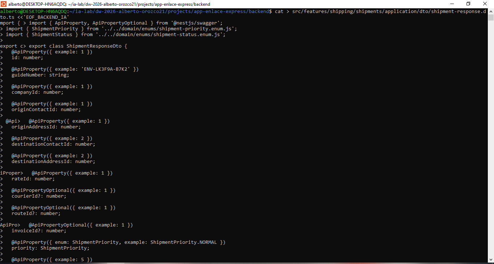

### 14.13 — features/shipping/shipments/application/dto/create-shipment.dto.ts

No incluye `guideNumber` (lo genera el dominio), ni `status`/`calculatedCost`/`courierId`/`routeId`/`invoiceId` (llegan después vía las transiciones).

**Archivo:** `src/features/shipping/shipments/application/dto/create-shipment.dto.ts`

```bash
mkdir -p src/features/shipping/shipments/application/dto
cat > src/features/shipping/shipments/application/dto/create-shipment.dto.ts <<'EOF_BACKEND_IA'
import { ApiProperty, ApiPropertyOptional } from '@nestjs/swagger';
import {
  IsDateString,
  IsEnum,
  IsInt,
  IsNumber,
  IsOptional,
  IsPositive,
  Min,
} from 'class-validator';
import { ShipmentPriority } from '../../domain/enums/shipment-priority.enum.js';

export class CreateShipmentDto {
  @ApiProperty({ example: 1 })
  @IsInt()
  @IsPositive()
  companyId: number;

  @ApiProperty({ example: 1 })
  @IsInt()
  @IsPositive()
  originContactId: number;

  @ApiProperty({ example: 1 })
  @IsInt()
  @IsPositive()
  originAddressId: number;

  @ApiProperty({ example: 2 })
  @IsInt()
  @IsPositive()
  destinationContactId: number;

  @ApiProperty({ example: 2 })
  @IsInt()
  @IsPositive()
  destinationAddressId: number;

  @ApiProperty({ example: 1 })
  @IsInt()
  @IsPositive()
  rateId: number;

  @ApiPropertyOptional({ enum: ShipmentPriority, default: ShipmentPriority.NORMAL })
  @IsOptional()
  @IsEnum(ShipmentPriority)
  priority?: ShipmentPriority;

  @ApiProperty({ example: 5 })
  @IsNumber()
  @Min(0.01)
  totalWeightKg: number;

  @ApiProperty({ example: 150000 })
  @IsNumber()
  @Min(0)
  declaredValue: number;

  @ApiProperty({ example: '2026-09-17' })
  @IsDateString()
  estimatedDeliveryDate: string;
}
EOF_BACKEND_IA
```

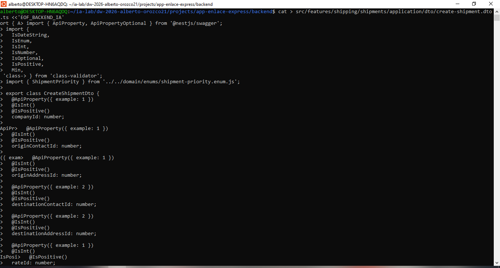

### 14.14 — features/shipping/shipments/application/dto/update-shipment.dto.ts

Solo campos comerciales editables mientras el envío está `creado` (ver `Shipment.update`).

**Archivo:** `src/features/shipping/shipments/application/dto/update-shipment.dto.ts`

```bash
mkdir -p src/features/shipping/shipments/application/dto
cat > src/features/shipping/shipments/application/dto/update-shipment.dto.ts <<'EOF_BACKEND_IA'
import { PartialType, PickType } from '@nestjs/mapped-types';
import { CreateShipmentDto } from './create-shipment.dto.js';

export class UpdateShipmentDto extends PartialType(
  PickType(CreateShipmentDto, [
    'priority',
    'totalWeightKg',
    'declaredValue',
    'estimatedDeliveryDate',
  ] as const),
) {}
EOF_BACKEND_IA
```

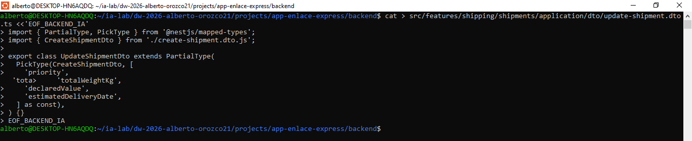

### 14.15 — features/shipping/shipments/application/dto/assign-shipment.dto.ts

**Archivo:** `src/features/shipping/shipments/application/dto/assign-shipment.dto.ts`

```bash
mkdir -p src/features/shipping/shipments/application/dto
cat > src/features/shipping/shipments/application/dto/assign-shipment.dto.ts <<'EOF_BACKEND_IA'
import { ApiProperty } from '@nestjs/swagger';
import { IsInt, IsPositive } from 'class-validator';

export class AssignShipmentDto {
  @ApiProperty({ example: 1 })
  @IsInt()
  @IsPositive()
  courierId: number;

  @ApiProperty({ example: 1 })
  @IsInt()
  @IsPositive()
  routeId: number;
}
EOF_BACKEND_IA
```

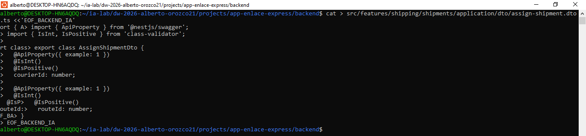

### 14.16 — features/shipping/shipments/application/mappers/shipment.mapper.ts

**Archivo:** `src/features/shipping/shipments/application/mappers/shipment.mapper.ts`

```bash
mkdir -p src/features/shipping/shipments/application/mappers
cat > src/features/shipping/shipments/application/mappers/shipment.mapper.ts <<'EOF_BACKEND_IA'
import { Shipment } from '../../domain/entities/shipment.entity.js';
import { ShipmentResponseDto } from '../dto/shipment-response.dto.js';
import { ShipmentModel } from '../../infrastructure/persistence/models/shipment.model.js';

export class ShipmentMapper {
  static toDomain(model: ShipmentModel): Shipment {
    return Shipment.reconstitute({
      id: model.id,
      guideNumber: model.guideNumber,
      companyId: model.companyId,
      originContactId: model.originContactId,
      originAddressId: model.originAddressId,
      destinationContactId: model.destinationContactId,
      destinationAddressId: model.destinationAddressId,
      rateId: model.rateId,
      courierId: model.courierId ?? undefined,
      routeId: model.routeId ?? undefined,
      invoiceId: model.invoiceId ?? undefined,
      priority: model.priority,
      totalWeightKg: Number(model.totalWeightKg),
      declaredValue: Number(model.declaredValue),
      calculatedCost:
        model.calculatedCost !== null ? Number(model.calculatedCost) : undefined,
      status: model.status,
      requestDate: model.requestDate,
      estimatedDeliveryDate: model.estimatedDeliveryDate,
      actualDeliveryDate: model.actualDeliveryDate ?? undefined,
      isActive: model.isActive,
      createdAt: model.createdAt,
      updatedAt: model.updatedAt,
    });
  }

  static toResponse(entity: Shipment): ShipmentResponseDto {
    return {
      id: entity.id!,
      guideNumber: entity.guideNumber,
      companyId: entity.companyId,
      originContactId: entity.originContactId,
      originAddressId: entity.originAddressId,
      destinationContactId: entity.destinationContactId,
      destinationAddressId: entity.destinationAddressId,
      rateId: entity.rateId,
      courierId: entity.courierId,
      routeId: entity.routeId,
      invoiceId: entity.invoiceId,
      priority: entity.priority,
      totalWeightKg: entity.totalWeightKg,
      declaredValue: entity.declaredValue,
      calculatedCost: entity.calculatedCost,
      status: entity.status,
      requestDate: entity.requestDate,
      estimatedDeliveryDate: entity.estimatedDeliveryDate,
      actualDeliveryDate: entity.actualDeliveryDate,
      isActive: entity.isActive,
      createdAt: entity.createdAt!,
      updatedAt: entity.updatedAt!,
    };
  }

  static toPersistence(entity: Shipment): Partial<ShipmentModel> {
    return {
      id: entity.id,
      guideNumber: entity.guideNumber,
      companyId: entity.companyId,
      originContactId: entity.originContactId,
      originAddressId: entity.originAddressId,
      destinationContactId: entity.destinationContactId,
      destinationAddressId: entity.destinationAddressId,
      rateId: entity.rateId,
      courierId: entity.courierId ?? null,
      routeId: entity.routeId ?? null,
      invoiceId: entity.invoiceId ?? null,
      priority: entity.priority,
      totalWeightKg: entity.totalWeightKg,
      declaredValue: entity.declaredValue,
      calculatedCost: entity.calculatedCost ?? null,
      status: entity.status,
      requestDate: entity.requestDate,
      estimatedDeliveryDate: entity.estimatedDeliveryDate,
      actualDeliveryDate: entity.actualDeliveryDate ?? null,
      isActive: entity.isActive ?? true,
    };
  }
}
EOF_BACKEND_IA
```

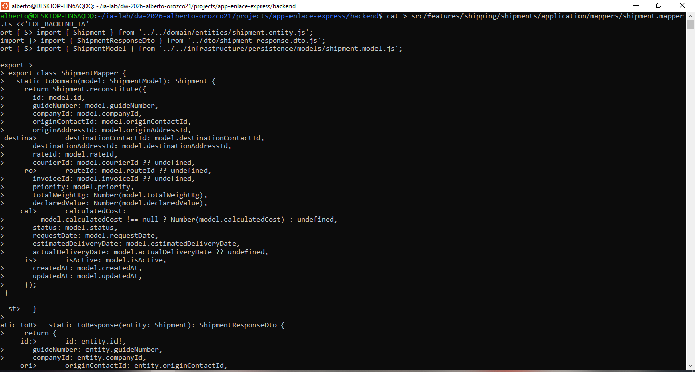

### 14.17 — features/shipping/shipments/application/use-cases/create-shipment.use-case.ts

El caso de uso más "cruzado" del proyecto: valida empresa, contacto/dirección de origen y destino (y que pertenezcan a esa empresa), y tarifa.

**Archivo:** `src/features/shipping/shipments/application/use-cases/create-shipment.use-case.ts`

```bash
mkdir -p src/features/shipping/shipments/application/use-cases
cat > src/features/shipping/shipments/application/use-cases/create-shipment.use-case.ts <<'EOF_BACKEND_IA'
import { Inject, Injectable } from '@nestjs/common';
import { CompanyNotFoundException } from '../../../companies/domain/exceptions/company-not-found.exception.js';
import {
  COMPANY_REPOSITORY,
  type ICompanyRepository,
} from '../../../companies/domain/interfaces/company-repository.interface.js';
import { ContactNotFoundException } from '../../../contacts/domain/exceptions/contact-not-found.exception.js';
import {
  CONTACT_REPOSITORY,
  type IContactRepository,
} from '../../../contacts/domain/interfaces/contact-repository.interface.js';
import { AddressNotFoundException } from '../../../addresses/domain/exceptions/address-not-found.exception.js';
import {
  ADDRESS_REPOSITORY,
  type IAddressRepository,
} from '../../../addresses/domain/interfaces/address-repository.interface.js';
import { RateNotFoundException } from '../../../rates/domain/exceptions/rate-not-found.exception.js';
import {
  RATE_REPOSITORY,
  type IRateRepository,
} from '../../../rates/domain/interfaces/rate-repository.interface.js';
import { Shipment } from '../../domain/entities/shipment.entity.js';
import {
  SHIPMENT_REPOSITORY,
  type IShipmentRepository,
} from '../../domain/interfaces/shipment-repository.interface.js';
import { CreateShipmentDto } from '../dto/create-shipment.dto.js';
import { ShipmentMapper } from '../mappers/shipment.mapper.js';

@Injectable()
export class CreateShipmentUseCase {
  constructor(
    @Inject(SHIPMENT_REPOSITORY)
    private readonly shipmentRepository: IShipmentRepository,
    @Inject(COMPANY_REPOSITORY)
    private readonly companyRepository: ICompanyRepository,
    @Inject(CONTACT_REPOSITORY)
    private readonly contactRepository: IContactRepository,
    @Inject(ADDRESS_REPOSITORY)
    private readonly addressRepository: IAddressRepository,
    @Inject(RATE_REPOSITORY)
    private readonly rateRepository: IRateRepository,
  ) {}

  async execute(dto: CreateShipmentDto) {
    const company = await this.companyRepository.findById(dto.companyId);
    if (!company) throw new CompanyNotFoundException(dto.companyId);

    const [originContact, destinationContact, originAddress, destinationAddress, rate] =
      await Promise.all([
        this.contactRepository.findById(dto.originContactId),
        this.contactRepository.findById(dto.destinationContactId),
        this.addressRepository.findById(dto.originAddressId),
        this.addressRepository.findById(dto.destinationAddressId),
        this.rateRepository.findById(dto.rateId),
      ]);

    if (!originContact) throw new ContactNotFoundException(dto.originContactId);
    if (!destinationContact) throw new ContactNotFoundException(dto.destinationContactId);
    if (!originAddress) throw new AddressNotFoundException(dto.originAddressId);
    if (!destinationAddress) throw new AddressNotFoundException(dto.destinationAddressId);
    if (!rate) throw new RateNotFoundException(dto.rateId);

    if (originContact.companyId !== dto.companyId) {
      throw new Error('El contacto de origen no pertenece a la empresa indicada');
    }
    if (destinationContact.companyId !== dto.companyId) {
      throw new Error('El contacto de destino no pertenece a la empresa indicada');
    }
    if (originAddress.companyId !== dto.companyId) {
      throw new Error('La dirección de origen no pertenece a la empresa indicada');
    }
    if (destinationAddress.companyId !== dto.companyId) {
      throw new Error('La dirección de destino no pertenece a la empresa indicada');
    }

    const shipment = Shipment.create({
      guideNumber: Shipment.generateGuideNumber(),
      companyId: dto.companyId,
      originContactId: dto.originContactId,
      originAddressId: dto.originAddressId,
      destinationContactId: dto.destinationContactId,
      destinationAddressId: dto.destinationAddressId,
      rateId: dto.rateId,
      priority: dto.priority,
      totalWeightKg: dto.totalWeightKg,
      declaredValue: dto.declaredValue,
      estimatedDeliveryDate: new Date(dto.estimatedDeliveryDate),
    });

    const created = await this.shipmentRepository.create(shipment);
    return ShipmentMapper.toResponse(created);
  }
}
EOF_BACKEND_IA
```

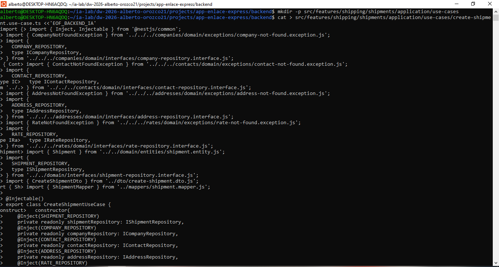

### 14.18 — features/shipping/shipments/application/use-cases/get-shipment.use-case.ts

**Archivo:** `src/features/shipping/shipments/application/use-cases/get-shipment.use-case.ts`

```bash
mkdir -p src/features/shipping/shipments/application/use-cases
cat > src/features/shipping/shipments/application/use-cases/get-shipment.use-case.ts <<'EOF_BACKEND_IA'
import { Inject, Injectable } from '@nestjs/common';
import { ShipmentNotFoundException } from '../../domain/exceptions/shipment-not-found.exception.js';
import {
  SHIPMENT_REPOSITORY,
  type IShipmentRepository,
} from '../../domain/interfaces/shipment-repository.interface.js';
import { ShipmentMapper } from '../mappers/shipment.mapper.js';

@Injectable()
export class GetShipmentUseCase {
  constructor(
    @Inject(SHIPMENT_REPOSITORY)
    private readonly shipmentRepository: IShipmentRepository,
  ) {}

  async execute(id: number) {
    const shipment = await this.shipmentRepository.findById(id);
    if (!shipment) throw new ShipmentNotFoundException(id);
    return ShipmentMapper.toResponse(shipment);
  }
}
EOF_BACKEND_IA
```

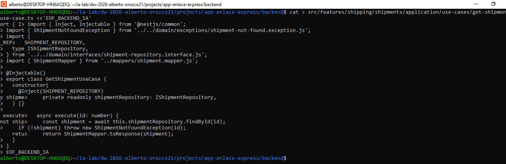

### 14.19 — features/shipping/shipments/application/use-cases/list-shipments.use-case.ts

**Archivo:** `src/features/shipping/shipments/application/use-cases/list-shipments.use-case.ts`

```bash
mkdir -p src/features/shipping/shipments/application/use-cases
cat > src/features/shipping/shipments/application/use-cases/list-shipments.use-case.ts <<'EOF_BACKEND_IA'
import { Inject, Injectable } from '@nestjs/common';
import {
  SHIPMENT_REPOSITORY,
  type IShipmentRepository,
} from '../../domain/interfaces/shipment-repository.interface.js';
import { ShipmentFilterDto } from '../dto/shipment-filter.dto.js';
import { ShipmentMapper } from '../mappers/shipment.mapper.js';

@Injectable()
export class ListShipmentsUseCase {
  constructor(
    @Inject(SHIPMENT_REPOSITORY)
    private readonly shipmentRepository: IShipmentRepository,
  ) {}

  async execute(filter: ShipmentFilterDto) {
    const result = await this.shipmentRepository.findAll(filter);
    return {
      items: result.items.map((shipment) => ShipmentMapper.toResponse(shipment)),
      meta: result.meta,
    };
  }
}
EOF_BACKEND_IA
```

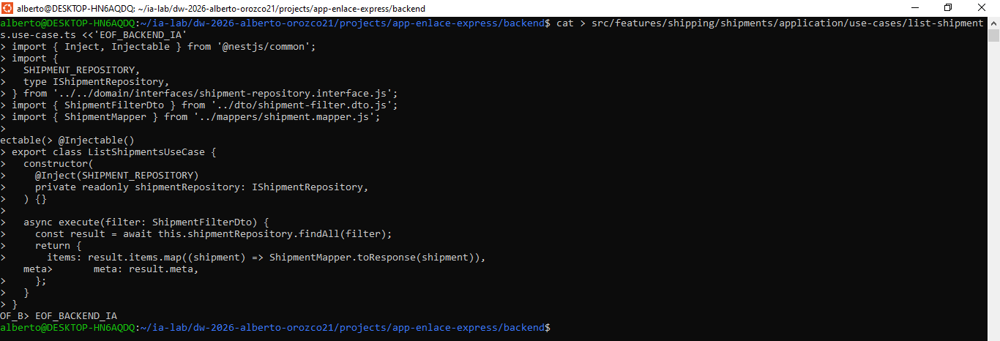

### 14.20 — features/shipping/shipments/application/use-cases/update-shipment.use-case.ts

**Archivo:** `src/features/shipping/shipments/application/use-cases/update-shipment.use-case.ts`

```bash
mkdir -p src/features/shipping/shipments/application/use-cases
cat > src/features/shipping/shipments/application/use-cases/update-shipment.use-case.ts <<'EOF_BACKEND_IA'
import { Inject, Injectable } from '@nestjs/common';
import { ShipmentNotFoundException } from '../../domain/exceptions/shipment-not-found.exception.js';
import {
  SHIPMENT_REPOSITORY,
  type IShipmentRepository,
} from '../../domain/interfaces/shipment-repository.interface.js';
import { UpdateShipmentDto } from '../dto/update-shipment.dto.js';
import { ShipmentMapper } from '../mappers/shipment.mapper.js';

@Injectable()
export class UpdateShipmentUseCase {
  constructor(
    @Inject(SHIPMENT_REPOSITORY)
    private readonly shipmentRepository: IShipmentRepository,
  ) {}

  async execute(id: number, dto: UpdateShipmentDto) {
    const shipment = await this.shipmentRepository.findById(id);
    if (!shipment) throw new ShipmentNotFoundException(id);

    shipment.update({
      priority: dto.priority,
      totalWeightKg: dto.totalWeightKg,
      declaredValue: dto.declaredValue,
      estimatedDeliveryDate: dto.estimatedDeliveryDate
        ? new Date(dto.estimatedDeliveryDate)
        : undefined,
    });

    const updated = await this.shipmentRepository.update(shipment);
    return ShipmentMapper.toResponse(updated);
  }
}
EOF_BACKEND_IA
```

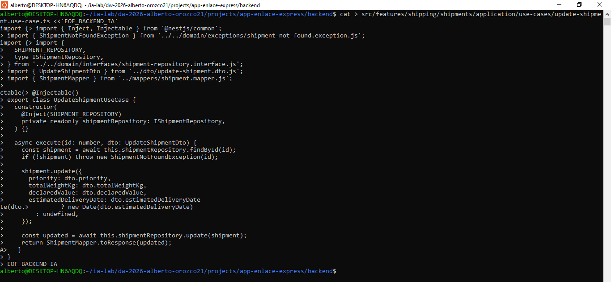

### 14.21 — features/shipping/shipments/application/use-cases/quote-shipment.use-case.ts

Calcula `calculatedCost` a partir de la `Tarifa` vinculada, el peso y la prioridad, y transiciona `creado → cotizado`.

**Archivo:** `src/features/shipping/shipments/application/use-cases/quote-shipment.use-case.ts`

```bash
mkdir -p src/features/shipping/shipments/application/use-cases
cat > src/features/shipping/shipments/application/use-cases/quote-shipment.use-case.ts <<'EOF_BACKEND_IA'
import { Inject, Injectable } from '@nestjs/common';
import { RateCalculationRule } from '../../../rates/domain/enums/rate-calculation-rule.enum.js';
import { RateNotFoundException } from '../../../rates/domain/exceptions/rate-not-found.exception.js';
import {
  RATE_REPOSITORY,
  type IRateRepository,
} from '../../../rates/domain/interfaces/rate-repository.interface.js';
import { ShipmentPriority } from '../../domain/enums/shipment-priority.enum.js';
import { ShipmentNotFoundException } from '../../domain/exceptions/shipment-not-found.exception.js';
import {
  SHIPMENT_REPOSITORY,
  type IShipmentRepository,
} from '../../domain/interfaces/shipment-repository.interface.js';
import { ShipmentMapper } from '../mappers/shipment.mapper.js';

@Injectable()
export class QuoteShipmentUseCase {
  constructor(
    @Inject(SHIPMENT_REPOSITORY)
    private readonly shipmentRepository: IShipmentRepository,
    @Inject(RATE_REPOSITORY)
    private readonly rateRepository: IRateRepository,
  ) {}

  async execute(id: number) {
    const shipment = await this.shipmentRepository.findById(id);
    if (!shipment) throw new ShipmentNotFoundException(id);

    const rate = await this.rateRepository.findById(shipment.rateId);
    if (!rate) throw new RateNotFoundException(shipment.rateId);

    let cost =
      rate.calculationRule === RateCalculationRule.FLAT
        ? rate.baseValue
        : rate.baseValue + shipment.totalWeightKg * rate.additionalValuePerKg;

    if (
      shipment.priority === ShipmentPriority.URGENT ||
      shipment.priority === ShipmentPriority.EXPRESS
    ) {
      cost += cost * (rate.urgentSurchargePct / 100);
    }

    shipment.quote(Number(cost.toFixed(2)));

    const updated = await this.shipmentRepository.update(shipment);
    return ShipmentMapper.toResponse(updated);
  }
}
EOF_BACKEND_IA
```

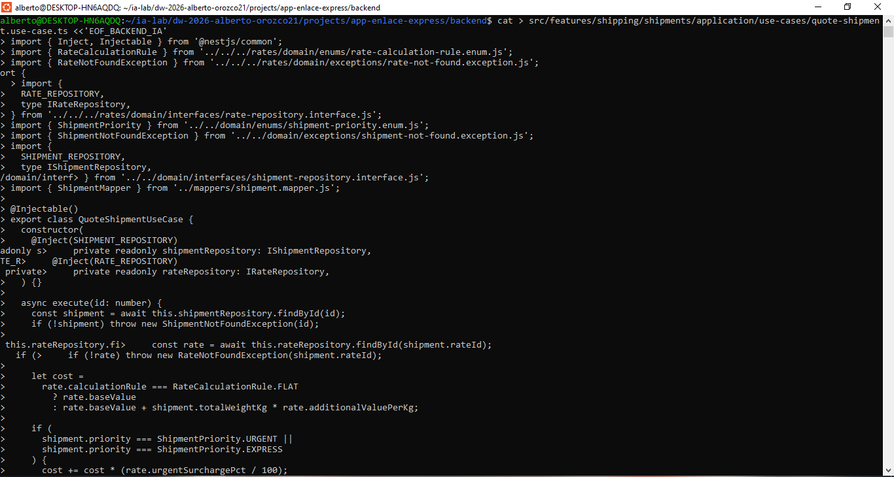

### 14.22 — features/shipping/shipments/application/use-cases/assign-shipment.use-case.ts

Verifica mensajero y ruta, y que la ruta pertenezca a ese mensajero. Transiciona `cotizado → asignado`.

**Archivo:** `src/features/shipping/shipments/application/use-cases/assign-shipment.use-case.ts`

```bash
mkdir -p src/features/shipping/shipments/application/use-cases
cat > src/features/shipping/shipments/application/use-cases/assign-shipment.use-case.ts <<'EOF_BACKEND_IA'
import { Inject, Injectable } from '@nestjs/common';
import { CourierNotFoundException } from '../../../couriers/domain/exceptions/courier-not-found.exception.js';
import {
  COURIER_REPOSITORY,
  type ICourierRepository,
} from '../../../couriers/domain/interfaces/courier-repository.interface.js';
import { RouteNotFoundException } from '../../../routes/domain/exceptions/route-not-found.exception.js';
import {
  ROUTE_REPOSITORY,
  type IRouteRepository,
} from '../../../routes/domain/interfaces/route-repository.interface.js';
import { ShipmentNotFoundException } from '../../domain/exceptions/shipment-not-found.exception.js';
import {
  SHIPMENT_REPOSITORY,
  type IShipmentRepository,
} from '../../domain/interfaces/shipment-repository.interface.js';
import { AssignShipmentDto } from '../dto/assign-shipment.dto.js';
import { ShipmentMapper } from '../mappers/shipment.mapper.js';

@Injectable()
export class AssignShipmentUseCase {
  constructor(
    @Inject(SHIPMENT_REPOSITORY)
    private readonly shipmentRepository: IShipmentRepository,
    @Inject(COURIER_REPOSITORY)
    private readonly courierRepository: ICourierRepository,
    @Inject(ROUTE_REPOSITORY)
    private readonly routeRepository: IRouteRepository,
  ) {}

  async execute(id: number, dto: AssignShipmentDto) {
    const shipment = await this.shipmentRepository.findById(id);
    if (!shipment) throw new ShipmentNotFoundException(id);

    const courier = await this.courierRepository.findById(dto.courierId);
    if (!courier) throw new CourierNotFoundException(dto.courierId);

    const route = await this.routeRepository.findById(dto.routeId);
    if (!route) throw new RouteNotFoundException(dto.routeId);

    if (route.courierId !== dto.courierId) {
      throw new Error('La ruta no pertenece al mensajero indicado');
    }

    shipment.assign(dto.courierId, dto.routeId);

    const updated = await this.shipmentRepository.update(shipment);
    return ShipmentMapper.toResponse(updated);
  }
}
EOF_BACKEND_IA
```

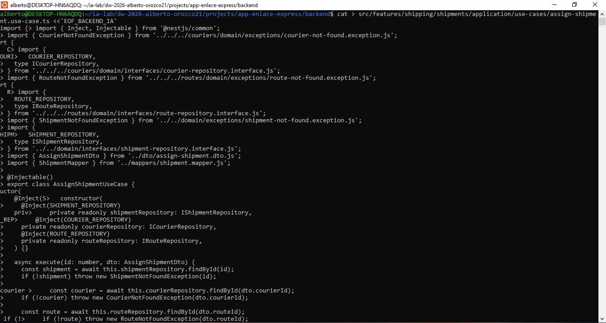

### 14.23 — features/shipping/shipments/application/use-cases/start-transit-shipment.use-case.ts

**Archivo:** `src/features/shipping/shipments/application/use-cases/start-transit-shipment.use-case.ts`

```bash
mkdir -p src/features/shipping/shipments/application/use-cases
cat > src/features/shipping/shipments/application/use-cases/start-transit-shipment.use-case.ts <<'EOF_BACKEND_IA'
import { Inject, Injectable } from '@nestjs/common';
import { ShipmentNotFoundException } from '../../domain/exceptions/shipment-not-found.exception.js';
import {
  SHIPMENT_REPOSITORY,
  type IShipmentRepository,
} from '../../domain/interfaces/shipment-repository.interface.js';
import { ShipmentMapper } from '../mappers/shipment.mapper.js';

@Injectable()
export class StartTransitShipmentUseCase {
  constructor(
    @Inject(SHIPMENT_REPOSITORY)
    private readonly shipmentRepository: IShipmentRepository,
  ) {}

  async execute(id: number) {
    const shipment = await this.shipmentRepository.findById(id);
    if (!shipment) throw new ShipmentNotFoundException(id);

    shipment.startTransit();

    const updated = await this.shipmentRepository.update(shipment);
    return ShipmentMapper.toResponse(updated);
  }
}
EOF_BACKEND_IA
```

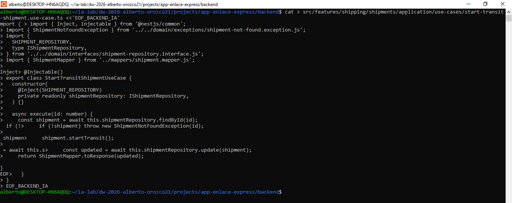

### 14.24 — features/shipping/shipments/application/use-cases/report-shipment-issue.use-case.ts

**Archivo:** `src/features/shipping/shipments/application/use-cases/report-shipment-issue.use-case.ts`

```bash
mkdir -p src/features/shipping/shipments/application/use-cases
cat > src/features/shipping/shipments/application/use-cases/report-shipment-issue.use-case.ts <<'EOF_BACKEND_IA'
import { Inject, Injectable } from '@nestjs/common';
import { ShipmentNotFoundException } from '../../domain/exceptions/shipment-not-found.exception.js';
import {
  SHIPMENT_REPOSITORY,
  type IShipmentRepository,
} from '../../domain/interfaces/shipment-repository.interface.js';
import { ShipmentMapper } from '../mappers/shipment.mapper.js';

@Injectable()
export class ReportShipmentIssueUseCase {
  constructor(
    @Inject(SHIPMENT_REPOSITORY)
    private readonly shipmentRepository: IShipmentRepository,
  ) {}

  async execute(id: number) {
    const shipment = await this.shipmentRepository.findById(id);
    if (!shipment) throw new ShipmentNotFoundException(id);

    shipment.reportIssue();

    const updated = await this.shipmentRepository.update(shipment);
    return ShipmentMapper.toResponse(updated);
  }
}
EOF_BACKEND_IA
```

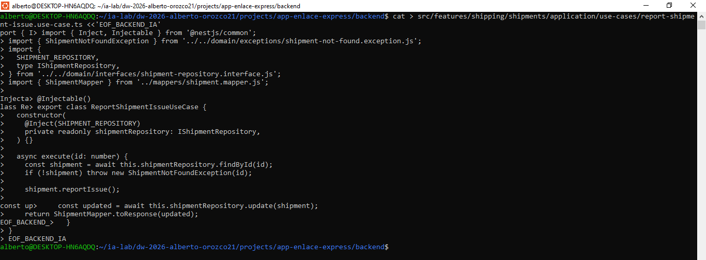

### 14.25 — features/shipping/shipments/application/use-cases/deliver-shipment.use-case.ts

**Archivo:** `src/features/shipping/shipments/application/use-cases/deliver-shipment.use-case.ts`

```bash
mkdir -p src/features/shipping/shipments/application/use-cases
cat > src/features/shipping/shipments/application/use-cases/deliver-shipment.use-case.ts <<'EOF_BACKEND_IA'
import { Inject, Injectable } from '@nestjs/common';
import { ShipmentNotFoundException } from '../../domain/exceptions/shipment-not-found.exception.js';
import {
  SHIPMENT_REPOSITORY,
  type IShipmentRepository,
} from '../../domain/interfaces/shipment-repository.interface.js';
import { ShipmentMapper } from '../mappers/shipment.mapper.js';

@Injectable()
export class DeliverShipmentUseCase {
  // TODO(fase PruebaEntrega): inyectar PROOF_OF_DELIVERY_REPOSITORY y exigir
  // que exista una prueba de entrega válida antes de llamar shipment.deliver().
  constructor(
    @Inject(SHIPMENT_REPOSITORY)
    private readonly shipmentRepository: IShipmentRepository,
  ) {}

  async execute(id: number) {
    const shipment = await this.shipmentRepository.findById(id);
    if (!shipment) throw new ShipmentNotFoundException(id);

    shipment.deliver();

    const updated = await this.shipmentRepository.update(shipment);
    return ShipmentMapper.toResponse(updated);
  }
}
EOF_BACKEND_IA
```

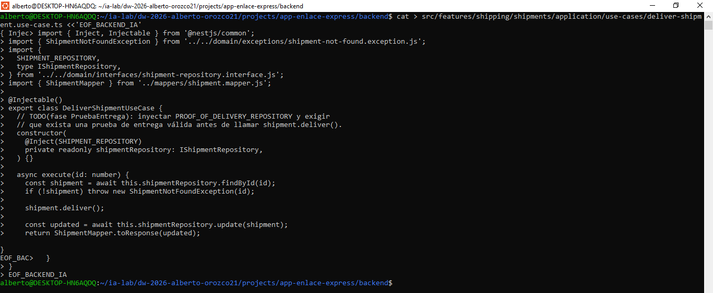
**Sugerencia de commit (issue):**

### 14.26 — features/shipping/shipments/application/use-cases/cancel-shipment.use-case.ts

**Archivo:** `src/features/shipping/shipments/application/use-cases/cancel-shipment.use-case.ts`

```bash
mkdir -p src/features/shipping/shipments/application/use-cases
cat > src/features/shipping/shipments/application/use-cases/cancel-shipment.use-case.ts <<'EOF_BACKEND_IA'
import { Inject, Injectable } from '@nestjs/common';
import { ShipmentNotFoundException } from '../../domain/exceptions/shipment-not-found.exception.js';
import {
  SHIPMENT_REPOSITORY,
  type IShipmentRepository,
} from '../../domain/interfaces/shipment-repository.interface.js';
import { ShipmentMapper } from '../mappers/shipment.mapper.js';

@Injectable()
export class CancelShipmentUseCase {
  constructor(
    @Inject(SHIPMENT_REPOSITORY)
    private readonly shipmentRepository: IShipmentRepository,
  ) {}

  async execute(id: number) {
    const shipment = await this.shipmentRepository.findById(id);
    if (!shipment) throw new ShipmentNotFoundException(id);

    shipment.cancel();

    const updated = await this.shipmentRepository.update(shipment);
    return ShipmentMapper.toResponse(updated);
  }
}
EOF_BACKEND_IA
```

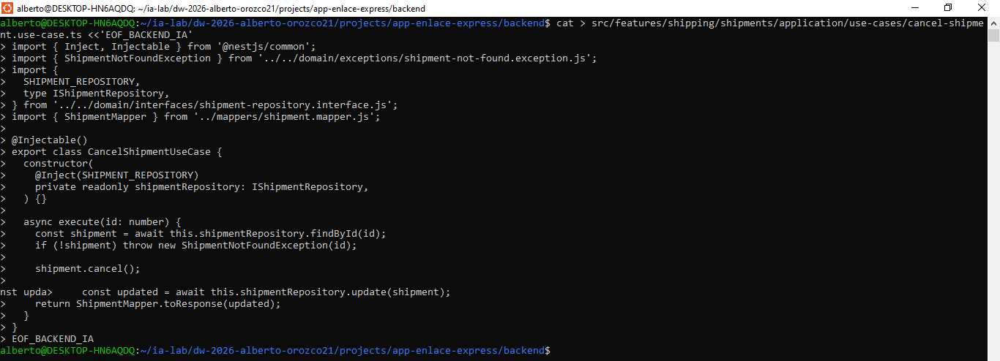

### 14.27 — features/shipping/shipments/application/use-cases/delete-shipment.use-case.ts

Solo se puede borrar un envío recién creado (nunca uno cotizado en adelante — para eso existe `cancelar`).

**Archivo:** `src/features/shipping/shipments/application/use-cases/delete-shipment.use-case.ts`

```bash
mkdir -p src/features/shipping/shipments/application/use-cases
cat > src/features/shipping/shipments/application/use-cases/delete-shipment.use-case.ts <<'EOF_BACKEND_IA'
import { Inject, Injectable } from '@nestjs/common';
import { ShipmentStatus } from '../../domain/enums/shipment-status.enum.js';
import { ShipmentNotFoundException } from '../../domain/exceptions/shipment-not-found.exception.js';
import {
  SHIPMENT_REPOSITORY,
  type IShipmentRepository,
} from '../../domain/interfaces/shipment-repository.interface.js';

@Injectable()
export class DeleteShipmentUseCase {
  constructor(
    @Inject(SHIPMENT_REPOSITORY)
    private readonly shipmentRepository: IShipmentRepository,
  ) {}

  async execute(id: number): Promise<void> {
    const shipment = await this.shipmentRepository.findById(id);
    if (!shipment) throw new ShipmentNotFoundException(id);

    if (shipment.status !== ShipmentStatus.CREATED) {
      throw new Error(
        `No se puede eliminar un envío en estado '${shipment.status}'; use cancelar en su lugar`,
      );
    }

    await this.shipmentRepository.delete(id);
  }
}
EOF_BACKEND_IA
```

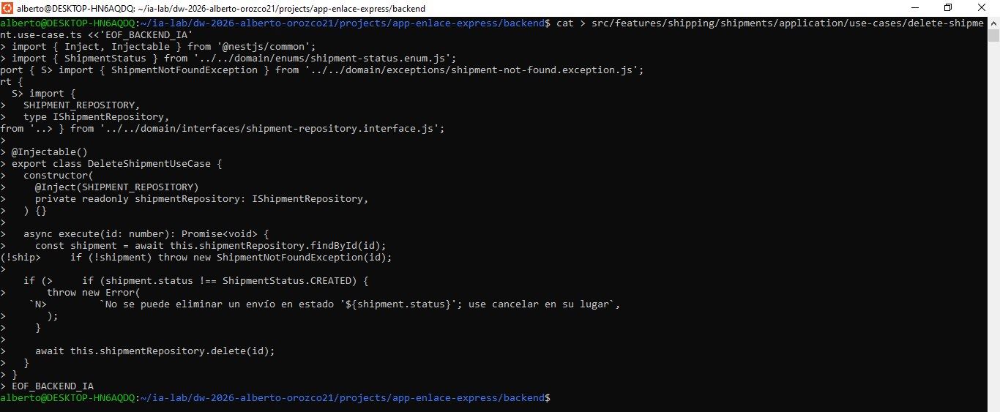

### 14.28 — features/shipping/shipments/presentation/http/serializers/shipment.serializer.ts

**Archivo:** `src/features/shipping/shipments/presentation/http/serializers/shipment.serializer.ts`

```bash
mkdir -p src/features/shipping/shipments/presentation/http/serializers
cat > src/features/shipping/shipments/presentation/http/serializers/shipment.serializer.ts <<'EOF_BACKEND_IA'
import { Shipment } from '../../../domain/entities/shipment.entity.js';
import { ShipmentResponseDto } from '../../../application/dto/shipment-response.dto.js';
import { ShipmentMapper } from '../../../application/mappers/shipment.mapper.js';

export class ShipmentSerializer {
  static serialize(entity: Shipment): ShipmentResponseDto {
    return ShipmentMapper.toResponse(entity);
  }
}
EOF_BACKEND_IA
```

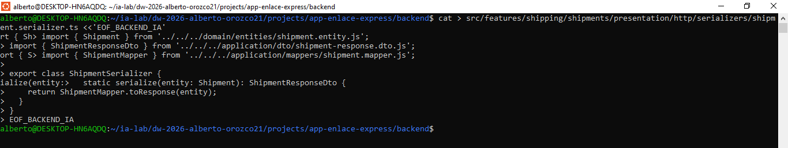

### 14.29 — features/shipping/shipments/presentation/http/controllers/shipments.controller.ts

CRUD estándar más cinco rutas de transición: `/quote`, `/assign`, `/start-transit`, `/report-issue`, `/deliver`, `/cancel`.

**Archivo:** `src/features/shipping/shipments/presentation/http/controllers/shipments.controller.ts`

```bash
mkdir -p src/features/shipping/shipments/presentation/http/controllers
cat > src/features/shipping/shipments/presentation/http/controllers/shipments.controller.ts <<'EOF_BACKEND_IA'
import {
  Body,
  Controller,
  Delete,
  Get,
  HttpCode,
  HttpStatus,
  Param,
  Patch,
  Post,
  Query,
} from '@nestjs/common';
import {
  ApiCreatedResponse,
  ApiNoContentResponse,
  ApiOkResponse,
  ApiOperation,
  ApiTags,
} from '@nestjs/swagger';
import { ParsePositiveIntPipe } from '../../../../../../common/pipes/parse-positive-int.pipe.js';
import { CreateShipmentDto } from '../../../application/dto/create-shipment.dto.js';
import { UpdateShipmentDto } from '../../../application/dto/update-shipment.dto.js';
import { AssignShipmentDto } from '../../../application/dto/assign-shipment.dto.js';
import { ShipmentFilterDto } from '../../../application/dto/shipment-filter.dto.js';
import { ShipmentResponseDto } from '../../../application/dto/shipment-response.dto.js';
import { CreateShipmentUseCase } from '../../../application/use-cases/create-shipment.use-case.js';
import { UpdateShipmentUseCase } from '../../../application/use-cases/update-shipment.use-case.js';
import { DeleteShipmentUseCase } from '../../../application/use-cases/delete-shipment.use-case.js';
import { GetShipmentUseCase } from '../../../application/use-cases/get-shipment.use-case.js';
import { ListShipmentsUseCase } from '../../../application/use-cases/list-shipments.use-case.js';
import { QuoteShipmentUseCase } from '../../../application/use-cases/quote-shipment.use-case.js';
import { AssignShipmentUseCase } from '../../../application/use-cases/assign-shipment.use-case.js';
import { StartTransitShipmentUseCase } from '../../../application/use-cases/start-transit-shipment.use-case.js';
import { ReportShipmentIssueUseCase } from '../../../application/use-cases/report-shipment-issue.use-case.js';
import { DeliverShipmentUseCase } from '../../../application/use-cases/deliver-shipment.use-case.js';
import { CancelShipmentUseCase } from '../../../application/use-cases/cancel-shipment.use-case.js';

@ApiTags('Shipments')
@Controller('shipments')
export class ShipmentsController {
  constructor(
    private readonly createShipmentUseCase: CreateShipmentUseCase,
    private readonly updateShipmentUseCase: UpdateShipmentUseCase,
    private readonly deleteShipmentUseCase: DeleteShipmentUseCase,
    private readonly getShipmentUseCase: GetShipmentUseCase,
    private readonly listShipmentsUseCase: ListShipmentsUseCase,
    private readonly quoteShipmentUseCase: QuoteShipmentUseCase,
    private readonly assignShipmentUseCase: AssignShipmentUseCase,
    private readonly startTransitShipmentUseCase: StartTransitShipmentUseCase,
    private readonly reportShipmentIssueUseCase: ReportShipmentIssueUseCase,
    private readonly deliverShipmentUseCase: DeliverShipmentUseCase,
    private readonly cancelShipmentUseCase: CancelShipmentUseCase,
  ) {}

  @Post()
  @ApiOperation({ summary: 'Crear un envío' })
  @ApiCreatedResponse({ type: ShipmentResponseDto })
  create(@Body() dto: CreateShipmentDto) {
    return this.createShipmentUseCase.execute(dto);
  }

  @Get()
  @ApiOperation({ summary: 'Listar envíos' })
  @ApiOkResponse({ type: [ShipmentResponseDto] })
  findAll(@Query() filter: ShipmentFilterDto) {
    return this.listShipmentsUseCase.execute(filter);
  }

  @Get(':id')
  @ApiOperation({ summary: 'Obtener un envío por ID' })
  @ApiOkResponse({ type: ShipmentResponseDto })
  findOne(@Param('id', ParsePositiveIntPipe) id: number) {
    return this.getShipmentUseCase.execute(id);
  }

  @Patch(':id')
  @ApiOperation({ summary: 'Actualizar datos comerciales (solo si está creado)' })
  @ApiOkResponse({ type: ShipmentResponseDto })
  update(
    @Param('id', ParsePositiveIntPipe) id: number,
    @Body() dto: UpdateShipmentDto,
  ) {
    return this.updateShipmentUseCase.execute(id, dto);
  }

  @Patch(':id/quote')
  @ApiOperation({ summary: 'Cotizar el envío (creado → cotizado)' })
  @ApiOkResponse({ type: ShipmentResponseDto })
  quote(@Param('id', ParsePositiveIntPipe) id: number) {
    return this.quoteShipmentUseCase.execute(id);
  }

  @Patch(':id/assign')
  @ApiOperation({ summary: 'Asignar mensajero y ruta (cotizado → asignado)' })
  @ApiOkResponse({ type: ShipmentResponseDto })
  assign(
    @Param('id', ParsePositiveIntPipe) id: number,
    @Body() dto: AssignShipmentDto,
  ) {
    return this.assignShipmentUseCase.execute(id, dto);
  }

  @Patch(':id/start-transit')
  @ApiOperation({ summary: 'Poner en ruta (asignado/con_novedad → en_ruta)' })
  @ApiOkResponse({ type: ShipmentResponseDto })
  startTransit(@Param('id', ParsePositiveIntPipe) id: number) {
    return this.startTransitShipmentUseCase.execute(id);
  }

  @Patch(':id/report-issue')
  @ApiOperation({ summary: 'Reportar novedad (en_ruta → con_novedad)' })
  @ApiOkResponse({ type: ShipmentResponseDto })
  reportIssue(@Param('id', ParsePositiveIntPipe) id: number) {
    return this.reportShipmentIssueUseCase.execute(id);
  }

  @Patch(':id/deliver')
  @ApiOperation({ summary: 'Marcar como entregado (en_ruta → entregado)' })
  @ApiOkResponse({ type: ShipmentResponseDto })
  deliver(@Param('id', ParsePositiveIntPipe) id: number) {
    return this.deliverShipmentUseCase.execute(id);
  }

  @Patch(':id/cancel')
  @ApiOperation({ summary: 'Cancelar el envío' })
  @ApiOkResponse({ type: ShipmentResponseDto })
  cancel(@Param('id', ParsePositiveIntPipe) id: number) {
    return this.cancelShipmentUseCase.execute(id);
  }

  @Delete(':id')
  @HttpCode(HttpStatus.NO_CONTENT)
  @ApiOperation({ summary: 'Eliminar un envío recién creado' })
  @ApiNoContentResponse()
  remove(@Param('id', ParsePositiveIntPipe) id: number) {
    return this.deleteShipmentUseCase.execute(id);
  }
}
EOF_BACKEND_IA
```

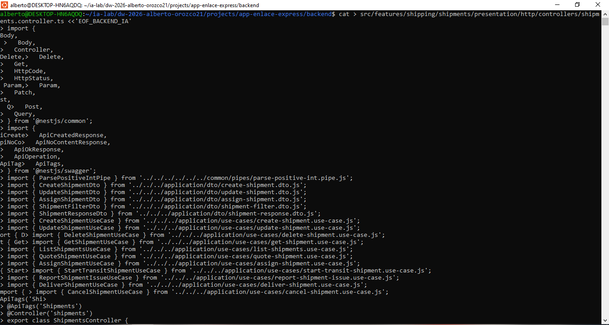

### 14.30 — features/shipping/shipments/index.ts

**Archivo:** `src/features/shipping/shipments/index.ts`

```bash
mkdir -p src/features/shipping/shipments
cat > src/features/shipping/shipments/index.ts <<'EOF_BACKEND_IA'
export { ShipmentsModule } from './shipments.module.js';
EOF_BACKEND_IA
```

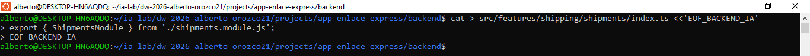

### 14.31 — features/shipping/shipments/shipments.module.ts

Importa seis módulos: Companies, Contacts, Addresses, Rates, Couriers y Routes — el precio de ser la entidad central.

**Archivo:** `src/features/shipping/shipments/shipments.module.ts`

```bash
mkdir -p src/features/shipping/shipments
cat > src/features/shipping/shipments/shipments.module.ts <<'EOF_BACKEND_IA'
import { Module } from '@nestjs/common';
import { CompaniesModule } from '../companies/companies.module.js';
import { ContactsModule } from '../contacts/contacts.module.js';
import { AddressesModule } from '../addresses/addresses.module.js';
import { RatesModule } from '../rates/rates.module.js';
import { CouriersModule } from '../couriers/couriers.module.js';
import { RoutesModule } from '../routes/routes.module.js';
import { SHIPMENT_REPOSITORY } from './domain/interfaces/shipment-repository.interface.js';
import { ShipmentRepository } from './infrastructure/persistence/repositories/shipment.repository.js';
import { CreateShipmentUseCase } from './application/use-cases/create-shipment.use-case.js';
import { UpdateShipmentUseCase } from './application/use-cases/update-shipment.use-case.js';
import { DeleteShipmentUseCase } from './application/use-cases/delete-shipment.use-case.js';
import { GetShipmentUseCase } from './application/use-cases/get-shipment.use-case.js';
import { ListShipmentsUseCase } from './application/use-cases/list-shipments.use-case.js';
import { QuoteShipmentUseCase } from './application/use-cases/quote-shipment.use-case.js';
import { AssignShipmentUseCase } from './application/use-cases/assign-shipment.use-case.js';
import { StartTransitShipmentUseCase } from './application/use-cases/start-transit-shipment.use-case.js';
import { ReportShipmentIssueUseCase } from './application/use-cases/report-shipment-issue.use-case.js';
import { DeliverShipmentUseCase } from './application/use-cases/deliver-shipment.use-case.js';
import { CancelShipmentUseCase } from './application/use-cases/cancel-shipment.use-case.js';
import { ShipmentsController } from './presentation/http/controllers/shipments.controller.js';

@Module({
  imports: [
    CompaniesModule,
    ContactsModule,
    AddressesModule,
    RatesModule,
    CouriersModule,
    RoutesModule,
  ],
  controllers: [ShipmentsController],
  providers: [
    ShipmentRepository,
    { provide: SHIPMENT_REPOSITORY, useExisting: ShipmentRepository },
    CreateShipmentUseCase,
    UpdateShipmentUseCase,
    DeleteShipmentUseCase,
    GetShipmentUseCase,
    ListShipmentsUseCase,
    QuoteShipmentUseCase,
    AssignShipmentUseCase,
    StartTransitShipmentUseCase,
    ReportShipmentIssueUseCase,
    DeliverShipmentUseCase,
    CancelShipmentUseCase,
  ],
  exports: [SHIPMENT_REPOSITORY],
})
export class ShipmentsModule {}
EOF_BACKEND_IA
```

**Sugerencia de commit (issue):**

```bash
git add .
git commit -m "feat: wire nest module shipments.module.ts"
```

#### 14.32 — Actualizar company.model.ts, courier.model.ts, route.model.ts, rate.model.ts e invoice.model.ts

Cierra las cinco asociaciones `1:N Envio` pendientes (`Empresa`, `Mensajero`, `Ruta`, `Tarifa`, `Factura`), todas con import estático hacia `ShipmentModel`.

**Archivo:** `src/features/shipping/companies/infrastructure/persistence/models/company.model.ts`

```bash
cat > src/features/shipping/companies/infrastructure/persistence/models/company.model.ts <<'EOF_BACKEND_IA'
import {
  AutoIncrement,
  Column,
  CreatedAt,
  DataType,
  HasMany,
  Model,
  PrimaryKey,
  Table,
  UpdatedAt,
} from 'sequelize-typescript';
import { ContactModel } from '../../../../contacts/infrastructure/persistence/models/contact.model.js';
import { AddressModel } from '../../../../addresses/infrastructure/persistence/models/address.model.js';
import { InvoiceModel } from '../../../../invoices/infrastructure/persistence/models/invoice.model.js';
import { ShipmentModel } from '../../../../shipments/infrastructure/persistence/models/shipment.model.js';

@Table({ tableName: 'companies' })
export class CompanyModel extends Model {
  @PrimaryKey
  @AutoIncrement
  @Column(DataType.INTEGER)
  declare id: number;

  @Column({ type: DataType.STRING(20), allowNull: false, unique: true })
  declare nit: string;

  @Column({ type: DataType.STRING(200), allowNull: false })
  declare razonSocial: string;

  @Column({ type: DataType.BOOLEAN, allowNull: false, defaultValue: true })
  declare isActive: boolean;

  @CreatedAt
  declare createdAt: Date;

  @UpdatedAt
  declare updatedAt: Date;

  @HasMany(() => ContactModel)
  declare contacts: ContactModel[];

  @HasMany(() => AddressModel)
  declare addresses: AddressModel[];

  @HasMany(() => InvoiceModel)
  declare invoices: InvoiceModel[];

  @HasMany(() => ShipmentModel)
  declare shipments: ShipmentModel[];
}
EOF_BACKEND_IA
```

**Archivo:** `src/features/shipping/couriers/infrastructure/persistence/models/courier.model.ts`

```bash
cat > src/features/shipping/couriers/infrastructure/persistence/models/courier.model.ts <<'EOF_BACKEND_IA'
import {
  AutoIncrement,
  Column,
  CreatedAt,
  DataType,
  HasMany,
  Model,
  PrimaryKey,
  Table,
  UpdatedAt,
} from 'sequelize-typescript';
import { VehicleType } from '../../../domain/enums/vehicle-type.enum.js';
import { RouteModel } from '../../../../routes/infrastructure/persistence/models/route.model.js';
import { ShipmentModel } from '../../../../shipments/infrastructure/persistence/models/shipment.model.js';

@Table({ tableName: 'couriers' })
export class CourierModel extends Model {
  @PrimaryKey
  @AutoIncrement
  @Column(DataType.INTEGER)
  declare id: number;

  @Column({ type: DataType.STRING(150), allowNull: false })
  declare name: string;

  @Column({ type: DataType.STRING(30), allowNull: false, unique: true })
  declare documentId: string;

  @Column({ type: DataType.STRING(30), allowNull: true })
  declare phone: string | null;

  @Column({
    type: DataType.ENUM(...Object.values(VehicleType)),
    allowNull: false,
  })
  declare vehicleType: VehicleType;

  @Column({ type: DataType.STRING(15), allowNull: true })
  declare licensePlate: string | null;

  @Column({ type: DataType.STRING(100), allowNull: true })
  declare assignedZone: string | null;

  @Column({ type: DataType.BOOLEAN, allowNull: false, defaultValue: true })
  declare isActive: boolean;

  @CreatedAt
  declare createdAt: Date;

  @UpdatedAt
  declare updatedAt: Date;

  @HasMany(() => RouteModel)
  declare routes: RouteModel[];

  @HasMany(() => ShipmentModel)
  declare shipments: ShipmentModel[];
}
EOF_BACKEND_IA
```

**Archivo:** `src/features/shipping/routes/infrastructure/persistence/models/route.model.ts`

```bash
cat > src/features/shipping/routes/infrastructure/persistence/models/route.model.ts <<'EOF_BACKEND_IA'
import {
  AutoIncrement,
  BelongsTo,
  Column,
  CreatedAt,
  DataType,
  ForeignKey,
  HasMany,
  Model,
  PrimaryKey,
  Table,
  UpdatedAt,
} from 'sequelize-typescript';
import { CourierModel } from '../../../../couriers/infrastructure/persistence/models/courier.model.js';
import { ShipmentModel } from '../../../../shipments/infrastructure/persistence/models/shipment.model.js';
import { RouteStatus } from '../../../domain/enums/route-status.enum.js';

@Table({ tableName: 'routes' })
export class RouteModel extends Model {
  @PrimaryKey
  @AutoIncrement
  @Column(DataType.INTEGER)
  declare id: number;

  @ForeignKey(() => CourierModel)
  @Column({ type: DataType.INTEGER, allowNull: false })
  declare courierId: number;

  @BelongsTo(() => CourierModel)
  declare courier: CourierModel;

  @Column({ type: DataType.STRING(150), allowNull: false })
  declare name: string;

  @Column({ type: DataType.STRING(100), allowNull: true })
  declare coverageZone: string | null;

  @Column({ type: DataType.DATEONLY, allowNull: false })
  declare date: string;

  @Column({ type: DataType.DATE, allowNull: false })
  declare startTime: Date;

  @Column({ type: DataType.DATE, allowNull: true })
  declare endTime: Date | null;

  @Column({
    type: DataType.ENUM(...Object.values(RouteStatus)),
    allowNull: false,
    defaultValue: RouteStatus.PLANNED,
  })
  declare status: RouteStatus;

  @Column({ type: DataType.BOOLEAN, allowNull: false, defaultValue: true })
  declare isActive: boolean;

  @CreatedAt
  declare createdAt: Date;

  @UpdatedAt
  declare updatedAt: Date;

  @HasMany(() => ShipmentModel)
  declare shipments: ShipmentModel[];
}
EOF_BACKEND_IA
```

**Archivo:** `src/features/shipping/rates/infrastructure/persistence/models/rate.model.ts`

```bash
cat > src/features/shipping/rates/infrastructure/persistence/models/rate.model.ts <<'EOF_BACKEND_IA'
import {
  AutoIncrement,
  Column,
  CreatedAt,
  DataType,
  HasMany,
  Model,
  PrimaryKey,
  Table,
  UpdatedAt,
} from 'sequelize-typescript';
import { RateCalculationRule } from '../../../domain/enums/rate-calculation-rule.enum.js';
import { ShipmentModel } from '../../../../shipments/infrastructure/persistence/models/shipment.model.js';

@Table({ tableName: 'rates' })
export class RateModel extends Model {
  @PrimaryKey
  @AutoIncrement
  @Column(DataType.INTEGER)
  declare id: number;

  @Column({ type: DataType.STRING(150), allowNull: false })
  declare name: string;

  @Column({ type: DataType.STRING(100), allowNull: true })
  declare zone: string | null;

  @Column({
    type: DataType.ENUM(...Object.values(RateCalculationRule)),
    allowNull: false,
  })
  declare calculationRule: RateCalculationRule;

  @Column({ type: DataType.DECIMAL(12, 2), allowNull: false })
  declare baseValue: number;

  @Column({ type: DataType.DECIMAL(12, 2), allowNull: false, defaultValue: 0 })
  declare additionalValuePerKg: number;

  @Column({ type: DataType.DECIMAL(5, 2), allowNull: false, defaultValue: 0 })
  declare urgentSurchargePct: number;

  @Column({ type: DataType.DATEONLY, allowNull: false })
  declare validFrom: string;

  @Column({ type: DataType.DATEONLY, allowNull: true })
  declare validUntil: string | null;

  @Column({ type: DataType.BOOLEAN, allowNull: false, defaultValue: true })
  declare isActive: boolean;

  @CreatedAt
  declare createdAt: Date;

  @UpdatedAt
  declare updatedAt: Date;

  @HasMany(() => ShipmentModel)
  declare shipments: ShipmentModel[];
}
EOF_BACKEND_IA
```

**Archivo:** `src/features/shipping/invoices/infrastructure/persistence/models/invoice.model.ts`

```bash
cat > src/features/shipping/invoices/infrastructure/persistence/models/invoice.model.ts <<'EOF_BACKEND_IA'
import {
  AutoIncrement,
  BelongsTo,
  Column,
  CreatedAt,
  DataType,
  ForeignKey,
  HasMany,
  Model,
  PrimaryKey,
  Table,
  UpdatedAt,
} from 'sequelize-typescript';
import { CompanyModel } from '../../../../companies/infrastructure/persistence/models/company.model.js';
import { ShipmentModel } from '../../../../shipments/infrastructure/persistence/models/shipment.model.js';
import { InvoiceStatus } from '../../../domain/enums/invoice-status.enum.js';

@Table({ tableName: 'invoices' })
export class InvoiceModel extends Model {
  @PrimaryKey
  @AutoIncrement
  @Column(DataType.INTEGER)
  declare id: number;

  @ForeignKey(() => CompanyModel)
  @Column({ type: DataType.INTEGER, allowNull: false })
  declare companyId: number;

  @BelongsTo(() => CompanyModel)
  declare company: CompanyModel;

  @Column({ type: DataType.STRING(30), allowNull: false, unique: true })
  declare number: string;

  @Column({ type: DataType.DATEONLY, allowNull: false })
  declare periodStart: string;

  @Column({ type: DataType.DATEONLY, allowNull: false })
  declare periodEnd: string;

  @Column({ type: DataType.DATEONLY, allowNull: false })
  declare issueDate: string;

  @Column({ type: DataType.DECIMAL(14, 2), allowNull: false })
  declare subtotal: number;

  @Column({ type: DataType.DECIMAL(14, 2), allowNull: false })
  declare taxes: number;

  @Column({ type: DataType.DECIMAL(14, 2), allowNull: false })
  declare total: number;

  @Column({
    type: DataType.ENUM(...Object.values(InvoiceStatus)),
    allowNull: false,
    defaultValue: InvoiceStatus.PENDING,
  })
  declare status: InvoiceStatus;

  @Column({ type: DataType.DATE, allowNull: true })
  declare paymentDate: Date | null;

  @CreatedAt
  declare createdAt: Date;

  @UpdatedAt
  declare updatedAt: Date;

  @HasMany(() => ShipmentModel)
  declare shipments: ShipmentModel[];
}
EOF_BACKEND_IA
```

**Sugerencia de commit (issue):**

```bash
git add .
git commit -m "feat: close shipments HasMany association on company, courier, route, rate and invoice models"
```

#### 14.33 — Actualizar sequelize.factory.ts (registrar ShipmentModel)

**Archivo:** `src/infrastructure/database/sequelize/sequelize.factory.ts`

```bash
mkdir -p src/infrastructure/database/sequelize
cat > src/infrastructure/database/sequelize/sequelize.factory.ts <<'EOF_BACKEND_IA'
import { Sequelize } from 'sequelize-typescript';
import { DatabaseDialect } from '../../../config/environment/env.interface.js';
import { getSequelizeOptions } from './sequelize.options.js';

import { CompanyModel } from '../../../features/shipping/companies/infrastructure/persistence/models/company.model.js';
import { ContactModel } from '../../../features/shipping/contacts/infrastructure/persistence/models/contact.model.js';
import { AddressModel } from '../../../features/shipping/addresses/infrastructure/persistence/models/address.model.js';
import { RateModel } from '../../../features/shipping/rates/infrastructure/persistence/models/rate.model.js';
import { CourierModel } from '../../../features/shipping/couriers/infrastructure/persistence/models/courier.model.js';
import { RouteModel } from '../../../features/shipping/routes/infrastructure/persistence/models/route.model.js';
import { InvoiceModel } from '../../../features/shipping/invoices/infrastructure/persistence/models/invoice.model.js';
import { ShipmentModel } from '../../../features/shipping/shipments/infrastructure/persistence/models/shipment.model.js';

export const ALL_MODELS = [
  CompanyModel,
  ContactModel,
  AddressModel,
  RateModel,
  CourierModel,
  RouteModel,
  InvoiceModel,
  ShipmentModel,
];

async function loadDialectModule(moduleName: string): Promise<any> {
  // Proyecto ESM: require() no existe como global, se usa import() dinámico.
  const mod: any = await import(moduleName);
  return mod.default ?? mod;
}

export async function createSequelizeInstance(
  dialect: DatabaseDialect,
): Promise<Sequelize> {
  const options = getSequelizeOptions(dialect);

  let dialectModule: any;

  switch (dialect) {
    case DatabaseDialect.MySQL:
      dialectModule = await loadDialectModule('mysql2');
      break;
    case DatabaseDialect.Postgres:
      dialectModule = await loadDialectModule('pg');
      break;
    case DatabaseDialect.MSSQL:
      dialectModule = await loadDialectModule('tedious');
      break;
    case DatabaseDialect.Oracle:
      dialectModule = await loadDialectModule('oracledb');
      break;
    default:
      throw new Error(`Dialecto no soportado: ${dialect}`);
  }

  const sequelize = new Sequelize({
    ...options,
    dialectModule,
    models: ALL_MODELS,
  } as any);

  try {
    await sequelize.authenticate();
    console.log(`✅ Conexión exitosa a ${dialect.toUpperCase()}`);
  } catch (error: any) {
    console.error(
      `❌ Error conectando a ${dialect.toUpperCase()}:`,
      error.message,
    );
    throw error;
  }

  if (process.env.NODE_ENV !== 'production') {
    await sequelize.sync({ alter: false });
    console.log('✅ Tablas sincronizadas');
  }

  return sequelize;
}
EOF_BACKEND_IA
```

**Sugerencia de commit (issue):**

```bash
git add .
git commit -m "feat: register ShipmentModel in sequelize factory"
```

#### 14.34 — Actualizar shipping.module.ts

**Archivo:** `src/features/shipping/shipping.module.ts`

```bash
mkdir -p src/features/shipping
cat > src/features/shipping/shipping.module.ts <<'EOF_BACKEND_IA'
import { Module } from '@nestjs/common';
import { CompaniesModule } from './companies/companies.module.js';
import { ContactsModule } from './contacts/contacts.module.js';
import { AddressesModule } from './addresses/addresses.module.js';
import { RatesModule } from './rates/rates.module.js';
import { CouriersModule } from './couriers/couriers.module.js';
import { RoutesModule } from './routes/routes.module.js';
import { InvoicesModule } from './invoices/invoices.module.js';
import { ShipmentsModule } from './shipments/shipments.module.js';

@Module({
  imports: [
    CompaniesModule,
    ContactsModule,
    AddressesModule,
    RatesModule,
    CouriersModule,
    RoutesModule,
    InvoicesModule,
    ShipmentsModule,
  ],
  exports: [
    CompaniesModule,
    ContactsModule,
    AddressesModule,
    RatesModule,
    CouriersModule,
    RoutesModule,
    InvoicesModule,
    ShipmentsModule,
  ],
})
export class ShippingModule {}
EOF_BACKEND_IA
```

**Sugerencia de commit (issue):**

```bash
git add .
git commit -m "feat: export ShipmentsModule from ShippingModule"
```

#### 14.35 — Actualizar database-seeder.service.ts y verificar tabla `shipments` + máquina de estados

**Archivo:** `src/infrastructure/database/seeders/database-seeder.service.ts`

```bash
mkdir -p src/infrastructure/database/seeders
cat > src/infrastructure/database/seeders/database-seeder.service.ts <<'EOF_BACKEND_IA'
import { Injectable, Logger, OnModuleInit } from '@nestjs/common';
import { seedCompanies } from '../../../features/shipping/companies/infrastructure/persistence/seeders/companies.seeder.js';
import { seedContacts } from '../../../features/shipping/contacts/infrastructure/persistence/seeders/contacts.seeder.js';
import { seedAddresses } from '../../../features/shipping/addresses/infrastructure/persistence/seeders/addresses.seeder.js';
import { seedRates } from '../../../features/shipping/rates/infrastructure/persistence/seeders/rates.seeder.js';
import { seedCouriers } from '../../../features/shipping/couriers/infrastructure/persistence/seeders/couriers.seeder.js';
import { seedRoutes } from '../../../features/shipping/routes/infrastructure/persistence/seeders/routes.seeder.js';
import { seedInvoices } from '../../../features/shipping/invoices/infrastructure/persistence/seeders/invoices.seeder.js';
import { seedShipments } from '../../../features/shipping/shipments/infrastructure/persistence/seeders/shipments.seeder.js';

/**
 * Ejecuta seeders en orden de dependencias.
 * Solo en entornos no productivos.
 */
@Injectable()
export class DatabaseSeederService implements OnModuleInit {
  private readonly logger = new Logger(DatabaseSeederService.name);

  async onModuleInit(): Promise<void> {
    if (process.env.NODE_ENV === 'production') {
      return;
    }

    try {
      await seedCompanies();
      await seedContacts();
      await seedAddresses();
      await seedRates();
      await seedCouriers();
      await seedRoutes();
      await seedInvoices();
      await seedShipments();
      this.logger.log('✅ Seeders ejecutados');
    } catch (error: any) {
      this.logger.error(`❌ Error en seeders: ${error.message}`, error.stack);
      throw error;
    }
  }
}
EOF_BACKEND_IA
```

`app.module.ts` no necesita cambios: `ShippingModule` ya expone `ShipmentsModule`.

Arranca la app y recorre la máquina de estados completa contra un envío del seeder:

```bash
npm run start:dev
```

1. `PATCH /api/shipments/:id/quote` → `creado → cotizado`, revisa que `calculatedCost` se haya llenado.
2. `PATCH /api/shipments/:id/assign` con `{courierId, routeId}` → `cotizado → asignado` (usa un mensajero y una ruta reales del seeder; prueba con una ruta de otro mensajero para confirmar que falla).
3. `PATCH /api/shipments/:id/start-transit` → `asignado → en_ruta`.
4. `PATCH /api/shipments/:id/report-issue` → `en_ruta → con_novedad`, luego `start-transit` de nuevo → `con_novedad → en_ruta`.
5. `PATCH /api/shipments/:id/deliver` → `en_ruta → entregado`.
6. Confirma que `PATCH /api/shipments/:id/cancel` sobre ese mismo envío ya entregado falla (400).

**Sugerencia de commit (issue):**

```bash
git add .
git commit -m "chore: run seedShipments and verify full shipment state machine"
```
