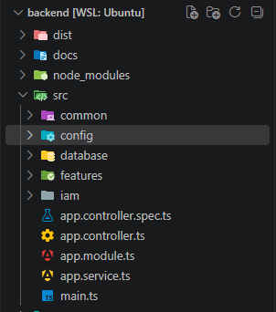
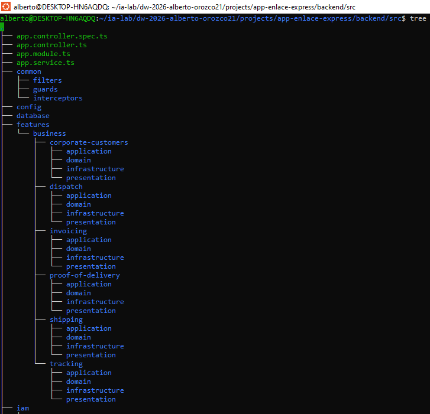
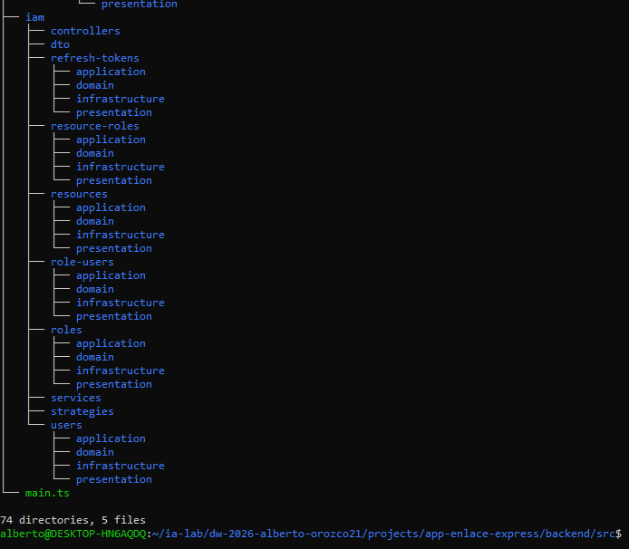
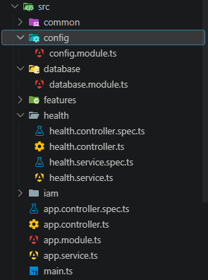
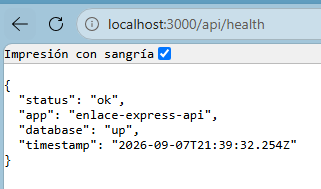

# Manual de construcción de EnlaceExpress con NestJS

## Semana 04 · MIRIA + SDD + Kanban

Este documento guía la construcción del backend NestJS + Sequelize de **EnlaceExpress** desde WSL. La meta no es crear CRUD aislados: se debe demostrar una capacidad funcional integrada, en la que autenticación y RBAC protegen los casos de uso, el catálogo de empresas/tarifas alimenta la cotización, el envío coordina paquetes y tracking, y la entrega verificada habilita la facturación.

El backend se construye en esta semana junto con su primera rebanada vertical. El frontend queda para la Unidad 03. Los motores de base de datos permanecen dockerizados y el backend se conecta por la IP del host, usando un usuario remoto de privilegios mínimos.

## 1. Resultado esperado

Al terminar, debo poder demostrar este flujo:

`login → JWT/RBAC → Empresa (+Contacto+Direccion) → Tarifa → Envio+Paquete (cotización) → asignación (Mensajero/Ruta) → EventoTracking → PruebaEntrega (entrega) → Factura (consolidación) → respuesta y evidencia`

También debo demostrar los rechazos: `401` sin autenticación, `403` sin permiso, empresa/dirección/tarifa inválida, transición de estado de `Envio` inválida, intento de marcar `ENTREGADO` sin `PruebaEntrega`, y rollback sin datos parciales al cotizar un envío con paquetes.

## 2. Preparación MIRIA

Antes de abrir la terminal, registrar en `backend/docs/sdd.md`:

| **Elemento** | **Decisión para EnlaceExpress** |
|--------------|---------------------------------|
| M1 | Semana 04: arquitectura por capas y primera capacidad. |
| Objetivo | Construir y explicar una rebanada vertical funcional del backend de mensajería corporativa. |
| Entidades | Empresa, Contacto, Direccion, Envio, Paquete, EventoTracking, Mensajero, Ruta, Tarifa, PruebaEntrega, Factura, User, Role, RoleUser, Resource, ResourceRole, RefreshToken. |
| M2 | Campos, invariantes, relaciones, casos de uso, REQ, AC, errores, permisos y contratos. |
| M3 | Issues dependientes, WIP=1, DoR, DoD, pruebas previstas e incidentes. |
| M4 | IA autorizada solo como apoyo; toda salida se revisa, adapta y registra. |
| M5 | Pruebas de dominio, aplicación, adaptadores, API, integración y seguridad. |
| M6 | Gate, evidencias, reflexión y mejora. |

## 3. Crear la carpeta del proyecto en WSL

En WSL, ubícate en la carpeta donde guardas los proyectos y ejecuta:

```bash
mkdir projects/app-enlace-express
cd projects/app-enlace-express
mkdir backend
cd backend
mkdir docs
printf '# SDD EnlaceExpress\\n' > docs/sdd.md
printf '# Kanban EnlaceExpress\\n' > docs/kanban.md
printf '# Proceso y decisiones\\n' > docs/proceso.md
mkdir evidencias
```


Registra en `docs/proceso.md` la fecha, distribución de WSL, versión de Node y la salida de cada comando:

```bash
cat /etc/os-release
pwd
node --version
npm --version
git --version
```

## 4. Crear el backend NestJS

Node ya está instalado. Instala la CLI y crea el backend directamente en WSL:

```bash
npm install --global @nestjs/cli
nest --version
cd projects/app-enlace-express/backend
nest new . --strict --package-manager npm
npm run start:dev
```


Abre otra terminal WSL y verifica:

```bash
curl http://localhost:3000
```

**Respuesta correcta**


## 5. Instalar dependencias del backend

Usaremos Sequelize como ORM y `sequelize-typescript` para mapear modelos TypeScript. El motor se selecciona mediante `DB_DIALECT` en `.env`; el mismo backend puede trabajar con MySQL, PostgreSQL, Microsoft SQL Server u Oracle sin cambiar el dominio ni los casos de uso.

```bash
npm install @nestjs/config @nestjs/sequelize sequelize sequelize-typescript class-validator class-transformer
npm install @nestjs/swagger swagger-ui-express helmet
npm install @nestjs/jwt passport passport-jwt @nestjs/passport bcrypt
npm install --save-dev @types/bcrypt @types/passport-jwt
```

Controlador según motor:

```bash
# MySQL
npm install mysql2

# PostgreSQL
npm install pg

# Microsoft SQL Server (conector usado por Sequelize)
npm install tedious

# Oracle
npm install oracledb
```

Instala el controlador correspondiente al motor elegido; en una instalación real no es obligatorio instalar los cuatro. Para Oracle, `oracledb` puede requerir las bibliotecas cliente de Oracle en WSL según el modo de conexión.

Registra en `docs/proceso.md` la opción escogida y justifica por qué corresponde al motor de la Semana 02.

## 6. Configurar la conexión remota a la base de datos

Crea `.env.example` y copia una versión local:

```bash
cat > .env.example <<'EOF'
APP_PORT=3000
DB_DIALECT=mysql
DB_HOST=IP_DEL_HOST
DB_PORT=3306
DB_USERNAME=usuario_remoto
DB_PASSWORD=CAMBIAR_LOCALMENTE
DB_NAME=storelab
DB_SCHEMA=
DB_CONNECT_STRING=
JWT_SECRET=CAMBIAR_LOCALMENTE
JWT_EXPIRES_IN=15m
EOF
cp .env.example .env
```

Edita `.env` con la IP real del host, el motor y el puerto correspondiente. Valores válidos para `DB_DIALECT`: `mysql`, `postgres`, `mssql` u `oracle`. En Oracle, `DB_CONNECT_STRING` puede contener el servicio o connect descriptor requerido por el listener.

```env
# Selecciona un solo bloque según el motor asignado
DB_DIALECT=mysql
DB_PORT=3306
# DB_DIALECT=postgres
# DB_PORT=5432
# DB_DIALECT=mssql
# DB_PORT=1433
# DB_DIALECT=oracle
# DB_PORT=1521
```

No publiques `.env` ni escribas contraseñas en la bitácora:

```bash
printf '\n.env\n' >> .gitignore
```

Prueba la conectividad desde WSL con el cliente disponible para tu motor. Si falla, revisa primero IP, puerto, usuario remoto, firewall y configuración de red del contenedor. No cambies código NestJS para ocultar un problema de red.

## 7. Organizar la arquitectura por capas

Crea carpetas explícitas y deja constancia de su responsabilidad:

```bash
mkdir -p src/config src/common/{filters,interceptors,guards} src/database
mkdir -p src/features/business/corporate-customers/{domain,application,infrastructure,presentation}
mkdir -p src/features/business/shipping/{domain,application,infrastructure,presentation}
mkdir -p src/features/business/dispatch/{domain,application,infrastructure,presentation}
mkdir -p src/features/business/tracking/{domain,application,infrastructure,presentation}
mkdir -p src/features/business/proof-of-delivery/{domain,application,infrastructure,presentation}
mkdir -p src/features/business/invoicing/{domain,application,infrastructure,presentation}
mkdir -p src/iam/{users,roles,role-users,resources,resource-roles,refresh-tokens}/{domain,application,infrastructure,presentation}
mkdir -p src/iam/{services,controllers,dto,strategies}
```

Regla de dependencia — tres capas centrales y un adaptador externo:

`presentation → application → domain` y `infrastructure/Sequelize → puertos definidos por application/domain`.

Cada proceso de cada entidad debe mostrar las tres capas centrales: (1) regla y entidad en Domain — por ejemplo, la máquina de estados de `Envio` vive aquí, no en un controlador; (2) caso de uso y puerto en Application — por ejemplo `CotizarEnvioUseCase`, `AsignarMensajeroUseCase`, `RegistrarPruebaEntregaUseCase`; (3) DTO/controlador/contrato en Presentation. Infrastructure no es una cuarta capa de negocio: implementa repositorios, modelos y transacciones Sequelize sin contaminar el dominio.

El dominio no importa NestJS, Sequelize, HTTP ni variables de entorno. Los DTO, controladores, modelos Sequelize, repositorios ORM y guards pertenecen a las capas externas.

**Evidencia:**

 





## 8. Crear la base técnica antes del negocio

Genera configuración, salud y documentación:

```bash
nest g module config
nest g module database
nest g controller health
nest g service health
```

**Evidencia:**



En `src/config/database.config.ts`:

```ts
import { registerAs } from '@nestjs/config';

const allowedDialects = ['mysql', 'postgres', 'mssql', 'oracle'] as const;
export type AllowedDialect = (typeof allowedDialects)[number];

export default registerAs('database', () => {
  const dialect = process.env.DB_DIALECT;
  if (!dialect || !allowedDialects.includes(dialect as AllowedDialect)) {
    throw new Error('DB_DIALECT debe ser mysql, postgres, mssql u oracle');
  }
  return {
    dialect: dialect as AllowedDialect,
    host: process.env.DB_HOST,
    port: Number(process.env.DB_PORT),
    username: process.env.DB_USERNAME,
    password: process.env.DB_PASSWORD,
    database: process.env.DB_NAME,
  };
});
```

En `src/database/database.module.ts`:

```ts
import { Module } from '@nestjs/common';
import { SequelizeModule } from '@nestjs/sequelize';
import { ConfigModule, ConfigService } from '@nestjs/config';
import databaseConfig from '../config/database.config.js';

@Module({
  imports: [
    SequelizeModule.forRootAsync({
      imports: [ConfigModule.forFeature(databaseConfig)],
      inject: [ConfigService],
      useFactory: (config: ConfigService) => {
        const db = config.get('database');
        return {
          dialect: db.dialect,
          host: db.host,
          port: db.port,
          username: db.username,
          password: db.password,
          database: db.database,
          autoLoadModels: true,
          synchronize: false, // sin modelos todavía — se activa consciente y documentado cuando lleguen los primeros modelos de dominio
        };
      },
    }),
  ],
  exports: [SequelizeModule],
})
export class DatabaseModule {}
```

En `src/app.module.ts`:

```ts
import { Module } from '@nestjs/common';
import { ConfigModule } from '@nestjs/config';
import { DatabaseModule } from './database/database.module';
import { HealthController } from './health/health.controller';
import { HealthService } from './health/health.service';

@Module({
  imports: [
    ConfigModule.forRoot({ isGlobal: true }),
    DatabaseModule,
  ],
  controllers: [HealthController],
  providers: [HealthService],
})
export class AppModule {}
```

En `src/health/health.service.ts`:

```ts
import { Injectable } from '@nestjs/common';
import { InjectConnection } from '@nestjs/sequelize';
import { Sequelize } from 'sequelize-typescript';

@Injectable()
export class HealthService {
  constructor(@InjectConnection() private readonly sequelize: Sequelize) {}

  async check() {
    let database: 'up' | 'down' = 'down';
    try {
      await this.sequelize.authenticate();
      database = 'up';
    } catch {
      database = 'down';
    }
    return {
      status: database === 'up' ? 'ok' : 'degraded',
      app: 'enlace-express-api',
      database,
      timestamp: new Date().toISOString(),
    };
  }
}
```

En `src/health/health.controller.ts`:

```ts
import { Controller, Get } from '@nestjs/common';
import { HealthService } from './health.service.js';

@Controller('health')
export class HealthController {
  constructor(private readonly healthService: HealthService) {}

  @Get()
  check() {
    return this.healthService.check();
  }
}
```

El `src/main.ts`:

```ts
import { NestFactory } from '@nestjs/core';
import { ValidationPipe } from '@nestjs/common';
import helmet from 'helmet';
import { DocumentBuilder, SwaggerModule } from '@nestjs/swagger';
import { AppModule } from './app.module.js';

async function bootstrap() {
  const app = await NestFactory.create(AppModule);

  app.setGlobalPrefix('api');
  app.use(helmet());
  app.useGlobalPipes(
    new ValidationPipe({ whitelist: true, forbidNonWhitelisted: true, transform: true }),
  );

  const config = new DocumentBuilder()
    .setTitle('EnlaceExpress API')
    .setDescription('Mensajería corporativa — envíos, tracking, tarifas, facturación')
    .setVersion('1.0')
    .build();
  const document = SwaggerModule.createDocument(app, config);
  SwaggerModule.setup('api/docs', app, document);

  await app.listen(process.env.APP_PORT ?? 3000);
}
bootstrap();
```

**Verificación:**

```bash
npm run start:dev
curl http://localhost:3000/api/health
```

