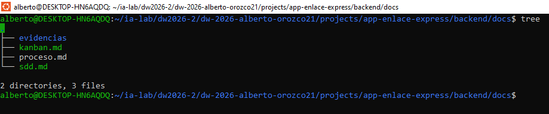
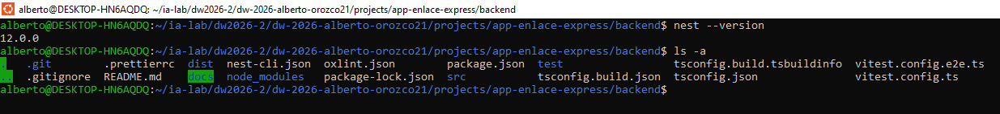
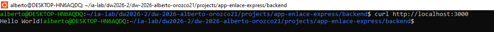

# Manual de construcción de EnlaceExpress con NestJS

## Semana 04 · MIRIA + SDD + Kanban

Este documento guía la construcción del backend NestJS + Sequelize de **EnlaceExpress** desde WSL. La meta no es crear CRUD aislados: se debe demostrar una capacidad funcional integrada, en la que autenticación y RBAC protegen los casos de uso, el catálogo de empresas/tarifas alimenta la cotización, el envío coordina paquetes y tracking, y la entrega verificada habilita la facturación.

El backend se construye en esta semana junto con su primera rebanada vertical. El frontend queda para la Unidad 03. Los motores de base de datos permanecen dockerizados y el backend se conecta por la IP del host, usando un usuario remoto de privilegios mínimos.

## 1. Resultado esperado

Al terminar, debo poder demostrar este flujo:

`login → JWT/RBAC → Empresa (+Contacto+Direccion) → Tarifa → Envio+Paquete (cotización) → asignación (Mensajero/Ruta) → EventoTracking → PruebaEntrega (entrega) → Factura (consolidación) → respuesta y evidencia`

También debo demostrar los rechazos: `401` sin autenticación, `403` sin permiso, empresa/dirección/tarifa inválida, transición de estado de `Envio` inválida, intento de marcar `ENTREGADO` sin `PruebaEntrega`, y rollback sin datos parciales al cotizar un envío con paquetes.

## 2. Preparación MIRIA

Antes de abrir la terminal, registrar en `backend/docs/sdd.md`:

| **Elemento** | **Decisión para EnlaceExpress** |
|--------------|---------------------------------|
| M1 | Semana 04: arquitectura por capas y primera capacidad. |
| Objetivo | Construir y explicar una rebanada vertical funcional del backend de mensajería corporativa. |
| Entidades | Empresa, Contacto, Direccion, Envio, Paquete, EventoTracking, Mensajero, Ruta, Tarifa, PruebaEntrega, Factura, User, Role, RoleUser, Resource, ResourceRole, RefreshToken. |
| M2 | Campos, invariantes, relaciones, casos de uso, REQ, AC, errores, permisos y contratos. |
| M3 | Issues dependientes, WIP=1, DoR, DoD, pruebas previstas e incidentes. |
| M4 | IA autorizada solo como apoyo; toda salida se revisa, adapta y registra. |
| M5 | Pruebas de dominio, aplicación, adaptadores, API, integración y seguridad. |
| M6 | Gate, evidencias, reflexión y mejora. |

## 3. Crear la carpeta del proyecto en WSL

En WSL, ubícate en la carpeta donde guardas los proyectos y ejecuta:

```bash
mkdir projects/app-enlace-express
cd projects/app-enlace-express
mkdir backend
cd backend
mkdir docs
printf '# SDD EnlaceExpress\\n' > docs/sdd.md
printf '# Kanban EnlaceExpress\\n' > docs/kanban.md
printf '# Proceso y decisiones\\n' > docs/proceso.md
mkdir evidencias
```



Registra en `docs/proceso.md` la fecha, distribución de WSL, versión de Node y la salida de cada comando:

```bash
cat /etc/os-release
pwd
node --version
npm --version
git --version
```

## 4. Crear el backend NestJS

Node ya está instalado. Instala la CLI y crea el backend directamente en WSL:

```bash
npm install --global @nestjs/cli
nest --version
cd projects/app-enlace-express/backend
nest new . --strict --package-manager npm
npm run start:dev
```



Abre otra terminal WSL y verifica:

```bash
curl http://localhost:3000
```

**Respuesta correcta**

